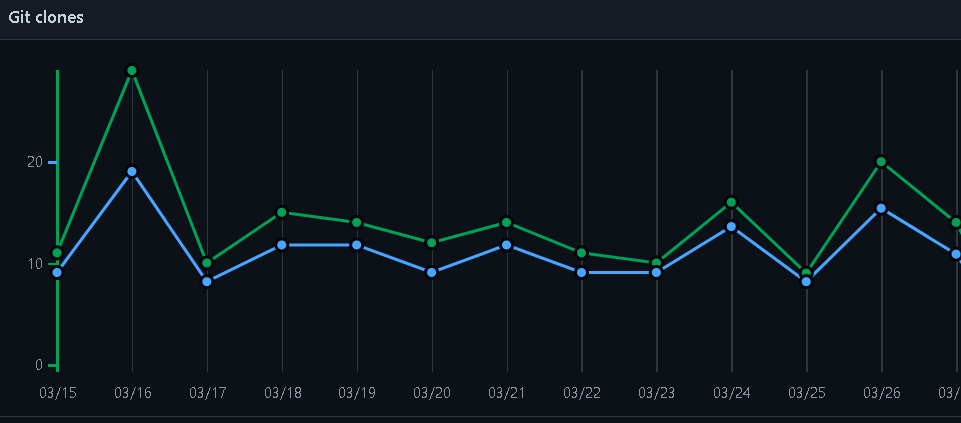

<!-- HEADER -->
<div align="center">

  <!-- SHIELDS -->
  <!-- For how-to notes on shield badges, see docs: https://shields.io/ -->


 
 
 
 
 </div>


[](https://app.netlify.com/sites/trusting-dijkstra-4d3b17/deploys)

[Deployment](https://trusting-dijkstra-4d3b17.netlify.app/)


[github-pages](https://bgoonz.github.io/DS-ALGO-OFFICIAL/)

[vercel](https://ds-algo-official-hm2a9mlnr-bgoonz.vercel.app/)

[Navigation](https://pensive-meitner-1ea8c4.netlify.app/directory.html)

[npm](https://www.npmjs.com/package/ds-algo-study)


[](#the-idea-behind-big-o-notation)


# ➤ Author:Bryan Guner


[](#the-idea-behind-big-o-notation)

# Clones: 185 to date



[](#the-idea-behind-big-o-notation)

## ➤ The idea behind big O notation

**Big O notation is the language we use for talking about how long an
algorithm takes to run**. It's how we compare the efficiency of
different approaches to a problem.

With big O notation we express the runtime in terms of

### how quickly it grows relative to the input, as the input gets arbitrarily large_.

1.  **how quickly the runtime grows**—

It's hard to pin down the _exact runtime_ of an algorithm. 

* It depends on the speed of the processor, 
* what else the computer is running, etc.

 So instead of talking about the runtime directly, we use big O notation to talk about _how quickly the runtime grows_.

2.  **relative to the input**—If we were measuring our runtime directly, 

we could express our speed in seconds. Since we're measuring _how quickly our runtime grows_, we need to express our speed in terms of...something else. With Big O notation, we use the size of the input, which we call "n." So we can say things like the runtime grows "on the order of the size of the input" () or "on the order of the square of the size of the input" (). 

3.  **as the input gets arbitrarily large**—

  Our algorithm may have steps that seem expensive when n is small but are eclipsed eventually by other steps as n gets huge. For big O analysis, we care most about the stuff that grows fastest as the input grows, because everything else is quickly eclipsed as n gets very large. (If you know what an asymptote is, you might see why "big O analysis" is sometimes called "asymptotic analysis.")hy "big O analysis" is sometimes called

    "asymptotic analysis.")

---


---


---
---
---


[](#data-structures-reference)

# ➤ Data Structures Reference


---


[](#array)

## ➤ Array

Stores things in order. Has quick lookups by index.


[](#linked-list)

## ➤ Linked List


Also stores things in order. Faster insertions and deletions than
arrays, but slower lookups (you have to "walk down" the whole list).

!


[](#queue)

## ➤ Queue

Like the line outside a busy restaurant. "First come, first served."
[](linked-list.png)


[](#stack)

## ➤ Stack


Like a stack of dirty plates in the sink. The first one you take off the
top is the last one you put down.


[](#tree)

## ➤ Tree

Good for storing hierarchies. Each node can have "child" nodes.


[](#binary-search-tree)

## ➤ Binary Search Tree

Everything in the left subtree is smaller than the current node, 
everything in the right subtree is larger. lookups, but only if the tree
is balanced!


[](#binary-search-tree)

## ➤ Binary Search Tree


[](#graph)

## ➤ Graph

Good for storing networks, geography, social relationships, etc.


[](#heap-)

## ➤ Heap 

A binary tree where the smallest value is always at the top. Use it to implement a priority queue. 

![A binary heap is a binary tree where the nodes are organized to so that the smallest value is always at the top.] 

### Adjacency list 

A list where the index represents the node and the value at that index is a list of the node's neighbors: 

graph = [ [1], [0, 2, 3], [1, 3], [1, 2], ] 

Since node 3 has edges to nodes 1 and 2, graph[3] has the adjacency list [1, 2]. 

We could also use [a dictionary](https://www.interviewcake.com/concept/hash-map) where the keys represent the node and the values are the lists of neighbors. 

graph = { 0: [1], 1: [0, 2, 3], 2: [1, 3], 3: [1, 2], } 

This would be useful if the nodes were represented by strings, objects, or otherwise didn't map cleanly to list indices. 

### Adjacency matrix 

A matrix of 0s and 1s indicating whether node x connects to node y (0 means no, 1 means yes). 

graph = [ [0, 1, 0, 0], [1, 0, 1, 1], [0, 1, 0, 1], [0, 1, 1, 0], ] 

Since node 3 has edges to nodes 1 and 2, graph[3][1] and graph[3][2] have value 1. 

a = LinkedListNode(5) b = LinkedListNode(1) c = LinkedListNode(9) a.next = b b.next = c

---


[](#arrays-)

## ➤ Arrays 

Ok, so we know how to store individual numbers. Let's talk about storing _several numbers_. 

That's right, things are starting to _heat up_. 

Suppose we wanted to keep a count of how many bottles of kombucha we drink every day. 

Let's store each day's kombucha count in an 8-bit, fixed-width, unsigned integer. That should be plenty—we're not likely to get through more than 256 (2\^8) bottles in a _single day_, right? 

And let's store the kombucha counts right next to each other in RAM, starting at memory address 0: 


 

Bam. That's an **array**. RAM is _basically_ an array already. 

Just like with RAM, the elements of an array are numbered. We call that number the **index** of the array element (plural: indices). In _this_ example, each array element's index is the same as its address in RAM. 

But that's not usually true. Suppose another program like Spotify had already stored some information at memory address 2: 


 

We'd have to start our array below it, for example at memory address 3. So index 0 in our array would be at memory address 3, and index 1 would be at memory address 4, etc.: 


 

Suppose we wanted to get the kombucha count at index 4 in our array. How do we figure out what _address in memory_ to go to? Simple math: 

Take the array's starting address (3), add the index we're looking for (4), and that's the address of the item we're looking for. 3 + 4 = 7. In general, for getting the nth item in our array: 

\\text{address of nth item in array} = \\text{address of array start} + n 

This works out nicely because the size of the addressed memory slots and the size of each kombucha count are _both_ 1 byte. So a slot in our array corresponds to a slot in RAM. 

But that's not always the case. In fact, it's _usually not_ the case. We _usually_ use _64-bit_ integers. 

So how do we build an array of _64-bit_ (8 byte) integers on top of our _8-bit_ (1 byte) memory slots? 

We simply give each array index _8_ address slots instead of 1: 


 

So we can still use simple math to grab the start of the nth item in our array—just gotta throw in some multiplication: 

\\text{address of nth item in array} = \\text{address of array start} + (n \* \\text{size of each item in bytes}) 

Don't worry—adding this multiplication doesn't really slow us down. Remember: addition, subtraction, multiplication, and division of fixed-width integers takes time. So _all_ the math we're using here to get the address of the nth item in the array takes time. 

And remember how we said the memory controller has a _direct connection_ to each slot in RAM? That means we can read the stuff at any given memory address in time. 


 

**Together, this means looking up the contents of a given array index is time.** This fast lookup capability is the most important property of arrays. 

But the formula we used to get the address of the nth item in our array only works _if_: 

1.  **Each item in the array is the _same size_** (takes up the same 

number of bytes). 

2.  **The array is _uninterrupted_ (contiguous) in memory**. There can't 

be any gaps in the array...like to "skip over" a memory slot Spotify was already using. 

These things make our formula for finding the nth item _work_ because they make our array _predictable_. We can _predict_ exactly where in memory the nth element of our array will be. 

But they also constrain what kinds of things we can put in an array. Every item has to be the same size. And if our array is going to store a _lot_ of stuff, we'll need a _bunch_ of uninterrupted free space in RAM. Which gets hard when most of our RAM is already occupied by other programs (like Spotify). 

That's the tradeoff. Arrays have fast lookups ( time), but each item in the array needs to be the same size, and you need a big block of uninterrupted free memory to store the array. 

------ 

---
 


---

 ## Pointers 

Remember how we said every item in an array had to be the same size? Let's dig into that a little more. 

Suppose we wanted to store a bunch of ideas for baby names. Because we've got some _really_ cute ones. 

Each name is a string. Which is really an array. And now we want to store _those arrays_ in an array. _Whoa_. 

Now, what if our baby names have different lengths? That'd violate our rule that all the items in an array need to be the same size! 

We could put our baby names in arbitrarily large arrays (say, 13 characters each), and just use a special character to mark the end of the string within each array... 


 

"Wigglesworth" is a cute baby name, right? 

But look at all that wasted space after "Bill". And what if we wanted to store a string that was _more_ than 13 characters? We'd be out of luck. 

There's a better way. Instead of storing the strings right inside our array, let's just put the strings wherever we can fit them in memory. Then we'll have each element in our array hold the _address in memory_ of its corresponding string. Each address is an integer, so really our outer array is just an array of integers. We can call each of these integers a **pointer**, since it points to another spot in memory. 


 

The pointers are marked with a \* at the beginning. 

Pretty clever, right? This fixes _both_ the disadvantages of arrays: 

1.  The items don't have to be the same length—each string can be as 

long or as short as we want. 

2.  We don't need enough uninterrupted free memory to store all our 

strings next to each other—we can place each of them separately, wherever there's space in RAM. 

We fixed it! No more tradeoffs. Right? 

Nope. Now we have a _new_ tradeoff: 

Remember how the memory controller sends the contents of _nearby_ memory addresses to the processor with each read? And the processor caches them? So reading sequential addresses in RAM is _faster_ because we can get most of those reads right from the cache? 


 

Our original array was very **cache-friendly**, because everything was sequential. So reading from the 0th index, then the 1st index, then the 2nd, etc. got an extra speedup from the processor cache. 

**But the pointers in this array make it _not_ cache-friendly**, because the baby names are scattered randomly around RAM. So reading from the 0th index, then the 1st index, etc. doesn't get that extra speedup from the cache. 

That's the tradeoff. This pointer-based array requires less uninterrupted memory and can accommodate elements that aren't all the same size, _but_ it's _slower_ because it's not cache-friendly. 

This slowdown isn't reflected in the big O time cost. Lookups in this pointer-based array are _still_ time. 

------ 

---
 


---

 


[](#linked-lists-)

## ➤ Linked lists 

Our word processor is definitely going to need fast appends—appending to the document is like the _main thing_ you do with a word processor. 

Can we build a data structure that can store a string, has fast appends, _and_ doesn't require you to say how long the string will be ahead of time? 

Let's focus first on not having to know the length of our string ahead of time. Remember how we used _pointers_ to get around length issues with our array of baby names? 

What if we pushed that idea even further? 

What if each _character_ in our string were a _two-index array_ with: 

1.  the character itself 2.  a pointer to the next character 


 

We would call each of these two-item arrays a **node** and we'd call this series of nodes a **linked list**. 

Here's how we'd actually implement it in memory: 


 

Notice how we're free to store our nodes wherever we can find two open slots in memory. They don't have to be next to each other. They don't even have to be _in order_: 


 

"But that's not cache-friendly, " you may be thinking. Good point! We'll get to that. 

The first node of a linked list is called the **head**, and the last node is usually called the **tail**. 

Confusingly, some people prefer to use "tail" to refer to _everything after the head_ of a linked list. In an interview it's fine to use either definition. Briefly say which definition you're using, just to be clear. 

It's important to have a pointer variable referencing the head of the list—otherwise we'd be unable to find our way back to the start of the list! 

We'll also sometimes keep a pointer to the tail. That comes in handy when we want to add something new to the end of the linked list. In fact, let's try that out: 

Suppose we had the string "LOG" stored in a linked list: 


 

Suppose we wanted to add an "S" to the end, to make it "LOGS". How would we do that? 

Easy. We just put it in a new node: 


 

And tweak some pointers: 

​1. Grab the last letter, which is "G". Our tail pointer lets us do this in time. 


 

​2. Point the last letter's next to the letter we're appending ("S"). 


 

​3. Update the tail pointer to point to our _new_ last letter, "S". 


 

That's time. 

Why is it time? Because the runtime doesn't get bigger if the string gets bigger. No matter how many characters are in our string, we still just have to tweak a couple pointers for any append. 

Now, what if instead of a linked list, our string had been a _dynamic array_? We might not have any room at the end, forcing us to do one of those doubling operations to make space: 


 

So with a dynamic array, our append would have a _worst-case_ time cost of . 

**Linked lists have worst-case -time appends, which is better than the worst-case time of dynamic arrays.** 

That _worst-case_ part is important. The _average case_ runtime for appends to linked lists and dynamic arrays is the same: . 

Now, what if we wanted to *pre*pend something to our string? Let's say we wanted to put a "B" at the beginning. 

For our linked list, it's just as easy as appending. Create the node: 


 

And tweak some pointers: 

1.  Point "B"'s next to "L". 2.  Point the head to "B". 


 

Bam. time again. 

But if our string were a _dynamic array_... 


 

And we wanted to add in that "B": 


 

Eep. We have to _make room_ for the "B"! 

We have to move _each character_ one space down: 


 


 


 


 

_Now_ we can drop the "B" in there: 


 

What's our time cost here? 

It's all in the step where we made room for the first letter. We had to move _all n_ characters in our string. One at a time. That's time. 

**So linked lists have faster *pre*pends ( time) than dynamic arrays ( time).** 

No "worst case" caveat this time—prepends for dynamic arrays are _always_ time. And prepends for linked lists are _always_ time. 

These quick appends and prepends for linked lists come from the fact that linked list nodes can go anywhere in memory. They don't have to sit right next to each other the way items in an array do. 

So if linked lists are so great, why do we usually store strings in an array? **Because [arrays have -time lookups](#constant-time-array-lookups).** And those constant-time lookups _come from_ the fact that all the array elements are lined up next to each other in memory. 

Lookups with a linked list are more of a process, because we have no way of knowing where the ith node is in memory. So we have to walk through the linked list node by node, counting as we go, until we hit the ith item. 

def get_ith_item_in_linked_list(head, i): if i \< 0: raise ValueError("i can't be negative: %d" % i) current_node = head current_position = 0 while current_node: if current_position == i: \# Found it! return current_node \# Move on to the next node current_node = current_node.next current_position += 1 raise ValueError('List has fewer than i + 1 (%d) nodes' % (i + 1)) 

That's i + 1 steps down our linked list to get to the ith node (we made our function zero-based to match indices in arrays). **So linked lists have -time lookups.** Much slower than the -time lookups for arrays and dynamic arrays. 

Not only that—**walking down a linked list is _not_ cache-friendly.** Because the next node could be _anywhere_ in memory, we don't get any benefit from the processor cache. This means lookups in a linked list are even slower. 

So the tradeoff with linked lists is they have faster prepends and faster appends than dynamic arrays, _but_ they have slower lookups. 

------ 

---
 


---

 ## Doubly Linked Lists 

In a basic linked list, each item stores a single pointer to the next element. 

In a **doubly linked list**, items have pointers to the next _and the previous_ nodes. 


 

Doubly linked lists allow us to traverse our list _backwards_. In a _singly_ linked list, if you just had a pointer to a node in the _middle_ of a list, there would be _no way_ to know what nodes came before it. Not a problem in a doubly linked list. 


[](#not-cache-friendly-)

## ➤ Not cache-friendly 

Most computers have [caching systems that make reading from sequential addresses in memory faster than reading from scattered addresses](https://www.interviewcake.com/article/data-structures-coding-interview#ram). 

[Array](https://www.interviewcake.com/concept/array) items are always located right next to each other in computer memory, but linked list nodes can be scattered all over. 

So iterating through a linked list is usually quite a bit slower than iterating through the items in an array, even though they're both theoretically time. 

------ 

---
 


---

 ## Hash tables 

Quick lookups are often really important. For that reason, we tend to use arrays (-time lookups) much more often than linked lists (-time lookups). 

For example, suppose we wanted to count how many times each ASCII character appears in [Romeo and Juliet](https://raw.githubusercontent.com/GITenberg/The-Tragedy-of-Romeo-and-Juliet_1112/master/1112.txt). How would we store those counts? 

We can use arrays in a clever way here. Remember—characters are just numbers. In ASCII (a common character encoding) 'A' is 65, 'B' is 66, etc. 

So we can use the character('s number value) as the _index_ in our array, and store the _count_ for that character _at that index_ in the array: 


 

With this array, we can look up (and edit) the count for any character in constant time. Because we can access any index in our array in constant time. 

Something interesting is happening here—this array isn't just a list of values. This array is storing _two_ things: characters and counts. The characters are _implied_ by the indices. 

**So we can think of an array as a _table_ with _two columns_...except you don't really get to pick the values in one column (the indices)—they're always 0, 1, 2, 3, etc.** 

But what if we wanted to put _any_ value in that column and still get quick lookups? 

Suppose we wanted to count the number of times each _word_ appears in Romeo and Juliet. Can we adapt our array? 

Translating a _character_ into an array index was easy. But we'll have to do something more clever to translate a _word_ (a string) into an array index... 


 

Here's one way we could do it: 

Grab the number value for each character and add those up. 


 

The result is 429. But what if we only have _30_ slots in our array? We'll use a common trick for forcing a number into a specific range: the modulus operator (%). Modding our sum by 30 ensures we get a whole number that's less than 30 (and at least 0): 

429 \\: \\% \\: 30 = 9 

Bam. That'll get us from a word (or any string) to an array index. 

This data structure is called a **hash table** or **hash map**. In our hash table, the _counts_ are the **values** and the _words_ ("lies, " etc.) are the **keys** (analogous to the _indices_ in an array). The process we used to translate a key into an array index is called a **hashing function**. 

 

The hashing functions used in modern systems get pretty complicated—the one we used here is a simplified example. 

Note that our quick lookups are only in one direction—we can quickly get the value for a given key, but the only way to get the key for a given value is to walk through all the values and keys. 

Same thing with arrays—we can quickly look up the value at a given index, but the only way to figure out the index for a given value is to walk through the whole array. 

One problem—what if two keys hash to the same index in our array? Look at "lies" and "foes": 


 

They both sum up to 429! So of course they'll have the same answer when we mod by 30: 

429 \\: \\% \\: 30 = 9 

So our hashing function gives us the same answer for "lies" and "foes." This is called a **hash collision**. There are a few different strategies for dealing with them. 

Here's a common one: instead of storing the actual values in our array, let's have each array slot hold a _pointer_ to a _linked list_ holding the counts for all the words that hash to that index: 


 

One problem—how do we know which count is for "lies" and which is for "foes"? To fix this, we'll store the _word_ as well as the count in each linked list node: 


 

"But wait!" you may be thinking, "Now lookups in our hash table take time in the worst case, since we have to walk down a linked list." That's true! You could even say that in the worst case _every_ key creates a hash collision, so our whole hash table _degrades to a linked list_. 

In industry though, we usually wave our hands and say **collisions are rare enough that on _average_ lookups in a hash table are time**. And there are fancy algorithms that keep the number of collisions low and keep the lengths of our linked lists nice and short. 

But that's sort of the tradeoff with hash tables. You get fast lookups by key...except _some_ lookups could be slow. And of course, you only get those fast lookups in one direction—looking up the _key_ for a given _value_ still takes time. ------ --- <==(------------------------------------------------------------------------------------------------------)==> --- ------ 


[](#breadth-first-search-bfs-and-breadth-first-traversal-)

# ➤ Breadth-First Search (BFS) and Breadth-First Traversal 

**Breadth-first search** (BFS) is a method for exploring a tree or graph. In a BFS, you first explore all the nodes one step away, then all the nodes two steps away, etc. 

Breadth-first search is like throwing a stone in the center of a pond. The nodes you explore "ripple out" from the starting point. 

Here's a how a BFS would traverse this tree, starting with the root: 


 

We'd visit all the immediate children (all the nodes that're one step away from our starting node): 


 

Then we'd move on to all _those_ nodes' children (all the nodes that're _two steps_ away from our starting node): 


 

And so on: 


 

Until we reach the end. 

Breadth-first search is often compared with **depth-first search**. 

Advantages: 

*   A BFS will find the **shortest path** between the starting point and 

any other reachable node. A depth-first search will not necessarily find the shortest path. 

Disadvantages 

*   A BFS on a binary tree _generally_ requires more memory than a DFS. 


 


[](#binary-search-tree-)

# ➤ Binary Search Tree 

A **binary tree** is a **tree** where <==(_**every node has two or fewer children**_)==>. 
The children are usually called **_left_** and _**right**_. 

class BinaryTreeNode(object): 

This lets us build a structure like this: 


 

That particular example is special because every level of the tree is completely full. There are no "gaps." We call this kind of tree "**perfect**." 

Binary trees have a few interesting properties when they're perfect: 

**Property 1: the number of total nodes on each "level" doubles as we move down the tree.** 


 

**Property 2: the number of nodes on the last level is equal to the sum of the number of nodes on all other levels (plus 1).** In other words, about _half_ of our nodes are on the last level. 

<==(_**Let's call the number of nodes n, **_)==>

<==(**_**and the height of the tree h. **_**)==>

**h can also be thought of as the "number of levels."**

If we had h, how could we calculate n? 

Let's just add up the number of nodes on each level! 

If we zero-index the levels, the number of nodes on the xth level is exactly 2\^x. 

1.  Level 0: 2\^0 nodes, 
2.  2.  Level 1: 2\^1 nodes, 
3.  3.  Level 2: 2\^2 nodes, 
4.  4.  Level 3: 2\^3 nodes, 
5.  5.  _etc_ 

So our total number of nodes is: 

**n = 2\^0 + 2\^1 + 2\^2 + 2\^3 + ... + 2\^{h-1}**

Why only up to 2\^{h-1}? 

Notice that we **started counting our levels at 0.**

* So if we have h levels in total, 
* the last level is actually the "h-1"-th level. 
* That means the number of nodes on the last level is 2\^{h-1}. 

But we can simplify.

**Property 2 tells us that the number of nodes on the last level is (1 more than) half of the total number of nodes**, 

**so we can just take the number of nodes on the last level, multiply it by 2, and subtract 1 to get the number of nodes overall**.

* We know the number of nodes on the last level is 2\^{h-1}, 

  

* So: 

**n = 2\^{h-1} \* 2 - 1 
n = 2\^{h-1} \* 2\^1 - 1 
n = 2\^{h-1+1}- 1 
n = 2\^{h} - 1** 

So that's how we can go from h to n. What about the other direction? 

We need to bring the h down from the exponent. 

That's what logs are for! 

First, some quick review. 

<==(log\_{10} (100) )==>

simply means, 

 **"What power must you raise 10 to in order to get 100?"**.
 
  Which is 2, 
  
  because . 

<==(10\^2 = 100 )==>


[](#graph-data-structure-directed-acyclic-etc-)

# ➤ Graph Data Structure: Directed, Acyclic, etc 

Graph =====  


[](#binary-numbers-)

## ➤ Binary numbers 

Let's put those bits to use. Let's store some stuff. Starting with numbers. 

The number system we usually use (the one you probably learned in elementary school) is called **base 10**, because each digit has _ten_ possible values (1, 2, 3, 4, 5, 6, 7, 8, 9, and 0). 

But computers don't have digits with ten possible values. They have _bits_ with _two_ possible values. So they use **base 2** numbers. 

Base 10 is also called **decimal**. Base 2 is also called **binary**. 

To understand binary, let's take a closer look at how decimal numbers work. Take the number "101" in decimal: 


 

Notice we have two "1"s here, but they don't _mean_ the same thing. The leftmost "1" _means_ 100, and the rightmost "1" _means_ 1. That's because the leftmost "1" is in the hundreds place, while the rightmost "1" is in the ones place. And the "0" between them is in the tens place. 


 

**So this "101" in base 10 is telling us we have "1 hundred, 0 tens, and 1 one."** 


 

Notice how the _places_ in base 10 (ones place, tens place, hundreds place, etc.) are _sequential powers of 10_: 

*   10\^0=1 *   10\^1=10 *   10\^2=100 *   10\^3=1000 *   etc. 

**The places in _binary_ (base 2) are sequential powers of _2_:** 

*   2\^0=1 *   2\^1=2 *   2\^2=4 *   2\^3=8 *   etc. 

So let's take that same "101" but this time let's read it as a _binary_ number: 


 

Reading this from right to left: we have a 1 in the ones place, a 0 in the twos place, and a 1 in the fours place. So our total is 4 + 0 + 1 which is 5. 


 


[](#leetcode-patterns)

# ➤ Leetcode Patterns


[](#background)

## ➤ Background

This repo is intended for any individual wanting to improve their problem
solving skills for software engineering interviews.

Problems are grouped under their respective subtopic, in order to focus on
repeatedly applying common patterns rather than randomly tackling questions.

All questions are available on [leetcode.com] with some requiring [leetcode premium].


[](#preface)

## ➤ Preface

It is highly recommended to read chapters 1, 2, 3, 4, 8, and 10 of [Cracking The Coding Interview]
to familiarize yourself with the following data structures and their operations:

- Arrays
- Maps
- Linked Lists
- Queues
- Heaps
- Stacks
- Trees
- Graphs

In addition, you should have a good grasp on common algorithms such as:

- Breadth-first search
- Depth-first search
- Binary search
- Recursion


[](#notes)

## ➤ Notes


[](#tips-to-consider)

## ➤ Tips to Consider

```
If input array is sorted then
    - Binary search
    - Two pointers

If asked for all permutations/subsets then
    - Backtracking

If given a tree then
    - DFS
    - BFS

If given a graph then
    - DFS
    - BFS

If given a linked list then
    - Two pointers

If recursion is banned then
    - Stack

If asked for maximum/minumum subarray/subset/options then
    - Dynamic programming

If asked for top/least K items then
    - Heap

If asked for common strings then
    - Map
    - Trie

Else
    - Map/Set for O(1) time & O(n) space
    - Sort input for O(nlogn) time and O(1) space
```


[](#suggestions)

## ➤ Suggestions

Think a question should/shouldn't be included? Wish there was another feature?

[](#repo-directory-structure)

# ➤ REPO Directory Structure
```
.
├── CONTAINER
│   ├── DS-n-Algos
│   │   ├── 0-TESTING-RESOURCES
│   │   │   ├── main-data
│   │   │   │   ├── 01-Person-Data.txt
│   │   │   │   ├── cities.txt
│   │   │   │   ├── city-state-country.txt
│   │   │   │   ├── common-surnames.txt
│   │   │   │   ├── dates.txt
│   │   │   │   ├── html-colors.txt
│   │   │   │   ├── numbers1-100.txt
│   │   │   │   ├── output.txt
│   │   │   │   ├── right.html
│   │   │   │   ├── street-names.txt
│   │   │   │   ├── test-data.md
│   │   │   │   ├── testdata.js
│   │   │   │   └── zip-codes.txt
│   │   │   ├── right.html
│   │   │   ├── text-2-js
│   │   │   │   ├── right.html
│   │   │   │   ├── streetNames.txt
│   │   │   │   ├── txtFile2Arr.js
│   │   │   │   └── zip-codes.txt
│   │   │   └── useful.js
│   │   ├── ALGO
│   │   │   ├── Dynamic-Programming
│   │   │   │   ├── primes.js
│   │   │   │   
│   │   │   ├── LEETCODE
│   │   │   │   ├── 2-sum.js
│   │   │   │   ├── E027_remove_element.js
│   │   │   │   ├── Max_Average_Subarray-2.js
│   │   │   │   ├── Max_Average_Subarray.js
│   │   │   │   ├── RangeSumQuery.js
│   │   │   │   ├── Remove_Nth_Node_From_End_of_LinkedList.js
│   │   │   │   ├── add-digits.js
│   │   │   │   ├── integer_to_roman.js
│   │   │   │   ├── isSuperUgly.js
│   │   │   │   ├── isUgly-Find-nth-Ugly.js
│   │   │   │   ├── isUgly.js
│   │   │   │   ├── license-Key-Formatting.js
│   │   │   │   ├── longest-Common-Prefix.js
│   │   │   │   ├── longest_substring_without_repeating_char.js
│   │   │   │   ├── majority_element.js
│   │   │   │   ├── max-contiguous-subarray-general-Solution.js
│   │   │   │   ├── max-sum-subarray.js
│   │   │   │   ├── merge-sorted-array.js
│   │   │   │   ├── merge-two-sorted-linked-lists.js
│   │   │   │   ├── palindrome-number.js
│   │   │   │   ├── remove-duplicates-from-sorted-array.js
│   │   │   │   ├── reverse_integer.js
│   │   │   │   ├── right.html
│   │   │   │   ├── roman_to_integer.js
│   │   │   │   ├── self-dividing-number.js
│   │   │   │   ├── shortest-distance-to-a-character.js
│   │   │   │   ├── string-to-integer-atoi-1.js
│   │   │   │   ├── string-to-integer-atoi-2.js
│   │   │   │   ├── valid-parentheses.js
│   │   │   │   └── zigzag-conversion.js
│   │   │   ├── UNSORTED
│   │   │   │   ├── Arguments In An Array.js
│   │   │   │   ├── ArrayToList.js
│   │   │   │   ├── CheckBoolean.js
│   │   │   │   ├── CheckMutations.js
│   │   │   │   ├── Confirm-The-Ending.js
│   │   │   │   ├── CopyMachine.js
│   │   │   │   ├── CountCharInAString.js
│   │   │   │   ├── DNA Pairing.js
│   │   │   │   ├── Factorial.js
│   │   │   │   ├── Falsy Bouncer.js
│   │   │   │   ├── FilteredArray.js
│   │   │   │   ├── FindIntersection.js
│   │   │   │   ├── FindThEending.js
│   │   │   │   ├── FizzBuzz.js
│   │   │   │   ├── Frequency Counter Anagram.js
│   │   │   │   ├── Frequency Counter Pattern.js
│   │   │   │   ├── GroupAnagrams.js
│   │   │   │   ├── Hash Table Data-Structure
│   │   │   │   ├── LargestNumsInArrays.js
│   │   │   │   ├── ListToArray.js
│   │   │   │   ├── LongestWordInAString.js
│   │   │   │   ├── Missing Letters.js
│   │   │   │   ├── PalindromeChecker.js
│   │   │   │   ├── Pig Latin.js
│   │   │   │   ├── Range.js
│   │   │   │   ├── RangeWithAStep.js
│   │   │   │   ├── Recursion-countdown.js
│   │   │   │   ├── Recursion-factorial.js
│   │   │   │   ├── Recursion-fibonacciseries.js
│   │   │   │   ├── RepeatString.js
│   │   │   │   ├── RestrictUsername.js
│   │   │   │   ├── ReverseString.js
│   │   │   │   ├── Search and Replace.js
│   │   │   │   ├── Slice()&Splice().js
│   │   │   │   ├── Sortarray.js
│   │   │   │   ├── Spinal Tap Case.js
│   │   │   │   ├── Sum-multiples-of 3 and 5.js
│   │   │   │   ├── Sum-of-series.js
│   │   │   │   ├── SumRange.js
│   │   │   │   ├── Symmetric Difference-in Arrays.js
│   │   │   │   ├── TitleCase.js
│   │   │   │   ├── Truncate-String.js
│   │   │   │   ├── arrayTo2Darray.js
│   │   │   │   ├── numberToRoman.js
│   │   │   │   
│   │   │   ├── anagrams
│   │   │   │   ├── index.js
│   │   │   │   ├── right.html
│   │   │   │   └── test.js
│   │   │   ├── binary_search_project
│   │   │   │   ├── lib
│   │   │   │   ├── right.html
│   │   │   │   └── test
│   │   │   ├── callbacks-solution
│   │   │   │   ├── package-lock.json
│   │   │   │   ├── package.json
│   │   │   │   ├── problems
│   │   │   │   ├── right.html
│   │   │   │   └── test
│   │   │   ├── coin-change
│   │   │   │   ├── MINchange
│   │   │   │   ├── coinchange-memoized
│   │   │   │   ├── coinchange.js
│   │   │   │   ├── coinchange.md
│   │   │   │   ├── itterative-4-fun
│   │   │   │   ├── right.html
│   │   │   │   └── set-Denominations.js
│   │   │   ├── computational-complexity
│   │   │   │   ├── O(1).js
│   │   │   │   ├── O(2^n).js
│   │   │   │   ├── O(log(n)).js
│   │   │   │   ├── O(n!).js
│   │   │   │   ├── O(n).js
│   │   │   │   ├── O(n^2).js
│   │   │   │   ├── O(nlog(n)).js
│   │   │   │   
│   │   │   ├── dice-roll
│   │   │   │   ├── dice.js
│   │   │   │   
│   │   │   ├── egg-drop
│   │   │   │   ├── egg-drop.js
│   │   │   │   
│   │   │   ├── factorial
│   │   │   │   ├── factorial.js
│   │   │   │   
│   │   │   ├── fib
│   │   │   │   ├── index.js
│   │   │   │   ├── right.html
│   │   │   │   └── test.js
│   │   │   ├── fibonacci
│   │   │   │   ├── fibonacci-memo.js
│   │   │   │   ├── fibonacci-tab.js
│   │   │   │   
│   │   │   ├── fizzbuzz
│   │   │   │   ├── index.js
│   │   │   │   ├── right.html
│   │   │   │   └── test.js
│   │   │   ├── fromlast
│   │   │   │   ├── index.js
│   │   │   │   ├── linkedlist.js
│   │   │   │   ├── right.html
│   │   │   │   └── test.js
│   │   │   ├── memoization_project
│   │   │   │   ├── lib
│   │   │   │   ├── right.html
│   │   │   │   └── test
│   │   │   ├── palindrome
│   │   │   │   ├── index.js
│   │   │   │   ├── right.html
│   │   │   │   └── test.js
│   │   │   ├── radix_sort_project
│   │   │   │   ├── lib
│   │   │   │   ├── package-lock.json
│   │   │   │   ├── package.json
│   │   │   │   ├── right.html
│   │   │   │   └── test
│   │   │   ├── right.html
│   │   │   ├── steps
│   │   │   │   ├── index.js
│   │   │   │   ├── right.html
│   │   │   │   └── test.js
│   │   │   ├── tabulation_project
│   │   │   │   ├── lib
│   │   │   │   ├── right.html
│   │   │   │   └── test
│   │   │   └── vowels
│   │   │       ├── index.js
│   │   │       ├── right.html
│   │   │       └── test.js
│   │   ├── Arrays
│   │   │   ├── 53-max-subArr
│   │   │   │   ├── 53max-sub-arr.js
│   │   │   │   
│   │   │   ├── All Unique
│   │   │   │   ├── all-unique.java
│   │   │   │   ├── all-unique.js
│   │   │   │   ├── allUnique-set.js
│   │   │   │   ├── allunique-allTypes-O(n^2).js
│   │   │   │   ├── right.html
│   │   │   │   ├── stupid-oneliner.js
│   │   │   │   └── test
│   │   │   ├── Array
│   │   │   │   ├── QuickSelect.js
│   │   │   │   
│   │   │   ├── Array-Flatten
│   │   │   │   ├── arrflat.js
│   │   │   │   
│   │   │   ├── Intersection
│   │   │   │   ├── intersection.js
│   │   │   │   ├── intersection.md
│   │   │   │   
│   │   │   ├── Transpose-2-d-array
│   │   │   │   ├── right.html
│   │   │   │   └── t2dArray.js
│   │   │   ├── all
│   │   │   │   ├── Array.prototype.every().html
│   │   │   │   ├── Array.prototype.every().md
│   │   │   │   ├── all.html
│   │   │   │   ├── all.js
│   │   │   │   ├── all.md
│   │   │   │   ├── boolean-constructor.html
│   │   │   │   ├── boolean-constructor.md
│   │   │   │   
│   │   │   ├── append-arr
│   │   │   │   ├── arrAppend.js
│   │   │   │   
│   │   │   ├── append.js
│   │   │   ├── array-helpers
│   │   │   │   ├── array-sum.js
│   │   │   │   ├── flatten-arrays.js
│   │   │   │   ├── right.html
│   │   │   │   ├── sum-of-arr-sums.js
│   │   │   │   └── swap.js
│   │   │   ├── array-of-cumulative-partial-sums
│   │   │   │   ├── partial-sum-arr.js
│   │   │   │   ├── right.html
│   │   │   │   └── using-recursion.js
│   │   │   ├── array-of-nums-in-range
│   │   │   │   ├── arrayf1toN.js
│   │   │   │   
│   │   │   ├── atleast
│   │   │   │   ├── atLeast.js
│   │   │   │   
│   │   │   ├── average
│   │   │   │   ├── average.js
│   │   │   │   
│   │   │   ├── basic-examples
│   │   │   │   ├── problems
│   │   │   │   
│   │   │   ├── chunk
│   │   │   │   ├── index.js
│   │   │   │   ├── right.html
│   │   │   │   └── test.js
│   │   │   ├── collect.js
│   │   │   ├── combine.js
│   │   │   ├── deep-map
│   │   │   │   ├── deep-map.js
│   │   │   │   
│   │   │   ├── difference-between-arrays
│   │   │   │   ├── array-diff.js
│   │   │   │   
│   │   │   ├── flatten
│   │   │   │   ├── flatten1.html
│   │   │   │   ├── flatten1.js
│   │   │   │   ├── flatten1.md
│   │   │   │   ├── flatten2.html
│   │   │   │   ├── flatten2.js
│   │   │   │   ├── flatten2.md
│   │   │   │   ├── flatten3.js
│   │   │   │   
│   │   │   ├── python
│   │   │   │   ├── right.html
│   │   │   │   ├── sum-arr-dir
│   │   │   │   └── sum-avg
│   │   │   ├── resize-array
│   │   │   │   ├── recursive-ND-arr-resize.js
│   │   │   │   
│   │   │   ├── right.html
│   │   │   └── stringify-arr
│   │   │       ├── right.html
│   │   │       └── stringifyArr.js
│   │   ├── Binary-Trees
│   │   │   ├── 105-construct-b-tree
│   │   │   │   ├── 105-Construct Binary Tree from Preorder and Inorder Traversal.js
│   │   │   │   ├── 105-redo.js
│   │   │   │   ├── 105-with comments.html
│   │   │   │   ├── 105-with comments.md
│   │   │   │   
│   │   │   ├── binary-tree-reading.html
│   │   │   ├── binary-tree-reading.md
│   │   │   ├── leetcode110-balanced-bin-tree
│   │   │   │   ├── Balanced Binary Tree - LeetCode.html
│   │   │   │   ├── Balanced Binary Tree - LeetCode.md
│   │   │   │   ├── leet_code_110.js
│   │   │   │   
│   │   │   ├── levelwidth
│   │   │   │   ├── index.js
│   │   │   │   ├── node.js
│   │   │   │   ├── right.html
│   │   │   │   └── test.js
│   │   │   ├── right.html
│   │   │   └── tree_order_project
│   │   │       ├── lib
│   │   │       ├── package-lock.json
│   │   │       ├── package.json
│   │   │       ├── right.html
│   │   │       └── test
│   │   ├── Dynamic-Programming
│   │   │   ├── dynamic-time-warping
│   │   │   │   ├── Dynamic Time Warping.md
│   │   │   │   ├── doc
│   │   │   │   ├── index.js
│   │   │   │   ├── lib
│   │   │   │   ├── ms
│   │   │   │   ├── node_modules
│   │   │   │   ├── package-lock.json
│   │   │   │   ├── package.json
│   │   │   │   ├── right.html
│   │   │   │   └── tests
│   │   │   ├── popular-problems
│   │   │   │   ├── ClimbingStairs.js
│   │   │   │   ├── CoinChange.js
│   │   │   │   ├── EditDistance.js
│   │   │   │   ├── FibonacciNumber.js
│   │   │   │   ├── KadaneAlgo.js
│   │   │   │   ├── LevenshteinDistance.js
│   │   │   │   ├── LongestCommonSubsequence.js
│   │   │   │   ├── LongestIncreasingSubsequence.js
│   │   │   │   ├── LongestPalindromicSubsequence.js
│   │   │   │   ├── LongestValidParentheses.js
│   │   │   │   ├── MaxNonAdjacentSum.js
│   │   │   │   ├── MinimumCostPath.js
│   │   │   │   ├── NumberOfSubsetEqualToGivenSum.js
│   │   │   │   ├── SieveOfEratosthenes.js
│   │   │   │   ├── SudokuSolver.js
│   │   │   │   ├── TrappingRainWater.js
│   │   │   │   ├── ZeroOneKnapsack.js
│   │   │   │   
│   │   │   ├── right.html
│   │   │   └── tabulation_project
│   │   │       ├── lib
│   │   │       ├── package-lock.json
│   │   │       ├── package.json
│   │   │       ├── right.html
│   │   │       └── test
│   │   ├── Fifo-Lifo
│   │   │   ├── QUEUE_S
│   │   │   │   
│   │   │   ├── Queue
│   │   │   │   ├── Queue.js
│   │   │   │   ├── QueueUsing2Stacks.js
│   │   │   │   ├── index.js
│   │   │   │   ├── qfroms
│   │   │   │   ├── queue_project
│   │   │   │   ├── right.html
│   │   │   │   └── test.js
│   │   │   ├── STACK_S
│   │   │   │   ├── Stack
│   │   │   │   ├── right.html
│   │   │   │   ├── simple-queue.js
│   │   │   │   ├── simple-stack.js
│   │   │   │   ├── stack-array.js
│   │   │   │   ├── stack.js
│   │   │   │   ├── stack_project
│   │   │   │   └── stack_queue_interview_problems
│   │   │   ├── deque.js
│   │   │   ├── queue-compact.js
│   │   │   ├── queue-compact_es6.js
│   │   │   ├── queue.js
│   │   │   ├── right.html
│   │   │   └── weave
│   │   │       ├── index.js
│   │   │       ├── queue.js
│   │   │       ├── right.html
│   │   │       └── test.js
│   │   ├── File-System
│   │   │   ├── file-name-from-path
│   │   │   │   ├── nameFromPath.js
│   │   │   │   
│   │   │   ├── file-utilities
│   │   │   │   ├── cp.js
│   │   │   │   ├── file-name-from-path.js
│   │   │   │   ├── head.js
│   │   │   │   ├── package-lock.json
│   │   │   │   ├── package.json
│   │   │   │   ├── right.html
│   │   │   │   ├── rm.js
│   │   │   │   ├── short.txt
│   │   │   │   ├── touch.js
│   │   │   │   ├── utils-group.js
│   │   │   │   └── wc.js
│   │   │   ├── guessing-game
│   │   │   │   ├── guessing-game.js
│   │   │   │   
│   │   │   ├── is-valid-file-name
│   │   │   │   ├── right.html
│   │   │   │   └── vaid-filename.js
│   │   │   ├── recursive-read-folder
│   │   │   │   ├── rec-read-dir.js
│   │   │   │   
│   │   │   
│   │   ├── Graphs
│   │   │   ├── Graph
│   │   │   │   ├── ConnectedComponents.js
│   │   │   │   ├── Density.js
│   │   │   │   ├── DepthFirstSearchIterative.js
│   │   │   │   ├── DepthFirstSearchRecursive.js
│   │   │   │   ├── Dijkstra.js
│   │   │   │   ├── DijkstraSmallestPath.js
│   │   │   │   ├── KruskalMST.js
│   │   │   │   ├── NodeNeighbors.js
│   │   │   │   ├── NumberOfIslands.js
│   │   │   │   ├── PrimMST.js
│   │   │   │   ├── basic
│   │   │   │   
│   │   │   ├── advanced
│   │   │   │   ├── Graph.js
│   │   │   │   
│   │   │   ├── bonus-graph-project
│   │   │   │   ├── lib
│   │   │   │   ├── package-lock.json
│   │   │   │   ├── package.json
│   │   │   │   ├── right.html
│   │   │   │   └── test
│   │   │   ├── directedGraph.js
│   │   │   ├── full-implementation.js
│   │   │   ├── graph_project
│   │   │   │   ├── lib
│   │   │   │   ├── package-lock.json
│   │   │   │   ├── package.json
│   │   │   │   ├── right.html
│   │   │   │   └── test
│   │   │   ├── graphs-intro-solution
│   │   │   │   ├── package-lock.json
│   │   │   │   ├── package.json
│   │   │   │   ├── problems
│   │   │   │   ├── right.html
│   │   │   │   └── test
│   │   │   ├── graphs-solution
│   │   │   │   ├── package-lock.json
│   │   │   │   ├── package.json
│   │   │   │   ├── problems
│   │   │   │   ├── right.html
│   │   │   │   └── test
│   │   │   ├── graphs.html
│   │   │   ├── graphs.md
│   │   │   
│   │   ├── Hash-Table
│   │   │   ├── advanced
│   │   │   │   ├── hash-tab.js
│   │   │   │   
│   │   │   
│   │   ├── Heap
│   │   │   ├── MaxHeap.js
│   │   │   ├── MinPriorityQueue.js
│   │   │   
│   │   ├── Lists
│   │   │   ├── Linked-List
│   │   │   │   ├── CycleDetection.js
│   │   │   │   ├── DoublyLinkedList.js
│   │   │   │   ├── RotateListRight.js
│   │   │   │   ├── SingleCircularLinkedList.js.js
│   │   │   │   ├── SinglyLinkList.js
│   │   │   │   
│   │   │   ├── advanced
│   │   │   │   ├── advancedll.js
│   │   │   │   ├── linked-list-test.js
│   │   │   │   
│   │   │   ├── advanced-linked-list.js
│   │   │   ├── circular
│   │   │   │   ├── index.js
│   │   │   │   ├── linkedlist.js
│   │   │   │   ├── right.html
│   │   │   │   └── test.js
│   │   │   ├── linked_list_interview_problems
│   │   │   │   ├── lib
│   │   │   │   ├── package-lock.json
│   │   │   │   ├── package.json
│   │   │   │   ├── right.html
│   │   │   │   └── test
│   │   │   ├── linked_list_project
│   │   │   │   ├── lib
│   │   │   │   ├── right.html
│   │   │   │   └── test
│   │   │   ├── linkedlist
│   │   │   │   ├── directions.html
│   │   │   │   ├── index.js
│   │   │   │   ├── right.html
│   │   │   │   └── test.js
│   │   │   ├── midpoint
│   │   │   │   ├── index.js
│   │   │   │   ├── linkedlist.js
│   │   │   │   ├── right.html
│   │   │   │   └── test.js
│   │   │   ├── right.html
│   │   │   └── simple-singly-linked-list.js
│   │   ├── Misc
│   │   │   ├── console.table
│   │   │   │   ├── consoleTable.js
│   │   │   │   
│   │   │   ├── data-structures-html-spec-runner
│   │   │   │   ├── lib
│   │   │   │   ├── right.html
│   │   │   │   ├── sprint-one
│   │   │   │   └── sprint-two
│   │   │   ├── heaps_project
│   │   │   │   ├── lib
│   │   │   │   ├── package-lock.json
│   │   │   │   ├── package.json
│   │   │   │   ├── right.html
│   │   │   │   └── test
│   │   │   ├── is-reserved-wordJS
│   │   │   │   ├── isreservedES6.js
│   │   │   │   
│   │   │   ├── playground.js
│   │   │   ├── problem-set-1.js
│   │   │   ├── right.html
│   │   │   ├── set-utils
│   │   │   │   ├── check-subset.js
│   │   │   │   ├── inSet.js
│   │   │   │   ├── right.html
│   │   │   │   └── set-intersect.js
│   │   │   ├── tree
│   │   │   │   ├── right.html
│   │   │   │   ├── tree-itterators.js
│   │   │   │   └── tree.js
│   │   │   ├── trie_project
│   │   │   │   ├── lib
│   │   │   │   ├── package-lock.json
│   │   │   │   ├── package.json
│   │   │   │   ├── right.html
│   │   │   │   └── test
│   │   │   ├── type-checker
│   │   │   │   ├── right.html
│   │   │   │   └── simple-checker.js
│   │   │   └── whiteboarding
│   │   │       ├── right.html
│   │   │       ├── whiteboarding-problems.html
│   │   │       ├── whiteboarding-problems.md
│   │   │       ├── whiteboarding-solutions-2.js
│   │   │       └── whiteboarding-solutions.js
│   │   ├── Numbers_Math
│   │   │   ├── C++
│   │   │   │   ├── right.html
│   │   │   │   ├── sqroot-table.cxx
│   │   │   │   └── sqroot.cxx
│   │   │   ├── base-converter
│   │   │   │   ├── dec-2-otherBase.js
│   │   │   │   
│   │   │   ├── basic-examples
│   │   │   │   ├── 00-arrow-addfive.js
│   │   │   │   
│   │   │   ├── count-steps.js
│   │   │   ├── euclidean-distance
│   │   │   │   ├── euclidian-dist.js
│   │   │   │   
│   │   │   ├── frequency-pattern.js
│   │   │   ├── is-prime.js
│   │   │   ├── isBase
│   │   │   │   ├── numbase.js
│   │   │   │   
│   │   │   ├── reverseint
│   │   │   │   ├── index.js
│   │   │   │   ├── right.html
│   │   │   │   └── test.js
│   │   │   ├── right.html
│   │   │   └── xor.js
│   │   ├── POJOs
│   │   │   ├── basic-examples
│   │   │   │   ├── 01-arrow-full-name.js
│   │   │   │   
│   │   │   ├── clone
│   │   │   │   ├── obj-clone.js
│   │   │   │   
│   │   │   ├── extend-obj-prop
│   │   │   │   ├── extend-obj-prop.js
│   │   │   │   
│   │   │   ├── obj-utils.js
│   │   │   ├── obj2Array
│   │   │   │   ├── arraify-Objs.js
│   │   │   │   ├── obj2Array.PNG
│   │   │   │   
│   │   │   ├── objPropMap
│   │   │   │   ├── obj-prop-map.js
│   │   │   │   
│   │   │   ├── right.html
│   │   │   ├── utils.html
│   │   │   └── utils.md
│   │   ├── Recursion
│   │   │   ├── My-Recursion-Prac-Website
│   │   │   │   ├── Recur-website
│   │   │   │   
│   │   │   ├── Recursive
│   │   │   │   ├── BinarySearch.js
│   │   │   │   ├── EucledianGCD.js
│   │   │   │   ├── FibonacciNumberRecursive.js
│   │   │   │   ├── Palindrome.js
│   │   │   │   ├── TowerOfHanoi.js
│   │   │   │   ├── factorial.js
│   │   │   │   ├── min-change.js
│   │   │   │   
│   │   │   ├── binary-search
│   │   │   │   ├── binary-search.java
│   │   │   │   ├── binary-search.js
│   │   │   │   
│   │   │   ├── fibonacci
│   │   │   │   ├── README.html
│   │   │   │   ├── README.md
│   │   │   │   ├── __test__
│   │   │ 
```                                        

---


[](#2-add-two-numbershttpsleetcodecomproblemsadd-two-numbersdescription)

## ➤ [2. Add Two Numbers](https://leetcode.com/problems/add-two-numbers/description/)

### Problem:

You are given two non-empty linked lists representing two non-negative integers. The digits are stored in reverse order and each of their nodes contain a single digit. Add the two numbers and return it as a linked list.

You may assume the two numbers do not contain any leading zero, except the number 0 itself.

Example

```
Input: (2 -> 4 -> 3) + (5 -> 6 -> 4)
Output: 7 -> 0 -> 8
Explanation: 342 + 465 = 807.
```

### Solution:

Mind the last carry.

```javascript
/**
 * Definition for singly-linked list.
 * function ListNode(val) {
 *     this.val = val;
 *     this.next = null;
 * }
 */
/**
 * @param {ListNode} l1
 * @param {ListNode} l2
 * @return {ListNode}
 */
let addTwoNumbers = function(l1, l2) {
  const prehead = new ListNode()
  let p = prehead
  let carry = 0
  
  for (let p1 = l1, p2 = l2: p1 || p2 || carry > 0; p = p.next) {
    let sum = carry
    if (p1) {
      sum += p1.val
      p1 = p1.next
    }
    if (p2) {
      sum += p2.val
      p2 = p2.next
    }
    carry = sum / 10 | 0
    p.next = new ListNode(sum % 10)
  }
  
  return prehead.next
};
```


---

Difficulty: Hard
Related Topics:
  "Array": https://leetcode.com/tag/array
  "Binary Search": https://leetcode.com/tag/binary-search
  "Divide and Conquer": https://leetcode.com/tag/divide-and-conquer

---


[](#4-median-of-two-sorted-arrayshttpsleetcodecomproblemsmedian-of-two-sorted-arraysdescription)

## ➤ [4. Median of Two Sorted Arrays](https://leetcode.com/problems/median-of-two-sorted-arrays/description/)

### Problem:

There are two sorted arrays nums1 and nums2 of size m and n respectively.

Find the median of the two sorted arrays. The overall run time complexity should be O(log (m+n)).

Example 1:

```
nums1 = [1, 3]
nums2 = [2]

The median is 2.0
```

Example 2:

```
nums1 = [1, 2]
nums2 = [3, 4]

The median is (2 + 3)/2 = 2.5
```

### Solution:

O(log (m+n)) means half of the sequence is ruled out on each loop. So obviously we need binary search.

To do it on two sorted arrays, we need a formula to guide division.

Let `nums3` be the sorted array combining all the items in `nums1` and `nums2`.

If `nums2[j-1] <= nums1[i] <= nums2[j]`, then we know `nums1[i]` is at `num3[i+j]`. Same goes `nums1[i-1] <= nums2[j] <= nums1[i]`.

Let `k` be `⌊(m+n-1)/2⌋`. We need to find `nums3[k]` (and also `nums3[k+1]` if m+n is even).

Let `i + j = k`, if we find `nums2[j-1] <= nums1[i] <= nums2[j]` or `nums1[i-1] <= nums2[j] <= nums1[i]`, then we got `k`.

Otherwise, if `nums1[i] <= nums2[j]` then we know `nums1[i] < nums2[j-1]` (because we did not find `k`).

- There are `i` items before `nums1[i]`, and `j-1` items brefor `nums2[j-1]`, which means `nums1[0...i]` are before `nums3[i+j-1]`. So we now know `nums1[0...i] < nums3[k]`. They can be safely discarded.

- We Also have `nums1[i] < nums2[j]`, which means `nums2[j...n)` are after `nums3[i+j]`. So `nums2[j...n) > nums3[k]`.

Same goes `nums1[i-1] <= nums2[j] <= nums1[i]`.

```javascript
/**
 * @param {number[]} nums1
 * @param {number[]} nums2
 * @return {number}
 */
let findMedianSortedArrays = function (nums1, nums2) {
  const mid = (nums1.length + nums2.length - 1) / 2 | 0

  if ((nums1.length + nums2.length) % 2 === 0) {
    return (_find(nums1, nums2, mid) + _find(nums1, nums2, mid + 1)) / 2
  }

  return _find(nums1, nums2, mid)
}


function _find (nums1, nums2, k) {
  if (nums1.length > nums2.length) {
    // So that the `i` below is always smalller than k,
    // which makes `j` always non-negative
    [nums1, nums2] = [nums2, nums1]
  }
  let s1 = 0
  let s2 = 0
  let e1 = nums1.length
  let e2 = nums2.length

  while (s1 < e1 || s2 < e2) {
    const i = s1 + ((e1 - s1) / 2 | 0)
    const j = k - i
    const ni = i >= e1 ? Infinity : nums1[i]
    const nj = j >= e2 ? Infinity : nums2[j]
    const ni_1 = i <= 0 ? -Infinity : nums1[i-1]
    const nj_1 = j <= 0 ? -Infinity : nums2[j-1]

    if (nj_1 <= ni && ni <= nj) {
      return ni
    }

    if (ni_1 <= nj && nj <= ni) {
      return nj
    }

    if (ni <= nj) {
      s1 = i + 1
      e2 = j
    } else {
      s2 = j + 1
      e1 = i
    }
  }
};
```


---

Difficulty: Medium
Related Topics:
  "String": https://leetcode.com/tag/string

---


[](#6-zigzag-conversionhttpsleetcodecomproblemszigzag-conversiondescription)

## ➤ [6. ZigZag Conversion](https://leetcode.com/problems/zigzag-conversion/description/)

### Problem:

The string `"PAYPALISHIRING"` is written in a zigzag pattern on a given number of rows like this: (you may want to display this pattern in a fixed font for better legibility)

```
P   A   H   N
A P L S I I G
Y   I   R
```

And then read line by line: `"PAHNAPLSIIGYIR"`

Write the code that will take a string and make this conversion given a number of rows:

```
string convert(string s, int numRows);
```

**Example 1:**

```
Input: s = "PAYPALISHIRING", numRows = 3
Output: "PAHNAPLSIIGYIR"
```

**Example 2:**

```
Input: s = "PAYPALISHIRING", numRows = 4
Output: "PINALSIGYAHRPI"
Explanation:

P     I    N
A   L S  I G
Y A   H R
P     I
```

### Solution:

Squeeze the zigzag pattern horizontally to form a matrix. Now deal with the odd and even columns respectively.

For example let numRows be 5, if we list out the indecies:

```
row
 1    00    08    16
 2    01 07 09 15 17
 3    02 06 10 14 18
 4    03 05 11 13 19
 5    04    12    20
```

First calculate the matrix width:

```
pairs = floor( len(s) / (numRows + numRows - 2) )
width = pairs * 2 + ceil( (len(s) - pairs * (numRows + numRows - 2)) / numRows )
```

We can easily make a observation that the direction of odd and even columns and different.

Let the first column be index 0 and let i be the current position at column col.

We need to count the items between matrix[row][col] and matrix[row][col+1], exclusive.

```
next_i = i + (numRows - row) + (numRows - row), if col is even && 1 < row < numRows
next_i = i + row - 2 + row, if col is odd && 1 < row < numRows
```

If row == 1 or row == numRows, skip the odd columns.

```
next_i = i + numRows + (numRows - 2), if col is even && (row == 1 || row == numRows)
```

```javascript
/**
 * @param {string} s
 * @param {number} numRows
 * @return {string}
 */
let convert = function(s, numRows) {
  if (numRows <= 1) { return s }

  const pairs = Math.floor(s.length / (numRows + numRows - 2))
  const width = pairs * 2 + Math.ceil((s.length - pairs * (numRows + numRows - 2)) / numRows)

  let result = ''

  for (let row = 1; row <= numRows; row++) {
    let i = row - 1
    result += s[i] || ''
    for (let col = 0; col < width; col++) {
      if (row === 1 || row === numRows) {
        if (col % 2 === 0) {
          i += numRows + (numRows - 2)
        } else {
          continue
        }
      } else {
        if (col % 2 === 0) {
          i += (numRows - row) + (numRows - row)
        } else {
          i += row - 2 + row
        }
      }
      result += s[i] || ''
    }
  }

  return result
};
```


---

Difficulty: Easy
Related Topics:
  "Math": https://leetcode.com/tag/math
Similar Questions:
  "String to Integer (atoi)": https://leetcode.com/problems/string-to-integer-atoi

---


[](#7-reverse-integerhttpsleetcodecomproblemsreverse-integerdescription)

## ➤ [7. Reverse Integer](https://leetcode.com/problems/reverse-integer/description/)

### Problem:

Given a 32-bit signed integer, reverse digits of an integer.

**Example 1:**

```
Input: 123
Output: 321
```

**Example 2:**

```
Input: -123
Output: -321
```

**Example 3:**

```
Input: 120
Output: 21
```

**Note:**
Assume we are dealing with an environment which could only store integers within the 32-bit signed integer range: [−231,  231 − 1]. For the purpose of this problem, assume that your function returns 0 when the reversed integer overflows.

### Solution:

#### ONE

This is a JavaScript specific solution. It is esay to write but slow to run because it generates O(n) space. This could end up a huge array.

```javascript
/**
 * @param {number} x
 * @return {number}
 */
let reverse = function(x) {
  let n = Math.abs(x).toString().split('').reverse().join('')
  if (n > 2147483647) { return 0 }
  return (x < 0? -1: 1) * n
};
```

#### TWO

Pure mathamatical solution.

```javascript
/**
 * @param {number} x
 * @return {number}
 */
let reverse = function(x) {
  let result = 0
  while (x) {
    result = result * 10 + x % 10
    x = x / 10 | 0
  }
  return Math.abs(result) > 2147483647 ? 0 : result
};
```


---

Difficulty: Medium
Related Topics:
  "Math": https://leetcode.com/tag/math
  "String": https://leetcode.com/tag/string
Similar Questions:
  "Reverse Integer": https://leetcode.com/problems/reverse-integer
  "Valid Number": https://leetcode.com/problems/valid-number

---


[](#8-string-to-integer-atoihttpsleetcodecomproblemsstring-to-integer-atoidescription)

## ➤ [8. String to Integer (atoi)](https://leetcode.com/problems/string-to-integer-atoi/description/)

### Problem:

Implement `atoi` which converts a string to an integer.

The function first discards as many whitespace characters as necessary until the first non-whitespace character is found. Then, starting from this character, takes an optional initial plus or minus sign followed by as many numerical digits as possible, and interprets them as a numerical value.

The string can contain additional characters after those that form the integral number, which are ignored and have no effect on the behavior of this function.

If the first sequence of non-whitespace characters in str is not a valid integral number, or if no such sequence exists because either str is empty or it contains only whitespace characters, no conversion is performed.

If no valid conversion could be performed, a zero value is returned.

**Note:**

  Only the space character `' '` is considered as whitespace character.
  Assume we are dealing with an environment which could only store integers within the 32-bit signed integer range: [−231,  231 − 1]. If the numerical value is out of the range of representable values, INT_MAX (231 − 1) or INT_MIN (−231) is returned.

**Example 1:**

```
Input: "42"
Output: 42
```

**Example 2:**

```
Input: "   -42"
Output: -42
Explanation: The first non-whitespace character is '-', which is the minus sign.
             Then take as many numerical digits as possible, which gets 42.
```

**Example 3:**

```
Input: "4193 with words"
Output: 4193
Explanation: Conversion stops at digit '3' as the next character is not a numerical digit.
```

**Example 4:**

```
Input: "words and 987"
Output: 0
Explanation: The first non-whitespace character is 'w', which is not a numerical 
             digit or a +/- sign. Therefore no valid conversion could be performed.
```

**Example 5:**

```
Input: "-91283472332"
Output: -2147483648
Explanation: The number "-91283472332" is out of the range of a 32-bit signed integer.
             Thefore INT_MIN (−231) is returned.
```

### Solution:

#### ONE

```javascript
/**
 * @param {string} str
 * @return {number}
 */
let myAtoi = function (str) {
  return Math.min(2147483647, Math.max(-2147483648, parseInt(str))) || 0
};
```

#### TWO

Looks like `Number()` is faster than `parseInt()`.

```javascript
/**
 * @param {string} str
 * @return {number}
 */
let myAtoi = function (str) {
  return Math.min(2147483647, Math.max(-2147483648, (/^ *[-+]?\d+/.exec(str) || [0])[0]))
};
```

#### THREE

General solution.

```javascript
/**
 * @param {string} str
 * @return {number}
 */
let myAtoi = function (str) {
  let sign = 1
  let i = 0

  while (i < str.length) {
    const cc = str.charCodeAt(i++)
    if (cc === 45) { // -
      sign = -1
      break
    } else if (cc === 43) { // +
      break
    } else if (cc >= 48 && cc <= 57) { // 0-9
      i--
      break
    } else if (cc !== 32) { // space
      return 0
    }
  }

  let result = 0
  while (i < str.length) {
    const digit = str.charCodeAt(i++) - 48
    if (digit < 0 || digit > 9) {
      break
    }
    result = result * 10 + digit
  }

  return Math.min(2147483647, Math.max(-2147483648, result * sign))
};
```


---

Difficulty: Easy
Related Topics:
  "Math": https://leetcode.com/tag/math
Similar Questions:
  "Palindrome Linked List": https://leetcode.com/problems/palindrome-linked-list

---


[](#9-palindrome-numberhttpsleetcodecomproblemspalindrome-numberdescription)

## ➤ [9. Palindrome Number](https://leetcode.com/problems/palindrome-number/description/)

### Problem:

Determine whether an integer is a palindrome. An integer is a palindrome when it reads the same backward as forward.

**Example 1:**

```
Input: 121
Output: true
```

**Example 2:**

```
Input: -121
Output: false
Explanation: From left to right, it reads -121. From right to left, it becomes 121-. Therefore it is not a palindrome.
```

**Example 3:**

```
Input: 10
Output: false
Explanation: Reads 01 from right to left. Therefore it is not a palindrome.
```

**Follow up:**

Coud you solve it without converting the integer to a string?

### Solution:

#### ONE

Easy to write but slow since it generates an array.

```javascript
/**
 * @param {number} x
 * @return {boolean}
 */
let isPalindrome = function(x) {
  return x == String(x).split('').reverse().join('')
};
```

#### TWO

A bit faster.

```javascript
/**
 * @param {number} x
 * @return {boolean}
 */
let isPalindrome = function(x) {
  const s = String(x)
  for (let i = 0, j = s.length -1; i < j; i++, j--) {
    if (s[i] !== s[j]) {
      return false
    }
  }
  return true
};
```

#### THREE

General solution. Combining [7. Reverse Integer](./007.%20Reverse%20Integer.md).

```javascript
/**
 * @param {number} x
 * @return {boolean}
 */
let isPalindrome = function(x) {
  if (x < 0) { return false }
  return x === reverse(x)
};

/**
 * @param {number} x
 * @return {number}
 */
function reverse (x) {
  let result = 0
  while (x) {
    result = result * 10 + x % 10
    x = x / 10 | 0
  }
  return result
};
```


---

Difficulty: Hard
Related Topics:
  "String": https://leetcode.com/tag/string
  "Dynamic Programming": https://leetcode.com/tag/dynamic-programming
  "Backtracking": https://leetcode.com/tag/backtracking
Similar Questions:
  "Wildcard Matching": https://leetcode.com/problems/wildcard-matching

---


[](#10-regular-expression-matchinghttpsleetcodecomproblemsregular-expression-matchingdescription)

## ➤ [10. Regular Expression Matching](https://leetcode.com/problems/regular-expression-matching/description/)

### Problem:

Given an input string (`s`) and a pattern (`p`), implement regular expression matching with support for `'.'` and `'*'`.

```
'.' Matches any single character.
'*' Matches zero or more of the preceding element.
```

The matching should cover the **entire** input string (not partial).

**Note:**

  `s` could be empty and contains only lowercase letters `a-z`.
  `p` could be empty and contains only lowercase letters `a-z`, and characters like `.` or `*`.

**Example 1:**

```
Input:
s = "aa"
p = "a"
Output: false
Explanation: "a" does not match the entire string "aa".
```

**Example 2:**

```
Input:
s = "aa"
p = "a*"
Output: true
Explanation: '*' means zero or more of the precedeng element, 'a'. Therefore, by repeating 'a' once, it becomes "aa".
```

**Example 3:**

```
Input:
s = "ab"
p = ".*"
Output: true
Explanation: ".*" means "zero or more (*) of any character (.)".
```

**Example 4:**

```
Input:
s = "aab"
p = "c*a*b"
Output: true
Explanation: c can be repeated 0 times, a can be repeated 1 time. Therefore it matches "aab".
```

**Example 5:**

```
Input:
s = "mississippi"
p = "mis*is*p*."
Output: false
```

### Solution:

#### ONE

Cheating with real RegExp matching.

```javascript
/**
 * @param {string} s
 * @param {string} p
 * @return {boolean}
 */
let isMatch = function(s, p) {
  if (p[0] === '*') { return false }
  return new RegExp(`^${p}$`).test(s)
};
```

#### TWO

Let f(i, j) be the matching result of s[0...i) and p[0...j).

```javascript
f(0, j) =
    j == 0 || // empty
    p[j-1] == '*' && f(i, j-2) // matches 0 time, which matches empty string
    
f(i, 0) = false // pattern must cover the entire input string

f(i, j) = 
    if p[j-1] == '.'
        f(i-1, j-1)
    else if p[j-1] == '*'
        f(i, j-2) || // matches 0 time
        f(i-1, j) && (s[i-1] == p[j-2] || p[j-2] == '.') // matches 1 or multiple times
    else
        f(i-1, j-1) && s[i-1] == p[j-1]
```

```javascript
/**
 * @param {string} s
 * @param {string} p
 * @return {boolean}
 */
let isMatch = function(s, p) {
  if (p[0] === '*') {
    return false
  }

  const dp = [[true]]

  for (let j = 2; j <= p.length; j++) {
    dp[0][j] = p[j-1] === '*' && dp[0][j-2]
  }
    
  for (let i = 1; i <= s.length; i++) {
    dp[i] = []
    for (let j = 1; j <= p.length; j++) {
      switch (p[j-1]) {
        case '.':
          dp[i][j] = dp[i-1][j-1]
          break
        case '*':
          dp[i][j] = dp[i][j-2] ||
            dp[i-1][j] && (p[j-2] === '.' || s[i-1] === p[j-2])
          break
        default:
          dp[i][j] = dp[i-1][j-1] && s[i-1] === p[j-1]
      }
    }
  }

  return !!dp[s.length][p.length]
}
```


---

Difficulty: Medium
Related Topics:
  "Array": https://leetcode.com/tag/array
  "Two Pointers": https://leetcode.com/tag/two-pointers
Similar Questions:
  "Trapping Rain Water": https://leetcode.com/problems/trapping-rain-water

---


[](#11-container-with-most-waterhttpsleetcodecomproblemscontainer-with-most-waterdescription)

## ➤ [11. Container With Most Water](https://leetcode.com/problems/container-with-most-water/description/)

### Problem:

Given n non-negative integers a1, a2, ..., an, where each represents a point at coordinate (i, ai). n vertical lines are drawn such that the two endpoints of line i is at (i, ai) and (i, 0). Find two lines, which together with x-axis forms a container, such that the container contains the most water.

Note: You may not slant the container and n is at least 2.

### Solution:

Greedy Algorithm.

If we look at the simple brute force approach, where we choose one point at a time and calculate all the possible areas with other points on the right, it is easy to make a observation that we are narrowing down the horizontal distance.

Greedy Algorithm can help us skip some of the conditions. It is base on a fact that the area between two columns are determined by the shorter one.

Let's say we have pointer `l` and `r` at the begin and end of a distance, and the area is `area(l, r)`, how should we narrow down the distance?

If `height[l] < height[r]`, we know that the height of the area will never be greater than `height[l]` if we keep `l`. Now if we get rid of `r`, the area can only get smaller since the distance is shorter, and the height is at most `height[l]`.

Here we conclude rule NO.1: Get rid of the smaller one.

What if `height[l] == height[r]`? It is safe to get rid of both. We do not need any of them to constrain the max height of the rest points.

```javascript
/**
 * @param {number[]} height
 * @return {number}
 */
let maxArea = function (height) {
  let max = 0
  for (let l = 0, r = height.length - 1; l < r; l++, r--) {
    max = Math.max(max, (r - l) * Math.min(height[l], height[r]))
    if (height[l] < height[r]) {
      r++
    } else {
      l--
    }
  }
  return max
};
```


---

Difficulty: Medium
Related Topics:
  "Math": https://leetcode.com/tag/math
  "String": https://leetcode.com/tag/string
Similar Questions:
  "Roman to Integer": https://leetcode.com/problems/roman-to-integer
  "Integer to English Words": https://leetcode.com/problems/integer-to-english-words

---


[](#12-integer-to-romanhttpsleetcodecomproblemsinteger-to-romandescription)

## ➤ [12. Integer to Roman](https://leetcode.com/problems/integer-to-roman/description/)

### Problem:

Roman numerals are represented by seven different symbols: `I`, `V`, `X`, `L`, `C`, `D` and `M`.

```
Symbol       Value
I             1
V             5
X             10
L             50
C             100
D             500
M             1000
```

For example, two is written as `II` in Roman numeral, just two one's added together. Twelve is written as, `XII`, which is simply `X` + `II`. The number twenty seven is written as `XXVII`, which is `XX` + `V` + `II`.

Roman numerals are usually written largest to smallest from left to right. However, the numeral for four is not `IIII`. Instead, the number four is written as `IV`. Because the one is before the five we subtract it making four. The same principle applies to the number nine, which is written as `IX`. There are six instances where subtraction is used:

- `I` can be placed before `V` (5) and `X` (10) to make 4 and 9. 
- `X` can be placed before `L` (50) and `C` (100) to make 40 and 90. 
- `C` can be placed before `D` (500) and `M` (1000) to make 400 and 900.

Given an integer, convert it to a roman numeral. Input is guaranteed to be within the range from 1 to 3999.

**Example 1:**

```
Input: 3
Output: "III"
```

**Example 2:**

```
Input: 4
Output: "IV"
```

**Example 3:**

```
Input: 9
Output: "IX"
```

**Example 4:**

```
Input: 58
Output: "LVIII"
Explanation: C = 100, L = 50, XXX = 30 and III = 3.
```

**Example 5:**

```
Input: 1994
Output: "MCMXCIV"
Explanation: M = 1000, CM = 900, XC = 90 and IV = 4.
```

### Solution:

Treat 4, 40, 400 and 9, 90, 900 specially.

```javascript
/**
 * @param {number} num
 * @return {string}
 */
let intToRoman = function(num) {
  const e = [1000, 900,  500, 400,  100, 90,   50,  40,   10,  9,    5,   4,    1  ]
  const s = ["M",  "CM", "D", "CD", "C", "XC", "L", "XL", "X", "IX", "V", "IV", "I"]

  let result = ''
  for (let i = 0; num; i++) {
    const d = e[i]
    const v = s[i]
    while (num >= d) {
      num -= d
      result += v
    }
  }
  return result
};
```


---

Difficulty: Easy
Related Topics:
  "Math": https://leetcode.com/tag/math
  "String": https://leetcode.com/tag/string
Similar Questions:
  "Integer to Roman": https://leetcode.com/problems/integer-to-roman

---


[](#13-roman-to-integerhttpsleetcodecomproblemsroman-to-integerdescription)

## ➤ [13. Roman to Integer](https://leetcode.com/problems/roman-to-integer/description/)

### Problem:

Roman numerals are represented by seven different symbols: `I`, `V`, `X`, `L`, `C`, `D` and `M`.

```
Symbol       Value
I             1
V             5
X             10
L             50
C             100
D             500
M             1000
```

For example, two is written as `II` in Roman numeral, just two one's added together. Twelve is written as, `XII`, which is simply `X` + `II`. The number twenty seven is written as `XXVII`, which is `XX` + `V` + `II`.

Roman numerals are usually written largest to smallest from left to right. However, the numeral for four is not `IIII`. Instead, the number four is written as `IV`. Because the one is before the five we subtract it making four. The same principle applies to the number nine, which is written as `IX`. There are six instances where subtraction is used:

- `I` can be placed before `V` (5) and `X` (10) to make 4 and 9.
- `X` can be placed before `L` (50) and `C` (100) to make 40 and 90.
- `C` can be placed before `D` (500) and `M` (1000) to make 400 and 900.

Given a roman numeral, convert it to an integer. Input is guaranteed to be within the range from 1 to 3999.

**Example 1:**

```
Input: "III"
Output: 3
```

**Example 2:**

```
Input: "IV"
Output: 4
```

**Example 3:**

```
Input: "IX"
Output: 9
```

**Example 4:**

```
Input: "LVIII"
Output: 58
Explanation: C = 100, L = 50, XXX = 30 and III = 3.
```

**Example 5:**

```
Input: "MCMXCIV"
Output: 1994
Explanation: M = 1000, CM = 900, XC = 90 and IV = 4.
```

### Solution:

Normally we just add up the digits, except when the digit is greater than its left (e.g. IV). In that case we need to fallback and remove the last digit then combine the two as new digit. That is why we subtract the last digit twice.

```javascript
/**
 * @param {string} s
 * @return {number}
 */
let romanToInt = function (s) {
  const rdigit = {
    I: 1,
    V: 5,
    X: 10,
    L: 50,
    C: 100,
    D: 500,
    M: 1000,
  }

  let result = 0
  for (let i = 0, lastDigit = Infinity; i < s.length; i++) {
    let digit = rdigit[s[i]]
    result += digit <= lastDigit ? digit : digit - lastDigit * 2
    lastDigit = digit
  }
  return result
};
```


---

Difficulty: Easy
Related Topics:
  "String": https://leetcode.com/tag/string

---


[](#14-longest-common-prefixhttpsleetcodecomproblemslongest-common-prefixdescription)

## ➤ [14. Longest Common Prefix](https://leetcode.com/problems/longest-common-prefix/description/)

### Problem:

Write a function to find the longest common prefix string amongst an array of strings.

If there is no common prefix, return an empty string `""`.

**Example 1:**

```
Input: ["flower","flow","flight"]
Output: "fl"
```

**Example 2:**

```
Input: ["dog","racecar","car"]
Output: ""
Explanation: There is no common prefix among the input strings.
```

**Note:**

All given inputs are in lowercase letters `a-z`.

### Solution:

#### ONE

JavaScript specific solution. Get the min len then narrow down the prefix.

```javascript
/**
 * @param {string[]} strs
 * @return {string}
 */
let longestCommonPrefix = function (strs) {
  if (strs.length > 0) {
    let minLen = Math.min(...strs.map(s => s.length))
    const anyStr = strs[0]
    while (minLen) {
      const prefix = anyStr.slice(0, minLen--)
      if (strs.every(s => s.startsWith(prefix))) {
        return prefix
      }
    }
  }
  return ''
};
```

#### TWO

```javascript
/**
 * @param {string[]} strs
 * @return {string}
 */
let longestCommonPrefix = function(strs) {
  if (strs.length <= 0) { return '' }
  
  let i = 0
  while (strs.every(s => s[i] && s[i] === strs[0][i])) {
    i++
  }
  return strs[0].slice(0, i)
};
```

#### THREE

General solution. Build up the prefix.

```javascript
/**
 * @param {string[]} strs
 * @return {string}
 */
let longestCommonPrefix = function (strs) {
  let prefix = ''
  if (strs.length > 0) {
    for (let i = 0; ; i++) {
      const c = strs[0][i]
      if (!c) { return prefix }
      for (let j = 0; j < strs.length; j++) {
        if (strs[j][i] !== c) {
          return prefix
        }
      }
      prefix += c
    }
  }
  return prefix
};
```


---

Difficulty: Medium
Related Topics:
  "Array": https://leetcode.com/tag/array
  "Two Pointers": https://leetcode.com/tag/two-pointers
Similar Questions:
  "Two Sum": https://leetcode.com/problems/two-sum
  "3Sum Closest": https://leetcode.com/problems/3sum-closest
  "4Sum": https://leetcode.com/problems/4sum
  "3Sum Smaller": https://leetcode.com/problems/3sum-smaller

---


[](#15-3sumhttpsleetcodecomproblems3sumdescription)

## ➤ [15. 3Sum](https://leetcode.com/problems/3sum/description/)

### Problem:

Given an array `nums` of *n* integers, are there elements *a*, *b*, *c* in `nums` such that *a* + *b* + *c* = 0? Find all unique triplets in the array which gives the sum of zero.

**Note:**

The solution set must not contain duplicate triplets.

**Example:**

```
Given array nums = [-1, 0, 1, 2, -1, -4],

A solution set is:
[
  [-1, 0, 1],
  [-1, -1, 2]
]
```

### Solution:

To simplify the problem, sort the nums first.

If `sorted[0] > 0` or `sorted[last] < 0`, return an empty set.

From i = `0` to `len(sorted) - 2`, pick `sorted[i]` as the first number of a possible triplet result.

Let `l = i + 1`, `r = len(sorted) - 1`, we want to narrow them down to enumerate all possible combinations.

- `l++` if `sorted[i] + sorted[l] + sorted[r] > 0`.
- `r--` if `sorted[i] + sorted[l] + sorted[r] < 0`.

Skip any duplicate number as we iterate to avoid duplicate triplets.

```javascript
/**
 * @param {number[]} nums
 * @return {number[][]}
 */
let threeSum = function (nums) {
  const len = nums.length
  const sorted = nums.sort((a, b) => a - b)
  const result = []

  if (sorted[0] > 0 || sorted[len-1] < 0) {
    return result
  }

  for (let i = 0; i < len - 2; i++) {
    if (sorted[i] > 0) {
      break
    }

    if (i > 0 && sorted[i] === sorted[i-1]) {
      continue
    }

    const twoSum = 0 - sorted[i]

    for (let l = i + 1, r = len - 1; l < r;) {
      const diff = twoSum - sorted[l] - sorted[r]
      if (diff > 0) {
        l++
      } else if (diff < 0) {
        r--
      } else {
        result.push([sorted[i], sorted[l], sorted[r]])
        while (++l < r && sorted[l] === sorted[l - 1]);
        while (--r > l && sorted[r] === sorted[r + 1]);
      }
    }
  }

  return result
};
```


---

Difficulty: Medium
Related Topics:
  "Array": https://leetcode.com/tag/array
  "Two Pointers": https://leetcode.com/tag/two-pointers
Similar Questions:
  "3Sum": https://leetcode.com/problems/3sum
  "3Sum Smaller": https://leetcode.com/problems/3sum-smaller

---


[](#16-3sum-closesthttpsleetcodecomproblems3sum-closestdescription)

## ➤ [16. 3Sum Closest](https://leetcode.com/problems/3sum-closest/description/)

### Problem:

Given an array `nums` of *n* integers and an integer `target`, find three integers in `nums` such that the sum is closest to `target`. Return the sum of the three integers. You may assume that each input would have exactly one solution.

**Example:**

```
Given array nums = [-1, 2, 1, -4], and target = 1.

The sum that is closest to the target is 2. (-1 + 2 + 1 = 2).
```

### Solution:

Simplified version of [15. 3Sum](./015.%203Sum.md).

```javascript
/**
 * @param {number[]} nums
 * @param {number} target
 * @return {number}
 */
let threeSumClosest = function(nums, target) {
  const len = nums.length
  const sorted = nums.sort((a, b) => a - b)

  let minDiff = Infinity

  for (let i = 0; i < len - 2; i++) {
    if (i > 0 && sorted[i] === sorted[i-1]) {
      continue
    }

    const twoSum = target - sorted[i]

    for (let l = i + 1, r = len - 1; l < r;) {
      const diff = twoSum - sorted[l] - sorted[r]
      if (diff === 0) {
        return target
      } else {
        if (diff > 0) {
          l++
        } else {
          r--
        }

        if (Math.abs(diff) < Math.abs(minDiff)) {
          minDiff = diff
        }
      }
    }
  }

  return target - minDiff
};
```


---

Difficulty: Medium
Related Topics:
  "String": https://leetcode.com/tag/string
  "Backtracking": https://leetcode.com/tag/backtracking
Similar Questions:
  "Generate Parentheses": https://leetcode.com/problems/generate-parentheses
  "Combination Sum": https://leetcode.com/problems/combination-sum
  "Binary Watch": https://leetcode.com/problems/binary-watch

---


[](#17-letter-combinations-of-a-phone-numberhttpsleetcodecomproblemsletter-combinations-of-a-phone-numberdescription)

## ➤ [17. Letter Combinations of a Phone Number](https://leetcode.com/problems/letter-combinations-of-a-phone-number/description/)

### Problem:

Given a string containing digits from `2-9` inclusive, return all possible letter combinations that the number could represent.

A mapping of digit to letters (just like on the telephone buttons) is given below. Note that 1 does not map to any letters.


**Example:**

```
Input: "23"
Output: ["ad", "ae", "af", "bd", "be", "bf", "cd", "ce", "cf"].
```

**Note:**

Although the above answer is in lexicographical order, your answer could be in any order you want.

### Solution:

#### ONE

JavaScript specific optimization.

`Array.prototype.push` accepts arbitrary arguments which enables tighter loops.

Also, appending string is faster than prepending.

```javascript
/**
 * @param {string} digits
 * @return {string[]}
 */
let letterCombinations = function(digits) {
  if (digits.length <= 0) { return [] }

  const letters = [
    ,
    ,
    ['a', 'b', 'c'],
    ['d', 'e', 'f'],
    ['g', 'h', 'i'],
    ['j', 'k', 'l'],
    ['m', 'n', 'o'],
    ['p', 'q', 'r', 's'],
    ['t', 'u', 'v'],
    ['w', 'x', 'y', 'z'],
  ]

  let result = ['']

  for (let i = 0; i < digits.length; i++) {
    const arr = letters[digits[i]]
    let newResult = []
    arr.forEach(c => newResult.push(...result.map(r => r + c)))
    result = newResult
  }

  return result
};
```

#### TWO

General recursive DFS solution.

```javascript
/**
 * @param {string} digits
 * @return {string[]}
 */
let letterCombinations = function(digits) {
  const letters = [,, 'abc', 'def', 'ghi', 'jkl', 'mno', 'pqrs', 'tuv', 'wxyz']
  const result = []
  if (digits.length > 0) {
    dfs(digits, 0, '', letters, result)
  }
  return result
};

function dfs (digits, idigit, path, letters, result) {
  if (idigit >= digits.length) {
    result.push(path)
    return
  }
  const str = letters[digits[idigit]]
  for (let i = 0; i < str.length; i++) {
    dfs(digits, idigit + 1, path + str[i], letters, result)
  }
};
```


---

Difficulty: Medium
Related Topics:
  "Array": https://leetcode.com/tag/array
  "Hash Table": https://leetcode.com/tag/hash-table
  "Two Pointers": https://leetcode.com/tag/two-pointers
Similar Questions:
  "Two Sum": https://leetcode.com/problems/two-sum
  "3Sum": https://leetcode.com/problems/3sum
  "4Sum II": https://leetcode.com/problems/4sum-ii

---


[](#18-4sumhttpsleetcodecomproblems4sumdescription)

## ➤ [18. 4Sum](https://leetcode.com/problems/4sum/description/)

### Problem:

Given an array `nums` of *n* integers and an integer `target`, are there elements *a*, *b*, *c*, and *d* in `nums` such that *a* + *b* + *c* + *d* = `target`? Find all unique quadruplets in the array which gives the sum of `target`.

**Note:**

The solution set must not contain duplicate quadruplets.

**Example:**

```
Given array nums = [1, 0, -1, 0, -2, 2], and target = 0.

A solution set is:
[
  [-1,  0, 0, 1],
  [-2, -1, 1, 2],
  [-2,  0, 0, 2]
]
```

### Solution:

Like [15. 3Sum](./015.%203Sum.md) and [16. 3Sum Closest](./016.%203Sum%20Closest.md). Wrap one more loop.

```javascript
/**
 * @param {number[]} nums
 * @param {number} target
 * @return {number[][]}
 */
let fourSum = function(nums, target) {
  const len = nums.length
  const sorted = nums.sort((a, b) => a - b)
  const result = []

  for (let k = 0; k < len - 3; k++) {
    if (k > 0 && sorted[k] === sorted[k-1]) {
      continue
    }

    const threeSum = target - sorted[k]

    for (let i = k+1; i < len - 2; i++) {
      if (i > k+1 && sorted[i] === sorted[i-1]) {
        continue
      }

      const twoSum = threeSum - sorted[i]

      for (let l = i + 1, r = len - 1; l < r;) {
        const diff = twoSum - sorted[l] - sorted[r]
        if (diff > 0) {
          l++
        } else if (diff < 0) {
          r--
        } else {
          result.push([sorted[k], sorted[i], sorted[l], sorted[r]])
          while (++l < r && sorted[l] === sorted[l - 1]);
          while (--r > l && sorted[r] === sorted[r + 1]);
        }
      }
    }
  }

  return result
};
```


---

Difficulty: Medium
Related Topics:
  "Linked List": https://leetcode.com/tag/linked-list
  "Two Pointers": https://leetcode.com/tag/two-pointers

---


[](#19-remove-nth-node-from-end-of-listhttpsleetcodecomproblemsremove-nth-node-from-end-of-listdescription)

## ➤ [19. Remove Nth Node From End of List](https://leetcode.com/problems/remove-nth-node-from-end-of-list/description/)

### Problem:

Given a linked list, remove the *n*-th node from the end of list and return its head.

**Example:**

```
Given linked list: 1->2->3->4->5, and n = 2.

After removing the second node from the end, the linked list becomes 1->2->3->5.
```

**Note:**

Given *n* will always be valid.

**Follow up:**

Could you do this in one pass?

### Solution:

Set a pointer `p1` for iterating, and `p2` which is `n` nodes behind, pointing at the (n+1)-th node from the end of list.

Boundaries that should be awared of:

- `p2` could be one node before `head`, which means the `head` should be removed.
- `p2` could be larger than the length of the list (Though the description says `n` will always be valid, we take care of it anyway).
- It should be `p1.next` touches the end rather than `p1` because we want `p1` pointing at the last node.

```javascript
/**
 * Definition for singly-linked list.
 * function ListNode(val) {
 *     this.val = val;
 *     this.next = null;
 * }
 */
/**
 * @param {ListNode} head
 * @param {number} n
 * @return {ListNode}
 */
let removeNthFromEnd = function(head, n) {
  let p1 = head
  while (p1 && n--) {
    p1 = p1.next
  }

  if (!p1) { return n ? head : head.next }

  let p2 = head
  while (p1.next) {
    p1 = p1.next
    p2 = p2.next
  }

  p2.next = p2.next.next

  return head
};
```


---

Difficulty: Easy
Related Topics:
  "String": https://leetcode.com/tag/string
  "Stack": https://leetcode.com/tag/stack
Similar Questions:
  "Generate Parentheses": https://leetcode.com/problems/generate-parentheses
  "Longest Valid Parentheses": https://leetcode.com/problems/longest-valid-parentheses
  "Remove Invalid Parentheses": https://leetcode.com/problems/remove-invalid-parentheses

---


[](#20-valid-parentheseshttpsleetcodecomproblemsvalid-parenthesesdescription)

## ➤ [20. Valid Parentheses](https://leetcode.com/problems/valid-parentheses/description/)

### Problem:

Given a string containing just the characters `'('`, `')'`, `'{'`, `'}'`, `'['` and `']'`, determine if the input string is valid.

An input string is valid if:

1. Open brackets must be closed by the same type of brackets.
2. Open brackets must be closed in the correct order.

Note that an empty string is also considered valid.

**Example 1:**

```
Input: "()"
Output: true
```

**Example 2:**

```
Input: "()[]{}"
Output: true
```

**Example 3:**

```
Input: "(]"
Output: false
```

**Example 4:**

```
Input: "([)]"
Output: false
```

**Example 5:**

```
Input: "{[]}"
Output: true
```

### Solution:

Stack 101.

Whenever we meet a close bracket, we want to compare it to the last open bracket.

That is why we use stack to store open brackets: first in, last out.

And since there is only bracket characters, the last open bracket happens to be the last character.

```javascript
/**
 * @param {string} s
 * @return {boolean}
 */
let isValid = function(s) {
  const stack = []
  const pairs = {
    '}': '{',
    ']': '[',
    ')': '(',
  }
  for (const c of s) {
    const open = pairs[c]
    if (open) {
      if (stack.pop() !== open) {
        return false
      }
    } else {
      stack.push(c)
    }
  }
  return stack.length <= 0
};
```


---

Difficulty: Easy
Related Topics:
  "Linked List": https://leetcode.com/tag/linked-list
Similar Questions:
  "Merge k Sorted Lists": https://leetcode.com/problems/merge-k-sorted-lists
  "Merge Sorted Array": https://leetcode.com/problems/merge-sorted-array
  "Sort List": https://leetcode.com/problems/sort-list
  "Shortest Word Distance II": https://leetcode.com/problems/shortest-word-distance-ii

---


[](#21-merge-two-sorted-listshttpsleetcodecomproblemsmerge-two-sorted-listsdescription)

## ➤ [21. Merge Two Sorted Lists](https://leetcode.com/problems/merge-two-sorted-lists/description/)

### Problem:

Merge two sorted linked lists and return it as a new list. The new list should be made by splicing together the nodes of the first two lists.

Example:

```
Input: 1->2->4, 1->3->4
Output: 1->1->2->3->4->4
```

### Solution:

Keep tracking the head of two lists and keep moving the pointer of smaller one to the next node.

```javascript
/**
 * Definition for singly-linked list.
 * function ListNode(val) {
 *     this.val = val;
 *     this.next = null;
 * }
 */
/**
 * @param {ListNode} l1
 * @param {ListNode} l2
 * @return {ListNode}
 */
let mergeTwoLists = function(l1, l2) {
  let prehead = { next: null }
  let p = prehead
  let p1 = l1
  let p2 = l2
  while (p1 && p2) {
    let pSel
    if  (p1.val < p2.val) {
      pSel = p1
      p1 = p1.next
    } else {
      pSel = p2
      p2 = p2.next
    }
    p.next = pSel
    p = pSel
  }

  p.next = p1 || p2

  return prehead.next
};

```


---

Difficulty: Medium
Related Topics:
  "String": https://leetcode.com/tag/string
  "Backtracking": https://leetcode.com/tag/backtracking
Similar Questions:
  "Letter Combinations of a Phone Number": https://leetcode.com/problems/letter-combinations-of-a-phone-number
  "Valid Parentheses": https://leetcode.com/problems/valid-parentheses

---


[](#22-generate-parentheseshttpsleetcodecomproblemsgenerate-parenthesesdescription)

## ➤ [22. Generate Parentheses](https://leetcode.com/problems/generate-parentheses/description/)

### Problem:

Given n pairs of parentheses, write a function to generate all combinations of well-formed parentheses.

For example, given n = 3, a solution set is:

```js
[
  "((()))",
  "(()())",
  "(())()",
  "()(())",
  "()()()"
]
```

### Solution:

#### ONE

Recursive DFS backtracking.

```javascript
/**
 * @param {number} n
 * @return {string[]}
 */
let generateParenthesis = function(n) {
  const result = []
  if (n > 0) {
    dfs(n, 0, 0, '', result)
  }
  return result
};

function dfs (n, nopen, nclose, path, result) {
  if (path.length === n * 2) {
    result.push(path)
    return
  }

  if (nopen < n) {
    dfs(n, nopen + 1, nclose, path + '(', result)
  }

  if (nclose < nopen) {
    dfs(n, nopen, nclose + 1, path + ')', result)
  }
};
```

#### TWO

BFS.

```javascript
/**
 * @param {number} n
 * @return {string[]}
 */
let generateParenthesis = function(n) {
  if (n <= 0) { return [] }

  const queue = [{
    path: '(',
    open: 1,
    close: 0,
  }]

  while (true) {
    const { path, open, close } = queue.shift()
    if (open + close === n * 2) {
      queue.unshift({ path, open, close })
      break
    }

    if (open < n) {
      queue.push({
        path: path + '(',
        open: open + 1,
        close,
      })
    }

    if (close < open) {
      queue.push({
        path: path + ')',
        open,
        close: close + 1,
      })
    }
  }

  return queue.map(x => x.path)
};
```


---

Difficulty: Hard
Related Topics:
  "Linked List": https://leetcode.com/tag/linked-list
  "Divide and Conquer": https://leetcode.com/tag/divide-and-conquer
  "Heap": https://leetcode.com/tag/heap
Similar Questions:
  "Merge Two Sorted Lists": https://leetcode.com/problems/merge-two-sorted-lists
  "Ugly Number II": https://leetcode.com/problems/ugly-number-ii

---


[](#23-merge-k-sorted-listshttpsleetcodecomproblemsmerge-k-sorted-listsdescription)

## ➤ [23. Merge k Sorted Lists](https://leetcode.com/problems/merge-k-sorted-lists/description/)

### Problem:

Merge *k* sorted linked lists and return it as one sorted list. Analyze and describe its complexity.

**Example:**

```
Input:
[
  1->4->5,
  1->3->4,
  2->6
]
Output: 1->1->2->3->4->4->5->6
```

### Solution:

#### ONE

Extend the idea of [21. Merge Two Sorted Lists](./021.%20Merge%20Two%20Sorted%20Lists.md) and compare N items at a time.

This is slow as it reaches O(N^2).

#### TWO

Priority Queue. O(N * log(K)).

Since JavaScript does not provide a standard built-in Priority Queue data structure, it is challenging to implement an efficient one barehanded. 

#### THREE

Divide and conquer. Also O(N * log(K)).

Divide N lists into ceil(N/2) pairs and merge your way up.

```javascript
/**
 * Definition for singly-linked list.
 * function ListNode(val) {
 *     this.val = val;
 *     this.next = null;
 * }
 */
/**
 * @param {ListNode[]} lists
 * @return {ListNode}
 */
let mergeKLists = function(lists) {
  while (lists.length > 1) {
    lists.unshift(mergeTwoLists(lists.pop(), lists.pop()))
  }
  return lists[0] || []
};

/**
 * Definition for singly-linked list.
 * function ListNode(val) {
 *     this.val = val;
 *     this.next = null;
 * }
 */
/**
 * @param {ListNode} l1
 * @param {ListNode} l2
 * @return {ListNode}
 */
function mergeTwoLists (l1, l2) {
  let prehead = { next: null }
  let p = prehead
  let p1 = l1
  let p2 = l2
  while (p1 && p2) {
    let pSel
    if  (p1.val < p2.val) {
      pSel = p1
      p1 = p1.next
    } else {
      pSel = p2
      p2 = p2.next
    }
    p.next = pSel
    p = pSel
  }

  p.next = p1 || p2

  return prehead.next
};
```


---

Difficulty: Medium
Related Topics:
  "Linked List": https://leetcode.com/tag/linked-list
Similar Questions:
  "Reverse Nodes in k-Group": https://leetcode.com/problems/reverse-nodes-in-k-group

---


[](#24-swap-nodes-in-pairshttpsleetcodecomproblemsswap-nodes-in-pairsdescription)

## ➤ [24. Swap Nodes in Pairs](https://leetcode.com/problems/swap-nodes-in-pairs/description/)

### Problem:

Given a linked list, swap every two adjacent nodes and return its head.

**Example:**

```
Given 1->2->3->4, you should return the list as 2->1->4->3.
```

**Note:**

- Your algorithm should use only constant extra space.
- You may **not** modify the values in the list's nodes, only nodes itself may be changed.

### Solution:

1. Draw the nodes down on paper to reason about the relationships.
2. Pointing to every active node is an easy way to keep on track.

```javascript
/**
 * Definition for singly-linked list.
 * function ListNode(val) {
 *     this.val = val;
 *     this.next = null;
 * }
 */
/**
 * @param {ListNode} head
 * @return {ListNode}
 */
let swapPairs = function(head) {
  const prehead = { next: head }

  for (let p = prehead; p.next !== null && p.next.next !== null;) {
    const p1 = p.next
    const p2 = p1.next
    p1.next = p2.next
    p2.next = p1
    p.next = p2
    p = p1
  }

  return prehead.next
};
```


---

Difficulty: Hard
Related Topics:
  "Linked List": https://leetcode.com/tag/linked-list
Similar Questions:
  "Swap Nodes in Pairs": https://leetcode.com/problems/swap-nodes-in-pairs

---


[](#25-reverse-nodes-in-k-grouphttpsleetcodecomproblemsreverse-nodes-in-k-groupdescription)

## ➤ [25. Reverse Nodes in k-Group](https://leetcode.com/problems/reverse-nodes-in-k-group/description/)

### Problem:

Given a linked list, reverse the nodes of a linked list *k* at a time and return its modified list.

*k* is a positive integer and is less than or equal to the length of the linked list. If the number of nodes is not a multiple of *k* then left-out nodes in the end should remain as it is.

**Example:**

Given this linked list: `1->2->3->4->5`

For *k* = 2, you should return: `2->1->4->3->5`

For *k* = 3, you should return: `3->2->1->4->5`

**Note:**

- Only constant extra memory is allowed.
- You may not alter the values in the list's nodes, only nodes itself may be changed.

### Solution:

1. Find the end node of a portion that needs to be reversed.
2. Get the next node of the end node.
3. Reverse the portion using the next node as edge(null) pointer.
4. Connect it back to the main linked list.

```javascript
/**
 * Definition for singly-linked list.
 * function ListNode(val) {
 *     this.val = val;
 *     this.next = null;
 * }
 */
/**
 * @param {ListNode} head
 * @param {number} k
 * @return {ListNode}
 */
let reverseKGroup = function(head, k) {
  const prehead = { next: head }
  let p = prehead
  while (true) {
    let n = k
    let pEndNext = p.next
    while (pEndNext && n) {
      pEndNext = pEndNext.next
      n--
    }

    if (n !== 0) {
      break
    }

    const nextp = p.next // The first node will be the last after reverse
    p.next = reverseLinkList(p.next, pEndNext)
    p = nextp
  }

  return prehead.next
};

function reverseLinkList (head, nullNode = null) {
  let prev = nullNode
  let curr = head
  while (curr !== nullNode) {
    const next = curr.next
    curr.next = prev
    prev = curr
    curr = next
  }
  return prev
};
```


---

Difficulty: Easy
Related Topics:
  "Array": https://leetcode.com/tag/array
  "Two Pointers": https://leetcode.com/tag/two-pointers
Similar Questions:
  "Remove Element": https://leetcode.com/problems/remove-element
  "Remove Duplicates from Sorted Array II": https://leetcode.com/problems/remove-duplicates-from-sorted-array-ii

---


[](#26-remove-duplicates-from-sorted-arrayhttpsleetcodecomproblemsremove-duplicates-from-sorted-arraydescription)

## ➤ [26. Remove Duplicates from Sorted Array](https://leetcode.com/problems/remove-duplicates-from-sorted-array/description/)

### Problem:

Given a sorted array *nums*, remove the duplicates [**in-place**](https://en.wikipedia.org/wiki/In-place_algorithm) such that each element appear only *once* and return the new length.

Do not allocate extra space for another array, you must do this by **modifying the input array in-place** with O(1) extra memory.

**Example 1:**

```
Given nums = [1,1,2],

Your function should return length = 2, with the first two elements of nums being 1 and 2 respectively.

It doesn't matter what you leave beyond the returned length.
```

**Example 2:**

```
Given nums = [0,0,1,1,1,2,2,3,3,4],

Your function should return length = 5, with the first five elements of nums being modified to 0, 1, 2, 3, and 4 respectively.

It doesn't matter what values are set beyond the returned length.
```

**Clarification:**

Confused why the returned value is an integer but your answer is an array?

Note that the input array is passed in by **reference**, which means modification to the input array will be known to the caller as well.

Internally you can think of this:

```
// nums is passed in by reference. (i.e., without making a copy)
int len = removeDuplicates(nums);

// any modification to nums in your function would be known by the caller.
// using the length returned by your function, it prints the first len elements.
for (int i = 0; i < len; i++) {
    print(nums[i]);
}
```

### Solution:

The result array can only be shorter. That is why we can build the array in-place with the new length. 

```javascript
/**
 * @param {number[]} nums
 * @return {number}
 */
let removeDuplicates = function(nums) {
  let len = 0
  for (let i = 0; i < nums.length; i++) {
    if (nums[i] !== nums[i-1]) {
      nums[len++] = nums[i]
    }
  }
  return len
};
```


---

Difficulty: Easy
Related Topics:
  "Array": https://leetcode.com/tag/array
  "Two Pointers": https://leetcode.com/tag/two-pointers
Similar Questions:
  "Remove Duplicates from Sorted Array": https://leetcode.com/problems/remove-duplicates-from-sorted-array
  "Remove Linked List Elements": https://leetcode.com/problems/remove-linked-list-elements
  "Move Zeroes": https://leetcode.com/problems/move-zeroes

---


[](#27-remove-elementhttpsleetcodecomproblemsremove-elementdescription)

## ➤ [27. Remove Element](https://leetcode.com/problems/remove-element/description/)

### Problem:

Given an array *nums* and a value *val*, remove all instances of that value [**in-place**](https://en.wikipedia.org/wiki/In-place_algorithm) and return the new length.

Do not allocate extra space for another array, you must do this by **modifying the input array in-place** with O(1) extra memory.

The order of elements can be changed. It doesn't matter what you leave beyond the new length.

**Example 1:**

```
Given nums = [3,2,2,3], val = 3,

Your function should return length = 2, with the first two elements of nums being 2.

It doesn't matter what you leave beyond the returned length.
```

**Example 2:**

```
Given nums = [0,1,2,2,3,0,4,2], val = 2,

Your function should return length = 5, with the first five elements of nums containing 0, 1, 3, 0, and 4.

Note that the order of those five elements can be arbitrary.

It doesn't matter what values are set beyond the returned length.
```

**Clarification:**

Confused why the returned value is an integer but your answer is an array?

Note that the input array is passed in by **reference**, which means modification to the input array will be known to the caller as well.

Internally you can think of this:

```
// nums is passed in by reference. (i.e., without making a copy)
int len = removeElement(nums, val);

// any modification to nums in your function would be known by the caller.
// using the length returned by your function, it prints the first len elements.
for (int i = 0; i < len; i++) {
    print(nums[i]);
}
```

### Solution:

The order does not matter. So just take the last number to fill the vacancy.

```javascript
/**
 * @param {number[]} nums
 * @param {number} val
 * @return {number}
 */
let removeElement = function(nums, val) {
  let len = nums.length
  for (let i = 0; i < len; i++) {
    if (nums[i] === val) {
      nums[i--] = nums[--len]
    }
  }
  return len
};
```


---

Difficulty: Medium
Related Topics:
  "Math": https://leetcode.com/tag/math
  "Binary Search": https://leetcode.com/tag/binary-search

---


[](#29-divide-two-integershttpsleetcodecomproblemsdivide-two-integersdescription)

## ➤ [29. Divide Two Integers](https://leetcode.com/problems/divide-two-integers/description/)

### Problem:

Given two integers `dividend` and `divisor`, divide two integers without using multiplication, division and mod operator.

Return the quotient after dividing `dividend` by `divisor`.

The integer division should truncate toward zero.

**Example 1:**

```
Input: dividend = 10, divisor = 3
Output: 3
```

**Example 2:**

```
Input: dividend = 7, divisor = -3
Output: -2
```

**Note:**

- Both dividend and divisor will be 32-bit signed integers.
- The divisor will never be 0.
- Assume we are dealing with an environment which could only store integers within the 32-bit signed integer range: [−231,  231 − 1]. For the purpose of this problem, assume that your function returns 231 − 1 when the division result overflows.

### Solution:

Every decimal number can be represented as `a0*2^0 + a1*2^1 + a2*2^2 + ... + an*2^n`.

Replace multiplication and division with binary shifting.

```javascript
/**
 * @param {number} dividend
 * @param {number} divisor
 * @return {number}
 */
let divide = function(dividend, divisor) {
  if (divisor === 0 ||
      divisor === -1 && dividend < -2147483647 ||
      dividend > 2147483647 ||
      dividend < -2147483648
  ) {
    return 2147483647
  }

  const isNegative = dividend < 0 && divisor >= 0 || dividend >= 0 && divisor < 0
  const pDividend = Math.abs(dividend)
  const pDivisor = Math.abs(divisor)

  if (dividend === 0 || pDividend < pDivisor) { return 0 }

  let doubling = pDivisor
  let count = 1
  while (doubling < pDividend && !(doubling & (1 << 30))) {
    doubling <<= 1
    count <<= 1
  }
  if (doubling > pDividend) {
    doubling >>>= 1
    count >>>= 1
  }

  const result = count + divide(pDividend - doubling, pDivisor)
  return isNegative ? -result : result
};
```


---

Difficulty: Medium
Related Topics:
  "Array": https://leetcode.com/tag/array
Similar Questions:
  "Permutations": https://leetcode.com/problems/permutations
  "Permutations II": https://leetcode.com/problems/permutations-ii
  "Permutation Sequence": https://leetcode.com/problems/permutation-sequence
  "Palindrome Permutation II": https://leetcode.com/problems/palindrome-permutation-ii

---


[](#31-next-permutationhttpsleetcodecomproblemsnext-permutationdescription)

## ➤ [31. Next Permutation](https://leetcode.com/problems/next-permutation/description/)

### Problem:

Implement **next permutation**, which rearranges numbers into the lexicographically next greater permutation of numbers.

If such arrangement is not possible, it must rearrange it as the lowest possible order (ie, sorted in ascending order).

The replacement must be **in-place** and use only constant extra memory.

Here are some examples. Inputs are in the left-hand column and its corresponding outputs are in the right-hand column.

`1,2,3` → `1,3,2`  
`3,2,1` → `1,2,3`  
`1,1,5` → `1,5,1`  

### Solution:

Observe a few longer examples and the pattern is self-evident.

Divide the list into two parts. The first half must be incremental and the second half must be decremental.

Reverse the second half and find the smallest number in it that is greater the last number of the first half.

Swap the two.

```javascript
/**
 * @param {number[]} nums
 * @return {void} Do not return anything, modify nums in-place instead.
 */
let nextPermutation = function(nums) {
  const len = nums.length
  if (len <= 1) { return }

  for (let i = len - 1; i > 0; i--) {
    if (nums[i] > nums[i-1]) {
      let t
      for (let s = i, e = len-1; s < e; s++, e--) {
        t = nums[s]
        nums[s] = nums[e]
        nums[e]  = t
      }

      let j = len - 1
      while (nums[j] <= nums[i-1]) {
        j--
      }

      t = nums[j]
      nums[j] = nums[i-1]
      nums[i-1] = t
      
      break
    }
  }

  if (i === 0) {
    nums.reverse()
  }
};
```


---

Difficulty: Medium
Related Topics:
  "Array": https://leetcode.com/tag/array
  "Binary Search": https://leetcode.com/tag/binary-search
Similar Questions:
  "Search in Rotated Sorted Array II": https://leetcode.com/problems/search-in-rotated-sorted-array-ii
  "Find Minimum in Rotated Sorted Array": https://leetcode.com/problems/find-minimum-in-rotated-sorted-array

---


[](#33-search-in-rotated-sorted-arrayhttpsleetcodecomproblemssearch-in-rotated-sorted-arraydescription)

## ➤ [33. Search in Rotated Sorted Array](https://leetcode.com/problems/search-in-rotated-sorted-array/description/)

### Problem:

Suppose an array sorted in ascending order is rotated at some pivot unknown to you beforehand.

(i.e., `[0,1,2,4,5,6,7]` might become `[4,5,6,7,0,1,2]`).

You are given a target value to search. If found in the array return its index, otherwise return `-1`.

You may assume no duplicate exists in the array.

Your algorithm's runtime complexity must be in the order of *O*(log *n*).

**Example 1:**

```
Input: nums = [4,5,6,7,0,1,2], target = 0
Output: 4
```

**Example 2:**

```
Input: nums = [4,5,6,7,0,1,2], target = 3
Output: -1
```

### Solution:

Obviously the problem requires binary search.

The core idea of binary search is to pick the middle item and then decide to keep which half.

The precondition of it is the array must be sorted.

But take a closer look and we realize that only one of the two halves needs to be sorted. This is sufficient for us to know if the target is in that half. If not, then it must be in the other.

Whenever we choose a pivot, it must be in one of the two sorted parts of the rotated array.

- If the pivot is in the left part. We know that the begin of the left part to the pivot are sorted.
- Otherwise the pivot is in the right part. We know that the end of the right part to the pivot are sorted.

```javascript
/**
 * @param {number[]} nums
 * @param {number} target
 * @return {number}
 */
let search = function(nums, target) {
  let s = 0
  let e = nums.length - 1

  while (s <= e) {
    const p = (e + s) / 2 | 0
    const pivot = nums[p]

    if (pivot === target) {
      return p
    }

    if (pivot < nums[e]) {
      // right half is sorted
      if (target > pivot  && target <= nums[e]) {
        // target is inside the right half
        s = p + 1
      } else {
        e = p - 1
      }
    } else {
      // left half is sorted
      if (target < pivot && target >= nums[s]) {
        // target is inside the left half
        e = p - 1
      } else {
        s = p + 1
      }
    }
  }

  return -1
};
```


---

Difficulty: Medium
Related Topics:
  "Array": https://leetcode.com/tag/array
  "Binary Search": https://leetcode.com/tag/binary-search
Similar Questions:
  "First Bad Version": https://leetcode.com/problems/first-bad-version

---


[](#34-find-first-and-last-position-of-element-in-sorted-arrayhttpsleetcodecomproblemsfind-first-and-last-position-of-element-in-sorted-arraydescription)

## ➤ [34. Find First and Last Position of Element in Sorted Array](https://leetcode.com/problems/find-first-and-last-position-of-element-in-sorted-array/description/)

### Problem:

Given an array of integers `nums` sorted in ascending order, find the starting and ending position of a given `target` value.

Your algorithm's runtime complexity must be in the order of *O*(log *n*).

If the target is not found in the array, return `[-1, -1]`.

**Example 1:**

```
Input: nums = [5,7,7,8,8,10], target = 8
Output: [3,4]
```

**Example 2:**

```
Input: nums = [5,7,7,8,8,10], target = 6
Output: [-1,-1]
```

### Solution:

Implement two variations of binary search to get the first and last matching positions.

They are basically the same as simple binary search except when we got the match, we mark the index and keep moving forward.

If we want to get the first, we dump the right half. Vice versa.

```javascript
/**
 * @param {number[]} nums
 * @param {number} target
 * @return {number[]}
 */
let searchRange = function(nums, target) {
  let s = 0
  let e = nums.length - 1

  const first = searchFirst(nums, target, 0, nums.length - 1)

  if (first === -1) {
    return [-1, -1]
  }

  return [first, searchLast(nums, target, first, nums.length - 1)]
};

function searchFirst (nums, target, s, e) {
  let result = -1

  while (s <= e) {
    const p = (s + e) / 2 | 0
    const diff = nums[p] - target
    if (diff === 0) {
      result = p
      e = p - 1
    } else if (diff > 0) {
      e = p - 1
    } else {
      s = s + 1
    }
  }

  return result
};

function searchLast (nums, target, s, e) {
  let result = -1

  while (s <= e) {
    const p = (s + e) / 2 | 0
    const diff = nums[p] - target
    if (diff === 0) {
      result = p
      s = p + 1
    } else if (diff > 0) {
      e = p - 1
    } else {
      s = s + 1
    }
  }

  return result
};
```


---

Difficulty: Easy
Related Topics:
  "Array": https://leetcode.com/tag/array
  "Binary Search": https://leetcode.com/tag/binary-search
Similar Questions:
  "First Bad Version": https://leetcode.com/problems/first-bad-version

---


[](#35-search-insert-positionhttpsleetcodecomproblemssearch-insert-positiondescription)

## ➤ [35. Search Insert Position](https://leetcode.com/problems/search-insert-position/description/)

### Problem:

Given a sorted array and a target value, return the index if the target is found. If not, return the index where it would be if it were inserted in order.

You may assume no duplicates in the array.

**Example 1:**

```
Input: [1,3,5,6], 5
Output: 2
```

**Example 2:**

```
Input: [1,3,5,6], 2
Output: 1
```

**Example 3:**

```
Input: [1,3,5,6], 7
Output: 4
```

**Example 4:**

```
Input: [1,3,5,6], 0
Output: 0
```

### Solution:

Same as simple binary search except it returns the start index when does not find a match.

```javascript
/**
 * @param {number[]} nums
 * @param {number} target
 * @return {number}
 */
let searchInsert = function(nums, target) {
  let s = 0
  let e = nums.length - 1

  while (s <= e) {
    const p = (s + e) / 2 | 0
    const diff = nums[p] - target
    if (diff === 0) {
      return p
    } else if (diff < 0) {
      s = p + 1
    } else {
      e = p - 1
    }
  }

  return s
};
```


---

Difficulty: Medium
Related Topics:
  "Hash Table": https://leetcode.com/tag/hash-table
Similar Questions:
  "Sudoku Solver": https://leetcode.com/problems/sudoku-solver

---


[](#36-valid-sudokuhttpsleetcodecomproblemsvalid-sudokudescription)

## ➤ [36. Valid Sudoku](https://leetcode.com/problems/valid-sudoku/description/)

### Problem:

Determine if a 9x9 Sudoku board is valid. Only the filled cells need to be validated **according to the following rules**:

1. Each row must contain the digits `1-9` without repetition.
2. Each column must contain the digits `1-9` without repetition.
3. Each of the 9 `3x3` sub-boxes of the grid must contain the digits `1-9` without repetition.


A partially filled sudoku which is valid.

The Sudoku board could be partially filled, where empty cells are filled with the character `'.'`.

**Example 1:**

```
Input:
[
  ["5","3",".",".","7",".",".",".","."],
  ["6",".",".","1","9","5",".",".","."],
  [".","9","8",".",".",".",".","6","."],
  ["8",".",".",".","6",".",".",".","3"],
  ["4",".",".","8",".","3",".",".","1"],
  ["7",".",".",".","2",".",".",".","6"],
  [".","6",".",".",".",".","2","8","."],
  [".",".",".","4","1","9",".",".","5"],
  [".",".",".",".","8",".",".","7","9"]
]
Output: true
```

**Example 2:**

```
Input:
[
  ["8","3",".",".","7",".",".",".","."],
  ["6",".",".","1","9","5",".",".","."],
  [".","9","8",".",".",".",".","6","."],
  ["8",".",".",".","6",".",".",".","3"],
  ["4",".",".","8",".","3",".",".","1"],
  ["7",".",".",".","2",".",".",".","6"],
  [".","6",".",".",".",".","2","8","."],
  [".",".",".","4","1","9",".",".","5"],
  [".",".",".",".","8",".",".","7","9"]
]
Output: false
Explanation: Same as Example 1, except with the 5 in the top left corner being 
    modified to 8. Since there are two 8's in the top left 3x3 sub-box, it is invalid.
```

**Note:**

- A Sudoku board (partially filled) could be valid but is not necessarily solvable.
- Only the filled cells need to be validated according to the mentioned rules.
- The given board contain only digits `1-9` and the character `'.'`.
- The given board size is always `9x9`.

### Solution:

Scan the board once.

```javascript
/**
 * @param {character[][]} board
 * @return {boolean}
 */
let isValidSudoku = function(board) {
  if (!board || board.length !== 9) { return false }

  const newArray = () => []
  const col = board.map(newArray)
  const row = board.map(newArray)
  const sub = board.map(newArray)

  for (let r = 0; r < 9; r++) {
    if (board[r].length !== 9) { return false }

    for (let c = 0; c < 9; c++) {
      const num = board[r][c]
      const subOffset = 3 * (r / 3 | 0) + (c / 3 | 0)
      if (num !== '.') {
        if (!(num >= 1 && num <= 9) ||
            row[r][num] ||
            col[c][num] ||
            sub[subOffset][num]
        ) {
          return false
        }
        row[r][num] = true
        col[c][num] = true
        sub[subOffset][num] = true
      }
    }
  }

  return true
};
```


---

Difficulty: Hard
Related Topics:
  "Hash Table": https://leetcode.com/tag/hash-table
  "Backtracking": https://leetcode.com/tag/backtracking
Similar Questions:
  "Valid Sudoku": https://leetcode.com/problems/valid-sudoku

---


[](#37-sudoku-solverhttpsleetcodecomproblemssudoku-solverdescription)

## ➤ [37. Sudoku Solver](https://leetcode.com/problems/sudoku-solver/description/)

### Problem:

Write a program to solve a Sudoku puzzle by filling the empty cells.

A sudoku solution must satisfy **all of the following rules**:

1. Each of the digits `1-9` must occur exactly once in each row.
2. Each of the digits `1-9` must occur exactly once in each column.
3. Each of the the digits `1-9` must occur exactly once in each of the 9 `3x3` sub-boxes of the grid.

Empty cells are indicated by the character `'.'`.

  
A sudoku puzzle...

  
...and its solution numbers marked in red.

**Note:**

- The given board contain only digits `1-9` and the character `'.'`.
- You may assume that the given Sudoku puzzle will have a single unique solution.
- The given board size is always `9x9`.

### Solution:

DFS + backtracking.

Just like [36. Valid Sudoku](./036.%20Valid%20Sudoku.md) but instead of validating the board with three tables, we use these three tables to get all the valid numbers at a position. This is super fast as it skips a lot of redundant comparisons.

Every time we reach a position, we pick a possible solution and move on to the next position, which is an identical problem.

If the next position fails, we come back and try the next possible solution of the current position.

If all possible solutions fail, we just dump the current position and go back to the last position.

```javascript
/**
 * @param {character[][]} board
 * @return {void} Do not return anything, modify board in-place instead.
 */
let solveSudoku = function(board) {
  const newArray = () => []
  const col = board.map(newArray)
  const row = board.map(newArray)
  const sub = board.map(newArray)

  for (let r = 0; r < 9; r++) {
    for (let c = 0; c < 9; c++) {
      const num = +board[r][c]
      if (num) {
        const subOffset = 3 * (r / 3 | 0) + (c / 3 | 0)
        row[r][num] = true
        col[c][num] = true
        sub[subOffset][num] = true
      }
    }
  }

  dfs(board, col, row, sub, 0)
};

function dfs (board, col, row, sub, pos) {
  if  (pos >= 81) { return true }

  const r = pos / 9 | 0
  const c = pos % 9

  if (board[r][c] !== '.') {
    return dfs(board, col, row, sub, pos + 1)
  }

  const subOffset = 3 * (r / 3 | 0) + (c / 3 | 0)

  for (let num = 1; num <= 9; num++) {
    if (!(row[r][num] || col[c][num] || sub[subOffset][num])) {
      row[r][num] = true
      col[c][num] = true
      sub[subOffset][num] = true

      if (dfs(board, col, row, sub, pos + 1)) {
        board[r][c] = num + ''
        return true
      } else {
        row[r][num] = false
        col[c][num] = false
        sub[subOffset][num] = false
      }
    }
  }

  return false
};
```


---

Difficulty: Easy
Related Topics:
  "String": https://leetcode.com/tag/string
Similar Questions:
  "Encode and Decode Strings": https://leetcode.com/problems/encode-and-decode-strings
  "String Compression": https://leetcode.com/problems/string-compression

---


[](#38-count-and-sayhttpsleetcodecomproblemscount-and-saydescription)

## ➤ [38. Count and Say](https://leetcode.com/problems/count-and-say/description/)

### Problem:

The count-and-say sequence is the sequence of integers with the first five terms as following:

```
1.     1
2.     11
3.     21
4.     1211
5.     111221
```

`1` is read off as `"one 1"` or `11`.
`11` is read off as `"two 1s"` or `21`.
`21` is read off as `"one 2`, then `one 1"` or `1211`.

Given an integer n, generate the nth term of the count-and-say sequence.

Note: Each term of the sequence of integers will be represented as a string.

Example 1:

```
Input: 1
Output: "1"
```

Example 2:

```
Input: 4
Output: "1211"
```

### Solution:

Just loop and grow the sequence.

#### ONE

JavaScript specific.

```javascript
/**
 * @param {number} n
 * @return {string}
 */
let countAndSay = function(n) {
  let num = '1'

  while (--n > 0) {
    num = num.match(/(\d)\1*/g).map(x => x.length + x[0]).join('')
  }

  return num
};
```

#### TWO

General solution.

```javascript
/**
 * @param {number} n
 * @return {string}
 */
let countAndSay = function(n) {
  let num = '1'

  while (--n > 0) {
    let newNum = ''
    for (let i = 0, accu = 1; i < num.length; i++, accu++) {
      if (num[i] !== num[i+1]) {
        newNum += accu + num[i]
        accu = 0
      }
    }
    num = newNum
  }

  return num
};
```


---

Difficulty: Medium
Related Topics:
  "Array": https://leetcode.com/tag/array
  "Backtracking": https://leetcode.com/tag/backtracking
Similar Questions:
  "Letter Combinations of a Phone Number": https://leetcode.com/problems/letter-combinations-of-a-phone-number
  "Combination Sum II": https://leetcode.com/problems/combination-sum-ii
  "Combinations": https://leetcode.com/problems/combinations
  "Combination Sum III": https://leetcode.com/problems/combination-sum-iii
  "Factor Combinations": https://leetcode.com/problems/factor-combinations
  "Combination Sum IV": https://leetcode.com/problems/combination-sum-iv

---


[](#39-combination-sumhttpsleetcodecomproblemscombination-sumdescription)

## ➤ [39. Combination Sum](https://leetcode.com/problems/combination-sum/description/)

### Problem:

Given a **set** of candidate numbers (`candidates`) **(without duplicates)** and a target number (`target`), find all unique combinations in `candidates` where the candidate numbers sums to `target`.

The **same** repeated number may be chosen from `candidates` unlimited number of times.

**Note:**

- All numbers (including `target`) will be positive integers.
- The solution set must not contain duplicate combinations.

**Example 1:**

```
Input: candidates = [2,3,6,7], target = 7,
A solution set is:
[
  [7],
  [2,2,3]
]
```

**Example 2:**

```
Input: candidates = [2,3,5], target = 8,
A solution set is:
[
  [2,2,2,2],
  [2,3,3],
  [3,5]
]
```

### Solution:

DFS + Backtracking.

To prevent duplications, only loop the right side of the candidates.

```javascript
/**
 * @param {number[]} candidates
 * @param {number} target
 * @return {number[][]}
 */
let combinationSum = function(candidates, target) {
  return dfs(candidates, target, [], [], 0)
};

function dfs (candidates, target, result, path, start) {
  for (let i = start; i < candidates.length; i++) {
    const cand = candidates[i]

    if (cand > target) {
      continue
    }

    path.push(cand)
    if (cand === target) {
      result.push(path.slice())
    } else {
      dfs(candidates, target - cand, result, path, i)
    }
    path.pop(cand)
  }

  return result
};
```


---

Difficulty: Medium
Related Topics:
  "Array": https://leetcode.com/tag/array
  "Backtracking": https://leetcode.com/tag/backtracking
Similar Questions:
  "Combination Sum": https://leetcode.com/problems/combination-sum

---


[](#40-combination-sum-iihttpsleetcodecomproblemscombination-sum-iidescription)

## ➤ [40. Combination Sum II](https://leetcode.com/problems/combination-sum-ii/description/)

### Problem:

Given a collection of candidate numbers (`candidates`) and a target number (`target`), find all unique combinations in `candidates` where the candidate numbers sums to `target`.

Each number in `candidates` may only be used **once** in the combination.

**Note:**

- All numbers (including `target`) will be positive integers.
- The solution set must not contain duplicate combinations.

**Example 1:**

```
Input: candidates = [10,1,2,7,6,1,5], target = 8,
A solution set is:
[
  [1, 7],
  [1, 2, 5],
  [2, 6],
  [1, 1, 6]
]
```

**Example 2:**

```
Input: candidates = [2,5,2,1,2], target = 5,
A solution set is:
[
  [1,2,2],
  [5]
]
```

### Solution:

Mostly the same as [39. Combination Sum](./039.%20Combination%20Sum.md).

Now the candidates might have duplicate numbers, so we need to sort it.

We can also safely return when number is larger than the target.

To prvent duplicate results, stop searching if the current number is same as the last.

Notice the number at `start` is immune by the rule because we assume that the current group of candidates begins at `start`.

```javascript
/**
 * @param {number[]} candidates
 * @param {number} target
 * @return {number[][]}
 */
let combinationSum2 = function(candidates, target) {
  return dfs(candidates.sort((a, b) => a - b), target, [], [], 0)
};

function dfs (candidates, target, result, path, start) {
  for (let i = start; i < candidates.length; i++) {
    const cand = candidates[i]

    if (cand > target) {
      return result
    }

    if (i > start && cand === candidates[i-1]) {
      continue
    }

    path.push(cand)
    if (cand === target) {
      result.push(path.slice())
    } else {
      dfs(candidates, target - cand, result, path, i + 1)
    }
    path.pop()
  }

  return result
};
```


---

Difficulty: Hard
Related Topics:
  "Array": https://leetcode.com/tag/array
Similar Questions:
  "Missing Number": https://leetcode.com/problems/missing-number
  "Find the Duplicate Number": https://leetcode.com/problems/find-the-duplicate-number
  "Find All Numbers Disappeared in an Array": https://leetcode.com/problems/find-all-numbers-disappeared-in-an-array
  "Couples Holding Hands": https://leetcode.com/problems/couples-holding-hands

---


[](#41-first-missing-positivehttpsleetcodecomproblemsfirst-missing-positivedescription)

## ➤ [41. First Missing Positive](https://leetcode.com/problems/first-missing-positive/description/)

### Problem:

Given an unsorted integer array, find the smallest missing positive integer.

**Example 1:**

```
Input: [1,2,0]
Output: 3
```

**Example 2:**

```
Input: [3,4,-1,1]
Output: 2
```

**Example 3:**

```
Input: [7,8,9,11,12]
Output: 1
```

**Note:**

Your algorithm should run in *O*(*n*) time and uses constant extra space.

### Solution:

The last requirement is why this problem is marked "hard". Though the solution feels like cheating: it modifies the array to mark numbers.

So the algorithm still requires *O*(*n*) space but *O*(*1*) **extra** space.

The core idea of the solution is, if the length of the array is n, then the smallest missing positive integer must be within [1, n+1].

Consider an edge-case scenario where the array is `[1,2,...,n]`. The smallest missing positive integer is `n+1`.

Now if one of these integers is missing in the array, that integer **is** the smallest missing positive integer.

If more than one are missing, pick the smallest.

So here we reuse the array and keep trying to put integer `k` into the slot indexed `k-1` (via swapping).

```javascript
/**
 * @param {number[]} nums
 * @return {number}
 */
let firstMissingPositive = function(nums) {
  const n = nums.length

  for (let i = 1; i < n; i++) {
    while (nums[i] <= n && nums[i] !== nums[nums[i] - 1]) {
      const t = nums[i]
      nums[i] = nums[t - 1]
      nums[t - 1] = t
    }
  }

  for (let i = 0; i < n; i++) {
    if (nums[i] !== i + 1) {
      return i + 1
    }
  }

  return n + 1
};
```


---

Difficulty: Hard
Related Topics:
  "Array": https://leetcode.com/tag/array
  "Two Pointers": https://leetcode.com/tag/two-pointers
  "Stack": https://leetcode.com/tag/stack
Similar Questions:
  "Container With Most Water": https://leetcode.com/problems/container-with-most-water
  "Product of Array Except Self": https://leetcode.com/problems/product-of-array-except-self
  "Trapping Rain Water II": https://leetcode.com/problems/trapping-rain-water-ii
  "Pour Water": https://leetcode.com/problems/pour-water

---


[](#42-trapping-rain-waterhttpsleetcodecomproblemstrapping-rain-waterdescription)

## ➤ [42. Trapping Rain Water](https://leetcode.com/problems/trapping-rain-water/description/)

### Problem:

Given *n* non-negative integers representing an elevation map where the width of each bar is 1, compute how much water it is able to trap after raining.


The above elevation map is represented by array [0,1,0,2,1,0,1,3,2,1,2,1]. In this case, 6 units of rain water (blue section) are being trapped. **Thanks Marcos** for contributing this image!

**Example:**

```
Input: [0,1,0,2,1,0,1,3,2,1,2,1]
Output: 6
```

### Solution:

Well explained by Leetcode official: <https://leetcode.com/articles/trapping-rain-water/> .

```javascript
/**
 * @param {number[]} height
 * @return {number}
 */
let trap = function(height) {
  let i = 0
  let j = height.length - 1
  let lMax = 0
  let rMax = 0
  let result = 0

  while (i < j) {
    const left = height[i]
    const right = height[j]
    if (left < right) {
      if (left < lMax) {
        result += lMax - left
      } else {
        lMax = left
      }
      i++
    } else {
      if (right < rMax) {
        result += rMax - right
      } else {
        rMax = right
      }
      j--
    }
  }

  return result
};
```


---

Difficulty: Medium
Related Topics:
  "Math": https://leetcode.com/tag/math
  "String": https://leetcode.com/tag/string
Similar Questions:
  "Add Two Numbers": https://leetcode.com/problems/add-two-numbers
  "Plus One": https://leetcode.com/problems/plus-one
  "Add Binary": https://leetcode.com/problems/add-binary
  "Add Strings": https://leetcode.com/problems/add-strings

---


[](#43-multiply-stringshttpsleetcodecomproblemsmultiply-stringsdescription)

## ➤ [43. Multiply Strings](https://leetcode.com/problems/multiply-strings/description/)

### Problem:

Given two non-negative integers `num1` and `num2` represented as strings, return the product of `num1` and `num2`, also represented as a string.

**Example 1:**

```
Input: num1 = "2", num2 = "3"
Output: "6"
```

**Example 2:**

```
Input: num1 = "123", num2 = "456"
Output: "56088"
```

**Note:**

1. The length of both `num1` and `num2` is < 110.
2. Both `num1` and `num2` contain only digits `0-9`.
3. Both `num1` and `num2` do not contain any leading zero, except the number 0 itself.
4. You **must not use any built-in BigInteger library** or **convert the inputs to integer** directly.

### Solution:

Same as we do multiplication on a paper.

```javascript
/**
 * @param {string} num1
 * @param {string} num2
 * @return {string}
 */
let multiply = function(num1, num2) {
  const result = []

  for (i = num1.length - 1; i >= 0; i--) {
    for (j = num2.length - 1; j >= 0; j--) {
      const sum = num1[i] * num2[j] + (result[i+j+1] || 0)
      result[i+j] = (sum / 10 | 0) + (result[i+j] || 0)
      result[i+j+1] = sum % 10
    }
  }

  return result.join('').replace(/^0+(?=[0-9])/, '')
};
```


---

Difficulty: Hard
Related Topics:
  "Array": https://leetcode.com/tag/array
  "Greedy": https://leetcode.com/tag/greedy
Similar Questions:
  "Jump Game": https://leetcode.com/problems/jump-game

---


[](#45-jump-game-iihttpsleetcodecomproblemsjump-game-iidescription)

## ➤ [45. Jump Game II](https://leetcode.com/problems/jump-game-ii/description/)

### Problem:

Given an array of non-negative integers, you are initially positioned at the first index of the array.

Each element in the array represents your maximum jump length at that position.

Your goal is to reach the last index in the minimum number of jumps.

**Example:**

```
Input: [2,3,1,1,4]
Output: 2
Explanation: The minimum number of jumps to reach the last index is 2.
    Jump 1 step from index 0 to 1, then 3 steps to the last index.
```

**Note:**

You can assume that you can always reach the last index.

### Solution:

Greedy. Always pick the one that would allow to jump to the rightest.

```javascript
/**
 * @param {number[]} nums
 * @return {number}
 */
let jump = function(nums) {
  const len = nums.length
  let jump = 0
  for (let l = 0, r = 1; r < len; jump++) {
    let rNext = r
    for (let i = l; i < r; i++) {
      const rNextAtmp = i + nums[i] + 1
      if (rNextAtmp > rNext) {
        rNext = rNextAtmp
      }
    }
    l = r
    r = rNext
  }
  return jump
};
```


---

Difficulty: Medium
Related Topics:
  "Backtracking": https://leetcode.com/tag/backtracking
Similar Questions:
  "Next Permutation": https://leetcode.com/problems/next-permutation
  "Permutations II": https://leetcode.com/problems/permutations-ii
  "Permutation Sequence": https://leetcode.com/problems/permutation-sequence
  "Combinations": https://leetcode.com/problems/combinations

---


[](#46-permutationshttpsleetcodecomproblemspermutationsdescription)

## ➤ [46. Permutations](https://leetcode.com/problems/permutations/description/)

### Problem:

Given a collection of **distinct** integers, return all possible permutations.

**Example:**

```
Input: [1,2,3]
Output:
[
  [1,2,3],
  [1,3,2],
  [2,1,3],
  [2,3,1],
  [3,1,2],
  [3,2,1]
]
```

### Solution:

One position at a time, pick a number from the unused set and put it in that position (by swapping). Then move on to the next.

```javascript
/**
 * @param {number[]} nums
 * @return {number[][]}
 */
let permute = function(nums) {
  const result = []
  _permute(nums, 0, result)
  return result
};

function _permute (nums, start, result) {
  if (start === nums.length) {
    return result.push(nums.slice())
  }

  const begin = nums[start]
  for (let i = start; i < nums.length; i++) {
    const next = nums[i]

    nums[start] = next
    nums[i] = begin

    _permute(nums, start + 1, result)

    nums[start] = begin
    nums[i] = next
  }
};
```


---

Difficulty: Medium
Related Topics:
  "Backtracking": https://leetcode.com/tag/backtracking
Similar Questions:
  "Next Permutation": https://leetcode.com/problems/next-permutation
  "Permutations": https://leetcode.com/problems/permutations
  "Palindrome Permutation II": https://leetcode.com/problems/palindrome-permutation-ii

---


[](#47-permutations-iihttpsleetcodecomproblemspermutations-iidescription)

## ➤ [47. Permutations II](https://leetcode.com/problems/permutations-ii/description/)

### Problem:

Given a collection of numbers that might contain duplicates, return all possible unique permutations.

**Example:**

```
Input: [1,1,2]
Output:
[
  [1,1,2],
  [1,2,1],
  [2,1,1]
]
```

### Solution:

Same as [46. Permutations](./046.%20Permutations.md). To avoid duplication, when picking a number for a position, only pick the unused. Either sort the `nums` or use a set to mark.

```javascript
/**
 * @param {number[]} nums
 * @return {number[][]}
 */
let permuteUnique = function(nums) {
  const result = []
  _permuteUnique(nums, 0, result)
  return result
};

function _permuteUnique (nums, start, result) {
  if (start === nums.length) {
    result.push(nums.slice())
  }

  const used = new Set()
  const begin = nums[start]
  for (let i = start; i < nums.length; i++) {
    const next = nums[i]

    if (used.has(next)) {
      continue
    }

    used.add(next)

    nums[start] = next
    nums[i] = begin

    _permuteUnique(nums, start + 1, result)

    nums[start] = begin
    nums[i] = next
  }
};
```


---

Difficulty: Medium
Related Topics:
  "Array": https://leetcode.com/tag/array

---


[](#48-rotate-imagehttpsleetcodecomproblemsrotate-imagedescription)

## ➤ [48. Rotate Image](https://leetcode.com/problems/rotate-image/description/)

### Problem:

You are given an *n* x *n* 2D matrix representing an image.

Rotate the image by 90 degrees (clockwise).

**Note:**

You have to rotate the image [**in-place**](https://en.wikipedia.org/wiki/In-place_algorithm), which means you have to modify the input 2D matrix directly. **DO NOT** allocate another 2D matrix and do the rotation.

**Example 1:**

```
Given input matrix = 
[
  [1,2,3],
  [4,5,6],
  [7,8,9]
],

rotate the input matrix in-place such that it becomes:
[
  [7,4,1],
  [8,5,2],
  [9,6,3]
]
```

**Example 2:**

```
Given input matrix =
[
  [ 5, 1, 9,11],
  [ 2, 4, 8,10],
  [13, 3, 6, 7],
  [15,14,12,16]
], 

rotate the input matrix in-place such that it becomes:
[
  [15,13, 2, 5],
  [14, 3, 4, 1],
  [12, 6, 8, 9],
  [16, 7,10,11]
]
```

### Solution:

Outside-in. Rotate one square at a time.

```javascript
/**
 * @param {number[][]} matrix
 * @return {void} Do not return anything, modify matrix in-place instead.
 */
let rotate = function(matrix) {
  if (!matrix || matrix.length <= 0) {
    return
  }
  const width = matrix.length
  const halfWidthFloor = Math.floor(width / 2)
  const halfWidthCeil = Math.ceil(width / 2)
  for (let i = 0; i < halfWidthFloor; i++) {
    const iend = width - 1 - i
    for (let j = 0; j < halfWidthCeil; j++) {
      const jend = width - 1 - j
      const tmp = matrix[i][j]
      matrix[i][j] = matrix[jend][i];
      matrix[jend][i] = matrix[iend][jend]
      matrix[iend][jend] = matrix[j][iend]
      matrix[j][iend] = tmp
    }
  }
};
```


---

Difficulty: Medium
Related Topics:
  "Hash Table": https://leetcode.com/tag/hash-table
  "String": https://leetcode.com/tag/string
Similar Questions:
  "Valid Anagram": https://leetcode.com/problems/valid-anagram
  "Group Shifted Strings": https://leetcode.com/problems/group-shifted-strings

---


[](#49-group-anagramshttpsleetcodecomproblemsgroup-anagramsdescription)

## ➤ [49. Group Anagrams](https://leetcode.com/problems/group-anagrams/description/)

### Problem:

Given an array of strings, group anagrams together.

**Example:**

```
Input: ["eat", "tea", "tan", "ate", "nat", "bat"],
Output:
[
  ["ate","eat","tea"],
  ["nat","tan"],
  ["bat"]
]
```

**Note:**

- All inputs will be in lowercase.
- The order of your output does not matter.

### Solution:

It's all about hashing the words.

#### ONE

Sort each word to get the key.

```javascript
/**
 * @param {string[]} strs
 * @return {string[][]}
 */
let groupAnagrams = function(strs) {
  let result = {};
  for (let i = 0; i < strs.length; i++) {
    const hash = strs[i].split('').sort().join('');
    result[hash] = result[hash] || []
    result[hash].push(strs[i])
  }
  return Object.values(result)
};
```

#### TWO

Use the product of prime numbers to generate unique keys.

```javascript
const prime = [2,3,5,7,11,13,17,19,23,29,31,37,41,43,47,53,59,61,67,71,73,79,83,89,97,101]

/**
 * @param {string[]} strs
 * @return {string[][]}
 */
let groupAnagrams = function(strs) {
  const result = {};
  for (let i = 0; i < strs.length; i++) {
    const word = strs[i]
    let hash = 1
    for (let k = 0; k < word.length; k++) {
      hash *= prime[word.charCodeAt(k) - 97]
    }
    result[hash] = result[hash] || []
    result[hash].push(word)
  }
  return Object.values(result)
};
```


---

Difficulty: Medium
Related Topics:
  "Math": https://leetcode.com/tag/math
  "Binary Search": https://leetcode.com/tag/binary-search
Similar Questions:
  "Sqrt(x)": https://leetcode.com/problems/sqrtx
  "Super Pow": https://leetcode.com/problems/super-pow

---


[](#50-powx-nhttpsleetcodecomproblemspowx-ndescription)

## ➤ [50. Pow(x, n)](https://leetcode.com/problems/powx-n/description/)

### Problem:

Implement [pow(*x*, *n*)](http://www.cplusplus.com/reference/valarray/pow/), which calculates *x* raised to the power *n* (xn).

**Example 1:**

```
Input: 2.00000, 10
Output: 1024.00000
```

**Example 2:**

```
Input: 2.10000, 3
Output: 9.26100
```

**Example 3:**

```
Input: 2.00000, -2
Output: 0.25000
Explanation: 2-2 = 1/22 = 1/4 = 0.25
```

**Note:**

- -100.0 < *x* < 100.0
- *n* is a 32-bit signed integer, within the range [−231, 231 − 1]

### Solution:

```
x^n = x^(n/2) * x^(n/2), if n is even
x^n = x^((n-1)/2) * x^((n-1)/2) * x, if n is odd
```

Corner cases:

- n == 0
- n < 0

Note here we can not use any bitwise operator, `n = -2^31` might overflow.

```javascript
/**
 * @param {number} x
 * @param {number} n
 * @return {number}
 */
let myPow = function(x, n) {
  if (n === 0) { return 1 }
  if (n === 1) { return x }
  if (n === -1) { return 1 / x }
  if (n % 2 === 0) {
    const res = myPow(x, n / 2)
    return res * res
  }
  const res = myPow(x, (n - 1) / 2)
  return x * res * res
};
```


---

Difficulty: Hard
Related Topics:
  "Backtracking": https://leetcode.com/tag/backtracking
Similar Questions:
  "N-Queens II": https://leetcode.com/problems/n-queens-ii

---


[](#51-n-queenshttpsleetcodecomproblemsn-queensdescription)

## ➤ [51. N-Queens](https://leetcode.com/problems/n-queens/description/)

### Problem:

The *n*-queens puzzle is the problem of placing *n* queens on an *n*×*n* chessboard such that no two queens attack each other.


Given an integer *n*, return all distinct solutions to the *n*-queens puzzle.

Each solution contains a distinct board configuration of the *n*-queens' placement, where `'Q'` and `'.'` both indicate a queen and an empty space respectively.

**Example:**

```
Input: 4
Output: [
 [".Q..",  // Solution 1
  "...Q",
  "Q...",
  "..Q."],

 ["..Q.",  // Solution 2
  "Q...",
  "...Q",
  ".Q.."]
]
Explanation: There exist two distinct solutions to the 4-queens puzzle as shown above.
```

### Solution:

Allocate a `n`-length array `queens`. Each item represents a queen coordinate on the borad. Let index `i` be the row index, and `queens[i]` be the column index (or vice versa).

Now use the permutation algorithm from [46. Permutations](./046.%20Permutations.md) to generate all possible queen positions, then test for diagonal.

#### ONE

```javascript
/**
 * @param {number} n
 * @return {string[][]}
 */
let solveNQueens = function(n) {
  const result = []
  const queens = [...new Array(n)].map((_, i) => i)
  _solveNQueens(queens, 0, result)
  return result
};

function _solveNQueens (queens, iStart, result) {
  if (iStart === queens.length) {
    for (let i = 0; i < queens.length; i += 1) {
      for (let j = i + 1; j < queens.length; j += 1) {
        if (Math.abs(i - j) === Math.abs(queens[i] - queens[j])) {
          return
        }
      }
    }
    return result.push(_genBoard(queens))
  }

  const start = queens[iStart]
  for (let i = iStart; i < queens.length; i++) {
    const next = queens[i]

    queens[iStart] = next
    queens[i] = start

    _solveNQueens(queens, iStart + 1, result)

    queens[iStart] = start
    queens[i] = next
  }
};

function _genBoard (queens) {
  const board = []
  for (let i = 0; i < queens.length; i++) {
    let row = ''
    for (let j = 0; j < queens.length; j++) {
      row += queens[i] === j ? 'Q' : '.'
    }
    board.push(row)
  }
  return board
};
```

This is slow because we test diagonal in the end. We can do a tree pruning by moving it right before diving into the next recursion.

#### TWO

```javascript
/**
 * @param {number} n
 * @return {string[][]}
 */
let solveNQueens = function(n) {
  const result = []
  const queens = [...new Array(n)].map((_, i) => i)
  _solveNQueens(queens, 0, result)
  return result
};

function _solveNQueens (queens, iStart, result) {
  if (iStart === queens.length) {
    return result.push(_genBoard(queens))
  }

  const start = queens[iStart]
  for (let i = iStart; i < queens.length; i++) {
    const next = queens[i]

    queens[iStart] = next
    queens[i] = start

    if (_testDiagonal(queens, iStart)) {
      _solveNQueens(queens, iStart + 1, result)
    }

    queens[iStart] = start
    queens[i] = next
  }
};

function _testDiagonal(queens, iStart) {
  for (let i = 0; i < iStart; i++) {
    if (Math.abs(queens[iStart] - queens[i]) === iStart - i) {
      return false
    }
  }
  return true
};

function _genBoard (queens) {
  const board = []
  for (let i = 0; i < queens.length; i++) {
    let row = ''
    for (let j = 0; j < queens.length; j++) {
      row += queens[i] === j ? 'Q' : '.'
    }
    board.push(row)
  }
  return board
};
```


---

Difficulty: Hard
Related Topics:
  "Backtracking": https://leetcode.com/tag/backtracking
Similar Questions:
  "N-Queens": https://leetcode.com/problems/n-queens

---


[](#52-n-queens-iihttpsleetcodecomproblemsn-queens-iidescription)

## ➤ [52. N-Queens II](https://leetcode.com/problems/n-queens-ii/description/)

### Problem:

The *n*-queens puzzle is the problem of placing *n* queens on an *n*×*n* chessboard such that no two queens attack each other.


Given an integer *n*, return the number of distinct solutions to the *n*-queens puzzle.

**Example:**

```
Input: 4
Output: 2
Explanation: There are two distinct solutions to the 4-queens puzzle as shown below.
[
 [".Q..",  // Solution 1
  "...Q",
  "Q...",
  "..Q."],

 ["..Q.",  // Solution 2
  "Q...",
  "...Q",
  ".Q.."]
]
```

### Solution:

Just modify [51. N-Queens](051.%20N-Queens.md).

```javascript
/**
 * @param {number} n
 * @return {string[][]}
 */
let totalNQueens = function(n) {
  return _totalNQueens([...new Array(n)].map((_, i) => i), 0)
};

function _totalNQueens (queens, iStart, result) {
  if (iStart === queens.length) {
    return 1
  }

  let count = 0

  const start = queens[iStart]
  for (let i = iStart; i < queens.length; i++) {
    const next = queens[i]

    queens[iStart] = next
    queens[i] = start

    if (_testDiagonal(queens, iStart)) {
      count += _totalNQueens(queens, iStart + 1, result)
    }

    queens[iStart] = start
    queens[i] = next
  }

  return count
};

function _testDiagonal(queens, iStart) {
  for (let i = 0; i < iStart; i++) {
    if (Math.abs(queens[iStart] - queens[i]) === iStart - i) {
      return false
    }
  }
  return true
};
```


---

Difficulty: Easy
Related Topics:
  "Array": https://leetcode.com/tag/array
  "Divide and Conquer": https://leetcode.com/tag/divide-and-conquer
  "Dynamic Programming": https://leetcode.com/tag/dynamic-programming
Similar Questions:
  "Best Time to Buy and Sell Stock": https://leetcode.com/problems/best-time-to-buy-and-sell-stock
  "Maximum Product Subarray": https://leetcode.com/problems/maximum-product-subarray
  "Degree of an Array": https://leetcode.com/problems/degree-of-an-array

---


[](#53-maximum-subarrayhttpsleetcodecomproblemsmaximum-subarraydescription)

## ➤ [53. Maximum Subarray](https://leetcode.com/problems/maximum-subarray/description/)

### Problem:

Given an integer array `nums`, find the contiguous subarray (containing at least one number) which has the largest sum and return its sum.

**Example:**

```
Input: [-2,1,-3,4,-1,2,1,-5,4],
Output: 6
Explanation: [4,-1,2,1] has the largest sum = 6.
```

**Follow up:**

If you have figured out the O(*n*) solution, try coding another solution using the divide and conquer approach, which is more subtle.

### Solution:

DP.

Define `f(i)` to be the largest sum of a contiguous subarray that ends with `nums[i]`.

If `f(i-1)` is negative, then `nums[i]` must be greater than `f(i-1) + nums[i]`.

```
f(0) = nums[0]
f(i) = max( f(i-1), 0 ) + nums[i]
```

Then return the largest one.

```javascript
/**
 * @param {number[]} nums
 * @return {number}
 */
let maxSubArray = function(nums) {
  const len = nums.length
  if (len <= 0) { return 0 }
  const dp = [nums[0]]
  for (let i = 1; i < len; i++) {
    dp[i] = Math.max(dp[i-1], 0) + nums[i]
  }
  return Math.max(...dp)
};
```

We can also compress the dp array:

```javascript
/**
 * @param {number[]} nums
 * @return {number}
 */
let maxSubArray = function(nums) {
  let dp = nums[0]
  let max = dp || 0
  for (let i = 1; i < nums.length; i++) {
    max = Math.max(max, dp = Math.max(dp, 0) + nums[i])
  }
  return max
};
```


---

Difficulty: Medium
Related Topics:
  "Array": https://leetcode.com/tag/array
Similar Questions:
  "Spiral Matrix II": https://leetcode.com/problems/spiral-matrix-ii

---


[](#54-spiral-matrixhttpsleetcodecomproblemsspiral-matrixdescription)

## ➤ [54. Spiral Matrix](https://leetcode.com/problems/spiral-matrix/description/)

### Problem:

Given a matrix of *m* x *n* elements (*m* rows, *n* columns), return all elements of the matrix in spiral order.

**Example 1:**

```
Input:
[
 [ 1, 2, 3 ],
 [ 4, 5, 6 ],
 [ 7, 8, 9 ]
]
Output: [1,2,3,6,9,8,7,4,5]
```

**Example 2:**

```
Input:
[
  [1, 2, 3, 4],
  [5, 6, 7, 8],
  [9,10,11,12]
]
Output: [1,2,3,4,8,12,11,10,9,5,6,7]
```

### Solution:

Loop outside-in. Break each cycle into four stages. Note that the last two stages need at least two rows/columns.

```javascript
/**
 * @param {number[][]} matrix
 * @return {number[]}
 */
let spiralOrder = function(matrix) {
  const result = []
  const height = matrix.length
  if (height <= 1) { return matrix[0] || result }
  const width = matrix[0].length
  if (width <= 0) { return result }

  const end = (Math.min(width, height) + 1) / 2 | 0
  for (let start = 0; start < end; start++) {
    const rowEnd = height - start - 1
    const colEnd = width - start - 1
    for (let col = start; col <= colEnd; col++) {
      result.push(matrix[start][col])
    }
    for (let row = start + 1; row <= rowEnd; row++) {
      result.push(matrix[row][colEnd])
    }
    if (rowEnd > start) {
      for (let col = colEnd - 1; col >= start ; col--) {
        result.push(matrix[rowEnd][col])
      }
    }
    if (colEnd > start) {
      for (let row = rowEnd - 1; row > start ; row--) {
        result.push(matrix[row][start])
      }
    }
  }
  return result
};
```


---

Difficulty: Medium
Related Topics:
  "Array": https://leetcode.com/tag/array
  "Greedy": https://leetcode.com/tag/greedy
Similar Questions:
  "Jump Game II": https://leetcode.com/problems/jump-game-ii

---


[](#55-jump-gamehttpsleetcodecomproblemsjump-gamedescription)

## ➤ [55. Jump Game](https://leetcode.com/problems/jump-game/description/)

### Problem:

Given an array of non-negative integers, you are initially positioned at the first index of the array.

Each element in the array represents your maximum jump length at that position.

Determine if you are able to reach the last index.

**Example 1:**

```
Input: [2,3,1,1,4]
Output: true
Explanation: Jump 1 step from index 0 to 1, then 3 steps to the last index.
```

**Example 2:**

```
Input: [3,2,1,0,4]
Output: false
Explanation: You will always arrive at index 3 no matter what. Its maximum
             jump length is 0, which makes it impossible to reach the last index.
```

### Solution:

#### ONE

See [45. Jump Game II](./045.%20Jump%20Game%20II.md). If the range does not expand at some point, we know it is stuck.

```javascript
/**
 * @param {number[]} nums
 * @return {boolean}
 */
let canJump = function(nums) {
  for (let l = 0, r = 1; r < nums.length;) {
    let rNext = r
    for (let i = l; i < r; i++) {
      const rNextAtmp = i + nums[i] + 1
      if (rNextAtmp > rNext) {
        rNext = rNextAtmp
      }
    }
    if (rNext <= r) { return false }
    l = r
    r = rNext
  }
  return true
};
```

#### TWO

If we view it backward, and if the range of `nums[n-2]` covers `nums[n-1]`, then we can safely make `n-2` the new destination point, and so on.

If `nums[0]` can cover the last destination point, it is good.

```javascript
/**
 * @param {number[]} nums
 * @return {boolean}
 */
let canJump = function(nums) {
  let des = nums.length - 1
  for (let i = des - 1; i > 0; i--) {
    if (nums[i] + i >= des) {
      des = i
    }
  }
  return nums[0] >= des
};
```


---

Difficulty: Medium
Related Topics:
  "Array": https://leetcode.com/tag/array
  "Sort": https://leetcode.com/tag/sort
Similar Questions:
  "Insert Interval": https://leetcode.com/problems/insert-interval
  "Meeting Rooms": https://leetcode.com/problems/meeting-rooms
  "Meeting Rooms II": https://leetcode.com/problems/meeting-rooms-ii
  "Teemo Attacking": https://leetcode.com/problems/teemo-attacking
  "Add Bold Tag in String": https://leetcode.com/problems/add-bold-tag-in-string
  "Range Module": https://leetcode.com/problems/range-module
  "Employee Free Time": https://leetcode.com/problems/employee-free-time
  "Partition Labels": https://leetcode.com/problems/partition-labels

---


[](#56-merge-intervalshttpsleetcodecomproblemsmerge-intervalsdescription)

## ➤ [56. Merge Intervals](https://leetcode.com/problems/merge-intervals/description/)

### Problem:

Given a collection of intervals, merge all overlapping intervals.

**Example 1:**

```
Input: [[1,3],[2,6],[8,10],[15,18]]
Output: [[1,6],[8,10],[15,18]]
Explanation: Since intervals [1,3] and [2,6] overlaps, merge them into [1,6].
```

**Example 2:**

```
Input: [[1,4],[4,5]]
Output: [[1,5]]
Explanation: Intervals [1,4] and [4,5] are considerred overlapping.
```

### Solution:

Sort then merge.

```javascript
/**
 * Definition for an interval.
 * function Interval(start, end) {
 *     this.start = start;
 *     this.end = end;
 * }
 */
/**
 * @param {Interval[]} intervals
 * @return {Interval[]}
 */
let merge = function(intervals) {
  if (intervals.length <= 1) { return intervals }
  intervals.sort((a, b) => (a.start - b.start) || (a.end - b.end))
  let last = new Interval(intervals[0].start, intervals[0].end)
  const result = [last]
  for (let i = 1; i < intervals.length; i++) {
    const { start, end } = intervals[i]
    if (start > last.end) {
      last = new Interval(start, end)
      result.push(last)
    } else if (end > last.end) {
      last.end = end
    }
  }
  return result
};
```


---

Difficulty: Hard
Related Topics:
  "Array": https://leetcode.com/tag/array
  "Sort": https://leetcode.com/tag/sort
Similar Questions:
  "Merge Intervals": https://leetcode.com/problems/merge-intervals
  "Range Module": https://leetcode.com/problems/range-module

---


[](#57-insert-intervalhttpsleetcodecomproblemsinsert-intervaldescription)

## ➤ [57. Insert Interval](https://leetcode.com/problems/insert-interval/description/)

### Problem:

Given a set of *non-overlapping* intervals, insert a new interval into the intervals (merge if necessary).

You may assume that the intervals were initially sorted according to their start times.

**Example 1:**

```
Input: intervals = [[1,3],[6,9]], newInterval = [2,5]
Output: [[1,5],[6,9]]
```

**Example 2:**

```
Input: intervals = [[1,2],[3,5],[6,7],[8,10],[12,16]], newInterval = [4,8]
Output: [[1,2],[3,10],[12,16]]
Explanation: Because the new interval [4,8] overlaps with [3,5],[6,7],[8,10].
```

### Solution:

The logic of the solution is pretty straight forward. Just need to carefully think through all the edge cases. It is better to choose readability over performance.

```javascript
/**
 * Definition for an interval.
 * function Interval(start, end) {
 *     this.start = start;
 *     this.end = end;
 * }
 */
/**
 * @param {Interval[]} intervals
 * @param {Interval} newInterval
 * @return {Interval[]}
 */
let insert = function(intervals, newInterval) {
  const result = []
  const p = new Interval(newInterval.start, newInterval.end)
  for (let i = 0; i < intervals.length; i++) {
    const { start, end } = intervals[i]
    if (start > p.end) {
      break
    }

    if (end < p.start) {
      result.push(intervals[i])
      continue
    }

    if (start < p.start) {
      p.start = start
    }

    if (end > p.end) {
      p.end = end
    }
  }
  return [...result, p, ...intervals.slice(i)]
};
```


---

Difficulty: Easy
Related Topics:
  "String": https://leetcode.com/tag/string

---


[](#58-length-of-last-wordhttpsleetcodecomproblemslength-of-last-worddescription)

## ➤ [58. Length of Last Word](https://leetcode.com/problems/length-of-last-word/description/)

### Problem:

Given a string s consists of upper/lower-case alphabets and empty space characters `' '`, return the length of last word in the string.

If the last word does not exist, return 0.

Note: A word is defined as a character sequence consists of non-space characters only.

Example:

```
Input: "Hello World"
Output: 5
```

### Solution:

JavaScript specific solutions:

#### ONE

```javascript
/**
 * @param {string} s
 * @return {number}
 */
let lengthOfLastWord = function(s) {
  return (/\w+$/.exec(s) || [''])[0].length
};
```

#### TWO

Super fast. `split` will guarantee that there is at least one item in the resulted array.

```javascript
/**
 * @param {string} s
 * @return {number}
 */
let lengthOfLastWord = function(s) {
  return s.trim().split(' ').pop().length
};
```

#### THREE

General solution.

```javascript
/**
 * @param {string} s
 * @return {number}
 */
let lengthOfLastWord = function(s) {
  let end = s.length - 1
  while (end >= 0 && s[end] === ' ') {
    end--
  }

  let start = end
  while (start >= 0 && s[start] !== ' ') {
    start--
  }

  return end - start
};
```


---

Difficulty: Medium
Related Topics:
  "Array": https://leetcode.com/tag/array
Similar Questions:
  "Spiral Matrix": https://leetcode.com/problems/spiral-matrix

---


[](#59-spiral-matrix-iihttpsleetcodecomproblemsspiral-matrix-iidescription)

## ➤ [59. Spiral Matrix II](https://leetcode.com/problems/spiral-matrix-ii/description/)

### Problem:

Given a positive integer *n*, generate a square matrix filled with elements from 1 to *n*2 in spiral order.

**Example:**

```
Input: 3
Output:
[
 [ 1, 2, 3 ],
 [ 8, 9, 4 ],
 [ 7, 6, 5 ]
]
```

### Solution:

Straight-forward.

```javascript
/**
 * @param {number} n
 * @return {number[][]}
 */
let generateMatrix = function(n) {
  const matrix = [...new Array(n)].map(() => [])
  const halfN = (n + 1) / 2 | 0
  let count = 1
  for (let start = 0; start < halfN; start++) {
    const end = n - start - 1
    for (let col = start; col <= end; col++) {
      matrix[start][col] = count++
    }
    for (let row = start + 1; row <= end; row++) {
      matrix[row][end] = count++
    }
    for (let col = end - 1; col >= start; col--) {
      matrix[end][col] = count++
    }
    for (let row = end - 1; row > start; row--) {
      matrix[row][start] = count++
    }
  }
  return matrix
};
```


---

Difficulty: Medium
Related Topics:
  "Math": https://leetcode.com/tag/math
  "Backtracking": https://leetcode.com/tag/backtracking
Similar Questions:
  "Next Permutation": https://leetcode.com/problems/next-permutation
  "Permutations": https://leetcode.com/problems/permutations

---


[](#60-permutation-sequencehttpsleetcodecomproblemspermutation-sequencedescription)

## ➤ [60. Permutation Sequence](https://leetcode.com/problems/permutation-sequence/description/)

### Problem:

The set `[1,2,3,...,*n*]` contains a total of *n*! unique permutations.

By listing and labeling all of the permutations in order, we get the following sequence for *n* = 3:

1. `"123"`
2. `"132"`
3. `"213"`
4. `"231"`
5. `"312"`
6. `"321"`

Given *n* and *k*, return the *k*th permutation sequence.

**Note:**

- Given *n* will be between 1 and 9 inclusive.
- Given *k* will be between 1 and *n*! inclusive.

**Example 1:**

```
Input: n = 3, k = 3
Output: "213"
```

**Example 2:**

```
Input: n = 4, k = 9
Output: "2314"
```

### Solution:

The order of the sequence is fixed hence can be calculated. We can view the process as picking digits from a sorted set `[1...n]`.

Each digit appears `(n-1)!` times in `result[0]`. And for a fixed `result[0]` each digit appears `(n-2)!` times in `result[1]`. So on.

We also need `k--` to convert `k` into index so that `k <= (n-1)!` maps `0` (and get `1` from the set).

```javascript
/**
 * @param {number} n
 * @param {number} k
 * @return {string}
 */
let getPermutation = function(n, k) {
  const digits = []
  let factorial = 1
  for (let i = 1; i <= n; i++) {
    digits.push(i)
    factorial *= i
  }

  k--

  let result = ''
  while (n > 0) {
    factorial /= n
    result += digits.splice(k / factorial | 0, 1)[0]
    k %= factorial
    n--
  }
  
  return result
};
```


---

Difficulty: Medium
Related Topics:
  "Linked List": https://leetcode.com/tag/linked-list
  "Two Pointers": https://leetcode.com/tag/two-pointers
Similar Questions:
  "Rotate Array": https://leetcode.com/problems/rotate-array
  "Split Linked List in Parts": https://leetcode.com/problems/split-linked-list-in-parts

---


[](#61-rotate-listhttpsleetcodecomproblemsrotate-listdescription)

## ➤ [61. Rotate List](https://leetcode.com/problems/rotate-list/description/)

### Problem:

Given a linked list, rotate the list to the right by *k* places, where *k* is non-negative.

**Example 1:**

```
Input: 1->2->3->4->5->NULL, k = 2
Output: 4->5->1->2->3->NULL
Explanation:
rotate 1 steps to the right: 5->1->2->3->4->NULL
rotate 2 steps to the right: 4->5->1->2->3->NULL
```

**Example 2:**

```
Input: 0->1->2->NULL, k = 4
Output: 2->0->1->NULL
Explanation:
rotate 1 steps to the right: 2->0->1->NULL
rotate 2 steps to the right: 1->2->0->NULL
rotate 3 steps to the right: 0->1->2->NULL
rotate 4 steps to the right: 2->0->1->NULL
```

### Solution:

Classic two-pointers chasing except the `k` could be larger than the length of this list.

We first attempt to locate the right pointer while also recording the length of the list.

If we hit the end of list and still do not have the right pointer, we know `k` is larger than the length.

Locate the right pointer again with `k % len`.

```javascript
/**
 * Definition for singly-linked list.
 * function ListNode(val) {
 *     this.val = val;
 *     this.next = null;
 * }
 */
/**
 * @param {ListNode} head
 * @param {number} k
 * @return {ListNode}
 */
let rotateRight = function(head, k) {
  if (head === null || k <= 0) { return head }

  let right = head
  let len = 0
  let kk = k
  while (right !== null && kk > 0) {
    right = right.next
    kk--
    len++
  }

  if (kk > 0) {
    right = head
    kk = k % len
    while (kk--) {
      right = right.next
    }
  }

  if (right !== null) {
    let left = head
    while (right.next !== null) {
      left = left.next
      right = right.next
    }
    right.next = head
    head = left.next
    left.next = null
  }

  return head
};
```


---

Difficulty: Medium
Related Topics:
  "Array": https://leetcode.com/tag/array
  "Dynamic Programming": https://leetcode.com/tag/dynamic-programming
Similar Questions:
  "Unique Paths II": https://leetcode.com/problems/unique-paths-ii
  "Minimum Path Sum": https://leetcode.com/problems/minimum-path-sum
  "Dungeon Game": https://leetcode.com/problems/dungeon-game

---


[](#62-unique-pathshttpsleetcodecomproblemsunique-pathsdescription)

## ➤ [62. Unique Paths](https://leetcode.com/problems/unique-paths/description/)

### Problem:

A robot is located at the top-left corner of a *m* x *n* grid (marked 'Start' in the diagram below).

The robot can only move either down or right at any point in time. The robot is trying to reach the bottom-right corner of the grid (marked 'Finish' in the diagram below).

How many possible unique paths are there?


Above is a 7 x 3 grid. How many possible unique paths are there?

**Note:** *m* and *n* will be at most 100.

**Example 1:**

```
Input: m = 3, n = 2
Output: 3
Explanation:
From the top-left corner, there are a total of 3 ways to reach the bottom-right corner:
1. Right -> Right -> Down
2. Right -> Down -> Right
3. Down -> Right -> Right
```

**Example 2:**

```
Input: m = 7, n = 3
Output: 28
```

### Solution:

DP.

Define `f(i, j)` to be the number of total unique paths from `(0, 0)` to `(i, j)`.

```
f(i, 0) = 1
f(0, j) = 1
f(i, j) = f(i-1, j) + f(i, j-1)
```

Only two previous states are dependant. Use dynamic array to reduce memory allocation.

```javascript
/**
 * @param {number} m
 * @param {number} n
 * @return {number}
 */
let uniquePaths = function(m, n) {
  const dp = new Array(m).fill(1)
  while (--n > 0) {
    for (let i = 1; i < m; i++) {
      dp[i] += dp[i-1]
    }
  }
  return dp[m-1] || 1
};
```


---

Difficulty: Medium
Related Topics:
  "Array": https://leetcode.com/tag/array
  "Dynamic Programming": https://leetcode.com/tag/dynamic-programming
Similar Questions:
  "Unique Paths": https://leetcode.com/problems/unique-paths
  "Dungeon Game": https://leetcode.com/problems/dungeon-game
  "Cherry Pickup": https://leetcode.com/problems/cherry-pickup

---


[](#64-minimum-path-sumhttpsleetcodecomproblemsminimum-path-sumdescription)

## ➤ [64. Minimum Path Sum](https://leetcode.com/problems/minimum-path-sum/description/)

### Problem:

Given a *m* x *n* grid filled with non-negative numbers, find a path from top left to bottom right which *minimizes* the sum of all numbers along its path.

**Note:** You can only move either down or right at any point in time.

**Example:**

```
Input:
[
  [1,3,1],
  [1,5,1],
  [4,2,1]
]
Output: 7
Explanation: Because the path 1→3→1→1→1 minimizes the sum.
```

### Solution:

Define `f(i, j)` to be the min sum from `(0, 0)` to `(i, j)`.

```
f(0, 0) = grid[0][0]
f(0, j) = f(0, j-1) + grid[0][j], j > 0
f(i, 0) = f(i-1, 0) + grid[i][0], i > 0
f(i, j) = min( f(i-1, j), f(i, j-1) ) + grid[i][j], j > 0 && i > 0
```

Only two previous states are dependant. Use dynamic array to reduce memory allocation.

```javascript
/**
 * @param {number[][]} grid
 * @return {number}
 */
let minPathSum = function(grid) {
  const height = grid.length
  if (height <= 0) { return 0 }
  const width = grid[0].length
  if (width <= 0) { return 0 }

  const dp = new Array(width).fill(Infinity)
  dp[0] = 0
  for (let i = 0; i < height; i++) {
    dp[0] += grid[i][0]
    for (let j = 1; j < width; j++) {
      dp[j] = Math.min(dp[j], dp[j-1]) + grid[i][j]
    }
  }

  return dp[width-1] || 0
};
```


---

Difficulty: Hard
Related Topics:
  "Math": https://leetcode.com/tag/math
  "String": https://leetcode.com/tag/string
Similar Questions:
  "String to Integer (atoi)": https://leetcode.com/problems/string-to-integer-atoi

---


[](#65-valid-numberhttpsleetcodecomproblemsvalid-numberdescription)

## ➤ [65. Valid Number](https://leetcode.com/problems/valid-number/description/)

### Problem:

Validate if a given string is numeric.

Some examples:  
`"0"` => `true`  
`" 0.1 "` => `true`  
`"abc"` => `false`  
`"1 a"` => `false`  
`"2e10"` => `true`  

**Note:** It is intended for the problem statement to be ambiguous. You should gather all requirements up front before implementing one.

**Update (2015-02-10):**
The signature of the `C++` function had been updated. If you still see your function signature accepts a `const char *` argument, please click the reload button to reset your code definition.

### Solution:

JavaScript specific solutions:

#### ONE

- `Math.abs` will first convert the argument to number.
- `Math.abs(' ') === 0`.

```javascript
/**
 * @param {string} s
 * @return {boolean}
 */
let isNumber = function(s) {
  return !!s.trim() && Math.abs(s) >= 0
};
```

#### TWO

- `isNaN` will first convert the argument to number.
- `isNaN(' ') === false`.

```javascript
/**
 * @param {string} s
 * @return {boolean}
 */
let isNumber = function(s) {
  return !!s.trim() && !isNaN(s)
};
```

#### THREE

General solution. Take a look at the [ECMA Spec](https://www.ecma-international.org/ecma-262/8.0/#sec-literals-numeric-literals).

Similary, we can define our own syntax, which requires a few changes:

```
SignedDecimalLiteral::
  DecimalLiteral
  + DecimalLiteral
  - DecimalLiteral

DecimalLiteral::
  DecimalDigits . [DecimalDigits] [ExponentPart]
  . DecimalDigits [ExponentPart]
  DecimalDigits [ExponentPart]

DecimalDigits::
  DecimalDigit
  DecimalDigits DecimalDigit

DecimalDigit:: one of
  0123456789

ExponentPart::
  ExponentIndicator SignedInteger

ExponentIndicator::one of
  eE

SignedInteger::
  DecimalDigits
  + DecimalDigits
  - DecimalDigits
```

Now implement the parser. It is much easier now because we have a clear mental map of the syntax.

```javascript
/**
 * @param {string} s
 * @return {boolean}
 */
let isNumber = function(s) {
  let start = 0
  while (s[start] === ' ') {
    start++
  }
  if (s[start] === '+' || s[start] === '-') {
    start++
  }
  let nextIndex = parseDecimalLiteral(s, start)
  while (s[nextIndex] === ' ') {
    nextIndex++
  }
  return nextIndex === s.length
}

/**
 * @param {string} s
 * @param {number} start - start index
 * @return {number} next index, -1 means error
 */
function parseDecimalLiteral (s, start) {
  let nextIndex = -1
  if (s[start] === '.') {
    nextIndex = parseDecimalDigits(s, start + 1)
    if (nextIndex === -1) { return -1 }
  } else {
    nextIndex = parseDecimalDigits(s, start)
    if (nextIndex === -1) { return -1 }

    if (s[nextIndex] === '.') {
      const optNextIndex = parseDecimalDigits(s, ++nextIndex)
      if (optNextIndex !== -1) {
        nextIndex = optNextIndex
      }
    }
  }

  const optNextIndex = parseExponentPart(s, nextIndex)
  return optNextIndex === -1 ? nextIndex : optNextIndex
}

/**
 * @param {string} s
 * @param {number} start - start index
 * @return {number} next index, -1 means error
 */
function parseDecimalDigits (s, start) {
  if (start === s.length) { return -1 }

  for (let i = start; i < s.length; i++) {
    const digit = s.charCodeAt(i) - 48
    if (!(digit >= 0 && digit <= 9)) {
      return i === start ? -1 : i
    }
  }
  return s.length
}

/**
 * @param {string} s
 * @param {number} start - start index
 * @return {number} next index, -1 means error
 */
function parseDecimalIntegerLiteral (s, start) {
  if (start === s.length) { return -1 }

  let nextIndex = start
  if (s[start] === '0') {
    nextIndex++
  }

  const digit = s.charCodeAt(nextIndex) - 48
  if (!(digit > 0 && digit <= 9)) {
    return nextIndex === start ? -1 : nextIndex
  }
  nextIndex++

  const optNextIndex = parseDecimalDigits (s, nextIndex)
  return optNextIndex === -1 ? nextIndex : optNextIndex
}

/**
 * @param {string} s
 * @param {number} start - start index
 * @return {number} next index, -1 means error
 */
function parseExponentPart (s, start) {
  if (s[start] !== 'e' && s[start] !== 'E') {
    return -1
  }

  let nextIndex = start + 1
  if (s[nextIndex] === '+' || s[nextIndex] === '-') {
    nextIndex++
  }

  return parseDecimalDigits(s, nextIndex)
}
```


---

Difficulty: Easy
Related Topics:
  "Array": https://leetcode.com/tag/array
  "Math": https://leetcode.com/tag/math
Similar Questions:
  "Multiply Strings": https://leetcode.com/problems/multiply-strings
  "Add Binary": https://leetcode.com/problems/add-binary
  "Plus One Linked List": https://leetcode.com/problems/plus-one-linked-list

---


[](#66-plus-onehttpsleetcodecomproblemsplus-onedescription)

## ➤ [66. Plus One](https://leetcode.com/problems/plus-one/description/)

### Problem:

Given a **non-empty** array of digits representing a non-negative integer, plus one to the integer.

The digits are stored such that the most significant digit is at the head of the list, and each element in the array contain a single digit.

You may assume the integer does not contain any leading zero, except the number 0 itself.

**Example 1:**

```
Input: [1,2,3]
Output: [1,2,4]
Explanation: The array represents the integer 123.
```

**Example 2:**

```
Input: [4,3,2,1]
Output: [4,3,2,2]
Explanation: The array represents the integer 4321.
```

### Solution:

#### ONE

JavaScript specific solution. Note that `unshift` is much slower that expanding.

```javascript
/**
 * @param {number[]} digits
 * @return {number[]}
 */
let plusOne = function(digits) {
  for (let i = digits.length - 1; i >= 0; i--) {
    if (digits[i] < 9) {
      digits[i]++
      return digits
    }
    digits[i] = 0
  }
  return [1, ...digits]
};
```

#### TWO

General solution.

```javascript
/**
 * @param {number[]} digits
 * @return {number[]}
 */
let plusOne = function(digits) {
  for (let i = digits.length - 1; i >= 0; i--) {
    if (digits[i] < 9) {
      digits[i]++
      return digits
    }
    digits[i] = 0
  }

  for (let i = digits.length; i > 0; i--) {
    digits[i] = digits[i-1]
  }
  digits[0] = 1
  
  return digits
};
```


---

Difficulty: Hard
Related Topics:
  "String": https://leetcode.com/tag/string

---


[](#68-text-justificationhttpsleetcodecomproblemstext-justificationdescription)

## ➤ [68. Text Justification](https://leetcode.com/problems/text-justification/description/)

### Problem:

Given an array of words and a width *maxWidth*, format the text such that each line has exactly *maxWidth* characters and is fully (left and right) justified.

You should pack your words in a greedy approach; that is, pack as many words as you can in each line. Pad extra spaces `' '` when necessary so that each line has exactly *maxWidth* characters.

Extra spaces between words should be distributed as evenly as possible. If the number of spaces on a line do not divide evenly between words, the empty slots on the left will be assigned more spaces than the slots on the right.

For the last line of text, it should be left justified and no **extra** space is inserted between words.

**Note:**

- A word is defined as a character sequence consisting of non-space characters only.
- Each word's length is guaranteed to be greater than 0 and not exceed *maxWidth*.
- The input array `words` contains at least one word.

**Example 1:**

```
Input:
words = ["This", "is", "an", "example", "of", "text", "justification."]
maxWidth = 16
Output:
[
   "This    is    an",
   "example  of text",
   "justification.  "
]
```

**Example 2:**

```
Input:
words = ["What","must","be","acknowledgment","shall","be"]
maxWidth = 16
Output:
[
  "What   must   be",
  "acknowledgment  ",
  "shall be        "
]
Explanation: Note that the last line is "shall be    " instead of "shall     be",
             because the last line must be left-justified instead of fully-justified.
             Note that the second line is also left-justified becase it contains only one word.
```

**Example 3:**

```
Input:
words = ["Science","is","what","we","understand","well","enough","to","explain",
         "to","a","computer.","Art","is","everything","else","we","do"]
maxWidth = 20
Output:
[
  "Science  is  what we",
  "understand      well",
  "enough to explain to",
  "a  computer.  Art is",
  "everything  else  we",
  "do                  "
]
```

### Solution:

- Count the current line width (plus 1 space between each two words).
- When a line is full:
  - If there is only one word, pad spaces at the end.
  - Otherwise calculate the gap length using `Math.ceil`.
- Handle the last line.

```javascript
/**
 * @param {string[]} words
 * @param {number} maxWidth
 * @return {string[]}
 */
let fullJustify = function(words, maxWidth) {
  let start = 0
  let end = 1
  let lineLen = words[start].length
  const result = []

  while (end < words.length) {
    const newLen = words[end].length + 1 + lineLen
    if (newLen <= maxWidth) {
      lineLen = newLen
    } else {
      let line = ''
      let nWords = end - start
      if (nWords === 1) {
        line = words[start].padEnd(maxWidth)
      } else {
        let nSpaces = maxWidth - (lineLen - (nWords - 1))
        for (let i = start; i < end; i++) {
          const gap = Math.ceil(nSpaces / (end - i - 1))
          line += words[i] + ' '.repeat(gap)
          nSpaces -= gap
        }
      }
      result.push(line)
      start = end
      lineLen = words[start].length
    }
    end++
  }

  let lastline = words[start]
  for (let i = start + 1; i < end; i++) {
    lastline += ' ' + words[i]
  }
  result.push(lastline.padEnd(maxWidth))

  return result
};
```


---

Difficulty: Easy
Related Topics:
  "Math": https://leetcode.com/tag/math
  "Binary Search": https://leetcode.com/tag/binary-search
Similar Questions:
  "Pow(x, n)": https://leetcode.com/problems/powx-n
  "Valid Perfect Square": https://leetcode.com/problems/valid-perfect-square

---


[](#69-sqrtxhttpsleetcodecomproblemssqrtxdescription)

## ➤ [69. Sqrt(x)](https://leetcode.com/problems/sqrtx/description/)

### Problem:

Implement `int sqrt(int x)`.

Compute and return the square root of *x*, where *x* is guaranteed to be a non-negative integer.

Since the return type is an integer, the decimal digits are truncated and only the integer part of the result is returned.

**Example 1:**

```
Input: 4
Output: 2
```

**Example 2:**

```
Input: 8
Output: 2
Explanation: The square root of 8 is 2.82842..., and since 
             the decimal part is truncated, 2 is returned.
```

### Solution:

Binary Search. The square root of x is within [0...(x+1)/2].

```javascript
/**
 * @param {number} x
 * @return {number}
 */
let mySqrt = function(x) {
  let max = Math.round(x / 2)
  let min = 0
  while (min <= max) {
    const mid = Math.floor((min + max) / 2)
    const diff = mid * mid - x
    if (diff > 0) {
      max = mid - 1
    } else if (diff < 0) {
      min = mid + 1
    } else {
      return mid
    }
  }
  return max
};
```


---

Difficulty: Medium
Related Topics:
  "String": https://leetcode.com/tag/string
  "Stack": https://leetcode.com/tag/stack

---


[](#71-simplify-pathhttpsleetcodecomproblemssimplify-pathdescription)

## ➤ [71. Simplify Path](https://leetcode.com/problems/simplify-path/description/)

### Problem:

Given an absolute path for a file (Unix-style), simplify it.

For example,
**path** = `"/home/"`, => `"/home"`
**path** = `"/a/./b/../../c/"`, => `"/c"`

**Corner Cases:**

- Did you consider the case where **path** = `"/../"`?
  In this case, you should return `"/"`.
- Another corner case is the path might contain multiple slashes `'/'` together, such as `"/home//foo/"`.
  In this case, you should ignore redundant slashes and return `"/home/foo"`.

### Solution:

Use stack to handle `/../`.

#### ONE

RegExp matching.

```javascript
/**
 * @param {string} path
 * @return {string}
 */
let simplifyPath = function(path) {
  return '/' + (path.match(/[^\/]+/g) || [])
    .reduce((stack, p) => {
      if (p === '..') {
        stack.pop()
      } else if (p !== '.') {
        stack.push(p)
      }
      return stack
    }, [])
    .join('/')
};
```

#### TWO

Direct search.

```javascript
/**
 * @param {string} path
 * @return {string}
 */
let simplifyPath = function(path) {
  const len = path.length
  const stack = []
  let e = 0
  while (e < len) {
    while (e < len && path[e] === '/') {
      e++
    }
    const s = e
    while (e < len && path[e] !== '/') {
      e++
    }
    if (s < e) {
      const p = path.slice(s, e)
      if (p === '..') {
        stack.pop()
      } else if (p !== '.') {
        stack.push(p)
      }
    }
  }
  return '/' + stack.join('/')
};
```


---

Difficulty: Hard
Related Topics:
  "String": https://leetcode.com/tag/string
  "Dynamic Programming": https://leetcode.com/tag/dynamic-programming
Similar Questions:
  "One Edit Distance": https://leetcode.com/problems/one-edit-distance
  "Delete Operation for Two Strings": https://leetcode.com/problems/delete-operation-for-two-strings
  "Minimum ASCII Delete Sum for Two Strings": https://leetcode.com/problems/minimum-ascii-delete-sum-for-two-strings

---


[](#72-edit-distancehttpsleetcodecomproblemsedit-distancedescription)

## ➤ [72. Edit Distance](https://leetcode.com/problems/edit-distance/description/)

### Problem:

Given two words *word1* and *word2*, find the minimum number of operations required to convert *word1* to *word2*.

You have the following 3 operations permitted on a word:

1. Insert a character
2. Delete a character
3. Replace a character

**Example 1:**

```
Input: word1 = "horse", word2 = "ros"
Output: 3
Explanation: 
horse -> rorse (replace 'h' with 'r')
rorse -> rose (remove 'r')
rose -> ros (remove 'e')
```

**Example 2:**

```
Input: word1 = "intention", word2 = "execution"
Output: 5
Explanation: 
intention -> inention (remove 't')
inention -> enention (replace 'i' with 'e')
enention -> exention (replace 'n' with 'x')
exention -> exection (replace 'n' with 'c')
exection -> execution (insert 'u')
```

### Solution:

DP.

Define `f(i, j)` to be the min edit distance from `word1[0...i)` to `word2[0...j)`.

```javascript
f(0, 0) = 0
f(0, j) = f(0, j-1) + 1 // can only insert
f(i, 0) = f(i-1, 0) + 1 // can only delete
f(i, j) = min(
  f(i, j-1) + 1 // insert
  f(i-1, j) + 1 // delete
  f(i-1, j-1) + (word1[i-1] !== word2[j-1] ? 1 : 0) // replace or do nothing
)
```

```javascript
/**
 * @param {string} word1
 * @param {string} word2
 * @return {number}
 */
let minDistance = function(word1, word2) {
  const len1 = word1.length
  const len2 = word2.length

  if(len1 <= 0 || len2 <= 0) {
    return len1 + len2
  }

  const dp = []

  for (let i = 0; i <= len1; i++) {
    dp[i] = [i]
  }

  for (let j = 0; j <= len2; j++) {
    dp[0][j] = j
  }

  for (let i = 1; i <= len1; i++) {
    for (let j = 1; j <= len2; j++) {
      dp[i][j] = Math.min(
        dp[i][j-1] + 1,
        dp[i-1][j] + 1,
        dp[i-1][j-1] + (word1[i-1] === word2[j-1] ? 0 : 1)
      )
    }
  }

  return dp[len1][len2]
};
```


---

Difficulty: Medium
Related Topics:
  "Array": https://leetcode.com/tag/array
Similar Questions:
  "Game of Life": https://leetcode.com/problems/game-of-life

---


[](#73-set-matrix-zeroeshttpsleetcodecomproblemsset-matrix-zeroesdescription)

## ➤ [73. Set Matrix Zeroes](https://leetcode.com/problems/set-matrix-zeroes/description/)

### Problem:

Given a *m* x *n* matrix, if an element is 0, set its entire row and column to 0. Do it [**in-place**](https://en.wikipedia.org/wiki/In-place_algorithm).

**Example 1:**

```
Input: 
[
  [1,1,1],
  [1,0,1],
  [1,1,1]
]
Output: 
[
  [1,0,1],
  [0,0,0],
  [1,0,1]
]
```

**Example 2:**

```
Input: 
[
  [0,1,2,0],
  [3,4,5,2],
  [1,3,1,5]
]
Output: 
[
  [0,0,0,0],
  [0,4,5,0],
  [0,3,1,0]
]
```

**Follow up:**

- A straight forward solution using O(*m**n*) space is probably a bad idea.
- A simple improvement uses O(*m* + *n*) space, but still not the best solution.
- Could you devise a constant space solution?

### Solution:

- O(*m**n*) space solution: Copy a new matrix.
- O(*m* + *n*) space solution: Use extra arrays to store rows and columns that need to be set 0.
- Constant space solutions:

#### ONE

Instead of allocating extra arrays. Just use the first row and column.

First scan through the first row and column to see if they need be set 0. If so, mark and do it in the end.

Now scan the matrix and set 0 to the first row and column whenever a 0 is met.

Walk the matrix again and set 0 according to the first row and column.

Finally set the first row and column to 0 if needed.

```javascript
/**
 * @param {number[][]} matrix
 * @return {void} Do not return anything, modify matrix in-place instead.
 */
let setZeroes = function(matrix) {
  const height = matrix.length
  if (height <= 0) { return }
  const width = matrix[0].length
  if (width <= 0) { return }

  const shouldClearFirstRow = matrix[0].some(x => x === 0)
  const shouldClearFirstCol = matrix.some(row => row[0] === 0)

  for (let i = 1; i < height; i++) {
    for (let j = 1; j < width; j++) {
      if (matrix[i][j] === 0) {
        matrix[i][0] = 0
        matrix[0][j] = 0
      }
    }
  }

  for (let i = 1; i < height; i++) {
    if (matrix[i][0] === 0) {
      matrix[i].fill(0)
    }
  }

  for (let j = 1; j < width; j++) {
    if (matrix[0][j] === 0) {
      for (let i = 1; i < height; i++) {
        matrix[i][j] = 0
      }
    }
  }

  if (shouldClearFirstRow) {
    matrix[0].fill(0)
  }

  if (shouldClearFirstCol) {
    for (let i = 0; i < height; i++) {
      matrix[i][0] = 0
    }
  }
};
```

#### TWO

Use `NaN` to mark cells that need to be set 0.

Still constant space just a bit slower due to repeatedly setting overlapping `NaN`s.

```
/**
 * @param {number[][]} matrix
 * @return {void} Do not return anything, modify matrix in-place instead.
 */
let setZeroes = function(matrix) {
  const height = matrix.length
  if (height <= 0) { return }
  const width = matrix[0].length
  if (width <= 0) { return }

  for (let i = 0; i < height; i++) {
    for (let j = 0; j < width; j++) {
      if (matrix[i][j] !== 0) { continue }

      for (let jj = 0; jj < width; jj++) {
        if (matrix[i][jj] !== 0) {
          matrix[i][jj] = NaN
        }
      }

      for (let ii = 0; ii < height; ii++) {
        if (matrix[ii][j] !== 0) {
          matrix[ii][j] = NaN
        }
      }
    }
  }

  for (let i = 0; i < height; i++) {
    for (let j = 0; j < width; j++) {
      if (isNaN(matrix[i][j])) {
        matrix[i][j] = 0
      }
    }
  }
};
```


---

Difficulty: Medium
Related Topics:
  "Array": https://leetcode.com/tag/array
  "Binary Search": https://leetcode.com/tag/binary-search
Similar Questions:
  "Search a 2D Matrix II": https://leetcode.com/problems/search-a-2d-matrix-ii

---


[](#74-search-a-2d-matrixhttpsleetcodecomproblemssearch-a-2d-matrixdescription)

## ➤ [74. Search a 2D Matrix](https://leetcode.com/problems/search-a-2d-matrix/description/)

### Problem:

Write an efficient algorithm that searches for a value in an *m* x *n* matrix. This matrix has the following properties:

- Integers in each row are sorted from left to right.
- The first integer of each row is greater than the last integer of the previous row.

**Example 1:**

```
Input:
matrix = [
  [1,   3,  5,  7],
  [10, 11, 16, 20],
  [23, 30, 34, 50]
]
target = 3
Output: true
```

**Example 2:**

```
Input:
matrix = [
  [1,   3,  5,  7],
  [10, 11, 16, 20],
  [23, 30, 34, 50]
]
target = 13
Output: false
```

### Solution:

#### ONE

Search from top-left to bottom-right. O(*n*).

```javascript
/**
 * @param {number[][]} matrix
 * @param {number} target
 * @return {boolean}
 */
let searchMatrix = function(matrix, target) {
  const height = matrix.length
  if (height <= 0) { return false }
  const width = matrix[0].length
  if (width <= 0) { return false }

  let i = 0
  let j = width - 1
  while (i < height && j >= 0) {
    const diff = matrix[i][j] - target
    if (diff > 0) {
      j--
    } else if (diff < 0) {
      i++
    } else {
      return true
    }
  }

  return false
};
```

#### TWO

Binary search. O(log*n*).

View the matrix as an sorted array that is cut into `n` slices.

Take the algorithm from [35. Search Insert Position](./035.%20Search%20Insert%20Position.md).

```javascript
/**
 * @param {number[][]} matrix
 * @param {number} target
 * @return {boolean}
 */
let searchMatrix = function(matrix, target) {
  const height = matrix.length
  if (height <= 0) { return false }
  const width = matrix[0].length
  if (width <= 0) { return false }

  let s = 0
  let e = width * height - 1
  while (s <= e) {
    const mid = Math.floor((s + e) / 2)
    const diff = matrix[Math.floor(mid / width)][mid % width] - target
    if (diff < 0) {
      s = mid + 1
    } else if (diff > 0) {
      e = mid - 1
    } else {
      return true
    }
  }

  return false
};
```


---

Difficulty: Medium
Related Topics:
  "Array": https://leetcode.com/tag/array
  "Two Pointers": https://leetcode.com/tag/two-pointers
  "Sort": https://leetcode.com/tag/sort
Similar Questions:
  "Sort List": https://leetcode.com/problems/sort-list
  "Wiggle Sort": https://leetcode.com/problems/wiggle-sort
  "Wiggle Sort II": https://leetcode.com/problems/wiggle-sort-ii

---


[](#75-sort-colorshttpsleetcodecomproblemssort-colorsdescription)

## ➤ [75. Sort Colors](https://leetcode.com/problems/sort-colors/description/)

### Problem:

Given an array with *n* objects colored red, white or blue, sort them **in-place**so that objects of the same color are adjacent, with the colors in the order red, white and blue.

Here, we will use the integers 0, 1, and 2 to represent the color red, white, and blue respectively.

**Note:** You are not suppose to use the library's sort function for this problem.

**Example:**

```
Input: [2,0,2,1,1,0]
Output: [0,0,1,1,2,2]
```

**Follow up:**

- A rather straight forward solution is a two-pass algorithm using counting sort.
  First, iterate the array counting number of 0's, 1's, and 2's, then overwrite array with total number of 0's, then 1's and followed by 2's.
- Could you come up with a one-pass algorithm using only constant space?

### Solution:

One-pass algorithm.

Take the idea of the partition algorithm from quick sort. Use `1` as pivot.

Count the number of sorted `0`s and `2`s so that we know where to swap.

```javascript
/**
 * @param {number[]} nums
 * @return {void} Do not return anything, modify nums in-place instead.
 */
let sortColors = function(nums) {
  const len = nums.length
  let zeroEnd = 0
  let twoStart = len - 1
  let i = 0
  while (i <= twoStart) {
    if (nums[i] === 0 && i !== zeroEnd) {
      const t = nums[i]
      nums[i] = nums[zeroEnd]
      nums[zeroEnd] = t
      zeroEnd++
    } else if (nums[i] === 2 && i !== twoStart) {
      const t = nums[i]
      nums[i] = nums[twoStart]
      nums[twoStart] = t
      twoStart--
    } else {
      i++
    }
  }
};
```


---

Difficulty: Medium
Related Topics:
  "Backtracking": https://leetcode.com/tag/backtracking
Similar Questions:
  "Combination Sum": https://leetcode.com/problems/combination-sum
  "Permutations": https://leetcode.com/problems/permutations

---


[](#77-combinationshttpsleetcodecomproblemscombinationsdescription)

## ➤ [77. Combinations](https://leetcode.com/problems/combinations/description/)

### Problem:

Given two integers *n* and *k*, return all possible combinations of *k* numbers out of 1 ... *n*.

**Example:**

```
Input: n = 4, k = 2
Output:
[
  [2,4],
  [3,4],
  [2,3],
  [1,2],
  [1,3],
  [1,4],
]
```

### Solution:

Basic DFS + Backtracking.

```javascript
/**
 * @param {number} n
 * @param {number} k
 * @return {number[][]}
 */
let combine = function(n, k) {
  const result = []
  _combine(1, [], n, k, result)
  return result
};

function _combine (cur, path, n, k, result) {
  if (path.length === k) {
    return result.push(path.slice())
  }

  while (cur <= n) {
    path.push(cur)
    _combine(++cur, path, n, k, result)
    path.pop()
  }
}
```


---

Difficulty: Medium
Related Topics:
  "Array": https://leetcode.com/tag/array
  "Backtracking": https://leetcode.com/tag/backtracking
  "Bit Manipulation": https://leetcode.com/tag/bit-manipulation
Similar Questions:
  "Subsets II": https://leetcode.com/problems/subsets-ii
  "Generalized Abbreviation": https://leetcode.com/problems/generalized-abbreviation
  "Letter Case Permutation": https://leetcode.com/problems/letter-case-permutation

---


[](#78-subsetshttpsleetcodecomproblemssubsetsdescription)

## ➤ [78. Subsets](https://leetcode.com/problems/subsets/description/)

### Problem:

Given a set of **distinct** integers, *nums*, return all possible subsets (the power set).

**Note:** The solution set must not contain duplicate subsets.

**Example:**

```
Input: nums = [1,2,3]
Output:
[
  [3],
  [1],
  [2],
  [1,2,3],
  [1,3],
  [2,3],
  [1,2],
  []
]
```

### Solution:

#### ONE

BFS.

```javascript
/**
 * @param {number[]} nums
 * @return {number[][]}
 */
let subsets = function(nums) {
  return nums.reduce((result, num) => result.concat(result.map(r => [...r, num])), [[]])
};
```

Or more imperative. Loop backward to avoid crossing the boundary.

```javascript
/**
 * @param {number[]} nums
 * @return {number[][]}
 */
let subsets = function(nums) {
  const result = [[]]
  for (let i = nums.length - 1; i >= 0; i--) {
    for (let j = result.length - 1; j >= 0; j--) {
      result.push([nums[i], ...result[j]])
    }
  }
  return result
};
```

#### TWO

DFS + Backtracking.

```javascript
/**
 * @param {number[]} nums
 * @return {number[][]}
 */
let subsets = function(nums) {
  const result = []
  _subsets(nums, 0, [], result)
  return result
};

function _subsets(nums, start, path, result) {
  result.push(path.slice())
  while (start < nums.length) {
    path.push(nums[start])
    _subsets(nums, ++start, path, result)
    path.pop()
  }
}
```


---

Difficulty: Medium
Related Topics:
  "Array": https://leetcode.com/tag/array
  "Backtracking": https://leetcode.com/tag/backtracking
Similar Questions:
  "Word Search II": https://leetcode.com/problems/word-search-ii

---


[](#79-word-searchhttpsleetcodecomproblemsword-searchdescription)

## ➤ [79. Word Search](https://leetcode.com/problems/word-search/description/)

### Problem:

Given a 2D board and a word, find if the word exists in the grid.

The word can be constructed from letters of sequentially adjacent cell, where "adjacent" cells are those horizontally or vertically neighboring. The same letter cell may not be used more than once.

**Example:**

```
board =
[
  ['A','B','C','E'],
  ['S','F','C','S'],
  ['A','D','E','E']
]

Given word = "ABCCED", return true.
Given word = "SEE", return true.
Given word = "ABCB", return false.
```

### Solution:

DFS + Backtracking. Replace the cell with `NaN` before proceeding to the next level and restore when backtracking.

```javascript
/**
 * @param {character[][]} board
 * @param {string} word
 * @return {boolean}
 */
let exist = function(board, word) {
  const height = board.length
  if (height <= 0) { return false }
  const width = board[0].length
  if (width <= 0) { return false }

  for (let row = 0; row < height; row++) {
    for (let col = 0; col < width; col++) {
      if (board[row][col] === word[0] &&
          _exist(board, word, 0, [[-1, 0], [1, 0], [0, -1], [0, 1]], row, col)
      ) {
        return true
      }
    }
  }

  return false
};

function _exist (board, word, iWord, directions, row, col) {
  if (iWord === word.length) {
    return true
  }

  if (!board[row] || word[iWord] !== board[row][col]) {
    return false
  }

  const cell = board[row][col]
  board[row][col] = NaN

  for (let i = directions.length - 1; i >= 0; i--) {
    if (_exist(board, word, iWord+1, directions, row+directions[i][0], col+directions[i][1])) {
      return true
    }
  }

  board[row][col] = cell

  return false
}
```


---

Difficulty: Medium
Related Topics:
  "Array": https://leetcode.com/tag/array
  "Two Pointers": https://leetcode.com/tag/two-pointers
Similar Questions:
  "Remove Duplicates from Sorted Array": https://leetcode.com/problems/remove-duplicates-from-sorted-array

---


[](#80-remove-duplicates-from-sorted-array-iihttpsleetcodecomproblemsremove-duplicates-from-sorted-array-iidescription)

## ➤ [80. Remove Duplicates from Sorted Array II](https://leetcode.com/problems/remove-duplicates-from-sorted-array-ii/description/)

### Problem:

Given a sorted array *nums*, remove the duplicates [**in-place**](https://en.wikipedia.org/wiki/In-place_algorithm) such that duplicates appeared at most *twice* and return the new length.

Do not allocate extra space for another array, you must do this by **modifying the input array in-place** with O(1) extra memory.

**Example 1:**

```
Given nums = [1,1,1,2,2,3],

Your function should return length = 5, with the first five elements of nums being 1, 1, 2, 2 and 3 respectively.

It doesn't matter what you leave beyond the returned length.
```

**Example 2:**

```
Given nums = [0,0,1,1,1,1,2,3,3],

Your function should return length = 7, with the first seven elements of nums being modified to 0, 0, 1, 1, 2, 3 and 3 respectively.

It doesn't matter what values are set beyond the returned length.
```

**Clarification:**

Confused why the returned value is an integer but your answer is an array?

Note that the input array is passed in by **reference**, which means modification to the input array will be known to the caller as well.

Internally you can think of this:

```
// nums is passed in by reference. (i.e., without making a copy)
int len = removeDuplicates(nums);

// any modification to nums in your function would be known by the caller.
// using the length returned by your function, it prints the first len elements.
for (int i = 0; i < len; i++) {
    print(nums[i]);
}
```

### Solution:

Similar to [26. Remove Duplicates from Sorted Array](./026.%20Remove%20Duplicates%20from%20Sorted%20Array.md).

```javascript
/**
 * @param {number[]} nums
 * @return {number}
 */
let removeDuplicates = function(nums) {
  let len = 0
  for (let i = 0; i < nums.length; i++) {
    if (nums[i] !== nums[len-2]) {
      nums[len++] = nums[i]
    }
  }
  return len
};
```


---

Difficulty: Medium
Related Topics:
  "Array": https://leetcode.com/tag/array
  "Binary Search": https://leetcode.com/tag/binary-search
Similar Questions:
  "Search in Rotated Sorted Array": https://leetcode.com/problems/search-in-rotated-sorted-array

---


[](#81-search-in-rotated-sorted-array-iihttpsleetcodecomproblemssearch-in-rotated-sorted-array-iidescription)

## ➤ [81. Search in Rotated Sorted Array II](https://leetcode.com/problems/search-in-rotated-sorted-array-ii/description/)

### Problem:

Suppose an array sorted in ascending order is rotated at some pivot unknown to you beforehand.

(i.e., `[0,0,1,2,2,5,6]` might become `[2,5,6,0,0,1,2]`).

You are given a target value to search. If found in the array return `true`, otherwise return `false`.

**Example 1:**

```
Input: nums = [2,5,6,0,0,1,2], target = 0
Output: true
```

**Example 2:**

```
Input: nums = [2,5,6,0,0,1,2], target = 3
Output: false
```

**Follow up:**

- This is a follow up problem to [Search in Rotated Sorted Array](https://leetcode.com/problems/search-in-rotated-sorted-array/description/), where `nums` may contain duplicates.
- Would this affect the run-time complexity? How and why?

### Solution:

See [33. Search in Rotated Sorted Array](./033.%20Search%20in%20Rotated%20Sorted%20Array.md). The code is basically the same. Except with duplicates we can not tell which way to jump when `pivot == nums[e]`. The only thing we can do is to ditch `nums[e]`. SO worst case `O(*n*)`.

```javascript
/**
 * @param {number[]} nums
 * @param {number} target
 * @return {boolean}
 */
let search = function(nums, target) {
  let s = 0
  let e = nums.length - 1

  while (s <= e) {
    const p = (e + s) / 2 | 0
    const pivot = nums[p]

    if (target === pivot) {
      return true
    }

    if (pivot < nums[e]) {
      if (target > nums[p] && target <= nums[e]) {
        s = p + 1
      } else {
        e = p - 1
      }
    } else if (pivot > nums[e]) {
      if (target < nums[p] && target >= nums[s]) {
        e = p - 1
      } else {
        s = p + 1
      }
    } else {
      e--
    }
  }

  return false
};
```


---

Difficulty: Medium
Related Topics:
  "Linked List": https://leetcode.com/tag/linked-list
Similar Questions:
  "Remove Duplicates from Sorted List": https://leetcode.com/problems/remove-duplicates-from-sorted-list

---


[](#82-remove-duplicates-from-sorted-list-iihttpsleetcodecomproblemsremove-duplicates-from-sorted-list-iidescription)

## ➤ [82. Remove Duplicates from Sorted List II](https://leetcode.com/problems/remove-duplicates-from-sorted-list-ii/description/)

### Problem:

Given a sorted linked list, delete all nodes that have duplicate numbers, leaving only *distinct* numbers from the original list.

**Example 1:**

```
Input: 1->2->3->3->4->4->5
Output: 1->2->5
```

**Example 2:**

```
Input: 1->1->1->2->3
Output: 2->3
```

### Solution:

`p1` points to the current node. `p` points to the node before `p1` so that we can ditch `p1` if needed.

The list is sorted so we only need `dupVal` to keep the latest duplicate value.

```javascript
/**
 * Definition for singly-linked list.
 * function ListNode(val) {
 *     this.val = val;
 *     this.next = null;
 * }
 */
/**
 * @param {ListNode} head
 * @return {ListNode}
 */
let deleteDuplicates = function(head) {
  if (!head) { return null }
  const prehead = { next: head }

  let p = prehead
  let dupVal = NaN

  for (let p1 = head; p1; p1 = p1.next) {
    if (p1.val === dupVal) {
      p.next = p1.next
    } else if (p1.next && p1.val === p1.next.val) {
      p.next = p1.next
      dupVal = p1.val
    } else {
      p = p1
    }
  }

  return prehead.next
};
```


---

Difficulty: Easy
Related Topics:
  "Linked List": https://leetcode.com/tag/linked-list
Similar Questions:
  "Remove Duplicates from Sorted List II": https://leetcode.com/problems/remove-duplicates-from-sorted-list-ii

---


[](#83-remove-duplicates-from-sorted-listhttpsleetcodecomproblemsremove-duplicates-from-sorted-listdescription)

## ➤ [83. Remove Duplicates from Sorted List](https://leetcode.com/problems/remove-duplicates-from-sorted-list/description/)

### Problem:

Given a sorted linked list, delete all duplicates such that each element appear only *once*.

**Example 1:**

```
Input: 1->1->2
Output: 1->2
```

**Example 2:**

```
Input: 1->1->2->3->3
Output: 1->2->3
```

### Solution:

#### ONE

Just like [82. Remove Duplicates from Sorted List II](./082.%20Remove%20Duplicates%20from%20Sorted%20List%20II.md) except keeping the first duplicate node.

```javascript
/**
 * Definition for singly-linked list.
 * function ListNode(val) {
 *     this.val = val;
 *     this.next = null;
 * }
 */
/**
 * @param {ListNode} head
 * @return {ListNode}
 */
let deleteDuplicates = function(head) {
  if (!head) { return null }
  const prehead = { next: head }

  let p = prehead
  let dupVal = NaN

  for (let p1 = head; p1; p1 = p1.next) {
    if (p1.val === dupVal) {
      p.next = p1.next
    } else {
      if (p1.next && p1.val === p1.next.val) {
        dupVal = p1.val
      }
      p = p1
    }
  }

  return prehead.next
};
```

#### TWO

Just compare the next node. This is way more faster.

```javascript
/**
 * Definition for singly-linked list.
 * function ListNode(val) {
 *     this.val = val;
 *     this.next = null;
 * }
 */
/**
 * @param {ListNode} head
 * @return {ListNode}
 */
let deleteDuplicates = function(head) {
  if (!head) { return null }

  let p = head
  while (p) {
    if (p.next && p.val === p.next.val) {
      p.next = p.next.next
    } else {
      p = p.next
    }
  }

  return head
};
```


---

Difficulty: Hard
Related Topics:
  "Array": https://leetcode.com/tag/array
  "Stack": https://leetcode.com/tag/stack
Similar Questions:
  "Maximal Rectangle": https://leetcode.com/problems/maximal-rectangle

---


[](#84-largest-rectangle-in-histogramhttpsleetcodecomproblemslargest-rectangle-in-histogramdescription)

## ➤ [84. Largest Rectangle in Histogram](https://leetcode.com/problems/largest-rectangle-in-histogram/description/)

### Problem:

Given *n* non-negative integers representing the histogram's bar height where the width of each bar is 1, find the area of largest rectangle in the histogram.


Above is a histogram where width of each bar is 1, given height = `[2,1,5,6,2,3]`.


The largest rectangle is shown in the shaded area, which has area = `10` unit.

**Example:**

```
Input: [2,1,5,6,2,3]
Output: 10
```

### Solution:

The height of a rectangle is determined by the lowest bar inside of it. So the core idea is, for each bar, assume it is the lowest bar and see how far it can expand. Then we have `len(heights)` rectangles. Return the max area.

For a bar `b` whose height is `h`, find the closest bar `b1` on the left that is lower than `h`, and `b2` on the right. The area of the rectangle is `h * (i2 - i1 - 1)`.

Notice that if we just loop the bars from left to right, `b1` and `b2` of each bar may overlap.

| index |    height    |     width     |       area       |
| :---: | :----------: | :-----------: | :--------------: |
|  `i`  | `heights[i]` | `i2 - i1 - 1` | `height * width` |
|   0   |      2       |  1 - -1 - 1   |        2         |
|   1   |      1       |  6 - -1 - 1   |        6         |
|   2   |      5       |   4 - 1 - 1   |        10        |
|   3   |      6       |   4 - 2 - 1   |        6         |
|   4   |      2       |   6 - 1 - 1   |        8         |
|   5   |      3       |   6 - 4 - 1   |        3         |

Observe how `i1` and `i2` changes depending on the height.

To reduce O(*n^2*) to O(*n*), we use a stack to store incremental `b`s. Because `b1` and `b2` are both lower than `b`, whenever we reach a bar that is lower than the top of the stack, we know it's a `b2`. So stack top is a `b`. Second top is a `b1`. Keep popping the `b` to calculate areas until `b2` is no longer lower than stack top.

```javascript
/**
 * @param {number[]} heights
 * @return {number}
 */
let largestRectangleArea = function(heights) {
  const stack = [-1]
  let max = 0
  for (let i2 = 0; i2 <= heights.length; i2++) {
    while ((heights[i2] || 0) < heights[stack[stack.length-1]]) {
      const i = stack.pop()
      const i1 = stack[stack.length-1]
      max = Math.max(max, heights[i] * (i2 - i1 - 1))
    }
    stack.push(i2)
  }
  return max
};

```


---

Difficulty: Hard
Related Topics:
  "Array": https://leetcode.com/tag/array
  "Hash Table": https://leetcode.com/tag/hash-table
  "Dynamic Programming": https://leetcode.com/tag/dynamic-programming
  "Stack": https://leetcode.com/tag/stack
Similar Questions:
  "Largest Rectangle in Histogram": https://leetcode.com/problems/largest-rectangle-in-histogram
  "Maximal Square": https://leetcode.com/problems/maximal-square

---


[](#85-maximal-rectanglehttpsleetcodecomproblemsmaximal-rectangledescription)

## ➤ [85. Maximal Rectangle](https://leetcode.com/problems/maximal-rectangle/description/)

### Problem:

Given a 2D binary matrix filled with 0's and 1's, find the largest rectangle containing only 1's and return its area.

**Example:**

```
Input:
[
  ["1","0","1","0","0"],
  ["1","0","1","1","1"],
  ["1","1","1","1","1"],
  ["1","0","0","1","0"]
]
Output: 6
```

### Solution:

#### ONE

View every row as a base line then we just have to solve `height(matrix)` times the problem of [84. Largest Rectangle in Histogram](084.%20Largest%20Rectangle%20in%20Histogram.md).

```javascript
/**
 * @param {character[][]} matrix
 * @return {number}
 */
let maximalRectangle = function(matrix) {
  const height = matrix.length
  if (height <= 0) { return 0 }
  const width = matrix[0].length
  if (width <= 0) { return 0 }

  const heights = []
  let max = 0
  for (let row = 0; row < height; row++) {
    for (let col = 0; col < width; col++) {
      heights[col] = ((heights[col] || 0) + 1) * matrix[row][col]
    }
    max = Math.max(max, largestRectangleArea(heights))
  }

  return max
};

/**
 * @param {number[]} heights
 * @return {number}
 */
function largestRectangleArea (heights) {
  const stack = [-1]
  let max = 0
  for (let i2 = 0; i2 <= heights.length; i2++) {
    while ((heights[i2] || 0) < heights[stack[stack.length-1]]) {
      const i = stack.pop()
      const i1 = stack[stack.length-1]
      max = Math.max(max, heights[i] * (i2 - i1 - 1))
    }
    stack.push(i2)
  }
  return max
};
```

#### TWO

Same idea as above. Use DP to cache accumulated states.

Pick a pivot point `(row, col)` and assume it is on the base line. The adjoining `1`s above `(row, col)` makes up the height of the rectangle. The width of the rectangle is determined by how many ajoining bars are taller than the pivot bar.

So for the rectangle whose bottom pivot is `(row, col)`:

- Define `area(row, col)` to be the area.
- Define `height(row, col)` to be the height.
- Define `left(row, col)` to be the `col` value of the bottom-left corner.
- Define `right(row, col)` to be the `col` value of the bottom-right corner.

Also:

- Define `conLeft(row, col)` to be the `col` value of the leftmost cell of the consecutive `1`s on the left of `(row, col)`.
- Define `conRight(row, col)` to be the `col` value of the rightmost cell of the consecutive `1`s on the right of `(row, col)`.

With `conLeft` and `conRight` we can know if the rectangle on `(row, col)` shrinks comparing to `(row-1, col)`.

```javascript
if matrix[row][col] == 1
  height(row, col) = height(row-1, col) + 1
  
  // see how long this horizontal line can get
  conLeft(row, col) = conLeft(row, col-1)
  conRight(row, col) = conRight(row, col+1)
  
  // width can only be shorter
  left(row, col) = max( left(row-1, col), conLeft(row, col) )
  right(row, col) = min( right(row-1, col), conRight(row, col) )

if matrix[row][col] == 0
  height(row, col) = 0
  conLeft(row, col) = col + 1
  conRight(row, col) = col - 1
  left(row, col) = 0 // back to leftmost position
  right(row, col) = matrix.width // back to rightmost position

area(row, col) = (right(row, col) - left(row, col) + 1) * height(row, col)
```

We only need to keep the last state. Use dynamic arrays to reduce space complexity.

```javascript
/**
 * @param {character[][]} matrix
 * @return {number}
 */
let maximalRectangle = function(matrix) {
  const height = matrix.length
  if (height <= 0) { return 0 }
  const width = matrix[0].length
  if (width <= 0) { return 0 }

  const heights = new Array(width).fill(0)
  const lefts = new Array(width).fill(0)
  const rights = new Array(width).fill(width)

  let max = 0

  for (let row = 0; row < height; row++) {
    let conLeft = 0
    let conRight = width - 1
    for (let col = 0; col < width; col++) {
      if (matrix[row][col] === '1') {
        heights[col] = heights[col] + 1
        lefts[col] = Math.max(lefts[col], conLeft)
      } else {
        heights[col] = 0
        lefts[col] = 0
        conLeft = col + 1
      }
    }

    for (let col = width - 1; col >= 0; col--) {
      if (matrix[row][col] === '1') {
        rights[col] = Math.min(rights[col], conRight)
      } else {
        rights[col] = width
        conRight = col - 1
      }
    }

    for (let col = 0; col < width; col++) {
      max = Math.max(max, (rights[col] - lefts[col] + 1) * heights[col])
    }
  }

  return max
};
```


---

Difficulty: Medium
Related Topics:
  "Linked List": https://leetcode.com/tag/linked-list
  "Two Pointers": https://leetcode.com/tag/two-pointers

---


[](#86-partition-listhttpsleetcodecomproblemspartition-listdescription)

## ➤ [86. Partition List](https://leetcode.com/problems/partition-list/description/)

### Problem:

Given a linked list and a value *x*, partition it such that all nodes less than *x* come before nodes greater than or equal to *x*.

You should preserve the original relative order of the nodes in each of the two partitions.

**Example:**

```
Input: head = 1->4->3->2->5->2, x = 3
Output: 1->2->2->4->3->5
```

### Solution:

Take the second part out as a new list and connect it back.

```javascript
/**
 * Definition for singly-linked list.
 * function ListNode(val) {
 *     this.val = val;
 *     this.next = null;
 * }
 */
/**
 * @param {ListNode} head
 * @param {number} x
 * @return {ListNode}
 */
let partition = function(head, x) {
  const prehead1 = { next: head }
  let p1 = prehead1
  let ptail1 = prehead1

  const prehead2 = { next: null }
  let p2 = prehead2

  while (p1) {
    const next = p1.next
    if (next && next.val >= x) {
      p1.next = next.next
      p2.next = next
      p2 = next
    } else {
      ptail1 = p1
      p1 = p1.next
    }
  }

  p2.next = null
  ptail1.next = prehead2.next

  return prehead1.next
};
```


---

Difficulty: Easy
Related Topics:
  "Array": https://leetcode.com/tag/array
  "Two Pointers": https://leetcode.com/tag/two-pointers
Similar Questions:
  "Merge Two Sorted Lists": https://leetcode.com/problems/merge-two-sorted-lists

---


[](#88-merge-sorted-arrayhttpsleetcodecomproblemsmerge-sorted-arraydescription)

## ➤ [88. Merge Sorted Array](https://leetcode.com/problems/merge-sorted-array/description/)

### Problem:

Given two sorted integer arrays *nums1* and *nums2*, merge *nums2* into *nums1* as one sorted array.

**Note:**

- The number of elements initialized in *nums1* and *nums2* are *m* and *n* respectively.
- You may assume that *nums1* has enough space (size that is greater or equal to *m* + *n*) to hold additional elements from *nums2*.

**Example:**

```
Input:
nums1 = [1,2,3,0,0,0], m = 3
nums2 = [2,5,6],       n = 3

Output: [1,2,2,3,5,6]
```

### Solution:

Loop backward and keep picking the larger one. `nums1` is guaranteed longer than `nums2` so just use `n` as boundary.

```javascript
/**
 * @param {number[]} nums1
 * @param {number} m
 * @param {number[]} nums2
 * @param {number} n
 * @return {void} Do not return anything, modify nums1 in-place instead.
 */
let merge = function(nums1, m, nums2, n) {
  let len = (m--) + (n--)
  while (n >= 0) {
    nums1[--len] = nums1[m] >= nums2[n] ? nums1[m--] : nums2[n--]
  }
};
```


---

Difficulty: Medium
Related Topics:
  "Backtracking": https://leetcode.com/tag/backtracking
Similar Questions:
  "1-bit and 2-bit Characters": https://leetcode.com/problems/1-bit-and-2-bit-characters

---


[](#89-gray-codehttpsleetcodecomproblemsgray-codedescription)

## ➤ [89. Gray Code](https://leetcode.com/problems/gray-code/description/)

### Problem:

The gray code is a binary numeral system where two successive values differ in only one bit.

Given a non-negative integer *n* representing the total number of bits in the code, print the sequence of gray code. A gray code sequence must begin with 0.

**Example 1:**

```
Input: 2
Output: [0,1,3,2]
Explanation:
00 - 0
01 - 1
11 - 3
10 - 2

For a given n, a gray code sequence may not be uniquely defined.
For example, [0,2,3,1] is also a valid gray code sequence.

00 - 0
10 - 2
11 - 3
01 - 1
```

**Example 2:**

```
Input: 0
Output: [0]
Explanation: We define the gray code sequence to begin with 0.
             A gray code sequence of n has size = 2n, which for n = 0 the size is 20 = 1.
             Therefore, for n = 0 the gray code sequence is [0].
```

### Solution:


```
0: [  0                                   ]
1: [  0,   1                              ]
2: [ 00,  01,  11,  10                    ]
3: [000, 001, 011, 010, 110, 111, 101, 100]
```

The pattern is self-evident. Reverse the result set and prepend '1' to each item.

Use bitwise shift to speed up the calculation. It is unlikely to overflow since the result set is exponential.

```javascript
/**
 * @param {number} n
 * @return {number[]}
 */
let grayCode = function(n) {
  const result = [0]
  for (let level = 0; level < n; level++) {
    const prefix = 1 << level
    for (let i = result.length - 1; i >= 0; i--) {
      result.push(result[i] + prefix)
    }
  }
  return result
};
```


---

Difficulty: Medium
Related Topics:
  "Array": https://leetcode.com/tag/array
  "Backtracking": https://leetcode.com/tag/backtracking
Similar Questions:
  "Subsets": https://leetcode.com/problems/subsets

---


[](#90-subsets-iihttpsleetcodecomproblemssubsets-iidescription)

## ➤ [90. Subsets II](https://leetcode.com/problems/subsets-ii/description/)

### Problem:

Given a collection of integers that might contain duplicates, **nums**, return all possible subsets (the power set).

**Note:** The solution set must not contain duplicate subsets.

**Example:**

```
Input: [1,2,2]
Output:
[
  [2],
  [1],
  [1,2,2],
  [2,2],
  [1,2],
  []
]
```

### Solution:

See [78. Subsets](./078.%20Subsets.md). Except:

1. Sort input to group duplicates.
2. Only consider each duplicate once, that is, when it is at the first slot.

```javascript
/**
 * @param {number[]} nums
 * @return {number[][]}
 */
let subsetsWithDup = function(nums) {
  const result = []
  _subsetsWithDup(nums.sort(), 0, [], result)
  return result
};

function _subsetsWithDup(nums, start, path, result) {
  result.push(path.slice())
  for (let i = start; i < nums.length; i++) {
    if(i > start && nums[i] === nums[i-1]) {
      continue
    }
    path.push(nums[i])
    _subsetsWithDup(nums, i + 1, path, result)
    path.pop()
  }
}
```


---

Difficulty: Medium
Related Topics:
  "String": https://leetcode.com/tag/string
  "Dynamic Programming": https://leetcode.com/tag/dynamic-programming
Similar Questions:
  "Decode Ways II": https://leetcode.com/problems/decode-ways-ii

---


[](#91-decode-wayshttpsleetcodecomproblemsdecode-waysdescription)

## ➤ [91. Decode Ways](https://leetcode.com/problems/decode-ways/description/)

### Problem:

A message containing letters from `A-Z` is being encoded to numbers using the following mapping:

```
'A' -> 1
'B' -> 2
...
'Z' -> 26
```

Given a **non-empty** string containing only digits, determine the total number of ways to decode it.

**Example 1:**

```
Input: "12"
Output: 2
Explanation: It could be decoded as "AB" (1 2) or "L" (12).
```

**Example 2:**

```
Input: "226"
Output: 3
Explanation: It could be decoded as "BZ" (2 26), "VF" (22 6), or "BBF" (2 2 6).
```

### Solution:

Define `f(i)` to be the number of ways to decode `s[0...i]`.

Note that there could be `'0'`.

```
f(0) = 1, if s[i] !== '0'
f(i) = 0, if s.length <= 0 || s[i] === '0'
f(i) = f(i-1), if i > 0 && s[i] !== '0'
       +
       f(i-2), if i > 0 && s[i-1] !== '0' && s[i-1] * 10 + s[i] <= 26
```

Only need to store the last two states. Init `f(-1) = 1` for easy calculation.

```javascript
/**
 * @param {string} s
 * @return {number}
 */
let numDecodings = function(s) {
  let dp = s[0] > 0 ? 1 : 0
  let dp_1 = dp
  let dp_2 = 1
  
  for (let i = 1; i < s.length; i++) {
    dp = 0
    if (s[i] !== '0') {
      dp += dp_1
    }
    if (s[i-1] !== '0' && s[i-1] + s[i] <= 26) {
      dp += dp_2
    }
    dp_2 = dp_1
    dp_1 = dp
  }
  
  return dp
};
```


---

Difficulty: Medium
Related Topics:
  "Linked List": https://leetcode.com/tag/linked-list
Similar Questions:
  "Reverse Linked List": https://leetcode.com/problems/reverse-linked-list

---


[](#92-reverse-linked-list-iihttpsleetcodecomproblemsreverse-linked-list-iidescription)

## ➤ [92. Reverse Linked List II](https://leetcode.com/problems/reverse-linked-list-ii/description/)

### Problem:

Reverse a linked list from position *m* to *n*. Do it in one-pass.

**Note:**1 ≤ *m* ≤ *n* ≤ length of list.

**Example:**

```
Input: 1->2->3->4->5->NULL, m = 2, n = 4
Output: 1->4->3->2->5->NULL
```

### Solution:

Break the list into 3 parts.

```javascript
/**
 * Definition for singly-linked list.
 * function ListNode(val) {
 *     this.val = val;
 *     this.next = null;
 * }
 */
/**
 * @param {ListNode} head
 * @param {number} m
 * @param {number} n
 * @return {ListNode}
 */
let reverseBetween = function(head, m, n) {
  if (m === n) { return head }

  const prehead = { next: head }
  n = n - m

  let l1tail = prehead
  while (--m > 0) {
    l1tail = l1tail.next
  }

  let l2prehead = l1tail
  let l2head = l2prehead.next
  let l2tail = l2head
  while (n-- > 0) {
    const next = l2head.next
    l2head.next = l2prehead
    l2prehead = l2head
    l2head = next
  }

  l2tail.next = l2head.next // l3head
  l2head.next = l2prehead
  l1tail.next = l2head

  return prehead.next
};
```


---

Difficulty: Medium
Related Topics:
  "String": https://leetcode.com/tag/string
  "Backtracking": https://leetcode.com/tag/backtracking
Similar Questions:
  "IP to CIDR": https://leetcode.com/problems/ip-to-cidr

---


[](#93-restore-ip-addresseshttpsleetcodecomproblemsrestore-ip-addressesdescription)

## ➤ [93. Restore IP Addresses](https://leetcode.com/problems/restore-ip-addresses/description/)

### Problem:

Given a string containing only digits, restore it by returning all possible valid IP address combinations.

**Example:**

```
Input: "25525511135"
Output: ["255.255.11.135", "255.255.111.35"]
```

### Solution:

Backtracking. Note that leading `'0'` is not allowed except just `'0'`.

```javascript
/**
 * @param {string} s
 * @return {string[]}
 */
let restoreIpAddresses = function(s, i = 0, path = [], result = []) {
  if (i === s.length) {
    if (path.length === 4) {
      result.push(path.join('.'))
    }
    return result
  }

  const digit = s.charCodeAt(i) - 48

  if (i === 0) {
    path[0] = digit
    restoreIpAddresses(s, i + 1, path, result)
    path[0] = 0
    return result
  }

  const sum = path[path.length - 1] * 10 + digit

  if (digit < sum && sum <= 255) {
    path[path.length - 1] = sum
    restoreIpAddresses(s, i + 1, path, result)
    path[path.length - 1] = (sum - digit) / 10
  }

  if (path.length < 4) {
    path.push(digit)
    restoreIpAddresses(s, i + 1, path, result)
    path.pop()
  }

  return result
};
```


---

Difficulty: Hard
Related Topics:
  "String": https://leetcode.com/tag/string
  "Dynamic Programming": https://leetcode.com/tag/dynamic-programming

---


[](#97-interleaving-stringhttpsleetcodecomproblemsinterleaving-stringdescription)

## ➤ [97. Interleaving String](https://leetcode.com/problems/interleaving-string/description/)

### Problem:

Given *s1*, *s2*, *s3*, find whether *s3* is formed by the interleaving of *s1* and *s2*.

**Example 1:**

```
Input: s1 = "aabcc", s2 = "dbbca", s3 = "aadbbcbcac"
Output: true
```

**Example 2:**

```
Input: s1 = "aabcc", s2 = "dbbca", s3 = "aadbbbaccc"
Output: false
```

### Solution:

Define `f(i, j)` to be whether `s3[0...i+j-1)` can be formed by the interleaving of `s1[0...i)` and `s2[0...j)`.

```javascript
f(i, j) = true, i <= 0 || j <= 0 // meaningless, skipped
f(i, j) = f(i-1, j) && s1[i-1] == s3[i+j-1] || f(i, j-1) && s2[j-1] == s3[i+j-1], 0 < i <= len(s1), 0 < j <= len(s2)
```

Dynamic array can be used.

```javascript
/**
 * @param {string} s1
 * @param {string} s2
 * @param {string} s3
 * @return {boolean}
 */
let isInterleave = function(s1, s2, s3) {
  const len1 = s1.length
  const len2 = s2.length
  const len3 = s3.length
  if (len1 + len2 !== len3) { return false }
  if (len1 <= 0) { return s2 === s3 }
  if (len2 <= 0) { return s1 === s3 }

  const dp = []
  for (let i = 0; i <= len1; i++) {
    for (let j = 0; j <= len2; j++) {
      dp[j] = (i <= 0 || dp[j]) && s1[i-1] === s3[i+j-1] ||
              (j <= 0 || dp[j-1]) && s2[j-1] === s3[i+j-1]
    }
  }
  return dp[len2]
};
```


---

Difficulty: Easy
Related Topics:
  "Tree": https://leetcode.com/tag/tree
  "Depth-first Search": https://leetcode.com/tag/depth-first-search

---


[](#100-same-treehttpsleetcodecomproblemssame-treedescription)

## ➤ [100. Same Tree](https://leetcode.com/problems/same-tree/description/)

### Problem:

Given two binary trees, write a function to check if they are the same or not.

Two binary trees are considered the same if they are structurally identical and the nodes have the same value.

**Example 1:**

```
Input:     1         1
          / \       / \
         2   3     2   3

        [1,2,3],   [1,2,3]

Output: true
```

**Example 2:**

```
Input:     1         1
          /           \
         2             2

        [1,2],     [1,null,2]

Output: false
```

**Example 3:**

```
Input:     1         1
          / \       / \
         2   1     1   2

        [1,2,1],   [1,1,2]

Output: false
```

### Solution:

The code should be self-evident.

```javascript
/**
 * Definition for a binary tree node.
 * function TreeNode(val) {
 *     this.val = val;
 *     this.left = this.right = null;
 * }
 */
/**
 * @param {TreeNode} p
 * @param {TreeNode} q
 * @return {boolean}
 */
let isSameTree = function(p, q) {
  return p === null && q === null ||
    p !== null && q !== null && p.val === q.val && isSameTree(p.left, q.left) && isSameTree(p.right, q.right)
};
```


---

Difficulty: Easy
Related Topics:
  "Tree": https://leetcode.com/tag/tree
  "Depth-first Search": https://leetcode.com/tag/depth-first-search
  "Breadth-first Search": https://leetcode.com/tag/breadth-first-search

---


[](#101-symmetric-treehttpsleetcodecomproblemssymmetric-treedescription)

## ➤ [101. Symmetric Tree](https://leetcode.com/problems/symmetric-tree/description/)

### Problem:

Given a binary tree, check whether it is a mirror of itself (ie, symmetric around its center).

For example, this binary tree `[1,2,2,3,4,4,3]` is symmetric:

```
1
   / \
  2   2
 / \ / \
3  4 4  3
```

But the following `[1,2,2,null,3,null,3]`  is not:

```
1
   / \
  2   2
   \   \
   3    3
```

Note:
Bonus points if you could solve it both recursively and iteratively.

### Solution:

#### ONE

The result of pre-order and post-order traversal on a symmetric tree should be the same.

So just like [100. Same Tree](./100.%20Same%20Tree.md). Except one is pre-order traversal and the other is post-order.

```javascript
/**
 * Definition for a binary tree node.
 * function TreeNode(val) {
 *     this.val = val;
 *     this.left = this.right = null;
 * }
 */
/**
 * @param {TreeNode} root
 * @return {boolean}
 */
let isSymmetric = function(root) {
  return root === null || isSymmetricTree(root.left, root.right)
};

/**
 * @param {TreeNode} p
 * @param {TreeNode} q
 * @return {boolean}
 */
function isSymmetricTree (p, q) {
  return p === null && q === null ||
    p !== null && q !== null && p.val === q.val && isSymmetricTree(p.left, q.right) && isSymmetricTree(p.right, q.left)
};
```

#### TWO

Level order traversal. Check symmetry before entering the next level.

```javascript
/**
 * Definition for a binary tree node.
 * function TreeNode(val) {
 *     this.val = val;
 *     this.left = this.right = null;
 * }
 */
/**
 * @param {TreeNode} root
 * @return {boolean}
 */
let isSymmetric = function(root) {
  if (root === null) { return true }

  const queue = [NaN, root]

  while (queue.length > 1) {
    const node = queue.shift()
    if (node !== node) {
      for (let i = 0, j = queue.length-1; i <= j; i++, j--) {
        if (queue[i] === null && queue[j] !== null ||
            queue[i] !== null && queue[j] === null ||
            queue[i] !== null && queue[j] !== null && queue[i].val !== queue[j].val
           ) {
          return false
        }
      }
      queue.push(NaN)
    } else {
      if (node !== null) {
        queue.push(node.left)
        queue.push(node.right)
      }
    }
  }

  return true
};
```


---

Difficulty: Medium
Related Topics:
  "Tree": https://leetcode.com/tag/tree
  "Breadth-first Search": https://leetcode.com/tag/breadth-first-search
Similar Questions:
  "Binary Tree Zigzag Level Order Traversal": https://leetcode.com/problems/binary-tree-zigzag-level-order-traversal
  "Binary Tree Level Order Traversal II": https://leetcode.com/problems/binary-tree-level-order-traversal-ii
  "Minimum Depth of Binary Tree": https://leetcode.com/problems/minimum-depth-of-binary-tree
  "Binary Tree Vertical Order Traversal": https://leetcode.com/problems/binary-tree-vertical-order-traversal
  "Average of Levels in Binary Tree": https://leetcode.com/problems/average-of-levels-in-binary-tree
  "N-ary Tree Level Order Traversal": https://leetcode.com/problems/n-ary-tree-level-order-traversal

---


[](#102-binary-tree-level-order-traversalhttpsleetcodecomproblemsbinary-tree-level-order-traversaldescription)

## ➤ [102. Binary Tree Level Order Traversal](https://leetcode.com/problems/binary-tree-level-order-traversal/description/)

### Problem:

Given a binary tree, return the level order traversal of its nodes' values. (ie, from left to right, level by level).

For example:
Given binary tree `[3,9,20,null,null,15,7]`,

```
3
   / \
  9  20
    /  \
   15   7
```

return its level order traversal as:

```
[
  [3],
  [9,20],
  [15,7]
]
```

### Solution:

The code should be self-evident.

```javascript
/**
 * Definition for a binary tree node.
 * function TreeNode(val) {
 *     this.val = val;
 *     this.left = this.right = null;
 * }
 */
/**
 * @param {TreeNode} root
 * @return {number[][]}
 */
let levelOrder = function(root) {
  if (!root) { return [] }

  const result = []
  const queue = [NaN, root]
  while (queue.length > 1) {
    const node = queue.shift()
    if (node !== node) {
      result.push(queue.map(n => n.val))
      queue.push(NaN)
    } else {
      if (node.left) { queue.push(node.left) }
      if (node.right) { queue.push(node.right) }
    }
  }

  return result
};
```


---

Difficulty: Medium
Related Topics:
  "Stack": https://leetcode.com/tag/stack
  "Tree": https://leetcode.com/tag/tree
  "Breadth-first Search": https://leetcode.com/tag/breadth-first-search
Similar Questions:
  "Binary Tree Level Order Traversal": https://leetcode.com/problems/binary-tree-level-order-traversal

---


[](#103-binary-tree-zigzag-level-order-traversalhttpsleetcodecomproblemsbinary-tree-zigzag-level-order-traversaldescription)

## ➤ [103. Binary Tree Zigzag Level Order Traversal](https://leetcode.com/problems/binary-tree-zigzag-level-order-traversal/description/)

### Problem:

Given a binary tree, return the zigzag level order traversal of its nodes' values. (ie, from left to right, then right to left for the next level and alternate between).

For example:
Given binary tree `[3,9,20,null,null,15,7]`,

```
3
   / \
  9  20
    /  \
   15   7
```

return its zigzag level order traversal as:

```
[
  [3],
  [20,9],
  [15,7]
]
```

### Solution:

Reverse the level when pushing to the reuslt.

```javascript
/**
 * Definition for a binary tree node.
 * function TreeNode(val) {
 *     this.val = val;
 *     this.left = this.right = null;
 * }
 */
/**
 * @param {TreeNode} root
 * @return {number[][]}
 */
let zigzagLevelOrder = function(root) {
  if (!root) { return [] }

  const result = []
  const queue = [NaN, root]
  let zipzag = false
  while (queue.length > 1) {
    const node = queue.shift()
    if (node !== node) {
      if (zipzag = !zipzag) {
        result.push(queue.map(n => n.val))
      } else {
        result.push(queue.map(n => n.val).reverse())
      }
      queue.push(NaN)
    } else {
      if (node.left) { queue.push(node.left) }
      if (node.right) { queue.push(node.right) }
    }
  }

  return result
};
```


---

Difficulty: Easy
Related Topics:
  "Tree": https://leetcode.com/tag/tree
  "Depth-first Search": https://leetcode.com/tag/depth-first-search
Similar Questions:
  "Balanced Binary Tree": https://leetcode.com/problems/balanced-binary-tree
  "Minimum Depth of Binary Tree": https://leetcode.com/problems/minimum-depth-of-binary-tree
  "Maximum Depth of N-ary Tree": https://leetcode.com/problems/maximum-depth-of-n-ary-tree

---


[](#104-maximum-depth-of-binary-treehttpsleetcodecomproblemsmaximum-depth-of-binary-treedescription)

## ➤ [104. Maximum Depth of Binary Tree](https://leetcode.com/problems/maximum-depth-of-binary-tree/description/)

### Problem:

Given a binary tree, find its maximum depth.

The maximum depth is the number of nodes along the longest path from the root node down to the farthest leaf node.

**Note:** A leaf is a node with no children.

**Example:**

Given binary tree `[3,9,20,null,null,15,7]`,

```
    3
   / \
  9  20
    /  \
   15   7
```

return its depth = 3.

### Solution:

The code should be self-evident.

```javascript
/**
 * Definition for a binary tree node.
 * function TreeNode(val) {
 *     this.val = val;
 *     this.left = this.right = null;
 * }
 */
/**
 * @param {TreeNode} root
 * @return {number}
 */
let maxDepth = function(root) {
  return root === null
    ? 0
    : Math.max(maxDepth(root.left), maxDepth(root.right)) + 1
};
```


---

Difficulty: Medium
Related Topics:
  "Array": https://leetcode.com/tag/array
  "Tree": https://leetcode.com/tag/tree
  "Depth-first Search": https://leetcode.com/tag/depth-first-search
Similar Questions:
  "Construct Binary Tree from Inorder and Postorder Traversal": https://leetcode.com/problems/construct-binary-tree-from-inorder-and-postorder-traversal

---


[](#105-construct-binary-tree-from-preorder-and-inorder-traversalhttpsleetcodecomproblemsconstruct-binary-tree-from-preorder-and-inorder-traversaldescription)

## ➤ [105. Construct Binary Tree from Preorder and Inorder Traversal](https://leetcode.com/problems/construct-binary-tree-from-preorder-and-inorder-traversal/description/)

### Problem:

Given preorder and inorder traversal of a tree, construct the binary tree.

**Note:**
You may assume that duplicates do not exist in the tree.

For example, given

```
preorder = [3,9,20,15,7]
inorder = [9,3,15,20,7]
```

Return the following binary tree:

```
    3
   / \
  9  20
    /  \
   15   7
```

### Solution:

Pattern of preorder traversal result: `pre(root) = root + pre(root.left) + pre(root.right)`

Pattern of inorder traversal result: `in(root) = in(root.left) + root + in(root.right)`

There are no duplicates so get the first item in preorder result, pinpoint it in inorder result. Then we know the size of left and right subtree.

Repeat the process on subtrees.

```javascript
/**
 * Definition for a binary tree node.
 * function TreeNode(val) {
 *     this.val = val;
 *     this.left = this.right = null;
 * }
 */
/**
 * @param {number[]} preorder
 * @param {number[]} inorder
 * @return {TreeNode}
 */
let buildTree = function(preorder, inorder) {
  return _buildTree(preorder, inorder, 0, preorder.length, 0, inorder.length)
};

function _buildTree (preorder, inorder, pStart, pEnd, iStart, iEnd) {
  if (pStart >= pEnd || iStart >= iEnd) {
    return null
  }
  const val = preorder[pStart]
  const node = new TreeNode(val)
  for (let i = iStart; i < iEnd; i++) {
    if (val === inorder[i]) {
      node.left = _buildTree(preorder, inorder, pStart + 1, i - iStart + (pStart + 1), iStart, i)
      node.right = _buildTree(preorder, inorder, (i + 1) - iEnd + pEnd, pEnd, i + 1, iEnd)
      break
    }
  }
  return node
}
```


---

Difficulty: Medium
Related Topics:
  "Array": https://leetcode.com/tag/array
  "Tree": https://leetcode.com/tag/tree
  "Depth-first Search": https://leetcode.com/tag/depth-first-search
Similar Questions:
  "Construct Binary Tree from Preorder and Inorder Traversal": https://leetcode.com/problems/construct-binary-tree-from-preorder-and-inorder-traversal

---


[](#106-construct-binary-tree-from-inorder-and-postorder-traversalhttpsleetcodecomproblemsconstruct-binary-tree-from-inorder-and-postorder-traversaldescription)

## ➤ [106. Construct Binary Tree from Inorder and Postorder Traversal](https://leetcode.com/problems/construct-binary-tree-from-inorder-and-postorder-traversal/description/)

### Problem:

Given inorder and postorder traversal of a tree, construct the binary tree.

**Note:**
You may assume that duplicates do not exist in the tree.

For example, given

```
inorder = [9,3,15,20,7]
postorder = [9,15,7,20,3]
```

Return the following binary tree:

```
    3
   / \
  9  20
    /  \
   15   7
```

### Solution:

Pattern of inorder traversal result: `in(root) = in(root.left) + root + in(root.right)`

Pattern of postorder traversal result: `post(root) = post(root.left) + post(root.right) + root`

There are no duplicates so get the first item in preorder result, pinpoint it in inorder result. Then we know the size of left and right subtree.

Repeat the process on subtrees.

```javascript
/**
 * Definition for a binary tree node.
 * function TreeNode(val) {
 *     this.val = val;
 *     this.left = this.right = null;
 * }
 */
/**
 * @param {number[]} inorder
 * @param {number[]} postorder
 * @return {TreeNode}
 */
let buildTree = function(inorder, postorder) {
  return _buildTree(postorder, inorder, 0, postorder.length, 0, inorder.length)
};

function _buildTree (postorder, inorder, pStart, pEnd, iStart, iEnd) {
  if (pStart >= pEnd || iStart >= iEnd) {
    return null
  }
  const val = postorder[pEnd - 1]
  const node = new TreeNode(val)
  for (let i = iStart; i < iEnd; i++) {
    if (val === inorder[i]) {
      node.left = _buildTree(postorder, inorder, pStart, i - iStart + pStart, iStart, i)
      node.right = _buildTree(postorder, inorder, (i + 1) - iEnd + (pEnd - 1), pEnd - 1, i + 1, iEnd)
      break
    }
  }
  return node
}
```


---

Difficulty: Easy
Related Topics:
  "Tree": https://leetcode.com/tag/tree
  "Breadth-first Search": https://leetcode.com/tag/breadth-first-search
Similar Questions:
  "Binary Tree Level Order Traversal": https://leetcode.com/problems/binary-tree-level-order-traversal
  "Average of Levels in Binary Tree": https://leetcode.com/problems/average-of-levels-in-binary-tree

---


[](#107-binary-tree-level-order-traversal-iihttpsleetcodecomproblemsbinary-tree-level-order-traversal-iidescription)

## ➤ [107. Binary Tree Level Order Traversal II](https://leetcode.com/problems/binary-tree-level-order-traversal-ii/description/)

### Problem:

Given a binary tree, return the bottom-up level order traversal of its nodes' values. (ie, from left to right, level by level from leaf to root).

For example:
Given binary tree `[3,9,20,null,null,15,7]`,

```
    3
   / \
  9  20
    /  \
   15   7
```

return its bottom-up level order traversal as:

```
[
  [15,7],
  [9,20],
  [3]
]
```

### Solution:

See [102. Binary Tree Level Order Traversal](./102.%20Binary%20Tree%20Level%20Order%20Traversal.md).

```javascript
/**
 * Definition for a binary tree node.
 * function TreeNode(val) {
 *     this.val = val;
 *     this.left = this.right = null;
 * }
 */
/**
 * @param {TreeNode} root
 * @return {number[][]}
 */
let levelOrderBottom = function(root) {
  if (!root) { return [] }

  const result = []
  const queue = [NaN, root]
  while (queue.length > 1) {
    const node = queue.shift()
    if (node !== node) {
      result.unshift(queue.map(n => n.val))
      queue.push(NaN)
    } else {
      if (node.left) { queue.push(node.left) }
      if (node.right) { queue.push(node.right) }
    }
  }

  return result
};
```


---

Difficulty: Easy
Related Topics:
  "Tree": https://leetcode.com/tag/tree
  "Depth-first Search": https://leetcode.com/tag/depth-first-search
Similar Questions:
  "Maximum Depth of Binary Tree": https://leetcode.com/problems/maximum-depth-of-binary-tree

---


[](#110-balanced-binary-treehttpsleetcodecomproblemsbalanced-binary-treedescription)

## ➤ [110. Balanced Binary Tree](https://leetcode.com/problems/balanced-binary-tree/description/)

### Problem:

Given a binary tree, determine if it is height-balanced.

For this problem, a height-balanced binary tree is defined as:

a binary tree in which the depth of the two subtrees of *every* node never differ by more than 1.

**Example 1:**

Given the following tree `[3,9,20,null,null,15,7]`:

```
    3
   / \
  9  20
    /  \
   15   7
```

Return true.

**Example 2:**

Given the following tree `[1,2,2,3,3,null,null,4,4]`:

```
       1
      / \
     2   2
    / \
   3   3
  / \
 4   4
```

Return false.

### Solution:

Get the depth of subtrees and compare. Prune the DFS tree by returning `-1`.

```javascript
/**
 * Definition for a binary tree node.
 * function TreeNode(val) {
 *     this.val = val;
 *     this.left = this.right = null;
 * }
 */
/**
 * @param {TreeNode} root
 * @return {boolean}
 */
let isBalanced = function(root) {
  return getDepth(root) >= 0
};

function getDepth (root) {
  if (!root) { return 0 }
  const leftDepth = getDepth(root.left)
  if (leftDepth < 0) { return -1 }
  const rightDepth = getDepth(root.right)
  if (rightDepth < 0) { return -1 }
  return Math.abs(leftDepth - rightDepth) <= 1 ? Math.max(leftDepth, rightDepth) + 1 : -1
}
```


---

Difficulty: Easy
Related Topics:
  "Tree": https://leetcode.com/tag/tree
  "Depth-first Search": https://leetcode.com/tag/depth-first-search
  "Breadth-first Search": https://leetcode.com/tag/breadth-first-search
Similar Questions:
  "Binary Tree Level Order Traversal": https://leetcode.com/problems/binary-tree-level-order-traversal
  "Maximum Depth of Binary Tree": https://leetcode.com/problems/maximum-depth-of-binary-tree

---


[](#111-minimum-depth-of-binary-treehttpsleetcodecomproblemsminimum-depth-of-binary-treedescription)

## ➤ [111. Minimum Depth of Binary Tree](https://leetcode.com/problems/minimum-depth-of-binary-tree/description/)

### Problem:

Given a binary tree, find its minimum depth.

The minimum depth is the number of nodes along the shortest path from the root node down to the nearest leaf node.

**Note:** A leaf is a node with no children.

**Example:**

Given binary tree `[3,9,20,null,null,15,7]`,

```
    3
   / \
  9  20
    /  \
   15   7
```

return its minimum depth = 2.

### Solution:

Ignore `null` children.

```javascript
/**
 * Definition for a binary tree node.
 * function TreeNode(val) {
 *     this.val = val;
 *     this.left = this.right = null;
 * }
 */
/**
 * @param {TreeNode} root
 * @return {number}
 */
let minDepth = function(root) {
  if (!root) { return 0 }
  if (root.left !== null && root.right !== null) {
    return Math.min(minDepth(root.left), minDepth(root.right)) + 1
  } else if (root.left !== null) {
    return minDepth(root.left) + 1
  } else {
    return minDepth(root.right) + 1
  }
};
```


---

Difficulty: Easy
Related Topics:
  "Tree": https://leetcode.com/tag/tree
  "Depth-first Search": https://leetcode.com/tag/depth-first-search
Similar Questions:
  "Path Sum II": https://leetcode.com/problems/path-sum-ii
  "Binary Tree Maximum Path Sum": https://leetcode.com/problems/binary-tree-maximum-path-sum
  "Sum Root to Leaf Numbers": https://leetcode.com/problems/sum-root-to-leaf-numbers
  "Path Sum III": https://leetcode.com/problems/path-sum-iii
  "Path Sum IV": https://leetcode.com/problems/path-sum-iv

---


[](#112-path-sumhttpsleetcodecomproblemspath-sumdescription)

## ➤ [112. Path Sum](https://leetcode.com/problems/path-sum/description/)

### Problem:

Given a binary tree and a sum, determine if the tree has a root-to-leaf path such that adding up all the values along the path equals the given sum.

**Note:** A leaf is a node with no children.

**Example:**

Given the below binary tree and `sum = 22`,

```
      5
     / \
    4   8
   /   / \
  11  13  4
 /  \      \
7    2      1
```

return true, as there exist a root-to-leaf path `5->4->11->2` which sum is 22.

### Solution:

Note that node value could be negative so pruning can not be performed.

```javascript
/**
 * Definition for a binary tree node.
 * function TreeNode(val) {
 *     this.val = val;
 *     this.left = this.right = null;
 * }
 */
/**
 * @param {TreeNode} root
 * @param {number} sum
 * @return {boolean}
 */
let hasPathSum = function(root, sum) {
  if (!root) { return false }
  if (root.left === null && root.right === null) { return root.val === sum }
  return hasPathSum(root.left, sum - root.val) || hasPathSum(root.right, sum - root.val)
};
```


---

Difficulty: Medium
Related Topics:
  "Tree": https://leetcode.com/tag/tree
  "Depth-first Search": https://leetcode.com/tag/depth-first-search
Similar Questions:
  "Path Sum": https://leetcode.com/problems/path-sum
  "Binary Tree Paths": https://leetcode.com/problems/binary-tree-paths
  "Path Sum III": https://leetcode.com/problems/path-sum-iii
  "Path Sum IV": https://leetcode.com/problems/path-sum-iv

---


[](#113-path-sum-iihttpsleetcodecomproblemspath-sum-iidescription)

## ➤ [113. Path Sum II](https://leetcode.com/problems/path-sum-ii/description/)

### Problem:

Given a binary tree and a sum, find all root-to-leaf paths where each path's sum equals the given sum.

**Note:** A leaf is a node with no children.

**Example:**

Given the below binary tree and `sum = 22`,

```
      5
     / \
    4   8
   /   / \
  11  13  4
 /  \    / \
7    2  5   1
```

Return:

```
[
   [5,4,11,2],
   [5,8,4,5]
]
```

### Solution:

Simple backtracking.

```javascript
/**
 * Definition for a binary tree node.
 * function TreeNode(val) {
 *     this.val = val;
 *     this.left = this.right = null;
 * }
 */
/**
 * @param {TreeNode} root
 * @param {number} sum
 * @return {number[][]}
 */
let pathSum = function(root, sum, path = [], result = []) {
  if (!root) { return result }

  if (root.left === null && root.right === null) {
    if (root.val === sum) {
      result.push([...path, root.val])
    }
    return result
  }

  path.push(root.val)
  pathSum(root.left, sum - root.val, path, result)
  pathSum(root.right, sum - root.val, path, result)
  path.pop()

  return result
};
```


---

Difficulty: Medium
Related Topics:
  "Tree": https://leetcode.com/tag/tree
  "Depth-first Search": https://leetcode.com/tag/depth-first-search
Similar Questions:
  "Flatten a Multilevel Doubly Linked List": https://leetcode.com/problems/flatten-a-multilevel-doubly-linked-list

---


[](#114-flatten-binary-tree-to-linked-listhttpsleetcodecomproblemsflatten-binary-tree-to-linked-listdescription)

## ➤ [114. Flatten Binary Tree to Linked List](https://leetcode.com/problems/flatten-binary-tree-to-linked-list/description/)

### Problem:

Given a binary tree, flatten it to a linked list in-place.

For example, given the following tree:

```
    1
   / \
  2   5
 / \   \
3   4   6
```

The flattened tree should look like:

```
1
 \
  2
   \
    3
     \
      4
       \
        5
         \
          6
```

### Solution:

Return the leaf node of a flattened subtree for concatenation.

```javascript
/**
 * Definition for a binary tree node.
 * function TreeNode(val) {
 *     this.val = val;
 *     this.left = this.right = null;
 * }
 */
/**
 * @param {TreeNode} root
 * @return {void} Do not return anything, modify root in-place instead.
 */
let flatten = function(root) {
  _flatten(root)
};

/**
 * @param {TreeNode} root
 * @return {TreeNode} leaf node of a flattened subtree
 */
function _flatten (root) {
  if (!root) { return null }
  const leftLeaf = _flatten(root.left)
  const rightLeaf = _flatten(root.right)
  if (leftLeaf !== null) {
    leftLeaf.right = root.right
    root.right = root.left
  } else if (rightLeaf === null) {
    return root
  }
  
  root.left = null
  return rightLeaf || leftLeaf
}
```


---

Difficulty: Hard
Related Topics:
  "String": https://leetcode.com/tag/string
  "Dynamic Programming": https://leetcode.com/tag/dynamic-programming

---


[](#115-distinct-subsequenceshttpsleetcodecomproblemsdistinct-subsequencesdescription)

## ➤ [115. Distinct Subsequences](https://leetcode.com/problems/distinct-subsequences/description/)

### Problem:

Given a string **S** and a string **T**, count the number of distinct subsequences of **S** which equals **T**.

A subsequence of a string is a new string which is formed from the original string by deleting some (can be none) of the characters without disturbing the relative positions of the remaining characters. (ie, `"ACE"` is a subsequence of `"ABCDE"` while `"AEC"` is not).

**Example 1:**

```
Input: S = "rabbbit", T = "rabbit"
Output: 3
Explanation:

As shown below, there are 3 ways you can generate "rabbit" from S.
(The caret symbol ^ means the chosen letters)

rabbbit
^^^^ ^^
rabbbit
^^ ^^^^
rabbbit
^^^ ^^^
```

**Example 2:**

```
Input: S = "babgbag", T = "bag"
Output: 5
Explanation:

As shown below, there are 5 ways you can generate "bag" from S.
(The caret symbol ^ means the chosen letters)

babgbag
^^ ^
babgbag
^^    ^
babgbag
^    ^^
babgbag
  ^  ^^
babgbag
    ^^^
```

### Solution:

Define `f(i, j)` to be the number of ways that generate `T[0...j)` from `S[0...i)`.

For `f(i, j)` you can always skip `S[i-1]`, but can only take it when `S[i-1] === T[j-1]`.

```javascript
f(0, j) = 0, j > 0 // nothing to delete
f(i, 0) = 1 // delete all
f(i, j) = f(i-1, j) + (S[i-1] === T[j-1] ? f(i-1, j-1) : 0)
```

Dynamic array can be used.

```javascript
/**
 * @param {string} s
 * @param {string} t
 * @return {number}
 */
let numDistinct = function(s, t) {
  const lens = s.length
  const lent = t.length
  const dp = new Array(lent + 1).fill(0)
  dp[0] = 1
  for (let i = 1; i <= lens; i++) {
    for (let j = lent; j >= 1; j--) {
      if (s[i-1] === t[j-1]) {
        dp[j] += dp[j-1]
      }
    }
  }
  return dp[lent]
};

```


---

Difficulty: Medium
Related Topics:
  "Tree": https://leetcode.com/tag/tree
  "Depth-first Search": https://leetcode.com/tag/depth-first-search
Similar Questions:
  "Populating Next Right Pointers in Each Node II": https://leetcode.com/problems/populating-next-right-pointers-in-each-node-ii
  "Binary Tree Right Side View": https://leetcode.com/problems/binary-tree-right-side-view

---


[](#116-populating-next-right-pointers-in-each-nodehttpsleetcodecomproblemspopulating-next-right-pointers-in-each-nodedescription)

## ➤ [116. Populating Next Right Pointers in Each Node](https://leetcode.com/problems/populating-next-right-pointers-in-each-node/description/)

### Problem:

Given a binary tree

```
struct TreeLinkNode {
  TreeLinkNode *left;
  TreeLinkNode *right;
  TreeLinkNode *next;
}

```

Populate each next pointer to point to its next right node. If there is no next right node, the next pointer should be set to `NULL`.

Initially, all next pointers are set to `NULL`.

**Note:**

- You may only use constant extra space.
- Recursive approach is fine, implicit stack space does not count as extra space for this problem.
- You may assume that it is a perfect binary tree (ie, all leaves are at the same level, and every parent has two children).

**Example:**

Given the following perfect binary tree,

```
     1
   /  \
  2    3
 / \  / \
4  5  6  7

```

After calling your function, the tree should look like:

```
     1 -> NULL
   /  \
  2 -> 3 -> NULL
 / \  / \
4->5->6->7 -> NULL

```

### Solution:

#### ONE

Recursive.

For every `node`:

- Left child: points to `node.right`.
- Right child: points to `node.next.left` if `node.next` exists.

```javascript
/**
 * Definition for binary tree with next pointer.
 * function TreeLinkNode(val) {
 *     this.val = val;
 *     this.left = this.right = this.next = null;
 * }
 */

/**
 * @param {TreeLinkNode} root
 * @return {void} Do not return anything, modify tree in-place instead.
 */
let connect = function(root) {
  if (!root) { return }
  if (root.left !== null) {
    root.left.next = root.right
    connect(root.left)
  }
  if (root.right !== null) {
    if (root.next !== null) {
      root.right.next = root.next.left
    }
    connect(root.right)
  }
};
```

#### TWO

Level order traversal.

```javascript
/**
 * Definition for binary tree with next pointer.
 * function TreeLinkNode(val) {
 *     this.val = val;
 *     this.left = this.right = this.next = null;
 * }
 */

/**
 * @param {TreeLinkNode} root
 * @return {void} Do not return anything, modify tree in-place instead.
 */
let connect = function(root) {
  if (!root) { return }

  const queue = [NaN, root]
  while (queue.length > 1) {
    const node = queue.shift()
    if (node !== node) {
      for (let i = 0; i < queue.length; i++) {
        queue[i].next = queue[i+1] || null
      }
      queue.push(NaN)
    } else {
      if (node.left !== null) { queue.push(node.left) }
      if (node.right !== null) { queue.push(node.right) }
    }
  }
};
```


---

Difficulty: Medium
Related Topics:
  "Tree": https://leetcode.com/tag/tree
  "Depth-first Search": https://leetcode.com/tag/depth-first-search
Similar Questions:
  "Populating Next Right Pointers in Each Node": https://leetcode.com/problems/populating-next-right-pointers-in-each-node

---


[](#117-populating-next-right-pointers-in-each-node-iihttpsleetcodecomproblemspopulating-next-right-pointers-in-each-node-iidescription)

## ➤ [117. Populating Next Right Pointers in Each Node II](https://leetcode.com/problems/populating-next-right-pointers-in-each-node-ii/description/)

### Problem:

Given a binary tree

```
struct TreeLinkNode {
  TreeLinkNode *left;
  TreeLinkNode *right;
  TreeLinkNode *next;
}

```

Populate each next pointer to point to its next right node. If there is no next right node, the next pointer should be set to `NULL`.

Initially, all next pointers are set to `NULL`.

**Note:**

- You may only use constant extra space.
- Recursive approach is fine, implicit stack space does not count as extra space for this problem.

**Example:**

Given the following binary tree,

```
     1
   /  \
  2    3
 / \    \
4   5    7

```

After calling your function, the tree should look like:

```
     1 -> NULL
   /  \
  2 -> 3 -> NULL
 / \    \
4-> 5 -> 7 -> NULL

```

### Solution:

#### ONE

Recursive. See [116. Populating Next Right Pointers in Each Node](./116.%20Populating%20Next%20Right%20Pointers%20in%20Each%20Node.md).

The tree may not be perfect now. So keep finding `next` until there is a node with children, or `null`.

This also means post-order traversal is required.

```javascript
/**
 * Definition for binary tree with next pointer.
 * function TreeLinkNode(val) {
 *     this.val = val;
 *     this.left = this.right = this.next = null;
 * }
 */

/**
 * @param {TreeLinkNode} root
 * @return {void} Do not return anything, modify tree in-place instead.
 */
let connect = function(root) {
  if (!root) { return }
  let next = null
  for (let node = root.next; node !== null; node = node.next) {
    if (node.left !== null) {
      next = node.left
      break
    }
    if (node.right !== null) {
      next = node.right
      break
    }
  }
  if (root.right !== null) {
    root.right.next = next
  }
  if (root.left !== null) {
    root.left.next = root.right || next
  }
  connect(root.right)
  connect(root.left)
};
```

#### TWO

Level order traversal. Exact same as [116. Populating Next Right Pointers in Each Node](./116.%20Populating%20Next%20Right%20Pointers%20in%20Each%20Node.md).

```javascript
/**
 * Definition for binary tree with next pointer.
 * function TreeLinkNode(val) {
 *     this.val = val;
 *     this.left = this.right = this.next = null;
 * }
 */

/**
 * @param {TreeLinkNode} root
 * @return {void} Do not return anything, modify tree in-place instead.
 */
let connect = function(root) {
  if (!root) { return }

  const queue = [NaN, root]
  while (queue.length > 1) {
    const node = queue.shift()
    if (node !== node) {
      for (let i = 0; i < queue.length; i++) {
        queue[i].next = queue[i+1] || null
      }
      queue.push(NaN)
    } else {
      if (node.left !== null) { queue.push(node.left) }
      if (node.right !== null) { queue.push(node.right) }
    }
  }
};
```


---

Difficulty: Easy
Related Topics:
  "Array": https://leetcode.com/tag/array
Similar Questions:
  "Pascal's Triangle II": https://leetcode.com/problems/pascals-triangle-ii

---


[](#118-pascals-trianglehttpsleetcodecomproblemspascals-triangledescription)

## ➤ [118. Pascal's Triangle](https://leetcode.com/problems/pascals-triangle/description/)

### Problem:

Given a non-negative integer *numRows*, generate the first *numRows* of Pascal's triangle.


In Pascal's triangle, each number is the sum of the two numbers directly above it.

**Example:**

```
Input: 5
Output:
[
     [1],
    [1,1],
   [1,2,1],
  [1,3,3,1],
 [1,4,6,4,1]
]

```

### Solution:

Dynamic Programming 101.

```javascript
/**
 * @param {number} numRows
 * @return {number[][]}
 */
let generate = function(numRows) {
  if (numRows <= 0) { return [] }

  const result = [[1]]
  for (let i = 1; i < numRows; i++) {
    const lastRow = result[i-1]
    const row = [1]
    for (let j = 1; j < i; j++) {
      row[j] = lastRow[j] + lastRow[j-1]
    }
    row.push(1)
    result.push(row)
  }
  
  return result
};
```


---

Difficulty: Easy
Related Topics:
  "Array": https://leetcode.com/tag/array
Similar Questions:
  "Pascal's Triangle": https://leetcode.com/problems/pascals-triangle

---


[](#119-pascals-triangle-iihttpsleetcodecomproblemspascals-triangle-iidescription)

## ➤ [119. Pascal's Triangle II](https://leetcode.com/problems/pascals-triangle-ii/description/)

### Problem:

Given a non-negative index *k* where *k* ≤ 33, return the *k*th index row of the Pascal's triangle.

Note that the row index starts from 0.


In Pascal's triangle, each number is the sum of the two numbers directly above it.

**Example:**

```
Input: 3
Output: [1,3,3,1]

```

**Follow up:**

Could you optimize your algorithm to use only *O*(*k*) extra space?

### Solution:

Dynamic Programming 101 with dynamic array.

State `(i, j)` depends on `(i-1, j)` and `(i-1, j-1)`. So to access `(i-1, j-1)` iteration must be from right to left.

```javascript
/**
 * @param {number} rowIndex
 * @return {number[]}
 */
let getRow = function(rowIndex) {
  if (rowIndex < 0) { return [] }

  const row = [1]
  for (let i = 1; i <= rowIndex; i++) {
    for (let j = i - 1; j > 0; j--) {
      row[j] += row[j-1]
    }
    row.push(1)
  }
  
  return row
};
```


---

Difficulty: Medium
Related Topics:
  "Array": https://leetcode.com/tag/array
  "Dynamic Programming": https://leetcode.com/tag/dynamic-programming

---


[](#120-trianglehttpsleetcodecomproblemstriangledescription)

## ➤ [120. Triangle](https://leetcode.com/problems/triangle/description/)

### Problem:

Given a triangle, find the minimum path sum from top to bottom. Each step you may move to adjacent numbers on the row below.

For example, given the following triangle

```
[
     [2],
    [3,4],
   [6,5,7],
  [4,1,8,3]
]

```

The minimum path sum from top to bottom is `11` (i.e., **2** + **3** + **5** + **1** = 11).

**Note:**

Bonus point if you are able to do this using only *O*(*n*) extra space, where *n* is the total number of rows in the triangle.

### Solution:

Define `f(i, j)` to be the minimum path sum from `triangle[0][0]` to `triangle[i][j]`.

```
f(i, 0) = f(i-1, j) + triangle[i][0]
f(i, j) = min( f(i-1, j-1), f(i-1, j) ) + triangle[i][j], 0 < j < i
f(i, i) = f(i-1, i-1) + triangle[i][i], i > 0
```

Dynamic array can be used.

```javascript
/**
 * @param {number[][]} triangle
 * @return {number}
 */
let minimumTotal = function(triangle) {
  if (triangle.length <= 0) { return 0 }

  const dp = [triangle[0][0]]
  for (let i = 1; i < triangle.length; i++) {
    dp[i] = dp[i-1] + triangle[i][i]
    for (let j = i - 1; j >= 1; j--) {
      dp[j] = Math.min(dp[j], dp[j-1]) + triangle[i][j]
    }
    dp[0] += triangle[i][0]
  }
  return Math.min(...dp)
};
```


---

Difficulty: Easy
Related Topics:
  "Array": https://leetcode.com/tag/array
  "Dynamic Programming": https://leetcode.com/tag/dynamic-programming
Similar Questions:
  "Maximum Subarray": https://leetcode.com/problems/maximum-subarray
  "Best Time to Buy and Sell Stock II": https://leetcode.com/problems/best-time-to-buy-and-sell-stock-ii
  "Best Time to Buy and Sell Stock III": https://leetcode.com/problems/best-time-to-buy-and-sell-stock-iii
  "Best Time to Buy and Sell Stock IV": https://leetcode.com/problems/best-time-to-buy-and-sell-stock-iv
  "Best Time to Buy and Sell Stock with Cooldown": https://leetcode.com/problems/best-time-to-buy-and-sell-stock-with-cooldown

---


[](#121-best-time-to-buy-and-sell-stockhttpsleetcodecomproblemsbest-time-to-buy-and-sell-stockdescription)

## ➤ [121. Best Time to Buy and Sell Stock](https://leetcode.com/problems/best-time-to-buy-and-sell-stock/description/)

### Problem:

Say you have an array for which the *i*th element is the price of a given stock on day *i*.

If you were only permitted to complete at most one transaction (i.e., buy one and sell one share of the stock), design an algorithm to find the maximum profit.

Note that you cannot sell a stock before you buy one.

**Example 1:**

```
Input: [7,1,5,3,6,4]
Output: 5
Explanation: Buy on day 2 (price = 1) and sell on day 5 (price = 6), profit = 6-1 = 5.
             Not 7-1 = 6, as selling price needs to be larger than buying price.

```

**Example 2:**

```
Input: [7,6,4,3,1]
Output: 0
Explanation: In this case, no transaction is done, i.e. max profit = 0.

```

### Solution:

Only care about positive profits. Take the frist item as base and scan to the right. If we encounter an item `j` whose price `price[j]` is lower than the base (which means if we sell now the profit would be negative), we sell `j-1` instead and make `j` the new base.

Because `price[j]` is lower that the base, using `j` as new base is guaranteed to gain more profit comparing to the old one.

```javascript
/**
 * @param {number[]} prices
 * @return {number}
 */
let maxProfit = function(prices) {
  let max = 0
  let base = prices[0]
  for (let i = 1; i < prices.length; i++) {
    const profit = prices[i] - base
    if (profit > max) {
      max = profit
    } else if (profit < 0) {
      base = prices[i]
    }
  }
  return max
};
```


---

Difficulty: Easy
Related Topics:
  "Array": https://leetcode.com/tag/array
  "Greedy": https://leetcode.com/tag/greedy
Similar Questions:
  "Best Time to Buy and Sell Stock": https://leetcode.com/problems/best-time-to-buy-and-sell-stock
  "Best Time to Buy and Sell Stock III": https://leetcode.com/problems/best-time-to-buy-and-sell-stock-iii
  "Best Time to Buy and Sell Stock IV": https://leetcode.com/problems/best-time-to-buy-and-sell-stock-iv
  "Best Time to Buy and Sell Stock with Cooldown": https://leetcode.com/problems/best-time-to-buy-and-sell-stock-with-cooldown
  "Best Time to Buy and Sell Stock with Transaction Fee": https://leetcode.com/problems/best-time-to-buy-and-sell-stock-with-transaction-fee

---


[](#122-best-time-to-buy-and-sell-stock-iihttpsleetcodecomproblemsbest-time-to-buy-and-sell-stock-iidescription)

## ➤ [122. Best Time to Buy and Sell Stock II](https://leetcode.com/problems/best-time-to-buy-and-sell-stock-ii/description/)

### Problem:

Say you have an array for which the *i*th element is the price of a given stock on day *i*.

Design an algorithm to find the maximum profit. You may complete as many transactions as you like (i.e., buy one and sell one share of the stock multiple times).

**Note:** You may not engage in multiple transactions at the same time (i.e., you must sell the stock before you buy again).

**Example 1:**

```
Input: [7,1,5,3,6,4]
Output: 7
Explanation: Buy on day 2 (price = 1) and sell on day 3 (price = 5), profit = 5-1 = 4.
             Then buy on day 4 (price = 3) and sell on day 5 (price = 6), profit = 6-3 = 3.

```

**Example 2:**

```
Input: [1,2,3,4,5]
Output: 4
Explanation: Buy on day 1 (price = 1) and sell on day 5 (price = 5), profit = 5-1 = 4.
             Note that you cannot buy on day 1, buy on day 2 and sell them later, as you are
             engaging multiple transactions at the same time. You must sell before buying again.

```

**Example 3:**

```
Input: [7,6,4,3,1]
Output: 0
Explanation: In this case, no transaction is done, i.e. max profit = 0.
```

### Solution:

Sell immediately after the price drops. Or in other perspective, it is the sum of all the incremental pairs (buy in then immediately sell out).

```javascript
/**
 * @param {number[]} prices
 * @return {number}
 */
let maxProfit = function(prices) {
  let max = 0
  for (let i = 1; i < prices.length; i++) {
    if (prices[i] > prices[i-1]) {
      max += prices[i] - prices[i-1]
    }
  }
  return max
};
```


---

Difficulty: Hard
Related Topics:
  "Array": https://leetcode.com/tag/array
  "Dynamic Programming": https://leetcode.com/tag/dynamic-programming
Similar Questions:
  "Best Time to Buy and Sell Stock": https://leetcode.com/problems/best-time-to-buy-and-sell-stock
  "Best Time to Buy and Sell Stock II": https://leetcode.com/problems/best-time-to-buy-and-sell-stock-ii
  "Best Time to Buy and Sell Stock IV": https://leetcode.com/problems/best-time-to-buy-and-sell-stock-iv
  "Maximum Sum of 3 Non-Overlapping Subarrays": https://leetcode.com/problems/maximum-sum-of-3-non-overlapping-subarrays

---


[](#123-best-time-to-buy-and-sell-stock-iiihttpsleetcodecomproblemsbest-time-to-buy-and-sell-stock-iiidescription)

## ➤ [123. Best Time to Buy and Sell Stock III](https://leetcode.com/problems/best-time-to-buy-and-sell-stock-iii/description/)

### Problem:

Say you have an array for which the *i*th element is the price of a given stock on day *i*.

Design an algorithm to find the maximum profit. You may complete at most *two* transactions.

**Note:**You may not engage in multiple transactions at the same time (i.e., you must sell the stock before you buy again).

**Example 1:**

```
Input: [3,3,5,0,0,3,1,4]
Output: 6
Explanation: Buy on day 4 (price = 0) and sell on day 6 (price = 3), profit = 3-0 = 3.
             Then buy on day 7 (price = 1) and sell on day 8 (price = 4), profit = 4-1 = 3.
```

**Example 2:**

```
Input: [1,2,3,4,5]
Output: 4
Explanation: Buy on day 1 (price = 1) and sell on day 5 (price = 5), profit = 5-1 = 4.
             Note that you cannot buy on day 1, buy on day 2 and sell them later, as you are
             engaging multiple transactions at the same time. You must sell before buying again.

```

**Example 3:**

```
Input: [7,6,4,3,1]
Output: 0
Explanation: In this case, no transaction is done, i.e. max profit = 0.
```

### Solution:

Multiple transactions may not be engaged in at the same time. That means if we view the days that involed in the same transaction as a group, there won't be any intersection. We may complete at most *two* transactions, so divide the days into two groups, `[0...k]` and `[k...n-1]`. Notice `k` exists in both groups because technically we can sell out then immediately buy in at the same day.

Define `p1(i)` to be the max profit of day `[0...i]`. This is just like the problem of [121. Best Time to Buy and Sell Stock](./121.%20Best%20Time%20to%20Buy%20and%20Sell%20Stock.md).

```
p1(0) = 0
p1(i) = max( p1(i-1), prices[i] - min(prices[0], ..., prices[i-1]) ), 0 < i <= n-1
```

Define `p2(i)` to be the max profit of day `[i...n-1]`. This is the mirror of `p1`.

```
p2(n-1) = 0
p2(i) = max( p2(i+1), max(prices[i], ..., prices[n-1]) - prices[i] ), n-1 > i >= 0
```

Define `f(k)` to be `p1(k) + p2(k)`. We need to get `max( f(0), ..., f(n-1) )`.

```javascript
/**
 * @param {number[]} prices
 * @return {number}
 */
let maxProfit = function(prices) {
  const len = prices.length
  if (len <= 1) { return 0 }

  const dp = [0]

  let min = prices[0]
  for (let i = 1; i < len; i++) {
    dp[i] = Math.max(dp[i-1], prices[i] - min)
    min = Math.min(prices[i], min)
  }

  let p2 = 0
  let max = prices[len-1]
  for (let i = len-2; i >= 0; i--) {
    max = Math.max(prices[i], max)
    p2 = Math.max(p2, max - prices[i])
    dp[i] += p2
  }

  return Math.max(...dp)
};
```


---

Difficulty: Hard
Related Topics:
  "Tree": https://leetcode.com/tag/tree
  "Depth-first Search": https://leetcode.com/tag/depth-first-search
Similar Questions:
  "Path Sum": https://leetcode.com/problems/path-sum
  "Sum Root to Leaf Numbers": https://leetcode.com/problems/sum-root-to-leaf-numbers
  "Path Sum IV": https://leetcode.com/problems/path-sum-iv
  "Longest Univalue Path": https://leetcode.com/problems/longest-univalue-path

---


[](#124-binary-tree-maximum-path-sumhttpsleetcodecomproblemsbinary-tree-maximum-path-sumdescription)

## ➤ [124. Binary Tree Maximum Path Sum](https://leetcode.com/problems/binary-tree-maximum-path-sum/description/)

### Problem:

Given a **non-empty** binary tree, find the maximum path sum.

For this problem, a path is defined as any sequence of nodes from some starting node to any node in the tree along the parent-child connections. The path must contain **at least one node** and does not need to go through the root.

**Example 1:**

```
Input: [1,2,3]

       1
      / \
     2   3

Output: 6

```

**Example 2:**

```
Input: [-10,9,20,null,null,15,7]

   -10
   / \
  9  20
    /  \
   15   7

Output: 42

```

### Solution:

For every `node`, there are six possible ways to get the max path sum:

- With `node.val`
  1. `node.val` plus the max sum of a path that ends with `node.left`.
  2. `node.val` plus the max sum of a path that starts with `node.right`.
  3. `node.val` plus the max sum of both paths.
  4. Just `node.val` (the max sum of both paths are negative).
- Without`node.val` (disconnected)
  1. The max-sum path is somewhere under the `node.left` subtree.
  2. The max-sum path is somewhere under the `node.right` subtree.

There are two ways to implement this.

#### ONE

Define a function that returns two values. The max sum of a path that may or may not end with `root` node, and the max sum of the path that ends with `root` node.

```javascript
/**
 * Definition for a binary tree node.
 * function TreeNode(val) {
 *     this.val = val;
 *     this.left = this.right = null;
 * }
 */
/**
 * @param {TreeNode} root
 * @return {number}
 */
let maxPathSum = function(root) {
  return Math.max(..._maxPathSum(root))
};

/**
 * @param {TreeNode} root
 * @return {number[]}
 */
function _maxPathSum (root) {
  if (!root) { return [-Infinity, -Infinity] }
  
  const left = _maxPathSum(root.left)
  const right = _maxPathSum(root.right)
  return [
    Math.max(left[0], right[0], root.val + Math.max(0, left[1], right[1], left[1] + right[1])),
    Math.max(left[1], right[1], 0) + root.val
  ]
}
```

#### TWO

Just return the later (max sum of a path that ends with `root`). Maintain a global variable to store the disconnected max sum.

```javascript
/**
 * Definition for a binary tree node.
 * function TreeNode(val) {
 *     this.val = val;
 *     this.left = this.right = null;
 * }
 */
/**
 * @param {TreeNode} root
 * @return {number}
 */
let maxPathSum = function(root) {
  const global = { max: -Infinity }
  _maxPathSum(root, global)
  return global.max
};


/**
 * @param {TreeNode} root
 * @param {object} global
 * @param {number} global.max 
 * @return {number[]}
 */
function _maxPathSum (root, global) {
  if (!root) { return -Infinity }
  
  const left = _maxPathSum(root.left, global)
  const right = _maxPathSum(root.right, global)
  const localMax = Math.max(left, right, 0) + root.val
  global.max = Math.max(global.max, localMax, root.val + left + right)
  return localMax
}
```


---

Difficulty: Easy
Related Topics:
  "Two Pointers": https://leetcode.com/tag/two-pointers
  "String": https://leetcode.com/tag/string
Similar Questions:
  "Palindrome Linked List": https://leetcode.com/problems/palindrome-linked-list
  "Valid Palindrome II": https://leetcode.com/problems/valid-palindrome-ii

---


[](#125-valid-palindromehttpsleetcodecomproblemsvalid-palindromedescription)

## ➤ [125. Valid Palindrome](https://leetcode.com/problems/valid-palindrome/description/)

### Problem:

Given a string, determine if it is a palindrome, considering only alphanumeric characters and ignoring cases.

**Note:** For the purpose of this problem, we define empty string as valid palindrome.

**Example 1:**

```
Input: "A man, a plan, a canal: Panama"
Output: true

```

**Example 2:**

```
Input: "race a car"
Output: false

```

### Solution:

#### ONE

```javascript
/**
 * @param {string} s
 * @return {boolean}
 */
let isPalindrome = function(s) {
  const clean = s.toLowerCase().split(/[^a-z0-9]*/)
  return clean.join('') === clean.reverse().join('')
};
```

#### TWO

Remove non-alphanumeric characters then compare.

```javascript
/**
 * @param {string} s
 * @return {boolean}
 */
let isPalindrome = function(s) {
  const clean = s.replace(/[^a-zA-Z0-9]/g, '').toLowerCase()
  for (let i = 0, j = clean.length - 1; i < j; i++, j--) {
    if (clean[i] !== clean[j]) { return false }
  }
  return true
};
```

#### THREE

Compare the char codes.

```javascript
/**
 * @param {string} s
 * @return {boolean}
 */
let isPalindrome = function(s) {
  for (let i = 0, j = s.length - 1; i < j; i++, j--) {
    let left = s.charCodeAt(i)
    while (i < j && (left < 48 || left > 57 && left < 65 || left > 90 && left < 97 || left > 122)) {
      left = s.charCodeAt(++i)
    }
    if (i >= j) { return true }
    if (left >= 65 && left <= 90) {
      left += 32
    }
    
    let right = s.charCodeAt(j)
    while (i < j && (right < 48 || right > 57 && right < 65 || right > 90 && right < 97 || right > 122)) {
      right = s.charCodeAt(--j)
    }
    if (i >= j) { return true }
    if (right >= 65 && right <= 90) {
      right += 32
    }
    
    if (left !== right) { return false }
  }
  
  return true
};
```


---

Difficulty: Hard
Related Topics:
  "Array": https://leetcode.com/tag/array
  "String": https://leetcode.com/tag/string
  "Backtracking": https://leetcode.com/tag/backtracking
  "Breadth-first Search": https://leetcode.com/tag/breadth-first-search
Similar Questions:
  "Word Ladder": https://leetcode.com/problems/word-ladder

---


[](#126-word-ladder-iihttpsleetcodecomproblemsword-ladder-iidescription)

## ➤ [126. Word Ladder II](https://leetcode.com/problems/word-ladder-ii/description/)

### Problem:

Given two words (*beginWord* and *endWord*), and a dictionary's word list, find all shortest transformation sequence(s) from *beginWord* to *endWord*, such that:

1. Only one letter can be changed at a time
2. Each transformed word must exist in the word list. Note that *beginWord* is *not* a transformed word.

**Note:**

- Return an empty list if there is no such transformation sequence.
- All words have the same length.
- All words contain only lowercase alphabetic characters.
- You may assume no duplicates in the word list.
- You may assume *beginWord* and *endWord* are non-empty and are not the same.

**Example 1:**

```
Input:
beginWord = "hit",
endWord = "cog",
wordList = ["hot","dot","dog","lot","log","cog"]

Output:
[
  ["hit","hot","dot","dog","cog"],
  ["hit","hot","lot","log","cog"]
]

```

**Example 2:**

```
Input:
beginWord = "hit"
endWord = "cog"
wordList = ["hot","dot","dog","lot","log"]

Output: []

Explanation: The endWord "cog" is not in wordList, therefore no possible transformation.

```

### Solution:

This is just like [127. Word Ladder](./127.%20Word%20Ladder).

The constrain still works, but instead of deleting the words right away, collect them and delete them all when a level ends, so that we can reuse the words (matching different parents in the same level).

The items in the queue are not just words now. Parent nodes are also kept so that we can backtrack the path from the end.

```javascript
/**
 * @param {string} beginWord
 * @param {string} endWord
 * @param {string[]} wordList
 * @return {string[][]}
 */
function findLadders (beginWord, endWord, wordList) {
  wordList = new Set(wordList)
  if (!wordList.has(endWord)) { return [] }

  const ALPHABET = 'abcdefghijklmnopqrstuvwxyz'

  const result = []
  let isEndWordFound = false
  const levelWords = new Set()
  const queue = [[beginWord, null], null]
  while (queue.length > 1) {
    const node = queue.shift()

    if (node === null) {
      if (isEndWordFound) {
        break
      }
      levelWords.forEach(word => wordList.delete(word))
      levelWords.clear()
      queue.push(null)
      continue
    }

    const word = node[0]

    for (let i = word.length - 1; i >= 0; i--) {
      const head = word.slice(0, i)
      const tail = word.slice(i+1)

      for (let c = 0; c < 26; c++) {
        if (ALPHABET[c] !== word[i]) {
          const w = head + ALPHABET[c] + tail
          if (w === endWord) {
            const path = [endWord]
            for (let n = node; n !== null; n = n[1]) {
              path.unshift(n[0])
            }
            result.push(path)
            isEndWordFound = true
          }
          if (wordList.has(w)) {
            levelWords.add(w)
            queue.push([w, node])
          }
        }
      }
    }
  }

  return result
};
```


---

Difficulty: Medium
Related Topics:
  "Breadth-first Search": https://leetcode.com/tag/breadth-first-search
Similar Questions:
  "Word Ladder II": https://leetcode.com/problems/word-ladder-ii
  "Minimum Genetic Mutation": https://leetcode.com/problems/minimum-genetic-mutation

---


[](#127-word-ladderhttpsleetcodecomproblemsword-ladderdescription)

## ➤ [127. Word Ladder](https://leetcode.com/problems/word-ladder/description/)

### Problem:

Given two words (*beginWord* and *endWord*), and a dictionary's word list, find the length of shortest transformation sequence from *beginWord* to *endWord*, such that:

1. Only one letter can be changed at a time.
2. Each transformed word must exist in the word list. Note that *beginWord* is *not* a transformed word.

**Note:**

- Return 0 if there is no such transformation sequence.
- All words have the same length.
- All words contain only lowercase alphabetic characters.
- You may assume no duplicates in the word list.
- You may assume *beginWord* and *endWord* are non-empty and are not the same.

**Example 1:**

```
Input:
beginWord = "hit",
endWord = "cog",
wordList = ["hot","dot","dog","lot","log","cog"]

Output: 5

Explanation: As one shortest transformation is "hit" -> "hot" -> "dot" -> "dog" -> "cog",
return its length 5.

```

**Example 2:**

```
Input:
beginWord = "hit"
endWord = "cog"
wordList = ["hot","dot","dog","lot","log"]

Output: 0

Explanation: The endWord "cog" is not in wordList, therefore no possible transformation.

```

### Solution:

Think of it as building a tree, with `begineWord` as root and `endWord` as leaves.

The best way control the depth (length of the shortest transformations) while building the tree is level-order traversal (BFS).

We do not actually build the tree because it is expensive (astronomical if the list is huge). In fact, we only need one shortest path. So just like Dijkstra's algorithm, we say that the first time (level `i`) we encounter a word that turns out to be in a shortest path, then level `i` is the lowest level this word could ever get. We can safely remove it from the `wordList`.

To find all the next words, instead of filtering the `wordList`, enumerate all 25 possible words and check if in `wordList`.

```javascript
/**
 * @param {string} beginWord
 * @param {string} endWord
 * @param {string[]} wordList
 * @return {number}
 */
let ladderLength = function(beginWord, endWord, wordList) {
  wordList = new Set(wordList)
  if (!wordList.has(endWord)) { return 0 }

  const ALPHABET = 'abcdefghijklmnopqrstuvwxyz'

  let level = 1
  const queue = [beginWord, null]
  while (queue.length > 1) {
    const word = queue.shift()

    if (word === null) {
      level++
      queue.push(null)
      continue
    }

    for (let i = word.length - 1; i >= 0; i--) {
      const head = word.slice(0, i)
      const tail = word.slice(i+1)

      for (let c = 0; c < 26; c++) {
        if (ALPHABET[c] !== word[i]) {
          const word = head + ALPHABET[c] + tail
          if (word === endWord) {
            return level + 1
          }
          if (wordList.delete(word)) {
            queue.push(word)
          }
        }
      }
    }
  }

  return 0
};
```


---

Difficulty: Hard
Related Topics:
  "Array": https://leetcode.com/tag/array
  "Union Find": https://leetcode.com/tag/union-find
Similar Questions:
  "Binary Tree Longest Consecutive Sequence": https://leetcode.com/problems/binary-tree-longest-consecutive-sequence

---


[](#128-longest-consecutive-sequencehttpsleetcodecomproblemslongest-consecutive-sequencedescription)

## ➤ [128. Longest Consecutive Sequence](https://leetcode.com/problems/longest-consecutive-sequence/description/)

### Problem:

Given an unsorted array of integers, find the length of the longest consecutive elements sequence.

Your algorithm should run in O(*n*) complexity.

**Example:**

```
Input: [100, 4, 200, 1, 3, 2]
Output: 4
Explanation: The longest consecutive elements sequence is [1, 2, 3, 4]. Therefore its length is 4.

```

### Solution:

Build a Set from the list. Pick a number, find all it's adjacent numbers that are also in the Set. Count them and remove them all from the Set. Repeat until the Set is empty. Time complexity O(n + n) = O(n).

```javascript
/**
 * @param {number[]} nums
 * @return {number}
 */
let longestConsecutive = function(nums) {
  const numSet = new Set(nums)
  let maxCount = 0
  while (numSet.size > 0) {
    const num = numSet.values().next().value
    numSet.delete(num)
    let count = 1
    for (let n = num + 1; numSet.delete(n); n++) {
      count++
    }
    for (let n = num - 1; numSet.delete(n); n--) {
      count++
    }
    if (count > maxCount) {
      maxCount = count
    }
  }
  return maxCount
};
```


---

Difficulty: Medium
Related Topics:
  "Tree": https://leetcode.com/tag/tree
  "Depth-first Search": https://leetcode.com/tag/depth-first-search
Similar Questions:
  "Path Sum": https://leetcode.com/problems/path-sum
  "Binary Tree Maximum Path Sum": https://leetcode.com/problems/binary-tree-maximum-path-sum

---


[](#129-sum-root-to-leaf-numbershttpsleetcodecomproblemssum-root-to-leaf-numbersdescription)

## ➤ [129. Sum Root to Leaf Numbers](https://leetcode.com/problems/sum-root-to-leaf-numbers/description/)

### Problem:

Given a binary tree containing digits from `0-9` only, each root-to-leaf path could represent a number.

An example is the root-to-leaf path `1->2->3` which represents the number `123`.

Find the total sum of all root-to-leaf numbers.

**Note:** A leaf is a node with no children.

**Example:**

```
Input: [1,2,3]
    1
   / \
  2   3
Output: 25
Explanation:
The root-to-leaf path 1->2 represents the number 12.
The root-to-leaf path 1->3 represents the number 13.
Therefore, sum = 12 + 13 = 25.
```

**Example 2:**

```
Input: [4,9,0,5,1]
    4
   / \
  9   0
 / \
5   1
Output: 1026
Explanation:
The root-to-leaf path 4->9->5 represents the number 495.
The root-to-leaf path 4->9->1 represents the number 491.
The root-to-leaf path 4->0 represents the number 40.
Therefore, sum = 495 + 491 + 40 = 1026.
```

### Solution:

To write a clean solution for this promblem, use `0` as indicator of leaf node. If all the children get `0`, it is a leaf node, return the sum of current level.

```javascript
/**
 * Definition for a binary tree node.
 * function TreeNode(val) {
 *     this.val = val;
 *     this.left = this.right = null;
 * }
 */
/**
 * @param {TreeNode} root
 * @return {number}
 */
let sumNumbers = function(root, sum = 0) {
  if (!root) { return 0 }
  sum = sum * 10 + root.val
  return sumNumbers(root.left, sum) + sumNumbers(root.right, sum) || sum
};
```


---

Difficulty: Medium
Related Topics:
  "Depth-first Search": https://leetcode.com/tag/depth-first-search
  "Breadth-first Search": https://leetcode.com/tag/breadth-first-search
  "Union Find": https://leetcode.com/tag/union-find
Similar Questions:
  "Number of Islands": https://leetcode.com/problems/number-of-islands
  "Walls and Gates": https://leetcode.com/problems/walls-and-gates

---


[](#130-surrounded-regionshttpsleetcodecomproblemssurrounded-regionsdescription)

## ➤ [130. Surrounded Regions](https://leetcode.com/problems/surrounded-regions/description/)

### Problem:

Given a 2D board containing `'X'` and `'O'` (**the letter O**), capture all regions surrounded by `'X'`.

A region is captured by flipping all `'O'`s into `'X'`s in that surrounded region.

**Example:**

```
X X X X
X O O X
X X O X
X O X X

```

After running your function, the board should be:

```
X X X X
X X X X
X X X X
X O X X

```

**Explanation:**

Surrounded regions shouldn't be on the border, which means that any `'O'` on the border of the board are not flipped to `'X'`. Any `'O'` that is not on the border and it is not connected to an `'O'` on the border will be flipped to `'X'`. Two cells are connected if they are adjacent cells connected horizontally or vertically.

### Solution:

Find all the `O`s that are connected to the `O`s on the border, change them to `#`. Then scan the board, change `O` to `X` and `#` back to `O`.

The process of finding the connected `O`s is just like tree traversal. `O`s on the border are the same level. Their children are the second level. And so on.

So both BFS and DFS are good. I prefer BFS when pruning is not needed in favor of its readability.

```javascript
/**
 * @param {character[][]} board
 * @return {void} Do not return anything, modify board in-place instead.
 */
let solve = function(board) {
  const height = board.length
  if (height <= 1) { return }
  const width = board[0].length
  if (width <= 1) { return }

  const rowend = height - 1
  const colend = width - 1

  const queue = []

  for (let row = 0; row < height; row++) {
    if (board[row][0] === 'O') {
      board[row][0] = '#'
      queue.push(row, 0)
    }
    if (board[row][colend] === 'O') {
      board[row][colend] = '#'
      queue.push(row, colend)
    }
  }

  for (let col = 0; col < width; col++) {
    if (board[0][col] === 'O') {
      board[0][col] = '#'
      queue.push(0, col)
    }
    if (board[rowend][col] === 'O') {
      board[rowend][col] = '#'
      queue.push(rowend, col)
    }
  }

  while (queue.length > 0) {
    const row = queue.shift()
    const col = queue.shift()
    if (row < rowend && board[row + 1][col] === 'O') {
      board[row + 1][col] = '#'
      queue.push(row + 1, col)
    }
    if (row > 0 && board[row - 1][col] === 'O') {
      board[row - 1][col] = '#'
      queue.push(row - 1, col)
    }
    if (board[row][col + 1] === 'O') {
      board[row][col + 1] = '#'
      queue.push(row, col + 1)
    }
    if (board[row][col - 1] === 'O') {
      board[row][col - 1] = '#'
      queue.push(row, col - 1)
    }
  }

  for (let row = 0; row < height; row++) {
    for (let col = 0; col < width; col++) {
      if (board[row][col] === '#') {
        board[row][col] = 'O'
      } else if (board[row][col] === 'O') {
        board[row][col] = 'X'
      }
    }
  }
};
```


---

Difficulty: Medium
Related Topics:
  "Depth-first Search": https://leetcode.com/tag/depth-first-search
  "Breadth-first Search": https://leetcode.com/tag/breadth-first-search
  "Graph": https://leetcode.com/tag/graph
Similar Questions:
  "Copy List with Random Pointer": https://leetcode.com/problems/copy-list-with-random-pointer

---


[](#133-clone-graphhttpsleetcodecomproblemsclone-graphdescription)

## ➤ [133. Clone Graph](https://leetcode.com/problems/clone-graph/description/)

### Problem:

Given the head of a graph, return a deep copy (clone) of the graph. Each node in the graph contains a `label` (`int`) and a list (`List[UndirectedGraphNode]`) of its `neighbors`. There is an edge between the given node and each of the nodes in its neighbors.

OJ's undirected graph serialization (so you can understand error output):

Nodes are labeled uniquely.

We use `#` as a separator for each node, and `,` as a separator for node label and each neighbor of the node.

As an example, consider the serialized graph `{0,1,2#1,2#2,2}`.

The graph has a total of three nodes, and therefore contains three parts as separated by `#`.

1. First node is labeled as `0`. Connect node `0` to both nodes `1` and `2`.
2. Second node is labeled as `1`. Connect node `1` to node `2`.
3. Third node is labeled as `2`. Connect node `2` to node `2` (itself), thus forming a self-cycle.

Visually, the graph looks like the following:

```
       1
      / \
     /   \
    0 --- 2
         / \
         \_/

```

**Note**: The information about the tree serialization is only meant so that you can understand error output if you get a wrong answer. You don't need to understand the serialization to solve the problem.

### Solution:

DFS. Cache the visited node before entering the next recursion.

```javascript
/**
 * Definition for undirected graph.
 * function UndirectedGraphNode(label) {
 *     this.label = label;
 *     this.neighbors = [];   // Array of UndirectedGraphNode
 * }
 */

/**
 * @param {UndirectedGraphNode} graph
 * @return {UndirectedGraphNode}
 */
let cloneGraph = function(graph) {
  const cache = {}
  return _clone(graph)

  function _clone (graph) {
    if (!graph) { return graph }
    const label = graph.label
    if (!cache[label]) {
      cache[label] = new UndirectedGraphNode(label)
      cache[label].neighbors = graph.neighbors.map(_clone)
    }
    return cache[label]
  }
};
```


```js
/**
 * Definition for a binary tree node.
 * function TreeNode(val) {
 *     this.val = val;
 *     this.left = this.right = null;
 * }
 */
/**
 * @param {TreeNode} root
 * @return {TreeNode}
 */
const upsideDownBinaryTree = function(root) {
  let curr = root
  let next = null
  let temp = null
  let prev = null
  while (curr !== null) {
    next = curr.left
    curr.left = temp
    temp = curr.right
    curr.right = prev
    prev = curr
    curr = next
  }
  return prev
}

// another

const upsideDownBinaryTree = function(root) {
  if (root == null || root.left == null) {
    return root
  }
  const newRoot = upsideDownBinaryTree(root.left)
  root.left.left = root.right
  root.left.right = root
  root.left = null
  root.right = null
  return newRoot
}
```


```js
/**
 * @param {number[]} A
 * @return {number}
 */
const maxSubarraySumCircular = function(A) {
  let minSum = Infinity, sum = 0, maxSum = -Infinity, curMax = 0, curMin = 0
  for(let a of A) {
    sum += a
    curMax = Math.max(curMax + a, a);
    maxSum = Math.max(maxSum, curMax);
    curMin = Math.min(curMin + a, a);
    minSum = Math.min(minSum, curMin);
  }
  return  maxSum > 0 ? Math.max(maxSum, sum - minSum) : maxSum;
};
```

[](#balanced-binary-tree---leetcode)

# ➤ Balanced Binary Tree - LeetCode

> Level up your coding skills and quickly land a job. This is the best place to expand your knowledge and get prepared for your next interview.

Given a binary tree, determine if it is height-balanced.

For this problem, a height-balanced binary tree is defined as:

> a binary tree in which the left and right subtrees of _every_ node differ in height by no more than 1.

**Example 1:**


**Input:** root = \[3,9,20,null,null,15,7\]
**Output:** true

**Example 2:**


**Input:** root = \[1,2,2,3,3,null,null,4,4\]
**Output:** false

**Example 3:**

**Input:** root = \[\]
**Output:** true

**Constraints:**

*   The number of nodes in the tree is in the range `[0, 5000]`.
*   `-104 <= Node.val <= 104`


[Source](https://leetcode.com/problems/balanced-binary-tree/)# Convert Sorted Array to Binary Search Tree

> Level up your coding skills and quickly land a job. This is the best place to expand your knowledge and get prepared for your next interview.

Given an array where elements are sorted in ascending order, convert it to a height balanced BST.

For this problem, a height-balanced binary tree is defined as a binary tree in which the depth of the two subtrees of _every_ node never differ by more than 1.

**Example:**

Given the sorted array: \[-10,-3,0,5,9\],

One possible answer is: \[0,-3,9,-10,null,5\], which represents the following height balanced BST:

      0
     / \\
   -3   9
   /   /
 -10  5


[Source](https://leetcode.com/problems/convert-sorted-array-to-binary-search-tree/)# Delete Node in a BST

> Level up your coding skills and quickly land a job. This is the best place to expand your knowledge and get prepared for your next interview.

Given a root node reference of a BST and a key, delete the node with the given key in the BST. Return the root node reference (possibly updated) of the BST.

Basically, the deletion can be divided into two stages:

1.  Search for a node to remove.
2.  If the node is found, delete the node.

**Follow up:** Can you solve it with time complexity `O(height of tree)`?

**Example 1:**


**Input:** root = \[5,3,6,2,4,null,7\], key = 3
**Output:** \[5,4,6,2,null,null,7\]
**Explanation:** Given key to delete is 3. So we find the node with value 3 and delete it.
One valid answer is \[5,4,6,2,null,null,7\], shown in the above BST.
Please notice that another valid answer is \[5,2,6,null,4,null,7\] and it's also accepted.


**Example 2:**

**Input:** root = \[5,3,6,2,4,null,7\], key = 0
**Output:** \[5,3,6,2,4,null,7\]
**Explanation:** The tree does not contain a node with value = 0.

**Example 3:**

**Input:** root = \[\], key = 0
**Output:** \[\]

**Constraints:**

*   The number of nodes in the tree is in the range `[0, 104]`.
*   `-105 <= Node.val <= 105`
*   Each node has a **unique** value.
*   `root` is a valid binary search tree.
*   `-105 <= key <= 105`


[Source](https://leetcode.com/problems/delete-node-in-a-bst/)


```javascript
/**
 * @param {number[][]} intervals
 * @return {number}
 */
const minMeetingRooms = function(intervals) {
  const len = intervals.length
  const starts = new Array(len)
  const ends = new Array(len)
  for (let i = 0; i < len; i++) {
    starts[i] = intervals[i][0]
    ends[i] = intervals[i][1]
  }
  starts.sort((a, b) => a - b)
  ends.sort((a, b) => a - b)
  let rooms = 0
  let endsIdx = 0
  for (let i = 0; i < len; i++) {
    if (starts[i] < ends[endsIdx]) rooms++
    else endsIdx++
  }
  return rooms
}
```

[](#-)


  
  
## ➤Contact

Thank you very much for your interest in this project.  
Feel free to reach out to provide feedback, bug reports, or anything else :) .  

<!-- CONTRIBUTOR PROFILE -->
<!-- Include: Name, title, job/search status, (opt) photo, (opt) summary of contributions, (opt) a few words or a quote, socials badges (github follow, linkedin, angellist, email, resume, portfolio, twitter, etc.), (opt) team/contact page from app's site -->

  
</div>

##Bryan Guner
*(Full-stack software developer)*  

[](https://bgoonz.github.io) 
<a href="https://github.com/bgoonz/resume-cv-portfolio-samples/blob/master/2021-resume/bryan-guner-resume-2021.pdf" download></a> 
[](mailto:bryan.guner@gmail.com) 
[](https://web-dev-hub.com/) 
[](https://www.linkedin.com/in/bryan-guner-046199128/) 
[](https://angel.co/u/bryan-guner) 
[](https://github.com/bgoonz) 

</div>

<br clear="both">

---
<!--end-->


----

<details> <summary>CONTENT/DS-n-Algos/_Extra-Practice/</summary>

### [CONTENT/DS-n-Algos/_Extra-Practice/README.md](CONTENT/DS-n-Algos/_Extra-Practice/README.md)


# The data structures

- [x] Array
- [x] Hash Table
- [x] Set
- [x] Singly Linked List
- [x] Doubly Linked List
- [x] Stack
- [x] Queue
- [x] Tree
- [x] Binary Search Tree
- [x] Trie
- [x] Graph


</details><details> <summary>CONTENT/DS-n-Algos/0-TESTING-RESOURCES/main-data/</summary>

### [CONTENT/DS-n-Algos/0-TESTING-RESOURCES/main-data/test-data.md](CONTENT/DS-n-Algos/0-TESTING-RESOURCES/main-data/test-data.md)
  let numbers99Arr =[
   0,  1,  2,  3,  4,  5,  6,  7,  8,  9, 10, 11,
  12, 13, 14, 15, 16, 17, 18, 19, 20, 21, 22, 23,
  24, 25, 26, 27, 28, 29, 30, 31, 32, 33, 34, 35,
  36, 37, 38, 39, 40, 41, 42, 43, 44, 45, 46, 47,
  48, 49, 50, 51, 52, 53, 54, 55, 56, 57, 58, 59,
  60, 61, 62, 63, 64, 65, 66, 67, 68, 69, 70, 71,
  72, 73, 74, 75, 76, 77, 78, 79, 80, 81, 82, 83,
  84, 85, 86, 87, 88, 89, 90, 91, 92, 93, 94, 95,
  96, 97, 98, 99
]

let alphAr=['A','B','C','D','E','F','G','H','I','J','K','L','M','N','O','P','Q','R','S','T','U','V','W','X','Y','Z',
        'a','b','c','d','e','f','g','h','i','j','k','l','m','n','o','p','q','r','s','t','u','v','w','x','y','z']


let numStringsArr= [
  '0',  '1',  '2',  '3',  '4',  '5',  '6',  '7',  '8',  '9',
  '10', '11', '12', '13', '14', '15', '16', '17', '18', '19',
  '20', '21', '22', '23', '24', '25', '26', '27', '28', '29',
  '30', '31', '32', '33', '34', '35', '36', '37', '38', '39',
  '40', '41', '42', '43', '44', '45', '46', '47', '48', '49',
  '50', '51', '52', '53', '54', '55', '56', '57', '58', '59',
  '60', '61', '62', '63', '64', '65', '66', '67', '68', '69',
  '70', '71', '72', '73', '74', '75', '76', '77', '78', '79',
  '80', '81', '82', '83', '84', '85', '86', '87', '88', '89',
  '90', '91', '92', '93', '94', '95', '96', '97', '98', '99'
]


let personObj={
  name: 'Celestine Stracke',
  username: 'Angelica.Weimann',
  email: 'Reanna_Mayert55@yahoo.com',
  address: {
    street: 'Aubrey Track',
    suite: 'Suite 437',
    city: 'South Liana',
    zipcode: '92739',
    geo: {
      lat: '-20.3782',
      lng: '-51.5498'
    }
  },
  phone: '887-731-9357 x3878',
  website: 'irma.biz',
  company: {
    name: 'Lockman - Veum',
    catchPhrase: 'Future-proofed actuating collaboration',
    bs: 'cross-media synergize e-tailers'
  }
}


let bigFarrv = ["0","01","02","03","1","10","11","12","13","14","15","16","17","18","19","2","20","3","3com","4","5","6","7","8","9","ILMI","a","a.auth-ns","a01","a02","a1","a2","abc","about","ac","academico","acceso","access","accounting","accounts","acid","activestat","ad","adam","adkit","admin","administracion","administrador","administrator","administrators","admins","ads","adserver","adsl","ae","af","affiliate","affiliates","afiliados","ag","agenda","agent","ai","aix","ajax","ak","akamai","al","alabama","alaska","albuquerque","alerts","alpha","alterwind","am","amarillo","americas","an","anaheim","analyzer","announce","announcements","antivirus","ao","ap","apache","apollo","app","app01","app1","apple","application","applications","apps","appserver","aq","ar","archie","arcsight","argentina","arizona","arkansas","arlington","as","as400","asia","asterix","at","athena","atlanta","atlas","att","au","auction","austin","auth","auto","autodiscover","autorun","av","aw","ayuda","az","b","b.auth-ns","b01","b02","b1","b2","b2b","b2c","ba","back","backend","backup","baker","bakersfield","balance","balancer","baltimore","banking","bayarea","bb","bbdd","bbs","bd","bdc","be","bea","beta","bf","bg","bh","bi","billing","biz","biztalk","bj","black","blackberry","blog","blogs","blue","bm","bn","bnc","bo","bob","bof","boise","bolsa","border","boston","boulder","boy","br","bravo","brazil","britian","broadcast","broker","bronze","brown","bs","bsd","bsd0","bsd01","bsd02","bsd1","bsd2","bt","bug","buggalo","bugs","bugzilla","build","bulletins","burn","burner","buscador","buy","bv","bw","by","bz","c","c.auth-ns","ca","cache","cafe","calendar","california","call","calvin","canada","canal","canon","careers","catalog","cc","cd","cdburner","cdn","cert","certificates","certify","certserv","certsrv","cf","cg","cgi","ch","channel","channels","charlie","charlotte","chat","chats","chatserver","check","checkpoint","chi","chicago","ci","cims","cincinnati","cisco","citrix","ck","cl","class","classes","classifieds","classroom","cleveland","clicktrack","client","clientes","clients","club","clubs","cluster","clusters","cm","cmail","cms","cn","co","cocoa","code","coldfusion","colombus","colorado","columbus","com","commerce","commerceserver","communigate","community","compaq","compras","con","concentrator","conf","conference","conferencing","confidential","connect","connecticut","consola","console","consult","consultant","consultants","consulting","consumer","contact","content","contracts","core","core0","core01","corp","corpmail","corporate","correo","correoweb","cortafuegos","counterstrike","courses","cr","cricket","crm","crs","cs","cso","css","ct","cu","cust1","cust10","cust100","cust101","cust102","cust103","cust104","cust105","cust106","cust107","cust108","cust109","cust11","cust110","cust111","cust112","cust113","cust114","cust115","cust116","cust117","cust118","cust119","cust12","cust120","cust121","cust122","cust123","cust124","cust125","cust126","cust13","cust14","cust15","cust16","cust17","cust18","cust19","cust2","cust20","cust21","cust22","cust23","cust24","cust25","cust26","cust27","cust28","cust29","cust3","cust30","cust31","cust32","cust33","cust34","cust35","cust36","cust37","cust38","cust39","cust4","cust40","cust41","cust42","cust43","cust44","cust45","cust46","cust47","cust48","cust49","cust5","cust50","cust51","cust52","cust53","cust54","cust55","cust56","cust57","cust58","cust59","cust6","cust60","cust61","cust62","cust63","cust64","cust65","cust66","cust67","cust68","cust69","cust7","cust70","cust71","cust72","cust73","cust74","cust75","cust76","cust77","cust78","cust79","cust8","cust80","cust81","cust82","cust83","cust84","cust85","cust86","cust87","cust88","cust89","cust9","cust90","cust91","cust92","cust93","cust94","cust95","cust96","cust97","cust98","cust99","customer","customers","cv","cvs","cx","cy","cz","d","dallas","data","database","database01","database02","database1","database2","databases","datastore","datos","david","db","db0","db01","db02","db1","db2","dc","de","dealers","dec","def","default","defiant","delaware","dell","delta","delta1","demo","demonstration","demos","denver","depot","des","desarrollo","descargas","design","designer","desktop","detroit","dev","dev0","dev01","dev1","devel","develop","developer","developers","development","device","devserver","devsql","dhcp","dial","dialup","digital","dilbert","dir","direct","directory","disc","discovery","discuss","discussion","discussions","disk","disney","distributer","distributers","dj","dk","dm","dmail","dmz","dnews","dns","dns-2","dns0","dns1","dns2","dns3","do","docs","documentacion","documentos","domain","domains","dominio","domino","dominoweb","doom","download","downloads","downtown","dragon","drupal","dsl","dyn","dynamic","dynip","dz","e","e-com","e-commerce","e0","eagle","earth","east","ec","echo","ecom","ecommerce","edi","edu","education","edward","ee","eg","eh","ejemplo","elpaso","email","employees","empresa","empresas","en","enable","eng","eng01","eng1","engine","engineer","engineering","enterprise","epsilon","er","erp","es","esd","esm","espanol","estadisticas","esx","et","eta","europe","events","example","exchange","exec","extern","external","extranet","f","f5","falcon","farm","faststats","fax","feedback","feeds","fi","field","file","files","fileserv","fileserver","filestore","filter","find","finger","firewall","fix","fixes","fj","fk","fl","flash","florida","flow","fm","fo","foobar","formacion","foro","foros","fortworth","forum","forums","foto","fotos","foundry","fox","foxtrot","fr","france","frank","fred","freebsd","freebsd0","freebsd01","freebsd02","freebsd1","freebsd2","freeware","fresno","front","frontdesk","fs","fsp","ftp","ftp-","ftp0","ftp2","ftpserver","fw","fw-1","fw1","fwsm","fwsm0","fwsm01","fwsm1","g","ga","galeria","galerias","galleries","gallery","games","gamma","gandalf","gate","gatekeeper","gateway","gauss","gd","ge","gemini","general","george","georgia","germany","gf","gg","gh","gi","gl","glendale","gm","gmail","gn","go","gold","goldmine","golf","gopher","gp","gq","gr","green","group","groups","groupwise","gs","gsx","gt","gu","guest","gw","gw1","gy","h","hal","halflife","hawaii","hello","help","helpdesk","helponline","henry","hermes","hi","hidden","hk","hm","hn","hobbes","hollywood","home","homebase","homer","honeypot","honolulu","host","host1","host3","host4","host5","hotel","hotjobs","houstin","houston","howto","hp","hpov","hr","ht","http","https","hu","hub","humanresources","i","ia","ias","ibm","ibmdb","id","ida","idaho","ids","ie","iis","il","illinois","im","images","imail","imap","imap4","img","img0","img01","img02","in","inbound","inc","include","incoming","india","indiana","indianapolis","info","informix","inside","install","int","intern","internal","international","internet","intl","intranet","invalid","investor","investors","io","iota","iowa","iplanet","ipmonitor","ipsec","ipsec-gw","ipv6","ipv6.teredo","iq","ir","irc","ircd","ircserver","ireland","iris","irvine","irving","is","isa","isaserv","isaserver","ism","israel","isync","it","italy","ix","j","japan","java","je","jedi","jm","jo","jobs","john","jp","jrun","juegos","juliet","juliette","juniper","k","kansas","kansascity","kappa","kb","ke","kentucky","kerberos","keynote","kg","kh","ki","kilo","king","km","kn","knowledgebase","knoxville","koe","korea","kp","kr","ks","kw","ky","kz","l","la","lab","laboratory","labs","lambda","lan","laptop","laserjet","lasvegas","launch","lb","lc","ldap","legal","leo","li","lib","library","lima","lincoln","link","linux","linux0","linux01","linux02","linux1","linux2","lista","lists","listserv","listserver","live","lk","load","loadbalancer","local","localhost","log","log0","log01","log02","log1","log2","logfile","logfiles","logger","logging","loghost","login","logs","london","longbeach","losangeles","lotus","louisiana","lr","ls","lt","lu","luke","lv","ly","lyris","m","ma","mac","mac1","mac10","mac11","mac2","mac3","mac4","mac5","mach","macintosh","madrid","mail","mail2","mailer","mailgate","mailhost","mailing","maillist","maillists","mailroom","mailserv","mailsite","mailsrv","main","maine","maint","mall","manage","management","manager","manufacturing","map","mapas","maps","marketing","marketplace","mars","marvin","mary","maryland","massachusetts","master","max","mc","mci","md","mdaemon","me","media","member","members","memphis","mercury","merlin","messages","messenger","mg","mgmt","mh","mi","miami","michigan","mickey","midwest","mike","milwaukee","minneapolis","minnesota","mirror","mis","mississippi","missouri","mk","ml","mm","mn","mngt","mo","mobile","mobilemail","mom","monitor","monitoring","montana","moon","moscow","movies","mozart","mp","mp3","mpeg","mpg","mq","mr","mrtg","ms","ms-exchange","ms-sql","msexchange","mssql","mssql0","mssql01","mssql1","mt","mta","mtu","mu","multimedia","music","mv","mw","mx","my","mysql","mysql0","mysql01","mysql1","mz","n","na","name","names","nameserv","nameserver","nas","nashville","nat","nc","nd","nds","ne","nebraska","neptune","net","netapp","netdata","netgear","netmeeting","netscaler","netscreen","netstats","network","nevada","new","newhampshire","newjersey","newmexico","neworleans","news","newsfeed","newsfeeds","newsgroups","newton","newyork","newzealand","nf","ng","nh","ni","nigeria","nj","nl","nm","nms","nntp","no","node","nokia","nombres","nora","north","northcarolina","northdakota","northeast","northwest","noticias","novell","november","np","nr","ns","ns-","ns0","ns01","ns02","ns1","ns2","ns3","ns4","ns5","nt","nt4","nt40","ntmail","ntp","ntserver","nu","null","nv","ny","nz","o","oakland","ocean","odin","office","offices","oh","ohio","ok","oklahoma","oklahomacity","old","om","omaha","omega","omicron","online","ontario","open","openbsd","openview","operations","ops","ops0","ops01","ops02","ops1","ops2","opsware","or","oracle","orange","order","orders","oregon","orion","orlando","oscar","out","outbound","outgoing","outlook","outside","ov","owa","owa01","owa02","owa1","owa2","ows","oxnard","p","pa","page","pager","pages","paginas","papa","paris","parners","partner","partners","patch","patches","paul","payroll","pbx","pc","pc01","pc1","pc10","pc101","pc11","pc12","pc13","pc14","pc15","pc16","pc17","pc18","pc19","pc2","pc20","pc21","pc22","pc23","pc24","pc25","pc26","pc27","pc28","pc29","pc3","pc30","pc31","pc32","pc33","pc34","pc35","pc36","pc37","pc38","pc39","pc4","pc40","pc41","pc42","pc43","pc44","pc45","pc46","pc47","pc48","pc49","pc5","pc50","pc51","pc52","pc53","pc54","pc55","pc56","pc57","pc58","pc59","pc6","pc60","pc7","pc8","pc9","pcmail","pda","pdc","pe","pegasus","pennsylvania","peoplesoft","personal","pf","pg","pgp","ph","phi","philadelphia","phoenix","phoeniz","phone","phones","photos","pi","pics","pictures","pink","pipex-gw","pittsburgh","pix","pk","pki","pl","plano","platinum","pluto","pm","pm1","pn","po","policy","polls","pop","pop3","portal","portals","portfolio","portland","post","postales","postoffice","ppp1","ppp10","ppp11","ppp12","ppp13","ppp14","ppp15","ppp16","ppp17","ppp18","ppp19","ppp2","ppp20","ppp21","ppp3","ppp4","ppp5","ppp6","ppp7","ppp8","ppp9","pptp","pr","prensa","press","printer","printserv","printserver","priv","privacy","private","problemtracker","products","profiles","project","projects","promo","proxy","prueba","pruebas","ps","psi","pss","pt","pub","public","pubs","purple","pw","py","q","qa","qmail","qotd","quake","quebec","queen","quotes","r","r01","r02","r1","r2","ra","radio","radius","rapidsite","raptor","ras","rc","rcs","rd","re","read","realserver","recruiting","red","redhat","ref","reference","reg","register","registro","registry","regs","relay","rem","remote","remstats","reports","research","reseller","reserved","resumenes","rho","rhodeisland","ri","ris","rmi","ro","robert","romeo","root","rose","route","router","router1","rs","rss","rtelnet","rtr","rtr01","rtr1","ru","rune","rw","rwhois","s","s1","s2","sa","sac","sacramento","sadmin","safe","sales","saltlake","sam","san","sanantonio","sandiego","sanfrancisco","sanjose","saskatchewan","saturn","sb","sbs","sc","scanner","schedules","scotland","scotty","sd","se","search","seattle","sec","secret","secure","secured","securid","security","sendmail","seri","serv","serv2","server","server1","servers","service","services","servicio","servidor","setup","sg","sh","shared","sharepoint","shareware","shipping","shop","shoppers","shopping","si","siebel","sierra","sigma","signin","signup","silver","sim","sirius","site","sj","sk","skywalker","sl","slackware","slmail","sm","smc","sms","smtp","smtphost","sn","sniffer","snmp","snmpd","snoopy","snort","so","soap","socal","software","sol","solaris","solutions","soporte","source","sourcecode","sourcesafe","south","southcarolina","southdakota","southeast","southwest","spain","spam","spider","spiderman","splunk","spock","spokane","springfield","sprint","sqa","sql","sql0","sql01","sql1","sql7","sqlserver","squid","sr","ss","ssh","ssl","ssl0","ssl01","ssl1","st","staff","stage","staging","start","stat","static","statistics","stats","stlouis","stock","storage","store","storefront","streaming","stronghold","strongmail","studio","submit","subversion","sun","sun0","sun01","sun02","sun1","sun2","superman","supplier","suppliers","support","sv","sw","sw0","sw01","sw1","sweden","switch","switzerland","sy","sybase","sydney","sysadmin","sysback","syslog","syslogs","system","sz","t","tacoma","taiwan","talk","tampa","tango","tau","tc","tcl","td","team","tech","technology","techsupport","telephone","telephony","telnet","temp","tennessee","terminal","terminalserver","termserv","test","test2k","testajax","testasp","testaspnet","testbed","testcf","testing","testjsp","testlab","testlinux","testphp","testserver","testsite","testsql","testxp","texas","tf","tftp","tg","th","thailand","theta","thor","tienda","tiger","time","titan","tivoli","tj","tk","tm","tn","to","tokyo","toledo","tom","tool","tools","toplayer","toronto","tour","tp","tr","tracker","train","training","transfers","trinidad","trinity","ts","ts1","tt","tucson","tulsa","tunnel","tv","tw","tx","tz","u","ua","uddi","ug","uk","um","uniform","union","unitedkingdom","unitedstates","unix","unixware","update","updates","upload","ups","upsilon","uranus","urchin","us","usa","usenet","user","users","ut","utah","utilities","uy","uz","v","v6","va","vader","vantive","vault","vc","ve","vega","vegas","vend","vendors","venus","vermont","vg","vi","victor","video","videos","viking","violet","vip","virginia","vista","vm","vmserver","vmware","vn","vnc","voice","voicemail","voip","voyager","vpn","vpn0","vpn01","vpn02","vpn1","vpn2","vt","vu","w","w1","w2","w3","wa","wais","wallet","wam","wan","wap","warehouse","washington","wc3","web","webaccess","webadmin","webalizer","webboard","webcache","webcam","webcast","webdev","webdocs","webfarm","webhelp","weblib","weblogic","webmail","webmaster","webproxy","webring","webs","webserv","webserver","webservices","website","websites","websphere","websrv","websrvr","webstats","webstore","websvr","webtrends","welcome","west","westvirginia","wf","whiskey","white","whois","wi","wichita","wiki","wililiam","win","win01","win02","win1","win2","win2000","win2003","win2k","win2k3","windows","windows01","windows02","windows1","windows2","windows2000","windows2003","windowsxp","wingate","winnt","winproxy","wins","winserve","winxp","wire","wireless","wisconsin","wlan","wordpress","work","world","wpad","write","ws","ws1","ws10","ws11","ws12","ws13","ws2","ws3","ws4","ws5","ws6","ws7","ws8","ws9","wusage","wv","ww","www","www-","www-01","www-02","www-1","www-2","www-int","www0","www01","www02","www1","www2","www3","wwwchat","wwwdev","wwwmail","wy","wyoming","x","x-ray","xi","xlogan","xmail","xml","xp","y","yankee","ye","yellow","young","yt","yu","z","z-log","za","zebra","zera","zeus","zlog","zm","zulu","zw"]


</details><details> <summary>CONTENT/DS-n-Algos/ALGO/coin-change/</summary>

### [CONTENT/DS-n-Algos/ALGO/coin-change/coinchange.md](CONTENT/DS-n-Algos/ALGO/coin-change/coinchange.md)
There are only two ways to make change for 6 cents, but f(6) = 3. f gives the number of ways of making 5 cents and
adding a penny, plus the number of ways of making 1 cent and adding a nickel. When changing money, we would like
"1 penny, l nickel" and "l nickel, l penny" to be considered as just one way of making change for 6 cents.
We can fix this by adding each type of coin in turn; we will not be able to count different orderings twice if there are
no different orderings.
By increasing the dimension of the recurrence relation. we keep track of enough information to actually solve the
problem.

---

> The boundary cases assert that there is exactly one way to make change for 0 cents using a positive number of coins.
> but there are no ways to make change for negative amounts, or using no coins.

---

In the non-boundary case. the number of ways of making change using the first k types of coin is the number of ways
that don't use that coin, together with the number of ways that do.

First. the number of ways of making change using only the first type of coin. (which is always assumed to be I in this
sort of problem so that change can be made for any integral amount). is always exactly 1.

---

```js

function waysToReturnChange ( denominations, numOfCoins, amount ) {
  if ( amount === 0 ) return 1; // Perfect!
  if ( amount < 0 ) return 0; // No solution exists for negative amount
  if ( numOfCoins < 0 && amount > 0 ) return 0; // We don't have coins left!
  console.log( `checking ways to make ${ amount } with ${ denominations.slice( numOfCoins ) }` );
  return waysToReturnChange( denominations, numOfCoins, amount - denominations[ numOfCoins ] ) +
    waysToReturnChange( denominations, numOfCoins - 1, amount );
}
function waysToReturnMemoize ( amount, denominations ) {
  // intialize an array of zeros with indices up to amount
  var waysOfDoingNcents = [];
  for ( var i = 0; i <= amount; i++ ) {
    waysOfDoingNcents[ i ] = 0;
  }
  // there is 1 way to renturn 0 cents
  waysOfDoingNcents[ 0 ] = 1;
  for ( var j = 0; j < denominations.length; j++ ) {
    //  can only start returning change with coins in our denominations
    var coin = denominations[ j ];
    //  start bottom up, each time reducing change amout with curr coin.
    for ( var higherAmount = coin; higherAmount <= amount; higherAmount++ ) {
      var higherAmountRemainder = higherAmount - coin;
      // ways to create change is equivalent to reducing the problem to a known problem
      // and gaining all the ways to solve for smaller problems
      waysOfDoingNcents[ higherAmount ] += waysOfDoingNcents[ higherAmountRemainder ];
    }
  }
  return waysOfDoingNcents[ amount ];
}
var denominations = [ 1, 2, 3 ];
var amount = 4;
console.time( "answer time" );
console.log( waysToReturnChange( denominations, denominations.length - 1, amount ) );
console.timeEnd( "answer time" );
console.time( "answer time1" );
console.log( waysToReturnMemoize( amount, denominations ) );
console.timeEnd( "answer time1" );
/*
node memo-coin-change.js
checking ways to make 4 with 3
checking ways to make 1 with 3
checking ways to make 1 with 2,3
checking ways to make 1 with 1,2,3
checking ways to make 4 with 2,3
checking ways to make 2 with 2,3
checking ways to make 2 with 1,2,3
checking ways to make 1 with 1,2,3
node memo-coin-change.js
checking ways to make 4 with 3
checking ways to make 1 with 3
checking ways to make 1 with 2,3
checking ways to make 1 with 1,2,3
checking ways to make 4 with 2,3
checking ways to make 2 with 2,3
checking ways to make 2 with 1,2,3
checking ways to make 1 with 1,2,3
checking ways to make 4 with 1,2,3
checking ways to make 3 with 1,2,3
checking ways to make 2 with 1,2,3
checking ways to make 1 with 1,2,3
4
answer time: 24.948ms
4
answer time1: 0.386ms
\___________________________________________________
bryan_dir:coinchange-memoized_exitstatus:0 ====>
checking ways to make 4 with 1,2,3
checking ways to make 3 with 1,2,3
checking ways to make 2 with 1,2,3
checking ways to make 1 with 1,2,3
4
answer time: 24.948ms
4
answer time1: 0.386ms
\___________________________________________________
bryan_dir:coinchange-memoized_exitstatus:0 ====>
*/
```


</details><details> <summary>CONTENT/DS-n-Algos/ALGO/insertion-sort/</summary>

### [CONTENT/DS-n-Algos/ALGO/insertion-sort/README.md](CONTENT/DS-n-Algos/ALGO/insertion-sort/README.md)
# Insertion Sort

Implement the [insertion sort algorithm](http://en.wikipedia.org/wiki/Insertion_sort).


</details><details> <summary>CONTENT/DS-n-Algos/ALGO/integer-difference/</summary>

### [CONTENT/DS-n-Algos/ALGO/integer-difference/Readme.md](CONTENT/DS-n-Algos/ALGO/integer-difference/Readme.md)
# Integer Difference

Write a function that accepts an array of random integers and an integer *n*. Determine the number of times where two integers in the array have the difference of *n*.

```js
f(4, [1, 1, 5, 6, 9, 16, 27]) // 3 (Due to 2x [1, 5], and [5, 9])
f(2, [1, 1, 3, 3]) // 4 (Due to 4x [1, 3])
```


</details><details> <summary>CONTENT/DS-n-Algos/ALGO/integer-length/</summary>

### [CONTENT/DS-n-Algos/ALGO/integer-length/Readme.md](CONTENT/DS-n-Algos/ALGO/integer-length/Readme.md)
# Integer Length

Write a function that takes an integer as input and returns the number of digits in that integer.


</details><details> <summary>CONTENT/DS-n-Algos/ALGO/kth-largest-element-in-array/</summary>

### [CONTENT/DS-n-Algos/ALGO/kth-largest-element-in-array/Readme.md](CONTENT/DS-n-Algos/ALGO/kth-largest-element-in-array/Readme.md)
# Kth Largest Element in Array

Given an array of integers find the kth element in the sorted order (not the kth distinct element). So, if the array is `[3, 1, 2, 1, 4]` and k is 3 then the result is 2, because it's the 3rd element in sorted order (but the 3rd distinct element is 3).

## Source

[http://www.ardendertat.com/2011/10/27/programming-interview-questions-10-kth-largest-element-in-array/](http://www.ardendertat.com/2011/10/27/programming-interview-questions-10-kth-largest-element-in-array/)


</details><details> <summary>CONTENT/DS-n-Algos/ALGO/largest-continuous-sum/</summary>

### [CONTENT/DS-n-Algos/ALGO/largest-continuous-sum/Readme.md](CONTENT/DS-n-Algos/ALGO/largest-continuous-sum/Readme.md)
# Largest Continuous Sum

Given an array of integers (positive and negative) find the largest continuous sum.

## Source

[http://www.ardendertat.com/2011/09/24/programming-interview-questions-3-largest-continuous-sum/](http://www.ardendertat.com/2011/09/24/programming-interview-questions-3-largest-continuous-sum/)


</details><details> <summary>CONTENT/DS-n-Algos/ALGO/largest-palindrome/</summary>

### [CONTENT/DS-n-Algos/ALGO/largest-palindrome/Readme.md](CONTENT/DS-n-Algos/ALGO/largest-palindrome/Readme.md)
# Largest Palindrome

Write a function that finds the largest palindrome in a string. All characters can be valid for the palindrome, including whitespace. In the string "I am a red racecar driver" - the largest palindrome would be "d racecar d".


</details><details> <summary>CONTENT/DS-n-Algos/ALGO/linked-list/</summary>

### [CONTENT/DS-n-Algos/ALGO/linked-list/Readme.md](CONTENT/DS-n-Algos/ALGO/linked-list/Readme.md)
# Linked List

Write a linked list implementation, better yet - make it doubly linked.


</details><details> <summary>CONTENT/DS-n-Algos/ALGO/longest-common-prefix/</summary>

### [CONTENT/DS-n-Algos/ALGO/longest-common-prefix/Readme.md](CONTENT/DS-n-Algos/ALGO/longest-common-prefix/Readme.md)
# Longest Common Prefix

Given a String array, find the longest common prefix.

## Example

```
f(['rocket', 'rockstar', 'rockbottom', 'rock', 'rollingstone'] // 'ro'
f(['shuffle', 'shuttle', 'shut'] // 'shu'
```

## Source
Personal Phone Interview


</details><details> <summary>CONTENT/DS-n-Algos/ALGO/longest-compound-word/</summary>

### [CONTENT/DS-n-Algos/ALGO/longest-compound-word/Readme.md](CONTENT/DS-n-Algos/ALGO/longest-compound-word/Readme.md)
# Longest Compound Word

Given a sorted list of words, find the longest compound word in the list that is constructed by concatenating the words in the list. For example, if the input list is: `['cat', 'cats', 'catsdogcats', 'catxdogcatsrat', 'dog', 'dogcatsdog', 'hippopotamuses', 'rat', 'ratcat', 'ratcatdog', 'ratcatdogcat']`. Then the longest compound word is 'ratcatdogcat' with 12 letters. Note that the longest individual words are 'catxdogcatsrat' and 'hippopotamuses' with 14 letters, but they're not fully constructed by other words. Former one has an extra 'x' letter, and latter is an individual word by itself not a compound word.

## Source

[http://www.ardendertat.com/2012/06/15/programming-interview-questions-28-longest-compound-word/](http://www.ardendertat.com/2012/06/15/programming-interview-questions-28-longest-compound-word/)


</details><details> <summary>CONTENT/DS-n-Algos/ALGO/longest-words/</summary>

### [CONTENT/DS-n-Algos/ALGO/longest-words/Readme.md](CONTENT/DS-n-Algos/ALGO/longest-words/Readme.md)
# Longest Words

Write a function that returns the longest word(s) from a sentence. The function should not return any duplicate words (case-insensitive).

## Example

```js
longestWords("You are just an old antidisestablishmentarian") // ["antidisestablishmentarian"]
longestWords("I gave a present to my parents") // ["present", "parents"]
longestWords("Buffalo buffalo Buffalo buffalo buffalo buffalo Buffalo buffalo") // ["buffalo"] or ["Buffalo"]
```


</details><details> <summary>CONTENT/DS-n-Algos/ALGO/matching-nodes/</summary>

### [CONTENT/DS-n-Algos/ALGO/matching-nodes/Readme.md](CONTENT/DS-n-Algos/ALGO/matching-nodes/Readme.md)
# Matching Nodes

Given two identical tree structures (consider them DOM tree if you want) and a node from the first tree, find and return the same node on the second tree. Assume you have access to a function that can test whether two nodes are the same (E.g. the node in the first tree matches the one in the second tree). Consider ways to optimize your approach.

## Source

In-person interview question using whiteboard


</details><details> <summary>CONTENT/DS-n-Algos/ALGO/median-integer-stream/</summary>

### [CONTENT/DS-n-Algos/ALGO/median-integer-stream/Readme.md](CONTENT/DS-n-Algos/ALGO/median-integer-stream/Readme.md)
# Median of Integer Stream

Given a stream of unsorted integers, find the median element in sorted order at any given time. So, we will be receiving a continuous stream of numbers in some random order and we don't know the stream length in advance. Write a function that finds the median of the already received numbers efficiently at any time. We will be asked to find the median multiple times. Just to recall, median is the middle element in an odd length sorted array, and in the even case it's the average of the middle elements.

## Source

[http://www.ardendertat.com/2011/11/03/programming-interview-questions-13-median-of-integer-stream/](http://www.ardendertat.com/2011/11/03/programming-interview-questions-13-median-of-integer-stream/)


</details><details> <summary>CONTENT/DS-n-Algos/ALGO/merge-sort/</summary>

### [CONTENT/DS-n-Algos/ALGO/merge-sort/Readme.md](CONTENT/DS-n-Algos/ALGO/merge-sort/Readme.md)
# Merge Sort

Implement the [merge sort algorithm](http://en.wikipedia.org/wiki/Merge_sort).


</details><details> <summary>CONTENT/DS-n-Algos/ALGO/missing-number/</summary>

### [CONTENT/DS-n-Algos/ALGO/missing-number/Readme.md](CONTENT/DS-n-Algos/ALGO/missing-number/Readme.md)
# Missing Number

Write a function that accepts an array of integers in random order of unknown length, but with one number missing. Return the missing number.


</details><details> <summary>CONTENT/DS-n-Algos/ALGO/money-format/</summary>

### [CONTENT/DS-n-Algos/ALGO/money-format/Readme.md](CONTENT/DS-n-Algos/ALGO/money-format/Readme.md)
# Money Formatting

Given an amount of money as a float, format it as a string.

```javascript
formatMoney(2310000.159897); // '2 310 000.16'
formatMoney(1600); // '1 600.00'
```


</details><details> <summary>CONTENT/DS-n-Algos/ALGO/multiples-of-3-and-5/</summary>

### [CONTENT/DS-n-Algos/ALGO/multiples-of-3-and-5/Readme.md](CONTENT/DS-n-Algos/ALGO/multiples-of-3-and-5/Readme.md)
# Multiples of 3 and 5

If we list all the natural numbers below 10 that are multiples of 3 or 5, we get 3, 5, 6 and 9. The sum of these multiples is 23.

Find the sum of all the multiples of 3 or 5 below 1000.

## Source

[http://projecteuler.net/problem=1](http://projecteuler.net/problem=1)


</details><details> <summary>CONTENT/DS-n-Algos/ALGO/next-highest-number/</summary>

### [CONTENT/DS-n-Algos/ALGO/next-highest-number/Readme.md](CONTENT/DS-n-Algos/ALGO/next-highest-number/Readme.md)
# Find Next Higher Number With Same Digits

Given a number, find the next higher number using only the digits in the given number. For example if the given number is 1234, next higher number with same digits is 1243.

## Source

[http://www.ardendertat.com/2012/01/02/programming-interview-questions-24-find-next-higher-number-with-same-digits/](http://www.ardendertat.com/2012/01/02/programming-interview-questions-24-find-next-higher-number-with-same-digits/)


</details><details> <summary>CONTENT/DS-n-Algos/ALGO/next-palindrome-number/</summary>

### [CONTENT/DS-n-Algos/ALGO/next-palindrome-number/Readme.md](CONTENT/DS-n-Algos/ALGO/next-palindrome-number/Readme.md)
# Find Next Palindrome Number

Given a number, find the next smallest palindrome larger than the number. For example if the number is 125, next smallest palindrome is 131.

## Source

[http://www.ardendertat.com/2011/12/01/programming-interview-questions-19-find-next-palindrome-number/](http://www.ardendertat.com/2011/12/01/programming-interview-questions-19-find-next-palindrome-number/)


</details><details> <summary>CONTENT/DS-n-Algos/ALGO/number-format/</summary>

### [CONTENT/DS-n-Algos/ALGO/number-format/Readme.md](CONTENT/DS-n-Algos/ALGO/number-format/Readme.md)
# Numeric String

Format any number into a string with "," (commas) in the correct places. E.g. "1,000,000".


</details><details> <summary>CONTENT/DS-n-Algos/ALGO/odd-occuring-element/</summary>

### [CONTENT/DS-n-Algos/ALGO/odd-occuring-element/Readme.md](CONTENT/DS-n-Algos/ALGO/odd-occuring-element/Readme.md)
# Find Odd Occurring Element

Given an integer array, one element occurs odd number of times and all others have even occurrences. Find the element with odd occurrences.

## Source

[http://www.ardendertat.com/2011/12/13/programming-interview-questions-22-find-odd-occurring-element/](http://www.ardendertat.com/2011/12/13/programming-interview-questions-22-find-odd-occurring-element/)


</details><details> <summary>CONTENT/DS-n-Algos/ALGO/once/</summary>

### [CONTENT/DS-n-Algos/ALGO/once/Readme.md](CONTENT/DS-n-Algos/ALGO/once/Readme.md)
# Once

Write a function that accepts a function as it's only argument and returns a new function that can only ever be executed once.

Once completed, add a second arguments that allows the function to be executed `x` number of times before it stops working.


</details><details> <summary>CONTENT/DS-n-Algos/ALGO/prime-number/</summary>

### [CONTENT/DS-n-Algos/ALGO/prime-number/Readme.md](CONTENT/DS-n-Algos/ALGO/prime-number/Readme.md)
# Prime Number

Write a function that accepts a number and return a boolean based on whether it's a prime number.


</details><details> <summary>CONTENT/DS-n-Algos/ALGO/queue/</summary>

### [CONTENT/DS-n-Algos/ALGO/queue/Readme.md](CONTENT/DS-n-Algos/ALGO/queue/Readme.md)
# Basic Queue

Implement a basic queue function with the ability to `add` and `remove` values.


</details><details> <summary>CONTENT/DS-n-Algos/ALGO/quick-sort/</summary>

### [CONTENT/DS-n-Algos/ALGO/quick-sort/Readme.md](CONTENT/DS-n-Algos/ALGO/quick-sort/Readme.md)
# Quick Sort

Implement the [quick sort algorithm](http://en.wikipedia.org/wiki/Quicksort).


</details><details> <summary>CONTENT/DS-n-Algos/ALGO/remove-duplicates-from-string/</summary>

### [CONTENT/DS-n-Algos/ALGO/remove-duplicates-from-string/Readme.md](CONTENT/DS-n-Algos/ALGO/remove-duplicates-from-string/Readme.md)
# Remove Duplicate Characters in String

Remove duplicate characters in a given string keeping only the first occurrences. For example, if the input is 'tree traversal' the output will be "tre avsl".

## Source

[http://www.ardendertat.com/2012/01/06/programming-interview-questions-25-remove-duplicate-characters-in-string/](http://www.ardendertat.com/2012/01/06/programming-interview-questions-25-remove-duplicate-characters-in-string/)


</details><details> <summary>CONTENT/DS-n-Algos/ALGO/reverse-words-in-string/</summary>

### [CONTENT/DS-n-Algos/ALGO/reverse-words-in-string/Readme.md](CONTENT/DS-n-Algos/ALGO/reverse-words-in-string/Readme.md)
# Reverse Words in a String

Given an input string, reverse all the words. To clarify, input: "Interviews are awesome!" output: "awesome! are Interviews". Consider all consecutive non-whitespace characters as individual words. If there are multiple spaces between words reduce them to a single white space. Also remove all leading and trailing whitespaces. So, the output for "   CS degree", "CS    degree", "CS degree   ", or "   CS   degree   " are all the same: "degree CS".

## Source

[http://www.ardendertat.com/2011/10/31/programming-interview-questions-12-reverse-words-in-a-string/](http://www.ardendertat.com/2011/10/31/programming-interview-questions-12-reverse-words-in-a-string/)


</details><details> <summary>CONTENT/DS-n-Algos/ALGO/search-unknown-length-array/</summary>

### [CONTENT/DS-n-Algos/ALGO/search-unknown-length-array/Readme.md](CONTENT/DS-n-Algos/ALGO/search-unknown-length-array/Readme.md)
# Search Unknown Length Array

Given a sorted array of unknown length and a number to search for, return the index of the number in the array. Accessing an element out of bounds throws exception. If the number occurs multiple times, return the index of any occurrence. If it isn't present, return -1.


</details><details> <summary>CONTENT/DS-n-Algos/ALGO/selection-sort/</summary>

### [CONTENT/DS-n-Algos/ALGO/selection-sort/readme.md](CONTENT/DS-n-Algos/ALGO/selection-sort/readme.md)
# Selection Sort

Implement the [selection sort algorithm](http://en.wikipedia.org/wiki/Selection_sort).


</details><details> <summary>CONTENT/DS-n-Algos/ALGO/shortest-fizz-buzz/</summary>

### [CONTENT/DS-n-Algos/ALGO/shortest-fizz-buzz/Readme.md](CONTENT/DS-n-Algos/ALGO/shortest-fizz-buzz/Readme.md)
# Shortest Fizz Buzz

Write a program that prints (to STDOUT) the numbers from 1 to 100. But for multiples of three print "Fizz" instead of the number and for the multiples of five print "Buzz". For numbers which are multiples of both three and five print "FizzBuzz".

The goal is to write the shortest code possible.

Expected output: [http://cdn.hackerrank.com/fizzbuzz.txt](http://cdn.hackerrank.com/fizzbuzz.txt)

Your output should exactly match the above.

## Source

[https://www.hackerrank.com/challenges/fizzbuzz](https://www.hackerrank.com/challenges/fizzbuzz)


</details><details> <summary>CONTENT/DS-n-Algos/ALGO/sorted-array-search/</summary>

### [CONTENT/DS-n-Algos/ALGO/sorted-array-search/Readme.md](CONTENT/DS-n-Algos/ALGO/sorted-array-search/Readme.md)
# Sorted Array Search

Given an array of numbers sorted in ascending order, write a function that will return the index at which the number is found.


</details><details> <summary>CONTENT/DS-n-Algos/ALGO/spiral/</summary>

### [CONTENT/DS-n-Algos/ALGO/spiral/Readme.md](CONTENT/DS-n-Algos/ALGO/spiral/Readme.md)
# Spiral

Write a function that accepts four arguments. The first two arguments are the size of the grid (*h x w*), filled with ascending integers from left to right, top to bottom, starting from 1. The next two arguments are the starting positions, the row (*r*) and column (*c*).

Return an array of integers obtained by spiralling outward anti-clockwise from the *r* and *c*, starting upward.

```
f(5, 5, 3, 3) // [ 13, 8, 7, 12, 17, 18, 19, 14, 9, 4, 3, 2, 1, 6, 11, 16, 21, 22, 23, 24, 25, 20, 15, 10, 5 ]

f(2, 4, 1, 2) // [ 2, 1, 5, 6, 7, 3, 8, 4 ]
```

**Supporting Content**

The following graphics show the grid in question and the spiral generated, beginning at cell (3, 3).


</details><details> <summary>CONTENT/DS-n-Algos/ALGO/stack/</summary>

### [CONTENT/DS-n-Algos/ALGO/stack/Readme.md](CONTENT/DS-n-Algos/ALGO/stack/Readme.md)
# Basic Stack

Implement a basic stack function with the ability to `add` and `remove` values.


</details><details> <summary>CONTENT/DS-n-Algos/ALGO/string-format/</summary>

### [CONTENT/DS-n-Algos/ALGO/string-format/Readme.md](CONTENT/DS-n-Algos/ALGO/string-format/Readme.md)
# String Format

Create a string formatting function that accepts an input string and a number of arguments to replace positions in the input string.

## Example

```
f('Hello {0} {1}', 'Mr.', 'X') // => 'Hello Mr. X'
f('{1}_{0}', '{1}', '{0}')     // => '{0}_{1}'
```

By [Riga](https://github.com/riga).


</details><details> <summary>CONTENT/DS-n-Algos/ALGO/string-permutations/</summary>

### [CONTENT/DS-n-Algos/ALGO/string-permutations/Readme.md](CONTENT/DS-n-Algos/ALGO/string-permutations/Readme.md)
# All Permutations of a String

Generate all permutations of a given string. (Note: also known as the generating anagrams problem).

## Source

[http://www.ardendertat.com/2011/10/28/programming-interview-questions-11-all-permutations-of-string/](http://www.ardendertat.com/2011/10/28/programming-interview-questions-11-all-permutations-of-string/)


</details><details> <summary>CONTENT/DS-n-Algos/ALGO/string-rotation/</summary>

### [CONTENT/DS-n-Algos/ALGO/string-rotation/Readme.md](CONTENT/DS-n-Algos/ALGO/string-rotation/Readme.md)
# String Rotation

Find out if a string is a rotation of another string. E.g. `ABCD` is a rotation of `BCDA` but not `ACBD`.

## Source

[Reddit](http://www.reddit.com/r/javascript/comments/1ftyjh/common_code_problems_solved_in_javascript_xpost/cae25ra)


</details><details> <summary>CONTENT/DS-n-Algos/ALGO/sum-of-array-plus-one/</summary>

### [CONTENT/DS-n-Algos/ALGO/sum-of-array-plus-one/Readme.md](CONTENT/DS-n-Algos/ALGO/sum-of-array-plus-one/Readme.md)
# Sum of Array Plus One

Write a function that takes an array of integers and returns the sum of the integers after adding 1 to each.

```
plusOneSum([1, 2, 3, 4]); // 14
```


</details><details> <summary>CONTENT/DS-n-Algos/ALGO/throttle/</summary>

### [CONTENT/DS-n-Algos/ALGO/throttle/Readme.md](CONTENT/DS-n-Algos/ALGO/throttle/Readme.md)
# Throttle

Write a function that accepts a function and timeout, `x`, in number of milliseconds. It returns a function that can only be executed once per `x` milliseconds. This can be useful for limiting the number of time and computation heavy function that are run. For example, making AJAX requests to an autocompletion API.

Once written, add a third parameter that will allow the function to be executed immediately if set to true. Otherwise the function will run at the end of the timeout period.


</details><details> <summary>CONTENT/DS-n-Algos/ALGO/transform-word/</summary>

### [CONTENT/DS-n-Algos/ALGO/transform-word/Readme.md](CONTENT/DS-n-Algos/ALGO/transform-word/Readme.md)
# Transform Word

Given a source word, target word and an English dictionary, transform the source word to target by changing/adding/removing 1 character at a time, while all intermediate words being valid English words. Return the transformation chain which has the smallest number of intermediate words.

## Example

```js
transformWord(['cat', 'bat', 'bet', 'bed', 'at', 'ad', 'ed'], 'cat', 'bed');
```

## Source

[http://www.ardendertat.com/2011/10/17/programming-interview-questions-8-transform-word/](http://www.ardendertat.com/2011/10/17/programming-interview-questions-8-transform-word/)


</details><details> <summary>CONTENT/DS-n-Algos/ALGO/tree-level-order-print/</summary>

### [CONTENT/DS-n-Algos/ALGO/tree-level-order-print/Readme.md](CONTENT/DS-n-Algos/ALGO/tree-level-order-print/Readme.md)
# Tree Level Order Print

Given a binary tree of integers, print it in level order. The output will contain space between the numbers in the same level, and new line between different levels.

## Source

[http://www.ardendertat.com/2011/12/05/programming-interview-questions-20-tree-level-order-print/](http://www.ardendertat.com/2011/12/05/programming-interview-questions-20-tree-level-order-print/)


</details><details> <summary>CONTENT/DS-n-Algos/ALGO/word-analytics/</summary>

### [CONTENT/DS-n-Algos/ALGO/word-analytics/Readme.md](CONTENT/DS-n-Algos/ALGO/word-analytics/Readme.md)
# Word Analytics

You're a newly hired engineer for a brand-new company that's building a "killer Word-like application". You've been specifically assigned to implement a tool that gives the user some details on common word usage, letter usage, and some other analytics for a given document! More specifically, you must read a given text file (no special formatting, just a plain ASCII text file) and print off the following details:

1. Number of words
2. Number of letters
3. Number of symbols (any non-letter and non-digit character, excluding white spaces)
4. Top three most common words (you may count "small words", such as "it" or "the")
5. Top three most common letters
6. Most common first word of a paragraph (paragraph being defined as a block of text with an empty line above it) (Optional bonus)
7. Number of words only used once (Optional bonus)
8. All letters not used in the document (Optional bonus)

Please note that your tool does not have to be case sensitive, meaning the word "Hello" is the same as "hello" and "HELLO".

*Author:Bryan Guner*

## Formal Inputs & Outputs

### Input Description

As an argument to your program on the command line, you will be given a text file location (such as "C:\Users\nint22\Document.txt" on Windows or "/Users/nint22/Document.txt" on any other sane file system). This file may be empty, but will be guaranteed well-formed (all valid ASCII characters). You can assume that line endings will follow the UNIX-style new-line ending (unlike the Windows carriage-return & new-line format ).

### Output Description

For each analytic feature, you must print the results in a special string format. Simply you will print off 6 to 8 sentences with the following format:

```
"A words", where A is the number of words in the given document
"B letters", where B is the number of letters in the given document
"C symbols", where C is the number of non-letter and non-digit character, excluding white spaces, in the document
"Top three most common words: D, E, F", where D, E, and F are the top three most common words
"Top three most common letters: G, H, I", where G, H, and I are the top three most common letters
"J is the most common first word of all paragraphs", where J is the most common word at the start of all paragraphs in the document (paragraph being defined as a block of text with an empty line above it) (*Optional bonus*)
"Words only used once: K", where K is a comma-delimited list of all words only used once (*Optional bonus*)
"Letters not used in the document: L", where L is a comma-delimited list of all alphabetic characters not in the document (*Optional bonus*)
```

If there are certain lines that have no answers (such as the situation in which a given document has no paragraph structures), simply do not print that line of text. In this example, I've just generated some random Lorem Ipsum text.

## Testing

```
cat huckleberry-finn.txt | node index.js
```


</details><details> <summary>CONTENT/DS-n-Algos/ALGO/word-positions/</summary>

### [CONTENT/DS-n-Algos/ALGO/word-positions/Readme.md](CONTENT/DS-n-Algos/ALGO/word-positions/Readme.md)
# Find Word Positions in Text

Given a text file and a word, find the positions that the word occurs in the file. We'll be asked to find the positions of many words in the same file.

## Source

[http://www.ardendertat.com/2011/12/20/programming-interview-questions-23-find-word-positions-in-text/](http://www.ardendertat.com/2011/12/20/programming-interview-questions-23-find-word-positions-in-text/)


</details><details> <summary>CONTENT/DS-n-Algos/Arrays/All Unique/test/</summary>

### [CONTENT/DS-n-Algos/Arrays/All Unique/test/scrap.md](CONTENT/DS-n-Algos/Arrays/All Unique/test/scrap.md)
./../all-unique.js


</details><details> <summary>CONTENT/DS-n-Algos/Arrays/all/</summary>

### [CONTENT/DS-n-Algos/Arrays/all/all.md](CONTENT/DS-n-Algos/Arrays/all/all.md)
> The Boolean() constructor is used to create Boolean objects.

Syntax
------

new Boolean(\[value\])

### Parameters

`value` Optional

The initial value of the `Boolean` object.


### Creating `Boolean` objects with an initial value of `false`

    let bNoParam = new Boolean();
    let bZero = new Boolean(0);
    let bNull = new Boolean(null);
    let bEmptyString = new Boolean('');
    let bfalse = new Boolean(false);
    

### Creating `Boolean` objects with an initial value of `true`

    let btrue = new Boolean(true);
    let btrueString = new Boolean('true');
    let bfalseString = new Boolean('false');
    let bSuLin = new Boolean('Su Lin');
    let bArrayProto = new Boolean([]);
    let bObjProto = new Boolean({});


# Array.prototype.every()

> The every() method tests whether all elements in the array pass the test implemented by the provided function. It returns a Boolean value.

The **`every()`** method tests whether all elements in the array pass the test implemented by the provided function. It returns a Boolean value.


Syntax
------

arr.every(callback(element\[, index\[, array\]\])\[, thisArg\])

### Parameters

`callback`

A function to test for each element, taking three arguments:

`element`

The current element being processed in the array.

`index` Optional

The index of the current element being processed in the array.

`array` Optional

The array `every` was called upon.

`thisArg` Optional

A value to use as `this` when executing `callback`.

### Return value

**`true`** if the `callback` function returns a [truthy]

value for all elements, `every` returns `true`.

**Caution**: Calling this method on an empty array will return `true` for any condition!

`callback` is invoked only for array indexes which have assigned values. It is not invoked for indexes which have been deleted, or which have never been assigned values.

`callback` is invoked with three arguments: the value of the element, the index of the element, and the Array object being traversed.

If a `thisArg` parameter is provided to `every`, it will be used as callback's `this` value. Otherwise, the value `undefined` will be used as its `this` value. The `this` value ultimately observable by `callback` is determined according to [the usual rules for determining the `this` seen by a function](chrome-extension://cjedbglnccaioiolemnfhjncicchinao/en-US/docs/Web/JavaScript/Reference/Operators/this).


`every` acts like the "for all" quantifier in mathematics. In particular, for an empty array, it returns `true`.


### [CONTENT/DS-n-Algos/Arrays/all/Array.prototype.every().md](CONTENT/DS-n-Algos/Arrays/all/Array.prototype.every().md)

# Array.prototype.every()

> The every() method tests whether all elements in the array pass the test implemented by the provided function. It returns a Boolean value.

The **`every()`** method tests whether all elements in the array pass the test implemented by the provided function. It returns a Boolean value.

The source for this interactive example is stored in a GitHub repository. If you'd like to contribute to the interactive examples project, please clone [https://github.com/mdn/interactive-examples](https://github.com/mdn/interactive-examples) and send us a pull request.

Syntax
------

arr.every(callback(element\[, index\[, array\]\])\[, thisArg\])

### Parameters

 `callback`

A function to test for each element, taking three arguments:

 `element`

The current element being processed in the array.

`index` Optional

The index of the current element being processed in the array.

`array` Optional

The array `every` was called upon.

`thisArg` Optional

A value to use as `this` when executing `callback` .

### Return value

**`true`** if the `callback` function returns a [truthy](chrome-extension://cjedbglnccaioiolemnfhjncicchinao/en-US/docs/Glossary/truthy) value for every array element. Otherwise, **`false`**.

Description
-----------

The `every` method executes the provided `callback` function once for each element present in the array until it finds the one where `callback` returns a [falsy](chrome-extension://cjedbglnccaioiolemnfhjncicchinao/en-US/docs/Glossary/falsy) value. If such an element is found, the `every` method immediately returns `false` . Otherwise, if `callback` returns a [truthy](chrome-extension://cjedbglnccaioiolemnfhjncicchinao/en-US/docs/Glossary/truthy) value for all elements, `every` returns `true` .

**Caution**: Calling this method on an empty array will return `true` for any condition!

`callback` is invoked only for array indexes which have assigned values. It is not invoked for indexes which have been deleted, or which have never been assigned values.

`callback` is invoked with three arguments: the value of the element, the index of the element, and the Array object being traversed.

If a `thisArg` parameter is provided to `every` , it will be used as callback's `this` value. Otherwise, the value `undefined` will be used as its `this` value. The `this` value ultimately observable by `callback` is determined according to [the usual rules for determining the `this` seen by a function](chrome-extension://cjedbglnccaioiolemnfhjncicchinao/en-US/docs/Web/JavaScript/Reference/Operators/this).

`every` does not mutate the array on which it is called.

The range of elements processed by `every` is set before the first invocation of `callback` . Therefore, `callback` will not run on elements that are appended to the array after the call to `every` begins. If existing elements of the array are changed, their value as passed to `callback` will be the value at the time `every` visits them. Elements that are deleted are not visited.

`every` acts like the "for all" quantifier in mathematics. In particular, for an empty array, it returns `true` . (It is [vacuously true](https://en.wikipedia.org/wiki/Vacuous_truth) that all elements of the [empty set](https://en.wikipedia.org/wiki/Empty_set#Properties) satisfy any given condition.)

Polyfill
--------

`every` was added to the ECMA-262 standard in the 5th edition, and it may not be present in other implementations of the standard. You can work around this by inserting the following code at the beginning of your scripts, allowing use of `every` in implementations which do not natively support it.

This algorithm is exactly the one specified in ECMA-262, 5th edition, assuming `Object` and `TypeError` have their original values, and that `callbackfn.call` evaluates to the original value of [ `Function.prototype.call` ](chrome-extension://cjedbglnccaioiolemnfhjncicchinao/en-US/docs/Web/JavaScript/Reference/Global_Objects/Function/call).

    if (!Array.prototype.every) {
      Array.prototype.every = function(callbackfn, thisArg) {
        'use strict';
        var T, k;
    
        if (this == null) {
          throw new TypeError('this is null or not defined');
        }
    
        
        
        var O = Object(this);
    
        
        
        
        var len = O.length >>> 0;
    
        
        if (typeof callbackfn !== 'function' && Object.prototype.toString.call(callbackfn) !== '[object Function]') {
          throw new TypeError();
        }
    
        
        if (arguments.length > 1) {
          T = thisArg;
        }
    
        
        k = 0;
    
        
        while (k < len) {
    
          var kValue;
    
          
          
          
          
          
          
          if (k in O) {
            var testResult;
            
            
            kValue = O[k];
    
            
            
            
            
            if(T) testResult = callbackfn.call(T, kValue, k, O); 
            else testResult = callbackfn(kValue,k,O)
    
            
            if (!testResult) {
              return false;
            }
          }
          k++;
        }
        return true;
      };
    }
    

Examples
--------

### Testing size of all array elements

The following example tests whether all elements in the array are bigger than 10.

    function isBigEnough(element, index, array) {
      return element >= 10;
    }
    [12, 5, 8, 130, 44].every(isBigEnough);   
    [12, 54, 18, 130, 44].every(isBigEnough); 
    

### Using arrow functions

[Arrow functions](chrome-extension://cjedbglnccaioiolemnfhjncicchinao/en-US/docs/Web/JavaScript/Reference/Functions/Arrow_functions) provide a shorter syntax for the same test.

    [12, 5, 8, 130, 44].every(x => x >= 10);   
    [12, 54, 18, 130, 44].every(x => x >= 10); 

### Affecting Initial Array (modifying, appending, and deleting)

The following examples tests the behaviour of the `every` method when the array is modified.

    
    
    
    let arr = [1, 2, 3, 4];
    arr.every( (elem, index, arr) => {
      arr[index+1] -= 1
      console.log( `[${arr}][${index}] -> ${elem}` )
      return elem < 2 
    })
    
    
    
    
    
    
    
    
    
    
    
    arr = [1, 2, 3];
    arr.every( (elem, index, arr) => {
      arr.push('new')
      console.log( `[${arr}][${index}] -> ${elem}` )
      return elem < 4
    })
    
    
    
    
    
    
    
    
    
    
    arr = [1, 2, 3, 4];
    arr.every( (elem, index, arr) => {
      arr.pop()
      console.log( `[${arr}][${index}] -> ${elem}` )
      return elem < 4
    })
    
    
    
    
    
    

Specifications
--------------

| Specification                                                                                                         |
| --------------------------------------------------------------------------------------------------------------------- |
| [ECMAScript (ECMA-262)                                                                                                |
| The definition of 'Array.prototype.every' in that specification.](https://tc39.es/ecma262/#sec-array.prototype.every) |

Browser compatibility
---------------------

The compatibility table in this page is generated from structured data. If you'd like to contribute to the data, please check out [https://github.com/mdn/browser-compat-data](https://github.com/mdn/browser-compat-data) and send us a pull request.

[Update compatibility data on GitHub](https://github.com/mdn/browser-compat-data)

|         | Desktop               | Mobile               | Server                   |
| ------- | --------------------- | -------------------- | ------------------------ |
|         | Chrome                | Edge                 | Firefox                  | Internet Explorer | Opera                  | Safari                | Android webview                  | Chrome for Android             | Firefox for Android            | Opera for Android               | Safari on iOS             | Samsung Internet                          | Node.js                     |
| ---     | ---                   | ---                  | ---                      | ---               | ---                    | ---                   | ---                              | ---                            | ---                            | ---                             | ---                       | ---                                       | ---                         |
| `every` | Chrome Full support 1 | Edge Full support 12 | Firefox Full support 1.5 | IE Full support 9 | Opera Full support 9.5 | Safari Full support 3 | WebView Android Full support ≤37 | Chrome Android Full support 18 | Firefox Android Full support 4 | Opera Android Full support 10.1 | Safari iOS Full support 1 | Samsung Internet Android Full support 1.0 | nodejs Full support 0.1.100 |

#### What happens next?

Our team will review your report. Once we verify the information you have supplied we will update this browser compatability table accordingly.

#### Can I keep track of my report?

You can join the GitHub repository to see updates and commits for this table data:

[https://github.com/mdn/browser-compat-data](https://github.com/mdn/browser-compat-data)

Our goal is to provide accurate, real values for all our compatibility data tables. Notifying MDN of inaccurate data or supplying new data pushes us further towards our goal of providing 100% real values to the developer community.  
Thank you for helping.

Please select the browser or browsers which are affected.

Briefly outline the issue you are highlighting. Minimum 10 and maximum 1, 000 characters.

Browser documentation and release notes are good supporting items to accompany your message. A demo hosted on services like Codepen or JSBin are perfect for providing real examples of your findings.

Connection error: Sorry, we can't seem to reach the server. We are working to fix the problem. Please try again later.

### Legend

Full support 

Full support

See also
--------

*   [`Array.prototype.forEach()`](chrome-extension://cjedbglnccaioiolemnfhjncicchinao/en-US/docs/Web/JavaScript/Reference/Global_Objects/Array/forEach)
*   [`Array.prototype.some()`](chrome-extension://cjedbglnccaioiolemnfhjncicchinao/en-US/docs/Web/JavaScript/Reference/Global_Objects/Array/some)
*   [`Array.prototype.find()`](chrome-extension://cjedbglnccaioiolemnfhjncicchinao/en-US/docs/Web/JavaScript/Reference/Global_Objects/Array/find)
*   [`TypedArray.prototype.every()`](chrome-extension://cjedbglnccaioiolemnfhjncicchinao/en-US/docs/Web/JavaScript/Reference/Global_Objects/TypedArray/every)

[Source](https://developer.mozilla.org/en-US/docs/Web/JavaScript/Reference/Global_Objects/Array/every)


### [CONTENT/DS-n-Algos/Arrays/all/boolean-constructor.md](CONTENT/DS-n-Algos/Arrays/all/boolean-constructor.md)

# Boolean() constructor

> The Boolean() constructor is used to create Boolean objects.

The **`Boolean()`** constructor is used to create [ `Boolean` ](chrome-extension://cjedbglnccaioiolemnfhjncicchinao/en-US/docs/Web/JavaScript/Reference/Global_Objects/Boolean) objects.

The source for this interactive example is stored in a GitHub repository. If you'd like to contribute to the interactive examples project, please clone [https://github.com/mdn/interactive-examples](https://github.com/mdn/interactive-examples) and send us a pull request.

Syntax
------

new Boolean(\[value\])

### Parameters

`value` Optional

The initial value of the `Boolean` object.

Examples
--------

### Creating `Boolean` objects with an initial value of `false`

    var bNoParam = new Boolean();
    var bZero = new Boolean(0);
    var bNull = new Boolean(null);
    var bEmptyString = new Boolean('');
    var bfalse = new Boolean(false);
    

### Creating `Boolean` objects with an initial value of `true`

    var btrue = new Boolean(true);
    var btrueString = new Boolean('true');
    var bfalseString = new Boolean('false');
    var bSuLin = new Boolean('Su Lin');
    var bArrayProto = new Boolean([]);
    var bObjProto = new Boolean({});

Specifications
--------------

| Specification |
| --- |
| [ECMAScript (ECMA-262)  
The definition of 'Boolean constructor' in that specification.](https://tc39.es/ecma262/#sec-boolean-constructor) |

Browser compatibility
---------------------

The compatibility table on this page is generated from structured data. If you'd like to contribute to the data, please check out [https://github.com/mdn/browser-compat-data](https://github.com/mdn/browser-compat-data) and send us a pull request.

[Update compatibility data on GitHub](https://github.com/mdn/browser-compat-data)

|  | Desktop | Mobile | Server |
| --- | --- | --- | --- |
|  | Chrome | Edge | Firefox | Internet Explorer | Opera | Safari | Android webview | Chrome for Android | Firefox for Android | Opera for Android | Safari on iOS | Samsung Internet | Node.js |
| --- | --- | --- | --- | --- | --- | --- | --- | --- | --- | --- | --- | --- | --- |
| `Boolean()` constructor | Chrome Full support 1 | Edge Full support 12 | Firefox Full support 1 | IE Full support 3 | Opera Full support 4 | Safari Full support 1 | WebView Android Full support 1 | Chrome Android Full support 18 | Firefox Android Full support 4 | Opera Android Full support 10.1 | Safari iOS Full support 1 | Samsung Internet Android Full support 1.0 | nodejs Full support 0.1.100 |

#### What happens next?

Our team will review your report. Once we verify the information you have supplied we will update this browser compatability table accordingly.

#### Can I keep track of my report?

You can join the GitHub repository to see updates and commits for this table data:

[https://github.com/mdn/browser-compat-data](https://github.com/mdn/browser-compat-data)

Our goal is to provide accurate, real values for all our compatibility data tables. Notifying MDN of inaccurate data or supplying new data pushes us further towards our goal of providing 100% real values to the developer community.  
Thank you for helping.

Please select the browser or browsers which are affected.

Briefly outline the issue you are highlighting. Minimum 10 and maximum 1, 000 characters.

Browser documentation and release notes are good supporting items to accompany your message. A demo hosted on services like Codepen or JSBin are perfect for providing real examples of your findings.

Connection error: Sorry, we can't seem to reach the server. We are working to fix the problem. Please try again later.

### Legend

Full support 

Full support

See also
--------

*   [Boolean](chrome-extension://cjedbglnccaioiolemnfhjncicchinao/en-US/docs/Glossary/Boolean)

[Source](https://developer.mozilla.org/en-US/docs/Web/JavaScript/Reference/Global_Objects/Boolean/Boolean)


</details><details> <summary>CONTENT/DS-n-Algos/Arrays/flatten/</summary>

### [CONTENT/DS-n-Algos/Arrays/flatten/flatten1.md](CONTENT/DS-n-Algos/Arrays/flatten/flatten1.md)
``` js
function flatten(array) {
    // This is the array we are building out with non-Array elements
    let newArray = [];

    // We are iterating through each element of the array...
    array.forEach(function(element) {
        // ... if it is an array, flatten it, spread each individual element into the new array
        if (Array.isArray(element)) {
            // Recursive case (the element is an array)
            newArray.push(...flatten(element)); // Recursive step (flatten this nested array - at a certain point we will get to our deepest level of nesting and not recurse any more)
            // ... if it is a non-Array element, push it directly into the new array
        } else {
            // Base case (the element is not an array)
            newArray.push(element);
        }
    });

    // Now that we've built up our array with non-Array elements, return it
    return newArray;
}

console.log(flatten([1, "a", ["hello", ["world", "1"]]])); // [1, "a", "hello", "world", "1"]
```

---

``` js
// Tracing the call stack:
flatten([1, "a", ["hello", ["world", "1"]]])
// create newArray = []
// iterate through each element:
// current element: 1
// element is not array, push into newArray
// newArray is now [1]
// current element: "a"
// element is not array, push into newArray
// newArray is now [1, "a"]
// current element: ["hello", ["world", "1"]]
// element is an array, call flatten on it:
flatten(["hello", ["world", "1"]])
// create newArray = []
// iterate through each element:
// current element: "hello"
// element is not array, push into newArray
// newArray is now ["hello"]
// current element: ["world", "1"]
// element is an array, call flatten on it:
flatten(["world", "1"])
// create newArray = []
// iterate through each element:
// current element: "world"
// element is not an array, push into newArray
// newArray is now ["world"]
// current element: "1"
// element is not an array, push into newArray
// newArray is now ["world", "1"]
// Finished iterating, return newArray
// spread elements of returned flatten into newArray
// newArray is now ["hello", "world", "1"]
// Finished iterating, return newArray
// spread elements of returned flatten into newArray
// newArray is now [1, "a", "hello", "world", "1"]
// Finished iterating, return newArray
```


### [CONTENT/DS-n-Algos/Arrays/flatten/flatten2.md](CONTENT/DS-n-Algos/Arrays/flatten/flatten2.md)

Flattens an array up to the specified depth.

* Use recursion, decrementing `depth` by 1 for each level of depth.
* Use `Array..reduce()` and `Array..concat()` to merge elements or arrays.
* Base case, for `depth` equal to `1` stops recursion.
* Omit the second argument,  `depth` to flatten only to a depth of `1` (single flatten).

``` js
function flatten(arr, depth = 1) {
    return arr.reduce((newArr, curEle) => {
        if (depth > 1 && Array.isArray(curEle)) {
            return newArr.concat(flatten(curEle, depth - 1));
        } else {
            return newArr.concat(curEle);
        }
    }, []);
}
console.log("flatten([1, [2], 3, 4], 3): ", flatten([1, [2], 3, 4], 3));
```

``` js
flatten([1, "a", ["hello", ["world", "1"]]])
flatten([1, [2], 3, 4]); // [1, 2, 3, 4]
flatten([1, [2, [3, [4, 5], 6], 7], 8], 2); // [1, 2, 3, [4, 5], 6, 7, 8]
```


</details><details> <summary>CONTENT/DS-n-Algos/Arrays/Intersection/</summary>

### [CONTENT/DS-n-Algos/Arrays/Intersection/intersection.md](CONTENT/DS-n-Algos/Arrays/Intersection/intersection.md)
Write a function named intersection(firstArr) that takes in an array and
returns a function. When the function returned by intersection is invoked
passing in an array (secondArr) it returns a new array containing the elements
common to both firstArr and secondArr.

Example 1:
let abc = intersection(["a", "b", "c"]); // returns a function
console.log(abc(["b", "d", "c"])); // returns [ 'b', 'c' ]

Example 2:
let fame = intersection(["f", "a", "m", "e"]); // returns a function
console.log(fame(["a", "f", "z", "b"])); // returns [ 'f', 'a' ]

*******************************************************************************/

function intersection(firstArr) {
  return (secondArr) => {

    let common = [];

    for (let i = 0; i < firstArr.length; i++) {
      let el = firstArr[i];
      if (secondArr.indexOf(el) > -1) {
        common.push(el);
      }
    }

    return common;

  }; 
}


</details><details> <summary>CONTENT/DS-n-Algos/Binary-Trees/105-construct-b-tree/</summary>

### [CONTENT/DS-n-Algos/Binary-Trees/105-construct-b-tree/105-with comments.md](CONTENT/DS-n-Algos/Binary-Trees/105-construct-b-tree/105-with comments.md)

```js
/*
 View the full problem and run the test cases at:
  https://leetcode.com/problems/construct-binary-tree-from-preorder-and-inorder-traversal/
Given preorder and inorder traversal of a tree, construct the binary tree.
Note:
You may assume that duplicates do not exist in the tree.
For example, given
preorder = [3,9,20,15,7]
inorder = [9,3,15,20,7]
Return the following binary tree:
    3
   / \
  9  20
    /  \
   15   7
/**
 * Definition for a binary tree node.
 * function TreeNode(val, left, right) {
 *     this.val = (val===undefined ? 0 : val)
 *     this.left = (left===undefined ? null : left)
 *     this.right = (right===undefined ? null : right)
 * }
 */
/**
 * @param {number[]} preorder
 * @param {number[]} inorder
 * @return {TreeNode}
var buildTree = function(preorder, inorder) {
};
*/
class TreeNode {
  constructor(val) {
    this.val = val;
    this.left = null;
    this.right = null;
  }
}
let a = new TreeNode("a");
let b = new TreeNode("b");
let c = new TreeNode("c");
let d = new TreeNode("d");
let e = new TreeNode("e");
let f = new TreeNode("f");
let g = new TreeNode("g");
let h = new TreeNode("h");
let i = new TreeNode("i");
let j = new TreeNode("j");
let k = new TreeNode("k");
let l = new TreeNode("l");
let m = new TreeNode("m");
a.left = b;
a.right = c;
b.left = d;
b.right = e;
c.left = f;
c.right = g;
h.left = i;
h.right = k;
i.right = j;
k.left = l;
l.right = m;
//--------------------------------------\\
console.log( a );
console.log(h)
console.log('a.val: ', a.val);
console.log('b.val: ', b.val);
console.log('a.left: ', a.left);
console.log( 'a.right: ', a.right );
console.log("h.left: ", h.left);
//--------------------------------------------------------------------------------------\\
console.log(
  "//--------------------------------------------------------------------------------------\\"
);
const preO = [3, 9, 20, 15, 7];
const inO = [9, 3, 15, 20, 7];
function buildTree(preorder, inorder) {
  if (!preorder.length && !inorder.length) return null;
  // the first element in the preorder array is the root
  let root = new TreeNode(preorder[0]);
  let rootIdx = inorder.indexOf(preorder[0]);
  // the left subtree is everything in the inorder array to the left of the root
  let leftInorder = inorder.slice(0, rootIdx);
  // the right subtree is everything in the inorder array to the right of the root
  let rightInorder = inorder.slice(rootIdx + 1);
  // to build the left subtree, the values in the leftPreorder array have to be the same as the ones in the leftInorder array
  let leftPreorder = preorder.filter((val) => leftInorder.includes(val));
  // to build the left subtree, the values in the leftPreorder array have to be the same as the ones in the leftInorder array
  let rightPreorder = preorder.filter((val) => rightInorder.includes(val));
  root.left = buildTree(leftPreorder, leftInorder);
  root.right = buildTree(rightPreorder, rightInorder);
  return root;
}
console.log(
  "//--------------------------------------------------------------------------------------\\"
);
buildTree( preO, inO );
console.log('buildTree( preO, inO ): ', buildTree( preO, inO ));
//--------------------------results below--------------------------------------------
/*
node 105-Construct\ Binary\ Tree\ from\ Preorder\ and\ Inorder\ Traversal.js
TreeNode {
  val: 'a',
  left: TreeNode {
    val: 'b',
    left: TreeNode { val: 'd', left: null, right: null },
    right: TreeNode { val: 'e', left: null, right: null }
  },
  right: TreeNode {
    val: 'c',
    left: TreeNode { val: 'f', left: null, right: null },
    right: TreeNode { val: 'g', left: null, right: null }
  }
}
TreeNode {
  val: 'h',
  left: TreeNode {
    val: 'i',
    left: null,
    right: TreeNode { val: 'j', left: null, right: null }
  },
  right: TreeNode {
    val: 'k',
    left: TreeNode { val: 'l', left: null, right: [TreeNode] },
    right: null
  }
}
a.val:  a
b.val:  b
a.left:  TreeNode {
  val: 'b',
  left: TreeNode { val: 'd', left: null, right: null },
  right: TreeNode { val: 'e', left: null, right: null }
}
a.right:  TreeNode {
  val: 'c',
  left: TreeNode { val: 'f', left: null, right: null },
  right: TreeNode { val: 'g', left: null, right: null }
}
h.left:  TreeNode {
  val: 'i',
  left: null,
  right: TreeNode { val: 'j', left: null, right: null }
}
//--------------------------------------------------------------------------------------\
//--------------------------------------------------------------------------------------\
buildTree( preO, inO ):  TreeNode {
  val: 3,
  left: TreeNode { val: 9, left: null, right: null },
  right: TreeNode {
    val: 20,
    left: TreeNode { val: 15, left: null, right: null },
    right: TreeNode { val: 7, left: null, right: null }
  }
}
\___________________________________________________
bryan_dir:105-construct-b-tree_exitstatus:0 ====>
<--------------------------------------------------->
/*************************************
 *     PREORDER = [3,9,20,15,7]      *
 *      INORDER = [9,3,15,20,7]      *
 * RETURN THE FOLLOWING BINARY TREE: *
 *                 3                 *
 *                / \                *
 *               9  20               *
 *                 /  \              *
 *               15    7             *
 *************************************/
```


</details><details> <summary>CONTENT/DS-n-Algos/Binary-Trees/</summary>

### [CONTENT/DS-n-Algos/Binary-Trees/binary-tree-reading.md](CONTENT/DS-n-Algos/Binary-Trees/binary-tree-reading.md)
# Example Binary Tree

### Visual Aid

---

## 

---

### Example Code

---

```js
class TreeNode {
  constructor(val) {
    this.val = val;
    this.left = null;
    this.right = null;
  }
}

let a = new TreeNode("a");
let b = new TreeNode("b");
let c = new TreeNode("c");
let d = new TreeNode("d");
let e = new TreeNode("e");
let f = new TreeNode("f");

a.left = b;
a.right = c;
b.left = d;
b.right = e;
c.right = f;
```

---

---

# Terms

- tree - graph with no cycles
- binary tree - tree where nodes have at most 2 nodes
- root - the ultimate parent, the single node of a tree that can access every other node through edges; by definition the root will not have a parent
- internal node - a node that has children
- leaf - a node that does not have any children
- path - a series of nodes that can be traveled through edges - for example A, B, E is a path through the above tree

---

# Search Patterns

- Breadth First Search - Check all nodes at a level before moving down a level
  - Think of this of searching horizontally in rows
- Depth First Search - Check the depth as far as it goes for one child, before
  moving on to the next child.
  - Think of this as searching vertically in diagonals
  - Pre-Order Traversal - Access the data of the current node, recursively visit the left sub tree, recursively visit the right sub tree
    - All the way to the left, top down, going right after other options have already been logged.
  - In-Order Traversal - Recursively visit the left sub tree, access the data of the current node, recursively visit the right sub tree
    - In the order they were the "current root", the actual return order of the recursive calls.
  - Post-Order Traversal - Recursively visit the left sub tree, recursively visit the right sub tree, access the data of the current node.
    - Starting with the bottom most nodes working up through the tree

---

# Constraints

- Binary trees have at most two children per node
- Given any node of the tree, the values on the left must be strictly less than that node
- Given any node of the tree, the values on the right must be strictly greater than or equal to that node
- Given these constraints a binary tree is necessarily a sorted data structure
- The worst binary trees devolve into a linked list, the best are height balanced (think branching).

---

# PseudoCode For Insertion

- Create a new node
- Start at the root
  - Check if there is a root
    - If not the root becomes the new node
  - If there is a root check if the value of the new node is equal to, greater then, or less then the value of the root
    - If it is greater or equal to
      - Check to see if there is a node to the right
        - If there is, move to the new node and continue with the node to the right as the subtree root
        - If there is not, add the new node as the right property of the current node
    - If it is smaller
      - Check to see if there is a node to the left
        - If there is, move to the new node and continue with the node to the left as the subtree root
        - If there is not, add the new node as the left property of the current node

---

# PseudoCode For Search Of A single Item

- Start at the root
  - Check if there is a root
    - If not, there is nothing in the tree, so the search is over
  - If there is a root, check if the value of the root is equal to, greater then, or less then the value were looking for;
    - If it is equal to the value
      - We found what we are searching for
    - If it is less than the value
      - Check to see if there is a node to the left
        - If there isn't
          - the value isn't in our tree
        - If there is
          - repeat these steps with the node to the left as the new subtree root
    - If it is greater than the value
      - Check to see if there is a node to the right
        - If there isn't
          - the value isn't in our tree
        - If there is
          - repeat these steps with the node to the right as the new subtree root

---

# PseudoCode For Breadth First Search Traversal

- Create a queue class or use an array
- Create a variable to store the values of the nodes visited
- Place the root in the queue
- Loop as many times as there are items in the queue
  - Dequeue a node
  - If there is a left value to the node dequeued, add it to the queue
  - If there is a right value to the node dequeued, add it to the queue
  - Push the nodes value into the variable that stores nodes visited

---

# PseudoCode For Depth First Search Traversal

## Pre-Order

#### Iterative

- Create a stack class or use an array
- Push the root into the stack
- Create a variable to store the values of the nodes visited
- Do this as long as there is something on the stack
  - Pop a node from the stack
  - Push that nodes value into the variable that stores nodes visited.
  - If there is a node to the right push it into the stack
  - If there is a node to the left push it into the stack
- Return the variable storing the values

#### Recursive

- Create a variable to store the current root
- Push the value of current root to the variable storing the values
- If the current root has a left propety call the function on that the left property
- If the current root has a right propety call the function on that the right property
- Spread the current root, the left values, and the right values

## In-Order

#### Iterative

- Create a stack class or use an array
- Create a variable to store the current root
- Create a variable to store the values of the nodes visited
- Create a loop
  - While the current root exists
    - push the current root to the call stack
    - current root is equal to the left of current root
  - if the stack is empty break out of the loop
  - set a variable to equal the popped value of the stack
  - push that variable into the variable that stores values
  - set the current root to the right of the current loop
- Return the variable storing the values

#### Recursive

- Create a variable to store the current root
- Push the value of current root to the variable storing the values
- If the current root has a left propety call the function on that the left property
- If the current root has a right propety call the function on that the right property
- Spread the the left values, current root ,and the right values

## Post-Order

#### Iterative

- Haven't figured this one out yet.

#### Recursive

- Create a variable to store the current root
- Push the value of current root to the variable storing the values
- If the current root has a left propety call the function on that the left property
- If the current root has a right propety call the function on that the right property
- Spread the the left values, the right values, and current root

---

# Example Binary Search Tree

```js
class TreeNode {
  constructor(val) {
    this.val = val;
    this.left = null;
    this.right = null;
  }
}

class BST {
  constructor() {
    this.root = null;
  }

  //Insert a new node

  recursiveInsert(val, currentNode = this.root) {
    if (!this.root) {
      this.root = new TreeNode(val);
      return this;
    }
    if (val < currentNode.val) {
      if (!currentNode.left) {
        currentNode.left = new TreeNode(val);
      } else {
        this.insert(val, currentNode.left);
      }
    } else {
      if (!currentNode.right) {
        currentNode.right = new TreeNode(val);
      } else {
        this.insert(val, currentNode.right);
      }
    }
  }

  iterativeInsert(val, currentNode = this.root) {
    if (!this.root) {
      this.root = new TreeNode(val);
      return this;
    }
    if (val < currentNode.val) {
      if (!currentNode.left) {
        currentNode.left = new TreeNode();
      } else {
        while (true) {
          if (val < currentNode.val) {
            if (!currenNodet.left) {
              currentNode.left = new TreeNode();
              return this;
            } else {
              currentNode = currentNode.left;
            }
          } else {
            if (!currentNode.right) {
              currentNode.right = new TreeNode();
              return this;
            } else {
              currentNode = currentNode.right;
            }
          }
        }
      }
    }
  }

  //Search the tree

  searchRecur(val, currentNode = this.root) {
    if (!currentNode) return false;
    if (val < currentNode.val) {
      return this.searchRecur(val, currentNode.left);
    } else if (val > currentNode.val) {
      return this.searchRecur(val, currentNode.right);
    } else {
      return true;
    }
  }

  searchIter(val) {
    let currentNode = this.root;
    while (currentNode) {
      if (val < currentNode.val) {
        currentNode = currentNode.left;
      } else if (val > currentNode.val) {
        currentNode = currentNode.right;
      } else {
        return true;
      }
    }
    return false;
  }

  // Maybe works, who knows, pulled it off the internet....

  deleteNodeHelper(root, key) {
    if (root === null) {
      return false;
    }
    if (key < root.val) {
      root.left = deleteNodeHelper(root.left, key);
      return root;
    } else if (key > root.val) {
      root.right = deleteNodeHelper(root.right, key);
      return root;
    } else {
      if (root.left === null && root.right === null) {
        root = null;
        return root;
      }
      if (root.left === null) return root.right;
      if (root.right === null) return root.left;

      let currNode = root.right;
      while (currNode.left !== null) {
        currNode = currNode.left;
      }
      root.val = currNode.val;
      root.right = deleteNodeHelper(root.right, currNode.val);
      return root;
    }
  }

  //Recursive Depth First Search

  preOrderTraversal(root) {
    if (!root) return [];
    let left = this.preOrderTraversal(root.left);
    let right = this.preOrderTraversal(root.right);
    return [root.val, ...left, ...right];
  }

  preOrderTraversalV2(root) {
    if (!root) return [];
    let newArray = new Array();
    newArray.push(root.val);
    newArray.push(...this.preOrderTraversalV2(root.left));
    newArray.push(...this.preOrderTraversalV2(root.right));
    return newArray;
  }

  inOrderTraversal(root) {
    if (!root) return [];
    let left = this.inOrderTraversal(root.left);
    let right = this.inOrderTraversal(root.right);
    return [...left, root.val, ...right];
  }

  inOrderTraversalV2(root) {
    if (!root) return [];
    let newArray = new Array();
    newArray.push(...this.inOrderTraversalV2(root.left));
    newArray.push(root.val);
    newArray.push(...this.inOrderTraversalV2(root.right));
    return newArray;
  }

  postOrderTraversal(root) {
    if (!root) return [];
    let left = this.postOrderTraversal(root.left);
    let right = this.postOrderTraversal(root.right);
    return [...left, ...right, root.val];
  }

  postOrderTraversalV2(root) {
    if (!root) return [];
    let newArray = new Array();
    newArray.push(...this.postOrderTraversalV2(root.left));
    newArray.push(...this.postOrderTraversalV2(root.right));
    newArray.push(root.val);
    return newArray;
  }

  // Iterative Depth First Search

  iterativePreOrder(root) {
    let stack = [root];
    let results = [];
    while (stack.length) {
      let current = stack.pop();
      results.push(current);
      if (current.left) stack.push(current.left);
      if (current.right) stack.push(current.right);
    }
    return results;
  }

  iterativeInOrder(root) {
    let stack = [];
    let current = root;
    let results = [];
    while (true) {
      while (current) {
        stack.push(current);
        current = current.left;
      }

      if (!stack.length) break;
      let removed = stack.pop();
      results.push(removed);
      current = current.right;
    }
    return results;
  }

  //To-Do iterativePostOrder

  //Breadth First Search

  breadthFirstSearch(root) {
    let queue = [root];
    let result = [];
    while (queue.length) {
      let current = queue.shift();
      if (current.left) queue.push(current.left);
      if (current.right) queue.push(current.left);
      current.push(result);
    }
    return result;
  }

  // Converting a Sorted Array to a Binary Search Tree

  sortedArrayToBST(nums) {
    if (nums.length === 0) return null;

    let mid = Math.floor(nums.length / 2);
    let root = new TreeNode(nums[mid]);

    let left = nums.slice(0, mid);
    root.left = sortedArrayToBST(left);

    let right = nums.slice(mid + 1);
    root.right = sortedArrayToBST(right);

    return root;
  }
}
```


</details><details> <summary>CONTENT/DS-n-Algos/Binary-Trees/leetcode110-balanced-bin-tree/</summary>

### [CONTENT/DS-n-Algos/Binary-Trees/leetcode110-balanced-bin-tree/Balanced Binary Tree - LeetCode.md](CONTENT/DS-n-Algos/Binary-Trees/leetcode110-balanced-bin-tree/Balanced Binary Tree - LeetCode.md)
# Balanced Binary Tree - LeetCode

> Level up your coding skills and quickly land a job. This is the best place to expand your knowledge and get prepared for your next interview.

Given a binary tree, determine if it is height-balanced.

For this problem, a height-balanced binary tree is defined as:

> a binary tree in which the left and right subtrees of _every_ node differ in height by no more than 1.

**Example 1:**


**Input:** root = \[3,9,20,null,null,15,7\]
**Output:** true

**Example 2:**


**Input:** root = \[1,2,2,3,3,null,null,4,4\]
**Output:** false

**Example 3:**

**Input:** root = \[\]
**Output:** true

**Constraints:**

*   The number of nodes in the tree is in the range `[0, 5000]`.
*   `-104 <= Node.val <= 104`


[Source](https://leetcode.com/problems/balanced-binary-tree/)


</details><details> <summary>CONTENT/DS-n-Algos/Dynamic-Programming/dynamic-time-warping/doc/api/</summary>

### [CONTENT/DS-n-Algos/Dynamic-Programming/dynamic-time-warping/doc/api/dtw.md](CONTENT/DS-n-Algos/Dynamic-Programming/dynamic-time-warping/doc/api/dtw.md)
DTW API
=======
**Author:** Elmar Langholz

DTW(\[options\])
----------------
Initializes a new instance of the `DTW`. If no options are provided the squared euclidean distance function is used.


**Parameters**

**[options]**:  *DTWOptions*,  The options to initialize the dynamic time warping instance with.

class DTWOptions
----------------
**Members**

**distanceMetric**:  *string*,  The distance metric to use: `'manhattan' | 'euclidean' | 'squaredEuclidean'`.

**distanceFunction**:  *function*,  The distance function to use. The function should accept two numeric arguments and return the numeric distance. e.g. function (a, b) { return a + b; }

class DTW
---------
**Methods**

DTW.compute(firstSequence, secondSequence, \[window\])
------------------------------------------------------
Computes the optimal match between two provided sequences.


**Parameters**

**firstSequence**:  *number[]*,  The first sequence.

**secondSequence**:  *number[]*,  The second sequence.

**[window]**:  *number*,  The window parameter (for the locality constraint) to use.

**Returns**

*number*,  The similarity between the provided temporal sequences.

DTW.path()
----------
Retrieves the optimal match between two provided sequences.


**Returns**

*number[]*,  The array containing the optimal path points.


</details><details> <summary>CONTENT/DS-n-Algos/Dynamic-Programming/dynamic-time-warping/doc/</summary>

### [CONTENT/DS-n-Algos/Dynamic-Programming/dynamic-time-warping/doc/dtw-w-comments.md](CONTENT/DS-n-Algos/Dynamic-Programming/dynamic-time-warping/doc/dtw-w-comments.md)

# DTW.js

```js
var debug = require( 'debug' )( 'dtw' );
var validate = require( './validate' );
var matrix = require( './matrix' );
var comparison = require( './comparison' );

function validateOptions( options ) {
  if ( typeof options !== 'object' ) {
    throw new TypeError( 'Invalid options type: expected an object' );
  } else if ( typeof options.distanceMetric !== 'string' && typeof options.distanceFunction !== 'function' ) {
    throw new TypeError( 'Invalid distance types: expected a string distance type or a distance function' );
  } else if ( typeof options.distanceMetric === 'string' && typeof options.distanceFunction === 'function' ) {
    throw new Error( 'Invalid parameters: provide either a distance metric or function but not both' );
  }

  if ( typeof options.distanceMetric === 'string' ) {
    var normalizedDistanceMetric = options.distanceMetric.toLowerCase();
    if ( normalizedDistanceMetric !== 'manhattan' && normalizedDistanceMetric !== 'euclidean' &&
      normalizedDistanceMetric !== 'squaredeuclidean' ) {
      throw new Error( 'Invalid parameter value: Unknown distance metric \'' + options.distanceMetric + '\'' );
    }
  }
}

function retrieveDistanceFunction( distanceMetric ) {
  var normalizedDistanceMetric = distanceMetric.toLowerCase();
  var distanceFunction = null;
  if ( normalizedDistanceMetric === 'manhattan' ) {
    distanceFunction = require( './distanceFunctions/manhattan' ).distance;
  } else if ( normalizedDistanceMetric === 'euclidean' ) {
    distanceFunction = require( './distanceFunctions/euclidean' ).distance;
  } else if ( normalizedDistanceMetric === 'squaredeuclidean' ) {
    distanceFunction = require( './distanceFunctions/squaredEuclidean' ).distance;
  }

  return distanceFunction;
}

/**
 * Create a DTWOptions object
 * @class DTWOptions
 * @member {string} distanceMetric The distance metric to use: `'manhattan' | 'euclidean' | 'squaredEuclidean'`.
 * @member {function} distanceFunction The distance function to use. The function should accept two numeric arguments and return the numeric distance. e.g. function (a, b) { return a + b; }
 */

/**
 * Create a DTW object
 * @class DTW
 */
/**
 * Initializes a new instance of the `DTW`. If no options are provided the squared euclidean distance function is used.
 * @function DTW
 * @param {DTWOptions} [options] The options to initialize the dynamic time warping instance with.
 */
/**
 * Computes the optimal match between two provided sequences.
 * @method compute
 * @param {number[]} firstSequence The first sequence.
 * @param {number[]} secondSequence The second sequence.
 * @param {number} [window] The window parameter (for the locality constraint) to use.
 * @returns {number} The similarity between the provided temporal sequences.
 */
/**
 * Retrieves the optimal match between two provided sequences.
 * @method path
 * @returns {number[]} The array containing the optimal path points.
 */
var DTW = function ( options ) {
    var state = {
      distanceCostMatrix: null
    };
    if ( typeof options === 'undefined' ) {
      state.distance = require( './distanceFunctions/squaredEuclidean' ).distance;
  } else {
    validateOptions( options );
    if ( typeof options.distanceMetric === 'string' ) {
      state.distance = retrieveDistanceFunction( options.distanceMetric );
    } else if ( typeof options.distanceFunction === 'function' ) {
      state.distance = options.distanceFunction;
    }
  }

  this.compute = function ( firstSequence, secondSequence, window ) {
    var cost = Number.POSITIVE_INFINITY;
    if ( typeof window === 'undefined' ) {
      cost = computeOptimalPath( firstSequence, secondSequence, state );
    } else if ( typeof window === 'number' ) {
      cost = computeOptimalPathWithWindow( firstSequence, secondSequence, window, state );
    } else {
      throw new TypeError( 'Invalid window parameter type: expected a number' );
    }

    return cost;
  };

  this.path = function () {
    var path = null;
    if ( state.distanceCostMatrix instanceof Array ) {
      path = retrieveOptimalPath( state );
    }

    return path;
  };
};

function validateComputeParameters( s, t ) {
  validate.sequence( s, 'firstSequence' );
  validate.sequence( t, 'secondSequence' );
}

function computeOptimalPath( s, t, state ) {
  debug( '> computeOptimalPath' );
  validateComputeParameters( s, t );
  var start = new Date().getTime();
  state.m = s.length;
  state.n = t.length;
  var distanceCostMatrix = matrix.create( state.m, state.n, Number.POSITIVE_INFINITY );

  distanceCostMatrix[ 0 ][ 0 ] = state.distance( s[ 0 ], t[ 0 ] );

  for ( var rowIndex = 1; rowIndex < state.m; rowIndex++ ) {
    var cost = state.distance( s[ rowIndex ], t[ 0 ] );
    distanceCostMatrix[ rowIndex ][ 0 ] = cost + distanceCostMatrix[ rowIndex - 1 ][ 0 ];
  }

  for ( var columnIndex = 1; columnIndex < state.n; columnIndex++ ) {
    var cost = state.distance( s[ 0 ], t[ columnIndex ] );
    distanceCostMatrix[ 0 ][ columnIndex ] = cost + distanceCostMatrix[ 0 ][ columnIndex - 1 ];
  }

  for ( var rowIndex = 1; rowIndex < state.m; rowIndex++ ) {
    for ( var columnIndex = 1; columnIndex < state.n; columnIndex++ ) {
      var cost = state.distance( s[ rowIndex ], t[ columnIndex ] );
      distanceCostMatrix[ rowIndex ][ columnIndex ] =
        cost + Math.min(
          distanceCostMatrix[ rowIndex - 1 ][ columnIndex ], // Insertion
            distanceCostMatrix[ rowIndex ][ columnIndex - 1 ], // Deletion
            distanceCostMatrix[ rowIndex - 1 ][ columnIndex - 1 ] ); // Match
    }
  }

  var end = new Date().getTime();
  var time = end - start;
  debug( '< computeOptimalPath (' + time + ' ms)' );
  state.distanceCostMatrix = distanceCostMatrix;
  state.similarity = distanceCostMatrix[ state.m - 1 ][ state.n - 1 ];
  return state.similarity;
}

function computeOptimalPathWithWindow( s, t, w, state ) {
  debug( '> computeOptimalPathWithWindow' );
  validateComputeParameters( s, t );
  var start = new Date().getTime();
  state.m = s.length;
  state.n = t.length;
  var window = Math.max( w, Math.abs( s.length - t.length ) );
  var distanceCostMatrix = matrix.create( state.m + 1, state.n + 1, Number.POSITIVE_INFINITY );
  distanceCostMatrix[ 0 ][ 0 ] = 0;

  for ( var rowIndex = 1; rowIndex <= state.m; rowIndex++ ) {
    for ( var columnIndex = Math.max( 1, rowIndex - window ); columnIndex <= Math.min( state.n, rowIndex + window ); columnIndex++ ) {
      var cost = state.distance( s[ rowIndex - 1 ], t[ columnIndex - 1 ] );
      distanceCostMatrix[ rowIndex ][ columnIndex ] =
        cost + Math.min(
          distanceCostMatrix[ rowIndex - 1 ][ columnIndex ], // Insertion
            distanceCostMatrix[ rowIndex ][ columnIndex - 1 ], // Deletion
            distanceCostMatrix[ rowIndex - 1 ][ columnIndex - 1 ] ); // Match
    }
  }

  var end = new Date().getTime();
  var time = end - start;
  debug( '< computeOptimalPathWithWindow (' + time + ' ms)' );
  distanceCostMatrix.shift();
  distanceCostMatrix = distanceCostMatrix.map( function ( row ) {
    return row.slice( 1, row.length );
  } );
  state.distanceCostMatrix = distanceCostMatrix;
  state.similarity = distanceCostMatrix[ state.m - 1 ][ state.n - 1 ];
  return state.similarity;
}

function retrieveOptimalPath( state ) {
  debug( '> retrieveOptimalPath' );
  var start = new Date().getTime();

  var rowIndex = state.m - 1;
  var columnIndex = state.n - 1;
  var path = [
    [ rowIndex, columnIndex ]
  ];
  var epsilon = 1e-14;
  while ( ( rowIndex > 0 ) || ( columnIndex > 0 ) ) {
    if ( ( rowIndex > 0 ) && ( columnIndex > 0 ) ) {
      var min = Math.min(
        state.distanceCostMatrix[ rowIndex - 1 ][ columnIndex ], // Insertion
          state.distanceCostMatrix[ rowIndex ][ columnIndex - 1 ], // Deletion
          state.distanceCostMatrix[ rowIndex - 1 ][ columnIndex - 1 ] ); // Match
        if ( comparison.nearlyEqual( min, state.distanceCostMatrix[ rowIndex - 1 ][ columnIndex - 1 ], epsilon ) ) {
        rowIndex--;
        columnIndex--;
      } else if ( comparison.nearlyEqual( min, state.distanceCostMatrix[ rowIndex - 1 ][ columnIndex ], epsilon ) ) {
        rowIndex--;
      } else if ( comparison.nearlyEqual( min, state.distanceCostMatrix[ rowIndex ][ columnIndex - 1 ], epsilon ) ) {
        columnIndex--;
      }
    } else if ( ( rowIndex > 0 ) && ( columnIndex === 0 ) ) {
      rowIndex--;
    } else if ( ( rowIndex === 0 ) && ( columnIndex > 0 ) ) {
      columnIndex--;
    }

    path.push( [ rowIndex, columnIndex ] );
  }

  var end = new Date().getTime();
  var time = end - start;
  debug( '< retrieveOptimalPath (' + time + ' ms)' );
  return path.reverse();
}

module.exports = DTW;


```


</details><details> <summary>CONTENT/DS-n-Algos/Dynamic-Programming/dynamic-time-warping/</summary>

### [CONTENT/DS-n-Algos/Dynamic-Programming/dynamic-time-warping/Dynamic Time Warping.md](CONTENT/DS-n-Algos/Dynamic-Programming/dynamic-time-warping/Dynamic Time Warping.md)
# Dynamic Time Warping

> Explanation and Code Implementation

Explanation and Code Implementation
-----------------------------------

[](https://meatba11.medium.com/?source=post_page-----3933f25fcdd--------------------------------)

Sounds like time traveling or some kind of future technic, however, it is not. Dynamic Time Warping is used to compare the similarity or calculate the distance between two arrays or time series with different length.

Suppose we want to calculate the distance of two equal-length arrays:

a = \[1, 2, 3\]  
b = \[3, 2, 2\]

How to do that? One obvious way is to match up `a` and `b` in 1-to-1 fashion and sum up the total distance of each component. This sounds easy, but what if `a` and `b` have different lengths?

a = \[1, 2, 3\]  
b = \[2, 2, 2, 3, 4\]

How to match them up? Which should map to which? To solve the problem, there comes dynamic time warping. Just as its name indicates, to warp the series so that they can match up.

Before digging into the algorithm, you might have the question that is it useful? Do we really need to compare the distance between two unequal-length time series?

Yes, in a lot of scenarios DTW is playing a key role.

Sound Pattern Recognition
-------------------------

One use case is to detect the sound pattern of the same kind. Suppose we want to recognise the voice of a person by analysing his sound track, and we are able to collect his sound track of saying `Hello` in one scenario. However, people speak in the same word in different ways, what if he speaks hello in a much slower pace like `Heeeeeeelloooooo` , we will need an algorithm to match up the sound track of different lengths and be able to identify they come from the same person.


Stock Market
------------

In a stock market, people always hope to be able to predict the future, however using general machine learning algorithms can be exhaustive, as most prediction task requires test and training set to have the same dimension of features. However, if you ever speculate in the stock market, you will know that even the same pattern of a stock can have very different length reflection on klines and indicators.


A concise explanation of DTW from wiki,

> In time series analysis, dynamic time warping (DTW) is one of the algorithms for measuring similarity between two temporal sequences, which may vary in speed. DTW has been applied to temporal sequences of video, audio, and graphics data — indeed, any data that can be turned into a linear sequence can be analysed with DTW.

_The idea to compare arrays with different length is to build one-to-many and many-to-one matches so that the total distance can be minimised between the two._

Suppose we have two different arrays red and blue with different length:


Clearly these two series follow the same pattern, but the blue curve is longer than the red. If we apply the one-to-one match, shown in the top, the mapping is not perfectly synced up and the tail of the blue curve is being left out.

DTW overcomes the issue by developing a one-to-many match so that the troughs and peaks with the same pattern are perfectly matched, and there is no left out for both curves(shown in the bottom top).

In general, DTW is a method that calculates an optimal match between two given sequences (e.g. time series) with certain restriction and rules(comes from wiki):

*   Every index from the first sequence must be matched with one or more indices from the other sequence and vice versa
*   The first index from the first sequence must be matched with the first index from the other sequence (but it does not have to be its only match)
*   The last index from the first sequence must be matched with the last index from the other sequence (but it does not have to be its only match)
*   The mapping of the indices from the first sequence to indices from the other sequence must be monotonically increasing, and vice versa, i.e. if `j > i` are indices from the first sequence, then there must not be two indices `l > k` in the other sequence, such that index `i` is matched with index `l` and index `j` is matched with index `k` , and vice versa

The optimal match is denoted by the match that satisfies all the restrictions and the rules and that has the minimal cost, where the cost is computed as the sum of absolute differences, for each matched pair of indices, between their values.

To summarise is that _head and tail must be positionally matched, no cross-match and no left out._

The implementation of the algorithm looks extremely concise:


where `DTW[i, j]` is the distance between `s[1:i]` and `t[1:j]` with the best alignment.

The key lies in:

DTW\[i, j\] := cost + minimum(DTW\[i-1, j  \],  
                            DTW\[i  , j-1\],  
                            DTW\[i-1, j-1\])

Which is saying that the cost of between two arrays with length `i and j` equals _the distance between the tails + the minimum of cost in arrays with length_ `_i-1, j_` _,_ `_i, j-1_` _, and_ `_i-1, j-1_` _._

Put it in python would be:

Example:


The distance between `a and b` would be the last element of the matrix, which is 2.

Add Window Constraint
---------------------

One issue of the above algorithm is that we allow one element in an array to match an unlimited number of elements in the other array(as long as the tail can match in the end), this would cause the mapping to bent over a lot, for example, the following array:

a = \[1, 2, 3\]  
b = \[1, 2, 2, 2, 2, 2, 2, 2, ..., 5\]

To minimise the distance, the element 2 in array `a` would match all the 2 in array `b` , which causes an array `b` to bent severely. To avoid this, we can add a window constraint to limit the number of elements one can match:


The key difference is that now each element is confined to match elements in range `i — w` and `i + w` . The `w := max(w, abs(n-m))` guarantees all indices can be matched up.

The implementation and example would be:


There is also contributed packages available on Pypi to use directly. Here I demonstrate an example using [fastdtw](https://pypi.org/project/fastdtw/):

It gives you the distance of two lists and index mapping(the example can extend to a multi-dimension array).

Lastly, you can check out the implementation [here](https://github.com/MJeremy2017/Machine-Learning-Models/tree/master/Dynamic-Time-Warping).

**Reference**:

\[1\] [https://databricks.com/blog/2019/04/30/understanding-dynamic-time-warping.html](https://databricks.com/blog/2019/04/30/understanding-dynamic-time-warping.html)

\[2\] [https://en.wikipedia.org/wiki/Dynamic\_time\_warping](https://en.wikipedia.org/wiki/Dynamic_time_warping)


[Source](https://towardsdatascience.com/dynamic-time-warping-3933f25fcdd)


</details><details> <summary>CONTENT/DS-n-Algos/Dynamic-Programming/dynamic-time-warping/ms/</summary>

### [CONTENT/DS-n-Algos/Dynamic-Programming/dynamic-time-warping/ms/license.md](CONTENT/DS-n-Algos/Dynamic-Programming/dynamic-time-warping/ms/license.md)
The MIT License (MIT)

Copyright (c) 2016 Zeit, Inc.

Permission is hereby granted, free of charge, to any person obtaining a copy
of this software and associated documentation files (the "Software"), to deal
in the Software without restriction, including without limitation the rights
to use, copy, modify, merge, publish, distribute, sublicense, and/or sell
copies of the Software, and to permit persons to whom the Software is
furnished to do so, subject to the following conditions:

The above copyright notice and this permission notice shall be included in all
copies or substantial portions of the Software.

THE SOFTWARE IS PROVIDED "AS IS", WITHOUT WARRANTY OF ANY KIND, EXPRESS OR
IMPLIED, INCLUDING BUT NOT LIMITED TO THE WARRANTIES OF MERCHANTABILITY,
FITNESS FOR A PARTICULAR PURPOSE AND NONINFRINGEMENT. IN NO EVENT SHALL THE
AUTHORS OR COPYRIGHT HOLDERS BE LIABLE FOR ANY CLAIM, DAMAGES OR OTHER
LIABILITY, WHETHER IN AN ACTION OF CONTRACT, TORT OR OTHERWISE, ARISING FROM,
OUT OF OR IN CONNECTION WITH THE SOFTWARE OR THE USE OR OTHER DEALINGS IN THE
SOFTWARE.


### [CONTENT/DS-n-Algos/Dynamic-Programming/dynamic-time-warping/ms/readme.md](CONTENT/DS-n-Algos/Dynamic-Programming/dynamic-time-warping/ms/readme.md)

# ms

[](https://travis-ci.org/zeit/ms)
[](https://spectrum.chat/zeit)

Use this package to easily convert various time formats to milliseconds.

## Examples

```js
ms('2 days')  // 172800000
ms('1d')      // 86400000
ms('10h')     // 36000000
ms('2.5 hrs') // 9000000
ms('2h')      // 7200000
ms('1m')      // 60000
ms('5s')      // 5000
ms('1y')      // 31557600000
ms('100')     // 100
ms('-3 days') // -259200000
ms('-1h')     // -3600000
ms('-200')    // -200
```

### Convert from Milliseconds

```js
ms(60000)             // "1m"
ms(2 * 60000)         // "2m"
ms(-3 * 60000)        // "-3m"
ms(ms('10 hours'))    // "10h"
```

### Time Format Written-Out

```js
ms(60000, { long: true })             // "1 minute"
ms(2 * 60000, { long: true })         // "2 minutes"
ms(-3 * 60000, { long: true })        // "-3 minutes"
ms(ms('10 hours'), { long: true })    // "10 hours"
```

## Features

- Works both in [Node.js](https://nodejs.org) and in the browser
- If a number is supplied to `ms`, a string with a unit is returned
- If a string that contains the number is supplied, it returns it as a number (e.g.: it returns `100` for `'100'`)
- If you pass a string with a number and a valid unit, the number of equivalent milliseconds is returned

## Related Packages

- [ms.macro](https://github.com/knpwrs/ms.macro) - Run `ms` as a macro at build-time.

## Caught a Bug?

1. [Fork](https://help.github.com/articles/fork-a-repo/) this repository to your own GitHub account and then [clone](https://help.github.com/articles/cloning-a-repository/) it to your local device
2. Link the package to the global module directory: `npm link`
3. Within the module you want to test your local development instance of ms, just link it to the dependencies: `npm link ms`. Instead of the default one from npm, Node.js will now use your clone of ms!

As always, you can run the tests using: `npm test`


</details><details> <summary>CONTENT/DS-n-Algos/functions/bindTo/</summary>

### [CONTENT/DS-n-Algos/functions/bindTo/function.apply().md](CONTENT/DS-n-Algos/functions/bindTo/function.apply().md)
# Function.prototype.apply()

> The apply() method calls a function with a given this value, and arguments provided as an array (or an array-like object).

The `**apply()**` method calls a function with a given `this` value, and `arguments` provided as an array (or an [array-like object](chrome-extension://cjedbglnccaioiolemnfhjncicchinao/en-US/docs/Web/JavaScript/Guide/Indexed_collections#Working_with_array-like_objects)).

The source for this interactive example is stored in a GitHub repository. If you'd like to contribute to the interactive examples project, please clone [https://github.com/mdn/interactive-examples](https://github.com/mdn/interactive-examples) and send us a pull request.

Syntax
------

    func

### Parameters

`thisArg`

The value of `this` provided for the call to `func`.

Note that `this` may not be the actual value seen by the method: if the method is a function in [non-strict mode](chrome-extension://cjedbglnccaioiolemnfhjncicchinao/en-US/docs/Web/JavaScript/Reference/Strict_mode) code, [`null`](chrome-extension://cjedbglnccaioiolemnfhjncicchinao/en-US/docs/Web/JavaScript/Reference/Global_Objects/null) and [`undefined`](chrome-extension://cjedbglnccaioiolemnfhjncicchinao/en-US/docs/Web/JavaScript/Reference/Global_Objects/undefined) will be replaced with the global object, and primitive values will be boxed. This argument is required.

`argsArray` Optional

An array-like object, specifying the arguments with which `func` should be called, or [`null`](chrome-extension://cjedbglnccaioiolemnfhjncicchinao/en-US/docs/Web/JavaScript/Reference/Global_Objects/null) or [`undefined`](chrome-extension://cjedbglnccaioiolemnfhjncicchinao/en-US/docs/Web/JavaScript/Reference/Global_Objects/undefined) if no arguments should be provided to the function.

Starting with ECMAScript 5 these arguments can be a generic array-like object instead of an array. See below for [browser compatibility](#Browser_compatibility) information.

### Return value

The result of calling the function with the specified `**this**` value and arguments.

Description
-----------

**Note:** While the syntax of this function is almost identical to that of [`call()`](chrome-extension://cjedbglnccaioiolemnfhjncicchinao/en-US/docs/Web/JavaScript/Reference/Global_Objects/Function/call), the fundamental difference is that `call()` accepts an **argument list**, while `apply()` accepts a **single array of arguments**.

**Note:** When the first argument is undefined or null a similar outcome can be achieved using the array [spread syntax](chrome-extension://cjedbglnccaioiolemnfhjncicchinao/en-US/docs/Web/JavaScript/Reference/Operators/Spread_syntax).

You can assign a different `this` object when calling an existing function. `this` refers to the current object (the calling object). With `apply`, you can write a method once, and then inherit it in another object, without having to rewrite the method for the new object.

`apply` is very similar to [`call()`](chrome-extension://cjedbglnccaioiolemnfhjncicchinao/en-US/docs/Web/JavaScript/Reference/Global_Objects/Function/call), except for the type of arguments it supports. You use an arguments array instead of a list of arguments (parameters). With `apply`, you can also use an array literal, for example, `func.apply(this, ['eat', 'bananas'])`, or an [`Array`](chrome-extension://cjedbglnccaioiolemnfhjncicchinao/en-US/docs/Web/JavaScript/Reference/Global_Objects/Array) object, for example, `func.apply(this, new Array('eat', 'bananas'))`.

You can also use [`arguments`](chrome-extension://cjedbglnccaioiolemnfhjncicchinao/en-US/docs/Web/JavaScript/Reference/Functions/arguments) for the `argsArray` parameter. [`arguments`](chrome-extension://cjedbglnccaioiolemnfhjncicchinao/en-US/docs/Web/JavaScript/Reference/Functions/arguments) is a local variable of a function. It can be used for all unspecified arguments of the called object. Thus, you do not have to know the arguments of the called object when you use the `apply` method. You can use `arguments` to pass all the arguments to the called object. The called object is then responsible for handling the arguments.

Since ECMAScript 5th Edition, you can also use any kind of object which is array-like. In practice, this means it's going to have a `length` property, and integer ("index") properties in the range `(0..length - 1)`. For example, you could use a [`NodeList`](chrome-extension://cjedbglnccaioiolemnfhjncicchinao/en-US/docs/Web/API/NodeList), or a custom object like `{ 'length': 2, '0': 'eat', '1': 'bananas' }`.

**Note:** Many older browsers—including Chrome <17 and Internet Explorer <9—don't accept array-like objects, and will throw an exception.

Examples
--------

### Using apply to append an array to another

You can use `push` to append an element to an array. And, because `push` accepts a variable number of arguments, you can also push multiple elements at once.

But, if you pass an array to `push`, it will actually add that array as a single element, instead of adding the elements individually. So you end up with an array inside an array.

What if that is not what you want? `concat` does have the desired behaviour in this case, but it does not append to the _existing_ array—it instead creates and returns a new array.

But you wanted to append to the existing array... So what now? Write a loop? Surely not?

`apply` to the rescue!

    const array = ['a', 'b'];
    const elements = [0, 1, 2];
    array.push.apply(array, elements);
    console.info(array); 
    

### Using apply and built-in functions

Clever usage of `apply` allows you to use built-in functions for some tasks that would probably have otherwise been written by looping over the array values.

As an example, here are `Math.max`/`Math.min`, used to find out the maximum/minimum value in an array.

    
    const numbers = [5, 6, 2, 3, 7];
    
    
    let max = Math.max.apply(null, numbers); 
    
    
    
    let min = Math.min.apply(null, numbers);
    
    
    max = -Infinity, min = +Infinity;
    
    for (let i = 0; i < numbers.length; i++) {
      if (numbers[i] > max) {
        max = numbers[i];
      }
      if (numbers[i] < min) {
        min = numbers[i];
      }
    }
    

But beware: by using `apply` this way, you run the risk of exceeding the JavaScript engine's argument length limit. The consequences of applying a function with too many arguments (that is, more than tens of thousands of arguments) varies across engines. (The JavaScriptCore engine has hard-coded [argument limit of 65536](https://bugs.webkit.org/show_bug.cgi?id=80797).

This is because the limit (and indeed, even the nature of any excessively-large-stack behavior) is unspecified. Some engines will throw an exception. More perniciously, others will arbitrarily limit the number of arguments actually passed to the applied function. To illustrate this latter case: if such an engine had a limit of four arguments (actual limits are of course significantly higher), it would be as if the arguments `5, 6, 2, 3` had been passed to `apply` in the examples above, rather than the full array.

If your value array might grow into the tens of thousands, use a hybrid strategy: apply your function to chunks of the array at a time:

    function minOfArray(arr) {
      let min = Infinity;
      let QUANTUM = 32768;
    
      for (var i = 0, len = arr.length; i < len; i += QUANTUM) {
        var submin = Math.min.apply(null, 
                                    arr.slice(i, Math.min(i+QUANTUM, len)));
        min = Math.min(submin, min);
      }
    
      return min;
    }
    
    let min = minOfArray([5, 6, 2, 3, 7]);
    

### Using apply to chain constructors

You can use `apply` to chain [constructors](chrome-extension://cjedbglnccaioiolemnfhjncicchinao/en-US/docs/Web/JavaScript/Reference/Operators/new) for an object (similar to Java).

In the following example we will create a global [`Function`](chrome-extension://cjedbglnccaioiolemnfhjncicchinao/en-US/docs/Web/JavaScript/Reference/Global_Objects/Function) method called `construct`, which will enable you to use an array-like object with a constructor instead of an arguments list.

    Function.prototype.construct = function(aArgs) {
      let oNew = Object.create(this.prototype);
      this.apply(oNew, aArgs);
      return oNew;
    };
    

**Note:** The `Object.create()` method used above is relatively new. For alternative methods, please consider one of the following approaches:

Using [`Object.__proto__`](chrome-extension://cjedbglnccaioiolemnfhjncicchinao/en-US/docs/Web/JavaScript/Reference/Global_Objects/Object/__proto__):

    Function.prototype.construct = function (aArgs) {
      let oNew = {};
      oNew.__proto__ = this.prototype;
      this.apply(oNew, aArgs);
      return oNew;
    };
    

Using [closures](chrome-extension://cjedbglnccaioiolemnfhjncicchinao/en-US/docs/Web/JavaScript/Closures):

    Function.prototype.construct = function(aArgs) {
      let fConstructor = this, fNewConstr = function() { 
        fConstructor.apply(this, aArgs); 
      };
      fNewConstr.prototype = fConstructor.prototype;
      return new fNewConstr();
    };

Using the [`Function`](chrome-extension://cjedbglnccaioiolemnfhjncicchinao/en-US/docs/Web/JavaScript/Reference/Global_Objects/Function) constructor:

    Function.prototype.construct = function (aArgs) {
      let fNewConstr = new Function("");
      fNewConstr.prototype = this.prototype;
      let oNew = new fNewConstr();
      this.apply(oNew, aArgs);
      return oNew;
    };
    

Example usage:

    function MyConstructor() {
      for (let nProp = 0; nProp < arguments.length; nProp++) {
        this['property' + nProp] = arguments[nProp];
      }
    }
    
    let myArray = [4, 'Hello world!', false];
    let myInstance = MyConstructor.construct(myArray);
    
    console.log(myInstance.property1);                
    console.log(myInstance instanceof MyConstructor); 
    console.log(myInstance.constructor);              
    

**Note:** This non-native `Function.construct` method will not work with some native constructors; like [`Date`](chrome-extension://cjedbglnccaioiolemnfhjncicchinao/en-US/docs/Web/JavaScript/Reference/Global_Objects/Date), for example. In these cases you have to use the [`Function.prototype.bind`](chrome-extension://cjedbglnccaioiolemnfhjncicchinao/en-US/docs/Web/JavaScript/Reference/Global_Objects/Function/bind) method.

For example, imagine having an array like the following, to be used with [`Date`](chrome-extension://cjedbglnccaioiolemnfhjncicchinao/en-US/docs/Web/JavaScript/Reference/Global_Objects/Date) constructor: `[2012, 11, 4]`; in this case you have to write something like: `new (Function.prototype.bind.apply(Date, [null].concat([2012, 11, 4])))()`.

This is not the best way to do things, and probably not to be used in any production environment.

Specifications
--------------

| Specification |
| --- |
| [ECMAScript (ECMA-262)  
The definition of 'Function.prototype.apply' in that specification.](https://tc39.es/ecma262/#sec-function.prototype.apply) |

Browser compatibility
---------------------

The compatibility table on this page is generated from structured data. If you'd like to contribute to the data, please check out [https://github.com/mdn/browser-compat-data](https://github.com/mdn/browser-compat-data) and send us a pull request.

[Update compatibility data on GitHub](https://github.com/mdn/browser-compat-data)

|  | Desktop | Mobile | Server |
| --- | --- | --- | --- |
|  | Chrome | Edge | Firefox | Internet Explorer | Opera | Safari | Android webview | Chrome for Android | Firefox for Android | Opera for Android | Safari on iOS | Samsung Internet | Node.js |
| --- | --- | --- | --- | --- | --- | --- | --- | --- | --- | --- | --- | --- | --- |
| `apply` | Chrome Full support 1 | Edge Full support 12 | Firefox Full support 1 | IE Full support 5.5 | Opera Full support 4 | Safari Full support 1 | WebView Android Full support 1 | Chrome Android Full support 18 | Firefox Android Full support 4 | Opera Android Full support 10.1 | Safari iOS Full support 1 | Samsung Internet Android Full support 1.0 | nodejs Full support Yes |
| ES 5.1: generic array-like object as `arguments` | Chrome Full support 17 | Edge Full support 12 | Firefox Full support 4 | IE Full support 9 | Opera Full support 5 | Safari Full support 6 | WebView Android Full support ≤37 | Chrome Android Full support 18 | Firefox Android Full support 4 | Opera Android Full support 10.1 | Safari iOS Full support 6 | Samsung Internet Android Full support 1.0 | nodejs Full support Yes |

#### What happens next?

Our team will review your report. Once we verify the information you have supplied we will update this browser compatability table accordingly.

#### Can I keep track of my report?

You can join the GitHub repository to see updates and commits for this table data:

[https://github.com/mdn/browser-compat-data](https://github.com/mdn/browser-compat-data)

Our goal is to provide accurate, real values for all our compatibility data tables. Notifying MDN of inaccurate data or supplying new data pushes us further towards our goal of providing 100% real values to the developer community.  
Thank you for helping.

Please select the browser or browsers which are affected.

Briefly outline the issue you are highlighting. Minimum 10 and maximum 1,000 characters.

Browser documentation and release notes are good supporting items to accompany your message. A demo hosted on services like Codepen or JSBin are perfect for providing real examples of your findings.

Connection error:Sorry, we can't seem to reach the server. We are working to fix the problem. Please try again later.

### Legend

Full support 

Full support

See also
--------

*   [`arguments`](chrome-extension://cjedbglnccaioiolemnfhjncicchinao/en-US/docs/Web/JavaScript/Reference/Functions/arguments) object
*   [`Function.prototype.bind()`](chrome-extension://cjedbglnccaioiolemnfhjncicchinao/en-US/docs/Web/JavaScript/Reference/Global_Objects/Function/bind)
*   [`Function.prototype.call()`](chrome-extension://cjedbglnccaioiolemnfhjncicchinao/en-US/docs/Web/JavaScript/Reference/Global_Objects/Function/call)
*   [Functions and function scope](chrome-extension://cjedbglnccaioiolemnfhjncicchinao/en-US/docs/Web/JavaScript/Reference/Functions)
*   [`Reflect.apply()`](chrome-extension://cjedbglnccaioiolemnfhjncicchinao/en-US/docs/Web/JavaScript/Reference/Global_Objects/Reflect/apply)
*   [Spread syntax](chrome-extension://cjedbglnccaioiolemnfhjncicchinao/en-US/docs/Web/JavaScript/Reference/Operators/Spread_syntax)


[Source](https://developer.mozilla.org/en-US/docs/Web/JavaScript/Reference/Global_Objects/Function/apply)


### [CONTENT/DS-n-Algos/functions/bindTo/function.bind().md](CONTENT/DS-n-Algos/functions/bindTo/function.bind().md)

# Function.prototype.bind()

> The bind() method creates a new function that, when called, has its this keyword set to the provided value, with a given sequence of arguments preceding any provided when the new function is called.

The `**bind()**` method creates a new function that, when called, has its `this` keyword set to the provided value, with a given sequence of arguments preceding any provided when the new function is called.

The source for this interactive example is stored in a GitHub repository. If you'd like to contribute to the interactive examples project, please clone [https://github.com/mdn/interactive-examples](https://github.com/mdn/interactive-examples) and send us a pull request.

Syntax
------

let boundFunc = func.bind(thisArg\[, arg1\[, arg2\[, ...argN\]\]\])

### Parameters

`thisArg`

The value to be passed as the `this` parameter to the target function `func` when the bound function is called. The value is ignored if the bound function is constructed using the [`new`](chrome-extension://cjedbglnccaioiolemnfhjncicchinao/en-US/docs/Web/JavaScript/Reference/Operators/new) operator. When using `bind` to create a function (supplied as a callback) inside a `setTimeout`, any primitive value passed as `thisArg` is converted to object. If no arguments are provided to `bind` , or if the `thisArg`  is `null` or `undefined`, the `this` of the executing scope is treated as the `thisArg` for the new function.

`arg1, arg2, ...argN` Optional

Arguments to prepend to arguments provided to the bound function when invoking `func`.

### Return value

A copy of the given function with the specified `this` value, and initial arguments (if provided).

Description
-----------

The `bind()` function creates a new **bound function**, which is an _exotic function object_ (a term from ECMAScript 2015) that wraps the original function object. Calling the bound function generally results in the execution of its wrapped function.

A bound function has the following internal properties:

**`[[BoundTargetFunction]]`**

The wrapped function object

`**[[BoundThis]]**`

The value that is always passed as `this` value when calling the wrapped function.

`**[[BoundArguments]]**`

A list of values whose elements are used as the first arguments to any call to the wrapped function.

`**[[Call]]**`

Executes code associated with this object. Invoked via a function call expression. The arguments to the internal method are a `this` value and a list containing the arguments passed to the function by a call expression.

When a bound function is called, it calls internal method `[[Call]]` on `[[BoundTargetFunction]]`, with following arguments `Call(boundThis, ...args)`. Where `boundThis` is `[[BoundThis]]`, `args` is `[[BoundArguments]]`, followed by the arguments passed by the function call.

A bound function may also be constructed using the [`new`](chrome-extension://cjedbglnccaioiolemnfhjncicchinao/en-US/docs/Web/JavaScript/Reference/Operators/new) operator. Doing so acts as though the target function had instead been constructed. The provided `this` value is ignored, while prepended arguments are provided to the emulated function.

Polyfill
--------

Because older browsers are generally also slower browsers, it is far more critical than most people recognize to create performance polyfills to make the browsing experience in outdated browsers slightly less horrible.

Thus, presented below are two options for `Function.prototype.bind()` polyfills:

1.  The first one is much smaller and more performant, but does not work when using the `new` operator.
2.  The second one is bigger and less performant, but it permits some usage of the `new` operator on bound functions.

Generally, in most code it's very rare to see `new` used on a bound function, so it is generally best to go with the first option.

    
    if (!Function.prototype.bind) (function(){
      var slice = Array.prototype.slice;
      Function.prototype.bind = function() {
        var thatFunc = this, thatArg = arguments[0];
        var args = slice.call(arguments, 1);
        if (typeof thatFunc !== 'function') {
          
          
          throw new TypeError('Function.prototype.bind - ' +
                 'what is trying to be bound is not callable');
        }
        return function(){
          var funcArgs = args.concat(slice.call(arguments))
          return thatFunc.apply(thatArg, funcArgs);
        };
      };
    })();

You can partially work around this by inserting the following code at the beginning of your scripts, allowing use of much of the functionality of `bind()` in implementations that do not natively support it.

    
    if (!Function.prototype.bind) (function(){
      var ArrayPrototypeSlice = Array.prototype.slice;
      Function.prototype.bind = function(otherThis) {
        if (typeof this !== 'function') {
          
          
          throw new TypeError('Function.prototype.bind - what is trying to be bound is not callable');
        }
    
        var baseArgs= ArrayPrototypeSlice.call(arguments, 1),
            baseArgsLength = baseArgs.length,
            fToBind = this,
            fNOP    = function() {},
            fBound  = function() {
              baseArgs.length = baseArgsLength; 
              baseArgs.push.apply(baseArgs, arguments);
              return fToBind.apply(
                     fNOP.prototype.isPrototypeOf(this) ? this : otherThis, baseArgs
              );
            };
    
        if (this.prototype) {
          
          fNOP.prototype = this.prototype; 
        }
        fBound.prototype = new fNOP();
    
        return fBound;
      };
    })();
    

Some of the many differences (there may well be others, as this list does not seriously attempt to be exhaustive) between this algorithm and the specified algorithm are:

*   The partial implementation relies on [`Array.prototype.slice()`](chrome-extension://cjedbglnccaioiolemnfhjncicchinao/en-US/docs/Web/JavaScript/Reference/Global_Objects/Array/slice), [`Array.prototype.concat()`](chrome-extension://cjedbglnccaioiolemnfhjncicchinao/en-US/docs/Web/JavaScript/Reference/Global_Objects/Array/concat), [`Function.prototype.call()`](chrome-extension://cjedbglnccaioiolemnfhjncicchinao/en-US/docs/Web/JavaScript/Reference/Global_Objects/Function/call) and [`Function.prototype.apply()`](chrome-extension://cjedbglnccaioiolemnfhjncicchinao/en-US/docs/Web/JavaScript/Reference/Global_Objects/Function/apply), built-in methods to have their original values.
*   The partial implementation creates functions that do not have immutable "poison pill" [`caller`](chrome-extension://cjedbglnccaioiolemnfhjncicchinao/en-US/docs/Web/JavaScript/Reference/Global_Objects/Function/caller) and `arguments` properties that throw a [`TypeError`](chrome-extension://cjedbglnccaioiolemnfhjncicchinao/en-US/docs/Web/JavaScript/Reference/Global_Objects/TypeError) upon get, set, or deletion. (This could be added if the implementation supports [`Object.defineProperty`](chrome-extension://cjedbglnccaioiolemnfhjncicchinao/en-US/docs/Web/JavaScript/Reference/Global_Objects/Object/defineProperty), or partially implemented \[without throw-on-delete behavior\] if the implementation supports the [`__defineGetter__`](chrome-extension://cjedbglnccaioiolemnfhjncicchinao/en-US/docs/Web/JavaScript/Reference/Global_Objects/Object/__defineGetter__) and [`__defineSetter__`](chrome-extension://cjedbglnccaioiolemnfhjncicchinao/en-US/docs/Web/JavaScript/Reference/Global_Objects/Object/__defineSetter__) extensions.)
*   The partial implementation creates functions that have a `prototype` property. (Proper bound functions have none.)
*   The partial implementation creates bound functions whose [`length`](chrome-extension://cjedbglnccaioiolemnfhjncicchinao/en-US/docs/Web/JavaScript/Reference/Global_Objects/Function/length) property does not agree with that mandated by ECMA-262: it creates functions with `length` of `0`. A full implementation—depending on the length of the target function and the number of pre-specified arguments—may return a non-zero length.
*   The partial implementation creates bound functions whose [`name`](chrome-extension://cjedbglnccaioiolemnfhjncicchinao/en-US/docs/Web/JavaScript/Reference/Global_Objects/Function/name) property is not derived from the original function name. According to ECMA-262, name of the returned bound function should be "bound " + name of target function (note the space character).

If you choose to use this partial implementation, **you must not rely on those cases where behavior deviates from ECMA-262, 5th edition!** Thankfully, these deviations from the specification rarely (if ever) come up in most coding situations. If you do not understand any of the deviations from the specification above, then it is safe in this particular case to not worry about these noncompliant deviation details.

**If it's absolutely necessary and performance is not a concern**, a far slower (but more specification-compliant solution) can be found at [https://github.com/Raynos/function-bind](https://github.com/Raynos/function-bind).

Examples
--------

### Creating a bound function

The simplest use of `bind()` is to make a function that, no matter how it is called, is called with a particular `this` value.

A common mistake for new JavaScript programmers is to extract a method from an object, then to later call that function and expect it to use the original object as its `this` (e.g., by using the method in callback-based code).

Without special care, however, the original object is usually lost. Creating a bound function from the function, using the original object, neatly solves this problem:

    this.x = 9;    
    const module = {
      x: 81,
      getX: function() { return this.x; }
    };
    
    module.getX();
    
    
    const retrieveX = module.getX;
    retrieveX();
    
    
    
    
    
    const boundGetX = retrieveX.bind(module);
    boundGetX(); 
    
    

### Partially applied functions

The next simplest use of `bind()` is to make a function with pre-specified initial arguments.

These arguments (if any) follow the provided `this` value and are then inserted at the start of the arguments passed to the target function, followed by whatever arguments are passed bound function at the time it is called.

    function list() {
      return Array.prototype.slice.call(arguments);
    }
    
    function addArguments(arg1, arg2) {
      return arg1 + arg2
    }
    
    const list1 = list(1, 2, 3);
    
    
    const result1 = addArguments(1, 2);
    
    
    
    const leadingThirtysevenList = list.bind(null, 37);
    
    
    const addThirtySeven = addArguments.bind(null, 37); 
    
    const list2 = leadingThirtysevenList(); 
    
    
    const list3 = leadingThirtysevenList(1, 2, 3); 
    
    
    const result2 = addThirtySeven(5); 
    
    
    const result3 = addThirtySeven(5, 10);
    
    
    

### With `setTimeout()`

By default within [`window.setTimeout()`](chrome-extension://cjedbglnccaioiolemnfhjncicchinao/en-US/docs/Web/API/WindowOrWorkerGlobalScope/setTimeout), the `this` keyword will be set to the [`window`](chrome-extension://cjedbglnccaioiolemnfhjncicchinao/en-US/docs/Web/API/Window) (or `global`) object. When working with class methods that require `this` to refer to class instances, you may explicitly bind `this` to the callback function, in order to maintain the instance.

    function LateBloomer() {
      this.petalCount = Math.floor(Math.random() * 12) + 1;
    }
    
    
    LateBloomer.prototype.bloom = function() {
      window.setTimeout(this.declare.bind(this), 1000);
    };
    
    LateBloomer.prototype.declare = function() {
      console.log(`I am a beautiful flower with ${this.petalCount} petals!`);
    };
    
    const flower = new LateBloomer();
    flower.bloom();  
    
    

### Bound functions used as constructors

**Warning:** This section demonstrates JavaScript capabilities and documents some edge cases of the `bind()` method.

The methods shown below are not the best way to do things, and probably should not be used in any production environment.

Bound functions are automatically suitable for use with the [`new`](chrome-extension://cjedbglnccaioiolemnfhjncicchinao/en-US/docs/Web/JavaScript/Reference/Operators/new) operator to construct new instances created by the target function. When a bound function is used to construct a value, the provided `this` is ignored.

However, provided arguments are still prepended to the constructor call:

    function Point(x, y) {
      this.x = x;
      this.y = y;
    }
    
    Point.prototype.toString = function() { 
      return `${this.x},${this.y}`; 
    };
    
    const p = new Point(1, 2);
    p.toString();
    
    
    
    
    
    
    
    const YAxisPoint = Point.bind(null, 0);
    
    
    const emptyObj = {};
    const YAxisPoint = Point.bind(emptyObj, 0);
    
    const axisPoint = new YAxisPoint(5);
    axisPoint.toString();                    
    
    axisPoint instanceof Point;              
    axisPoint instanceof YAxisPoint;         
    new YAxisPoint(17, 42) instanceof Point; 
    

Note that you need not do anything special to create a bound function for use with [`new`](chrome-extension://cjedbglnccaioiolemnfhjncicchinao/en-US/docs/Web/JavaScript/Reference/Operators/new).

The corollary is that you need not do anything special to create a bound function to be called plainly, even if you would rather require the bound function to only be called using [`new`](chrome-extension://cjedbglnccaioiolemnfhjncicchinao/en-US/docs/Web/JavaScript/Reference/Operators/new).

    
    
    
    
    
    YAxisPoint(13);
    
    `${emptyObj.x},${emptyObj.y}`;
    
    

If you wish to support the use of a bound function only using [`new`](chrome-extension://cjedbglnccaioiolemnfhjncicchinao/en-US/docs/Web/JavaScript/Reference/Operators/new), or only by calling it, the target function must enforce that restriction.

### Creating shortcuts

`bind()` is also helpful in cases where you want to create a shortcut to a function which requires a specific `this` value.

Take [`Array.prototype.slice()`](chrome-extension://cjedbglnccaioiolemnfhjncicchinao/en-US/docs/Web/JavaScript/Reference/Global_Objects/Array/slice), for example, which you want to use for converting an array-like object to a real array. You could create a shortcut like this:

    const slice = Array.prototype.slice;
    
    
    
    slice.apply(arguments);
    

With `bind()`, this can be simplified.

In the following piece of code, `slice()` is a bound function to the [`apply()`](chrome-extension://cjedbglnccaioiolemnfhjncicchinao/en-US/docs/Web/JavaScript/Reference/Global_Objects/Function/apply) function of [`Function.prototype`](chrome-extension://cjedbglnccaioiolemnfhjncicchinao/en-US/docs/Web/JavaScript/Reference/Global_Objects/Function/prototype), with the `this` value set to the [`slice()`](chrome-extension://cjedbglnccaioiolemnfhjncicchinao/en-US/docs/Web/JavaScript/Reference/Global_Objects/Array/slice) function of `Array.prototype`. This means that additional `apply()` calls can be eliminated:

    
    const unboundSlice = Array.prototype.slice;
    const slice = Function.prototype.apply.bind(unboundSlice);
    
    
    
    slice(arguments);
    

Specifications
--------------

| Specification |
| --- |
| [ECMAScript (ECMA-262)  
The definition of 'Function.prototype.bind' in that specification.](https://tc39.es/ecma262/#sec-function.prototype.bind) |

Browser compatibility
---------------------

The compatibility table on this page is generated from structured data. If you'd like to contribute to the data, please check out [https://github.com/mdn/browser-compat-data](https://github.com/mdn/browser-compat-data) and send us a pull request.

[Update compatibility data on GitHub](https://github.com/mdn/browser-compat-data)

|  | Desktop | Mobile | Server |
| --- | --- | --- | --- |
|  | Chrome | Edge | Firefox | Internet Explorer | Opera | Safari | Android webview | Chrome for Android | Firefox for Android | Opera for Android | Safari on iOS | Samsung Internet | Node.js |
| --- | --- | --- | --- | --- | --- | --- | --- | --- | --- | --- | --- | --- | --- |
| `bind` | Chrome Full support 7 | Edge Full support 12 | Firefox Full support 4 | IE Full support 9 | Opera Full support 11.6 | Safari Full support 5.1 | WebView Android Full support 4 | Chrome Android Full support 18 | Firefox Android Full support 4 | Opera Android Full support 12 | Safari iOS Full support 6 | Samsung Internet Android Full support 1.0 | nodejs Full support Yes |

#### What happens next?

Our team will review your report. Once we verify the information you have supplied we will update this browser compatability table accordingly.

#### Can I keep track of my report?

You can join the GitHub repository to see updates and commits for this table data:

[https://github.com/mdn/browser-compat-data](https://github.com/mdn/browser-compat-data)

Our goal is to provide accurate, real values for all our compatibility data tables. Notifying MDN of inaccurate data or supplying new data pushes us further towards our goal of providing 100% real values to the developer community.  
Thank you for helping.

Please select the browser or browsers which are affected.

Briefly outline the issue you are highlighting. Minimum 10 and maximum 1,000 characters.

Browser documentation and release notes are good supporting items to accompany your message. A demo hosted on services like Codepen or JSBin are perfect for providing real examples of your findings.

Connection error:Sorry, we can't seem to reach the server. We are working to fix the problem. Please try again later.

### Legend

Full support 

Full support

See also
--------

*   [`Function.prototype.apply()`](chrome-extension://cjedbglnccaioiolemnfhjncicchinao/en-US/docs/Web/JavaScript/Reference/Global_Objects/Function/apply)
*   [`Function.prototype.call()`](chrome-extension://cjedbglnccaioiolemnfhjncicchinao/en-US/docs/Web/JavaScript/Reference/Global_Objects/Function/call)
*   [Functions](chrome-extension://cjedbglnccaioiolemnfhjncicchinao/en-US/docs/Web/JavaScript/Reference/Functions)


[Source](https://developer.mozilla.org/en-US/docs/Web/JavaScript/Reference/Global_objects/Function/bind)


</details><details> <summary>CONTENT/DS-n-Algos/functions/MemoizeFunc/</summary>

### [CONTENT/DS-n-Algos/functions/MemoizeFunc/advanced-memoize.md](CONTENT/DS-n-Algos/functions/MemoizeFunc/advanced-memoize.md)

/**
 * Memoize a given function by caching the computed result.
 * The cache of a memoized function can be cleared by deleting the `cache`
 * property of the function.
 *
 * @param {function} fn                     The function to be memoized.
 *                                          Must be a pure function.
 * @param {function(args: Array)} [hasher]  A custom hash builder.
 *                                          Is JSON.stringify by default.
 * @return {function}                       Returns the memoized function

```js
export function memoize(fn, hasher) {
    return function memoize() {
        if (typeof memoize.cache !== "object") {
            memoize.cache = {};
        }

        const args = [];
        for (let i = 0; i < arguments.length; i++) {
            args[i] = arguments[i];
        }

        const hash = hasher ? hasher(args) : JSON.stringify(args);
        if (!(hash in memoize.cache)) {
            memoize.cache[hash] = fn.apply(fn, args);
        }
        return memoize.cache[hash];
    };
}
```
/**
 * Memoize a given function by caching all results and the arguments,
 * and comparing against the arguments of previous results before
 * executing again.
 * This is less performant than `memoize` which calculates a hash,
 * which is very fast to compare. Use `memoizeCompare` only when it is
 * not possible to create a unique serializable hash from the function
 * arguments.
 * The isEqual function must compare two sets of arguments
 * and return true when equal (can be a deep equality check for example).
 * @param {function} fn
 * @param {function(a: *, b: *) : boolean} isEqual
 * @returns {function}

```js
export function memoizeCompare(fn, isEqual) {
    const memoize = function memoize() {
        const args = [];
        for (let i = 0; i < arguments.length; i++) {
            args[i] = arguments[i];
        }

        for (let c = 0; c < memoize.cache.length; c++) {
            const cached = memoize.cache[c];

            if (isEqual(args, cached.args)) {
                // TODO: move this cache entry to the top so recently used entries move up?
                return cached.res;
            }
        }

        const res = fn.apply(fn, args);
        memoize.cache.unshift({ args, res });

        return res;
    };

    memoize.cache = [];

    return memoize;
}
```
/**
 * Find the maximum number of arguments expected by a typed function.
 * @param {function} fn   A typed function
 * @return {number} Returns the maximum number of expected arguments.
*    Returns -1 when no signatures where found on the function.

 ```js
export function maxArgumentCount(fn) {
    return Object.keys(fn.signatures || {}).reduce(function (args, signature) {
        const count = (signature.match(/,/g) || []).length + 1;
        return Math.max(args, count);
    }, -1);
}
```


</details><details> <summary>CONTENT/DS-n-Algos/Graphs/graphs-intro-solution/node_modules/assertion-error/</summary>

### [CONTENT/DS-n-Algos/Graphs/graphs-intro-solution/node_modules/assertion-error/History.md](CONTENT/DS-n-Algos/Graphs/graphs-intro-solution/node_modules/assertion-error/History.md)
1.1.0 / 2018-01-02
==================

  * Add type definitions ([#11](https://github.com/chaijs/assertion-error/pull/11))

1.0.1 / 2015-03-04
==================

  * Merge pull request #2 from simonzack/master
  * fixes `.stack` on firefox

1.0.0 / 2013-06-08
==================

  * readme: change travis and component urls
  * refactor: [*] prepare for move to chaijs gh org

0.1.0 / 2013-04-07
==================

  * test: use vanilla test runner/assert
  * pgk: remove unused deps
  * lib: implement
  * "Initial commit"


### [CONTENT/DS-n-Algos/Graphs/graphs-intro-solution/node_modules/assertion-error/README.md](CONTENT/DS-n-Algos/Graphs/graphs-intro-solution/node_modules/assertion-error/README.md)

# AssertionError [](https://travis-ci.org/chaijs/assertion-error)

> Error constructor for test and validation frameworks that implements standardized AssertionError specification.

## Installation

### Node.js

`assertion-error` is available on [npm](http://npmjs.org).

    $ npm install assertion-error

### Component

`assertion-error` is available as a [component](https://github.com/component/component).

    $ component install chaijs/assertion-error

## License

(The MIT License)

Copyright (c) 2013 Jake Luer <jake@qualiancy.com> (http://qualiancy.com)

Permission is hereby granted, free of charge, to any person obtaining a copy
of this software and associated documentation files (the "Software"), to deal
in the Software without restriction, including without limitation the rights
to use, copy, modify, merge, publish, distribute, sublicense, and/or sell
copies of the Software, and to permit persons to whom the Software is
furnished to do so, subject to the following conditions:

The above copyright notice and this permission notice shall be included in
all copies or substantial portions of the Software.

THE SOFTWARE IS PROVIDED "AS IS", WITHOUT WARRANTY OF ANY KIND, EXPRESS OR
IMPLIED, INCLUDING BUT NOT LIMITED TO THE WARRANTIES OF MERCHANTABILITY,
FITNESS FOR A PARTICULAR PURPOSE AND NONINFRINGEMENT. IN NO EVENT SHALL THE
AUTHORS OR COPYRIGHT HOLDERS BE LIABLE FOR ANY CLAIM, DAMAGES OR OTHER
LIABILITY, WHETHER IN AN ACTION OF CONTRACT, TORT OR OTHERWISE, ARISING FROM,
OUT OF OR IN CONNECTION WITH THE SOFTWARE OR THE USE OR OTHER DEALINGS IN
THE SOFTWARE.


</details><details> <summary>CONTENT/DS-n-Algos/Graphs/graphs-intro-solution/node_modules/chai-spies/</summary>

### [CONTENT/DS-n-Algos/Graphs/graphs-intro-solution/node_modules/chai-spies/History.md](CONTENT/DS-n-Algos/Graphs/graphs-intro-solution/node_modules/chai-spies/History.md)
### Note

As of 0.6.0, the History.md file has been deprecated. [Please refer to the full
commit logs available on GitHub](https://github.com/chaijs/chai-spies/commits/master).

---

0.6.0 / 2015-04-24
==================

  * Merge pull request #21 from stalniy/master
  * Added test for anonymous spy object implementation
  * Fixed JsDoc for spy.object method
  * Implemented support for spy.on and spy.object methods
  * Merge pull request #20 from Ryckes/patch-1
  * Merge pull request #17 from Ryuno-Ki/master
  * Update spy.js
  * Update chai-spies.js
  * Merge pull request #19 from sateffen/master
  * Corrected some spelling mistakes in README.md
  * Fixed typo.
  * Merge pull request #16 from plaxdan/patch-1
  * Add .with to the API docs
  * Merge pull request #15 from brandonhorst/master
  * Added docs for above/below
  * Implemented min/at least and max/at most
  * Fixed language of above and below
  * Fix the `called` examples
  * Merge pull request #10 from pgherveou/patch-1
  * 'twice' instead of 'once'
  * Merge pull request #9 from pgherveou/master
  * Update component.json
  * add component.json

0.5.1 / 2012-11-15
==================

  * fix output of .called(n) assertion error

0.5.0 / 2012-11-14
==================

  * Merge branch 'feature/arguments'
  * browser build
  * tests for argument call assertions
  * add assertions for argument checking
  * add assertion: .with() / .with

0.4.0 / 2012-10-09
==================

  * Merge pull request #5 from tregusti/feature/return-value
  * Make spies have a return value.
  * credit where due

0.3.0 / 2012-07-11
==================

  * Merge branch 'feature/human-stringified' of git://github.com/tregusti/chai-spies into tregusti-feature/human-stringified
  * Merge pull request #3 from tregusti/feature/spyname
  * Merge pull request #2 from tregusti/feature/wording
  * Make spies print out prettier
  * Add possibility to specify a name of a spy
  * Documentation typo fix.
  * More typo fixes
  * Fix type in docs
  * Corrected textual message

0.2.3 / 2012-07-09
==================

  * update folio dep version
  * one more try
  * improve amd wrapper
  * browser build improved wrapper
  * Merge branch 'refactor/compile'
  * browser build
  * use folio for build
  * cleanup pre-folio

0.2.2 / 2012-05-17
==================

  * bug - not correctly overwriting above/below
  * browser build

0.2.1 / 2012-05-17
==================

  * spies mimic length of original function

0.2.0 / 2012-05-16
==================

  * chai 1.0.0 compatibility
  * browser build
  * tests for 1.0.0 compatibility
  * chai 1.0.0 compatibility
  * Merge pull request #1 from JamesMaroney/master
  * added link to jack project
  * small typo fixes

0.1.0 / 2012-02-13
==================

  * mit license
  * readme
  * makefile
  * more comments
  * comments
  * browser support
  * tests working
  * initial commit


### [CONTENT/DS-n-Algos/Graphs/graphs-intro-solution/node_modules/chai-spies/README.md](CONTENT/DS-n-Algos/Graphs/graphs-intro-solution/node_modules/chai-spies/README.md)

# Chai Spies

This is an addon plugin for the [chai](https://github.com/chaijs/chai) assertion library. It provides the
most basic function spy ability and tests.

This library is primarily meant to serve as a starting point for anyone interested in developing chai plugins. If
developing a module, you are welcome to use this as a starting point. I also encourage the use of the compile
tools to allow modules to work both in node.js and the browser.

## Installation

#### Node.js

Chai spies are available on npm.

      $ npm install chai-spies

#### Browser

Include `chai-spies.js` after including `chai.js`.

```xml
<script src="chai-spies.js"></script>
```

## Plug In

If you are using `chai-spies` in the browser, there is nothing you need to do. It will detect `chai` in the global
namespace and automatically get used.

If you are using node, here is a useful bit.

```js
const chai = require('chai')
  , spies = require('chai-spies');

chai.use(spies);

const should = chai.should()
  , expect = chai.expect;
```

## Building for the Browser

Currently this package uses [rollup](https://rollupjs.org/) to bundle source code. Just use `npm run build` to build browser version.

## Chai Spies Api Reference

### Creating Spies

In this module, a spy is either an empty function, or a wrapped named function.
Once chai has been extended, you can create a spy through chai's own interface.

```js
function original () {
  // do something cool
}

const spy = chai.spy(original);

// then use in place of original
ee.on('some event', spy);

// or use without original
const spyAgain = chai.spy();
ee.on('some other event', spyAgain);
```

#### spy.on

`spy.on` allows to add spy on existing method of an object

```js
const array = [1, 2, 3];

chai.spy.on(array, 'push');

// or multiple spies
chai.spy.on(array, ['push', 'pop']);
```

It's also possible to provide custom implementation of spied method:

```js
chai.spy.on(array, 'push', function (...items) {
  // custom implementation of `push` method
});
```

Using arrow functions, it's also easy to replace method implementation with constant:

```js
chai.spy.on(array, 'push', () => 5);

// or more readable :)
chai.spy.on(array, 'push', returns => 5);
```

#### spy.interface

This method allows to create mock (or spy object), basically an interface with fake implementation or without implementation at all:

```js
const eventBus = chai.spy.interface(['on', 'off', 'emit']);

// with implementation
const arrayLike = chai.spy.interface({
  push(item) {
    this.__items = this.__items || [];
    return this.__items.push(item)
  },
  // other methods
});

arrayLike.push(5);
```

#### spy.returns (Deprecated)

`chai.spy.returns` is just a simple helper which creates a function that returns constant:

```js
const returnTrue = chai.spy.returns(true);

returnTrue(); // true
```

Better to use arrow function:

```js
const returnTrue = chai.spy(returns => true);
```

### Sandboxes

Sandbox is a set of spies. Sandbox allows to track methods on objects and restore original methods with on `restore` call.
To create sandbox:

```js
const sandbox = chai.spy.sandbox();

describe('Array', () => {
  let array;

  beforeEach(() => {
    array = [];
    sandbox.on(array, ['push', 'pop']);
  });

  afterEach(() => {
    sandbox.restore(); // restores original methods on `array`
  })

  it('allows to add items', () => {
    array.push(1);

    expect(array.push).to.have.been.called.with(1);
  });
});
```

`chai.spy.on` and `chai.spy.restore` are bound to default sandbox.
So to restore all methods spied by `chai.spy.on`, just call `chai.spy.restore()` (without arguments).

`restore` method accepts 2 optional arguments: object to restore and method or methods to restore. So, this calls are also valid:

```js
const array = [1, 2, 3];

chai.spy.on(array, ['push', 'pop']);

chai.spy.restore(array) // restores all methods on object
chai.spy.restore(array, 'push') // restores only `push` method
```

### Assertions

#### .spy

Asserts that object is a spy.

```js
expect(spy).to.be.spy;
spy.should.be.spy;
```

#### .called

Assert that a spy has been called. Negation passes through.

```js
expect(spy).to.have.been.called();
spy.should.have.been.called();
```

Note that `called` can be used as a chainable method.

#### .with

Assert that a spy has been called with a given argument at least once,
even if more arguments were provided.

```js
spy('foo');
expect(spy).to.have.been.called.with('foo');
spy.should.have.been.called.with('foo');
```

Will also pass for `spy('foo', 'bar')` and `spy(); spy('foo')`.

If used with multiple arguments, assert that a spy has been called
with all the given arguments at least once.

```js
spy('foo', 'bar', 1);
expect(spy).to.have.been.called.with('bar', 'foo');
spy.should.have.been.called.with('bar', 'foo');
```

#### .with.exactly

Similar to .with, but will pass only if the list of arguments is
exactly the same as the one provided.

```js
spy();
spy('foo', 'bar');
expect(spy).to.have.been.called.with.exactly('foo', 'bar');
spy.should.have.been.called.with.exactly('foo', 'bar');
```

Will not pass for `spy('foo')`, `spy('bar')`, `spy('bar');
spy('foo')`, `spy('foo'); spy('bar')`, `spy('bar', 'foo')` or
`spy('foo', 'bar', 1)`.

Can be used for calls with a single argument too.

#### .always.with

Assert that every time the spy has been called the argument list
contained the given arguments.

```js
spy('foo');
spy('foo', 'bar');
spy(1, 2, 'foo');
expect(spy).to.have.been.called.always.with('foo');
spy.should.have.been.called.always.with('foo');
```

#### .always.with.exactly

Assert that the spy has never been called with a different list of
arguments than the one provided.

```js
spy('foo');
spy('foo');
expect(spy).to.have.been.called.always.with.exactly('foo');
spy.should.have.been.called.always.with.exactly('foo');
```

#### .nth(n).called.with

Asserts that the nth call of the spy has been made with the list of arguments provided. This assertion comes with other three flavors:

* .first.called.with
* .second.called.with
* .third.called.with

```js
spy('foo');
spy('bar');
spy('baz');
spy('foobar');
expect(spy).to.have.been.first.called.with('foo');
spy.should.have.been.first.called.with('foo');
expect(spy).on.nth(5).be.called.with('foobar');
spy.should.on.nth(5).be.called.with('foobar');
```

These assertions requires the spy to be called at least the
number of times required, for example

```js
spy('foo');
spy('bar');
expect(spy).to.have.been.third.called.with('baz');
spy.should.have.been.third.called.with('baz');
```

Won't pass because the spy has not been called a third time.

#### .once

Assert that a spy has been called exactly once.

```js
expect(spy).to.have.been.called.once;
expect(spy).to.not.have.been.called.once;
spy.should.have.been.called.once;
spy.should.not.have.been.called.once;
```

#### .twice

Assert that a spy has been called exactly twice.

```js
expect(spy).to.have.been.called.twice;
expect(spy).to.not.have.been.called.twice;
spy.should.have.been.called.twice;
spy.should.not.have.been.called.twice;
```

#### .exactly(n)

Assert that a spy has been called exactly `n` times.

```js
expect(spy).to.have.been.called.exactly(3);
expect(spy).to.not.have.been.called.exactly(3);
spy.should.have.been.called.exactly(3);
spy.should.not.have.been.called.exactly(3);
```

#### .min(n) / .at.least(n)

Assert that a spy has been called minimum of `n` times.

```js
expect(spy).to.have.been.called.min(3);
expect(spy).to.not.have.been.called.at.least(3);
spy.should.have.been.called.at.least(3);
spy.should.not.have.been.called.min(3);
```

#### .max(n) / .at.most(n)

Assert that a spy has been called maximum of `n` times.

```js
expect(spy).to.have.been.called.max(3);
expect(spy).to.not.have.been.called.at.most(3);
spy.should.have.been.called.at.most(3);
spy.should.not.have.been.called.max(3);
```
#### .above(n) / .gt(n)

Assert that a spy has been called more than `n` times.

```js
expect(spy).to.have.been.called.above(3);
expect(spy).to.not.have.been.called.gt(3);
spy.should.have.been.called.gt(3);
spy.should.not.have.been.called.above(3);
```

#### .below(n) / .lt(n)

Assert that a spy has been called fewer than `n` times.

```js
expect(spy).to.have.been.called.below(3);
expect(spy).to.not.have.been.called.lt(3);
spy.should.have.been.called.lt(3);
spy.should.not.have.been.called.below(3);
```

## Tests

Tests are written using [mocha](http://github.com/visionmedia/mocha) in the BDD interface.
Node tests can be executed using `npm test`. Browser tests can be seen by opening `test/browser/index.html`.

## Contributors

 project  : chai-spies  
 repo age : 3 years, 2 months  
 active   : 26 days  
 commits  : 77  
 files    : 12  
 authors  :  
    48  Jake Luer         62.3%  
     7  Glenn Jorde       9.1%  
     4  Keith Cirkel      5.2%  
     3  =                 3.9%  
     3  Sergiy Stotskiy   3.9%  
     2  JamesMaroney      2.6%  
     2  PG Herveou        2.6%  
     2  Ryckes            2.6%  
     1  Veselin Todorov   1.3%  
     1  Steffen           1.3%  
     1  Daniel Walker     1.3%  
     1  Domenic Denicola  1.3%  
     1  Andre Jaenisch    1.3%  
     1  PG                1.3%  

## License

(The MIT License)

Copyright (c) 2012 Jake Luer <jake@alogicalparadox.com>

Permission is hereby granted, free of charge, to any person obtaining a copy
of this software and associated documentation files (the "Software"), to deal
in the Software without restriction, including without limitation the rights
to use, copy, modify, merge, publish, distribute, sublicense, and/or sell
copies of the Software, and to permit persons to whom the Software is
furnished to do so, subject to the following conditions:

The above copyright notice and this permission notice shall be included in
all copies or substantial portions of the Software.

THE SOFTWARE IS PROVIDED "AS IS", WITHOUT WARRANTY OF ANY KIND, EXPRESS OR
IMPLIED, INCLUDING BUT NOT LIMITED TO THE WARRANTIES OF MERCHANTABILITY,
FITNESS FOR A PARTICULAR PURPOSE AND NONINFRINGEMENT. IN NO EVENT SHALL THE
AUTHORS OR COPYRIGHT HOLDERS BE LIABLE FOR ANY CLAIM, DAMAGES OR OTHER
LIABILITY, WHETHER IN AN ACTION OF CONTRACT, TORT OR OTHERWISE, ARISING FROM,
OUT OF OR IN CONNECTION WITH THE SOFTWARE OR THE USE OR OTHER DEALINGS IN
THE SOFTWARE.


### [CONTENT/DS-n-Algos/Graphs/graphs-intro-solution/node_modules/chai-spies/ReleaseNotes.md](CONTENT/DS-n-Algos/Graphs/graphs-intro-solution/node_modules/chai-spies/ReleaseNotes.md)

# Release Notes

## Note

As of 0.6.0, the ReleaseNotes.md file has been deprecated. [Please refer to the release notes available on Github](https://github.com/chaijs/chai-spies/releases).
---

## 0.6.0 / 2015-04-24

Added `.spy.on` and `.spy.object` to easily make new spies, for example:

```js
// Returns `fs` but with readFile and readFileSync spied on
var fs = chai.spy.object(fs, ['readFile', 'readFileSync']);

// Shortcut for `fs.writeFile = chai.spy(fs.writeFile)`
chai.spy.on(fs, 'writeFile');
```

Added new assertions:

 * `.called.min(n)/.at.least(n)` to assert a spy has been called a minimum of
   `n` many times.
 * `.called.max(n)/.at.most(n)` to assert that a spy has been called at most `n`
   number of times.

### Community Contributions

#### Code Features & Fixes

 * [#9](https://github.com/chaijs/chai/pull/9) Add support for component
   By [@pgherveou](https://github.com/pgherveou)

 * [#15](https://github.com/chaijs/chai/pull/15) Add `above`/`below`/`at.most`/
   `at.least` call count assertions.
   By [@brandonhorst](https://github.com/brandonhorst)

 * [#20](https://github.com/chaijs/chai/pull/20) Fix output for `.called()`
   By [@Ryckes](https://github.com/Ryckes)

 * [#21](https://github.com/chaijs/chai/pull/21) Add `.spy.on` and `.spy.object`
   methods.
   By [@stalniy](https://github.com/stalniy)

#### Documentation fixes

 * [#10](https://github.com/chaijs/chai/pull/10) Fix documentation with `once`
   By [@pgherveou](https://github.com/pgherveou)

 * [#16](https://github.com/chaijs/chai/pull/16) Add `.with` docs
   By [@plaxdan](https://github.com/plaxdan)

 * [#17](https://github.com/chaijs/chai/pull/17) Fix small typo in docs
   By [@Ryuno-Ki](https://github.com/Ryuno-Ki)

 * [#19](https://github.com/chaijs/chai/pull/19) Fix a handful of typos in
   README.md
   By [@sateffen](https://github.com/sateffen)

## 0.5.1 / 2012-11-15

Small bugfix, fixing the output of the `.called(n)` assertion error.

## 0.5.0 / 2012-11-14

A few new features:

 - Add `.with()` and `.exactly.with()` assertion for asserting what arguments
   a spy was called with.

## 0.4.0 / 2012-10-09

Ensure spies return the value of their wrapped functions

### Community Contributions

#### Code Features & Fixes

 * [#5](https://github.com/chaijs/chai/pull/5) Make spies have a return value.
   By [@tregusti](https://github.com/tregusti)

## 0.3.0 / 2012-07-11

Add ability for spies to have an (optional) name.

### Community Contributions

#### Code Features & Fixes

 * [#3](https://github.com/chaijs/chai/pull/3) Add an optional name to spies
   By [@tregusti](https://github.com/tregusti)

#### Documentation fixes

 * [#2](https://github.com/chaijs/chai-spies/pull/2) Fix typos in `called.twice`
   assertion
   By [@tregusti](https://github.com/tregusti)

 * [#3](https://github.com/chaijs/chai-spies/pull/2) Fix various typos
   By [@tregusti](https://github.com/tregusti)


## 0.2.3 / 2012-07-09

Small bugfixes, improving the AMD wraper

## 0.2.2 / 2012-05-17

Few minor bugfixes, no new features.

## 0.2.1 / 2012-05-17

Spies now mimic length of original function.

## 0.2.0 / 2012-05-16

Add Chai 1.0.0 compatibility.

### Community Contributions

#### Documentation fixes

 * [#1](https://github.com/chaijs/chai-spies/pull/1) Fix README typos and
   missing link
   By [@JamesMaroney](https://github.com/JamesMaroney)

## 0.1.0 / 2012-02-13

Initial release


</details><details> <summary>CONTENT/DS-n-Algos/Graphs/graphs-intro-solution/node_modules/chai/</summary>

### [CONTENT/DS-n-Algos/Graphs/graphs-intro-solution/node_modules/chai/History.md](CONTENT/DS-n-Algos/Graphs/graphs-intro-solution/node_modules/chai/History.md)
### Note

As of 3.0.0, the History.md file has been deprecated. [Please refer to the full
commit logs available on GitHub](https://github.com/chaijs/chai/commits/master).

---

2.3.0 / 2015-04-26
==================

  * Merge pull request #423 from ehntoo/patch-1
  * Merge pull request #422 from ljharb/fix_descriptor_tests
  * Fix a small bug in the .null assertion docs
  * Use a regex to account for property ordering issues across engines.
  * Add `make test-firefox`
  * Merge pull request #417 from astorije/astorije/minimalist-typo
  * Remove trailing whitespaces
  * Fix super minor typo in an example
  * Merge pull request #408 from ljharb/enumerableProperty
  * Add `ownPropertyDescriptor` assertion.

2.2.0 / 2015-03-26
==================

  * Merge pull request #405 from chaijs/deep-escape-doc-tweaks
  * Tweak documentation on `.deep` flag.
  * Merge pull request #402 from umireon/escaping-dot-should-be-taken
  * Documentation of escaping in `.deep` flag.
  * take regular expression apart
  * Feature: backslash-escaping in `.deep.property`
  * Escaping dot should be taken in deep property

2.1.2 / 2015-03-15
==================

  * Merge pull request #396 from chaijs/add-keith-cirkel-contributing-md
  * Add Keith Cirkel to CONTRIBUTING.md
  * Merge pull request #395 from cjqed/386-assert-operator-no-eval
  * No longer using eval on assert operator #386
  * Merge pull request #389 from chaijs/update-git-summary
  * Update `git summary` in README

2.1.1 / 2015-03-04
==================

  * Merge pull request #385 from eldritch-fossicker/master
  * updates to reflect code style preference from @keithamus
  * fix indexing into array with deep propery
  * Merge pull request #382 from astorije/patch-2
  * Merge pull request #383 from gurdiga/config-doc-wording-improvement
  * config.truncateThreshold docs: simpler wording
  * Add missing docstring for showDiff argument of assert
  * Merge pull request #381 from astorije/patch-1
  * Add a minor precision that empty asserts on strings too.
  * Merge pull request #379 from dcneiner/should-primitive-fix
  * Primitives now use valueOf in shouldGetter

2.1.0 / 2015-02-23
==================

  * Merge pull request #374 from jmm/v2.0.1
  * Increment version to 2.0.1.
  * Merge pull request #365 from chaijs/fix-travis
  * Fix travis.yml deploy
  * Merge pull request #356 from Soviut/master
  * documented fail methods for expect and should interfaces
  * fail method added directly to expect

2.0.0 / 2015-02-09
==================

 * Merge pull request #361 from gregglind/b265-keys-object
 * fix #359.  Add `.keys(object)`
 * Merge pull request #359 from gregglind/b359-unexpected-keys-sort
 * Fix #359 keys() sorts input unexpectedly
 * contrib: publish release strategy and travis npm creds #337
 * Merge pull request #357 from danilovaz/master
 * Update copyright date
 * Merge pull request #349 from toastynerd/add-which-chain-method
 * add the which chain method as per issue #347
 * Merge pull request #333 from cmpolis/change-assertions
 * more `by` cleanup
 * cleaned out `.by` for #333
 * Merge pull request #335 from DingoEatingFuzz/expose-util
 * Expose chai util through the chai object
 * cleanup (per notes on pr #333)
 * updated `change` to work w/ non-number values + tests
 * Merge pull request #334 from hurrymaplelad/patch-1
 * Typo, the flag is called 'contains' with an 's'
 * updated assertion interface with `change` (#330)
 * added `change`,`increase`,`decrease` assertions (#330)
 * assert tests for `change`,`increase`,`decrease`
 * expect/should tests for `change`,`increase`,`decrease`
 * Merge pull request #328 from lo1tuma/issue-327
 * Add includes and contains alias (fixes #327)
 * Merge pull request #325 from chasenlehara/overwriteChainableMethodDocs
 * Fix docs for overwriteChainableMethod parameters
 * Merge pull request #317 from jasonkarns/patch-2
 * Merge pull request #318 from jasonkarns/patch-3
 * Merge pull request #316 from jasonkarns/patch-1
 * typos in docs
 * minor docs typo
 * update docs: getAllFlags -> transferFlags
 * Merge pull request #313 from cjqed/254-expect-any-all
 * Added the all and any flags for keys assertion, with all being the default behavior
 * Merge pull request #312 from cjqed/291-assert-same-deep-members
 * Changed public comment of sameDeepMemebers to be more clear
 * Fixes issue #291, adds assert.sameDeepMembers
 * Merge pull request #311 from cjqed/305-above-below-on-assert
 * Merge pull request #308 from prodatakey/hasproperty
 * Issue #305 fixed, added assert.isAbove and assert.isBelow
 * Fix typo
 * More unit tests for new utility functions
 * Refactor common functionality, document, test
 * Refactor if statement out
 * Small unit test fix
 * Handle array indexing terminating paths
 * Merge pull request #309 from ericdouglas/iterableEqual-couting-once
 * couting variables just once
 * Fix properties with `undefined` value pass property assertion
 * Merge pull request #306 from chaijs/revert-297-noopchainfunc
 * Revert "Allows writing lint-friendly tests"

1.10.0 / 2014-11-10
==================

 * Merge pull request #297 from prodatakey/noopchainfunc
 * Merge pull request #300 from julienw/299-fix-getMessage-test
 * Fix #299: the test is defining global variables
 * Add a couple more unit tests
 * Add unit tests for chained terminating property asserts
 * Revise documentation wording
 * Add docs for function style NOOP asserts
 * Make the NOOP function a shared constant
 * Merge pull request #298 from dasilvacontin/negativeZeroLogging
 * why not more assertions
 * added test for inspecting `-0`
 * a more readable/simple condition statement, as pointed out by @keithamus
 * added check for logging negative zero
 * Change test to not trigger argument bug
 * Allows writing lint-friendly tests
 * readme: update contributors for 1.9.2

1.9.2 / 2014-09-29
==================

 * Merge pull request #268 from charlierudolph/cr-lazyMessages
 * Merge pull request #269 from charlierudolph/cr-codeCleanup
 * Merge pull request #277 from charlierudolph/fix-doc
 * Merge pull request #279 from mohayonao/fix-closeTo
 * Merge pull request #292 from boneskull/mocha
 * resolves #255: upgrade mocha
 * Merge pull request #289 from charlierudolph/cr-dryUpCode
 * Dry up code
 * Merge pull request #275 from DrRataplan/master
 * assert: .closeTo() verify value's type before assertion
 * Rewrite pretty-printing HTML elements to prevent throwing internal errors Fixes errors occuring when using a non-native DOM implementation
 * Fix assert documentation
 * Remove unused argument
 * Allow messages to be functions
 * Merge pull request #267 from shinnn/master
 * Use SVG badge
 * Merge pull request #264 from cjthompson/keys_diff
 * Show diff for keys assertion

1.9.1 / 2014-03-19
==================

  * deps update
  * util: [getActual] select actual logic now allows undefined for actual. Closes #183
  * docs: [config] make public, express param type
  * Merge pull request #251 from romario333/threshold3
  * Fix issue #166 - configurable threshold in objDisplay.
  * Move configuration options to config.js.
  * Merge pull request #233 from Empeeric/master
  * Merge pull request #244 from leider/fix_for_contains
  * Merge pull request #247 from didoarellano/typo-fixes
  * Fix typos
  * Merge pull request #245 from lfac-pt/patch-1
  * Update `exports.version` to 1.9.0
  * aborting loop on finding
  * declaring variable only once
  * additional test finds incomplete implementation
  * simplified code
  * fixing #239 (without changing chai.js)
  * ssfi as it should be
  * Merge pull request #228 from duncanbeevers/deep_members
  * Deep equality check for collection membership

1.9.0 / 2014-01-29
==================

  * docs: add contributing.md #238
  * assert: .throws() returns thrown error. Closes #185
  * Merge pull request #232 from laconbass/assert-throws
  * assert: .fail() parameter mismatch. Closes #206
  * Merge branch 'karma-fixes'
  * Add karma phantomjs launcher
  * Use latest karma and sauce launcher
  * Karma tweaks
  * Merge pull request #230 from jkroso/include
  * Merge pull request #237 from chaijs/coverage
  * Add coverage to npmignore
  * Remove lib-cov from test-travisci dependents
  * Remove the not longer needed lcov reporter
  * Test coverage with istanbul
  * Remove jscoverage
  * Remove coveralls
  * Merge pull request #226 from duncanbeevers/add_has
  * Avoid error instantiation if possible on assert.throws
  * Merge pull request #231 from duncanbeevers/update_copyright_year
  * Update Copyright notices to 2014
  * handle negation correctly
  * add failing test case
  * support `{a:1,b:2}.should.include({a:1})`
  * Merge pull request #224 from vbardales/master
  * Add `has` to language chains
  * Merge pull request #219 from demands/overwrite_chainable
  * return error on throw method to chain on error properties, possibly different from message
  * util: store chainable behavior in a __methods object on ctx
  * util: code style fix
  * util: add overwriteChainableMethod utility (for #215)
  * Merge pull request #217 from demands/test_cleanup
  * test: make it possible to run utilities tests with --watch
  * makefile: change location of karma-runner bin script
  * Merge pull request #202 from andreineculau/patch-2
  * test: add tests for throwing custom errors
  * Merge pull request #201 from andreineculau/patch-1
  * test: updated for the new assertion errors
  * core: improve message for assertion errors (throw assertion)

1.8.1 / 2013-10-10
==================

 * pkg: update deep-eql version

1.8.0 / 2013-09-18
==================

 * test: [sauce] add a few more browsers
 * Merge branch 'refactor/deep-equal'
 * util: remove embedded deep equal utility
 * util: replace embedded deep equal with external module
 * Merge branch 'feature/karma'
 * docs: add sauce badge to readme [ci skip]
 * test: [sauce] use karma@canary to prevent timeouts
 * travis: only run on node 0.10
 * test: [karma] use karma phantomjs runner
 * Merge pull request #181 from tricknotes/fix-highlight
 * Fix highlight for example code

1.7.2 / 2013-06-27
==================

  * coverage: add coveralls badge
  * test: [coveralls] add coveralls api integration. testing travis-ci integration
  * Merge branch 'master' of github.com:chaijs/chai
  * Merge branch 'feature/bower'
  * Merge pull request #180 from tricknotes/modify-method-title
  * Merge pull request #179 from tricknotes/highlight-code-example
  * Modify method title to include argument name
  * Fix to highlight code example
  * bower: granular ignores

1.7.1 / 2013-06-24
==================

  * Merge branch 'feature/bower'. #175
  * bower: add json file
  * build: browser

1.7.0 / 2013-06-17
==================

  * error: remove internal assertion error constructor
  * core: [assertion-error] replace internal assertion error with dep
  * deps: add chaijs/assertion-error@1.0.0
  * docs: fix typo in source file. #174
  * Merge pull request #174 from piecioshka/master
  * typo
  * Merge branch 'master' of github.com:chaijs/chai
  * pkg: lock mocha/mocha-phantomjs versions (for now)
  * Merge pull request #173 from chaijs/inspect-fix
  * Fix `utils.inspect` with custom object-returning inspect()s.
  * Merge pull request #171 from Bartvds/master
  * replaced tabs with 2 spaces
  * added assert.notOk()
  * Merge pull request #169 from katsgeorgeek/topics/master
  * Fix comparison objects.

1.6.1 / 2013-06-05
==================

  * Merge pull request #168 from katsgeorgeek/topics/master
  * Add test for different RegExp flags.
  * Add test for regexp comparison.
  * Downgrade mocha version for fix running Phantom tests.
  * Fix comparison equality of two regexps.
  * Merge pull request #161 from brandonpayton/master
  * Fix documented name for assert interfaces isDefined method

1.6.0 / 2013-04-29
==================

  * build: browser
  * assert: [(not)include] throw on incompatible haystack. Closes #142
  * assert: [notInclude] add assert.notInclude. Closes #158
  * browser build
  * makefile: force browser build on browser-test
  * makefile: use component for browser build
  * core: [assertions] remove extraneous comments
  * Merge branch 'master' of github.com:chaijs/chai
  * test: [assert] deep equal ordering
  * Merge pull request #153 from NickHeiner/array-assertions
  * giving members a no-flag assertion
  * Code review comments - changing syntax
  * Code review comments
  * Adding members and memberEquals assertions for checking for subsets and set equality. Implements chaijs/chai#148.
  * Merge pull request #140 from RubenVerborgh/function-prototype
  * Restore the `call` and `apply` methods of Function when adding a chainable method.
  * readme: 2013
  * notes: migration notes for deep equal changes
  * test: for ever err() there must be a passing version

1.5.0 / 2013-02-03
==================

  * docs: add Release Notes for non-gitlog summary of changes.
  * lib: update copyright to 2013
  * Merge branch 'refactor/travis'
  * makefile: remove test-component for full test run
  * pkg: script test now runs make test so travis will test browser
  * browser: build
  * tests: refactor some tests to support new objDisplay output
  * test: [bootstrap] normalize boostrap across all test scenarios
  * assertions: refactor some assertions to use objDisplay instead of inspect
  * util: [objDisplay] normalize output of functions
  * makefile: refactor for full build scenarios
  * component: fix build bug where missing util:type file
  * assertions: [throw] code cleanup
  * Merge branch 'refactor/typeDetection'
  * browser: build
  * makefile: chai.js is .PHONY so it builds every time
  * test: [expect] add arguments type detection test
  * core/assertions: [type] (a/an) refactor to use type detection utility
  * util: add cross-browser type detection utility
  * Merge branch 'feature/component'
  * browser: build
  * component: add component.json file
  * makefile: refactor for fine grain control of testing scenarios
  * test: add mochaPhantomJS support and component test file
  * deps: add component and mocha-phantomjs for browser testing
  * ignore: update ignore files for component support
  * travis: run for all branches
  * Merge branch 'feature/showDiff'
  * test: [Assertion] configruable showDiff flag. Closes #132
  * lib: [Assertion] add configurable showDiff flag. #132
  * Merge branch 'feature/saucelabs'
  * Merge branch 'master' into feature/saucelabs
  * browser: build
  * support: add mocha cloud runner, client, and html test page
  * test: [saucelabs] add auth placeholder
  * deps: add mocha-cloud
  * Merge pull request #136 from whatthejeff/message_fix
  * Merge pull request #138 from timnew/master
  * Fix issue #137, test message existence by using message!=null rather than using message
  * Fixed backwards negation messages.
  * Merge pull request #133 from RubenVerborgh/throw
  * Functions throwing strings can reliably be tested.
  * Merge pull request #131 from RubenVerborgh/proto
  * Cache whether __proto__ is supported.
  * Use __proto__ if available.
  * Determine the property names to exclude beforehand.
  * Merge pull request #126 from RubenVerborgh/eqls
  * Add alias eqls for eql.
  * Use inherited enumerable properties in deep equality comparison.
  * Show inherited properties when inspecting an object.
  * Add new getProperties and getEnumerableProperties utils.
  * showDiff: force true for equal and eql

1.4.2 / 2012-12-21
==================

  * browser build: (object diff support when used with mocha) #106
  * test: [display] array test for mocha object diff
  * browser: no longer need different AssertionError constructor

1.4.1 / 2012-12-21
==================

  * showDiff: force diff for equal and eql. #106
  * test: [expect] type null. #122
  * Merge pull request #115 from eshao/fix-assert-Throw
  * FIX: assert.Throw checks error type/message
  * TST: assert.Throw should check error type/message

1.4.0 / 2012-11-29
==================

  * pre-release browser build
  * clean up index.js to not check for cov, revert package.json to use index.js
  * convert tests to use new bootstrap
  * refactor testing bootstrap
  * use spaces (not tabs). Clean up #114
  * Merge pull request #114 from trantorLiu/master
  * Add most() (alias: lte) and least() (alias: gte) to the API with new chainers "at" and "of".
  * Change `main` to ./lib/chai. Fixes #28.
  * Merge pull request #104 from connec/deep_equals_circular_references_
  * Merge pull request #109 from nnarhinen/patch-1
  * Check for 'actual' type
  * Added support for circular references when checking deep (in)equality.

1.3.0 / 2012-10-01
==================

  * browser build w/ folio >= 0.3.4. Closes #99
  * add back buffer test for deep equal
  * do not write flags to assertion.prototype
  * remove buffer test from expect
  * browser build
  * improve documentation of custom error messages
  * Merge branch 'master' of git://github.com/Liffft/chai into Liffft-master
  * browser build
  * improved buffer deep equal checking
  * mocha is npm test command
  * Cleaning up the js style…
  * expect tests now include message pass-through
  * packaging up browser-side changes…
  * Increasing Throws error message verbosity
  * Should syntax: piping message through
  * Make globalShould test work in browser too.
  * Add a setter for `Object.prototype.should`. Closes #86.

1.2.0 / 2012-08-07
==================

  * Merge branch 'feature/errmsg'
  * browser build
  * comment updates for utilities
  * tweak objDislay to only kick in if object inspection is too long
  * Merge branch 'master' into feature/errmsg
  * add display sample for error message refactor
  * first draft of error message refactor. #93
  * add `closeTo` assertion to `assert` interface. Closes #89.
  * update folio build for better require.js handling. Closes #85
  * Merge pull request #92 from paulmillr/topics/add-dom-checks
  * Add check for DOM objects.
  * browser build
  * Merge branch 'master' of github.com:chaijs/chai
  * bug - getActual not defaulting to assertion subject
  * Merge pull request #88 from pwnall/master
  * Don't inspect() assertion arguments if the assertion passes.

1.1.1 / 2012-07-09
==================

  * improve commonjs support on browser build
  * Merge pull request #83 from tkazec/equals
  * Document .equals
  * Add .equals as an alias of .equal
  * remove unused browser prefix/suffix
  * Merge branch 'feature/folio-build'
  * browser build
  * using folio to compile
  * clean up makefile
  * early folio 0.3.x support

1.1.0 / 2012-06-26
==================

  * browser build
  * Disable "Assertion.includeStack is false" test in IE.
  * Use `utils.getName` for all function inspections.
  * Merge pull request #80 from kilianc/closeTo
  * fixes #79
  * browser build
  * expand  docs to indicate change of subject for chaining. Closes #78
  * add `that` chain noop
  * Merge branch 'bug/74'
  * comments on how to property use `length` as chain. Closes #74
  * tests for length as chainable property. #74
  * add support for `length` as chainable prop/method.
  * Merge branch 'bug/77'
  * tests for getPathValue when working with nested arrays. Closes #77
  * add getPathValue support for nested arrays
  * browser build
  * fix bug for missing browser utils
  * compile tool aware of new folder layout
  * Merge branch 'refactor/1dot1'
  * move core assertions to own file and refactor all using utils
  * rearrange folder structure

1.0.4 / 2012-06-03
==================

  * Merge pull request #68 from fizker/itself
  * Added itself chain.
  * simplify error inspections for cross browser compatibility
  * fix safari `addChainableMethod` errors. Closes #69

1.0.3 / 2012-05-27
==================

  * Point Travis badge to the right place.
  * Make error message for eql/deep.equal more clear.
  * Fix .not.deep.equal.
  * contributors list

1.0.2 / 2012-05-26
==================

  * Merge pull request #67 from chaijs/chaining-and-flags
  * Browser build.
  * Use `addChainableMethod` to get away from `__proto__` manipulation.
  * New `addChainableMethod` utility.
  * Replace `getAllFlags` with `transferFlags` utility.
  * browser build
  * test - get all flags
  * utility - get all flags
  * Add .mailmap to .npmignore.
  * Add a .mailmap file to fix my name in shortlogs.

1.0.1 / 2012-05-18
==================

  * browser build
  * Fixing "an" vs. "a" grammar in type assertions.
  * Uniformize `assert` interface inline docs.
  * Don't use `instanceof` for `assert.isArray`.
  * Add `deep` flag for equality and property value.
  * Merge pull request #64 from chaijs/assertion-docs
  * Uniformize assertion inline docs.
  * Add npm-debug.log to .gitignore.
  * no reserved words as actuals. #62

1.0.0 / 2012-05-15
==================

  * readme cleanup
  * browser build
  * utility comments
  * removed docs
  * update to package.json
  * docs build
  * comments / docs updates
  * plugins app cleanup
  * Merge pull request #61 from joliss/doc
  * Fix and improve documentation of assert.equal and friends
  * browser build
  * doc checkpoint - texture
  * Update chai-jquery link
  * Use defined return value of Assertion extension functions
  * Update utility docs

1.0.0-rc3 / 2012-05-09
==================

  * Merge branch 'feature/rc3'
  * docs update
  * browser build
  * assert test conformity for minor refactor api
  * assert minor refactor
  * update util tests for new add/overwrite prop/method format
  * added chai.Assertion.add/overwrite prop/method for plugin toolbox
  * add/overwrite prop/method don't make assumptions about context
  * doc test suite
  * docs don't need coverage
  * refactor all simple chains into one forEach loop, for clean documentation
  * updated npm ignore
  * remove old docs
  * docs checkpoint - guide styled
  * Merge pull request #59 from joliss/doc
  * Document how to run the test suite
  * don't need to rebuild docs to view
  * dep update
  * docs checkpoint - api section
  * comment updates for docs
  * new doc site checkpoint - plugin directory!
  * Merge pull request #57 from kossnocorp/patch-1
  * Fix typo: devDependancies → devDependencies
  * Using message flag in `getMessage` util instead of old `msg` property.
  * Adding self to package.json contributors.
  * `getMessage` shouldn't choke on null/omitted messages.
  * `return this` not necessary in example.
  * `return this` not necessary in example.
  * Sinon–Chai has a dash
  * updated plugins list for docs

1.0.0-rc2 / 2012-05-06
==================

  * Merge branch 'feature/test-cov'
  * browser build
  * missing assert tests for ownProperty
  * appropriate assert equivalent for expect.to.have.property(key, val)
  * reset AssertionError to include full stack
  * test for plugin utilities
  * overwrite Property and Method now ensure chain
  * version notes in readme

1.0.0-rc1 / 2012-05-04
==================

  * browser build (rc1)
  * assert match/notMatch tests
  * assert interface - notMatch, ownProperty, notOwnProperty, ownPropertyVal, ownPropertyNotVal
  * cleaner should interface export.
  * added chai.Assertion.prototype._obj (getter) for quick access to object flag
  * moved almostEqual / almostDeepEqual to stats plugin
  * added mocha.opts
  * Add test for `utils.addMethod`
  * Fix a typo
  * Add test for `utils.overwriteMethod`
  * Fix a typo
  * Browser build
  * Add undefined assertion
  * Add null assertion
  * Fix an issue with `mocha --watch`
  * travis no longer tests on node 0.4.x
  * removing unnecissary carbon dep
  * Merge branch 'feature/plugins-app'
  * docs build
  * templates for docs express app for plugin directory
  * express app for plugin and static serving
  * added web server deps
  * Merge pull request #54 from josher19/master
  * Remove old test.assert code
  * Use util.inspect instead of inspect for deepAlmostEqual and almostEqual
  * browser build
  * Added almostEqual and deepAlmostEqual to assert test suite.
  * bug - context determinants for utils
  * dec=0 means rounding, so assert.deepAlmostEqual({pi: 3.1416}, {pi: 3}, 0) is true
  * wrong travis link
  * readme updates for version information
  * travis tests 0.5.x branch as well
  * [bug] util `addProperty` not correctly exporting
  * read me version notes
  * browser build 1.0.0alpha1
  * not using reserved words in internal assertions. #52
  * version tick
  * clean up redundant tests
  * Merge branch 'refs/heads/0.6.x'
  * update version tag in package 1.0.0alpha1
  * browser build
  * added utility tests to browser specs
  * beginning utility testing
  * updated utility comments
  * utility - overwriteMethod
  * utility - overwriteProperty
  * utility - addMethod
  * utility - addProperty
  * missing ;
  * contributors list update
  * Merge branch 'refs/heads/0.6.x-docs' into 0.6.x
  * Added guide link to docs. WIP
  * Include/contain are now both properties and methods
  * Add an alias annotation
  * Remove usless function wrapper
  * Fix a typo
  * A/an are now both properties and methods
  * [docs] new site homepage layout / color checkpoint
  * Ignore IE-specific error properties.
  * Fixing order of error message test.
  * New cross-browser `getName` util.
  * Fixing up `AssertionError` inheritance.
  * backup docs
  * Add doctypes
  * [bug] was still using `constructor.name` in `throw` assertion
  * [bug] flag Object.create(null) instead of new Object
  * [test] browser build
  * [refactor] all usage of Assertion.prototype.assert now uses template tags and flags
  * [refactor] remove Assertion.prototype.inspect for testable object inspection
  * [refactor] object to test is now stored in flag, with ssfi and custom message
  * [bug] flag util - don't return on `set`
  * [docs] comments for getMessage utility
  * [feature] getMessage
  * [feature] testing utilities
  * [refactor] flag doesn't require `call`
  * Make order of source files well-defined
  * Added support for throw(errorInstance).
  * Use a foolproof method of grabbing an error's name.
  * Removed constructor.name check from throw.
  * disabled stackTrack configuration tests until api is stable again
  * first version of line displayed error for node js (unstable)
  * refactor core Assertion to use flag utility for negation
  * added flag utility
  * tests for assert interface negatives. Closed #42
  * added assertion negatives that were missing. #42
  * Support for expected and actual parameters in assert-style error object
  * chai as promised - readme
  * Added assert.fail. Closes #40
  * better error message for assert.operator. Closes #39
  * [refactor] Assertion#property to use getPathValue property
  * added getPathValue utility helper
  * removed todo about browser build
  * version notes
  * version bumb 0.6.0
  * browser build
  * [refactor] browser compile function to replace with `require('./error')' with 'require('./browser/error')'
  * [feature] browser uses different error.js
  * [refactor] error without chai.fail
  * Assertion & interfaces use new utils helper export
  * [refactor] primary export for new plugin util usage
  * added util index.js helper
  * added 2012 to copyright headers
  * Added DeepEqual assertions

0.5.3 / 2012-04-21
==================

  * Merge branch 'refs/heads/jgonera-oldbrowsers'
  * browser build
  * fixed reserved names for old browsers in interface/assert
  * fixed reserved names for old browsers in interface/should
  * fixed: chai.js no longer contains fail()
  * fixed reserved names for old browsers in Assertion
  * Merge pull request #49 from joliss/build-order
  * Make order of source files well-defined
  * Merge pull request #43 from zzen/patch-1
  * Support for expected and actual parameters in assert-style error object
  * chai as promised - readme

0.5.2 / 2012-03-21
==================

  * browser build
  * Merge branch 'feature/assert-fail'
  * Added assert.fail. Closes #40
  * Merge branch 'bug/operator-msg'
  * better error message for assert.operator. Closes #39
  * version notes

0.5.1 / 2012-03-14
==================

  * chai.fail no longer exists
  * Merge branch 'feature/assertdefined'
  * Added asset#isDefined. Closes #37.
  * dev docs update for Assertion#assert

0.5.0 / 2012-03-07
==================

  * [bug] on inspect of reg on n 0.4.12
  * Merge branch 'bug/33-throws'
  * Merge pull request #35 from logicalparadox/empty-object
  * browser build
  * updated #throw docs
  * Assertion#throw `should` tests updated
  * Assertion#throw `expect` tests
  * Should interface supports multiple throw parameters
  * Update Assertion#throw to support strings and type checks.
  * Add more tests for `empty` in `should`.
  * Add more tests for `empty` in `expect`.
  * Merge branch 'master' into empty-object
  * don't switch act/exp
  * Merge pull request #34 from logicalparadox/assert-operator
  * Update the compiled verison.
  * Add `assert.operator`.
  * Notes on messages. #22
  * browser build
  * have been test
  * below tests
  * Merge branch 'feature/actexp'
  * browser build
  * remove unnecessary fail export
  * full support for actual/expected where relevant
  * Assertion.assert support expected value
  * clean up error
  * Update the compiled version.
  * Add object & sane arguments support to `Assertion#empty`.

0.4.2 / 2012-02-28
==================

  * fix for `process` not available in browser when used via browserify. Closes #28
  * Merge pull request #31 from joliss/doc
  * Document that "should" works in browsers other than IE
  * Merge pull request #30 from logicalparadox/assert-tests
  * Update the browser version of chai.
  * Update `assert.doesNotThrow` test in order to check the use case when type is a string.
  * Add test for `assert.ifError`.
  * Falsey -> falsy.
  * Full coverage for `assert.throws` and `assert.doesNotThrow`.
  * Add test for `assert.doesNotThrow`.
  * Add test for `assert.throws`.
  * Add test for `assert.length`.
  * Add test for `assert.include`.
  * Add test for `assert.isBoolean`.
  * Fix the implementation of `assert.isNumber`.
  * Add test for `assert.isNumber`.
  * Add test for `assert.isString`.
  * Add test for `assert.isArray`.
  * Add test for `assert.isUndefined`.
  * Add test for `assert.isNotNull`.
  * Fix `assert.isNotNull` implementation.
  * Fix `assert.isNull` implementation.
  * Add test for `assert.isNull`.
  * Add test for `assert.notDeepEqual`.
  * Add test for `assert.deepEqual`.
  * Add test for `assert.notStrictEqual`.
  * Add test for `assert.strictEqual`.
  * Add test for `assert.notEqual`.

0.4.1 / 2012-02-26
==================

  * Merge pull request #27 from logicalparadox/type-fix
  * Update the browser version.
  * Add should tests for type checks.
  * Add function type check test.
  * Add more type checks tests.
  * Add test for `new Number` type check.
  * Fix type of actual checks.

0.4.0 / 2012-02-25
==================

  * docs and readme for upcoming 0.4.0
  * docs generated
  * putting coverage and tests for docs in docs/out/support
  * make docs
  * makefile copy necessary resources for tests in docs
  * rename configuration test
  * Merge pull request #21 from logicalparadox/close-to
  * Update the browser version.
  * Update `closeTo()` docs.
  * Add `Assertion.closeTo()` method.
  * Add `.closeTo()` should test.
  * Add `.closeTo()` expect test.
  * Merge pull request #20 from logicalparadox/satisfy
  * Update the browser version.
  * `..` -> `()` in `.satisfy()` should test.
  * Update example for `.satisfy()`.
  * Update the compiled browser version.
  * Add `Assertion.satisfy()` method.
  * Add `.satisfy()` should test.
  * Add `.satisfy()` expect test.
  * Merge pull request #19 from logicalparadox/respond-to
  * Update the compiled browser version.
  * Add `respondTo` Assertion.
  * Add `respondTo` should test.
  * Add `respondTo` expect test.
  * Merge branch 'feature/coverage'
  * mocha coverage support
  * doc contributors
  * README contributors

0.3.4 / 2012-02-23
==================

  * inline comment typos for #15
  * Merge branch 'refs/heads/jeffbski-configErrorStackCompat'
  * includeStack documentation for all interfaces
  * suite name more generic
  * Update test to be compatible with browsers that do not support err.stack
  * udpated compiled chai.js and added to browser tests
  * Allow inclusion of stack trace for Assert error messages to be configurable
  * docs sharing buttons
  * sinon-chai link
  * doc updates
  * read me updates include plugins

0.3.3 / 2012-02-12
==================

  * Merge pull request #14 from jfirebaugh/configurable_properties
  * Make Assertion.prototype properties configurable

0.3.2 / 2012-02-10
==================

  * codex version
  * docs
  * docs cleanup

0.3.1 / 2012-02-07
==================

  * node 0.4.x compat

0.3.0 / 2012-02-07
==================

  * Merge branch 'feature/03x'
  * browser build
  * remove html/json/headers testign
  * regex error.message testing
  * tests for using plugins
  * Merge pull request #11 from domenic/master
  * Make `chai.use` a no-op if the function has already been used.

0.2.4 / 2012-02-02
==================

  * added in past tense switch for `been`

0.2.3 / 2012-02-01
==================

  * try that again

0.2.2 / 2012-02-01
==================

  * added `been` (past of `be`) alias

0.2.1 / 2012-01-29
==================

  * added Throw, with a capital T, as an alias to `throw` (#7)

0.2.0 / 2012-01-26
==================

  * update gitignore for vim *.swp
  * Merge branch 'feature/plugins'
  * browser build
  * interfaces now work with use
  * simple .use function. See #9.
  * readme notice on browser compat

0.1.7 / 2012-01-25
==================

  * added assert tests to browser test runner
  * browser update
  * `should` interface patch for primitives support in FF
  * fix isObject() Thanks @milewise
  * travis only on branch `master`
  * add instanceof alias `instanceOf`. #6
  * some tests for assert module

0.1.6 / 2012-01-02
==================

  * commenting for assert interface
  * updated codex dep

0.1.5 / 2012-01-02
==================

  * browser tests pass
  * type in should.not.equal
  * test for should (not) exist
  * added should.exist and should.not.exist
  * browser uses tdd
  * convert tests to tdd

0.1.4 / 2011-12-26
==================

  * browser lib update for new assert interface compatiblitiy
  * inspect typos
  * added strict equal + negatives and ifError
  * interface assert had doesNotThrow
  * added should tests to browser
  * new expect empty tests
  * should test browser compat
  * Fix typo for instanceof docs. Closes #3 [ci skip]

0.1.3 / 2011-12-18
==================

  * much cleaner reporting string on error.

0.1.2 / 2011-12-18
==================

  * [docs] for upcoming 0.1.2
  * browser version built with pre/suffix … all tests passing
  * make / compile now use prefix/suffix correctly
  * code clean
  * prefix/suffix to wrap browser output to prevent conflicts with other `require` methods.
  * Merge branch 'feature/should4xcompatibility'
  * compile for browser tests.. all pass
  * added header/status/html/json
  * throw tests
  * should.throw & should.not.throw shortcuts
  * improved `throw` type detection and messaging
  * contain is now `include` … keys modifier is now `contain`
  * removed object() test
  * removed #respondTo
  * Merge branch 'bug/2'
  * replaced __defineGetter__ with defineProperty for all uses
  * [docs] change mp tracking code
  * docs site updated with assert (TDD) interface
  * updated doc comments for assert interface

0.1.1 / 2011-12-16
==================

  * docs ready for upcoming 0.1.1
  * readme image fixed [ci skip]
  * more readme tweaks [ci skip]
  * réadmet image fixed [ci skip]
  * documentation
  * codex locked in version 0.0.5
  * more comments to assertions for docs
  * assertions fully commented, browser library updated
  * adding codex as doc dependancy
  * prepping for docs
  * assertion component completely commented for documentation
  * added exist test
  * var expect outside of browser if check
  * added keywords to package.json

0.1.0 / 2011-12-15
==================

  * failing on purpose successful .. back to normal
  * testing travis failure
  * assert#arguments getter
  * readme typo
  * updated README
  * added travis and npmignore
  * copyright notices … think i got them all
  * moved expect interface to own file for consistency
  * assert ui deepEqual
  * browser tests expect (all working)
  * browser version built
  * chai.fail (should ui)
  * expect tests browser compatible
  * tests for should and expect (all pass)
  * moved fail to primary export
  * should compatibility testing
  * within, greaterThan, object, keys,
  * Aliases
  * Assertion#property now correctly works with negate and undefined values
  * error message language matches should
  * Assertion#respondTo
  * Assertion now uses inspect util
  * git ignore node modules
  * should is exported
  * AssertionError __proto__ from Error.prototype
  * add should interface for should.js compatibility
  * moved eql to until folder and added inspect from (joyent/node)
  * added mocha for testing
  * browser build for current api
  * multiple .property assertions
  * added deep equal from node

0.0.2 / 2011-12-07
==================

  * cleaner output on error
  * improved exists detection
  * package remnant artifact
  * empty deep equal
  * test browser build
  * assertion cleanup
  * client compile script
  * makefile
  * most of the basic assertions
  * allow no parameters to assertion error
  * name change
  * assertion error instance
  * main exports: assert() & expect()
  * initialize


### [CONTENT/DS-n-Algos/Graphs/graphs-intro-solution/node_modules/chai/README.md](CONTENT/DS-n-Algos/Graphs/graphs-intro-solution/node_modules/chai/README.md)

<h1 align=center>
  <a href="http://chaijs.com" title="Chai Documentation">
    
  </a>
  <br>
  chai
</h1>

<p align=center>
  Chai is a BDD / TDD assertion library for <a href="http://nodejs.org">node</a> and the browser that can be delightfully paired with any javascript testing framework.
</p>

<p align=center>
  <a href="./LICENSE">
    
  </a>
  <a href="https://github.com/chaijs/chai/releases">
    
  </a>
  <a href="https://www.npmjs.com/package/chai">
    
  </a>
  <br/>
  <a href="https://saucelabs.com/u/chaijs">
    
  </a>
  <br/>
  <a href="https://www.npmjs.com/packages/chai">
    
  </a>
  <a href="https://travis-ci.org/chaijs/chai">
    
  </a>
  <a href="https://codecov.io/gh/chaijs/chai">
    
  </a>
  <a href="">
    
  </a>
  <br/>
  <a href="https://chai-slack.herokuapp.com/">
    
  </a>
  <a href="https://gitter.im/chaijs/chai">
    
  </a>
  <a href="https://opencollective.com/chaijs">
    
  </a>
</p>

For more information or to download plugins, view the [documentation](http://chaijs.com).

## What is Chai?

Chai is an _assertion library_, similar to Node's built-in `assert`. It makes testing much easier by giving you lots of assertions you can run against your code.

## Installation

### Node.js

`chai` is available on [npm](http://npmjs.org). To install it, type:

    $ npm install chai

### Browsers

You can also use it within the browser; install via npm and use the `chai.js` file found within the download. For example:

```html
<script src="./node_modules/chai/chai.js"></script>
```

## Usage

Import the library in your code, and then pick one of the styles you'd like to use - either `assert`, `expect` or `should`:

```js
var chai = require('chai');  
var assert = chai.assert;    // Using Assert style
var expect = chai.expect;    // Using Expect style
var should = chai.should();  // Using Should style
```

### Pre-Native Modules Usage (_registers the chai testing style globally_)

```js
require('chai/register-assert');  // Using Assert style
require('chai/register-expect');  // Using Expect style
require('chai/register-should');  // Using Should style
```

### Pre-Native Modules Usage (_as local variables_)

```js
const { assert } = require('chai');  // Using Assert style
const { expect } = require('chai');  // Using Expect style
const { should } = require('chai');  // Using Should style
should();  // Modifies `Object.prototype`

const { expect, use } = require('chai');  // Creates local variables `expect` and `use`; useful for plugin use
```

### Native Modules Usage (_registers the chai testing style globally_)

```js
import 'chai/register-assert';  // Using Assert style
import 'chai/register-expect';  // Using Expect style
import 'chai/register-should';  // Using Should style
```

### Native Modules Usage (_local import only_)

```js
import { assert } from 'chai';  // Using Assert style
import { expect } from 'chai';  // Using Expect style
import { should } from 'chai';  // Using Should style
should();  // Modifies `Object.prototype`
```

### Usage with Mocha

```bash
mocha spec.js -r chai/register-assert  # Using Assert style
mocha spec.js -r chai/register-expect  # Using Expect style
mocha spec.js -r chai/register-should  # Using Should style
```

[Read more about these styles in our docs](http://chaijs.com/guide/styles/).

## Plugins

Chai offers a robust Plugin architecture for extending Chai's assertions and interfaces.

- Need a plugin? View the [official plugin list](http://chaijs.com/plugins).
- Want to build a plugin? Read the [plugin api documentation](http://chaijs.com/guide/plugins/).
- Have a plugin and want it listed? Simply add the following keywords to your package.json:
  -  `chai-plugin`
  -  `browser` if your plugin works in the browser as well as Node.js
  -  `browser-only` if your plugin does not work with Node.js

### Related Projects

- [chaijs / chai-docs](https://github.com/chaijs/chai-docs): The chaijs.com website source code.
- [chaijs / assertion-error](https://github.com/chaijs/assertion-error): Custom `Error` constructor thrown upon an assertion failing.
- [chaijs / deep-eql](https://github.com/chaijs/deep-eql): Improved deep equality testing for Node.js and the browser.
- [chaijs / type-detect](https://github.com/chaijs/type-detect): Improved typeof detection for Node.js and the browser.
- [chaijs / check-error](https://github.com/chaijs/check-error): Error comparison and information related utility for Node.js and the browser.
- [chaijs / loupe](https://github.com/chaijs/loupe): Inspect utility for Node.js and browsers.
- [chaijs / pathval](https://github.com/chaijs/pathval): Object value retrieval given a string path.
- [chaijs / get-func-name](https://github.com/chaijs/get-func-name): Utility for getting a function's name for node and the browser.

### Contributing

Thank you very much for considering to contribute!

Please make sure you follow our [Code Of Conduct](https://github.com/chaijs/chai/blob/master/CODE_OF_CONDUCT.md) and we also strongly recommend reading our [Contributing Guide](https://github.com/chaijs/chai/blob/master/CONTRIBUTING.md).

Here are a few issues other contributors frequently ran into when opening pull requests:

- Please do not commit changes to the `chai.js` build. We do it once per release.
- Before pushing your commits, please make sure you [rebase](https://github.com/chaijs/chai/blob/master/CONTRIBUTING.md#pull-requests) them.

### Contributors

Please see the full
[Contributors Graph](https://github.com/chaijs/chai/graphs/contributors) for our
list of contributors.

### Core Contributors

Feel free to reach out to any of the core contributors with your questions or
concerns. We will do our best to respond in a timely manner.

[](https://github.com/logicalparadox)
[](https://github.com/vesln)
[](https://github.com/keithamus)
[](https://github.com/lucasfcosta)
[](https://github.com/meeber)


### [CONTENT/DS-n-Algos/Graphs/graphs-intro-solution/node_modules/chai/ReleaseNotes.md](CONTENT/DS-n-Algos/Graphs/graphs-intro-solution/node_modules/chai/ReleaseNotes.md)

# Release Notes

## Note

As of 3.0.0, the ReleaseNotes.md file has been deprecated. [Please refer to the release notes available on Github](https://github.com/chaijs/chai/releases). Or
[the release notes on the chaijs.com website](https://chaijs.com/releases).

---

## 2.3.0 / 2015-04-26

Added `ownPropertyDescriptor` assertion:

```js
expect('test').to.have.ownPropertyDescriptor('length');
expect('test').to.have.ownPropertyDescriptor('length', { enumerable: false, configurable: false, writable: false, value: 4 });
expect('test').not.to.have.ownPropertyDescriptor('length', { enumerable: false, configurable: false, writable: false, value: 3 });
expect('test').ownPropertyDescriptor('length').to.have.property('enumerable', false);
expect('test').ownPropertyDescriptor('length').to.have.keys('value');
```

### Community Contributions

#### Code Features & Fixes

 * [#408](https://github.com/chaijs/chai/pull/408) Add `ownPropertyDescriptor`
   assertion.
   By [@ljharb](https://github.com/ljharb)
 * [#422](https://github.com/chaijs/chai/pull/422) Improve ownPropertyDescriptor
   tests.
   By [@ljharb](https://github.com/ljharb)

#### Documentation fixes

 * [#417](https://github.com/chaijs/chai/pull/417) Fix documentation typo
 By [@astorije](https://github.com/astorije)
 * [#423](https://github.com/chaijs/chai/pull/423) Fix inconsistency in docs.
 By [@ehntoo](https://github.com/ehntoo)


## 2.2.0 / 2015-03-26

Deep property strings can now be escaped using `\\` - for example:

```js
var deepCss = { '.link': { '[target]': 42 }};
expect(deepCss).to.have.deep.property('\\.link.\\[target\\]', 42)
```

### Community Contributions

#### Code Features & Fixes

 * [#402](https://github.com/chaijs/chai/pull/402) Allow escaping of deep
   property keys.
   By [@umireon](https://github.com/umireon)

#### Documentation fixes

 * [#405](https://github.com/chaijs/chai/pull/405) Tweak documentation around
 deep property escaping.
 By [@keithamus](https://github.com/keithamus)


## 2.1.2 / 2015-03-15

A minor bug fix. No new features.

### Community Contributions

#### Code Features & Fixes

 * [#395](https://github.com/chaijs/chai/pull/395) Fix eval-related bugs with
   assert.operator ([#386](https://github.com/chaijs/chai/pull/386)).
   By [@cjqed](https://github.com/cjqed)

## 2.1.1 / 2015-03-04

Two minor bugfixes. No new features.

### Community Contributions

#### Code Features & Fixes

 * [#385](https://github.com/chaijs/chai/pull/385) Fix a bug (also described in
   [#387](https://github.com/chaijs/chai/pull/385)) where `deep.property` would not work with single
   key names. By [@eldritch-fossicker](https://github.com/eldritch-fossicker)
 * [#379](https://github.com/chaijs/chai/pull/379) Fix bug where tools which overwrite
   primitive prototypes, such as Babel or core-js would fail.
   By [@dcneiner](https://github.com/dcneiner)

#### Documentation fixes

 * [#382](https://github.com/chaijs/chai/pull/382) Add doc for showDiff argument in assert.
   By [@astorije](https://github.com/astorije)
 * [#383](https://github.com/chaijs/chai/pull/383) Improve wording for truncateTreshold docs
   By [@gurdiga](https://github.com/gurdiga)
 * [#381](https://github.com/chaijs/chai/pull/381) Improve wording for assert.empty docs
   By [@astorije](https://github.com/astorije)

## 2.1.0 / 2015-02-23

Small release; fixes an issue where the Chai lib was incorrectly reporting the
version number.

Adds new `should.fail()` and `expect.fail()` methods, which are convinience
methods to throw Assertion Errors.

### Community Contributions

#### Code Features & Fixes

 * [#356](https://github.com/chaijs/chai/pull/356) Add should.fail(), expect.fail(). By [@Soviut](https://github.com/Soviut)
 * [#374](https://github.com/chaijs/chai/pull/374) Increment version. By [@jmm](https://github.com/jmm)

## 2.0.0 / 2015-02-09

Unfortunately with 1.10.0 - compatibility broke with older versions because of
the `addChainableNoop`. This change has been reverted.

Any plugins using `addChainableNoop` should cease to do so.

Any developers wishing for this behaviour can use [dirty-chai](https://www.npmjs.com/package/dirty-chai)
by [@joshperry](https://github.com/joshperry)

### Community Contributions

#### Code Features & Fixes

 * [#361](https://github.com/chaijs/chai/pull/361) `.keys()` now accepts Objects, extracting keys from them. By [@gregglind](https://github.com/gregglind)
 * [#359](https://github.com/chaijs/chai/pull/359) `.keys()` no longer mutates passed arrays. By [@gregglind](https://github.com/gregglind)
 * [#349](https://github.com/chaijs/chai/pull/349) Add a new chainable keyword - `.which`. By [@toastynerd](https://github.com/toastynerd)
 * [#333](https://github.com/chaijs/chai/pull/333) Add `.change`, `.increase` and `.decrease` assertions. By [@cmpolis](https://github.com/cmpolis)
 * [#335](https://github.com/chaijs/chai/pull/335) `chai.util` is now exposed [@DingoEatingFuzz](https://github.com/DingoEatingFuzz)
 * [#328](https://github.com/chaijs/chai/pull/328) Add `.includes` and `.contains` aliases (for `.include` and `.contain`). By [@lo1tuma](https://github.com/lo1tuma)
 * [#313](https://github.com/chaijs/chai/pull/313) Add `.any.keys()` and `.all.keys()` qualifiers. By [@cjqed](https://github.com/cjqed)
 * [#312](https://github.com/chaijs/chai/pull/312) Add `assert.sameDeepMembers()`. By [@cjqed](https://github.com/cjqed)
 * [#311](https://github.com/chaijs/chai/pull/311) Add `assert.isAbove()` and `assert.isBelow()`. By [@cjqed](https://github.com/cjqed)
 * [#308](https://github.com/chaijs/chai/pull/308) `property` and `deep.property` now pass if a value is set to `undefined`. By [@prodatakey](https://github.com/prodatakey)
 * [#309](https://github.com/chaijs/chai/pull/309) optimize deep equal in Arrays. By [@ericdouglas](https://github.com/ericdouglas)
 * [#306](https://github.com/chaijs/chai/pull/306) revert #297 - allowing lint-friendly tests. By [@keithamus](https://github.com/keithamus)

#### Documentation fixes

 * [#357](https://github.com/chaijs/chai/pull/357) Copyright year updated in docs. By [@danilovaz](https://github.com/danilovaz)
 * [#325](https://github.com/chaijs/chai/pull/325) Fix documentation for overwriteChainableMethod. By [@chasenlehara](https://github.com/chasenlehara)
 * [#334](https://github.com/chaijs/chai/pull/334) Typo fix. By [@hurrymaplelad](https://github.com/hurrymaplelad)
 * [#317](https://github.com/chaijs/chai/pull/317) Typo fix. By [@jasonkarns](https://github.com/jasonkarns)
 * [#318](https://github.com/chaijs/chai/pull/318) Typo fix. By [@jasonkarns](https://github.com/jasonkarns)
 * [#316](https://github.com/chaijs/chai/pull/316) Typo fix. By [@jasonkarns](https://github.com/jasonkarns)


## 1.10.0 / 2014-11-10

The following changes are required if you are upgrading from the previous version:

- **Users:**
  - No changes required
- **Plugin Developers:**
  - Review `addChainableNoop` notes below.
- **Core Contributors:**
  - Refresh `node_modules` folder for updated dependencies.

### Noop Function for Terminating Assertion Properties

The following assertions can now also be used in the function-call form:

* ok
* true
* false
* null
* undefined
* exist
* empty
* arguments
* Arguments

The above list of assertions are property getters that assert immediately on
access. Because of that, they were written to be used by terminating the assertion
chain with a property access.

```js
expect(true).to.be.true;
foo.should.be.ok;
```

This syntax is definitely aesthetically pleasing but, if you are linting your
test code, your linter will complain with an error something like "Expected an
assignment or function call and instead saw an expression." Since the linter
doesn't know about the property getter it assumes this line has no side-effects,
and throws a warning in case you made a mistake.

Squelching these errors is not a good solution as test code is getting to be
just as important as, if not more than, production code. Catching syntactical
errors in tests using static analysis is a great tool to help make sure that your
tests are well-defined and free of typos.

A better option was to provide a function-call form for these assertions so that
the code's intent is more clear and the linters stop complaining about something
looking off. This form is added in addition to the existing property access form
and does not impact existing test code.

```js
expect(true).to.be.true();
foo.should.be.ok();
```

These forms can also be mixed in any way, these are all functionally identical:

```js
expect(true).to.be.true.and.not.false();
expect(true).to.be.true().and.not.false;
expect(true).to.be.true.and.not.false;
```

#### Plugin Authors

If you would like to provide this function-call form for your terminating assertion
properties, there is a new function to register these types of asserts. Instead
of using `addProperty` to register terminating assertions, simply use `addChainableNoop`
instead; the arguments to both are identical. The latter will make the assertion
available in both the attribute and function-call forms and should have no impact
on existing users of your plugin.

### Community Contributions

- [#297](https://github.com/chaijs/chai/pull/297) Allow writing lint-friendly tests. [@joshperry](https://github.com/joshperry)
- [#298](https://github.com/chaijs/chai/pull/298) Add check for logging `-0`. [@dasilvacontin](https://github.com/dasilvacontin)
- [#300](https://github.com/chaijs/chai/pull/300) Fix #299: the test is defining global variables [@julienw](https://github.com/julienw)

Thank you to all who took time to contribute!

## 1.9.2 / 2014-09-29

The following changes are required if you are upgrading from the previous version:

- **Users:**
  - No changes required
- **Plugin Developers:**
  - No changes required
- **Core Contributors:**
  - Refresh `node_modules` folder for updated dependencies.

### Community Contributions

- [#264](https://github.com/chaijs/chai/pull/264) Show diff for keys assertions [@cjthompson](https://github.com/cjthompson)
- [#267](https://github.com/chaijs/chai/pull/267) Use SVG badges [@shinnn](https://github.com/shinnn)
- [#268](https://github.com/chaijs/chai/pull/268) Allow messages to be functions (sinon-compat) [@charlierudolph](https://github.com/charlierudolph)
- [#269](https://github.com/chaijs/chai/pull/269) Remove unused argument for #lengthOf [@charlierudolph](https://github.com/charlierudolph)
- [#275](https://github.com/chaijs/chai/pull/275) Rewrite pretty-printing HTML elements to prevent throwing internal errors [@DrRataplan](https://github.com/DrRataplan)
- [#277](https://github.com/chaijs/chai/pull/277) Fix assert documentation for #sameMembers [@charlierudolph](https://github.com/charlierudolph)
- [#279](https://github.com/chaijs/chai/pull/279) closeTo should check value's type before assertion [@mohayonao](https://github.com/mohayonao)
- [#289](https://github.com/chaijs/chai/pull/289) satisfy is called twice [@charlierudolph](https://github.com/charlierudolph)
- [#292](https://github.com/chaijs/chai/pull/292) resolve conflicts with node-webkit and global usage [@boneskull](https://github.com/boneskull)

Thank you to all who took time to contribute!

## 1.9.1 / 2014-03-19

The following changes are required if you are upgrading from the previous version:

- **Users:**
  - Migrate configuration options to new interface. (see notes)
- **Plugin Developers:**
  - No changes required
- **Core Contributors:**
  - Refresh `node_modules` folder for updated dependencies.

### Configuration

There have been requests for changes and additions to the configuration mechanisms
and their impact in the Chai architecture. As such, we have decoupled the
configuration from the `Assertion` constructor. This not only allows for centralized
configuration, but will allow us to shift the responsibility from the `Assertion`
constructor to the `assert` interface in future releases.

These changes have been implemented in a non-breaking way, but a depretiation
warning will be presented to users until they migrate. The old config method will
be removed in either `v1.11.0` or `v2.0.0`, whichever comes first.

#### Quick Migration

```js
// change this:
chai.Assertion.includeStack = true;
chai.Assertion.showDiff = false;

// ... to this:
chai.config.includeStack = true;
chai.config.showDiff = false;
```

#### All Config Options

##### config.includeStack

- **@param** _{Boolean}_
- **@default** `false`

User configurable property, influences whether stack trace is included in
Assertion error message. Default of `false` suppresses stack trace in the error
message.

##### config.showDiff

- **@param** _{Boolean}_
- **@default** `true`

User configurable property, influences whether or not the `showDiff` flag
should be included in the thrown AssertionErrors. `false` will always be `false`;
`true` will be true when the assertion has requested a diff be shown.

##### config.truncateThreshold **(NEW)**

- **@param** _{Number}_
- **@default** `40`

User configurable property, sets length threshold for actual and expected values
in assertion errors. If this threshold is exceeded, the value is truncated.

Set it to zero if you want to disable truncating altogether.

```js
chai.config.truncateThreshold = 0; // disable truncating
```

### Community Contributions

- [#228](https://github.com/chaijs/chai/pull/228) Deep equality check for memebers. [@duncanbeevers](https://github.com/duncanbeevers)
- [#247](https://github.com/chaijs/chai/pull/247) Proofreading. [@didorellano](https://github.com/didoarellano)
- [#244](https://github.com/chaijs/chai/pull/244) Fix `contain`/`include` 1.9.0 regression. [@leider](https://github.com/leider)
- [#233](https://github.com/chaijs/chai/pull/233) Improvements to `ssfi` for `assert` interface. [@refack](https://github.com/refack)
- [#251](https://github.com/chaijs/chai/pull/251) New config option: object display threshold. [@romario333](https://github.com/romario333)

Thank you to all who took time to contribute!

### Other Bug Fixes

- [#183](https://github.com/chaijs/chai/issues/183) Allow `undefined` for actual. (internal api)
- Update Karam(+plugins)/Istanbul to most recent versions.

## 1.9.0 / 2014-01-29

The following changes are required if you are upgrading from the previous version:

- **Users:**
  - No changes required
- **Plugin Developers:**
  - Review [#219](https://github.com/chaijs/chai/pull/219).
- **Core Contributors:**
  - Refresh `node_modules` folder for updated dependencies.

### Community Contributions

- [#202](https://github.com/chaijs/chai/pull/201) Improve error message for .throw(). [@andreineculau](https://github.com/andreineculau)
- [#217](https://github.com/chaijs/chai/pull/217) Chai tests can be run with `--watch`. [@demands](https://github.com/demands)
- [#219](https://github.com/chaijs/chai/pull/219) Add overwriteChainableMethod utility. [@demands](https://github.com/demands)
- [#224](https://github.com/chaijs/chai/pull/224) Return error on throw method to chain on error properties. [@vbardales](https://github.com/vbardales)
- [#226](https://github.com/chaijs/chai/pull/226) Add `has` to language chains. [@duncanbeevers](https://github.com/duncanbeevers)
- [#230](https://github.com/chaijs/chai/pull/230) Support `{a:1,b:2}.should.include({a:1})` [@jkroso](https://github.com/jkroso)
- [#231](https://github.com/chaijs/chai/pull/231) Update Copyright notices to 2014 [@duncanbeevers](https://github.com/duncanbeevers)
- [#232](https://github.com/chaijs/chai/pull/232) Avoid error instantiation if possible on assert.throws. [@laconbass](https://github.com/laconbass)

Thank you to all who took time to contribute!

### Other Bug Fixes

- [#225](https://github.com/chaijs/chai/pull/225) Improved AMD wrapper provided by upstream `component(1)`.
- [#185](https://github.com/chaijs/chai/issues/185) `assert.throws()` returns thrown error for further assertions.
- [#237](https://github.com/chaijs/chai/pull/237) Remove coveralls/jscoverage, include istanbul coverage report in travis test.
- Update Karma and Sauce runner versions for consistent CI results. No more karma@canary.

## 1.8.1 / 2013-10-10

The following changes are required if you are upgrading from the previous version:

- **Users:**
  - Refresh `node_modules` folder for updated dependencies.
- **Plugin Developers:**
  - No changes required
- **Core Contributors:**
  - Refresh `node_modules` folder for updated dependencies.

### Browserify

This is a small patch that updates the dependency tree so browserify users can install
chai. (Remove conditional requires)

## 1.8.0 / 2013-09-18

The following changes are required if you are upgrading from the previous version:

- **Users:**
  - See `deep.equal` notes.
- **Plugin Developers:**
  - No changes required
- **Core Contributors:**
  - Refresh `node_modules` folder for updated dependencies.

### Deep Equals

This version of Chai focused on a overhaul to the deep equal utility. The code for this
tool has been removed from the core lib and can now be found at:
[chai / deep-eql](https://github.com/chaijs/deep-eql). As stated in previous releases,
this is part of a larger initiative to provide transparency, independent testing, and coverage for
some of the more complicated internal tools.

For the most part `.deep.equal` will behave the same as it has. However, in order to provide a
consistent ruleset across all types being tested, the following changes have been made and _might_
require changes to your tests.

**1.** Strict equality for non-traversable nodes according to [egal](http://wiki.ecmascript.org/doku.php?id=harmony:egal).

_Previously:_ Non-traversable equal via `===`.

```js
expect(NaN).to.deep.equal(NaN);
expect(-0).to.not.deep.equal(+0);
```

**2.** Arguments are not Arrays (and all types must be equal):

_Previously:_ Some crazy nonsense that led to empty arrays deep equaling empty objects deep equaling dates.

```js
expect(arguments).to.not.deep.equal([]);
expect(Array.prototype.slice.call(arguments)).to.deep.equal([]);
```

- [#156](https://github.com/chaijs/chai/issues/156) Empty object is eql to empty array
- [#192](https://github.com/chaijs/chai/issues/192) empty object is eql to a Date object
- [#194](https://github.com/chaijs/chai/issues/194) refactor deep-equal utility

### CI and Browser Testing

Chai now runs the browser CI suite using [Karma](http://karma-runner.github.io/) directed at
[SauceLabs](https://saucelabs.com/). This means we get to know where our browser support stands...
and we get a cool badge:

[](https://saucelabs.com/u/logicalparadox)

Look for the list of browsers/versions to expand over the coming releases.

- [#195](https://github.com/chaijs/chai/issues/195) karma test framework

## 1.7.2 / 2013-06-27

The following changes are required if you are upgrading from the previous version:

- **Users:**
  - No changes required.
- **Plugin Developers:**
  - No changes required
- **Core Contributors:**
  - Refresh `node_modules` folder for updated dependencies.

### Coverage Reporting

Coverage reporting has always been available for core-developers but the data has never been published
for our end users. In our ongoing effort to improve accountability this data will now be published via
the [coveralls.io](https://coveralls.io/) service. A badge has been added to the README and the full report
can be viewed online at the [chai coveralls project](https://coveralls.io/r/chaijs/chai). Furthermore, PRs
will receive automated messages indicating how their PR impacts test coverage. This service is tied to TravisCI.

### Other Fixes

- [#175](https://github.com/chaijs/chai/issues/175) Add `bower.json`. (Fix ignore all)

## 1.7.1 / 2013-06-24

The following changes are required if you are upgrading from the previous version:

- **Users:**
  - No changes required.
- **Plugin Developers:**
  - No changes required
- **Core Contributors:**
  - Refresh `node_modules` folder for updated dependencies.

### Official Bower Support

Support has been added for the Bower Package Manager ([bower.io])(http://bower.io/). Though
Chai could be installed via Bower in the past, this update adds official support via the `bower.json`
specification file.

- [#175](https://github.com/chaijs/chai/issues/175) Add `bower.json`.

## 1.7.0 / 2013-06-17

The following changes are required if you are upgrading from the previous version:

- **Users:**
  - No changes required.
- **Plugin Developers:**
  - Review AssertionError update notice.
- **Core Contributors:**
  - Refresh `node_modules` folder for updated dependencies.

### AssertionError Update Notice

Chai now uses [chaijs/assertion-error](https://github.com/chaijs/assertion-error) instead an internal
constructor. This will allow for further iteration/experimentation of the AssertionError constructor
independant of Chai. Future plans include stack parsing for callsite support.

This update constructor has a different constructor param signature that conforms more with the standard
`Error` object. If your plugin throws and `AssertionError` directly you will need to update your plugin
with the new signature.

```js
var AssertionError = require('chai').AssertionError;

/**
 * previous
 *
 * @param {Object} options
 */

throw new AssertionError({
    message: 'An assertion error occurred'
  , actual: actual
  , expect: expect
  , startStackFunction: arguments.callee
  , showStack: true
});

/**
 * new
 *
 * @param {String} message
 * @param {Object} options
 * @param {Function} start stack function
 */

throw new AssertionError('An assertion error occurred', {
    actual: actual
  , expect: expect
  , showStack: true
}, arguments.callee);

// other signatures
throw new AssertionError('An assertion error occurred');
throw new AssertionError('An assertion error occurred', null, arguments.callee);
```

#### External Dependencies

This is the first non-developement dependency for Chai. As Chai continues to evolve we will begin adding
more; the next will likely be improved type detection and deep equality. With Chai's userbase continually growing
there is an higher need for accountability and documentation. External dependencies will allow us to iterate and
test on features independent from our interfaces.

Note: The browser packaged version `chai.js` will ALWAYS contain all dependencies needed to run Chai.

### Community Contributions

- [#169](https://github.com/chaijs/chai/pull/169) Fix deep equal comparison for Date/Regexp types. [@katsgeorgeek](https://github.com/katsgeorgeek)
- [#171](https://github.com/chaijs/chai/pull/171) Add `assert.notOk()`. [@Bartvds](https://github.com/Bartvds)
- [#173](https://github.com/chaijs/chai/pull/173) Fix `inspect` utility. [@domenic](https://github.com/domenic)

Thank you to all who took the time to contribute!

## 1.6.1 / 2013-06-05

The following changes are required if you are upgrading from the previous version:

- **Users:**
  - No changes required.
- **Plugin Developers:**
  - No changes required.
- **Core Contributors:**
  - Refresh `node_modules` folder for updated developement dependencies.

### Deep Equality

Regular Expressions are now tested as part of all deep equality assertions. In previous versions
they silently passed for all scenarios. Thanks to [@katsgeorgeek](https://github.com/katsgeorgeek) for the contribution.

### Community Contributions

- [#161](https://github.com/chaijs/chai/pull/161) Fix documented name for assert interface's isDefined method. [@brandonpayton](https://github.com/brandonpayton)
- [#168](https://github.com/chaijs/chai/pull/168) Fix comparison equality of two regexps for when using deep equality. [@katsgeorgeek](https://github.com/katsgeorgeek)

Thank you to all who took the time to contribute!

### Additional Notes

- Mocha has been locked at version `1.8.x` to ensure `mocha-phantomjs` compatibility.

## 1.6.0 / 2013-04-29

The following changes are required if you are upgrading from the previous version:

- **Users:**
  - No changes required.
- **Plugin Developers:**
  - No changes required.
- **Core Contributors:**
  - Refresh `node_modules` folder for updated developement dependencies.

### New Assertions

#### Array Members Inclusion

Asserts that the target is a superset of `set`, or that the target and `set` have the same members.
Order is not taken into account. Thanks to [@NickHeiner](https://github.com/NickHeiner) for the contribution.

```js
// (expect/should) full set
expect([4, 2]).to.have.members([2, 4]);
expect([5, 2]).to.not.have.members([5, 2, 1]);

// (expect/should) inclusion
expect([1, 2, 3]).to.include.members([3, 2]);
expect([1, 2, 3]).to.not.include.members([3, 2, 8]);

// (assert) full set
assert.sameMembers([ 1, 2, 3 ], [ 2, 1, 3 ], 'same members');

// (assert) inclusion
assert.includeMembers([ 1, 2, 3 ], [ 2, 1 ], 'include members');

```

#### Non-inclusion for Assert Interface

Most `assert` functions have a negative version, like `instanceOf()` has a corresponding `notInstaceOf()`.
However `include()` did not have a corresponding `notInclude()`. This has been added.

```js
assert.notInclude([ 1, 2, 3 ], 8);
assert.notInclude('foobar', 'baz');
```

### Community Contributions

- [#140](https://github.com/chaijs/chai/pull/140) Restore `call`/`apply` methods for plugin interface. [@RubenVerborgh](https://github.com/RubenVerborgh)
- [#148](https://github.com/chaijs/chai/issues/148)/[#153](https://github.com/chaijs/chai/pull/153) Add `members` and `include.members` assertions. [#NickHeiner](https://github.com/NickHeiner)

Thank you to all who took time to contribute!

### Other Bug Fixes

- [#142](https://github.com/chaijs/chai/issues/142) `assert#include` will no longer silently pass on wrong-type haystack.
- [#158](https://github.com/chaijs/chai/issues/158) `assert#notInclude` has been added.
- Travis-CI now tests Node.js `v0.10.x`. Support for `v0.6.x` has been removed. `v0.8.x` is still tested as before.

## 1.5.0 / 2013-02-03

### Migration Requirements

The following changes are required if you are upgrading from the previous version:

- **Users:**
  - _Update [2013-02-04]:_ Some users may notice a small subset of deep equality assertions will no longer pass. This is the result of
  [#120](https://github.com/chaijs/chai/issues/120), an improvement to our deep equality algorithm. Users will need to revise their assertions
  to be more granular should this occur. Further information: [#139](https://github.com/chaijs/chai/issues/139).
- **Plugin Developers:**
  - No changes required.
- **Core Contributors:**
  - Refresh `node_modules` folder for updated developement dependencies.

### Community Contributions

- [#126](https://github.com/chaijs/chai/pull/126): Add `eqls` alias for `eql`. [@RubenVerborgh](https://github.com/RubenVerborgh)
- [#127](https://github.com/chaijs/chai/issues/127): Performance refactor for chainable methods. [@RubenVerborgh](https://github.com/RubenVerborgh)
- [#133](https://github.com/chaijs/chai/pull/133): Assertion `.throw` support for primitives. [@RubenVerborgh](https://github.com/RubenVerborgh)
- [#137](https://github.com/chaijs/chai/issues/137): Assertion `.throw` support for empty messages. [@timnew](https://github.com/timnew)
- [#136](https://github.com/chaijs/chai/pull/136): Fix backward negation messages when using `.above()` and `.below()`. [@whatthejeff](https://github.com/whatthejeff)

Thank you to all who took time to contribute!

### Other Bug Fixes

- Improve type detection of `.a()`/`.an()` to work in cross-browser scenarios.
- [#116](https://github.com/chaijs/chai/issues/116): `.throw()` has cleaner display of errors when WebKit browsers.
- [#120](https://github.com/chaijs/chai/issues/120): `.eql()` now works to compare dom nodes in browsers.


### Usage Updates

#### For Users

**1. Component Support:** Chai now included the proper configuration to be installed as a
[component](https://github.com/component/component). Component users are encouraged to consult
[chaijs.com](http://chaijs.com) for the latest version number as using the master branch
does not gaurantee stability.

```js
// relevant component.json
  devDependencies: {
    "chaijs/chai": "1.5.0"
  }
```

Alternatively, bleeding-edge is available:

    $ component install chaijs/chai

**2. Configurable showDiff:** Some test runners (such as [mocha](http://visionmedia.github.com/mocha/))
include support for showing the diff of strings and objects when an equality error occurs. Chai has
already included support for this, however some users may not prefer this display behavior. To revert to
no diff display, the following configuration is available:

```js
chai.Assertion.showDiff = false; // diff output disabled
chai.Assertion.showDiff = true; // default, diff output enabled
```

#### For Plugin Developers

**1. New Utility - type**: The new utility `.type()` is available as a better implementation of `typeof`
that can be used cross-browser. It handles the inconsistencies of Array, `null`, and `undefined` detection.

- **@param** _{Mixed}_ object to detect type of
- **@return** _{String}_ object type

```js
chai.use(function (c, utils) {
  // some examples
  utils.type({}); // 'object'
  utils.type(null); // `null'
  utils.type(undefined); // `undefined`
  utils.type([]); // `array`
});
```

#### For Core Contributors

**1. Browser Testing**: Browser testing of the `./chai.js` file is now available in the command line
via PhantomJS. `make test` and Travis-CI will now also rebuild and test `./chai.js`. Consequently, all
pull requests will now be browser tested in this way.

_Note: Contributors opening pull requests should still NOT include the browser build._

**2. SauceLabs Testing**: Early SauceLab support has been enabled with the file `./support/mocha-cloud.js`.
Those interested in trying it out should create a free [Open Sauce](https://saucelabs.com/signup/plan) account
and include their credentials in `./test/auth/sauce.json`.


</details><details> <summary>CONTENT/DS-n-Algos/Graphs/graphs-intro-solution/node_modules/check-error/</summary>

### [CONTENT/DS-n-Algos/Graphs/graphs-intro-solution/node_modules/check-error/README.md](CONTENT/DS-n-Algos/Graphs/graphs-intro-solution/node_modules/check-error/README.md)
<h1 align=center>
  <a href="http://chaijs.com" title="Chai Documentation">
     check-error
  </a>
</h1>

<p align=center>
  Error comparison and information related utility for <a href="http://nodejs.org">node</a> and the browser.
</p>

<p align=center>
  <a href="./LICENSE">
    
  </a>
  <a href="https://github.com/chaijs/check-error/releases">
    
  </a>
  <a href="https://travis-ci.org/chaijs/check-error">
    
  </a>
  <a href="https://coveralls.io/r/chaijs/check-error">
    
  </a>
  <a href="https://www.npmjs.com/packages/check-error">
    
  </a>
  <a href="https://www.npmjs.com/packages/check-error">
    
  </a>
  <a href="">
    
  </a>
  <br/>
  <a href="https://saucelabs.com/u/chaijs-check-error">
    
  </a>
  <br>
  <a href="https://chai-slack.herokuapp.com/">
    
  </a>
  <a href="https://gitter.im/chaijs/chai">
    
  </a>
</p>

## What is Check-Error?

Check-Error is a module which you can use to retrieve an Error's information such as its `message` or `constructor` name and also to check whether two Errors are compatible based on their messages, constructors or even instances.

## Installation

### Node.js

`check-error` is available on [npm](http://npmjs.org). To install it, type:

    $ npm install check-error

### Browsers

You can also use it within the browser; install via npm and use the `check-error.js` file found within the download. For example:

```html
<script src="./node_modules/check-error/check-error.js"></script>
```

## Usage

The primary export of `check-error` is an object which has the following methods:

* `compatibleInstance(err, errorLike)` - Checks if an error is compatible with another `errorLike` object. If `errorLike` is an error instance we do a strict comparison, otherwise we return `false` by default, because instances of objects can only be compatible if they're both error instances.
* `compatibleConstructor(err, errorLike)` - Checks if an error's constructor is compatible with another `errorLike` object. If `err` has the same constructor as `errorLike` or if `err` is an instance of `errorLike`.
* `compatibleMessage(err, errMatcher)` - Checks if an error message is compatible with an `errMatcher` RegExp or String (we check if the message contains the String).
* `getConstructorName(errorLike)` - Retrieves the name of a constructor, an error's constructor or `errorLike` itself if it's not an error instance or constructor.
* `getMessage(err)` - Retrieves the message of an error or `err` itself if it's a String. If `err` or `err.message` is undefined we return an empty String.

```js
var checkError = require('check-error');
```

#### .compatibleInstance(err, errorLike)

```js
var checkError = require('check-error');

var funcThatThrows = function() { throw new TypeError('I am a TypeError') };
var caughtErr;

try {
  funcThatThrows();
} catch(e) {
  caughtErr = e;
}

var sameInstance = caughtErr;

checkError.compatibleInstance(caughtErr, sameInstance); // true
checkError.compatibleInstance(caughtErr, new TypeError('Another error')); // false
```

#### .compatibleConstructor(err, errorLike)

```js
var checkError = require('check-error');

var funcThatThrows = function() { throw new TypeError('I am a TypeError') };
var caughtErr;

try {
  funcThatThrows();
} catch(e) {
  caughtErr = e;
}

checkError.compatibleConstructor(caughtErr, Error); // true
checkError.compatibleConstructor(caughtErr, TypeError); // true
checkError.compatibleConstructor(caughtErr, RangeError); // false
```

#### .compatibleMessage(err, errMatcher)

```js
var checkError = require('check-error');

var funcThatThrows = function() { throw new TypeError('I am a TypeError') };
var caughtErr;

try {
  funcThatThrows();
} catch(e) {
  caughtErr = e;
}

var sameInstance = caughtErr;

checkError.compatibleMessage(caughtErr, /TypeError$/); // true
checkError.compatibleMessage(caughtErr, 'I am a'); // true
checkError.compatibleMessage(caughtErr, /unicorn/); // false
checkError.compatibleMessage(caughtErr, 'I do not exist'); // false
```

#### .getConstructorName(errorLike)

```js
var checkError = require('check-error');

var funcThatThrows = function() { throw new TypeError('I am a TypeError') };
var caughtErr;

try {
  funcThatThrows();
} catch(e) {
  caughtErr = e;
}

var sameInstance = caughtErr;

checkError.getConstructorName(caughtErr) // 'TypeError'
```

#### .getMessage(err)

```js
var checkError = require('check-error');

var funcThatThrows = function() { throw new TypeError('I am a TypeError') };
var caughtErr;

try {
  funcThatThrows();
} catch(e) {
  caughtErr = e;
}

var sameInstance = caughtErr;

checkError.getMessage(caughtErr) // 'I am a TypeError'
```


</details><details> <summary>CONTENT/DS-n-Algos/Graphs/graphs-intro-solution/node_modules/deep-eql/</summary>

### [CONTENT/DS-n-Algos/Graphs/graphs-intro-solution/node_modules/deep-eql/README.md](CONTENT/DS-n-Algos/Graphs/graphs-intro-solution/node_modules/deep-eql/README.md)
<h1 align=center>
  <a href="http://chaijs.com" title="Chai Documentation">
     deep-eql
  </a>
</h1>

<p align=center>
  Improved deep equality testing for [node](http://nodejs.org) and the browser.
</p>

<p align=center>
  <a href="./LICENSE">
    
  </a><a href="https://github.com/chaijs/deep-eql/releases">
    
  </a><a href="https://travis-ci.org/chaijs/deep-eql">
    
  </a><a href="https://coveralls.io/r/chaijs/deep-eql">
    
  </a><a href="https://www.npmjs.com/packages/deep-eql">
    
  </a><a href="https://www.npmjs.com/packages/deep-eql">
    
  </a><a href="">
    
  </a><a href="https://github.com/nodejs/LTS#lts-schedule1">
    
  </a>
  <br/>
  <a href="https://saucelabs.com/u/chaijs-deep-eql">
    
  </a>
  <br>
  <a href="https://chai-slack.herokuapp.com/">
    
  </a>
  <a href="https://gitter.im/chaijs/deep-eql">
    
  </a>
</p>

## What is Deep-Eql?

Deep Eql is a module which you can use to determine if two objects are "deeply" equal - that is, rather than having referential equality (`a === b`), this module checks an object's keys recursively, until it finds primitives to check for referential equality. For more on equality in JavaScript, read [the comparison operators article on mdn](https://developer.mozilla.org/en-US/docs/Web/JavaScript/Reference/Operators/Comparison_Operators).

As an example, take the following:

```js
1 === 1 // These are primitives, they hold the same reference - they are strictly equal
1 == '1' // These are two different primitives, through type coercion they hold the same value - they are loosely equal
{ a: 1 } !== { a: 1 } // These are two different objects, they hold different references and so are not strictly equal - even though they hold the same values inside
{ a: 1 } != { a: 1 } // They have the same type, meaning loose equality performs the same check as strict equality - they are still not equal.

var deepEql = require("deep-eql");
deepEql({ a: 1 }, { a: 1 }) === true // deepEql can determine that they share the same keys and those keys share the same values, therefore they are deeply equal!
```

## Installation

### Node.js

`deep-eql` is available on [npm](http://npmjs.org).

    $ npm install deep-eql

## Usage

The primary export of `deep-eql` is function that can be given two objects to compare. It will always return a boolean which can be used to determine if two objects are deeply equal.

### Rules

- Strict equality for non-traversable nodes according to [`Object.is`](https://developer.mozilla.org/en-US/docs/Web/JavaScript/Reference/Global_Objects/Object/is):
  - `eql(NaN, NaN).should.be.true;`
  - `eql(-0, +0).should.be.false;`
- All own and inherited enumerable properties are considered:
  - `eql(Object.create({ foo: { a: 1 } }), Object.create({ foo: { a: 1 } })).should.be.true;`
  - `eql(Object.create({ foo: { a: 1 } }), Object.create({ foo: { a: 2 } })).should.be.false;`
- Arguments are not Arrays:
  - `eql([], arguments).should.be.false;`
  - `eql([], Array.prototype.slice.call(arguments)).should.be.true;`
- Error objects are compared by reference (see https://github.com/chaijs/chai/issues/608):
  - `eql(new Error('msg'), new Error('msg')).should.be.false;`
  - `var err = new Error('msg'); eql(err, err).should.be.true;`


</details><details> <summary>CONTENT/DS-n-Algos/Graphs/graphs-intro-solution/node_modules/get-func-name/</summary>

### [CONTENT/DS-n-Algos/Graphs/graphs-intro-solution/node_modules/get-func-name/README.md](CONTENT/DS-n-Algos/Graphs/graphs-intro-solution/node_modules/get-func-name/README.md)
<h1 align=center>
  <a href="http://chaijs.com" title="Chai Documentation">
    
    <br>
    get-func-name
  </a>
</h1>

<p align=center>
  Utility for getting a function's name for <a href="http://nodejs.org">node</a> and the browser.
</p>

<p align=center>
  <a href="./LICENSE">
    
  </a>
  <a href="https://github.com/chaijs/get-func-name/releases">
    
  </a>
  <a href="https://travis-ci.org/chaijs/get-func-name">
    
  </a>
  <a href="https://coveralls.io/r/chaijs/get-func-name">
    
  </a>
  <a href="https://www.npmjs.com/packages/get-func-name">
    
  </a>
  <a href="https://www.npmjs.com/packages/get-func-name">
    
  </a>
  <a href="">
    
  </a>
  <br/>
  <a href="https://saucelabs.com/u/chaijs-get-func-name">
    
  </a>
  <br>
  <a href="https://chai-slack.herokuapp.com/">
    
  </a>
  <a href="https://gitter.im/chaijs/chai">
    
  </a>
</p>

## What is get-func-name?

This is a module to retrieve a function's name securely and consistently both in NodeJS and the browser.

## Installation

### Node.js

`get-func-name` is available on [npm](http://npmjs.org). To install it, type:

    $ npm install get-func-name

### Browsers

You can also use it within the browser; install via npm and use the `get-func-name.js` file found within the download. For example:

```html
<script src="./node_modules/get-func-name/get-func-name.js"></script>
```

## Usage

The module `get-func-name` exports the following method:

* `getFuncName(fn)` - Returns the name of a function.

```js
var getFuncName = require('get-func-name');
```

#### .getFuncName(fun)

```js
var getFuncName = require('get-func-name');

var unknownFunction = function myCoolFunction(word) {
   return word + 'is cool'; 
};

var anonymousFunction = (function () {
    return function () {};
}());

getFuncName(unknownFunction) // 'myCoolFunction'
getFuncName(anonymousFunction) // ''
```


</details><details> <summary>CONTENT/DS-n-Algos/Graphs/graphs-intro-solution/node_modules/pathval/</summary>

### [CONTENT/DS-n-Algos/Graphs/graphs-intro-solution/node_modules/pathval/README.md](CONTENT/DS-n-Algos/Graphs/graphs-intro-solution/node_modules/pathval/README.md)
<h1 align=center>
  <a href="http://chaijs.com" title="Chai Documentation">
     pathval
  </a>
</h1>

<p align=center>
   Tool for Object value retrieval given a string path for <a href="http://nodejs.org">node</a> and the browser.
</p>

<p align=center>
  <a href="./LICENSE">
    
  </a>
  <a href="https://github.com/chaijs/pathval/releases">
    
  </a>
  <a href="https://travis-ci.org/chaijs/pathval">
    
  </a>
  <a href="https://coveralls.io/r/chaijs/pathval">
    
  </a>
  <a href="https://www.npmjs.com/packages/pathval">
    
  </a>
  <a href="https://www.npmjs.com/packages/pathval">
    
  </a>
  <a href="">
    
  </a>
  <br/>
  <a href="https://saucelabs.com/u/chaijs-pathval">
    
  </a>
  <br>
  <a href="https://chai-slack.herokuapp.com/">
    
  </a>
  <a href="https://gitter.im/chaijs/chai">
    
  </a>
</p>

## What is pathval?

Pathval is a module which you can use to retrieve or set an Object's property for a given `String` path.

## Installation

### Node.js

`pathval` is available on [npm](http://npmjs.org). To install it, type:

    $ npm install pathval

### Browsers

You can also use it within the browser; install via npm and use the `pathval.js` file found within the download. For example:

```html
<script src="./node_modules/pathval/pathval.js"></script>
```

## Usage

The primary export of `pathval` is an object which has the following methods:

* `hasProperty(object, name)` - Checks whether an `object` has `name`d property or numeric array index.
* `getPathInfo(object, path)` - Returns an object with info indicating the value of the `parent` of that path, the `name ` of the property we're retrieving and its `value`.
* `getPathValue(object, path)` - Retrieves the value of a property at a given `path` inside an `object`'.
* `setPathValue(object, path, value)` - Sets the `value` of a property at a given `path` inside an `object`'.

```js
var pathval = require('pathval');
```

#### .hasProperty(object, name)

```js
var pathval = require('pathval');

var obj = { prop: 'a value' };
pathval.hasProperty(obj, 'prop'); // true
```

#### .getPathInfo(object, path)

```js
var pathval = require('pathval');

var obj = { earth: { country: 'Brazil' } };
pathval.getPathInfo(obj, 'earth.country'); // { parent: { country: 'Brazil'  }, name: 'country', value: 'Brazil', exists: true }
```

#### .getPathValue(object, path)

```js
var pathval = require('pathval');

var obj = { earth: { country: 'Brazil' } };
pathval.getPathValue(obj, 'earth.country'); // 'Brazil'
```

#### .setPathValue(object, path, value)

```js
var pathval = require('pathval');

var obj = { earth: { country: 'Brazil' } };
pathval.setPathValue(obj, 'earth.country', 'USA');

obj.earth.country; // 'USA'
```


</details><details> <summary>CONTENT/DS-n-Algos/Graphs/graphs-intro-solution/node_modules/type-detect/</summary>

### [CONTENT/DS-n-Algos/Graphs/graphs-intro-solution/node_modules/type-detect/README.md](CONTENT/DS-n-Algos/Graphs/graphs-intro-solution/node_modules/type-detect/README.md)
<h1 align=center>
  <a href="http://chaijs.com" title="Chai Documentation">
     type-detect
  </a>
</h1>
<br>
<p align=center>
  Improved typeof detection for <a href="http://nodejs.org">node</a> and the browser.
</p>

<p align=center>
  <a href="./LICENSE">
    
  </a>
  <a href="https://github.com/chaijs/type-detect/releases">
    
  </a>
  <a href="https://travis-ci.org/chaijs/type-detect">
    
  </a>
  <a href="https://coveralls.io/r/chaijs/type-detect">
    
  </a>
  <a href="https://www.npmjs.com/packages/type-detect">
    
  </a>
  <a href="https://www.npmjs.com/packages/type-detect">
    
  </a>
  <a href="">
    
  </a>
  <br/>
  <table>
  <tr><th colspan=6>Supported Browsers</th></tr> <tr>
  <th align=center> Chrome</th>
  <th align=center> Edge</th>
  <th align=center> Firefox</th>
  <th align=center> Safari</th>
  <th align=center> IE</th>
  </tr><tr>
  <td align=center>✅</td>
  <td align=center>✅</td>
  <td align=center>✅</td>
  <td align=center>✅</td>
  <td align=center>9, 10, 11</td>
  </tr>
  </table>
  <br>
  <a href="https://chai-slack.herokuapp.com/">
    
  </a>
  <a href="https://gitter.im/chaijs/chai">
    
  </a>
</p>

## What is Type-Detect?

Type Detect is a module which you can use to detect the type of a given object. It returns a string representation of the object's type, either using [`typeof`](http://www.ecma-international.org/ecma-262/6.0/index.html#sec-typeof-operator) or [`@@toStringTag`](http://www.ecma-international.org/ecma-262/6.0/index.html#sec-symbol.tostringtag). It also normalizes some object names for consistency among browsers.

## Why?

The `typeof` operator will only specify primitive values; everything else is `"object"` (including `null`, arrays, regexps, etc). Many developers use `Object.prototype.toString()` - which is a fine alternative and returns many more types (null returns `[object Null]`, Arrays as `[object Array]`, regexps as `[object RegExp]` etc). 

Sadly, `Object.prototype.toString` is slow, and buggy. By slow - we mean it is slower than `typeof`. By buggy - we mean that some values (like Promises, the global object, iterators, dataviews, a bunch of HTML elements) all report different things in different browsers.

`type-detect` fixes all of the shortcomings with `Object.prototype.toString`. We have extra code to speed up checks of JS and DOM objects, as much as 20-30x faster for some values. `type-detect` also fixes any consistencies with these objects.

## Installation

### Node.js

`type-detect` is available on [npm](http://npmjs.org). To install it, type:

    $ npm install type-detect

### Browsers

You can also use it within the browser; install via npm and use the `type-detect.js` file found within the download. For example:

```html
<script src="./node_modules/type-detect/type-detect.js"></script>
```

## Usage

The primary export of `type-detect` is function that can serve as a replacement for `typeof`. The results of this function will be more specific than that of native `typeof`.

```js
var type = require('type-detect');
```

#### array

```js
assert(type([]) === 'Array');
assert(type(new Array()) === 'Array');
```

#### regexp

```js
assert(type(/a-z/gi) === 'RegExp');
assert(type(new RegExp('a-z')) === 'RegExp');
```

#### function

```js
assert(type(function () {}) === 'function');
```

#### arguments

```js
(function () {
  assert(type(arguments) === 'Arguments');
})();
```

#### date

```js
assert(type(new Date) === 'Date');
```

#### number

```js
assert(type(1) === 'number');
assert(type(1.234) === 'number');
assert(type(-1) === 'number');
assert(type(-1.234) === 'number');
assert(type(Infinity) === 'number');
assert(type(NaN) === 'number');
assert(type(new Number(1)) === 'Number'); // note - the object version has a capital N
```

#### string

```js
assert(type('hello world') === 'string');
assert(type(new String('hello')) === 'String'); // note - the object version has a capital S
```

#### null

```js
assert(type(null) === 'null');
assert(type(undefined) !== 'null');
```

#### undefined

```js
assert(type(undefined) === 'undefined');
assert(type(null) !== 'undefined');
```

#### object

```js
var Noop = function () {};
assert(type({}) === 'Object');
assert(type(Noop) !== 'Object');
assert(type(new Noop) === 'Object');
assert(type(new Object) === 'Object');
```

#### ECMA6 Types

All new ECMAScript 2015 objects are also supported, such as Promises and Symbols:

```js
assert(type(new Map() === 'Map');
assert(type(new WeakMap()) === 'WeakMap');
assert(type(new Set()) === 'Set');
assert(type(new WeakSet()) === 'WeakSet');
assert(type(Symbol()) === 'symbol');
assert(type(new Promise(callback) === 'Promise');
assert(type(new Int8Array()) === 'Int8Array');
assert(type(new Uint8Array()) === 'Uint8Array');
assert(type(new UInt8ClampedArray()) === 'Uint8ClampedArray');
assert(type(new Int16Array()) === 'Int16Array');
assert(type(new Uint16Array()) === 'Uint16Array');
assert(type(new Int32Array()) === 'Int32Array');
assert(type(new UInt32Array()) === 'Uint32Array');
assert(type(new Float32Array()) === 'Float32Array');
assert(type(new Float64Array()) === 'Float64Array');
assert(type(new ArrayBuffer()) === 'ArrayBuffer');
assert(type(new DataView(arrayBuffer)) === 'DataView');
```

Also, if you use `Symbol.toStringTag` to change an Objects return value of the `toString()` Method, `type()` will return this value, e.g:

```js
var myObject = {};
myObject[Symbol.toStringTag] = 'myCustomType';
assert(type(myObject) === 'myCustomType');
```


</details><details> <summary>CONTENT/DS-n-Algos/Graphs/</summary>

### [CONTENT/DS-n-Algos/Graphs/graphs.md](CONTENT/DS-n-Algos/Graphs/graphs.md)
# Example Graph

### Visual Aid

---

## 

---

### Example Code

---

```js
class GraphNode {
  constructor(val) {
    this.val = val;
    this.neighbors = [];
  }
}

let a = new GraphNode("a");
let b = new GraphNode("b");
let c = new GraphNode("c");
let d = new GraphNode("d");
let e = new GraphNode("e");
let f = new GraphNode("f");
a.neighbors = [b, c, e];
c.neighbors = [b, d];
e.neighbors = [a];
f.neighbors = [e];
```

---

---

# Basics

- A graph is **any** collection of nodes and edges.
  - Much more relaxed in structure than a tree.
- It doesn't have to have a root node (so not every node can be accessed from a single node)
- It could have cycles (a group of nodes whose paths begin and end at the same node)
- Any number of edges may leave a node

---

# Ways To Reference a Graph Data Structure

## Visual Reference

---

## 

---

## Adjacency Matrix

---

The row index will corespond to the source of an edge and the column index will correspond to the edges destination.

- When the edges have a direction, `matrix[i][j]` may not be the same as `matrix[j][i]`
- It is common to say that a node is adjacent to itself so matrix[x][x] is true for any node
- Will be O(n^2) space complexity

---

### A 2D Array as the method of storing the location of Nodes

let matrix = [

|       | **A**   | **B**  | **C**  | **D**  | **E**  | **F**  |
| ----- | ------- | ------ | ------ | ------ | ------ | ------ |
| **A** | [True,  | True,  | True,  | False, | True,  | False] |
| **B** | [False, | True,  | False, | False, | False, | False] |
| **C** | [False, | True,  | True,  | True,  | False, | False] |
| **D** | [False, | False, | False, | True,  | False, | False] |
| **E** | [True,  | False, | False, | False, | True,  | False] |
| **F** | [False, | False, | False, | False, | True,  | True]  |

];

---

## Adjacency List

---

Seeks to solve the shortcomings of the matrix implementation. It uses an object where keys represent node labels and values associated with that key are the adjacent nodes.

---

```js
let graph = {
  a: ["b", "c", "e"],
  b: [],
  c: ["b", "d"],
  d: [],
  e: ["a"],
  f: ["e"],
};
```

---

# Graph Traversal

## Depth First

---

### With a Node Class

---

#### Node Class Example

- There may not always be a suitable root-like starting point. But in this example all the nodes can be traversed to in some way from the "f" node

```js
class GraphNode {
  constructor(val) {
    this.val = val;
    this.neighbors = [];
  }
}

let a = new GraphNode("a");
let b = new GraphNode("b");
let c = new GraphNode("c");
let d = new GraphNode("d");
let e = new GraphNode("e");
let f = new GraphNode("f");
a.neighbors = [e, c, b];
c.neighbors = [b, d];
e.neighbors = [a];
f.neighbors = [e];
```

---

---

#### Recursive Traversal

```js
function depthFirstRecur(node, visited = new Set()) {
  if (visited.has(node.val)) return;

  console.log(node.val);
  visited.add(node.val);

  node.neighbors.forEach((neighbor) => {
    depthFirstRecur(neighbor, visited);
  });
}

depthFirstRecur(f); // starting with f as it is a node that can reach all other nodes
```

#### Iterative Traversal

```js
function depthFirstIter(node) {
  let visited = new Set();
  let stack = [node];

  while (stack.length) {
    let node = stack.pop();

    if (visited.has(node.val)) continue;

    console.log(node.val);
    visited.add(node.val);

    stack.push(...node.neighbors);
  }
}

depthFirstIter(f);
```

---

---

### With an Adjacency List

---

#### Adjacency List Example

Remember that the nodes are stored as strings in an array in an object.

```js
let graph = {
  a: ["b", "c", "e"],
  b: [],
  c: ["b", "d"],
  d: [],
  e: ["a"],
  f: ["e"],
};
```

---

---

#### Recursive Example

```js
function depthFirstRecur(node, graph, visited = new Set()) {
  if (visited.has(node)) return;

  console.log(node);
  visited.add(node);

  graph[node].forEach((neighbor) => {
    depthFirstRecur(neighbor, graph, visited);
  });
}

depthFirstRecur("f", graph);
```

---

#### Dynamic Recursive Example

```js
function depthFirst(graph) {
  let visited = new Set();

  for (let node in graph) {
    _depthFirstRecur(node, graph, visited);
  }
}

function _depthFirstRecur(node, graph, visited) {
  if (visited.has(node)) return;

  console.log(node);
  visited.add(node);

  graph[node].forEach((neighbor) => {
    _depthFirstRecur(neighbor, graph, visited);
  });
}

depthFirst(graph);
```


</details><details> <summary>CONTENT/DS-n-Algos/Misc/whiteboarding/</summary>

### [CONTENT/DS-n-Algos/Misc/whiteboarding/whiteboarding-problems.md](CONTENT/DS-n-Algos/Misc/whiteboarding/whiteboarding-problems.md)
# Module 3 Whiteboarding Exercises

## Problem 1: Breadth First Search on a Graph

given the adjacency list below, how many friends would Joe visit if he were
trying to get to Jesse using Breadth-First Traversal?

NOTE: your function should return the number of friends visited, not including Joe himself

```javascript
const adjacencyList = {
  'derek':['selam', 'dean'],
  'joe':['selam'],
  'selam': ['derek', 'joe', 'dean', 'evan'],
  'dean': ['derek', 'evan', 'selam'],
  'sam': ['jen'],
  'evan': ['selam', 'jesse', 'dean'],
  'jen':['sam', 'javier'],
  'javier':['jen'],
  'chris':[],
  'jesse': ['evan'],
};
```

## Problem 2: Depth First Search on a Graph

Given the adjacency list below, which friends would Joe visit if he were
trying to get to Jesse using Depth-First Traversal?

NOTE: your function should return a list of friends visited, not including Joe himself.

```javascript
const adjacencyList = {
  'derek':['selam', 'dean'],
  'joe':['selam'],
  'selam': ['derek', 'joe', 'dean', 'evan'],
  'dean': ['derek', 'evan', 'selam'],
  'sam': ['jen'],
  'evan': ['selam', 'jesse', 'dean'],
  'jen':['sam', 'javier'],
  'javier':['jen'],
  'chris':[],
  'jesse': ['evan'],
};
```

## Problem 3: Path Sum of Binary Tree

Given the binary tree below and a sum, determine if the tree has a root-to-leaf path such that adding up all the values along the path equals the given sum.

Use the following test-case: pathSum(5, 22) where 5 is the root node and 22 is the sum.
Note: this function should return a boolean value indicating whether or not the sum is possible to achieve.

```js
//       5
//      / \
//     4   8
//    /   / \
//   11  13  4
//  /  \      \
// 7    2      1
```

## Problem 4: Max Depth of Binary Tree

Given a binary tree, find its maximum depth.

The maximum depth is the number of nodes along the longest path from the root node down to the farthest leaf node.

Note: the depth at the root is 0.

```js
  //   3
  //  / \
  // 9  20
  //   /  \
  //  15   7
```

## Now go ahead and start the problems that are in AAO


</details><details> <summary>CONTENT/DS-n-Algos/POJOs/</summary>

### [CONTENT/DS-n-Algos/POJOs/utils.md](CONTENT/DS-n-Algos/POJOs/utils.md)


## Clone an object
      clone(x)
  Can clone any primitive type, array, and object.
  If x has a function clone, this function will be invoked to clone the object.
  >param {} x
  >return {} clone


```js


export function clone(x) {
  const type = typeof x;
  // immutable primitive types
  if (
    type === "number" ||
    type === "string" ||
    type === "boolean" ||
    x === null ||
    x === undefined
  ) {
    return x;
  }
  // use clone function of the object when available
  if (typeof x.clone === "function") {
    return x.clone();
  }
  // array
  if (Array.isArray(x)) {
    return x.map(function (value) {
      return clone(value);
    });
  }
  if (x instanceof Date) return new Date(x.valueOf());

  // object
  return mapObject(x, clone);
}

```

## Apply map to all properties of an object
  >param {Object} object
  >param {function} callback
  >return {Object} Returns a copy of the object with mapped properties


```js


export function mapObject(object, callback) {
  const clone = {};
  for (const key in object) {
    if (hasOwnProperty(object, key)) {
      clone[key] = callback(object[key]);
    }
  }
  return clone;
}

```

## Extend object a with the properties of object b
  >param {Object} a
  >param {Object} b
  >return {Object} a


```js


export function extend(a, b) {
  for (const prop in b) {
    if (hasOwnProperty(b, prop)) {
      a[prop] = b[prop];
    }
  }
  return a;
}

```


## Deep test equality of all fields in two pairs of arrays or objects.
  Compares values and functions strictly (ie. 2 is not the same as '2').
  >param {Array | Object} a
  >param {Array | Object} b
  >returns {boolean}


```js


export function deepStrictEqual(a, b) {
  let prop, i, len;
  if (Array.isArray(a)) {
    if (!Array.isArray(b)) {
      return false;
    }
    if (a.length !== b.length) {
      return false;
    }
    for (i = 0, len = a.length; i < len; i++) {
      if (!deepStrictEqual(a[i], b[i])) {
        return false;
      }
    }
    return true;
  } else if (typeof a === "function") {
    return a === b;
  } else if (a instanceof Object) {
    if (Array.isArray(b) || !(b instanceof Object)) {
      return false;
    }
    for (prop in a) {
      // noinspection JSUnfilteredForInLoop
      if (!(prop in b) || !deepStrictEqual(a[prop], b[prop])) {
        return false;
      }
    }
    for (prop in b) {
      // noinspection JSUnfilteredForInLoop
      if (!(prop in a) || !deepStrictEqual(a[prop], b[prop])) {
        return false;
      }
    }
    return true;
  } else {
    return a === b;
  }
}

```

## Recursively flatten a nested object.
  >param {Object} nestedObject
  >return {Object} Returns the flattened object


```js


export function deepFlatten(nestedObject) {
  const flattenedObject = {};
  _deepFlatten(nestedObject, flattenedObject);
  return flattenedObject;
}
// helper function used by deepFlatten
function _deepFlatten(nestedObject, flattenedObject) {
  for (const prop in nestedObject) {
    if (hasOwnProperty(nestedObject, prop)) {
      const value = nestedObject[prop];
      if (typeof value === "object" && value !== null) {
        _deepFlatten(value, flattenedObject);
      } else {
        flattenedObject[prop] = value;
      }
    }
  }
}

```

## Test whether the current JavaScript engine supports Object.defineProperty
  >returns {boolean} returns true if supported


```js


export function canDefineProperty() {
  // test needed for broken IE8 implementation
  try {
    if (Object.defineProperty) {
      Object.defineProperty({}, "x", { get: function () {} });
      return true;
    }
  } catch (e) {}
  return false;
}

```

## Attach a lazy loading property to a constant.
  The given function `fn` is called once when the property is first requested.
  >param {Object} object         Object where to add the property
  >param {string} prop           Property name
  >param {Function} valueResolver Function returning the property value. Called
                                 without arguments.


```js


export function lazy(object, prop, valueResolver) {
  let _uninitialized = true;
  let _value;
  Object.defineProperty(object, prop, {
    get: function () {
      if (_uninitialized) {
        _value = valueResolver();
        _uninitialized = false;
      }
      return _value;
    },
    set: function (value) {
      _value = value;
      _uninitialized = false;
    },
    configurable: true,
    enumerable: true,
  });
}

```

## Get a nested property from an object
  >param {Object} object
  >param {string | string[]} path
  >returns {Object}


```js


export function get(object, path) {
  if (typeof path === "string") {
    if (isPath(path)) {
      return get(object, path.split("."));
    } else {
      return object[path];
    }
  }
  let child = object;
  for (let i = 0; i < path.length; i++) {
    const key = path[i];
    child = child ? child[key] : undefined;
  }
  return child;
}

```

## Set a nested property in an object
  Mutates the object itself
  If the path doesn't exist, it will be created
  >param {Object} object
  >param {string | string[]} path
  >param {} value
  >returns {Object}


```js


export function set(object, path, value) {
  if (typeof path === "string") {
    if (isPath(path)) {
      return set(object, path.split("."), value);
    } else {
      object[path] = value;
      return object;
    }
  }
  let child = object;
  for (let i = 0; i < path.length - 1; i++) {
    const key = path[i];
    if (child[key] === undefined) {
      child[key] = {};
    }
    child = child[key];
  }
  if (path.length > 0) {
    const lastKey = path[path.length - 1];
    child[lastKey] = value;
  }
  return object;
}

```


</details><details> <summary>CONTENT/DS-n-Algos/Recursion/fibonacci/</summary>

### [CONTENT/DS-n-Algos/Recursion/fibonacci/README.md](CONTENT/DS-n-Algos/Recursion/fibonacci/README.md)
# Fibonacci Number

In mathematics, the Fibonacci numbers are the numbers in the following 
integer sequence, called the Fibonacci sequence, and characterized by 
the fact that every number after the first two is the sum of the two 
preceding ones:

`0, 1, 1, 2, 3, 5, 8, 13, 21, 34, 55, 89, 144, ...`

A tiling with squares whose side lengths are successive Fibonacci numbers


The Fibonacci spiral: an approximation of the golden spiral created by drawing circular arcs connecting the opposite corners of squares in the Fibonacci tiling;[4] this one uses squares of sizes 1, 1, 2, 3, 5, 8, 13 and 21.


Fibonacci_number)


</details><details> <summary>CONTENT/DS-n-Algos/Recursion/My-Recursion-Prac-Website/Recur-website/blank/</summary>

### [CONTENT/DS-n-Algos/Recursion/My-Recursion-Prac-Website/Recur-website/blank/README.md](CONTENT/DS-n-Algos/Recursion/My-Recursion-Prac-Website/Recur-website/blank/README.md)
# Recursion Prompts

### **What is this?**
This is a repository of toy problems to be solved using recursion and JavaScript. While the concept of recursion may not be difficult to grasp, the only way to improve at thinking recursively is by practice. If you need practice, then maybe this repo is for you.

### **A few guidelines:**
- Please refrain from sharing solutions. As crazy as it sounds, giving someone the answer doesn't help them. Instead, give them a question that encourages them to think differently.

    > **Q:** Why does my function keep exceeding the call stack?

    > **A:** What's your base case?

- Don't be afraid to pseudocode your algorithm before writing actual code.

    > Pseudocode helps you focus on the algorithm instead of getting distracted by syntax.

- This repo requires each function call itself recursively and pays no attention to whether inner recursive functions are defined and called.

    > While both are valid uses of recursion, there are important lessons to learn by following the method this repo enforces. Defining inner functions and calling them recursively relies on side effects, while following the more pure approach requires an understanding of how values are passed through the call stack.

- This repo restricts expanding the number of parameters a function accepts.

    > Expanding the number of parameters is a valid approach, but has been restricted here to emphasize certain lessons while learning recursion.

- An attempt was made to order prompts by difficulty, but they don't have to be solved in any particular order.
- Feel free to make pull requests or open issues regarding bugs or suggestions.
- **`Watch`**, **`Star`**, and **`Fork`** this repo. You know you want to.

### **How to use this repo:**
1. Fork this repo and clone it to your local machine
2. Open `SpecRunner.html` in your web browser
3. Code your solutions in `recursion.js`
4. Review the tests in `spec/part1.js` and `spec/part2.js` as necessary
5. Save your work and refresh your browser to check for passing/failing tests

---
### What is recursion?
> Recursion is when a function calls itself until it doesn't. --not helpful person

Is it a true definition? Mostly. Recursion is when a function calls itself. A recursive function can call itself forever, but that's generally not preferred. It's often a good idea to include a condition in the function definition that allows it to stop calling itself. This condition is referred to as a **_base_** case. As a general rule, recursion shouldn't be utilized without an accompanying base case unless an infinite operation is desired. This leaves us with two fundamental conditions every recursive function should include:
- A **`base`** case
- A **`recursive`** case

_What does this all mean?_ Let's consider a silly example:
```javascript
function stepsToZero(n) {
  if (n === 0) { /* base case */
    return 'Reached zero';
  } else { /* recursive case */
    console.log(n + ' is not zero');
    return stepsToZero(n-1);
  }
}
```
This function doesn't do anything meaningful, but hopefully it demonstrates the fundamental idea behind recursion. Simply put, recursion provides us a looping or repeating mechanism. It repeats an operation until a `base` condition is met. Let's step through an invocation of the above function to see how it evaluates.

1. Invoke `stepsToZero(n)` where `n` is the number `2`
2. Is 2 zero?
3. No, print message to console that 2 is not zero
4. Invoke `stepsToZero(n-1)` where `n-1` evaluates to `1`

    > Every recursive call adds a new invocation to the stack on top of the previous invocation

5. Is 1 zero?
6. No, print message that 1 is not zero
7. Invoke `stepsToZero(n-1)` where `n-1` evaluates to `0`
8. Is 0 zero?
9. Yes, return message that reached zero
10. The above return pops the current invocation off the stack
6. Resume the invocation from step 4 where it left off (in-between steps 6 and 7)
6. Return out of the invocation from step 4
12. Resume the initial invocation from step 1 where it left off (in-between steps 3 and 4)
12. Return out of the initial invocation

Note that the value returned from the base case (step 9) gets returned to the previous invocation (step 4) on the stack. Step 4's invocation takes that value and returns it to the invocation that preceded it (step 1). Once the initial invocation is reached, it returns the value to whatever invoked it. Through these steps, you can watch the call stack build up and once the base case is reached, the return value is passed back down as each invocation pops off the stack.

Due to the way the execution stack operates, it's as if each function invocation pauses in time when a recursive call is made. The function that pauses before a recursive call will resume once the recursive call completes. If you've seen the movie [Inception], this model may sound reminiscent to when the characters enter a person's dreams and time slowed. The difference is time doesn't actually slow with recursive invocations; rather, it's a matter of order of operations. If a new invocation enters the execution stack, that invocation must complete before the previous can continue and complete.


### Why use recursion?
Recursion can be elegant, but it can also be dangerous. In some cases, recursion feels like a more natural and readable solution; in others, it ends up being contrived. In most cases, recursion can be avoided entirely and sometimes should in order to minimize the possibility of exceeding the call stack and crashing your app. But keep in mind that code readability is important. If a recursive solution reads more naturally, then it may be the best solution for the given problem.

Recursion isn't unique to any one programming language. As a software engineer, you _will_ encounter recursion and it's important to understand what's happening and how to work with it. It's also important to understand why someone might use it. Recursion is often used when the depth of a thing is unknown or every element of a thing needs to be touched. For example, you might use recursion if you want to find all DOM elements with a specific class name. You may not know how deep the DOM goes and need to touch every element so that none are missed. The same can be said for traversing any structure where all possible paths need to be considered and investigated.


### Divide and Conquer
Recursion is often used in _divide and conquer_ algorithms where problems can be divided into similar subproblems and conquered individually. Consider traversing a tree structure. Each branch may have its own "children" branches. Every branch is essentially just another tree which means, as long as child trees are found, we can recurse on each child.

[inception]: <https://en.wikipedia.org/wiki/Inception>


</details><details> <summary>CONTENT/DS-n-Algos/Recursion/My-Recursion-Prac-Website/Recur-website/my-solutions/</summary>

### [CONTENT/DS-n-Algos/Recursion/My-Recursion-Prac-Website/Recur-website/my-solutions/README.md](CONTENT/DS-n-Algos/Recursion/My-Recursion-Prac-Website/Recur-website/my-solutions/README.md)
# Recursion Prompts

### **What is this?**
This is a repository of toy problems to be solved using recursion and JavaScript. While the concept of recursion may not be difficult to grasp, the only way to improve at thinking recursively is by practice. If you need practice, then maybe this repo is for you.

### **A few guidelines:**
- Please refrain from sharing solutions. As crazy as it sounds, giving someone the answer doesn't help them. Instead, give them a question that encourages them to think differently.

    > **Q:** Why does my function keep exceeding the call stack?

    > **A:** What's your base case?

- Don't be afraid to pseudocode your algorithm before writing actual code.

    > Pseudocode helps you focus on the algorithm instead of getting distracted by syntax.

- This repo requires each function call itself recursively and pays no attention to whether inner recursive functions are defined and called.

    > While both are valid uses of recursion, there are important lessons to learn by following the method this repo enforces. Defining inner functions and calling them recursively relies on side effects, while following the more pure approach requires an understanding of how values are passed through the call stack.

- This repo restricts expanding the number of parameters a function accepts.

    > Expanding the number of parameters is a valid approach, but has been restricted here to emphasize certain lessons while learning recursion.

- An attempt was made to order prompts by difficulty, but they don't have to be solved in any particular order.
- Feel free to make pull requests or open issues regarding bugs or suggestions.
- **`Watch`**, **`Star`**, and **`Fork`** this repo. You know you want to.

### **How to use this repo:**
1. Fork this repo and clone it to your local machine
2. Open `SpecRunner.html` in your web browser
3. Code your solutions in `recursion.js`
4. Review the tests in `spec/part1.js` and `spec/part2.js` as necessary
5. Save your work and refresh your browser to check for passing/failing tests

---
### What is recursion?
> Recursion is when a function calls itself until it doesn't. --not helpful person

Is it a true definition? Mostly. Recursion is when a function calls itself. A recursive function can call itself forever, but that's generally not preferred. It's often a good idea to include a condition in the function definition that allows it to stop calling itself. This condition is referred to as a **_base_** case. As a general rule, recursion shouldn't be utilized without an accompanying base case unless an infinite operation is desired. This leaves us with two fundamental conditions every recursive function should include:
- A **`base`** case
- A **`recursive`** case

_What does this all mean?_ Let's consider a silly example:
```javascript
function stepsToZero(n) {
  if (n === 0) { /* base case */
    return 'Reached zero';
  } else { /* recursive case */
    console.log(n + ' is not zero');
    return stepsToZero(n-1);
  }
}
```
This function doesn't do anything meaningful, but hopefully it demonstrates the fundamental idea behind recursion. Simply put, recursion provides us a looping or repeating mechanism. It repeats an operation until a `base` condition is met. Let's step through an invocation of the above function to see how it evaluates.

1. Invoke `stepsToZero(n)` where `n` is the number `2`
2. Is 2 zero?
3. No, print message to console that 2 is not zero
4. Invoke `stepsToZero(n-1)` where `n-1` evaluates to `1`

    > Every recursive call adds a new invocation to the stack on top of the previous invocation

5. Is 1 zero?
6. No, print message that 1 is not zero
7. Invoke `stepsToZero(n-1)` where `n-1` evaluates to `0`
8. Is 0 zero?
9. Yes, return message that reached zero
10. The above return pops the current invocation off the stack
6. Resume the invocation from step 4 where it left off (in-between steps 6 and 7)
6. Return out of the invocation from step 4
12. Resume the initial invocation from step 1 where it left off (in-between steps 3 and 4)
12. Return out of the initial invocation

Note that the value returned from the base case (step 9) gets returned to the previous invocation (step 4) on the stack. Step 4's invocation takes that value and returns it to the invocation that preceded it (step 1). Once the initial invocation is reached, it returns the value to whatever invoked it. Through these steps, you can watch the call stack build up and once the base case is reached, the return value is passed back down as each invocation pops off the stack.

Due to the way the execution stack operates, it's as if each function invocation pauses in time when a recursive call is made. The function that pauses before a recursive call will resume once the recursive call completes. If you've seen the movie [Inception], this model may sound reminiscent to when the characters enter a person's dreams and time slowed. The difference is time doesn't actually slow with recursive invocations; rather, it's a matter of order of operations. If a new invocation enters the execution stack, that invocation must complete before the previous can continue and complete.


### Why use recursion?
Recursion can be elegant, but it can also be dangerous. In some cases, recursion feels like a more natural and readable solution; in others, it ends up being contrived. In most cases, recursion can be avoided entirely and sometimes should in order to minimize the possibility of exceeding the call stack and crashing your app. But keep in mind that code readability is important. If a recursive solution reads more naturally, then it may be the best solution for the given problem.

Recursion isn't unique to any one programming language. As a software engineer, you _will_ encounter recursion and it's important to understand what's happening and how to work with it. It's also important to understand why someone might use it. Recursion is often used when the depth of a thing is unknown or every element of a thing needs to be touched. For example, you might use recursion if you want to find all DOM elements with a specific class name. You may not know how deep the DOM goes and need to touch every element so that none are missed. The same can be said for traversing any structure where all possible paths need to be considered and investigated.


### Divide and Conquer
Recursion is often used in _divide and conquer_ algorithms where problems can be divided into similar subproblems and conquered individually. Consider traversing a tree structure. Each branch may have its own "children" branches. Every branch is essentially just another tree which means, as long as child trees are found, we can recurse on each child.

[inception]: <https://en.wikipedia.org/wiki/Inception>


</details><details> <summary>CONTENT/DS-n-Algos/Recursion/My-Recursion-Prac-Website/Recur-website/part-2/</summary>

### [CONTENT/DS-n-Algos/Recursion/My-Recursion-Prac-Website/Recur-website/part-2/README.md](CONTENT/DS-n-Algos/Recursion/My-Recursion-Prac-Website/Recur-website/part-2/README.md)
#2013-08-more-data-structures

This is a copy of the work I did on a private repo, originally a project from
the [Hack Reactor](http://hackreactor.com) curriculum. This project was worked
on with a pair, and as such is representative of the kind of problems that I've
tackled, but not of my solo work.

For a better perspective on my own work, please see [CoderCombat](https://github.com/tylermcginnis33/CoderCombat).


</details><details> <summary>CONTENT/DS-n-Algos/Recursion/My-Recursion-Prac-Website/Recur-website/</summary>

### [CONTENT/DS-n-Algos/Recursion/My-Recursion-Prac-Website/Recur-website/README.md](CONTENT/DS-n-Algos/Recursion/My-Recursion-Prac-Website/Recur-website/README.md)
# Recursion Practice
---


---


### TODO:
>Implement with jsfiddle so people can see the specs and their code in the same window rather than a combo of editor/browser

 
---


### **How to use this repo:**
1. Fork this repo and clone it to your local machine
2. Open `SpecRunner.html` in your web browser
3. Code your solutions in `recursion.js`
4. Review the tests in `spec/part1.js` and `spec/part2.js` as necessary
5. Save your work and refresh your browser to check for passing/failing tests

---
### What is recursion?
> Recursion is when a function calls itself until it doesn't. --not helpful person

Is it a true definition? Mostly. Recursion is when a function calls itself. A recursive function can call itself forever, but that's generally not preferred. It's often a good idea to include a condition in the function definition that allows it to stop calling itself. This condition is referred to as a **_base_** case. As a general rule, recursion shouldn't be utilized without an accompanying base case unless an infinite operation is desired. This leaves us with two fundamental conditions every recursive function should include:
- A **`base`** case
- A **`recursive`** case

_What does this all mean?_ Let's consider a silly example:
```javascript
function stepsToZero(n) {
  if (n === 0) { /* base case */
    return 'Reached zero';
  } else { /* recursive case */
    console.log(n + ' is not zero');
    return stepsToZero(n-1);
  }
}
```
This function doesn't do anything meaningful, but hopefully it demonstrates the fundamental idea behind recursion. Simply put, recursion provides us a looping or repeating mechanism. It repeats an operation until a `base` condition is met. Let's step through an invocation of the above function to see how it evaluates.

1. Invoke `stepsToZero(n)` where `n` is the number `2`
2. Is 2 zero?
3. No, print message to console that 2 is not zero
4. Invoke `stepsToZero(n-1)` where `n-1` evaluates to `1`

    > Every recursive call adds a new invocation to the stack on top of the previous invocation

5. Is 1 zero?
6. No, print message that 1 is not zero
7. Invoke `stepsToZero(n-1)` where `n-1` evaluates to `0`
8. Is 0 zero?
9. Yes, return message that reached zero
10. The above return pops the current invocation off the stack
6. Resume the invocation from step 4 where it left off (in-between steps 6 and 7)
6. Return out of the invocation from step 4
12. Resume the initial invocation from step 1 where it left off (in-between steps 3 and 4)
12. Return out of the initial invocation

Note that the value returned from the base case (step 9) gets returned to the previous invocation (step 4) on the stack. Step 4's invocation takes that value and returns it to the invocation that preceded it (step 1). Once the initial invocation is reached, it returns the value to whatever invoked it. Through these steps, you can watch the call stack build up and once the base case is reached, the return value is passed back down as each invocation pops off the stack.

Due to the way the execution stack operates, it's as if each function invocation pauses in time when a recursive call is made. The function that pauses before a recursive call will resume once the recursive call completes. If you've seen the movie [Inception], this model may sound reminiscent to when the characters enter a person's dreams and time slowed. The difference is time doesn't actually slow with recursive invocations; rather, it's a matter of order of operations. If a new invocation enters the execution stack, that invocation must complete before the previous can continue and complete.


### Why use recursion?
Recursion can be elegant, but it can also be dangerous. In some cases, recursion feels like a more natural and readable solution; in others, it ends up being contrived. In most cases, recursion can be avoided entirely and sometimes should in order to minimize the possibility of exceeding the call stack and crashing your app. But keep in mind that code readability is important. If a recursive solution reads more naturally, then it may be the best solution for the given problem.

Recursion isn't unique to any one programming language. As a software engineer, you _will_ encounter recursion and it's important to understand what's happening and how to work with it. It's also important to understand why someone might use it. Recursion is often used when the depth of a thing is unknown or every element of a thing needs to be touched. For example, you might use recursion if you want to find all DOM elements with a specific class name. You may not know how deep the DOM goes and need to touch every element so that none are missed. The same can be said for traversing any structure where all possible paths need to be considered and investigated.


### Divide and Conquer
Recursion is often used in _divide and conquer_ algorithms where problems can be divided into similar subproblems and conquered individually. Consider traversing a tree structure. Each branch may have its own "children" branches. Every branch is essentially just another tree which means, as long as child trees are found, we can recurse on each child.

[inception]: <https://en.wikipedia.org/wiki/Inception>


> What's the difference and connections between recursion, divide-and-conquer algorithm, dynamic programming, and greedy algorithm? If you haven't made it clear. Doesn't matter! I would give you a brief introduction to kick     off this section.

What's the difference and connections between recursion, divide-and-conquer algorithm, dynamic programming, and greedy algorithm? If you haven't made it clear. Doesn't matter! I would give you a brief introduction to kick off this section.

Recursion is a programming technique. It's a way of thinking about solving problems. There're two algorithmic ideas to solve specific problems: divide-and-conquer algorithm and dynamic programming. They're largely based on recursive thinking (although the final version of dynamic programming is rarely recursive, the problem-solving idea is still inseparable from recursion). There's also an algorithmic idea called greedy algorithm which can efficiently solve some more special problems. And it's a subset of dynamic programming algorithms.

The divide-and-conquer algorithm will be explained in this section. Taking the most classic merge sort as an example, it continuously divides the unsorted array into smaller sub-problems. This is the origin of the word **divide and conquer**. Obviously, the sub-problems decomposed by the ranking problem are non-repeating. If some of the sub-problems after decomposition are duplicated (the nature of overlapping sub-problems), then the dynamic programming algorithm is used to solve them!

```
.
├── AUX_MATERIALS
│   ├── recursion-flow.PNG
│   ├── right.html
│   ├── sandbox
│   │   ├── LOs.js
│   │   ├── example2.js
│   │   ├── examples.js
│   │   ├── exponent.js
│   │   ├── factorial.js
│   │   ├── fibonacci.js
│   │   ├── flatten.js
│   │   ├── memoize.js
│   │   ├── recursiveCallStack.js
│   │   ├── recursiveIsEven.js
│   │   ├── recursiveRange.js
│   │   ├── right.html
│   │   ├── sum.js
│   │   └── tabulate.js
│   ├── solved.pdf
│   └── unzolved.pdf
├── README.html
├── README.md
├── blank
│   ├── README.md
│   ├── SpecRunner.html
│   ├── lib
│   │   ├── chai.js
│   │   ├── css
│   │   │   ├── mocha.css
│   │   │   └── right.html
│   │   ├── jquery.js
│   │   ├── mocha.js
│   │   ├── right.html
│   │   ├── sinon.js
│   │   └── testSupport.js
│   ├── right.html
│   ├── spec
│   │   ├── part1.js
│   │   ├── part2.js
│   │   └── right.html
│   ├── src
│   │   ├── recursion.js
│   │   └── right.html
│   └── testing
│       ├── directory1.html
│       ├── left1.html
│       ├── prism.css
│       ├── prism.js
│       ├── right.html
│       ├── right1.html
│       └── starter.html
├── dir.md
├── directory.html
├── images
│   ├── BubbleSort.gif
│   ├── InsertionSort.gif
│   ├── MergeSort.gif
│   ├── QuickSort.gif
│   ├── SLL-diagram.png
│   ├── SelectionSort.gif
│   ├── array-in-memory.png
│   ├── fib_memoized.png
│   ├── fib_tree.png
│   ├── fib_tree_duplicates.png
│   ├── github-repo-menu-bar-wiki.png
│   └── right.html
├── index.html
├── left.html
├── my-solutions
│   ├── README.md
│   ├── SpecRunner.html
│   ├── complete.html
│   ├── lib
│   │   ├── chai.js
│   │   ├── css
│   │   │   ├── mocha.css
│   │   │   └── right.html
│   │   ├── jquery.js
│   │   ├── mocha.js
│   │   ├── right.html
│   │   ├── sinon.js
│   │   └── testSupport.js
│   ├── prism.css
│   ├── prism.js
│   ├── right.html
│   ├── spec
│   │   ├── part1.js
│   │   ├── part2.js
│   │   └── right.html
│   ├── src
│   │   ├── recursion.js
│   │   └── right.html
│   └── style.css
├── part-2
│   ├── README.md
│   ├── SpecRunner.html
│   ├── lib
│   │   ├── jasmine-1.0.0
│   │   │   ├── MIT.LICENSE
│   │   │   ├── jasmine-html.js
│   │   │   ├── jasmine.css
│   │   │   ├── jasmine.js
│   │   │   └── right.html
│   │   ├── right.html
│   │   └── underscore.js
│   ├── right.html
│   ├── solutions
│   │   ├── binarySearchTree.js
│   │   ├── hashTable.js
│   │   ├── hashTableHelpers.js
│   │   ├── linkedList.js
│   │   ├── right.html
│   │   ├── set.js
│   │   └── tree.js
│   ├── spec
│   │   ├── binarySearchTreeSpec.js
│   │   ├── hashTableSpec.js
│   │   ├── linkedListSpec.js
│   │   ├── right.html
│   │   ├── setSpec.js
│   │   └── treeSpec.js
│   └── src
│       ├── binarySearchTree.js
│       ├── hashTable.js
│       ├── hashTableHelpers.js
│       ├── linkedList.js
│       ├── right.html
│       ├── set.js
│       └── tree.js
├── prism.css
├── prism.js
├── right.html
├── style.css
├── tabs
│   ├── right.html
│   ├── tabs.html
│   ├── tabs2.html
│   └── template-files
│       ├── LmfE5ZMlM8QjZWyylbaJdeYzodpJKK3mlCt6sCr3jaw.js
│       ├── about-us-page-template.jpg
│       ├── ad_status.js
│       ├── agency-template.jpg
│       ├── analytics.js
│       ├── application-template.jpg
│       ├── article-template.jpg
│       ├── base.js
│       ├── best-bootstrap-templates-492x492.jpg
│       ├── blog.jpg
│       ├── bootstrap-basic-template-492x492.jpg
│       ├── bootstrap-ecommerce-template-492x492.jpg
│       ├── bootstrap-grid.min.css
│       ├── bootstrap-landing-page-template-492x492.jpg
│       ├── bootstrap-layout-templates-492x492.jpg
│       ├── bootstrap-login-page-template-492x492.jpg
│       ├── bootstrap-one-page-template-492x492.jpg
│       ├── bootstrap-page-templates-492x492.jpg
│       ├── bootstrap-portfolio-template-600x600.jpg
│       ├── bootstrap-reboot.min.css
│       ├── bootstrap-responsive-website-templates-600x600.jpg
│       ├── bootstrap-sample-template-492x492.jpg
│       ├── bootstrap-single-page-template-492x492.jpg
│       ├── bootstrap-starter-template-492x492.jpg
│       ├── bootstrap-templates-examples-492x492.jpg
│       ├── bootstrap-theme-template-492x492.jpg
│       ├── bootstrap.min.css
│       ├── bootstrap.min.js
│       ├── business-template.jpg
│       ├── carousel-template.jpg
│       ├── cast_sender.js
│       ├── coming-soon-template.jpg
│       ├── contact-form-template-1.jpg
│       ├── corporate-template.jpg
│       ├── documentation-template.jpg
│       ├── download-bootstrap-template-492x492.jpg
│       ├── education-template.jpg
│       ├── embed.js
│       ├── error-template.jpg
│       ├── event-template.jpg
│       ├── f(1).txt
│       ├── f.txt
│       ├── faq-template.jpg
│       ├── fbevents.js
│       ├── fetch-polyfill.js
│       ├── footer-template.jpg
│       ├── form-templates.jpg
│       ├── free-html5-bootstrap-templates-600x600.jpg
│       ├── gallery-template.jpg
│       ├── google-maps-template.jpg
│       ├── grid-template.jpg
│       ├── gtm.js
│       ├── hGaQaBeUfGw.html
│       ├── header-template.jpg
│       ├── homepage-template.jpg
│       ├── hotel-template.jpg
│       ├── jarallax.min.js
│       ├── jquery.min.js
│       ├── jquery.touch-swipe.min.js
│       ├── landing-page-template.jpg
│       ├── list-template.jpg
│       ├── magazine-template.jpg
│       ├── map-template.jpg
│       ├── mbr-additional.css
│       ├── menu-template.jpg
│       ├── mobirise-icons.css
│       ├── multi-page-template.jpg
│       ├── navbar-template.jpg
│       ├── navigation-menu.jpg
│       ├── news-template.jpg
│       ├── one-page-1.jpg
│       ├── ootstrap-design-template-492x492.jpg
│       ├── parallax-scrolling-template.jpg
│       ├── parallax-template.jpg
│       ├── personal-website-template.jpg
│       ├── photo-gallery-template.jpg
│       ├── photography-template.jpg
│       ├── popper.min.js
│       ├── premium-bootstrap-templates-492x492.jpg
│       ├── profile-template.jpg
│       ├── real-estate-template.jpg
│       ├── registration-form-template.jpg
│       ├── remote.js
│       ├── restaurant-template.jpg
│       ├── right.html
│       ├── script.js
│       ├── script.min.js
│       ├── shopping-cart.jpg
│       ├── simple-bootstrap-template-492x492.jpg
│       ├── slider-template.jpg
│       ├── slider.jpg
│       ├── smooth-scroll.js
│       ├── social-network-template.jpg
│       ├── store-template.jpg
│       ├── style(1).css
│       ├── style.css
│       ├── tab-template.jpg
│       ├── table-template.jpg
│       ├── tether.min.css
│       ├── tether.min.js
│       ├── travel-template.jpg
│       ├── video-bg-template.jpg
│       ├── video-bg.jpg
│       ├── video-gallery-template.jpg
│       ├── video-template.jpg
│       ├── warren-wong-200912-2000x1304.jpg
│       ├── web-application-template.jpg
│       ├── wedding-template.jpg
│       ├── www-embed-player.js
│       └── www-player-webp.css
└── tree.md

22 directories, 227 files


```
Recursion in detail
-------------------

Before introducing divide and conquer algorithm, we must first understand the concept of recursion.

The basic idea of recursion is that a function calls itself directly or indirectly, which transforms the solution of the original problem into many smaller sub-problems of the same nature. All we need is to focus on how to divide the original problem into qualified sub-problems, rather than study how this sub-problem is solved. The difference between recursion and enumeration is that enumeration divides the problem horizontally and then solves the sub-problems one by one, but recursion divides the problem vertically and then solves the sub-problems hierarchily.

The following illustrates my understanding of recursion. **If you don't want to read, please just remember how to answer these questions:**

1.  How to sort a bunch of numbers? Answer: Divided into two halves, first align the left half, then the right half, and finally merge. As for how to arrange the left and right half, please read this sentence again.
2.  How many hairs does Monkey King have? Answer: One plus the rest.
3.  How old are you this year? Answer: One year plus my age of last year, I was born in 1999.

Two of the most important characteristics of recursive code: **end conditions and self-invocation**. Self-invocation is aimed at solving sub-problems, and the end condition defines the answer to the simplest sub-problem.

Actually think about it, **what is the most successful application of recursion? I think it's mathematical induction**. Most of us learned mathematical induction in high school. The usage scenario is probably: we can't figure out a summation formula, but we tried a few small numbers which seemed containing a kinda law, and then we compiled a formula. We ourselves think it shall be the correct answer. However, mathematics is very rigorous. Even if you've tried 10,000 cases which are correct, can you guarantee the 10001th correct? This requires mathematical induction to exert its power. Assuming that the formula we compiled is true at the kth number, furthermore if it is proved correct at the k + 1th, then the formula we have compiled is verified correct.

So what is the connection between mathematical induction and recursion? We just said that the recursive code must have an end condition. If not, it will fall into endless self-calling hell until the memory exhausted. The difficulty of mathematical proof is that you can try to have a finite number of cases, but it is difficult to extend your conclusion to infinity. Here you can see the connection-infinite.

The essence of recursive code is to call itself to solve smaller sub-problems until the end condition is reached. The reason why mathematical induction is useful is to continuously increase our guess by one, and expand the size of the conclusion, without end condition. So by extending the conclusion to infinity, the proof of the correctness of the guess is completed.

### Why learn recursion

First to train the ability to think reversely. Recursive thinking is the thinking of normal people, always looking at the problems in front of them and thinking about solutions, and the solution is the future tense; Recursive thinking forces us to think reversely, see the end of the problem, and treat the problem-solving process as the past tense.

Second, practice analyzing the structure of the problem. When the problem can be broken down into sub problems of the same structure, you can acutely find this feature, and then solve it efficiently.

Third, go beyond the details and look at the problem as a whole. Let's talk about merge and sort. In fact, you can divide the left and right areas without recursion, but the cost is that the code is extremely difficult to understand. Take a look at the code below (merge sorting will be described later. You can understand the meaning here, and appreciate the beauty of recursion).

    void sort(Comparable[] a){    
        int N = a.length;
        // So complicated! It shows disrespect for sorting. I refuse to study such code.
        for (int sz = 1; sz < N; sz = sz + sz)
            for (int lo = 0; lo < N - sz; lo += sz + sz)
                merge(a, lo, lo + sz - 1, Math.min(lo + sz + sz - 1, N - 1));
    }
    
    /* I prefer recursion, simple and beautiful */
    void sort(Comparable[] a, int lo, int hi) {
        if (lo >= hi) return;
        int mid = lo + (hi - lo) / 2;
        sort(a, lo, mid); // soft left part
        sort(a, mid + 1, hi); // soft right part
        merge(a, lo, mid, hi); // merge the two sides
    }

Looks simple and beautiful is one aspect, the key is **very interpretable**: sort the left half, sort the right half, and finally merge the two sides. The non-recursive version looks unintelligible, full of various incomprehensible boundary calculation details, is particularly prone to bugs and difficult to debug. Life is short, i prefer the recursive version.

Obviously, sometimes recursive processing is efficient, such as merge sort, **sometimes inefficient**, such as counting the hair of Monkey King, because the stack consumes extra space but simple inference does not consume space. Example below gives a linked list header and calculate its length:

### Tips for writing recursion

My point of view: **Understand what a function does and believe it can accomplish this task. Don't try to jump into the details.** Do not jump into this function to try to explore more details, otherwise you will fall into infinite details and cannot extricate yourself. The human brain carries tiny sized stack!

Let's start with the simplest example: traversing a binary tree.

Above few lines of code are enough to wipe out any binary tree. What I want to say is that for the recursive function `traverse (root)` , we just need to believe: give it a root node `root` , and it can traverse the whole tree. Since this function is written for this specific purpose, so we just need to dump the left and right nodes of this node to this function, because I believe it can surely complete the task. What about traversing an N-fork tree? It's too simple, exactly the same as a binary tree!

As for pre-order, mid-order, post-order traversal, they are all obvious. For N-fork tree, there is obviously no in-order traversal.

The following **explains a problem from LeetCode in detail**: Given a binary tree and a target value, the values in every node is positive or negative, return the number of paths in the tree that are equal to the target value, let you write the pathSum function:

The problem may seem complicated, but the code is extremely concise, which is the charm of recursion. Let me briefly summarize the **solution process** of this problem:

First of all, it is clear that to solve the problem of recursive tree, you must traverse the entire tree. So the traversal framework of the binary tree (recursively calling the function itself on the left and right children) must appear in the main function pathSum. And then, what should they do for each node? They should see how many eligible paths they and their little children have under their feet. Well, this question is clear.

According to the techniques mentioned earlier, define what each recursive function should do based on the analysis just now:

PathSum function: Give it a node and a target value. It returns the total number of paths in the tree rooted at this node and the target value.

Count function: Give it a node and a target value. It returns a tree rooted at this node, and can make up the total number of paths starting with the node and the target value.

    /* With above tips, comment out the code in detail */
    int pathSum(TreeNode root, int sum) {
        if (root == null) return 0;
        int pathImLeading = count(root, sum); // Number of paths beginning with itself
        int leftPathSum = pathSum(root.left, sum); // The total number of paths on the left (Believe he can figure it out)
        int rightPathSum = pathSum(root.right, sum); // The total number of paths on the right (Believe he can figure it out)
        return leftPathSum + rightPathSum + pathImLeading;
    }
    int count(TreeNode node, int sum) {
        if (node == null) return 0;
        // Can I stand on my own as a separate path?
        int isMe = (node.val == sum) ? 1 : 0;
        // Left brother, how many sum-node.val can you put together?
        int leftBrother = count(node.left, sum - node.val); 
        // Right brother, how many sum-node.val can you put together?
        int rightBrother = count(node.right, sum - node.val);
        return  isMe + leftBrother + rightBrother; // all count i can make up
    }

Again, understand what each function can do and trust that they can do it.

In summary, the binary tree traversal framework provided by the PathSum function calls the count function for each node during the traversal. Can you see the pre-order traversal (the order is the same for this question)? The count function is also a binary tree traversal, used to find the target value path starting with this node. Understand it deeply!

Divide and conquer algorithm
----------------------------

**Merge and sort**, typical divide-and-conquer algorithm; divide-and-conquer, typical recursive structure.

The divide-and-conquer algorithm can go in three steps: decomposition-> solve-> merge

1.  Decompose the original problem into sub-problems with the same structure.
2.  After decomposing to an easy-to-solve boundary, perform a recursive solution.
3.  Combine the solutions of the subproblems into the solutions of the original problem.

To merge and sort, let's call this function `merge_sort` . According to what we said above, we must clarify the responsibility of the function, that is, **sort an incoming array**. OK, can this problem be solved? Of course! Sorting an array is just the same to sorting the two halves of the array separately, and then merging the two halves.

Well, this algorithm is like this, there is no difficulty at all. Remember what I said before, believe in the function's ability, and pass it to him half of the array, then the half of the array is already sorted. Have you found it's a binary tree traversal template? Why it is postorder traversal? Because the routine of our divide-and-conquer algorithm is **decomposition-> solve (bottom)-> merge (backtracking)** Ah, first left and right decomposition, and then processing merge, backtracking is popping stack, which is equivalent to post-order traversal. As for the `merge` function, referring to the merging of two ordered linked lists, they are exactly the same, and the code is directly posted below.

Let's refer to the Java code in book `Algorithm 4` below, which is pretty. This shows that not only algorithmic thinking is important, but coding skills are also very important! Think more and imitate more.
```java
    public class Merge {
        // Do not construct new arrays in the merge function, because the merge function will be called multiple times, affecting performance.Construct a large enough array directly at once, concise and efficient.
        private static Comparable[] aux;
    
         public static void sort(Comparable[] a) {
            aux = new Comparable[a.length];
            sort(a, 0, a.length - 1);
        }
    
        private static void sort(Comparable[] a, int lo, int hi) {
            if (lo >= hi) return;
            int mid = lo + (hi - lo) / 2;
            sort(a, lo, mid);
            sort(a, mid + 1, hi);
            merge(a, lo, mid, hi);
        }
    
        private static void merge(Comparable[] a, int lo, int mid, int hi) {
            int i = lo, j = mid + 1;
            for (int k = lo; k <= hi; k++)
                aux[k] = a[k];
            for (int k = lo; k <= hi; k++) {
                if      (i > mid)              { a[k] = aux[j++]; }
                else if (j > hi)               { a[k] = aux[i++]; }
                else if (less(aux[j], aux[i])) { a[k] = aux[j++]; }
                else                           { a[k] = aux[i++]; }
            }
        }
    
        private static boolean less(Comparable v, Comparable w) {
            return v.compareTo(w) < 0;
        }
    }
```
LeetCode has a special exercise of the divide-and-conquer algorithm. Copy the link below to web browser and have a try:

https://leetcode.com/tag/divide-and-conquer/

Prompt: write a function that will reverse a string:

var reverse = function(string){  
if(string.length < 2){

}  
var first = string\[0\]  
var last = string\[string.length-1\]; return last +reverse(string.slice(1, string.length-1)) + first; }; reverse('abcdef'); //returns 'fedcba'

**//explain what a recursive function is**

**_A function that calls itself_** is a recursive function.

If a function calls itself… then that function calls itself… then that function calls itself… well… then we have fallen into an infinite loop (a very unproductive place to be). To benefit from recursive calls, we need to be careful to include to give our interpreter a way to break out of the cycle of recursive function calls; we call this a **_base case_**.

The base case in the solution code above is as simple as testing that the length of the argument is less than 2… and if it is, returning the the value of that argument.

Notice how each time we recursively call the reverse function, we are passing it a shorter string argument… so each recursive call is getting us closer to hitting our **_base case_**.

**//visualize the interpreter's path through recursive function calls**


Image for post


Image for post

Slow down and follow the interpreter through its execution of your algorithm (thanks to PythonTutor.com)

Python Tutor is an excellent resource for learning to visualize and trace variable values through the multiple execution contexts of a recursive function's invocation.

_Try it now with these simple steps:_

1.  _copy the solution code from above_
2.  _go over to_ [_http://pythontutor.com/javascript.html#mode=edit_](http://pythontutor.com/javascript.html#mode=edit)
3.  _paste the solution code into the editor_
4.  _click the "Visualize Execution" button_
5.  _progress through the execution with the "forward" button_

**//when can a recursive function help me?**

So if I hope that at this point that you are thinking: there is a **_better_** way to reverse a function, or there is a **_simpler_** way to reverse a string…

First off… **_simpler is better._** Writing good code isn't about being clever or fancy; good code is about writing code that works, that makes sense to as many other minds as possible, that is time efficient, and that is memory efficient (in order of importance). As new programers, the first of these criteria is obvious, and the last two are given way too much weight. It's the second of these criteria that needs to carry much more weight in our minds and deserves the most attention. Recursive functions can be a powerful tool in helping us write clear and simple solutions.

To be clear: recursion is not about being fancy or clever… it is an important skill to wrestle with early because there will be many scenarios when employing recursion will allow for a simpler and more reliable solution than would be possible without recursive functions.

**//more useful example**

Prompt: check to see if a binary-search-tree contains a value
```js
var searchBST = function(tree, num){  
if(tree.val === num){

} else if(num > tree.val){

} else{

}  
}; var tree = {val: 9,

searchBST(tree, 4) // return false
```

When traversing trees and many other other non-primative data structures, recursion allows us to define a clear algorithm that elegantly handles uncertainty and complexity. Without recursion, it would be impossible to write a single function that could search a binary search tree of any size and state… yet by employing recursion, we can write a concise algorithm that will traverse any binary search tree and determine if it contains a value or not.

Take a moment to analyze how recursion is used in this example by tracing the interpreters path through this solution. Just as we did for the reverse function above, paste this binary search tree code snippet into the editor at [http://pythontutor.com/javascript.html#mode=display](http://pythontutor.com/javascript.html#mode=display)

In this function definition, there are three base cases that will return a value instead of recursively calling the searchBST function… can you find them?

//now go practice using recursion

---


* * *

[**Big O**](#big-o-) [**Memoization And Tabulation**](#memoization-and-tabulation-) \- [Recursion Videos](#recursion-videos) - [Curating Complexity: A Guide to Big-O Notation](#curating-complexity-a-guide-to-big-o-notation) - [Why Big-O?](#why-big-o) - [Big-O Notation](#big-o-notation) - [Common Complexity Classes](#common-complexity-classes) - [The seven major classes](#the-seven-major-classes) - [Memoization](#memoization) - [Memoizing factorial](#memoizing-factorial) - [Memoizing the Fibonacci generator](#memoizing-the-fibonacci-generator) - [The memoization formula](#the-memoization-formula) - [Tabulation](#tabulation) - [Tabulating the Fibonacci number](#tabulating-the-fibonacci-number) - [Aside: Refactoring for O(1) Space](#aside-refactoring-for-o1-space) - [Analysis of Linear Search](#analysis-of-linear-search) - [Analysis of Binary Search](#analysis-of-binary-search) - [Analysis of the Merge Sort](#analysis-of-the-merge-sort) - [Analysis of Bubble Sort](#analysis-of-bubble-sort) - [LeetCode.com](#leetcodecom) - [Memoization Problems](#memoization-problems) - [Tabulation Problems](#tabulation-problems)

[**Sorting Algorithms**](#sorting-algorithms-) \- [Bubble Sort](#bubble-sort) - [_"But…then…why are we…"_](#_butthenwhy-are-we_) - [The algorithm bubbles up](#the-algorithm-bubbles-up) - [How does a pass of Bubble Sort work?](#how-does-a-pass-of-bubble-sort-work) - [Ending the Bubble Sort](#ending-the-bubble-sort) - [Pseudocode for Bubble Sort](#pseudocode-for-bubble-sort) - [Selection Sort](#selection-sort) - [The algorithm: select the next smallest](#the-algorithm-select-the-next-smallest) - [The pseudocode](#the-pseudocode) - [Insertion Sort](#insertion-sort) - [The algorithm: insert into the sorted region](#the-algorithm-insert-into-the-sorted-region) - [The Steps](#the-steps) - [The pseudocode](#the-pseudocode-1) - [Merge Sort](#merge-sort) - [The algorithm: divide and conquer](#the-algorithm-divide-and-conquer) - [Quick Sort](#quick-sort) - [How does it work?](#how-does-it-work) - [The algorithm: divide and conquer](#the-algorithm-divide-and-conquer-1) - [The pseudocode](#the-pseudocode-2) - [Binary Search](#binary-search) - [The Algorithm: "check the middle and half the search space"](#the-algorithm-check-the-middle-and-half-the-search-space) - [The pseudocode](#the-pseudocode-3) - [Bubble Sort Analysis](#bubble-sort-analysis) - [Time Complexity: O(n2)](#time-complexity-onsup2sup) - [Space Complexity: O(1)](#space-complexity-o1) - [When should you use Bubble Sort?](#when-should-you-use-bubble-sort) - [Selection Sort Analysis](#selection-sort-analysis) - [Selection Sort JS Implementation](#selection-sort-js-implementation) - [Time Complexity Analysis](#time-complexity-analysis) - [Space Complexity Analysis: O(1)](#space-complexity-analysis-o1) - [When should we use Selection Sort?](#when-should-we-use-selection-sort) - [Insertion Sort Analysis](#insertion-sort-analysis) - [Time and Space Complexity Analysis](#time-and-space-complexity-analysis) - [When should you use Insertion Sort?](#when-should-you-use-insertion-sort) - [Merge Sort Analysis](#merge-sort-analysis) - [Full code](#full-code) - [Merging two sorted arrays](#merging-two-sorted-arrays) - [Divide and conquer, step-by-step](#divide-and-conquer-step-by-step) - [Time and Space Complexity Analysis](#time-and-space-complexity-analysis-1) - [Quick Sort Analysis](#quick-sort-analysis) - [Time and Space Complexity Analysis](#time-and-space-complexity-analysis-2) - [Binary Search Analysis](#binary-search-analysis) - [Time and Space Complexity Analysis](#time-and-space-complexity-analysis-3) - [Practice: Bubble Sort](#practice-bubble-sort) - [Practice: Selection Sort](#practice-selection-sort) - [Practice: Insertion Sort](#practice-insertion-sort) - [Practice: Merge Sort](#practice-merge-sort) - [Practice: Quick Sort](#practice-quick-sort-2) - [Practice: Binary Search](#practice-binary-search)

[**Lists, Stacks, and Queues**](#lists-stacks-and-queues-) \- [Linked Lists](#linked-lists) - [What is a Linked List?](#what-is-a-linked-list) - [Types of Linked Lists](#types-of-linked-lists) - [Linked List Methods](#linked-list-methods) - [Time and Space Complexity Analysis](#time-and-space-complexity-analysis-4) - [Time Complexity - Access and Search](#time-complexity-access-and-search) - [Time Complexity - Insertion and Deletion](#time-complexity-insertion-and-deletion) - [Space Complexity](#space-complexity-1) - [Stacks and Queues](#stacks-and-queues) - [What is a Stack?](#what-is-a-stack) - [What is a Queue?](#what-is-a-queue) - [Stack and Queue Properties](#stack-and-queue-properties) - [Stack Methods](#stack-methods) - [Queue Methods](#queue-methods) - [Time and Space Complexity Analysis](#time-and-space-complexity-analysis-5) - [When should we use Stacks and Queues?](#when-should-we-use-stacks-and-queues) -

[**Graphs and Heaps**](#graphs-and-heaps-) \- [Introduction to Heaps](#introduction-to-heaps) - [Binary Heap Implementation](#binary-heap-implementation) - [Heap Sort](#heap-sort) - [In-Place Heap Sort](#in-place-heap-sort) -

* * *

**The objective of this lesson** is get you comfortable with identifying the time and space complexity of code you see. Being able to diagnose time complexity for algorithms is an essential for interviewing software engineers.

At the end of this, you will be able to

1.  Order the common complexity classes according to their growth rate
2.  Identify the complexity classes of common sort methods
3.  Identify complexity classes of codeable with identifying the time and space complexity of code you see. Being able to diagnose time complexity for algorithms is an essential for interviewing software engineers.

At the end of this, you will be able to

1.  Order the common complexity classes according to their growth rate
2.  Identify the complexity classes of common sort methods
3.  Identify complexity classes of code

* * *

**The objective of this lesson** is to give you a couple of ways to optimize a computation (algorithm) from a higher complexity class to a lower complexity class. Being able to optimize algorithms is an essential for interviewing software engineers.

At the end of this, you will be able to

1.  Apply memoization to recursive problems to make them less than polynomial time.
2.  Apply tabulation to iterative problems to make them less than polynomial time.\*\* is to give you a couple of ways to optimize a computation (algorithm) from a higher complexity class to a lower complexity class. Being able to optimize algorithms is an essential for interviewing software engineers.

At the end of this, you will be able to

1.  Apply memoization to recursive problems to make them less than polynomial time.
2.  Apply tabulation to iterative problems to make them less than polynomial time.

* * *

A lot of algorithms that we use in the upcoming days will use recursion. The next two videos are just helpful reminders about recursion so that you can get that thought process back into your brain.

* * *

Colt Steele provides a very nice, non-mathy introduction to Big-O notation. Please watch this so you can get the easy introduction. Big-O is, by its very nature, math based. It's good to get an understanding before jumping in to math expressions.

[Complete Beginner's Guide to Big O Notation](https://www.youtube.com/embed/kS_gr2_-ws8) by Colt Steele.

* * *

As software engineers, our goal is not just to solve problems. Rather, our goal is to solve problems efficiently and elegantly. Not all solutions are made equal! In this section we'll explore how to analyze the efficiency of algorithms in terms of their speed (_time complexity_) and memory consumption (_space complexity_).

> In this article, we'll use the word _efficiency_ to describe the amount of resources a program needs to execute. The two resources we are concerned with are _time_ and _space_. Our goal is to _minimize_ the amount of time and space that our programs use.

When you finish this article you will be able to:

*   explain why computer scientists use Big-O notation
*   simplify a mathematical function into Big-O notation

Why Big-O?
----------

Let's begin by understanding what method we should _not_ use when describing the efficiency of our algorithms. Most importantly, we'll want to avoid using absolute units of time when describing speed. When the software engineer exclaims, "My function runs in 0.2 seconds, it's so fast!!!", the computer scientist is not impressed. Skeptical, the computer scientist asks the following questions:

1.  What computer did you run it on? _Maybe the credit belongs to the hardware and not the software. Some hardware architectures will be better for certain operations than others._
2.  Were there other background processes running on the computer that could have effected the runtime? _It's hard to control the environment during performance experiments._
3.  Will your code still be performant if we increase the size of the input? _For example, sorting 3 numbers is trivial; but how about a million numbers?_

The job of the software engineer is to focus on the software detail and not necessarily the hardware it will run on. Because we can't answer points 1 and 2 with total certainty, we'll want to avoid using concrete units like "milliseconds" or "seconds" when describing the efficiency of our algorithms. Instead, we'll opt for a more abstract approach that focuses on point 3. This means that we should focus on how the performance of our algorithm is affected by increasing the size of the input. **In other words, how does our performance scale?**

> The argument above focuses on _time_, but a similar argument could also be made for _space_. For example, we should not analyze our code in terms of the amount of absolute kilobytes of memory it uses, because this is dependent on the programming language.

Big-O Notation
--------------

In Computer Science, we use Big-O notation as a tool for describing the efficiency of algorithms with respect to the size of the input argument(s). We use mathematical functions in Big-O notation, so there are a few big picture ideas that we'll want to keep in mind:

1.  The function should be defined in terms of the size of the input(s).
2.  A _smaller_ Big-O function is more desirable than a larger one. Intuitively, we want our algorithms to use a minimal amount of time and space.
3.  Big-O describes the worst-case scenario for our code, also known as the upper bound. We prepare our algorithm for the worst case, because the best case is a luxury that is not guaranteed.
4.  A Big-O function should be simplified to show only its most dominant mathematical term.

The first 3 points are conceptual, so they are easy to swallow. However, point 4 is typically the biggest source of confusion when learning the notation. Before we apply Big-O to our code, we'll need to first understand the underlying math and simplification process.

### Simplifying Math Terms

We want our Big-O notation to describe the performance of our algorithm with respect to the input size and nothing else. Because of this, we should to simplify our Big-O functions using the following rules:

*   **Simplify Products:** if the function is a product of many terms, we drop the terms that _don't_ depend on the size of the input.
*   **Simplify Sums:** if the function is a sum of many terms, we keep the term with the _largest_ growth rate and drop the other terms.

We'll look at these rules in action, but first we'll define a few things:

*   **n** is the size of the input
*   **T(f)** refers to an unsimplified mathematical **f**unction
*   **O(f)** refers to the Big-O simplified mathematical **f**unction

### Simplifying a Product

If a function consists of a product of many factors, we drop the factors that don't depend on the size of the input, n. The factors that we drop are called constant factors because their size remains consistent as we increase the size of the input. The reasoning behind this simplification is that we make the input large enough, the non-constant factors will overshadow the constant ones. Below are some examples:

| Unsimplified           | Big-O Simplified |
| ---------------------- | ---------------- |
| T( 5 \* n2 )           | O( n2 )          |
| T( 100000 \* n )       | O( n )           |
| T( n / 12 )            | O( n )           |
| T( 42 \* n \* log(n) ) | O( n \* log(n) ) |
| T( 12 )                | O( 1 )           |

Note that in the third example, we can simplify `T( n / 12 )` to `O( n )` because we can rewrite a division into an equivalent multiplication. In other words, `T( n / 12 ) = T( 1/12 * n ) = O( n )`.

### Simplifying a Sum

If the function consists of a sum of many terms, we only need to show the term that grows the fastest, relative to the size of the input. The reasoning behind this simplification is that if we make the input large enough, the fastest growing term will overshadow the other, smaller terms. To understand which term to keep, you'll need to recall the relative size of our common math terms from the previous section. Below are some examples:

| Unsimplified     | Big-O Simplified |
| ---------------- | ---------------- |
| T( n3 + n2 + n ) | O( n3 )          |
| T( log(n) + 2n ) | O( 2n )          |
| T( n + log(n) )  | O( n )           |
| T( n! + 10n )    | O( n! )          |

### Putting it all together

The _product_ and _sum_ rules are all we'll need to Big-O simplify any math functions. We just apply the _product rule_ to drop all constants, then apply the _sum rule_ to select the single most dominant term.

| Unsimplified      | Big-O Simplified |
| ----------------- | ---------------- |
| T( 5n2 + 99n )    | O( n2 )          |
| T( 2n + nlog(n) ) | O( nlog(n) )     |
| T( 2n + 5n1000)   | O( 2n )          |

> Aside: We'll often omit the multiplication symbol in expressions as a form of shorthand. For example, we'll write _O( 5n2 )_ in place of _O( 5 \* n2 )_.

RECAP
-----

*   explained why Big-O is the preferred notation used to describe the efficiency of algorithms
*   used the product and sum rules to simplify mathematical functions into Big-O notation

* * *

Analyzing the efficiency of our code seems like a daunting task because there are many different possibilities in how we may choose to implement something. Luckily, most code we write can be categorized into one of a handful of common complexity classes. In this reading, we'll identify the common classes and explore some of the code characteristics that will lead to these classes.

When you finish this reading, you should be able to:

*   name _and_ order the seven common complexity classes
*   identify the time complexity class of a given code snippet

The seven major classes
-----------------------

There are seven complexity classes that we will encounter most often. Below is a list of each complexity class as well as its Big-O notation. This list is ordered from _smallest to largest_. Bear in mind that a "more efficient" algorithm is one with a smaller complexity class, because it requires fewer resources.

| Big-O                      | Complexity Class Name                |
| -------------------------- | ------------------------------------ |
| O(1)                       | constant                             |
| O(log(n))                  | logarithmic                          |
| O(n)                       | linear                               |
| O(n \* log(n))             | loglinear, linearithmic, quasilinear |
| O(nc) - O(n2), O(n3), etc. | polynomial                           |
| O(cn) - O(2n), O(3n), etc. | exponential                          |
| O(n!)                      | factorial                            |

There are more complexity classes that exist, but these are most common. Let's take a closer look at each of these classes to gain some intuition on what behavior their functions define. We'll explore famous algorithms that correspond to these classes further in the course.

For simplicity, we'll provide small, generic code examples that illustrate the complexity, although they may not solve a practical problem.

### O(1) - Constant

Constant complexity means that the algorithm takes roughly the same number of steps for any size input. In a constant time algorithm, there is no relationship between the size of the input and the number of steps required. For example, this means performing the algorithm on a input of size 1 takes the same number of steps as performing it on an input of size 128.

#### Constant growth

The table below shows the growing behavior of a constant function. Notice that the behavior stays _constant_ for all values of n.

| n   | O(1) |
| --- | ---- |
| 1   | ~1   |
| 2   | ~1   |
| 3   | ~1   |
| …   | …    |
| 128 | ~1   |

#### Example Constant code

Below is are two examples of functions that have constant runtimes.

The runtime of the `constant1` function does not depend on the size of the input, because only two arithmetic operations (multiplication and addition) are always performed. The runtime of the `constant2` function also does not depend on the size of the input because one-hundred iterations are always performed, irrespective of the input.

### O(log(n)) - Logarithmic

Typically, the hidden base of O(log(n)) is 2, meaning O(log2(n)). Logarithmic complexity algorithms will usual display a sense of continually "halving" the size of the input. Another tell of a logarithmic algorithm is that we don't have to access every element of the input. O(log2(n)) means that every time we double the size of the input, we only require one additional step. Overall, this means that a large increase of input size will increase the number of steps required by a small amount.

#### Logarithmic growth

The table below shows the growing behavior of a logarithmic runtime function. Notice that doubling the input size will only require only one additional "step".

| n   | O(log2(n)) |
| --- | ---------- |
| 2   | ~1         |
| 4   | ~2         |
| 8   | ~3         |
| 16  | ~4         |
| …   | …          |
| 128 | ~7         |

#### Example logarithmic code

Below is an example of two functions with logarithmic runtimes.

The `logarithmic1` function has O(log(n)) runtime because the recursion will half the argument, n, each time. In other words, if we pass 8 as the original argument, then the recursive chain would be 8 -> 4 -> 2 -> 1. In a similar way, the `logarithmic2` function has O(log(n)) runtime because of the number of iterations in the while loop. The while loop depends on the variable `i`, which will be divided in half each iteration.

### O(n) - Linear

Linear complexity algorithms will access each item of the input "once" (in the Big-O sense). Algorithms that iterate through the input without nested loops or recurse by reducing the size of the input by "one" each time are typically linear.

#### Linear growth

The table below shows the growing behavior of a linear runtime function. Notice that a change in input size leads to similar change in the number of steps.

| n   | O(n) |
| --- | ---- |
| 1   | ~1   |
| 2   | ~2   |
| 3   | ~3   |
| 4   | ~4   |
| …   | …    |
| 128 | ~128 |

#### Example linear code

Below are examples of three functions that each have linear runtime.

The `linear1` function has O(n) runtime because the for loop will iterate n times. The `linear2` function has O(n) runtime because the for loop iterates through the array argument. The `linear3` function has O(n) runtime because each subsequent call in the recursion will decrease the argument by one. In other words, if we pass 8 as the original argument to `linear3`, the recursive chain would be 8 -> 7 -> 6 -> 5 -> … -> 1.

### O(n \* log(n)) - Loglinear

This class is a combination of both linear and logarithmic behavior, so features from both classes are evident. Algorithms the exhibit this behavior use both recursion and iteration. Typically, this means that the recursive calls will halve the input each time (logarithmic), but iterations are also performed on the input (linear).

#### Loglinear growth

The table below shows the growing behavior of a loglinear runtime function.

| n   | O(n \* log2(n)) |
| --- | --------------- |
| 2   | ~2              |
| 4   | ~8              |
| 8   | ~24             |
| …   | …               |
| 128 | ~896            |

#### Example loglinear code

Below is an example of a function with a loglinear runtime.

The `loglinear` function has O(n \* log(n)) runtime because the for loop iterates linearly (n) through the input and the recursive chain behaves logarithmically (log(n)).

### O(nc) - Polynomial

Polynomial complexity refers to complexity of the form O(nc) where `n` is the size of the input and `c` is some fixed constant. For example, O(n3) is a larger/worse function than O(n2), but they belong to the same complexity class. Nested loops are usually the indicator of this complexity class.

#### Polynomial growth

Below are tables showing the growth for O(n2) and O(n3).

| n   | O(n2)   |
| --- | ------- |
| 1   | ~1      |
| 2   | ~4      |
| 3   | ~9      |
| …   | …       |
| 128 | ~16,384 |

| n   | O(n3)      |
| --- | ---------- |
| 1   | ~1         |
| 2   | ~8         |
| 3   | ~27        |
| …   | …          |
| 128 | ~2,097,152 |

#### Example polynomial code

Below are examples of two functions with polynomial runtimes.

The `quadratic` function has O(n2) runtime because there are nested loops. The outer loop iterates n times and the inner loop iterates n times. This leads to n \* n total number of iterations. In a similar way, the `cubic` function has O(n3) runtime because it has triply nested loops that lead to a total of n \* n \* n iterations.

### O(cn) - Exponential

Exponential complexity refers to Big-O functions of the form O(cn) where `n` is the size of the input and `c` is some fixed constant. For example, O(3n) is a larger/worse function than O(2n), but they both belong to the exponential complexity class. A common indicator of this complexity class is recursive code where there is a constant number of recursive calls in each stack frame. The `c` will be the number of recursive calls made in each stack frame. Algorithms with this complexity are considered quite slow.

#### Exponential growth

Below are tables showing the growth for O(2n) and O(3n). Notice how these grow large, quickly.

| n   | O(2n)           |
| --- | --------------- |
| 1   | ~2              |
| 2   | ~4              |
| 3   | ~8              |
| 4   | ~16             |
| …   | …               |
| 128 | ~3.4028 \* 1038 |

| n   | O(3n)           |
| --- | --------------- |
| 1   | ~3              |
| 2   | ~9              |
| 3   | ~27             |
| 3   | ~81             |
| …   | …               |
| 128 | ~1.1790 \* 1061 |

#### Exponential code example

Below are examples of two functions with exponential runtimes.

The `exponential2n` function has O(2n) runtime because each call will make two more recursive calls. The `exponential3n` function has O(3n) runtime because each call will make three more recursive calls.

### O(n!) - Factorial

Recall that `n! = (n) * (n - 1) * (n - 2) * ... * 1`. This complexity is typically the largest/worst that we will end up implementing. An indicator of this complexity class is recursive code that has a variable number of recursive calls in each stack frame. Note that _factorial_ is worse than _exponential_ because _factorial_ algorithms have a _variable_ amount of recursive calls in each stack frame, whereas _exponential_ algorithms have a _constant_ amount of recursive calls in each frame.

#### Factorial growth

Below is a table showing the growth for O(n!). Notice how this has a more aggressive growth than exponential behavior.

| n   | O(n!)            |
| --- | ---------------- |
| 1   | ~1               |
| 2   | ~2               |
| 3   | ~6               |
| 4   | ~24              |
| …   | …                |
| 128 | ~3.8562 \* 10215 |

#### Factorial code example

Below is an example of a function with factorial runtime.

The `factorial` function has O(n!) runtime because the code is _recursive_ but the number of recursive calls made in a single stack frame depends on the input. This contrasts with an _exponential_ function because exponential functions have a _fixed_ number of calls in each stack frame.

You may it difficult to identify the complexity class of a given code snippet, especially if the code falls into the loglinear, exponential, or factorial classes. In the upcoming videos, we'll explain the analysis of these functions in greater detail. For now, you should focus on the _relative order_ of these seven complexity classes!

RECAP
-----

In this reading, we listed the seven common complexity classes and saw some example code for each. In order of ascending growth, the seven classes are:

1.  Constant
2.  Logarithmic
3.  Linear
4.  Loglinear
5.  Polynomial
6.  Exponential
7.  Factorial

* * *

* * *

Self-Similarity
---------------

> Recursion is the root of computation since it trades description for time.—Alan Perlis, [Epigrams in Programming](http://www.cs.yale.edu/homes/perlis-alan/quotes.html)

In [Arrays and Destructuring Arguments](#arraysanddestructuring), we worked with the basic idea that putting an array together with a literal array expression was the reverse or opposite of taking it apart with a destructuring assignment.

We saw that the basic idea that putting an array together with a literal array expression was the reverse or opposite of taking it apart with a destructuring assignment.

Let's be more specific. Some data structures, like lists, can obviously be seen as a collection of items. Some are empty, some have three items, some forty-two, some contain numbers, some contain strings, some a mixture of elements, there are all kinds of lists.

But we can also define a list by describing a rule for building lists. One of the simplest, and longest-standing in computer science, is to say that a list is:

0.  Empty, or;
1.  Consists of an element concatenated with a list .

Let's convert our rules to array literals. The first rule is simple: `[]` is a list. How about the second rule? We can express that using a spread. Given an element `e` and a list `list` , `[e, ...list]` is a list. We can test this manually by building up a list:

Thanks to the parallel between array literals + spreads with destructuring + rests, we can also use the same rules to decompose lists:

For the purpose of this exploration, we will presume the following:[1](#fn1)

Armed with our definition of an empty list and with what we've already learned, we can build a great many functions that operate on arrays. We know that we can get the length of an array using its `.length` . But as an exercise, how would we write a `length` function using just what we have already?

First, we pick what we call a _terminal case_. What is the length of an empty array? `0` . So let's start our function with the observation that if an array is empty, the length is `0` :

We need something for when the array isn't empty. If an array is not empty, and we break it into two pieces, `first` and `rest` , the length of our array is going to be `length(first) + length(rest)` . Well, the length of `first` is `1` , there's just one element at the front. But we don't know the length of `rest` . If only there was a function we could call… Like `length` !

Let's try it!

Our `length` function is _recursive_, it calls itself. This makes sense because our definition of a list is recursive, and if a list is self-similar, it is natural to create an algorithm that is also self-similar.

### linear recursion

"Recursion" sometimes seems like an elaborate party trick. There's even a joke about this:

> When promising students are trying to choose between pure mathematics and applied engineering, they are given a two-part aptitude test. In the first part, they are led to a laboratory bench and told to follow the instructions printed on the card. They find a bunsen burner, a sparker, a tap, an empty beaker, a stand, and a card with the instructions "boil water."

> Of course, all the students know what to do: They fill the beaker with water, place the stand on the burner and the beaker on the stand, then they turn the burner on and use the sparker to ignite the flame. After a bit the water boils, and they turn off the burner and are lead to a second bench.

> Once again, there is a card that reads, "boil water." But this time, the beaker is on the stand over the burner, as left behind by the previous student. The engineers light the burner immediately. Whereas the mathematicians take the beaker off the stand and empty it, thus reducing the situation to a problem they have already solved.

There is more to recursive solutions that simply functions that invoke themselves. Recursive algorithms follow the "divide and conquer" strategy for solving a problem:

0.  Divide the problem into smaller problems
1.  If a smaller problem is solvable, solve the small problem
2.  If a smaller problem is not solvable, divide and conquer that problem
3.  When all small problems have been solved, compose the solutions into one big solution

The big elements of divide and conquer are a method for decomposing a problem into smaller problems, a test for the smallest possible problem, and a means of putting the pieces back together. Our solutions are a little simpler in that we don't really break a problem down into multiple pieces, we break a piece off the problem that may or may not be solvable, and solve that before sticking it onto a solution for the rest of the problem.

This simpler form of "divide and conquer" is called _linear recursion_. It's very useful and simple to understand. Let's take another example. Sometimes we want to _flatten_ an array, that is, an array of arrays needs to be turned into one array of elements that aren't arrays.[2](#fn2)

We already know how to divide arrays into smaller pieces. How do we decide whether a smaller problem is solvable? We need a test for the terminal case. Happily, there is something along these lines provided for us:

The usual "terminal case" will be that flattening an empty array will produce an empty array. The next terminal case is that if an element isn't an array, we don't flatten it, and can put it together with the rest of our solution directly. Whereas if an element is an array, we'll flatten it and put it together with the rest of our solution.

So our first cut at a `flatten` function will look like this:

Once again, the solution directly displays the important elements: Dividing a problem into subproblems, detecting terminal cases, solving the terminal cases, and composing a solution from the solved portions.

### mapping

Another common problem is applying a function to every element of an array. JavaScript has a built-in function for this, but let's write our own using linear recursion.

If we want to square each number in a list, we could write:

And if we wanted to "truthify" each element in a list, we could write:

This specific case of linear recursion is called "mapping," and it is not necessary to constantly write out the same pattern again and again. Functions can take functions as arguments, so let's "extract" the thing to do to each element and separate it from the business of taking an array apart, doing the thing, and putting the array back together.

Given the signature:

We can write it out using a ternary operator. Even in this small function, we can identify the terminal condition, the piece being broken off, and recomposing the solution.

### folding

With the exception of the `length` example at the beginning, our examples so far all involve rebuilding a solution using spreads. But they needn't. A function to compute the sum of the squares of a list of numbers might look like this:

There are two differences between `sumSquares` and our maps above:

0.  Given the terminal case of an empty list, we return a `0` instead of an empty list, and;
1.  We catenate the square of each element to the result of applying `sumSquares` to the rest of the elements.

Let's rewrite `mapWith` so that we can use it to sum squares.

And now we supply a function that does slightly more than our mapping functions:

Our `foldWith` function is a generalization of our `mapWith` function. We can represent a map as a fold, we just need to supply the array rebuilding code:

And if we like, we can write `mapWith` using `foldWith` :

And to return to our first example, our version of `length` can be written as a fold:

### summary

Linear recursion is a basic building block of algorithms. Its basic form parallels the way linear data structures like lists are constructed: This helps make it understandable. Its specialized cases of mapping and folding are especially useful and can be used to build other functions. And finally, while folding is a special case of linear recursion, mapping is a special case of folding.

* * *

1.  Well, actually, this does not work for arrays that contain `undefined` as a value, but we are not going to see that in our examples. A more robust implementation would be `(array) => array.length === 0` , but we are doing backflips to keep this within a very small and contrived playground.[↩](#fnref1)
    
2.  `flatten` is a very simple [unfold](https://en.wikipedia.org/wiki/Anamorphism), a function that takes a seed value and turns it into an array. Unfolds can be thought of a "path" through a data structure, and flattening a tree is equivalent to a depth-first traverse.[↩](#fnref2)
    

* * *

**Memoization** is a design pattern used to reduce the overall number of calculations that can occur in algorithms that use recursive strategies to solve.

Recall that recursion solves a large problem by dividing it into smaller sub-problems that are more manageable. Memoization will store the results of the sub-problems in some other data structure, meaning that you avoid duplicate calculations and only "solve" each subproblem once. There are two features that comprise memoization:

*   the function is recursive
*   the additional data structure used is typically an object (we refer to this as the memo!)

This is a trade-off between the time it takes to run an algorithm (without memoization) and the memory used to run the algorithm (with memoization). Usually memoization is a good trade-off when dealing with large data or calculations.

You cannot always apply this technique to recursive problems. The problem must have an "overlapping subproblem structure" for memoization to be effective.

Here's an example of a problem that has such a structure:

> Using pennies, nickels, dimes, and quarters, what is the smallest combination of coins that total 27 cents?

You'll explore this exact problem in depth later on. For now, here is some food for thought. Along the way to calculating the smallest coin combination of 27 cents, you should also calculate the smallest coin combination of say, 25 cents as a component of that problem. This is the essence of an overlapping subproblem structure.

Memoizing factorial
-------------------

Here's an example of a function that computes the factorial of the number passed into it.

From this plain `factorial` above, it is clear that every time you call `factorial(6)` you should get the same result of `720` each time. The code is somewhat inefficient because you must go down the full recursive stack for each top level call to `factorial(6)`. It would be great if you could store the result of `factorial(6)` the first time you calculate it, then on subsequent calls to `factorial(6)` you simply fetch the stored result in constant time. You can accomplish exactly this by memoizing with an object!

The `memo` object above will map an argument of `factorial` to its return value. That is, the keys will be arguments and their values will be the corresponding results returned. By using the memo, you are able to avoid duplicate recursive calls!

Here's some food for thought: By the time your first call to `factorial(6)` returns, you will not have just the argument `6` stored in the memo. Rather, you will have _all_ arguments 2 to 6 stored in the memo.

Hopefully you sense the efficiency you can get by memoizing your functions, but maybe you are not convinced by the last example for two reasons:

*   You didn't improve the speed of the algorithm by an order of Big-O (it is still O(n)).
*   The code uses some global variable, so it's kind of ugly.

Both of those points are true, so take a look at a more advanced example that benefits from memoization.

Memoizing the Fibonacci generator
---------------------------------

Here's a _naive_ implementation of a function that calculates the Fibonacci number for a given input.

Before you optimize this, ask yourself what complexity class it falls into in the first place.

The time complexity of this function is not super intuitive to describe because the code branches twice recursively. Fret not! You'll find it useful to visualize the calls needed to do this with a tree. When reasoning about the time complexity for recursive functions, draw a tree that helps you see the calls. Every node of the tree represents a call of the recursion:


fib\_tree

In general, the height of this tree will be `n`. You derive this by following the path going straight down the left side of the tree. You can also see that each internal node leads to two more nodes. Overall, this means that the tree will have roughly 2n nodes which is the same as saying that the `fib` function has an exponential time complexity of 2n. That is very slow! See for yourself, try running `fib(50)` - you'll be waiting for quite a while (it took 3 minutes on the author's machine).

Okay. So the `fib` function is slow. Is there anyway to speed it up? Take a look at the tree above. Can you find any repetitive regions of the tree?


fib\_tree\_duplicates

As the `n` grows bigger, the number of duplicate sub-trees grows exponentially. Luckily you can fix this using memoization by using a similar object strategy as before. You can use some JavaScript default arguments to clean things up:

The code above can calculate the 50th Fibonacci number almost instantly! Thanks to the `memo` object, you only need to explore a subtree fully once. Visually, the `fastFib` recursion has this structure:


fib\_memoized

You can see the marked nodes (function calls) that access the memo in green. It's easy to see that this version of the Fibonacci generator will do far less computations as `n` grows larger! In fact, this memoization has brought the time complexity down to linear `O(n)` time because the tree only branches on the left side. This is an enormous gain if you recall the complexity class hierarchy.

The memoization formula
-----------------------

Now that you understand memoization, when should you apply it? Memoization is useful when attacking recursive problems that have many overlapping sub-problems. You'll find it most useful to draw out the visual tree first. If you notice duplicate sub-trees, time to memoize. Here are the hard and fast rules you can use to memoize a slow function:

1.  Write the unoptimized, brute force recursion and make sure it works.
2.  Add the memo object as an additional argument to the function. The keys will represent unique arguments to the function, and their values will represent the results for those arguments.
3.  Add a base case condition to the function that returns the stored value if the function's argument is in the memo.
4.  Before you return the result of the recursive case, store it in the memo as a value and make the function's argument it's key.

What you learned
----------------

You learned a secret to possibly changing an algorithm of one complexity class to a lower complexity class by using memory to store intermediate results. This is a powerful technique to use to make sure your programs that must do recursive calculations can benefit from running much faster.

* * *

Now that you are familiar with _memoization_, you can explore a related method of algorithmic optimization: **Tabulation**. There are two main features that comprise the Tabulation strategy:

*   the function is iterative and _not_ recursive
*   the additional data structure used is typically an array, commonly referred to as the table

Many problems that can be solved with memoization can also be solved with tabulation as long as you convert the recursion to iteration. The first example is the canonical example of recursion, calculating the Fibonacci number for an input. However, in the example, you'll see the iteration version of it for a fresh start!

Tabulating the Fibonacci number
-------------------------------

Tabulation is all about creating a table (array) and filling it out with elements. In general, you will complete the table by filling entries from "left to right". This means that the first entry of the table (first element of the array) will correspond to the smallest subproblem. Naturally, the final entry of the table (last element of the array) will correspond to the largest problem, which is also the final answer.

Here's a way to use tabulation to store the intermediary calculations so that later calculations can refer back to the table.

When you initialized the table and seeded the first two values, it looked like this:

| i          | 0   | 1   | 2   | 3   | 4   | 5   | 6   | 7   |
| ---------- | --- | --- | --- | --- | --- | --- | --- | --- |
| `table[i]` | `0` | `1` |     |     |     |     |     |     |

After the loop finishes, the final table will be:

| i          | 0   | 1   | 2   | 3   | 4   | 5   | 6   | 7    |
| ---------- | --- | --- | --- | --- | --- | --- | --- | ---- |
| `table[i]` | `0` | `1` | `1` | `2` | `3` | `5` | `8` | `13` |

Similar to the previous `memo`, by the time the function completes, the `table` will contain the final solution as well as all sub-solutions calculated along the way.

To compute the complexity class of this `tabulatedFib` is very straightforward since the code is iterative. The dominant operation in the function is the loop used to fill out the entire table. The length of the table is roughly `n` elements long, so the algorithm will have an _O(n)_ runtime. The space taken by our algorithm is also _O(n)_ due to the size of the table. Overall, this should be a satisfying solution for the efficiency of the algorithm.

Aside: Refactoring for O(1) Space
---------------------------------

You may notice that you can cut down on the space used by the function. At any point of the loop, the calculation really only need the previous two subproblems' results. There is little utility to storing the full array. This refactor is easy to do by using two variables:

Bam! You now have O(n) runtime and O(1) space. This is the most optimal algorithm for calculating a Fibonacci number. Note that this strategy is a pared down form of tabulation, since it uses only the last two values.

### The Tabulation Formula

Here are the general guidelines for implementing the tabulation strategy. This is just a general recipe, so adjust for taste depending on your problem:

1.  Create the table array based off of the size of the input, which isn't always straightforward if you have multiple input values
2.  Initialize some values in the table that "answer" the trivially small subproblem usually by initializing the first entry (or entries) of the table
3.  Iterate through the array and fill in remaining entries, using previous entries in the table to perform the current calculation
4.  Your final answer is (usually) the last entry in the table

What you learned
----------------

You learned another way of possibly changing an algorithm of one complexity class to a lower complexity class by using memory to store intermediate results. This is a powerful technique to use to make sure your programs that must do iterative calculations can benefit from running much faster.

* * *

Consider the following search algorithm known as **linear search**.

Most Big-O analysis is done on the "worst-case scenario" and provides an upper bound. In the worst case analysis, you calculate the upper bound on running time of an algorithm. You must know the case that causes the maximum number of operations to be executed.

For _linear search_, the worst case happens when the element to be searched (`term` in the above code) is not present in the array. When `term` is not present, the `search` function compares it with all the elements of `array` one by one. Therefore, the worst-case time complexity of linear search would be O(n).

* * *

Consider the following search algorithm known as the **binary search**. This kind of search only works if the array is already sorted.

For the _binary search_, you cut the search space in half every time. This means that it reduces the number of searches you must do by half, every time. That means the number of steps it takes to get to the desired item (if it exists in the array), in the worst case takes the same amount of steps for every number within a range defined by the powers of 2.

*   7 -> 4 -> 2 -> 1
*   8 -> 4 -> 2 -> 1
*   9 -> 5 -> 3 -> 2 -> 1
*   15 -> 8 -> 4 -> 2 -> 1
*   16 -> 8 -> 4 -> 2 -> 1
*   17 -> 9 -> 5 -> 3 -> 2 -> 1
*   31 -> 16 -> 8 -> 4 -> 2 -> 1
*   32 -> 16 -> 8 -> 4 -> 2 -> 1
*   33 -> 17 -> 9 -> 5 -> 3 -> 2 -> 1

So, for any number of items in the sorted array between 2n-1 and 2n, it takes _n_ number of steps. That means if you have _k_ items in the array, then it will take _log__2__k_.

Binary searches are _O_(_log__2__n_).

* * *

Consider the following divide-and-conquer sort method known as the **merge sort**.

For the _merge sort_, you cut the sort space in half every time. In each of those halves, you have to loop through the number of items in the array. That means that, for the worst case, you get that same _log__2__n_ but it must be multiplied by the number of elements in the array, _n_.

Merge sorts are _O_(_n\*log__2__n_).

* * *

Consider the following sort algorithm known as the **bubble sort**.

For the _bubble sort_, the worst case is the same as the best case because it always makes nested loops. So, the outer loop loops the number of times of the items in the array. For each one of those loops, the inner loop loops again a number of times for the items in the array. So, if there are _n_ values in the array, then a loop inside a loop is _n_ \* _n_. So, this is O(n2). That's polynomial, which ain't that good.

* * *

use the LeetCode platform to check your work rather than relying on local mocha tests. If you don't already have an account at LeetCode.com, please click https://leetcode.com/accounts/signup/ to sign up for a free account.

After you sign up for the account, please verify the account with the email address that you used so that you can actually run your solution on LeetCode.com.

In the projects, you will see files that are named "leet\_code\_«number».js". When you open those, you will see a link in the file that you can use to go directly to the corresponding problem on LeetCode.com.

Use the local JavaScript file in Visual Studio Code to collaborate on the solution. Then, you can run the proposed solution in the LeetCode.com code runner to validate its correctness.

* * *

This project contains two test-driven problems and one problem on LeetCode.com.

*   Clone the project from https://github.com/appacademy-starters/algorithms-memoization-project.
*   `cd` into the project folder
*   `npm install` to install dependencies in the project root directory
*   `npx test` to run the specs
*   You can view the test cases in `/test/test.js`. Your job is to write code in the `/lib` files to pass all specs.
    *   In `problems.js`, you will write code to make the `lucasNumberMemo` and `minChange` functions pass.
    *   In `leet_code_518.js`, you will use that file as a scratch pad to work on the LeetCode.com problem at https://leetcode.com/problems/coin-change-2/.

* * *

This project contains two test-driven problems and one problem on LeetCode.com.

*   Clone the project from https://github.com/appacademy-starters/algorithms-tabulation-project.
*   `cd` into the project folder
*   `npm install` to install dependencies in the project root directory
*   `npx test` to run the specs
*   You can view the test cases in `/test/test.js`. Your job is to write code in the `/lib` files to pass all specs.
    *   In `problems.js`, you will write code to make the `stepper`, `maxNonAdjacentSum`, and `minChange` functions pass.
    *   In `leet_code_64.js`, you will use that file as a scratch pad to work on the LeetCode.com problem at https://leetcode.com/problems/minimum-path-sum/.
    *   In `leet_code_70.js`, you will use that file as a scratch pad to work on the LeetCode.com problem at https://leetcode.com/problems/climbing-stairs/.

* * *

* * *

**The objective of this lesson** is for you to get experience implementing common sorting algorithms that will come up during a lot of interviews. It is also important for you to understand how different sorting algorithms behave when given output.

At the end of this, you will be able to

1.  Explain the complexity of and write a function that performs `bubble sort` on an array of numbers.
2.  Explain the complexity of and write a function that performs `selection sort` on an array of numbers.
3.  Explain the complexity of and write a function that performs `insertion sort` on an array of numbers.
4.  Explain the complexity of and write a function that performs `merge sort` on an array of numbers.
5.  Explain the complexity of and write a function that performs `quick sort` on an array of numbers.
6.  Explain the complexity of and write a function that performs a binary search on a sorted array of numbers.nce implementing common sorting algorithms that will come up during a lot of interviews. It is also important for you to understand how different sorting algorithms behave when given output.

At the end of this, you will be able to

1.  Explain the complexity of and write a function that performs `bubble sort` on an array of numbers.
2.  Explain the complexity of and write a function that performs `selection sort` on an array of numbers.
3.  Explain the complexity of and write a function that performs `insertion sort` on an array of numbers.
4.  Explain the complexity of and write a function that performs `merge sort` on an array of numbers.
5.  Explain the complexity of and write a function that performs `quick sort` on an array of numbers.
6.  Explain the complexity of and write a function that performs a binary search on a sorted array of numbers.

* * *

Bubble Sort is generally the first major sorting algorithm to come up in most introductory programming courses. Learning about this algorithm is useful educationally, as it provides a good introduction to the challenges you face when tasked with converting unsorted data into sorted data, such as conducting logical comparisons, making swaps while iterating, and making optimizations. It's also quite simple to implement, and can be done quickly.

Bubble Sort is _almost never_ a good choice in production. simply because:

*   It is not efficient
*   It is not commonly used
*   There is a stigma attached to using it

_"But…then…why are we…"_
------------------------

It is _quite useful_ as an educational base for you, and as a conversational base for you while interviewing, because you can discuss how other more elegant and efficient algorithms improve upon it. Taking naive code and improving upon it by weighing the technical tradeoffs of your other options is 100% the name of the game when trying to level yourself up from a junior engineer to a senior engineer.

The algorithm bubbles up
------------------------

As you progress through the algorithms and data structures of this course, you'll eventually notice that there are some recurring funny terms. "Bubbling up" is one of those terms.

When someone writes that an item in a collection "bubbles up," you should infer that:

*   The item is _in motion_
*   The item is moving _in some direction_
*   The item _has some final resting destination_

When invoking Bubble Sort to sort an array of integers in ascending order, the largest integers will "bubble up" to the "top" (the end) of the array, one at a time.

The largest values are captured, put into motion in the direction defined by the desired sort (ascending right now), and traverse the array until they arrive at their end destination. See if you can observe this behavior in the following animation (courtesy http://visualgo.net):


bubble sort

As the algorithm iterates through the array, it compares each element to the element's right neighbor. If the current element is larger than its neighbor, the algorithm swaps them. This continues until all elements in the array are sorted.

How does a pass of Bubble Sort work?
------------------------------------

Bubble sort works by performing multiple _passes_ to move elements closer to their final positions. A single pass will iterate through the entire array once.

A pass works by scanning the array from left to right, two elements at a time, and checking if they are ordered correctly. To be ordered correctly the first element must be less than or equal to the second. If the two elements are not ordered properly, then we swap them to correct their order. Afterwards, it scans the next two numbers and continue repeat this process until we have gone through the entire array.

See one pass of bubble sort on the array `[2, 8, 5, 2, 6]`. On each step the elements currently being scanned are in **bold**.

*   \[**2**, **8**, 5, 2, 6\] - ordered, so leave them alone
*   \[2, **8**, **5**, 2, 6\] - not ordered, so swap
*   \[2, 5, **8**, **2**, 6\] - not ordered, so swap
*   \[2, 5, 2, **8**, **6**\] - not ordered, so swap
*   \[2, 5, 2, 6, 8\] - the first pass is complete

Because at least one swap occurred, the algorithm knows that it wasn't sorted. It needs to make another pass. It starts over again at the first entry and goes to the next-to-last entry doing the comparisons, again. It only needs to go to the next-to-last entry because the previous "bubbling" put the largest entry in the last position.

*   \[**2**, **5**, 2, 6, 8\] - ordered, so leave them alone
*   \[2, **5**, **2**, 6, 8\] - not ordered, so swap
*   \[2, 2, **5**, **6**, 8\] - ordered, so leave them alone
*   \[2, 2, 5, 6, 8\] - the second pass is complete

Because at least one swap occurred, the algorithm knows that it wasn't sorted. Now, it can bubble from the first position to the last-2 position because the last two values are sorted.

*   \[**2**, **2**, 5, 6, 8\] - ordered, so leave them alone
*   \[2, **2**, **5**, 6, 8\] - ordered, so leave them alone
*   \[2, 2, 5, 6, 8\] - the third pass is complete

No swap occurred, so the Bubble Sort stops.

Ending the Bubble Sort
----------------------

During Bubble Sort, you can tell if the array is in sorted order by checking if a swap was made during the previous pass performed. If a swap was not performed during the previous pass, then the array must be totally sorted and the algorithm can stop.

You're probably wondering why that makes sense. Recall that a pass of Bubble Sort checks if any adjacent elements are **out of order** and swaps them if they are. If we don't make any swaps during a pass, then everything must be already **in order**, so our job is done. Let that marinate for a bit.

Pseudocode for Bubble Sort
--------------------------

* * *

Selection Sort is very similar to Bubble Sort. The major difference between the two is that Bubble Sort bubbles the _largest_ elements up to the end of the array, while Selection Sort selects the _smallest_ elements of the array and directly places them at the beginning of the array in sorted position. Selection sort will utilize swapping just as bubble sort did. Let's carefully break this sorting algorithm down.

The algorithm: select the next smallest
---------------------------------------

Selection sort works by maintaining a sorted region on the left side of the input array; this sorted region will grow by one element with every "pass" of the algorithm. A single "pass" of selection sort will select the next smallest element of unsorted region of the array and move it to the sorted region. Because a single pass of selection sort will move an element of the unsorted region into the sorted region, this means a single pass will shrink the unsorted region by 1 element whilst increasing the sorted region by 1 element. Selection sort is complete when the sorted region spans the entire array and the unsorted region is empty!


selection sort

The algorithm can be summarized as the following:

1.  Set MIN to location 0
2.  Search the minimum element in the list
3.  Swap with value at location MIN
4.  Increment MIN to point to next element
5.  Repeat until list is sorted

The pseudocode
--------------

In pseudocode, the Selection Sort can be written as this.

* * *

With Bubble Sort and Selection Sort now in your tool box, you're starting to get some experience points under your belt! Time to learn one more "naive" sorting algorithm before you get to the efficient sorting algorithms.

The algorithm: insert into the sorted region
--------------------------------------------

Insertion Sort is similar to Selection Sort in that it gradually builds up a larger and larger sorted region at the left-most end of the array.

However, Insertion Sort differs from Selection Sort because this algorithm does not focus on searching for the right element to place (the next smallest in our Selection Sort) on each pass through the array. Instead, it focuses on sorting each element in the order they appear from left to right, regardless of their value, and inserting them in the most appropriate position in the sorted region.

See if you can observe the behavior described above in the following animation:


insertion sort

The Steps
---------

Insertion Sort grows a sorted array on the left side of the input array by:

1.  If it is the first element, it is already sorted. return 1;
2.  Pick next element
3.  Compare with all elements in the sorted sub-list
4.  Shift all the elements in the sorted sub-list that is greater than the value to be sorted
5.  Insert the value
6.  Repeat until list is sorted

These steps are easy to confuse with selection sort, so you'll want to watch the video lecture and drawing that accompanies this reading as always!

The pseudocode
--------------

* * *

You've explored a few sorting algorithms already, all of them being quite slow with a runtime of O(n2). It's time to level up and learn your first time-efficient sorting algorithm! You'll explore **merge sort** in detail soon, but first, you should jot down some key ideas for now. The following points are not steps to an algorithm yet; rather, they are ideas that will motivate how you can derive this algorithm.

*   it is easy to merge elements of two sorted arrays into a single sorted array
*   you can consider an array containing only a single element as already trivially sorted
*   you can also consider an empty array as trivially sorted

The algorithm: divide and conquer
---------------------------------

You're going to need a helper function that solves the first major point from above. How might you merge two sorted arrays? In other words you want a `merge` function that will behave like so:

Once you have that, you get to the "divide and conquer" bit.

The algorithm for merge sort is actually _really_ simple.

1.  if there is only one element in the list, it is already sorted. return that array.
2.  otherwise, divide the list recursively into two halves until it can no more be divided.
3.  merge the smaller lists into new list in sorted order.

The process is visualized below. When elements are moved to the bottom of the picture, they are going through the `merge` step:


merge sort

The pseudocode for the algorithm is as follows.

* * *

Quick Sort has a similar "divide and conquer" strategy to Merge Sort. Here are a few key ideas that will motivate the design:

*   it is easy to sort elements of an array relative to a particular target value
*   an array of 0 or 1 elements is already trivially sorted

Regarding that first point, for example given `[7, 3, 8, 9, 2]` and a target of `5`, we know `[3, 2]` are numbers less than `5` and `[7, 8, 9]` are numbers greater than `5`.

How does it work?
-----------------

In general, the strategy is to divide the input array into two subarrays: one with the smaller elements, and one with the larger elements. Then, it recursively operates on the two new subarrays. It continues this process until of dividing into smaller arrays until it reaches subarrays of length 1 or smaller. As you have seen with Merge Sort, arrays of such length are automatically sorted.

The steps, when discussed on a high level, are simple:

1.  choose an element called "the pivot", how that's done is up to the implementation
2.  take two variables to point left and right of the list excluding pivot
3.  left points to the low index
4.  right points to the high
5.  while value at left is less than pivot move right
6.  while value at right is greater than pivot move left
7.  if both step 5 and step 6 does not match swap left and right
8.  if left ≥ right, the point where they met is new pivot
9.  repeat, recursively calling this for smaller and smaller arrays

Before we move forward, see if you can observe the behavior described above in the following animation:


quick sort

The algorithm: divide and conquer
---------------------------------

Formally, we want to partition elements of an array relative to a pivot value. That is, we want elements less than the pivot to be separated from elements that are greater than or equal to the pivot. Our goal is to create a function with this behavior:

### Partition

Seems simple enough! Let's implement it in JavaScript:

You don't have to use an explicit `partition` helper function in your Quick Sort implementation; however, we will borrow heavily from this pattern. As you design algorithms, it helps to think about key patterns in isolation, although your solution may not feature that exact helper. Some would say we like to divide and conquer.

The pseudocode
--------------

It is _so_ small, this algorithm. It's amazing that it performs so well with so little code!

* * *

We've explored many ways to sort arrays so far, but why did we go through all of that trouble? By sorting elements of an array, we are organizing the data in a way that gives us a quick way to look up elements later on. For simplicity, we have been using arrays of numbers up until this point. However, these sorting concepts can be generalized to other data types. For example, it would be easy to modify our comparison-based sorting algorithms to sort strings: instead of leveraging facts like `0 < 1`, we can say `'A' < 'B'`.

Think of a dictionary. A dictionary contains alphabetically sorted words and their definitions. A dictionary is pretty much only useful if it is ordered in this way. Let's say you wanted to look up the definition of "stupendous." What steps might you take?

*   you open up the dictionary at the roughly middle page
    *   you land in the "m" section
*   you know "s" comes somewhere after "m" in the book, so you disregard all pages before the "m" section. Instead, you flip to the roughly middle page between "m" and "z"
    *   you land in the "u" section
*   you know "s" comes somewhere before "u", so you can disregard all pages after the "u" section. Instead, you flip to the roughly middle page between the previous "m" page and "u"
*   …

You are essentially using the `binarySearch` algorithm in the real world.

The Algorithm: "check the middle and half the search space"
-----------------------------------------------------------

Formally, our `binarySearch` will seek to solve the following problem:

Programmatically, we want to satisfy the following behavior:

Before we move on, really internalize the fact that `binarySearch` will only work on **sorted** arrays! Obviously we can search any array, sorted or unsorted, in `O(n)` time. But now our goal is be able to search the array with a sub-linear time complexity (less than `O(n)`).

The pseudocode
--------------

* * *

Bubble Sort manipulates the array by swapping the position of two elements. To implement Bubble Sort in JS, you'll need to perform this operation. It helps to have a function to do that. A key detail in this function is that you need an extra variable to store one of the elements since you will be overwriting them in the array:

Note that the swap function does not create or return a new array. It mutates the original array:

### Bubble Sort JS Implementation

Take a look at the snippet below and try to understand how it corresponds to the conceptual understanding of the algorithm. Scroll down to the commented version when you get stuck.

Time Complexity: O(n2)
----------------------

Picture the worst case scenario where the input array is completely unsorted. Say it's sorted in fully decreasing order, but the goal is to sort it in increasing order:

*   n is the length of the input array
*   The inner `for` loop along contributes _O(n)_ in isolation
*   The outer while loop contributes _O(n)_ in isolation because a single iteration of the while loop will bring one element to its final resting position. In other words, it keeps running the while loop until the array is fully sorted. To fully sort the array we will need to bring all `n` elements into their final resting positions.
*   Those two loops are nested so the total time complexity is O(n \* n) = O(n2).

It's worth mentioning that the best case scenario is when the input array is already fully sorted. This will cause our for loop to conduct a single pass without performing any swap, so the `while` loop will not trigger further iterations. This means best case time complexity is _O(n)_ for bubble sort. This best case linear time is probably the only advantage of bubble sort. Programmers are usually interested only in the worst-case analysis and ignore best-case analysis.

Space Complexity: O(1)
----------------------

Bubble Sort is a constant space, O(1), algorithm. The amount of memory consumed by the algorithm does not increase relative to the size of the input array. It uses the same amount of memory and create the same amount of variables regardless of the size of the input, making this algorithm quite space efficient. The space efficiency mostly comes from the fact that it mutates the input array in-place. This is known as a **destructive sort** because it "destroys" the positions of the values in the array.

When should you use Bubble Sort?
--------------------------------

Nearly never, but it may be a good choice in the following list of special cases:

*   When sorting really small arrays where run time will be negligible no matter what algorithm you choose.
*   When sorting arrays that you expect to already be nearly sorted.
*   At parties

* * *

Since a component of Selection Sort requires us to locate the smallest value in the array, let's focus on that pattern in isolation:

Pretty basic code right? We won't use this explicit helper function to solve selection sort, however we will borrow from this pattern soon.

Selection Sort JS Implementation
--------------------------------

We'll also utilize the classic swap pattern that we introduced in the bubble sort. To refresh:

Now for the punchline! Take a look at the snippet below and try to understand how it corresponds to our conceptual understanding of the selection sort algorithm. Scroll down to the commented version when you get stuck.

Time Complexity Analysis
------------------------

Selection Sort runtime is O(n2) because:

*   `n` is the length of the input array
*   The outer loop i contributes O(n) in isolation, this is plain to see
*   The inner loop j is more complicated, it will make one less iteration for every iteration of i.
    *   for example, let's say we have an array of 10 elements, `n = 10`.
    *   the first full cycle of `j` will have 9 iterations
    *   the second full cycle of `j` will have 8 iterations
    *   the third full cycle of `j` will have 7 iterations
    *   …
    *   the last full cycle of `j` will have 1 iteration
    *   This means that the inner loop j will contribute roughly O(n / 2) on average
*   The two loops are nested so our total time complexity is O(n \* n / 2) = O(n2)

You'll notice that during this analysis we said something silly like O(n / 2). In some analyses such as this one, we'll prefer to drop the constants only at the end of the sketch so you understand the logical steps we took to derive a complicated time complexity.

Space Complexity Analysis: O(1)
-------------------------------

The amount of memory consumed by the algorithm does not increase relative to the size of the input array. We use the same amount of memory and create the same amount of variables regardless of the size of our input. A quick indicator of this is the fact that we don't create any arrays.

When should we use Selection Sort?
----------------------------------

There is really only one use case where Selection Sort becomes superior to Bubble Sort. Both algorithms are quadratic in time and constant in space, but the point at which they differ is in the _number of swaps_ they make.

Bubble Sort, in the worst case, invokes a swap on every single comparison. Selection Sort only swaps once our inner loop has completely finished traversing the array. Therefore, Selection Sort is optimized to make the least possible number of swaps.

Selection Sort becomes advantageous when making a swap is the most expensive operation in your system. You will likely rarely encounter this scenario, but in a situation where you've built (or have inherited) a system with suboptimal write speed ability, for instance, maybe you're sorting data in a specialized database tuned strictly for fast read speeds at the expense of slow write speeds, using Selection Sort would save you a ton of expensive operations that could potential crash your system under peak load.

Though in industry this situation is very rare, the insights above make for a fantastic conversational piece when weighing technical tradeoffs while strategizing solutions in an interview setting. This commentary may help deliver the impression that you are well-versed in system design and technical analysis, a key indicator that someone is prepared for a senior level position.

* * *

Take a look at the snippet below and try to understand how it corresponds to our conceptual understanding of the Insertion Sort algorithm. Scroll down to the commented version when you get stuck:

There are a few key pieces to point out in the above solution before moving forward:

1.  The outer `for` loop starts at the 1st index, not the 0th index, and moves to the right.
    
2.  The inner `for` loop starts immediately to the left of the current element, and moves to the left.
    
3.  The condition for the inner `for` loop is complicated, and behaves similarly to a while loop!
    *   It continues iterating to the left toward `j = 0`, _only while_ the `currElement` is less than `arr[j]`.
    *   It does this over and over until it finds the proper place to insert `currElement`, and then we exit the inner loop!
4.  When shifting elements in the sorted region to the right, it _does not_ replace the value at their old index! If the input array is `[1, 2, 4, 3]`, and `currElement` is `3`, after comparing `4` and `3`, but before inserting `3` between `2` and `4`, the array will look like this: `[1, 2, 4, 4]`.
    

If you are currently scratching your head, that is perfectly okay because when this one clicks, it clicks for good.

If you're struggling, you should try taking out a pen and paper and step through the solution provided above one step at a time. Keep track of `i`, `j`, `currElement`, `arr[j]`, and the input `arr` itself _at every step_. After going through this a few times, you'll have your "ah HA!" moment.

Time and Space Complexity Analysis
----------------------------------

Insertion Sort runtime is O(n2) because:

In the **worst case scenario** where our input array is entirely unsorted, since this algorithm contains a nested loop, its run time behaves similarly to `bubbleSort` and `selectionSort`. In this case, we are forced to make a comparison at each iteration of the inner loop. Not convinced? Let's derive the complexity. We'll use much of the same argument as we did in `selectionSort`. Say we had the worst case scenario where are input array is sorted in full decreasing order, but we wanted to sort it in increasing order:

*   `n` is the length of the input array
*   The outer loop i contributes O(n) in isolation, this is plain to see
*   The inner loop j is more complicated. We know j will iterate until it finds an appropriate place to insert the `currElement` into the sorted region. However, since we are discussing the case where the data is already in decreasing order, the element must travel the maximum distance to find it's insertion point! We know this insertion point to be index 0, since every `currElement` will be the next smallest of the array. So:
    *   the 1st element travels 1 distance to be inserted
    *   the 2nd element travels 2 distance to be inserted
    *   the 3rd element travels 3 distance to be inserted
    *   …
    *   the n-1th element travels n-1 distance to be inserted
    *   This means that our inner loop j will contribute roughly O(n / 2) on average
*   The two loops are nested so our total time complexity is O(n \* n / 2) = O(n2)

### Space Complexity: O(1)

The amount of memory consumed by the algorithm does not increase relative to the size of the input array. We use the same amount of memory and create the same amount of variables regardless of the size of our input. A quick indicator of this is the fact that we don't create any arrays.

When should you use Insertion Sort?
-----------------------------------

Insertion Sort has one advantage that makes it absolutely supreme in one special case. Insertion Sort is what's known as an "online" algorithm. Online algorithms are great when you're dealing with _streaming data_, because they can sort the data live _as it is received_.

If you must sort a set of data that is ever-incoming, for example, maybe you are sorting the most relevant posts in a social media feed so that those posts that are most likely to impact the site's audience always appear at the top of the feed, an online algorithm like Insertion Sort is a great option.

Insertion Sort works well in this situation because the left side of the array is always sorted, and in the case of nearly sorted arrays, it can run in linear time. The absolute best case scenario for Insertion Sort is when there is only one unsorted element, and it is located all the way to the right of the array.

Well, if you have data constantly being pushed to the array, it will always be added to the right side. If you keep your algorithm constantly running, the left side will always be sorted. Now you have linear time sort.

Otherwise, Insertion Sort is, in general, useful in all the same situations as Bubble Sort. It's a good option when:

*   You are sorting really small arrays where run time will be negligible no matter what algorithm we choose.
*   You are sorting an array that you expect to already be nearly sorted.

* * *

You needed to come up with two pieces of code to make merge sort work.

Full code
---------

Merging two sorted arrays
-------------------------

Merging two sorted arrays is simple. Since both arrays are sorted, we know the smallest numbers to always be at the front of the arrays. We can construct the new array by comparing the first elements of both input arrays. We remove the smaller element from it's respective array and add it to our new array. Do this until both input arrays are empty:

Remember the following about JavaScript to understand the above code.

*   `0` is considered a falsey value, meaning it acts like `false` when used in Boolean expressions. All other numbers are truthy.
*   `Infinity` is a value that is guaranteed to be greater than any other quantity
*   `shift` is an array method that removes and returns the first element

Here's the annotated version.

By using `Infinity` as the default element when an array is empty, we are able to elegantly handle the scenario where one array empties before the other. We know that any actual element will be less than `Infinity` so we will continually take the other element into our merged array.

In other words, we can safely handle this edge case:

Nice! We now have a way to merge two sorted arrays into a single sorted array. It's worth mentioning that `merge` will have a `O(n)` runtime where `n` is the combined length of the two input arrays. This is what we meant when we said it was "easy" to merge two sorted arrays; linear time is fast! We'll find fact this useful later.

Divide and conquer, step-by-step
--------------------------------

Now that we satisfied the merge idea, let's handle the second point. That is, we say an array of 1 or 0 elements is already sorted. This will be the base case of our recursion. Let's begin adding this code:

If our base case pertains to an array of a very small size, then the design of our recursive case should make progress toward hitting this base scenario. In other words, we should recursively call `mergeSort` on smaller and smaller arrays. A logical way to do this is to take the input array and split it into left and right halves.

Here is the part of the recursion where we do a lot of hand waving and we take things on faith. We know that `mergeSort` will take in an array and return the sorted version; we assume that it works. That means the two recursive calls will return the `sortedLeft` and `sortedRight` halves.

Okay, so we have two sorted arrays. We want to return one sorted array. So `merge` them! Using the `merge` function we designed earlier:

Wow. that's it. Notice how light the implementation of `mergeSort` is. Much of the heavy lifting (the actually comparisons) is done by the `merge` helper.

`mergeSort` is a classic example of a "Divide and Conquer" algorithm. In other words, we keep breaking the array into smaller and smaller sub arrays. This is the same as saying we take the problem and break it down into smaller and smaller subproblems. We do this until the subproblems are so small that we trivially know the answer to them (an array length 0 or 1 is already sorted). Once we have those subanswers we can combine to reconstruct the larger problems that we previously divided (merge the left and right subarrays).

Time and Space Complexity Analysis
----------------------------------

### Time Complexity: O(n log(n))

*   `n` is the length of the input array
*   We must calculate how many recursive calls we make. The number of recursive calls is the number of times we must split the array to reach the base case. Since we split in half each time, the number of recursive calls is `O(log(n))`.
    *   for example, say we had an array of length `32`
    *   then the length would change as `32 -> 16 -> 8 -> 4 -> 2 -> 1`, we have to split 5 times before reaching the base case, `log(32) = 5`
    *   in our algorithm, **log(n)** describes how many times we must halve **n** until the quantity reaches 1.
*   Besides the recursive calls, we must consider the while loop within the `merge` function, which contributes `O(n)` in isolation
*   We call `merge` in every recursive `mergeSort` call, so the total complexity is **O(n \* log(n))**

### Space Complexity: O(n)

Merge Sort is the first non-O(1) space sorting algorithm we've seen thus far.

The larger the size of our input array, the greater the number of subarrays we must create in memory. These are not free! They each take up finite space, and we will need a new subarray for each element in the original input. Therefore, Merge Sort has a linear space complexity, O(n).

### When should you use Merge Sort?

Unless we, the engineers, have access in advance to some unique, exploitable insight about our dataset, it turns out that O(n log n) time is _the best_ we can do when sorting unknown datasets.

That means that Merge Sort is fast! It's way faster than Bubble Sort, Selection Sort, and Insertion Sort. However, due to its linear space complexity, we must always weigh the trade off between speed and memory consumption when making the choice to use Merge Sort. Consider the following:

*   If you have unlimited memory available, use it, it's fast!
*   If you have a decent amount of memory available and a medium sized dataset, run some tests first, but use it!
*   In other cases, maybe you should consider other options.

* * *

Let's begin structuring the recursion. The base case of any recursive problem is where the input is so trivial, we immediately know the answer without calculation. If our problem is to sort an array, what is the trivial array? An array of 1 or 0 elements! Let's establish the code:

If our base case pertains to an array of a very small size, then the design of our recursive case should make progress toward hitting this base scenario. In other words, we should recursively call `quickSort` on smaller and smaller arrays. This is very similar to our previous `mergeSort`, except we don't just split the array down the middle. Instead we should arbitrarily choose an element of the array as a pivot and partition the remaining elements relative to this pivot:

Here is what to notice about the partition step above: 1. the pivot is an element of the array; we arbitrarily chose the first element 2. we removed the pivot from the master array before we filter into the left and right partitions

Now that we have the two subarrays of `left` and `right` we have our subproblems! To solve these subproblems we must sort the subarrays. I wish we had a function that sorts an array…oh wait we do, `quickSort`! Recursively:

Okay, so we have the two sorted partitions. This means we have the two subsolutions. But how do we put them together? Think about how we partitioned them in the first place. Everything in `leftSorted` is **guaranteed** to be less than everything in `rightSorted`. On top of that, `pivot` should be placed after the last element in `leftSorted`, but before the first element in `rightSorted`. So all we need to do is to combine the elements in the order "left, pivot, right"!

That last `concat` line is a bit clunky. Bonus JS Lesson: we can use the spread `...` operator to elegantly concatenate arrays. In general:

Utilizing that spread pattern gives us this final implementation:

### Quicksort Sort JS Implementation

That code was so clean we should show it again. Here's the complete code for your reference, for when you `ctrl+F "quicksort"` the night before an interview:

Time and Space Complexity Analysis
----------------------------------

Here is a summary of the complexity.

### Time Complexity

*   Avg Case: O(n log(n))
*   Worst Case: O(n2)

The runtime analysis of `quickSort` is more complex than `mergeSort`

*   `n` is the length of the input array
*   The partition step alone is `O(n)`
*   We must calculate how many recursive calls we make. The number of recursive calls is the number of times we must split the array to reach the base case. This is dependent on how we choose the pivot. Let's analyze the best and worst case:
    *   **Best Case:** We are lucky and always choose the median as the pivot. This means the left and right partitions will have equal length. This will halve the array length at every step of the recursion. We benefit from this halving with `O(log(n))` recursive calls to reach the base case.
    *   **Worst Case:** We are unlucky and always choose the min or max as the pivot. This means one partition will contain everything, and the other partition is empty. This will decrease the array length by 1 at every step of the recursion. We suffer from `O(n)` recursive calls to reach the base case.
*   The partition step occurs in every recursive call, so our total complexities are:
    *   **Best Case:** O(n \* log(n))
    *   **Worst Case:** O(n2)

Although we typically take the worst case when describing Big-O for an algorithm, much research on `quickSort` has shown the worst case to be an exceedingly rare occurrence even if we choose the pivot at random. Because of this we still consider `quickSort` an efficient algorithm. This is a common interview talking point, so you should be familiar with the relationship between the choice of pivot and efficiency of the algorithm.

Just in case: A somewhat common question a student may ask when studying `quickSort` is, "If the median is the best pivot, why don't we always just choose the median when we partition?" Don't overthink this. To know the median of an array, it must be sorted in the first place.

### Space Complexity

Our implementation of `quickSort` uses `O(n)` space because of the partition arrays we create. There is an in-place version of `quickSort` that uses `O(log(n))` space. `O(log(n))` space is not huge benefit over `O(n)`. You'll also find our version of `quickSort` as easier to remember, easier to implement. Just know that a `O(logn)` space `quickSort` exists.

### When should you use Quick Sort?

*   When you are in a pinch and need to throw down an efficient sort (on average). The recursive code is light and simple to implement; much smaller than `mergeSort`.
*   When constant space is important to you, use the in-place version. This will of course trade off some simplicity of implementation.

If you know some constraints about dataset you can make some modifications to optimize pivot choice. Here's some food for thought. Our implementation of `quickSort` will always take the first element as the pivot. This means we will suffer from the worst case time complexity in the event that we are given an already sorted array (ironic isn't it?). If you know your input data to be mostly already sorted, randomize the choice of pivot - this is a very easy change. Bam. Solved like a true engineer.

* * *

We'll implement binary search recursively. As always, we start with a base case that captures the scenario of the input array being so trivial, that we know the answer without further calculation. If we are given an empty array and a target, we can be certain that the target is not inside of the array:

Now for our recursive case. If we want to get a time complexity less than `O(n)`, we must avoid touching all `n` elements. Adopting our dictionary strategy, let's find the middle element and grab references to the left and right halves of the sorted array:

It's worth pointing out that the left and right halves do not contain the middle element we chose.

Here is where we leverage the sorted property of the array. If the target is less than the middle, then the target must be in the left half of the array. If the target is greater than the middle, then the target must be in the right half of the array. So we can narrow our search to one of these halves, and ignore the other. Luckily we have a function that can search the half, its `binarySearch`:

We know `binarySeach` will return the correct Boolean, so we just pass that result up by returning it ourselves. However, something is lacking in our code. It is only possible to get a false from the literal `return false` line, but there is no `return true`. Looking at our conditionals, we handle the cases where the target is less than middle or the target is greater than the middle, but what if the product is **equal** to the middle? If the target is equal to the middle, then we found the target and should `return true`! This is easy to add with an `else`:

To wrap up, we have confidence of our base case will eventually be hit because we are continually halving the array. We halve the array until it's length is 0 or we actually find the target.

### Binary Search JS Implementation

Here is the code again for your quick reference:

Time and Space Complexity Analysis
----------------------------------

The complexity analysis of this algorithm is easier to explain through visuals, so we **highly encourage** you to watch the lecture that accompanies this reading. In any case, here is a summary of the complexity:

### Time Complexity: O(log(n))

*   `n` is the length of the input array
*   We have no loops, so we must only consider the number of recursive calls it takes to hit the base case
*   The number of recursive calls is the number of times we must halve the array until it's length becomes 0. This number can be described by `log(n)`
    *   for example, say we had an array of 8 elements, `n = 8`
    *   the length would halve as `8 -> 4 -> 2 -> 1`
    *   it takes 3 calls, `log(8) = 3`

### Space Complexity: O(n)

Our implementation uses `n` space due to half arrays we create using slice. Note that JavaScript `slice` creates a new array, so it requires additional memory to be allocated.

### When should we use Binary Search?

Use this algorithm when the input data is sorted!!! This is a heavy requirement, but if you have it, you'll have an insanely fast algorithm. Of course, you can use one of your high-functioning sorting algorithms to sort the input and _then_ perform the binary search!

* * *

This project contains a skeleton for you to implement Bubble Sort. In the file **lib/bubble\_sort.js**, you should implement the Bubble Sort. This is a description of how the Bubble Sort works (and is also in the code file).

Instructions
------------

*   Clone the project from https://github.com/appacademy-starters/algorithms-bubble-sort-starter.
*   `cd` into the project folder
*   `npm install` to install dependencies in the project root directory
*   `npm test` to run the specs
*   You can view the test cases in `/test/test.js`. Your job is to write code in the `/lib/bubble_sort.js` that implements the Bubble Sort.

* * *

This project contains a skeleton for you to implement Selection Sort. In the file **lib/selection\_sort.js**, you should implement the Selection Sort. You can use the same `swap` function from Bubble Sort; however, try to implement it on your own, first.

The algorithm can be summarized as the following:

1.  Set MIN to location 0
2.  Search the minimum element in the list
3.  Swap with value at location MIN
4.  Increment MIN to point to next element
5.  Repeat until list is sorted

This is a description of how the Selection Sort works (and is also in the code file).

Instructions
------------

*   Clone the project from https://github.com/appacademy-starters/algorithms-selection-sort-starter.
*   `cd` into the project folder
*   `npm install` to install dependencies in the project root directory
*   `npm test` to run the specs
*   You can view the test cases in `/test/test.js`. Your job is to write code in the `/lib/selection_sort.js` that implements the Selection Sort.

* * *

This project contains a skeleton for you to implement Insertion Sort. In the file **lib/insertion\_sort.js**, you should implement the Insertion Sort.

The algorithm can be summarized as the following:

1.  If it is the first element, it is already sorted. return 1;
2.  Pick next element
3.  Compare with all elements in the sorted sub-list
4.  Shift all the elements in the sorted sub-list that is greater than the value to be sorted
5.  Insert the value
6.  Repeat until list is sorted

This is a description of how the Insertion Sort works (and is also in the code file).

Instructions
------------

*   Clone the project from https://github.com/appacademy-starters/algorithms-insertion-sort-starter.
*   `cd` into the project folder
*   `npm install` to install dependencies in the project root directory
*   `npm test` to run the specs
*   You can view the test cases in `/test/test.js`. Your job is to write code in the `/lib/insertion_sort.js` that implements the Insertion Sort.

* * *

This project contains a skeleton for you to implement Merge Sort. In the file **lib/merge\_sort.js**, you should implement the Merge Sort.

The algorithm can be summarized as the following:

1.  if there is only one element in the list, it is already sorted. return that array.
2.  otherwise, divide the list recursively into two halves until it can no more be divided.
3.  merge the smaller lists into new list in sorted order.

This is a description of how the Merge Sort works (and is also in the code file).

Instructions
------------

*   Clone the project from https://github.com/appacademy-starters/algorithms-merge-sort-starter.
*   `cd` into the project folder
*   `npm install` to install dependencies in the project root directory
*   `npm test` to run the specs
*   You can view the test cases in `/test/test.js`. Your job is to write code in the `/lib/merge_sort.js` that implements the Merge Sort.

* * *

This project contains a skeleton for you to implement Quick Sort. In the file **lib/quick\_sort.js**, you should implement the Quick Sort. This is a description of how the Quick Sort works (and is also in the code file).

Instructions
------------

*   Clone the project from https://github.com/appacademy-starters/algorithms-quick-sort-starter.
*   `cd` into the project folder
*   `npm install` to install dependencies in the project root directory
*   `npm test` to run the specs
*   You can view the test cases in `/test/test.js`. Your job is to write code in the `/lib/quick_sort.js` that implements the Quick Sort.

* * *

This project contains a skeleton for you to implement Binary Search. In the file **lib/binary\_search.js**, you should implement the Binary Search and its cousin Binary Search Index.

The Binary Search algorithm can be summarized as the following:

1.  If the array is empty, then return false
2.  Check the value in the middle of the array against the target value
3.  If the value is equal to the target value, then return true
4.  If the value is less than the target value, then return the binary search on the left half of the array for the target
5.  If the value is greater than the target value, then return the binary search on the right half of the array for the target

This is a description of how the Binary Search works (and is also in the code file).

Then you need to adapt that to return _the index_ of the found item rather than a Boolean value. The pseudocode is also in the code file.

Instructions
------------

*   Clone the project from https://github.com/appacademy-starters/algorithms-binary-search-starter.
*   `cd` into the project folder
*   `npm install` to install dependencies in the project root directory
*   `npm test` to run the specs
*   You can view the test cases in `/test/test.js`. Your job is to write code in the `/lib/binary_search.js` that implements the Binary Search and Binary Search Index.

* * *

* * *

**The objective of this lesson** is for you to become comfortable with implementing common data structures. This is important because questions about data structures are incredibly likely to be interview questions for software engineers from junior to senior levels. Moreover, understanding how different data structures work will influence the libraries and frameworks that you choose when writing software.

When you are done, you will be able to:

1.  Explain and implement a List.
2.  Explain and implement a Stack.
3.  Explain and implement a Queue.me comfortable with implementing common data structures. This is important because questions about data structures are incredibly likely to be interview questions for software engineers from junior to senior levels. Moreover, understanding how different data structures work will influence the libraries and frameworks that you choose when writing software.

When you are done, you will be able to:

1.  Explain and implement a List.
2.  Explain and implement a Stack.
3.  Explain and implement a Queue.

* * *

In the university setting, it's common for Linked Lists to appear early on in an undergraduate's Computer Science coursework. While they don't always have the most practical real-world applications in industry, Linked Lists make for an important and effective educational tool in helping develop a student's mental model on what data structures actually are to begin with.

Linked lists are simple. They have many compelling, reoccurring edge cases to consider that emphasize to the student the need for care and intent while implementing data structures. They can be applied as the underlying data structure while implementing a variety of other prevalent abstract data types, such as Lists, Stacks, and Queues, and they have a level of versatility high enough to clearly illustrate the value of the Object Oriented Programming paradigm.

They also come up in software engineering interviews quite often.

What is a Linked List?
----------------------

A Linked List data structure represents a linear sequence of "vertices" (or "nodes"), and tracks three important properties.

**Linked List Properties:**

| Property | Description                                         |
| -------- | --------------------------------------------------- |
| `head`   | The first node in the list.                         |
| `tail`   | The last node in the list.                          |
| `length` | The number of nodes in the list; the list's length. |

The data being tracked by a particular Linked List does not live inside the Linked List instance itself. Instead, each vertex is actually an instance of an even simpler, smaller data structure, often referred to as a "Node".

Depending on the type of Linked List (there are many), Node instances track some very important properties as well.

**Linked List Node Properties:**

| Property   | Description                                            |
| ---------- | ------------------------------------------------------ |
| `value`    | The actual value this node represents.                 |
| `next`     | The next node in the list (relative to this node).     |
| `previous` | The previous node in the list (relative to this node). |

**NOTE:** The `previous` property is for Doubly Linked Lists only!

Linked Lists contain _ordered_ data, just like arrays. The first node in the list is, indeed, first. From the perspective of the very first node in the list, the _next_ node is the second node. From the perspective of the second node in the list, the _previous_ node is the first node, and the _next_ node is the third node. And so it goes.

#### _"So…this sounds a lot like an Array…"_

Admittedly, this does _sound_ a lot like an Array so far, and that's because Arrays and Linked Lists are both implementations of the List ADT. However, there is an incredibly important distinction to be made between Arrays and Linked Lists, and that is how they _physically store_ their data. (As opposed to how they _represent_ the order of their data.)

Recall that Arrays contain _contiguous_ data. Each element of an array is actually stored _next to_ it's neighboring element _in the actual hardware of your machine_, in a single continuous block in memory.


_An Array's contiguous data being stored in a continuous block of addresses in memory._

Unlike Arrays, Linked Lists contain _non-contiguous_ data. Though Linked Lists _represent_ data that is ordered linearly, that mental model is just that - an interpretation of the _representation_ of information, not reality.

In reality, in the actual hardware of your machine, whether it be in disk or in memory, a Linked List's Nodes are not stored in a single continuous block of addresses. Rather, Linked List Nodes live at randomly distributed addresses throughout your machine! The only reason we know which node comes next in the list is because we've assigned its reference to the current node's `next` pointer.


_A Singly Linked List's non-contiguous data (Nodes) being stored at randomly distributed addresses in memory._

For this reason, Linked List Nodes have _no indices_, and no _random access_. Without random access, we do not have the ability to look up an individual Linked List Node in constant time. Instead, to find a particular Node, we have to start at the very first Node and iterate through the Linked List one node at a time, checking each Node's _next_ Node until we find the one we're interested in.

So when implementing a Linked List, we actually must implement both the Linked List class _and_ the Node class. Since the actual data lives in the Nodes, it's simpler to implement the Node class first.

Types of Linked Lists
---------------------

There are four flavors of Linked List you should be familiar with when walking into your job interviews.

**Linked List Types:**

  
| List Type         | Description                                                                                                     | Directionality                |
| ----------------- | --------------------------------------------------------------------------------------------------------------- | ----------------------------- |
| Singly Linked     | Nodes have a single pointer connecting them in a single direction.                                              | Head→Tail                     |
| Doubly Linked     | Nodes have two pointers connecting them bi-directionally.                                                       | Head⇄Tail                     |
| Multiply Linked   | Nodes have two or more pointers, providing a variety of potential node orderings.                               | Head⇄Tail, A→Z, Jan→Dec, etc. |
| Circularly Linked | Final node's `next` pointer points to the first node, creating a non-linear, circular version of a Linked List. | Head→Tail→Head→Tail           |

**NOTE:** These Linked List types are not always mutually exclusive.

For instance:

*   Any type of Linked List can be implemented Circularly (e.g. A Circular Doubly Linked List).
*   A Doubly Linked List is actually just a special case of a Multiply Linked List.

You are most likely to encounter Singly and Doubly Linked Lists in your upcoming job search, so we are going to focus exclusively on those two moving forward. However, in more senior level interviews, it is very valuable to have some familiarity with the other types of Linked Lists. Though you may not actually code them out, _you will win extra points by illustrating your ability to weigh the tradeoffs of your technical decisions_ by discussing how your choice of Linked List type may affect the efficiency of the solutions you propose.

Linked List Methods
-------------------

Linked Lists are great foundation builders when learning about data structures because they share a number of similar methods (and edge cases) with many other common data structures. You will find that many of the concepts discussed here will repeat themselves as we dive into some of the more complex non-linear data structures later on, like Trees and Graphs.

In the project that follows, we will implement the following Linked List methods:

  
| Type      | Name         | Description                                                         | Returns             |
| --------- | ------------ | ------------------------------------------------------------------- | ------------------- |
| Insertion | `addToTail`  | Adds a new node to the tail of the Linked List.                     | Updated Linked List |
| Insertion | `addToHead`  | Adds a new node to the head of the Linked List.                     | Updated Linked List |
| Insertion | `insertAt`   | Inserts a new node at the "index", or position, specified.          | Boolean             |
| Deletion  | `removeTail` | Removes the node at the tail of the Linked List.                    | Removed node        |
| Deletion  | `removeHead` | Removes the node at the head of the Linked List.                    | Removed node        |
| Deletion  | `removeFrom` | Removes the node at the "index", or position, specified.            | Removed node        |
| Search    | `contains`   | Searches the Linked List for a node with the value specified.       | Boolean             |
| Access    | `get`        | Gets the node at the "index", or position, specified.               | Node at index       |
| Access    | `set`        | Updates the value of a node at the "index", or position, specified. | Boolean             |
| Meta      | `size`       | Returns the current size of the Linked List.                        | Integer             |

Time and Space Complexity Analysis
----------------------------------

Before we begin our analysis, here is a quick summary of the Time and Space constraints of each Linked List Operation. The complexities below apply to both Singly and Doubly Linked Lists:

  
| Data Structure Operation | Time Complexity (Avg) | Time Complexity (Worst) | Space Complexity (Worst) |
| ------------------------ | --------------------- | ----------------------- | ------------------------ |
| Access                   | `Θ(n)`                | `O(n)`                  | `O(n)`                   |
| Search                   | `Θ(n)`                | `O(n)`                  | `O(n)`                   |
| Insertion                | `Θ(1)`                | `O(1)`                  | `O(n)`                   |
| Deletion                 | `Θ(1)`                | `O(1)`                  | `O(n)`                   |

Before moving forward, see if you can reason to yourself why each operation has the time and space complexity listed above!

Time Complexity - Access and Search:
------------------------------------

### Scenarios:

1.  We have a Linked List, and we'd like to find the 8th item in the list.
2.  We have a Linked List of sorted alphabet letters, and we'd like to see if the letter "Q" is inside that list.

### Discussion:

Unlike Arrays, Linked Lists Nodes are not stored contiguously in memory, and thereby do not have an indexed set of memory addresses at which we can quickly lookup individual nodes in constant time. Instead, we must begin at the head of the list (or possibly at the tail, if we have a Doubly Linked List), and iterate through the list until we arrive at the node of interest.

In Scenario 1, we'll know we're there because we've iterated 8 times. In Scenario 2, we'll know we're there because, while iterating, we've checked each node's value and found one that matches our target value, "Q".

In the worst case scenario, we may have to traverse the entire Linked List until we arrive at the final node. This makes both Access & Search **Linear Time** operations.

Time Complexity - Insertion and Deletion:
-----------------------------------------

### Scenarios:

1.  We have an empty Linked List, and we'd like to insert our first node.
2.  We have a Linked List, and we'd like to insert or delete a node at the Head or Tail.
3.  We have a Linked List, and we'd like to insert or delete a node from somewhere in the middle of the list.

### Discussion:

Since we have our Linked List Nodes stored in a non-contiguous manner that relies on pointers to keep track of where the next and previous nodes live, Linked Lists liberate us from the linear time nature of Array insertions and deletions. We no longer have to adjust the position at which each node/element is stored after making an insertion at a particular position in the list. Instead, if we want to insert a new node at position `i`, we can simply:

1.  Create a new node.
2.  Set the new node's `next` and `previous` pointers to the nodes that live at positions `i` and `i - 1`, respectively.
3.  Adjust the `next` pointer of the node that lives at position `i - 1` to point to the new node.
4.  Adjust the `previous` pointer of the node that lives at position `i` to point to the new node.

And we're done, in Constant Time. No iterating across the entire list necessary.

"But hold on one second," you may be thinking. "In order to insert a new node in the middle of the list, don't we have to lookup its position? Doesn't that take linear time?!"

Yes, it is tempting to call insertion or deletion in the middle of a Linked List a linear time operation since there is lookup involved. However, it's usually the case that you'll already have a reference to the node where your desired insertion or deletion will occur.

For this reason, we separate the Access time complexity from the Insertion/Deletion time complexity, and formally state that Insertion and Deletion in a Linked List are **Constant Time** across the board.

### NOTE:

Without a reference to the node at which an insertion or deletion will occur, due to linear time lookup, an insertion or deletion _in the middle_ of a Linked List will still take Linear Time, sum total.

Space Complexity:
-----------------

### Scenarios:

1.  We're given a Linked List, and need to operate on it.
2.  We've decided to create a new Linked List as part of strategy to solve some problem.

### Discussion:

It's obvious that Linked Lists have one node for every one item in the list, and for that reason we know that Linked Lists take up Linear Space in memory. However, when asked in an interview setting what the Space Complexity _of your solution_ to a problem is, it's important to recognize the difference between the two scenarios above.

In Scenario 1, we _are not_ creating a new Linked List. We simply need to operate on the one given. Since we are not storing a _new_ node for every node represented in the Linked List we are provided, our solution is _not necessarily_ linear in space.

In Scenario 2, we _are_ creating a new Linked List. If the number of nodes we create is linearly correlated to the size of our input data, we are now operating in Linear Space.

### NOTE:

Linked Lists can be traversed both iteratively and recursively. _If you choose to traverse a Linked List recursively_, there will be a recursive function call added to the call stack for every node in the Linked List. Even if you're provided the Linked List, as in Scenario 1, you will still use Linear Space in the call stack, and that counts.

* * *

Stacks and Queues aren't really "data structures" by the strict definition of the term. The more appropriate terminology would be to call them abstract data types (ADTs), meaning that their definitions are more conceptual and related to the rules governing their user-facing behaviors rather than their core implementations.

For the sake of simplicity, we'll refer to them as data structures and ADTs interchangeably throughout the course, but the distinction is an important one to be familiar with as you level up as an engineer.

Now that that's out of the way, Stacks and Queues represent a linear collection of nodes or values. In this way, they are quite similar to the Linked List data structure we discussed in the previous section. In fact, you can even use a modified version of a Linked List to implement each of them. (Hint, hint.)

These two ADTs are similar to each other as well, but each obey their own special rule regarding the order with which Nodes can be added and removed from the structure.

Since we've covered Linked Lists in great length, these two data structures will be quick and easy. Let's break them down individually in the next couple of sections.

What is a Stack?
----------------

Stacks are a Last In First Out (LIFO) data structure. The last Node added to a stack is always the first Node to be removed, and as a result, the first Node added is always the last Node removed.

The name Stack actually comes from this characteristic, as it is helpful to visualize the data structure as a vertical stack of items. Personally, I like to think of a Stack as a stack of plates, or a stack of sheets of paper. This seems to make them more approachable, because the analogy relates to something in our everyday lives.

If you can imagine adding items to, or removing items from, a Stack of…literally anything…you'll realize that every (sane) person naturally obeys the LIFO rule.

We add things to the _top_ of a stack. We remove things from the _top_ of a stack. We never add things to, or remove things from, the _bottom_ of the stack. That's just crazy.

Note: We can use JavaScript Arrays to implement a basic stack. `Array#push` adds to the top of the stack and `Array#pop` will remove from the top of the stack. In the exercise that follows, we'll build our own Stack class from scratch (without using any arrays). In an interview setting, your evaluator may be okay with you using an array as a stack.

What is a Queue?
----------------

Queues are a First In First Out (FIFO) data structure. The first Node added to the queue is always the first Node to be removed.

The name Queue comes from this characteristic, as it is helpful to visualize this data structure as a horizontal line of items with a beginning and an end. Personally, I like to think of a Queue as the line one waits on for an amusement park, at a grocery store checkout, or to see the teller at a bank.

If you can imagine a queue of humans waiting…again, for literally anything…you'll realize that _most_ people (the civil ones) naturally obey the FIFO rule.

People add themselves to the _back_ of a queue, wait their turn in line, and make their way toward the _front_. People exit from the _front_ of a queue, but only when they have made their way to being first in line.

We never add ourselves to the front of a queue (unless there is no one else in line), otherwise we would be "cutting" the line, and other humans don't seem to appreciate that.

Note: We can use JavaScript Arrays to implement a basic queue. `Array#push` adds to the back (enqueue) and `Array#shift` will remove from the front (dequeue). In the exercise that follows, we'll build our own Queue class from scratch (without using any arrays). In an interview setting, your evaluator may be okay with you using an array as a queue.

**Translator: [CarrieOn](https://github.com/CarrieOn)**

**Author: [labuladong](https://github.com/labuladong)**

It's easy to reverse a single linked list using iteration, however it's kind of difficult to come up with a recursive solution. Furthermore, if only part of a linked list needs reversed, can you nail it with **recursion**?

If you haven't known how to **recursively reverse a single linked list**, no worry, we will start right here and guide you step by step to a deeper level.

To reverse part of a linked list means we only reverse elements in a specific interval and leave others untouched.


Note: **Index starts from 1**. Two loops needed if solve via iteration: use one for-loop to find the mth element, and then use another for-loop to reverse elements between m and n. While in recursive solution, no loop at all.

Though iterative solution looks simple, you have to be careful with the details. On the contrary, recursive solution is quite elegant. Let's start reversing a whole single linked list in the recursive way.

### 1\. Recursively reverse a whole single Linked List

You may have already known the solution below.

Do you feel lost in trying to understand code above? Well, you are not the only one. This algorithm is often used to show how clever and elegant recursion can be. Let's dig into the code together.

For recursion, **the most important thing is to clarify the definition of the recursive function**. Specifically, we define `reverse` as follows:

**Input a node `head` , we will reverse the list starting from `head` , and return the new head node.**

After clarifying the definition, we look back at the problem. For example, we want to reverse the list below:


So after calling `reverse(head)` , recursion happens:

Did you just step into the messy details in recursion? Oops, it's a wrong way, step back now! Focus on the recursion definition (which tells you what it does) to understand how recursive code works the wonder.


After executing `reverse(head.next)` , the whole linked list becomes this:


According to the definition of the recursive function, `reverse` needs to return the new head node, so we use variable `last` to mark it.

Let's continue cracking the next piece of code:


Last work to do：


The whole linked list is successfully reversed now. Amazing, isn't it?

Last but not the least, there are two things in recursion you need to pay attention to:

1.  Recursion needs a base case.

`java if(head.next == null) return head;`

2.  After reversion, the new head is `last`, and the former `head` becomes the last node, don't forget to point its tail to null.

`java head.next = null;`

After understanding above, now we can proceed further, the problem below is actually an extend to the above solution.

### 2\. Reverse first N nodes

This time we will implement a funtion below:

Take below as an example, call `reverseN(head, 3)` :


The idea is similar to reversing the whole linked list, only a few modifications needed:

Main differences:

1.  Base case `n == 1`, if reverse only one element, then new head is itself, meanwhile **remember to mark the successor node**.
2.  In previouse solution, we set `head.next` directly to null, because after reversing the whole list, head becoms the last node. But now `head` may not be the last node after reversion, so we need mark `successor` (the (n+1)th node), and link it to `head` after reversion.


OK, now we are pretty close to reversing part of the linked list.

### 3\. Reverse part of a linked list

Given an interval `[m,n]` (index starts from 1), only reverse elements in this section.

First, if `m == 1` , it is equal to reversing the first `n` elements as we discussed just now.

What if `m != 1` ? If we take the index of the `head` as 1, then we need to reverse from the `mth` element. And what if we take the index of the `head.next` as 1? Then compared to `head.next` , the reverse section should start from `(m-1)th` element. And what about `head.next.next` …

Different from iteration, this is how we think in the recursive way, so our code should be:

Stack and Queue Properties
--------------------------

Stacks and Queues are so similar in composition that we can discuss their properties together. They track the following three properties:

**Stack Properties | Queue Properties:**

  
| Stack Property | Description                                           | Queue Property | Description                                           |
| -------------- | ----------------------------------------------------- | -------------- | ----------------------------------------------------- |
| `top`          | The first node in the Stack                           | `front`        | The first node in the Queue.                          |
| —-             | Stacks do not have an equivalent                      | `back`         | The last node in the Queue.                           |
| `length`       | The number of nodes in the Stack; the Stack's length. | `length`       | The number of nodes in the Queue; the Queue's length. |

Notice that rather than having a `head` and a `tail` like Linked Lists, Stacks have a `top`, and Queues have a `front` and a `back` instead. Stacks don't have the equivalent of a `tail` because you only ever push or pop things off the top of Stacks. These properties are essentially the same; pointers to the end points of the respective List ADT where important actions way take place. The differences in naming conventions are strictly for human comprehension.

* * *

Similarly to Linked Lists, the values stored inside a Stack or a Queue are actually contained within Stack Node and Queue Node instances. Stack, Queue, and Singly Linked List Nodes are all identical, but just as a reminder and for the sake of completion, these List Nodes track the following two properties:

**Stack & Queue Node Properties:**

| Property | Description                                         |
| -------- | --------------------------------------------------- |
| `value`  | The actual value this node represents.              |
| `next`   | The next node in the Stack (relative to this node). |

Stack Methods
-------------

In the exercise that follows, we will implement a Stack data structure along with the following Stack methods:

  
| Type      | Name   | Description                               | Returns                        |
| --------- | ------ | ----------------------------------------- | ------------------------------ |
| Insertion | `push` | Adds a Node to the top of the Stack.      | Integer - New size of stack    |
| Deletion  | `pop`  | Removes a Node from the top of the Stack. | Node removed from top of Stack |
| Meta      | `size` | Returns the current size of the Stack.    | Integer                        |

Queue Methods
-------------

In the exercise that follows, we will implement a Queue data structure along with the following Queue methods:

  
| Type      | Name      | Description                                 | Returns                          |
| --------- | --------- | ------------------------------------------- | -------------------------------- |
| Insertion | `enqueue` | Adds a Node to the front of the Queue.      | Integer - New size of Queue      |
| Deletion  | `dequeue` | Removes a Node from the front of the Queue. | Node removed from front of Queue |
| Meta      | `size`    | Returns the current size of the Queue.      | Integer                          |

Time and Space Complexity Analysis
----------------------------------

Before we begin our analysis, here is a quick summary of the Time and Space constraints of each Stack Operation.

  
| Data Structure Operation | Time Complexity (Avg) | Time Complexity (Worst) | Space Complexity (Worst) |
| ------------------------ | --------------------- | ----------------------- | ------------------------ |
| Access                   | `Θ(n)`                | `O(n)`                  | `O(n)`                   |
| Search                   | `Θ(n)`                | `O(n)`                  | `O(n)`                   |
| Insertion                | `Θ(1)`                | `O(1)`                  | `O(n)`                   |
| Deletion                 | `Θ(1)`                | `O(1)`                  | `O(n)`                   |

Before moving forward, see if you can reason to yourself why each operation has the time and space complexity listed above!

#### Time Complexity - Access and Search:

When the Stack ADT was first conceived, its inventor definitely did not prioritize searching and accessing individual Nodes or values in the list. The same idea applies for the Queue ADT. There are certainly better data structures for speedy search and lookup, and if these operations are a priority for your use case, it would be best to choose something else!

Search and Access are both linear time operations for Stacks and Queues, and that shouldn't be too unclear. Both ADTs are nearly identical to Linked Lists in this way. The only way to find a Node somewhere in the middle of a Stack or a Queue, is to start at the `top` (or the `back`) and traverse downward (or forward) toward the `bottom` (or `front`) one node at a time via each Node's `next` property.

This is a linear time operation, O(n).

#### Time Complexity - Insertion and Deletion:

For Stacks and Queues, insertion and deletion is what it's all about. If there is one feature a Stack absolutely must have, it's constant time insertion and removal to and from the `top` of the Stack (FIFO). The same applies for Queues, but with insertion occurring at the `back` and removal occurring at the `front` (LIFO).

Think about it. When you add a plate to the top of a stack of plates, do you have to iterate through all of the other plates first to do so? Of course not. You simply add your plate to the top of the stack, and that's that. The concept is the same for removal.

Therefore, Stacks and Queues have constant time Insertion and Deletion via their `push` and `pop` or `enqueue` and `dequeue` methods, O(1).

#### Space Complexity:

The space complexity of Stacks and Queues is very simple. Whether we are instantiating a new instance of a Stack or Queue to store a set of data, or we are using a Stack or Queue as part of a strategy to solve some problem, Stacks and Queues always store one Node for each value they receive as input.

For this reason, we always consider Stacks and Queues to have a linear space complexity, O(n).

When should we use Stacks and Queues?
-------------------------------------

At this point, we've done a lot of work understanding the ins and outs of Stacks and Queues, but we still haven't really discussed what we can use them for. The answer is actually…a lot!

For one, Stacks and Queues can be used as intermediate data structures while implementing some of the more complicated data structures and methods we'll see in some of our upcoming sections.

For example, the implementation of the breadth-first Tree traversal algorithm takes advantage of a Queue instance, and the depth-first Graph traversal algorithm exploits the benefits of a Stack instance.

Additionally, Stacks and Queues serve as the essential underlying data structures to a wide variety of applications you use all the time. Just to name a few:

#### Stacks:

*   The Call Stack is a Stack data structure, and is used to manage the order of function invocations in your code.
*   Browser History is often implemented using a Stack, with one great example being the browser history object in the very popular React Router module.
*   Undo/Redo functionality in just about any application. For example:
    *   When you're coding in your text editor, each of the actions you take on your keyboard are recorded by `push`ing that event to a Stack.
    *   When you hit \[cmd + z\] to undo your most recent action, that event is `pop`ed off the Stack, because the last event that occured should be the first one to be undone (LIFO).
    *   When you hit \[cmd + y\] to redo your most recent action, that event is `push`ed back onto the Stack.

#### Queues:

*   Printers use a Queue to manage incoming jobs to ensure that documents are printed in the order they are received.
*   Chat rooms, online video games, and customer service phone lines use a Queue to ensure that patrons are served in the order they arrive.
    *   In the case of a Chat Room, to be admitted to a size-limited room.
    *   In the case of an Online Multi-Player Game, players wait in a lobby until there is enough space and it is their turn to be admitted to a game.
    *   In the case of a Customer Service Phone Line…you get the point.
*   As a more advanced use case, Queues are often used as components or services in the system design of a service-oriented architecture. A very popular and easy to use example of this is Amazon's Simple Queue Service (SQS), which is a part of their Amazon Web Services (AWS) offering.
    *   You would add this service to your system between two other services, one that is sending information for processing, and one that is receiving information to be processed, when the volume of incoming requests is high and the integrity of the order with which those requests are processed must be maintained.

* * *

* * *

**The objective of this lesson** is for you to become comfortable with implementing common data structures. This is important because questions about data structures are incredibly likely to be interview questions for software engineers from junior to senior levels. Moreover, understanding how different data structures work will influence the libraries and frameworks that you choose when writing software.

When you are done, you will be able to:

1.  Explain and implement a Heap.
2.  Explain and implement a Graph.table with implementing common data structures. This is important because questions about data structures are incredibly likely to be interview questions for software engineers from junior to senior levels. Moreover, understanding how different data structures work will influence the libraries and frameworks that you choose when writing software.

When you are done, you will be able to:

1.  Explain and implement a Heap.
2.  Explain and implement a Graph.

* * *

Let's explore the **Heap** data structure! In particular, we'll explore **Binary Heaps**. A binary heap is a type of binary tree. However, a heap is not a binary _search_ tree. A heap is a partially ordered data structure, whereas a BST has full order. In a heap, the root of the tree will be the maximum (max heap) or the minimum (min heap). Below is an example of a max heap:


max\_heap

Notice that the heap above does not follow search tree property where all values to the left of a node are less and all values to the right are greater or equal. Instead, the max heap invariant is:

*   given any node, its children must be less than or equal to the node

This constraint makes heaps much more relaxed in structure compared to a search tree. There is no guaranteed order among "siblings" or "cousins" in a heap. The relationship only flows down the tree from parent to child. In other words, in a max heap, a node will be greater than all of it's children, it's grandchildren, its great-grandchildren, and so on. A consequence of this is the root being the absolute maximum of the entire tree. We'll be exploring max heaps together, but these arguments are symmetric for a min heap.

### Complete Trees

We'll eventually implement a max heap together, but first we'll need to take a quick detour. Our design goal is to implement a data structure with efficient operations. Since a heap is a type of binary tree, recall the circumstances where we had a "best case" binary tree. We'll need to ensure our heap has minimal height, that is, it must be a balanced tree!

Our heap implementation will not only be balanced, but it will also be **complete**. To clarify, **every complete tree is also a balanced tree**, but not every balanced tree is also complete. Our definition of a complete tree is:

*   a tree where all levels have the maximal number of nodes, except the bottom the level
*   AND the bottom level has all nodes filled as far left as possible

Here are few examples of the definition:


complete\_tree

Notice that the tree is on the right fails the second point of our definition because there is a gap in the last level. Informally, you can think about a complete tree as packing its nodes as closely together as possible. This line of thinking will come into play when we code heaps later.

### When to Use Heaps?

Heaps are the most useful when attacking problems that require you to "partially sort" data. This usually takes form in problems that have us calculate the largest or smallest n numbers of a collection. For example: What if you were asked to find the largest 5 numbers in an array in linear time, O(n)? The fastest sorting algorithms are O(n logn), so none of those algorithms will be good enough. However, we can use a heap to solve this problem in linear time.

We'll analyze this in depth when we implement a heap in the next section!

One of the most common uses of a binary heap is to implement a "[priority queue](https://en.wikipedia.org/wiki/Priority_queue)". We learned before that a queue is a FIFO (First In, First Out) data structure. With a priority queue, items are removed from the queue based on a priority number. The priority number is used to place the items into the heap and pull them out in the correct priority order!

* * *

Binary Heap Implementation
--------------------------

Now that we are familiar with the structure of a heap, let's implement one! What may be surprising is that the usual way to implement a heap is by simply using an array. That is, we won't need to create a node class with pointers. Instead, each index of the array will represent a node, with the root being at index 1. We'll avoid using index 0 of the array so our math works out nicely. From this point, we'll use the following rules to interpret the array as a heap:

*   index `i` represents a node in the heap
*   the left child of node `i` can be found at index `2 * i`
*   the right child of code `i` can be found at index `2 * i + 1`

In other words, the array `[null, 42, 32, 24, 30, 9, 20, 18, 2, 7]` represents the heap below. Take a moment to analyze how the array indices work out to represent left and right children.


max\_heap

Pretty clever math right? We can also describe the relationship from child to parent node. Say we are given a node at index `i` in the heap, then it's parent is found at index `Math.floor(i / 2)`.

It's useful to visualize heap algorithms using the classic image of nodes and edges, but we'll translate that into array index operations.

### Insert

What's a heap if we can't add data into it? We'll need a `insert` method that will add a new value into the heap without voiding our heap property. In our `MaxHeap`, the property states that a node must be greater than its children.

#### Visualizing our heap as a tree of nodes:

1.  We begin an insertion by adding the new node to the bottom leaf level of the heap, preferring to place the new node as far left in the level as possible. This ensures the tree remains complete.
2.  Placing the new node there may momentarily break our heap property, so we need to restore it by moving the node up the tree into a legal position. Restoring the heap property is a matter of continually swapping the new node with it's parent while it's parent contains a smaller value. We refer to this process as `siftUp`

#### Translating that into array operations:

1.  `push` the new value to the end of the array
2.  continually swap that value toward the front of the array (following our child-parent index rules) until heap property is restored

### DeleteMax

This is the "fetch" operation of a heap. Since we maintain heap property throughout, the root of the heap will always be the maximum value. We want to delete and return the root, whilst keeping the heap property.

#### Visualizing our heap as a tree of nodes:

1.  We begin the deletion by saving a reference to the root value (the max) to return later. We then locate the right most node of the bottom level and copy it's value into the root of the tree. We easily delete the duplicate node at the leaf level. This ensures the tree remains complete.
2.  Copying that value into the root may momentarily break our heap property, so we need to restore it by moving the node down the tree into a legal position. Restoring the heap property is a matter of continually swapping the node with the greater of it's two children. We refer to this process as `siftDown`.

#### Translating that into array operations:

1.  The root is at index 1, so save it to return later. The right most node of the bottom level would just be the very last element of the array. Copy the last element into index 1, and pop off the last element (since it now appears at the root).
2.  Continually swap the new root toward the back of the array (following our parent-child index rules) until heap property is restored. A node can have two children, so we should always prefer to swap with the greater child.

### Time Complexity Analysis

*   insert: `O(log(n))`
*   deleteMax: `O(log(n))`

Recall that our heap will be a complete/balanced tree. This means it's height is `log(n)` where `n` is the number of items. Both `insert` and `deleteMax` have a time complexity of `log(n)` because of `siftUp` and `siftDown` respectively. In worst case `insert`, we will have to `siftUp` a leaf all the way to the root of the tree. In the worst case `deleteMax`, we will have to `siftDown` the new root all the way down to the leaf level. In either case, we'll have to traverse the full height of the tree, `log(n)`.

#### Array Heapify Analysis

Now that we have established `O(log(n))` for a single insertion, let's analyze the time complexity for turning an array into a heap (we call this heapify, coming in the next project :)). The algorithm itself is simple, just perform an `insert` for every element. Since there are `n` elements and each insert requires `log(n)` time, our total complexity for heapify is `O(nlog(n))`… Or is it? There is actually a tighter bound on heapify. The proof requires some math that you won't find valuable in your job search, but do understand that the true time complexity of heapify is amortized `O(n)`. Amortized refers to the fact that our analysis is about performance over many insertions.

### Space Complexity Analysis

*   `O(n)`, since we use a single array to store heap data.heap, let's implement one! What may be surprising is that the usual way to implement a heap is by simply using an array. That is, we won't need to create a node class with pointers. Instead, each index of the array will represent a node, with the root being at index 1. We'll avoid using index 0 of the array so our math works out nicely. From this point, we'll use the following rules to interpret the array as a heap:
    
*   index `i` represents a node in the heap
*   the left child of node `i` can be found at index `2 * i`
*   the right child of code `i` can be found at index `2 * i + 1`
    

In other words, the array `[null, 42, 32, 24, 30, 9, 20, 18, 2, 7]` represents the heap below. Take a moment to analyze how the array indices work out to represent left and right children.


max\_heap

Pretty clever math right? We can also describe the relationship from child to parent node. Say we are given a node at index `i` in the heap, then it's parent is found at index `Math.floor(i / 2)`.

It's useful to visualize heap algorithms using the classic image of nodes and edges, but we'll translate that into array index operations.

### Insert

What's a heap if we can't add data into it? We'll need a `insert` method that will add a new value into the heap without voiding our heap property. In our `MaxHeap`, the property states that a node must be greater than its children.

#### Visualizing our heap as a tree of nodes:

1.  We begin an insertion by adding the new node to the bottom leaf level of the heap, preferring to place the new node as far left in the level as possible. This ensures the tree remains complete.
2.  Placing the new node there may momentarily break our heap property, so we need to restore it by moving the node up the tree into a legal position. Restoring the heap property is a matter of continually swapping the new node with it's parent while it's parent contains a smaller value. We refer to this process as `siftUp`

#### Translating that into array operations:

1.  `push` the new value to the end of the array
2.  continually swap that value toward the front of the array (following our child-parent index rules) until heap property is restored

### DeleteMax

This is the "fetch" operation of a heap. Since we maintain heap property throughout, the root of the heap will always be the maximum value. We want to delete and return the root, whilst keeping the heap property.

#### Visualizing our heap as a tree of nodes:

1.  We begin the deletion by saving a reference to the root value (the max) to return later. We then locate the right most node of the bottom level and copy it's value into the root of the tree. We easily delete the duplicate node at the leaf level. This ensures the tree remains complete.
2.  Copying that value into the root may momentarily break our heap property, so we need to restore it by moving the node down the tree into a legal position. Restoring the heap property is a matter of continually swapping the node with the greater of it's two children. We refer to this process as `siftDown`.

#### Translating that into array operations:

1.  The root is at index 1, so save it to return later. The right most node of the bottom level would just be the very last element of the array. Copy the last element into index 1, and pop off the last element (since it now appears at the root).
2.  Continually swap the new root toward the back of the array (following our parent-child index rules) until heap property is restored. A node can have two children, so we should always prefer to swap with the greater child.

### Time Complexity Analysis

*   insert: `O(log(n))`
*   deleteMax: `O(log(n))`

Recall that our heap will be a complete/balanced tree. This means it's height is `log(n)` where `n` is the number of items. Both `insert` and `deleteMax` have a time complexity of `log(n)` because of `siftUp` and `siftDown` respectively. In worst case `insert`, we will have to `siftUp` a leaf all the way to the root of the tree. In the worst case `deleteMax`, we will have to `siftDown` the new root all the way down to the leaf level. In either case, we'll have to traverse the full height of the tree, `log(n)`.

#### Array Heapify Analysis

Now that we have established `O(log(n))` for a single insertion, let's analyze the time complexity for turning an array into a heap (we call this heapify, coming in the next project :)). The algorithm itself is simple, just perform an `insert` for every element. Since there are `n` elements and each insert requires `log(n)` time, our total complexity for heapify is `O(nlog(n))`… Or is it? There is actually a tighter bound on heapify. The proof requires some math that you won't find valuable in your job search, but do understand that the true time complexity of heapify is amortized `O(n)`. Amortized refers to the fact that our analysis is about performance over many insertions.

### Space Complexity Analysis

*   `O(n)`, since we use a single array to store heap data.

* * *

Heap Sort
---------

We've emphasized heavily that heaps are a _partially ordered_ data structure. However, we can still leverage heaps in a sorting algorithm to end up with fully sorted array. The strategy is simple using our previous `MaxHeap` implementation:

1.  build the heap: `insert` all elements of the array into a `MaxHeap`
2.  construct the sorted list: continue to `deleteMax` until the heap is empty, every deletion will return the next element in decreasing order

The code is straightforward:

### Time Complexity Analysis: O(nlog(n))

*   `n` is the size of the input array
*   step-1 requires `O(n)` time as previously discussed
*   step-2's while loop requires `n` steps in isolation and each `deleteMax` will require `log(n)` steps to restore max heap property (due to sifting-down). This means step 2 costs `O(nlog(n))`
*   the total time complexity of the algorithm is `O(n + nlog(n)) = O(nlog(n))`

### Space Complexity Analysis:

So `heapSort` performs as fast as our other efficient sorting algorithms, but how does it fair in space complexity? Our implementation above requires an extra `O(n)` amount of space because the heap is maintained separately from the input array. If we can figure out a way to do all of these heap operations in-place we can get constant `O(1)` space! Let's work on this now.

In-Place Heap Sort
------------------

The in-place algorithm will have the same 2 steps, but it will differ in the implementation details. Since we need to have all operations take place in a single array, we're going to have to denote two regions of the array. That is, we'll need a heap region and a sorted region. We begin by turning the entire region into a heap. Then we continually delete max to get the next element in increasing order. As the heap region shrinks, the sorted region will grow.

### Heapify

Let's focus on designing step-1 as an in-place algorithm. In other words, we'll need to reorder elements of the input array so they follow max heap property. This is usually refered to as `heapify`. Our `heapify` will use much of the same logic as `MaxHeap#siftDown`.

We weren't kidding when we said this would be similar to `MaxHeap#siftDown`. If you are not convinced, flip to the previous section and take a look! The few differences we want to emphasize are:

*   Given a node at index `i`, it's left index is `2 * i + 1` and it's right index is `2 * i + 2`
    *   Using these as our child index formulas will allow us to avoid using a placeholder element at index 0. The root of the heap will be at index 0.
*   The parameter `n` represents the number of nodes in the heap
    *   You may feel that `array.length` also represents the number of nodes in the heap. That is true, but only in step-1. Later we will need to dynamically state the size of the heap. Remember, we are trying to do this without creating any extra arrays. We'll need to separate the heap and sorted regions of the array and `n` will dictate the end of the heap.
*   We created a separate `swap` helper function.
    *   Nothing fancy here. Swapping will be valuable in step-2 of the algorithm as well, so we'll want to keep our code DRY (don't repeat yourself).

To correctly convert the input array into a heap, we'll need to call `heapify` on children nodes before their parents. This is easy to do, just call `heapify` on each element right-to-left in the array:

Nice! Now the elements of the array have been moved around to obey max heap property.

### Construct the Sorted Array

To put everything together, we'll need to continually "delete max" from our heap. From our previous lecture, we learned the steps for deletion are to swap the last node of the heap into the root and then sift the new root down to restore max heap property. We'll follow the same logic here, except we'll need to account for the sorted region of the array. The array will contain the heap region in the front and the sorted region at the rear:

You'll definitely want to watch the lecture that follows this reading to get a visual of how the array is divided into the heap and sorted regions.


### [CONTENT/DS-n-Algos/Recursion/My-Recursion-Prac-Website/Recur-website/tree.md](CONTENT/DS-n-Algos/Recursion/My-Recursion-Prac-Website/Recur-website/tree.md)

.
├── AUX_MATERIALS
│   ├── recursion-flow.PNG
│   ├── right.html
│   ├── sandbox
│   │   ├── LOs.js
│   │   ├── example2.js
│   │   ├── examples.js
│   │   ├── exponent.js
│   │   ├── factorial.js
│   │   ├── fibonacci.js
│   │   ├── flatten.js
│   │   ├── memoize.js
│   │   ├── recursiveCallStack.js
│   │   ├── recursiveIsEven.js
│   │   ├── recursiveRange.js
│   │   ├── right.html
│   │   ├── sum.js
│   │   └── tabulate.js
│   ├── solved.pdf
│   └── unzolved.pdf
├── README.html
├── README.md
├── blank
│   ├── README.md
│   ├── SpecRunner.html
│   ├── lib
│   │   ├── chai.js
│   │   ├── css
│   │   │   ├── mocha.css
│   │   │   └── right.html
│   │   ├── jquery.js
│   │   ├── mocha.js
│   │   ├── right.html
│   │   ├── sinon.js
│   │   └── testSupport.js
│   ├── right.html
│   ├── spec
│   │   ├── part1.js
│   │   ├── part2.js
│   │   └── right.html
│   ├── src
│   │   ├── recursion.js
│   │   └── right.html
│   └── testing
│       ├── directory1.html
│       ├── left1.html
│       ├── prism.css
│       ├── prism.js
│       ├── right.html
│       ├── right1.html
│       └── starter.html
├── dir.md
├── directory.html
├── images
│   ├── BubbleSort.gif
│   ├── InsertionSort.gif
│   ├── MergeSort.gif
│   ├── QuickSort.gif
│   ├── SLL-diagram.png
│   ├── SelectionSort.gif
│   ├── array-in-memory.png
│   ├── fib_memoized.png
│   ├── fib_tree.png
│   ├── fib_tree_duplicates.png
│   ├── github-repo-menu-bar-wiki.png
│   └── right.html
├── index.html
├── left.html
├── my-solutions
│   ├── README.md
│   ├── SpecRunner.html
│   ├── complete.html
│   ├── lib
│   │   ├── chai.js
│   │   ├── css
│   │   │   ├── mocha.css
│   │   │   └── right.html
│   │   ├── jquery.js
│   │   ├── mocha.js
│   │   ├── right.html
│   │   ├── sinon.js
│   │   └── testSupport.js
│   ├── prism.css
│   ├── prism.js
│   ├── right.html
│   ├── spec
│   │   ├── part1.js
│   │   ├── part2.js
│   │   └── right.html
│   ├── src
│   │   ├── recursion.js
│   │   └── right.html
│   └── style.css
├── part-2
│   ├── README.md
│   ├── SpecRunner.html
│   ├── lib
│   │   ├── jasmine-1.0.0
│   │   │   ├── MIT.LICENSE
│   │   │   ├── jasmine-html.js
│   │   │   ├── jasmine.css
│   │   │   ├── jasmine.js
│   │   │   └── right.html
│   │   ├── right.html
│   │   └── underscore.js
│   ├── right.html
│   ├── solutions
│   │   ├── binarySearchTree.js
│   │   ├── hashTable.js
│   │   ├── hashTableHelpers.js
│   │   ├── linkedList.js
│   │   ├── right.html
│   │   ├── set.js
│   │   └── tree.js
│   ├── spec
│   │   ├── binarySearchTreeSpec.js
│   │   ├── hashTableSpec.js
│   │   ├── linkedListSpec.js
│   │   ├── right.html
│   │   ├── setSpec.js
│   │   └── treeSpec.js
│   └── src
│       ├── binarySearchTree.js
│       ├── hashTable.js
│       ├── hashTableHelpers.js
│       ├── linkedList.js
│       ├── right.html
│       ├── set.js
│       └── tree.js
├── prism.css
├── prism.js
├── right.html
├── style.css
├── tabs
│   ├── right.html
│   ├── tabs.html
│   ├── tabs2.html
│   └── template-files
│       ├── LmfE5ZMlM8QjZWyylbaJdeYzodpJKK3mlCt6sCr3jaw.js
│       ├── about-us-page-template.jpg
│       ├── ad_status.js
│       ├── agency-template.jpg
│       ├── analytics.js
│       ├── application-template.jpg
│       ├── article-template.jpg
│       ├── base.js
│       ├── best-bootstrap-templates-492x492.jpg
│       ├── blog.jpg
│       ├── bootstrap-basic-template-492x492.jpg
│       ├── bootstrap-ecommerce-template-492x492.jpg
│       ├── bootstrap-grid.min.css
│       ├── bootstrap-landing-page-template-492x492.jpg
│       ├── bootstrap-layout-templates-492x492.jpg
│       ├── bootstrap-login-page-template-492x492.jpg
│       ├── bootstrap-one-page-template-492x492.jpg
│       ├── bootstrap-page-templates-492x492.jpg
│       ├── bootstrap-portfolio-template-600x600.jpg
│       ├── bootstrap-reboot.min.css
│       ├── bootstrap-responsive-website-templates-600x600.jpg
│       ├── bootstrap-sample-template-492x492.jpg
│       ├── bootstrap-single-page-template-492x492.jpg
│       ├── bootstrap-starter-template-492x492.jpg
│       ├── bootstrap-templates-examples-492x492.jpg
│       ├── bootstrap-theme-template-492x492.jpg
│       ├── bootstrap.min.css
│       ├── bootstrap.min.js
│       ├── business-template.jpg
│       ├── carousel-template.jpg
│       ├── cast_sender.js
│       ├── coming-soon-template.jpg
│       ├── contact-form-template-1.jpg
│       ├── corporate-template.jpg
│       ├── documentation-template.jpg
│       ├── download-bootstrap-template-492x492.jpg
│       ├── education-template.jpg
│       ├── embed.js
│       ├── error-template.jpg
│       ├── event-template.jpg
│       ├── f(1).txt
│       ├── f.txt
│       ├── faq-template.jpg
│       ├── fbevents.js
│       ├── fetch-polyfill.js
│       ├── footer-template.jpg
│       ├── form-templates.jpg
│       ├── free-html5-bootstrap-templates-600x600.jpg
│       ├── gallery-template.jpg
│       ├── google-maps-template.jpg
│       ├── grid-template.jpg
│       ├── gtm.js
│       ├── hGaQaBeUfGw.html
│       ├── header-template.jpg
│       ├── homepage-template.jpg
│       ├── hotel-template.jpg
│       ├── jarallax.min.js
│       ├── jquery.min.js
│       ├── jquery.touch-swipe.min.js
│       ├── landing-page-template.jpg
│       ├── list-template.jpg
│       ├── magazine-template.jpg
│       ├── map-template.jpg
│       ├── mbr-additional.css
│       ├── menu-template.jpg
│       ├── mobirise-icons.css
│       ├── multi-page-template.jpg
│       ├── navbar-template.jpg
│       ├── navigation-menu.jpg
│       ├── news-template.jpg
│       ├── one-page-1.jpg
│       ├── ootstrap-design-template-492x492.jpg
│       ├── parallax-scrolling-template.jpg
│       ├── parallax-template.jpg
│       ├── personal-website-template.jpg
│       ├── photo-gallery-template.jpg
│       ├── photography-template.jpg
│       ├── popper.min.js
│       ├── premium-bootstrap-templates-492x492.jpg
│       ├── profile-template.jpg
│       ├── real-estate-template.jpg
│       ├── registration-form-template.jpg
│       ├── remote.js
│       ├── restaurant-template.jpg
│       ├── right.html
│       ├── script.js
│       ├── script.min.js
│       ├── shopping-cart.jpg
│       ├── simple-bootstrap-template-492x492.jpg
│       ├── slider-template.jpg
│       ├── slider.jpg
│       ├── smooth-scroll.js
│       ├── social-network-template.jpg
│       ├── store-template.jpg
│       ├── style(1).css
│       ├── style.css
│       ├── tab-template.jpg
│       ├── table-template.jpg
│       ├── tether.min.css
│       ├── tether.min.js
│       ├── travel-template.jpg
│       ├── video-bg-template.jpg
│       ├── video-bg.jpg
│       ├── video-gallery-template.jpg
│       ├── video-template.jpg
│       ├── warren-wong-200912-2000x1304.jpg
│       ├── web-application-template.jpg
│       ├── wedding-template.jpg
│       ├── www-embed-player.js
│       └── www-player-webp.css
└── tree.md

22 directories, 227 files


</details><details> <summary>CONTENT/DS-n-Algos/SANDBOX/</summary>

### [CONTENT/DS-n-Algos/SANDBOX/LEETCODE.md](CONTENT/DS-n-Algos/SANDBOX/LEETCODE.md)
# Leetcode Patterns

## Table of Contents

- [Background](#background)
- [Preface](#preface)
- [Notes](#notes)
- [Question List](#question-list)
- [Solutions](#solutions)
- [Leetcode Discuss](#leetcode-discuss)
- [Tips to Consider](#tips-to-consider)
- [Suggestions](#suggestions)
- [Acknowledgements](#acknowledgements)

## Background

This repo is intended for any individual wanting to improve their problem
solving skills for software engineering interviews.

Problems are grouped under their respective subtopic, in order to focus on
repeatedly applying common patterns rather than randomly tackling questions.

All questions are available on [leetcode.com] with some requiring [leetcode premium].

## Preface

It is highly recommended to read chapters 1, 2, 3, 4, 8, and 10 of [Cracking The Coding Interview]
to familiarize yourself with the following data structures and their operations:

- Arrays
- Maps
- Linked Lists
- Queues
- Heaps
- Stacks
- Trees
- Graphs

In addition, you should have a good grasp on common algorithms such as:

- Breadth-first search
- Depth-first search
- Binary search
- Recursion

## Notes

[This pdf] contains useful information for the built-in data structures in Java.

Other useful methods to know include [`substring()`](https://docs.oracle.com/javase/8/docs/api/java/lang/String.html#substring-int-int-), [`toCharArray()`](https://docs.oracle.com/javase/8/docs/api/java/lang/String.html#toCharArray--), [`Math.max()`](https://docs.oracle.com/javase/8/docs/api/java/lang/Math.html#max-int-int-),
[`Math.min()`](https://docs.oracle.com/javase/8/docs/api/java/lang/Math.html#min-int-int-), and [`Arrays.fill()`](https://docs.oracle.com/javase/8/docs/api/java/util/Arrays.html#fill-int:A-int-).

## Question List

The entire question list can be found here:
https://seanprashad.com/leetcode-patterns/.

In addition to viewing the question list, companies that have previously asked
the question in the past 6 months (_as of January 2020_) will be listed. You can
also use the checkboxes to mark which questions you've completed!

## Solutions

Solutions written in Java can be found in the [solutions] branch.

## Leetcode Discuss

[Leetcode discuss] is an amazing resource and features previous interview
questions, as well as compensation and general career advice.

## Tips to Consider

```
If input array is sorted then
    - Binary search
    - Two pointers

If asked for all permutations/subsets then
    - Backtracking

If given a tree then
    - DFS
    - BFS

If given a graph then
    - DFS
    - BFS

If given a linked list then
    - Two pointers

If recursion is banned then
    - Stack

If asked for maximum/minumum subarray/subset/options then
    - Dynamic programming

If asked for top/least K items then
    - Heap

If asked for common strings then
    - Map
    - Trie

Else
    - Map/Set for O(1) time & O(n) space
    - Sort input for O(nlogn) time and O(1) space
```

## Suggestions

Think a question should/shouldn't be included? Wish there was another feature?
Feel free to open an [issue] with your suggestion!

## Acknowledgements

This list is heavily inspired from [Grokking the Coding Interview] with
additional problems extracted from the [Blind 75 list] and this medium article
on [14 patterns to ace any coding interview question].

[leetcode.com]: https://leetcode.com
[leetcode premium]: https://leetcode.com/subscribe/
[this pdf]: https://drive.google.com/open?id=1ao4ZA28zzBttDkuS6MLQI52gDs_CJZEm
[cracking the coding interview]: http://www.crackingthecodinginterview.com/contents.html
[here]: https://hackernoon.com/14-patterns-to-ace-any-coding-interview-question-c5bb3357f6ed
[topcoder]: https://www.topcoder.com/community/competitive-programming/tutorials/dynamic-programming-from-novice-to-advanced/
[back to back swe youtube channel]: https://www.youtube.com/watch?v=jgiZlGzXMBw
[solutions]: https://github.com/SeanPrashad/leetcode-patterns/tree/solutions
[leetcode discuss]: https://leetcode.com/discuss/interview-question
[grokking the coding interview]: https://www.educative.io/courses/grokking-the-coding-interview
[issue]: https://github.com/SeanPrashad/leetcode-patterns/issues/new
[blind 75 list]: https://www.teamblind.com/article/New-Year-Gift---Curated-List-of-Top-100-LeetCode-Questions-to-Save-Your-Time-OaM1orEU?utm_source=share&utm_medium=ios_app
[14 patterns to ace any coding interview question]: https://hackernoon.com/14-patterns-to-ace-any-coding-interview-question-c5bb3357f6ed                                                                ---
Difficulty: Medium
Related Topics:
  "Linked List": https://leetcode.com/tag/linked-list
  "Math": https://leetcode.com/tag/math
Similar Questions:
  "Multiply Strings": https://leetcode.com/problems/multiply-strings
  "Add Binary": https://leetcode.com/problems/add-binary
  "Sum of Two Integers": https://leetcode.com/problems/sum-of-two-integers
  "Add Strings": https://leetcode.com/problems/add-strings
  "Add Two Numbers II": https://leetcode.com/problems/add-two-numbers-ii
---

## [2. Add Two Numbers](https://leetcode.com/problems/add-two-numbers/description/)

### Problem:

You are given two non-empty linked lists representing two non-negative integers. The digits are stored in reverse order and each of their nodes contain a single digit. Add the two numbers and return it as a linked list.

You may assume the two numbers do not contain any leading zero, except the number 0 itself.

Example

```
Input: (2 -> 4 -> 3) + (5 -> 6 -> 4)
Output: 7 -> 0 -> 8
Explanation: 342 + 465 = 807.
```

### Solution:

Mind the last carry.

```javascript
/**
 * Definition for singly-linked list.
 * function ListNode(val) {
 *     this.val = val;
 *     this.next = null;
 * }
 */
/**
 * @param {ListNode} l1
 * @param {ListNode} l2
 * @return {ListNode}
 */
let addTwoNumbers = function(l1, l2) {
  const prehead = new ListNode()
  let p = prehead
  let carry = 0
  
  for (let p1 = l1, p2 = l2: p1 || p2 || carry > 0; p = p.next) {
    let sum = carry
    if (p1) {
      sum += p1.val
      p1 = p1.next
    }
    if (p2) {
      sum += p2.val
      p2 = p2.next
    }
    carry = sum / 10 | 0
    p.next = new ListNode(sum % 10)
  }
  
  return prehead.next
};
```

*Template generated via [Leetmark](https://github.com/crimx/crx-leetmark).*

---
Difficulty: Hard
Related Topics:
  "Array": https://leetcode.com/tag/array
  "Binary Search": https://leetcode.com/tag/binary-search
  "Divide and Conquer": https://leetcode.com/tag/divide-and-conquer
---

## [4. Median of Two Sorted Arrays](https://leetcode.com/problems/median-of-two-sorted-arrays/description/)

### Problem:

There are two sorted arrays nums1 and nums2 of size m and n respectively.

Find the median of the two sorted arrays. The overall run time complexity should be O(log (m+n)).

Example 1:

```
nums1 = [1, 3]
nums2 = [2]

The median is 2.0
```

Example 2:

```
nums1 = [1, 2]
nums2 = [3, 4]

The median is (2 + 3)/2 = 2.5
```

### Solution:

O(log (m+n)) means half of the sequence is ruled out on each loop. So obviously we need binary search.

To do it on two sorted arrays, we need a formula to guide division.

Let `nums3` be the sorted array combining all the items in `nums1` and `nums2`.

If `nums2[j-1] <= nums1[i] <= nums2[j]`, then we know `nums1[i]` is at `num3[i+j]`. Same goes `nums1[i-1] <= nums2[j] <= nums1[i]`.

Let `k` be `⌊(m+n-1)/2⌋`. We need to find `nums3[k]` (and also `nums3[k+1]` if m+n is even).

Let `i + j = k`, if we find `nums2[j-1] <= nums1[i] <= nums2[j]` or `nums1[i-1] <= nums2[j] <= nums1[i]`, then we got `k`.

Otherwise, if `nums1[i] <= nums2[j]` then we know `nums1[i] < nums2[j-1]` (because we did not find `k`).

- There are `i` items before `nums1[i]`, and `j-1` items brefor `nums2[j-1]`, which means `nums1[0...i]` are before `nums3[i+j-1]`. So we now know `nums1[0...i] < nums3[k]`. They can be safely discarded.

- We Also have `nums1[i] < nums2[j]`, which means `nums2[j...n)` are after `nums3[i+j]`. So `nums2[j...n) > nums3[k]`.

Same goes `nums1[i-1] <= nums2[j] <= nums1[i]`.

```javascript
/**
 * @param {number[]} nums1
 * @param {number[]} nums2
 * @return {number}
 */
let findMedianSortedArrays = function (nums1, nums2) {
  const mid = (nums1.length + nums2.length - 1) / 2 | 0

  if ((nums1.length + nums2.length) % 2 === 0) {
    return (_find(nums1, nums2, mid) + _find(nums1, nums2, mid + 1)) / 2
  }

  return _find(nums1, nums2, mid)
}


function _find (nums1, nums2, k) {
  if (nums1.length > nums2.length) {
    // So that the `i` below is always smalller than k,
    // which makes `j` always non-negative
    [nums1, nums2] = [nums2, nums1]
  }
  let s1 = 0
  let s2 = 0
  let e1 = nums1.length
  let e2 = nums2.length

  while (s1 < e1 || s2 < e2) {
    const i = s1 + ((e1 - s1) / 2 | 0)
    const j = k - i
    const ni = i >= e1 ? Infinity : nums1[i]
    const nj = j >= e2 ? Infinity : nums2[j]
    const ni_1 = i <= 0 ? -Infinity : nums1[i-1]
    const nj_1 = j <= 0 ? -Infinity : nums2[j-1]

    if (nj_1 <= ni && ni <= nj) {
      return ni
    }

    if (ni_1 <= nj && nj <= ni) {
      return nj
    }

    if (ni <= nj) {
      s1 = i + 1
      e2 = j
    } else {
      s2 = j + 1
      e1 = i
    }
  }
};
```

*Template generated via [Leetmark](https://github.com/crimx/crx-leetmark).*

---
Difficulty: Medium
Related Topics:
  "String": https://leetcode.com/tag/string
---

## [6. ZigZag Conversion](https://leetcode.com/problems/zigzag-conversion/description/)

### Problem:

The string `"PAYPALISHIRING"` is written in a zigzag pattern on a given number of rows like this: (you may want to display this pattern in a fixed font for better legibility)

```
P   A   H   N
A P L S I I G
Y   I   R
```

And then read line by line: `"PAHNAPLSIIGYIR"`

Write the code that will take a string and make this conversion given a number of rows:

```
string convert(string s, int numRows);
```

**Example 1:**

```
Input: s = "PAYPALISHIRING", numRows = 3
Output: "PAHNAPLSIIGYIR"
```

**Example 2:**

```
Input: s = "PAYPALISHIRING", numRows = 4
Output: "PINALSIGYAHRPI"
Explanation:

P     I    N
A   L S  I G
Y A   H R
P     I
```

### Solution:

Squeeze the zigzag pattern horizontally to form a matrix. Now deal with the odd and even columns respectively.

For example let numRows be 5, if we list out the indecies:

```
row
 1    00    08    16
 2    01 07 09 15 17
 3    02 06 10 14 18
 4    03 05 11 13 19
 5    04    12    20
```

First calculate the matrix width:

```
pairs = floor( len(s) / (numRows + numRows - 2) )
width = pairs * 2 + ceil( (len(s) - pairs * (numRows + numRows - 2)) / numRows )
```

We can easily make a observation that the direction of odd and even columns and different.

Let the first column be index 0 and let i be the current position at column col.

We need to count the items between matrix[row][col] and matrix[row][col+1], exclusive.

```
next_i = i + (numRows - row) + (numRows - row), if col is even && 1 < row < numRows
next_i = i + row - 2 + row, if col is odd && 1 < row < numRows
```

If row == 1 or row == numRows, skip the odd columns.

```
next_i = i + numRows + (numRows - 2), if col is even && (row == 1 || row == numRows)
```

```javascript
/**
 * @param {string} s
 * @param {number} numRows
 * @return {string}
 */
let convert = function(s, numRows) {
  if (numRows <= 1) { return s }

  const pairs = Math.floor(s.length / (numRows + numRows - 2))
  const width = pairs * 2 + Math.ceil((s.length - pairs * (numRows + numRows - 2)) / numRows)

  let result = ''

  for (let row = 1; row <= numRows; row++) {
    let i = row - 1
    result += s[i] || ''
    for (let col = 0; col < width; col++) {
      if (row === 1 || row === numRows) {
        if (col % 2 === 0) {
          i += numRows + (numRows - 2)
        } else {
          continue
        }
      } else {
        if (col % 2 === 0) {
          i += (numRows - row) + (numRows - row)
        } else {
          i += row - 2 + row
        }
      }
      result += s[i] || ''
    }
  }

  return result
};
```

*Template generated via [Leetmark](https://github.com/crimx/crx-leetmark).*

---
Difficulty: Easy
Related Topics:
  "Math": https://leetcode.com/tag/math
Similar Questions:
  "String to Integer (atoi)": https://leetcode.com/problems/string-to-integer-atoi
---

## [7. Reverse Integer](https://leetcode.com/problems/reverse-integer/description/)

### Problem:

Given a 32-bit signed integer, reverse digits of an integer.

**Example 1:**

```
Input: 123
Output: 321
```

**Example 2:**

```
Input: -123
Output: -321
```

**Example 3:**

```
Input: 120
Output: 21
```

**Note:**
Assume we are dealing with an environment which could only store integers within the 32-bit signed integer range: [−231,  231 − 1]. For the purpose of this problem, assume that your function returns 0 when the reversed integer overflows.

### Solution:

#### ONE

This is a JavaScript specific solution. It is esay to write but slow to run because it generates O(n) space. This could end up a huge array.

```javascript
/**
 * @param {number} x
 * @return {number}
 */
let reverse = function(x) {
  let n = Math.abs(x).toString().split('').reverse().join('')
  if (n > 2147483647) { return 0 }
  return (x < 0? -1: 1) * n
};
```

#### TWO

Pure mathamatical solution.

```javascript
/**
 * @param {number} x
 * @return {number}
 */
let reverse = function(x) {
  let result = 0
  while (x) {
    result = result * 10 + x % 10
    x = x / 10 | 0
  }
  return Math.abs(result) > 2147483647 ? 0 : result
};
```


*Template generated via [Leetmark](https://github.com/crimx/crx-leetmark).*

---
Difficulty: Medium
Related Topics:
  "Math": https://leetcode.com/tag/math
  "String": https://leetcode.com/tag/string
Similar Questions:
  "Reverse Integer": https://leetcode.com/problems/reverse-integer
  "Valid Number": https://leetcode.com/problems/valid-number
---

## [8. String to Integer (atoi)](https://leetcode.com/problems/string-to-integer-atoi/description/)

### Problem:

Implement `atoi` which converts a string to an integer.

The function first discards as many whitespace characters as necessary until the first non-whitespace character is found. Then, starting from this character, takes an optional initial plus or minus sign followed by as many numerical digits as possible, and interprets them as a numerical value.

The string can contain additional characters after those that form the integral number, which are ignored and have no effect on the behavior of this function.

If the first sequence of non-whitespace characters in str is not a valid integral number, or if no such sequence exists because either str is empty or it contains only whitespace characters, no conversion is performed.

If no valid conversion could be performed, a zero value is returned.

**Note:**

  Only the space character `' '` is considered as whitespace character.
  Assume we are dealing with an environment which could only store integers within the 32-bit signed integer range: [−231,  231 − 1]. If the numerical value is out of the range of representable values, INT_MAX (231 − 1) or INT_MIN (−231) is returned.

**Example 1:**

```
Input: "42"
Output: 42
```

**Example 2:**

```
Input: "   -42"
Output: -42
Explanation: The first non-whitespace character is '-', which is the minus sign.
             Then take as many numerical digits as possible, which gets 42.
```

**Example 3:**

```
Input: "4193 with words"
Output: 4193
Explanation: Conversion stops at digit '3' as the next character is not a numerical digit.
```

**Example 4:**

```
Input: "words and 987"
Output: 0
Explanation: The first non-whitespace character is 'w', which is not a numerical 
             digit or a +/- sign. Therefore no valid conversion could be performed.
```

**Example 5:**

```
Input: "-91283472332"
Output: -2147483648
Explanation: The number "-91283472332" is out of the range of a 32-bit signed integer.
             Thefore INT_MIN (−231) is returned.
```

### Solution:

#### ONE

```javascript
/**
 * @param {string} str
 * @return {number}
 */
let myAtoi = function (str) {
  return Math.min(2147483647, Math.max(-2147483648, parseInt(str))) || 0
};
```

#### TWO

Looks like `Number()` is faster than `parseInt()`.

```javascript
/**
 * @param {string} str
 * @return {number}
 */
let myAtoi = function (str) {
  return Math.min(2147483647, Math.max(-2147483648, (/^ *[-+]?\d+/.exec(str) || [0])[0]))
};
```

#### THREE

General solution.

```javascript
/**
 * @param {string} str
 * @return {number}
 */
let myAtoi = function (str) {
  let sign = 1
  let i = 0

  while (i < str.length) {
    const cc = str.charCodeAt(i++)
    if (cc === 45) { // -
      sign = -1
      break
    } else if (cc === 43) { // +
      break
    } else if (cc >= 48 && cc <= 57) { // 0-9
      i--
      break
    } else if (cc !== 32) { // space
      return 0
    }
  }

  let result = 0
  while (i < str.length) {
    const digit = str.charCodeAt(i++) - 48
    if (digit < 0 || digit > 9) {
      break
    }
    result = result * 10 + digit
  }

  return Math.min(2147483647, Math.max(-2147483648, result * sign))
};
```

*Template generated via [Leetmark](https://github.com/crimx/crx-leetmark).*

---
Difficulty: Easy
Related Topics:
  "Math": https://leetcode.com/tag/math
Similar Questions:
  "Palindrome Linked List": https://leetcode.com/problems/palindrome-linked-list
---

## [9. Palindrome Number](https://leetcode.com/problems/palindrome-number/description/)

### Problem:

Determine whether an integer is a palindrome. An integer is a palindrome when it reads the same backward as forward.

**Example 1:**

```
Input: 121
Output: true
```

**Example 2:**

```
Input: -121
Output: false
Explanation: From left to right, it reads -121. From right to left, it becomes 121-. Therefore it is not a palindrome.
```

**Example 3:**

```
Input: 10
Output: false
Explanation: Reads 01 from right to left. Therefore it is not a palindrome.
```

**Follow up:**

Coud you solve it without converting the integer to a string?

### Solution:

#### ONE

Easy to write but slow since it generates an array.

```javascript
/**
 * @param {number} x
 * @return {boolean}
 */
let isPalindrome = function(x) {
  return x == String(x).split('').reverse().join('')
};
```

#### TWO

A bit faster.

```javascript
/**
 * @param {number} x
 * @return {boolean}
 */
let isPalindrome = function(x) {
  const s = String(x)
  for (let i = 0, j = s.length -1; i < j; i++, j--) {
    if (s[i] !== s[j]) {
      return false
    }
  }
  return true
};
```

#### THREE

General solution. Combining [7. Reverse Integer](./007.%20Reverse%20Integer.md).

```javascript
/**
 * @param {number} x
 * @return {boolean}
 */
let isPalindrome = function(x) {
  if (x < 0) { return false }
  return x === reverse(x)
};

/**
 * @param {number} x
 * @return {number}
 */
function reverse (x) {
  let result = 0
  while (x) {
    result = result * 10 + x % 10
    x = x / 10 | 0
  }
  return result
};
```


*Template generated via [Leetmark](https://github.com/crimx/crx-leetmark).*

---
Difficulty: Hard
Related Topics:
  "String": https://leetcode.com/tag/string
  "Dynamic Programming": https://leetcode.com/tag/dynamic-programming
  "Backtracking": https://leetcode.com/tag/backtracking
Similar Questions:
  "Wildcard Matching": https://leetcode.com/problems/wildcard-matching
---

## [10. Regular Expression Matching](https://leetcode.com/problems/regular-expression-matching/description/)

### Problem:

Given an input string (`s`) and a pattern (`p`), implement regular expression matching with support for `'.'` and `'*'`.

```
'.' Matches any single character.
'*' Matches zero or more of the preceding element.
```

The matching should cover the **entire** input string (not partial).

**Note:**

  `s` could be empty and contains only lowercase letters `a-z`.
  `p` could be empty and contains only lowercase letters `a-z`, and characters like `.` or `*`.

**Example 1:**

```
Input:
s = "aa"
p = "a"
Output: false
Explanation: "a" does not match the entire string "aa".
```

**Example 2:**

```
Input:
s = "aa"
p = "a*"
Output: true
Explanation: '*' means zero or more of the precedeng element, 'a'. Therefore, by repeating 'a' once, it becomes "aa".
```

**Example 3:**

```
Input:
s = "ab"
p = ".*"
Output: true
Explanation: ".*" means "zero or more (*) of any character (.)".
```

**Example 4:**

```
Input:
s = "aab"
p = "c*a*b"
Output: true
Explanation: c can be repeated 0 times, a can be repeated 1 time. Therefore it matches "aab".
```

**Example 5:**

```
Input:
s = "mississippi"
p = "mis*is*p*."
Output: false
```

### Solution:

#### ONE

Cheating with real RegExp matching.

```javascript
/**
 * @param {string} s
 * @param {string} p
 * @return {boolean}
 */
let isMatch = function(s, p) {
  if (p[0] === '*') { return false }
  return new RegExp(`^${p}$`).test(s)
};
```

#### TWO

Let f(i, j) be the matching result of s[0...i) and p[0...j).

```javascript
f(0, j) =
    j == 0 || // empty
    p[j-1] == '*' && f(i, j-2) // matches 0 time, which matches empty string
    
f(i, 0) = false // pattern must cover the entire input string

f(i, j) = 
    if p[j-1] == '.'
        f(i-1, j-1)
    else if p[j-1] == '*'
        f(i, j-2) || // matches 0 time
        f(i-1, j) && (s[i-1] == p[j-2] || p[j-2] == '.') // matches 1 or multiple times
    else
        f(i-1, j-1) && s[i-1] == p[j-1]
```

```javascript
/**
 * @param {string} s
 * @param {string} p
 * @return {boolean}
 */
let isMatch = function(s, p) {
  if (p[0] === '*') {
    return false
  }

  const dp = [[true]]

  for (let j = 2; j <= p.length; j++) {
    dp[0][j] = p[j-1] === '*' && dp[0][j-2]
  }
    
  for (let i = 1; i <= s.length; i++) {
    dp[i] = []
    for (let j = 1; j <= p.length; j++) {
      switch (p[j-1]) {
        case '.':
          dp[i][j] = dp[i-1][j-1]
          break
        case '*':
          dp[i][j] = dp[i][j-2] ||
            dp[i-1][j] && (p[j-2] === '.' || s[i-1] === p[j-2])
          break
        default:
          dp[i][j] = dp[i-1][j-1] && s[i-1] === p[j-1]
      }
    }
  }

  return !!dp[s.length][p.length]
}
```


*Template generated via [Leetmark](https://github.com/crimx/crx-leetmark).*

---
Difficulty: Medium
Related Topics:
  "Array": https://leetcode.com/tag/array
  "Two Pointers": https://leetcode.com/tag/two-pointers
Similar Questions:
  "Trapping Rain Water": https://leetcode.com/problems/trapping-rain-water
---

## [11. Container With Most Water](https://leetcode.com/problems/container-with-most-water/description/)

### Problem:

Given n non-negative integers a1, a2, ..., an, where each represents a point at coordinate (i, ai). n vertical lines are drawn such that the two endpoints of line i is at (i, ai) and (i, 0). Find two lines, which together with x-axis forms a container, such that the container contains the most water.

Note: You may not slant the container and n is at least 2.

### Solution:

Greedy Algorithm.

If we look at the simple brute force approach, where we choose one point at a time and calculate all the possible areas with other points on the right, it is easy to make a observation that we are narrowing down the horizontal distance.

Greedy Algorithm can help us skip some of the conditions. It is base on a fact that the area between two columns are determined by the shorter one.

Let's say we have pointer `l` and `r` at the begin and end of a distance, and the area is `area(l, r)`, how should we narrow down the distance?

If `height[l] < height[r]`, we know that the height of the area will never be greater than `height[l]` if we keep `l`. Now if we get rid of `r`, the area can only get smaller since the distance is shorter, and the height is at most `height[l]`.

Here we conclude rule NO.1: Get rid of the smaller one.

What if `height[l] == height[r]`? It is safe to get rid of both. We do not need any of them to constrain the max height of the rest points.

```javascript
/**
 * @param {number[]} height
 * @return {number}
 */
let maxArea = function (height) {
  let max = 0
  for (let l = 0, r = height.length - 1; l < r; l++, r--) {
    max = Math.max(max, (r - l) * Math.min(height[l], height[r]))
    if (height[l] < height[r]) {
      r++
    } else {
      l--
    }
  }
  return max
};
```

*Template generated via [Leetmark](https://github.com/crimx/crx-leetmark).*

---
Difficulty: Medium
Related Topics:
  "Math": https://leetcode.com/tag/math
  "String": https://leetcode.com/tag/string
Similar Questions:
  "Roman to Integer": https://leetcode.com/problems/roman-to-integer
  "Integer to English Words": https://leetcode.com/problems/integer-to-english-words
---

## [12. Integer to Roman](https://leetcode.com/problems/integer-to-roman/description/)

### Problem:

Roman numerals are represented by seven different symbols: `I`, `V`, `X`, `L`, `C`, `D` and `M`.

```
Symbol       Value
I             1
V             5
X             10
L             50
C             100
D             500
M             1000
```

For example, two is written as `II` in Roman numeral, just two one's added together. Twelve is written as, `XII`, which is simply `X` + `II`. The number twenty seven is written as `XXVII`, which is `XX` + `V` + `II`.

Roman numerals are usually written largest to smallest from left to right. However, the numeral for four is not `IIII`. Instead, the number four is written as `IV`. Because the one is before the five we subtract it making four. The same principle applies to the number nine, which is written as `IX`. There are six instances where subtraction is used:

- `I` can be placed before `V` (5) and `X` (10) to make 4 and 9. 
- `X` can be placed before `L` (50) and `C` (100) to make 40 and 90. 
- `C` can be placed before `D` (500) and `M` (1000) to make 400 and 900.

Given an integer, convert it to a roman numeral. Input is guaranteed to be within the range from 1 to 3999.

**Example 1:**

```
Input: 3
Output: "III"
```

**Example 2:**

```
Input: 4
Output: "IV"
```

**Example 3:**

```
Input: 9
Output: "IX"
```

**Example 4:**

```
Input: 58
Output: "LVIII"
Explanation: C = 100, L = 50, XXX = 30 and III = 3.
```

**Example 5:**

```
Input: 1994
Output: "MCMXCIV"
Explanation: M = 1000, CM = 900, XC = 90 and IV = 4.
```

### Solution:

Treat 4, 40, 400 and 9, 90, 900 specially.

```javascript
/**
 * @param {number} num
 * @return {string}
 */
let intToRoman = function(num) {
  const e = [1000, 900,  500, 400,  100, 90,   50,  40,   10,  9,    5,   4,    1  ]
  const s = ["M",  "CM", "D", "CD", "C", "XC", "L", "XL", "X", "IX", "V", "IV", "I"]

  let result = ''
  for (let i = 0; num; i++) {
    const d = e[i]
    const v = s[i]
    while (num >= d) {
      num -= d
      result += v
    }
  }
  return result
};
```


*Template generated via [Leetmark](https://github.com/crimx/crx-leetmark).*

---
Difficulty: Easy
Related Topics:
  "Math": https://leetcode.com/tag/math
  "String": https://leetcode.com/tag/string
Similar Questions:
  "Integer to Roman": https://leetcode.com/problems/integer-to-roman
---

## [13. Roman to Integer](https://leetcode.com/problems/roman-to-integer/description/)

### Problem:

Roman numerals are represented by seven different symbols: `I`, `V`, `X`, `L`, `C`, `D` and `M`.

```
Symbol       Value
I             1
V             5
X             10
L             50
C             100
D             500
M             1000
```

For example, two is written as `II` in Roman numeral, just two one's added together. Twelve is written as, `XII`, which is simply `X` + `II`. The number twenty seven is written as `XXVII`, which is `XX` + `V` + `II`.

Roman numerals are usually written largest to smallest from left to right. However, the numeral for four is not `IIII`. Instead, the number four is written as `IV`. Because the one is before the five we subtract it making four. The same principle applies to the number nine, which is written as `IX`. There are six instances where subtraction is used:

- `I` can be placed before `V` (5) and `X` (10) to make 4 and 9.
- `X` can be placed before `L` (50) and `C` (100) to make 40 and 90.
- `C` can be placed before `D` (500) and `M` (1000) to make 400 and 900.

Given a roman numeral, convert it to an integer. Input is guaranteed to be within the range from 1 to 3999.

**Example 1:**

```
Input: "III"
Output: 3
```

**Example 2:**

```
Input: "IV"
Output: 4
```

**Example 3:**

```
Input: "IX"
Output: 9
```

**Example 4:**

```
Input: "LVIII"
Output: 58
Explanation: C = 100, L = 50, XXX = 30 and III = 3.
```

**Example 5:**

```
Input: "MCMXCIV"
Output: 1994
Explanation: M = 1000, CM = 900, XC = 90 and IV = 4.
```

### Solution:

Normally we just add up the digits, except when the digit is greater than its left (e.g. IV). In that case we need to fallback and remove the last digit then combine the two as new digit. That is why we subtract the last digit twice.

```javascript
/**
 * @param {string} s
 * @return {number}
 */
let romanToInt = function (s) {
  const rdigit = {
    I: 1,
    V: 5,
    X: 10,
    L: 50,
    C: 100,
    D: 500,
    M: 1000,
  }

  let result = 0
  for (let i = 0, lastDigit = Infinity; i < s.length; i++) {
    let digit = rdigit[s[i]]
    result += digit <= lastDigit ? digit : digit - lastDigit * 2
    lastDigit = digit
  }
  return result
};
```


*Template generated via [Leetmark](https://github.com/crimx/crx-leetmark).*

---
Difficulty: Easy
Related Topics:
  "String": https://leetcode.com/tag/string
---

## [14. Longest Common Prefix](https://leetcode.com/problems/longest-common-prefix/description/)

### Problem:

Write a function to find the longest common prefix string amongst an array of strings.

If there is no common prefix, return an empty string `""`.

**Example 1:**

```
Input: ["flower","flow","flight"]
Output: "fl"
```

**Example 2:**

```
Input: ["dog","racecar","car"]
Output: ""
Explanation: There is no common prefix among the input strings.
```

**Note:**

All given inputs are in lowercase letters `a-z`.

### Solution:

#### ONE

JavaScript specific solution. Get the min len then narrow down the prefix.

```javascript
/**
 * @param {string[]} strs
 * @return {string}
 */
let longestCommonPrefix = function (strs) {
  if (strs.length > 0) {
    let minLen = Math.min(...strs.map(s => s.length))
    const anyStr = strs[0]
    while (minLen) {
      const prefix = anyStr.slice(0, minLen--)
      if (strs.every(s => s.startsWith(prefix))) {
        return prefix
      }
    }
  }
  return ''
};
```

#### TWO

```javascript
/**
 * @param {string[]} strs
 * @return {string}
 */
let longestCommonPrefix = function(strs) {
  if (strs.length <= 0) { return '' }
  
  let i = 0
  while (strs.every(s => s[i] && s[i] === strs[0][i])) {
    i++
  }
  return strs[0].slice(0, i)
};
```

#### THREE

General solution. Build up the prefix.

```javascript
/**
 * @param {string[]} strs
 * @return {string}
 */
let longestCommonPrefix = function (strs) {
  let prefix = ''
  if (strs.length > 0) {
    for (let i = 0; ; i++) {
      const c = strs[0][i]
      if (!c) { return prefix }
      for (let j = 0; j < strs.length; j++) {
        if (strs[j][i] !== c) {
          return prefix
        }
      }
      prefix += c
    }
  }
  return prefix
};
```

*Template generated via [Leetmark](https://github.com/crimx/crx-leetmark).*

---
Difficulty: Medium
Related Topics:
  "Array": https://leetcode.com/tag/array
  "Two Pointers": https://leetcode.com/tag/two-pointers
Similar Questions:
  "Two Sum": https://leetcode.com/problems/two-sum
  "3Sum Closest": https://leetcode.com/problems/3sum-closest
  "4Sum": https://leetcode.com/problems/4sum
  "3Sum Smaller": https://leetcode.com/problems/3sum-smaller
---

## [15. 3Sum](https://leetcode.com/problems/3sum/description/)

### Problem:

Given an array `nums` of *n* integers, are there elements *a*, *b*, *c* in `nums` such that *a* + *b* + *c* = 0? Find all unique triplets in the array which gives the sum of zero.

**Note:**

The solution set must not contain duplicate triplets.

**Example:**

```
Given array nums = [-1, 0, 1, 2, -1, -4],

A solution set is:
[
  [-1, 0, 1],
  [-1, -1, 2]
]
```

### Solution:

To simplify the problem, sort the nums first.

If `sorted[0] > 0` or `sorted[last] < 0`, return an empty set.

From i = `0` to `len(sorted) - 2`, pick `sorted[i]` as the first number of a possible triplet result.

Let `l = i + 1`, `r = len(sorted) - 1`, we want to narrow them down to enumerate all possible combinations.

- `l++` if `sorted[i] + sorted[l] + sorted[r] > 0`.
- `r--` if `sorted[i] + sorted[l] + sorted[r] < 0`.

Skip any duplicate number as we iterate to avoid duplicate triplets.

```javascript
/**
 * @param {number[]} nums
 * @return {number[][]}
 */
let threeSum = function (nums) {
  const len = nums.length
  const sorted = nums.sort((a, b) => a - b)
  const result = []

  if (sorted[0] > 0 || sorted[len-1] < 0) {
    return result
  }

  for (let i = 0; i < len - 2; i++) {
    if (sorted[i] > 0) {
      break
    }

    if (i > 0 && sorted[i] === sorted[i-1]) {
      continue
    }

    const twoSum = 0 - sorted[i]

    for (let l = i + 1, r = len - 1; l < r;) {
      const diff = twoSum - sorted[l] - sorted[r]
      if (diff > 0) {
        l++
      } else if (diff < 0) {
        r--
      } else {
        result.push([sorted[i], sorted[l], sorted[r]])
        while (++l < r && sorted[l] === sorted[l - 1]);
        while (--r > l && sorted[r] === sorted[r + 1]);
      }
    }
  }

  return result
};
```

*Template generated via [Leetmark](https://github.com/crimx/crx-leetmark).*

---
Difficulty: Medium
Related Topics:
  "Array": https://leetcode.com/tag/array
  "Two Pointers": https://leetcode.com/tag/two-pointers
Similar Questions:
  "3Sum": https://leetcode.com/problems/3sum
  "3Sum Smaller": https://leetcode.com/problems/3sum-smaller
---

## [16. 3Sum Closest](https://leetcode.com/problems/3sum-closest/description/)

### Problem:

Given an array `nums` of *n* integers and an integer `target`, find three integers in `nums` such that the sum is closest to `target`. Return the sum of the three integers. You may assume that each input would have exactly one solution.

**Example:**

```
Given array nums = [-1, 2, 1, -4], and target = 1.

The sum that is closest to the target is 2. (-1 + 2 + 1 = 2).
```

### Solution:

Simplified version of [15. 3Sum](./015.%203Sum.md).

```javascript
/**
 * @param {number[]} nums
 * @param {number} target
 * @return {number}
 */
let threeSumClosest = function(nums, target) {
  const len = nums.length
  const sorted = nums.sort((a, b) => a - b)

  let minDiff = Infinity

  for (let i = 0; i < len - 2; i++) {
    if (i > 0 && sorted[i] === sorted[i-1]) {
      continue
    }

    const twoSum = target - sorted[i]

    for (let l = i + 1, r = len - 1; l < r;) {
      const diff = twoSum - sorted[l] - sorted[r]
      if (diff === 0) {
        return target
      } else {
        if (diff > 0) {
          l++
        } else {
          r--
        }

        if (Math.abs(diff) < Math.abs(minDiff)) {
          minDiff = diff
        }
      }
    }
  }

  return target - minDiff
};
```

*Template generated via [Leetmark](https://github.com/crimx/crx-leetmark).*

---
Difficulty: Medium
Related Topics:
  "String": https://leetcode.com/tag/string
  "Backtracking": https://leetcode.com/tag/backtracking
Similar Questions:
  "Generate Parentheses": https://leetcode.com/problems/generate-parentheses
  "Combination Sum": https://leetcode.com/problems/combination-sum
  "Binary Watch": https://leetcode.com/problems/binary-watch
---

## [17. Letter Combinations of a Phone Number](https://leetcode.com/problems/letter-combinations-of-a-phone-number/description/)

### Problem:

Given a string containing digits from `2-9` inclusive, return all possible letter combinations that the number could represent.

A mapping of digit to letters (just like on the telephone buttons) is given below. Note that 1 does not map to any letters.


**Example:**

```
Input: "23"
Output: ["ad", "ae", "af", "bd", "be", "bf", "cd", "ce", "cf"].
```

**Note:**

Although the above answer is in lexicographical order, your answer could be in any order you want.

### Solution:

#### ONE

JavaScript specific optimization.

`Array.prototype.push` accepts arbitrary arguments which enables tighter loops.

Also, appending string is faster than prepending.

```javascript
/**
 * @param {string} digits
 * @return {string[]}
 */
let letterCombinations = function(digits) {
  if (digits.length <= 0) { return [] }

  const letters = [
    ,
    ,
    ['a', 'b', 'c'],
    ['d', 'e', 'f'],
    ['g', 'h', 'i'],
    ['j', 'k', 'l'],
    ['m', 'n', 'o'],
    ['p', 'q', 'r', 's'],
    ['t', 'u', 'v'],
    ['w', 'x', 'y', 'z'],
  ]

  let result = ['']

  for (let i = 0; i < digits.length; i++) {
    const arr = letters[digits[i]]
    let newResult = []
    arr.forEach(c => newResult.push(...result.map(r => r + c)))
    result = newResult
  }

  return result
};
```

#### TWO

General recursive DFS solution.

```javascript
/**
 * @param {string} digits
 * @return {string[]}
 */
let letterCombinations = function(digits) {
  const letters = [,, 'abc', 'def', 'ghi', 'jkl', 'mno', 'pqrs', 'tuv', 'wxyz']
  const result = []
  if (digits.length > 0) {
    dfs(digits, 0, '', letters, result)
  }
  return result
};

function dfs (digits, idigit, path, letters, result) {
  if (idigit >= digits.length) {
    result.push(path)
    return
  }
  const str = letters[digits[idigit]]
  for (let i = 0; i < str.length; i++) {
    dfs(digits, idigit + 1, path + str[i], letters, result)
  }
};
```


*Template generated via [Leetmark](https://github.com/crimx/crx-leetmark).*

---
Difficulty: Medium
Related Topics:
  "Array": https://leetcode.com/tag/array
  "Hash Table": https://leetcode.com/tag/hash-table
  "Two Pointers": https://leetcode.com/tag/two-pointers
Similar Questions:
  "Two Sum": https://leetcode.com/problems/two-sum
  "3Sum": https://leetcode.com/problems/3sum
  "4Sum II": https://leetcode.com/problems/4sum-ii
---

## [18. 4Sum](https://leetcode.com/problems/4sum/description/)

### Problem:

Given an array `nums` of *n* integers and an integer `target`, are there elements *a*, *b*, *c*, and *d* in `nums` such that *a* + *b* + *c* + *d* = `target`? Find all unique quadruplets in the array which gives the sum of `target`.

**Note:**

The solution set must not contain duplicate quadruplets.

**Example:**

```
Given array nums = [1, 0, -1, 0, -2, 2], and target = 0.

A solution set is:
[
  [-1,  0, 0, 1],
  [-2, -1, 1, 2],
  [-2,  0, 0, 2]
]
```

### Solution:

Like [15. 3Sum](./015.%203Sum.md) and [16. 3Sum Closest](./016.%203Sum%20Closest.md). Wrap one more loop.

```javascript
/**
 * @param {number[]} nums
 * @param {number} target
 * @return {number[][]}
 */
let fourSum = function(nums, target) {
  const len = nums.length
  const sorted = nums.sort((a, b) => a - b)
  const result = []

  for (let k = 0; k < len - 3; k++) {
    if (k > 0 && sorted[k] === sorted[k-1]) {
      continue
    }

    const threeSum = target - sorted[k]

    for (let i = k+1; i < len - 2; i++) {
      if (i > k+1 && sorted[i] === sorted[i-1]) {
        continue
      }

      const twoSum = threeSum - sorted[i]

      for (let l = i + 1, r = len - 1; l < r;) {
        const diff = twoSum - sorted[l] - sorted[r]
        if (diff > 0) {
          l++
        } else if (diff < 0) {
          r--
        } else {
          result.push([sorted[k], sorted[i], sorted[l], sorted[r]])
          while (++l < r && sorted[l] === sorted[l - 1]);
          while (--r > l && sorted[r] === sorted[r + 1]);
        }
      }
    }
  }

  return result
};
```


*Template generated via [Leetmark](https://github.com/crimx/crx-leetmark).*

---
Difficulty: Medium
Related Topics:
  "Linked List": https://leetcode.com/tag/linked-list
  "Two Pointers": https://leetcode.com/tag/two-pointers
---

## [19. Remove Nth Node From End of List](https://leetcode.com/problems/remove-nth-node-from-end-of-list/description/)

### Problem:

Given a linked list, remove the *n*-th node from the end of list and return its head.

**Example:**

```
Given linked list: 1->2->3->4->5, and n = 2.

After removing the second node from the end, the linked list becomes 1->2->3->5.
```

**Note:**

Given *n* will always be valid.

**Follow up:**

Could you do this in one pass?

### Solution:

Set a pointer `p1` for iterating, and `p2` which is `n` nodes behind, pointing at the (n+1)-th node from the end of list.

Boundaries that should be awared of:

- `p2` could be one node before `head`, which means the `head` should be removed.
- `p2` could be larger than the length of the list (Though the description says `n` will always be valid, we take care of it anyway).
- It should be `p1.next` touches the end rather than `p1` because we want `p1` pointing at the last node.

```javascript
/**
 * Definition for singly-linked list.
 * function ListNode(val) {
 *     this.val = val;
 *     this.next = null;
 * }
 */
/**
 * @param {ListNode} head
 * @param {number} n
 * @return {ListNode}
 */
let removeNthFromEnd = function(head, n) {
  let p1 = head
  while (p1 && n--) {
    p1 = p1.next
  }

  if (!p1) { return n ? head : head.next }

  let p2 = head
  while (p1.next) {
    p1 = p1.next
    p2 = p2.next
  }

  p2.next = p2.next.next

  return head
};
```


*Template generated via [Leetmark](https://github.com/crimx/crx-leetmark).*

---
Difficulty: Easy
Related Topics:
  "String": https://leetcode.com/tag/string
  "Stack": https://leetcode.com/tag/stack
Similar Questions:
  "Generate Parentheses": https://leetcode.com/problems/generate-parentheses
  "Longest Valid Parentheses": https://leetcode.com/problems/longest-valid-parentheses
  "Remove Invalid Parentheses": https://leetcode.com/problems/remove-invalid-parentheses
---

## [20. Valid Parentheses](https://leetcode.com/problems/valid-parentheses/description/)

### Problem:

Given a string containing just the characters `'('`, `')'`, `'{'`, `'}'`, `'['` and `']'`, determine if the input string is valid.

An input string is valid if:

1. Open brackets must be closed by the same type of brackets.
2. Open brackets must be closed in the correct order.

Note that an empty string is also considered valid.

**Example 1:**

```
Input: "()"
Output: true
```

**Example 2:**

```
Input: "()[]{}"
Output: true
```

**Example 3:**

```
Input: "(]"
Output: false
```

**Example 4:**

```
Input: "([)]"
Output: false
```

**Example 5:**

```
Input: "{[]}"
Output: true
```

### Solution:

Stack 101.

Whenever we meet a close bracket, we want to compare it to the last open bracket.

That is why we use stack to store open brackets: first in, last out.

And since there is only bracket characters, the last open bracket happens to be the last character.

```javascript
/**
 * @param {string} s
 * @return {boolean}
 */
let isValid = function(s) {
  const stack = []
  const pairs = {
    '}': '{',
    ']': '[',
    ')': '(',
  }
  for (const c of s) {
    const open = pairs[c]
    if (open) {
      if (stack.pop() !== open) {
        return false
      }
    } else {
      stack.push(c)
    }
  }
  return stack.length <= 0
};
```


*Template generated via [Leetmark](https://github.com/crimx/crx-leetmark).*

---
Difficulty: Easy
Related Topics:
  "Linked List": https://leetcode.com/tag/linked-list
Similar Questions:
  "Merge k Sorted Lists": https://leetcode.com/problems/merge-k-sorted-lists
  "Merge Sorted Array": https://leetcode.com/problems/merge-sorted-array
  "Sort List": https://leetcode.com/problems/sort-list
  "Shortest Word Distance II": https://leetcode.com/problems/shortest-word-distance-ii
---

## [21. Merge Two Sorted Lists](https://leetcode.com/problems/merge-two-sorted-lists/description/)

### Problem:

Merge two sorted linked lists and return it as a new list. The new list should be made by splicing together the nodes of the first two lists.

Example:

```
Input: 1->2->4, 1->3->4
Output: 1->1->2->3->4->4
```

### Solution:

Keep tracking the head of two lists and keep moving the pointer of smaller one to the next node.

```javascript
/**
 * Definition for singly-linked list.
 * function ListNode(val) {
 *     this.val = val;
 *     this.next = null;
 * }
 */
/**
 * @param {ListNode} l1
 * @param {ListNode} l2
 * @return {ListNode}
 */
let mergeTwoLists = function(l1, l2) {
  let prehead = { next: null }
  let p = prehead
  let p1 = l1
  let p2 = l2
  while (p1 && p2) {
    let pSel
    if  (p1.val < p2.val) {
      pSel = p1
      p1 = p1.next
    } else {
      pSel = p2
      p2 = p2.next
    }
    p.next = pSel
    p = pSel
  }

  p.next = p1 || p2

  return prehead.next
};

```


*Template generated via [Leetmark](https://github.com/crimx/crx-leetmark).*

---
Difficulty: Medium
Related Topics:
  "String": https://leetcode.com/tag/string
  "Backtracking": https://leetcode.com/tag/backtracking
Similar Questions:
  "Letter Combinations of a Phone Number": https://leetcode.com/problems/letter-combinations-of-a-phone-number
  "Valid Parentheses": https://leetcode.com/problems/valid-parentheses
---

## [22. Generate Parentheses](https://leetcode.com/problems/generate-parentheses/description/)

### Problem:

Given n pairs of parentheses, write a function to generate all combinations of well-formed parentheses.

For example, given n = 3, a solution set is:

```
[
  "((()))",
  "(()())",
  "(())()",
  "()(())",
  "()()()"
]
```

### Solution:

#### ONE

Recursive DFS backtracking.

```javascript
/**
 * @param {number} n
 * @return {string[]}
 */
let generateParenthesis = function(n) {
  const result = []
  if (n > 0) {
    dfs(n, 0, 0, '', result)
  }
  return result
};

function dfs (n, nopen, nclose, path, result) {
  if (path.length === n * 2) {
    result.push(path)
    return
  }

  if (nopen < n) {
    dfs(n, nopen + 1, nclose, path + '(', result)
  }

  if (nclose < nopen) {
    dfs(n, nopen, nclose + 1, path + ')', result)
  }
};
```

#### TWO

BFS.

```javascript
/**
 * @param {number} n
 * @return {string[]}
 */
let generateParenthesis = function(n) {
  if (n <= 0) { return [] }

  const queue = [{
    path: '(',
    open: 1,
    close: 0,
  }]

  while (true) {
    const { path, open, close } = queue.shift()
    if (open + close === n * 2) {
      queue.unshift({ path, open, close })
      break
    }

    if (open < n) {
      queue.push({
        path: path + '(',
        open: open + 1,
        close,
      })
    }

    if (close < open) {
      queue.push({
        path: path + ')',
        open,
        close: close + 1,
      })
    }
  }

  return queue.map(x => x.path)
};
```

*Template generated via [Leetmark](https://github.com/crimx/crx-leetmark).*

---
Difficulty: Hard
Related Topics:
  "Linked List": https://leetcode.com/tag/linked-list
  "Divide and Conquer": https://leetcode.com/tag/divide-and-conquer
  "Heap": https://leetcode.com/tag/heap
Similar Questions:
  "Merge Two Sorted Lists": https://leetcode.com/problems/merge-two-sorted-lists
  "Ugly Number II": https://leetcode.com/problems/ugly-number-ii
---

## [23. Merge k Sorted Lists](https://leetcode.com/problems/merge-k-sorted-lists/description/)

### Problem:

Merge *k* sorted linked lists and return it as one sorted list. Analyze and describe its complexity.

**Example:**

```
Input:
[
  1->4->5,
  1->3->4,
  2->6
]
Output: 1->1->2->3->4->4->5->6
```

### Solution:

#### ONE

Extend the idea of [21. Merge Two Sorted Lists](./021.%20Merge%20Two%20Sorted%20Lists.md) and compare N items at a time.

This is slow as it reaches O(N^2).

#### TWO

Priority Queue. O(N * log(K)).

Since JavaScript does not provide a standard built-in Priority Queue data structure, it is challenging to implement an efficient one barehanded. 

#### THREE

Divide and conquer. Also O(N * log(K)).

Divide N lists into ceil(N/2) pairs and merge your way up.

```javascript
/**
 * Definition for singly-linked list.
 * function ListNode(val) {
 *     this.val = val;
 *     this.next = null;
 * }
 */
/**
 * @param {ListNode[]} lists
 * @return {ListNode}
 */
let mergeKLists = function(lists) {
  while (lists.length > 1) {
    lists.unshift(mergeTwoLists(lists.pop(), lists.pop()))
  }
  return lists[0] || []
};

/**
 * Definition for singly-linked list.
 * function ListNode(val) {
 *     this.val = val;
 *     this.next = null;
 * }
 */
/**
 * @param {ListNode} l1
 * @param {ListNode} l2
 * @return {ListNode}
 */
function mergeTwoLists (l1, l2) {
  let prehead = { next: null }
  let p = prehead
  let p1 = l1
  let p2 = l2
  while (p1 && p2) {
    let pSel
    if  (p1.val < p2.val) {
      pSel = p1
      p1 = p1.next
    } else {
      pSel = p2
      p2 = p2.next
    }
    p.next = pSel
    p = pSel
  }

  p.next = p1 || p2

  return prehead.next
};
```


*Template generated via [Leetmark](https://github.com/crimx/crx-leetmark).*

---
Difficulty: Medium
Related Topics:
  "Linked List": https://leetcode.com/tag/linked-list
Similar Questions:
  "Reverse Nodes in k-Group": https://leetcode.com/problems/reverse-nodes-in-k-group
---

## [24. Swap Nodes in Pairs](https://leetcode.com/problems/swap-nodes-in-pairs/description/)

### Problem:

Given a linked list, swap every two adjacent nodes and return its head.

**Example:**

```
Given 1->2->3->4, you should return the list as 2->1->4->3.
```

**Note:**

- Your algorithm should use only constant extra space.
- You may **not** modify the values in the list's nodes, only nodes itself may be changed.

### Solution:

1. Draw the nodes down on paper to reason about the relationships.
2. Pointing to every active node is an easy way to keep on track.

```javascript
/**
 * Definition for singly-linked list.
 * function ListNode(val) {
 *     this.val = val;
 *     this.next = null;
 * }
 */
/**
 * @param {ListNode} head
 * @return {ListNode}
 */
let swapPairs = function(head) {
  const prehead = { next: head }

  for (let p = prehead; p.next !== null && p.next.next !== null;) {
    const p1 = p.next
    const p2 = p1.next
    p1.next = p2.next
    p2.next = p1
    p.next = p2
    p = p1
  }

  return prehead.next
};
```


*Template generated via [Leetmark](https://github.com/crimx/crx-leetmark).*

---
Difficulty: Hard
Related Topics:
  "Linked List": https://leetcode.com/tag/linked-list
Similar Questions:
  "Swap Nodes in Pairs": https://leetcode.com/problems/swap-nodes-in-pairs
---

## [25. Reverse Nodes in k-Group](https://leetcode.com/problems/reverse-nodes-in-k-group/description/)

### Problem:

Given a linked list, reverse the nodes of a linked list *k* at a time and return its modified list.

*k* is a positive integer and is less than or equal to the length of the linked list. If the number of nodes is not a multiple of *k* then left-out nodes in the end should remain as it is.

**Example:**

Given this linked list: `1->2->3->4->5`

For *k* = 2, you should return: `2->1->4->3->5`

For *k* = 3, you should return: `3->2->1->4->5`

**Note:**

- Only constant extra memory is allowed.
- You may not alter the values in the list's nodes, only nodes itself may be changed.

### Solution:

1. Find the end node of a portion that needs to be reversed.
2. Get the next node of the end node.
3. Reverse the portion using the next node as edge(null) pointer.
4. Connect it back to the main linked list.

```javascript
/**
 * Definition for singly-linked list.
 * function ListNode(val) {
 *     this.val = val;
 *     this.next = null;
 * }
 */
/**
 * @param {ListNode} head
 * @param {number} k
 * @return {ListNode}
 */
let reverseKGroup = function(head, k) {
  const prehead = { next: head }
  let p = prehead
  while (true) {
    let n = k
    let pEndNext = p.next
    while (pEndNext && n) {
      pEndNext = pEndNext.next
      n--
    }

    if (n !== 0) {
      break
    }

    const nextp = p.next // The first node will be the last after reverse
    p.next = reverseLinkList(p.next, pEndNext)
    p = nextp
  }

  return prehead.next
};

function reverseLinkList (head, nullNode = null) {
  let prev = nullNode
  let curr = head
  while (curr !== nullNode) {
    const next = curr.next
    curr.next = prev
    prev = curr
    curr = next
  }
  return prev
};
```


*Template generated via [Leetmark](https://github.com/crimx/crx-leetmark).*

---
Difficulty: Easy
Related Topics:
  "Array": https://leetcode.com/tag/array
  "Two Pointers": https://leetcode.com/tag/two-pointers
Similar Questions:
  "Remove Element": https://leetcode.com/problems/remove-element
  "Remove Duplicates from Sorted Array II": https://leetcode.com/problems/remove-duplicates-from-sorted-array-ii
---

## [26. Remove Duplicates from Sorted Array](https://leetcode.com/problems/remove-duplicates-from-sorted-array/description/)

### Problem:

Given a sorted array *nums*, remove the duplicates [**in-place**](https://en.wikipedia.org/wiki/In-place_algorithm) such that each element appear only *once* and return the new length.

Do not allocate extra space for another array, you must do this by **modifying the input array in-place** with O(1) extra memory.

**Example 1:**

```
Given nums = [1,1,2],

Your function should return length = 2, with the first two elements of nums being 1 and 2 respectively.

It doesn't matter what you leave beyond the returned length.
```

**Example 2:**

```
Given nums = [0,0,1,1,1,2,2,3,3,4],

Your function should return length = 5, with the first five elements of nums being modified to 0, 1, 2, 3, and 4 respectively.

It doesn't matter what values are set beyond the returned length.
```

**Clarification:**

Confused why the returned value is an integer but your answer is an array?

Note that the input array is passed in by **reference**, which means modification to the input array will be known to the caller as well.

Internally you can think of this:

```
// nums is passed in by reference. (i.e., without making a copy)
int len = removeDuplicates(nums);

// any modification to nums in your function would be known by the caller.
// using the length returned by your function, it prints the first len elements.
for (int i = 0; i < len; i++) {
    print(nums[i]);
}
```

### Solution:

The result array can only be shorter. That is why we can build the array in-place with the new length. 

```javascript
/**
 * @param {number[]} nums
 * @return {number}
 */
let removeDuplicates = function(nums) {
  let len = 0
  for (let i = 0; i < nums.length; i++) {
    if (nums[i] !== nums[i-1]) {
      nums[len++] = nums[i]
    }
  }
  return len
};
```


*Template generated via [Leetmark](https://github.com/crimx/crx-leetmark).*

---
Difficulty: Easy
Related Topics:
  "Array": https://leetcode.com/tag/array
  "Two Pointers": https://leetcode.com/tag/two-pointers
Similar Questions:
  "Remove Duplicates from Sorted Array": https://leetcode.com/problems/remove-duplicates-from-sorted-array
  "Remove Linked List Elements": https://leetcode.com/problems/remove-linked-list-elements
  "Move Zeroes": https://leetcode.com/problems/move-zeroes
---

## [27. Remove Element](https://leetcode.com/problems/remove-element/description/)

### Problem:

Given an array *nums* and a value *val*, remove all instances of that value [**in-place**](https://en.wikipedia.org/wiki/In-place_algorithm) and return the new length.

Do not allocate extra space for another array, you must do this by **modifying the input array in-place** with O(1) extra memory.

The order of elements can be changed. It doesn't matter what you leave beyond the new length.

**Example 1:**

```
Given nums = [3,2,2,3], val = 3,

Your function should return length = 2, with the first two elements of nums being 2.

It doesn't matter what you leave beyond the returned length.
```

**Example 2:**

```
Given nums = [0,1,2,2,3,0,4,2], val = 2,

Your function should return length = 5, with the first five elements of nums containing 0, 1, 3, 0, and 4.

Note that the order of those five elements can be arbitrary.

It doesn't matter what values are set beyond the returned length.
```

**Clarification:**

Confused why the returned value is an integer but your answer is an array?

Note that the input array is passed in by **reference**, which means modification to the input array will be known to the caller as well.

Internally you can think of this:

```
// nums is passed in by reference. (i.e., without making a copy)
int len = removeElement(nums, val);

// any modification to nums in your function would be known by the caller.
// using the length returned by your function, it prints the first len elements.
for (int i = 0; i < len; i++) {
    print(nums[i]);
}
```

### Solution:

The order does not matter. So just take the last number to fill the vacancy.

```javascript
/**
 * @param {number[]} nums
 * @param {number} val
 * @return {number}
 */
let removeElement = function(nums, val) {
  let len = nums.length
  for (let i = 0; i < len; i++) {
    if (nums[i] === val) {
      nums[i--] = nums[--len]
    }
  }
  return len
};
```


*Template generated via [Leetmark](https://github.com/crimx/crx-leetmark).*

---
Difficulty: Medium
Related Topics:
  "Math": https://leetcode.com/tag/math
  "Binary Search": https://leetcode.com/tag/binary-search
---

## [29. Divide Two Integers](https://leetcode.com/problems/divide-two-integers/description/)

### Problem:

Given two integers `dividend` and `divisor`, divide two integers without using multiplication, division and mod operator.

Return the quotient after dividing `dividend` by `divisor`.

The integer division should truncate toward zero.

**Example 1:**

```
Input: dividend = 10, divisor = 3
Output: 3
```

**Example 2:**

```
Input: dividend = 7, divisor = -3
Output: -2
```

**Note:**

- Both dividend and divisor will be 32-bit signed integers.
- The divisor will never be 0.
- Assume we are dealing with an environment which could only store integers within the 32-bit signed integer range: [−231,  231 − 1]. For the purpose of this problem, assume that your function returns 231 − 1 when the division result overflows.

### Solution:

Every decimal number can be represented as `a0*2^0 + a1*2^1 + a2*2^2 + ... + an*2^n`.

Replace multiplication and division with binary shifting.

```javascript
/**
 * @param {number} dividend
 * @param {number} divisor
 * @return {number}
 */
let divide = function(dividend, divisor) {
  if (divisor === 0 ||
      divisor === -1 && dividend < -2147483647 ||
      dividend > 2147483647 ||
      dividend < -2147483648
  ) {
    return 2147483647
  }

  const isNegative = dividend < 0 && divisor >= 0 || dividend >= 0 && divisor < 0
  const pDividend = Math.abs(dividend)
  const pDivisor = Math.abs(divisor)

  if (dividend === 0 || pDividend < pDivisor) { return 0 }

  let doubling = pDivisor
  let count = 1
  while (doubling < pDividend && !(doubling & (1 << 30))) {
    doubling <<= 1
    count <<= 1
  }
  if (doubling > pDividend) {
    doubling >>>= 1
    count >>>= 1
  }

  const result = count + divide(pDividend - doubling, pDivisor)
  return isNegative ? -result : result
};
```


*Template generated via [Leetmark](https://github.com/crimx/crx-leetmark).*

---
Difficulty: Medium
Related Topics:
  "Array": https://leetcode.com/tag/array
Similar Questions:
  "Permutations": https://leetcode.com/problems/permutations
  "Permutations II": https://leetcode.com/problems/permutations-ii
  "Permutation Sequence": https://leetcode.com/problems/permutation-sequence
  "Palindrome Permutation II": https://leetcode.com/problems/palindrome-permutation-ii
---

## [31. Next Permutation](https://leetcode.com/problems/next-permutation/description/)

### Problem:

Implement **next permutation**, which rearranges numbers into the lexicographically next greater permutation of numbers.

If such arrangement is not possible, it must rearrange it as the lowest possible order (ie, sorted in ascending order).

The replacement must be **in-place** and use only constant extra memory.

Here are some examples. Inputs are in the left-hand column and its corresponding outputs are in the right-hand column.

`1,2,3` → `1,3,2`  
`3,2,1` → `1,2,3`  
`1,1,5` → `1,5,1`  

### Solution:

Observe a few longer examples and the pattern is self-evident.

Divide the list into two parts. The first half must be incremental and the second half must be decremental.

Reverse the second half and find the smallest number in it that is greater the last number of the first half.

Swap the two.

```javascript
/**
 * @param {number[]} nums
 * @return {void} Do not return anything, modify nums in-place instead.
 */
let nextPermutation = function(nums) {
  const len = nums.length
  if (len <= 1) { return }

  for (let i = len - 1; i > 0; i--) {
    if (nums[i] > nums[i-1]) {
      let t
      for (let s = i, e = len-1; s < e; s++, e--) {
        t = nums[s]
        nums[s] = nums[e]
        nums[e]  = t
      }

      let j = len - 1
      while (nums[j] <= nums[i-1]) {
        j--
      }

      t = nums[j]
      nums[j] = nums[i-1]
      nums[i-1] = t
      
      break
    }
  }

  if (i === 0) {
    nums.reverse()
  }
};
```


*Template generated via [Leetmark](https://github.com/crimx/crx-leetmark).*

---
Difficulty: Medium
Related Topics:
  "Array": https://leetcode.com/tag/array
  "Binary Search": https://leetcode.com/tag/binary-search
Similar Questions:
  "Search in Rotated Sorted Array II": https://leetcode.com/problems/search-in-rotated-sorted-array-ii
  "Find Minimum in Rotated Sorted Array": https://leetcode.com/problems/find-minimum-in-rotated-sorted-array
---

## [33. Search in Rotated Sorted Array](https://leetcode.com/problems/search-in-rotated-sorted-array/description/)

### Problem:

Suppose an array sorted in ascending order is rotated at some pivot unknown to you beforehand.

(i.e., `[0,1,2,4,5,6,7]` might become `[4,5,6,7,0,1,2]`).

You are given a target value to search. If found in the array return its index, otherwise return `-1`.

You may assume no duplicate exists in the array.

Your algorithm's runtime complexity must be in the order of *O*(log *n*).

**Example 1:**

```
Input: nums = [4,5,6,7,0,1,2], target = 0
Output: 4
```

**Example 2:**

```
Input: nums = [4,5,6,7,0,1,2], target = 3
Output: -1
```

### Solution:

Obviously the problem requires binary search.

The core idea of binary search is to pick the middle item and then decide to keep which half.

The precondition of it is the array must be sorted.

But take a closer look and we realize that only one of the two halves needs to be sorted. This is sufficient for us to know if the target is in that half. If not, then it must be in the other.

Whenever we choose a pivot, it must be in one of the two sorted parts of the rotated array.

- If the pivot is in the left part. We know that the begin of the left part to the pivot are sorted.
- Otherwise the pivot is in the right part. We know that the end of the right part to the pivot are sorted.

```javascript
/**
 * @param {number[]} nums
 * @param {number} target
 * @return {number}
 */
let search = function(nums, target) {
  let s = 0
  let e = nums.length - 1

  while (s <= e) {
    const p = (e + s) / 2 | 0
    const pivot = nums[p]

    if (pivot === target) {
      return p
    }

    if (pivot < nums[e]) {
      // right half is sorted
      if (target > pivot  && target <= nums[e]) {
        // target is inside the right half
        s = p + 1
      } else {
        e = p - 1
      }
    } else {
      // left half is sorted
      if (target < pivot && target >= nums[s]) {
        // target is inside the left half
        e = p - 1
      } else {
        s = p + 1
      }
    }
  }

  return -1
};
```

*Template generated via [Leetmark](https://github.com/crimx/crx-leetmark).*

---
Difficulty: Medium
Related Topics:
  "Array": https://leetcode.com/tag/array
  "Binary Search": https://leetcode.com/tag/binary-search
Similar Questions:
  "First Bad Version": https://leetcode.com/problems/first-bad-version
---

## [34. Find First and Last Position of Element in Sorted Array](https://leetcode.com/problems/find-first-and-last-position-of-element-in-sorted-array/description/)

### Problem:

Given an array of integers `nums` sorted in ascending order, find the starting and ending position of a given `target` value.

Your algorithm's runtime complexity must be in the order of *O*(log *n*).

If the target is not found in the array, return `[-1, -1]`.

**Example 1:**

```
Input: nums = [5,7,7,8,8,10], target = 8
Output: [3,4]
```

**Example 2:**

```
Input: nums = [5,7,7,8,8,10], target = 6
Output: [-1,-1]
```

### Solution:

Implement two variations of binary search to get the first and last matching positions.

They are basically the same as simple binary search except when we got the match, we mark the index and keep moving forward.

If we want to get the first, we dump the right half. Vice versa.

```javascript
/**
 * @param {number[]} nums
 * @param {number} target
 * @return {number[]}
 */
let searchRange = function(nums, target) {
  let s = 0
  let e = nums.length - 1

  const first = searchFirst(nums, target, 0, nums.length - 1)

  if (first === -1) {
    return [-1, -1]
  }

  return [first, searchLast(nums, target, first, nums.length - 1)]
};

function searchFirst (nums, target, s, e) {
  let result = -1

  while (s <= e) {
    const p = (s + e) / 2 | 0
    const diff = nums[p] - target
    if (diff === 0) {
      result = p
      e = p - 1
    } else if (diff > 0) {
      e = p - 1
    } else {
      s = s + 1
    }
  }

  return result
};

function searchLast (nums, target, s, e) {
  let result = -1

  while (s <= e) {
    const p = (s + e) / 2 | 0
    const diff = nums[p] - target
    if (diff === 0) {
      result = p
      s = p + 1
    } else if (diff > 0) {
      e = p - 1
    } else {
      s = s + 1
    }
  }

  return result
};
```


*Template generated via [Leetmark](https://github.com/crimx/crx-leetmark).*

---
Difficulty: Easy
Related Topics:
  "Array": https://leetcode.com/tag/array
  "Binary Search": https://leetcode.com/tag/binary-search
Similar Questions:
  "First Bad Version": https://leetcode.com/problems/first-bad-version
---

## [35. Search Insert Position](https://leetcode.com/problems/search-insert-position/description/)

### Problem:

Given a sorted array and a target value, return the index if the target is found. If not, return the index where it would be if it were inserted in order.

You may assume no duplicates in the array.

**Example 1:**

```
Input: [1,3,5,6], 5
Output: 2
```

**Example 2:**

```
Input: [1,3,5,6], 2
Output: 1
```

**Example 3:**

```
Input: [1,3,5,6], 7
Output: 4
```

**Example 4:**

```
Input: [1,3,5,6], 0
Output: 0
```

### Solution:

Same as simple binary search except it returns the start index when does not find a match.

```javascript
/**
 * @param {number[]} nums
 * @param {number} target
 * @return {number}
 */
let searchInsert = function(nums, target) {
  let s = 0
  let e = nums.length - 1

  while (s <= e) {
    const p = (s + e) / 2 | 0
    const diff = nums[p] - target
    if (diff === 0) {
      return p
    } else if (diff < 0) {
      s = p + 1
    } else {
      e = p - 1
    }
  }

  return s
};
```


*Template generated via [Leetmark](https://github.com/crimx/crx-leetmark).*

---
Difficulty: Medium
Related Topics:
  "Hash Table": https://leetcode.com/tag/hash-table
Similar Questions:
  "Sudoku Solver": https://leetcode.com/problems/sudoku-solver
---

## [36. Valid Sudoku](https://leetcode.com/problems/valid-sudoku/description/)

### Problem:

Determine if a 9x9 Sudoku board is valid. Only the filled cells need to be validated **according to the following rules**:

1. Each row must contain the digits `1-9` without repetition.
2. Each column must contain the digits `1-9` without repetition.
3. Each of the 9 `3x3` sub-boxes of the grid must contain the digits `1-9` without repetition.


A partially filled sudoku which is valid.

The Sudoku board could be partially filled, where empty cells are filled with the character `'.'`.

**Example 1:**

```
Input:
[
  ["5","3",".",".","7",".",".",".","."],
  ["6",".",".","1","9","5",".",".","."],
  [".","9","8",".",".",".",".","6","."],
  ["8",".",".",".","6",".",".",".","3"],
  ["4",".",".","8",".","3",".",".","1"],
  ["7",".",".",".","2",".",".",".","6"],
  [".","6",".",".",".",".","2","8","."],
  [".",".",".","4","1","9",".",".","5"],
  [".",".",".",".","8",".",".","7","9"]
]
Output: true
```

**Example 2:**

```
Input:
[
  ["8","3",".",".","7",".",".",".","."],
  ["6",".",".","1","9","5",".",".","."],
  [".","9","8",".",".",".",".","6","."],
  ["8",".",".",".","6",".",".",".","3"],
  ["4",".",".","8",".","3",".",".","1"],
  ["7",".",".",".","2",".",".",".","6"],
  [".","6",".",".",".",".","2","8","."],
  [".",".",".","4","1","9",".",".","5"],
  [".",".",".",".","8",".",".","7","9"]
]
Output: false
Explanation: Same as Example 1, except with the 5 in the top left corner being 
    modified to 8. Since there are two 8's in the top left 3x3 sub-box, it is invalid.
```

**Note:**

- A Sudoku board (partially filled) could be valid but is not necessarily solvable.
- Only the filled cells need to be validated according to the mentioned rules.
- The given board contain only digits `1-9` and the character `'.'`.
- The given board size is always `9x9`.

### Solution:

Scan the board once.

```javascript
/**
 * @param {character[][]} board
 * @return {boolean}
 */
let isValidSudoku = function(board) {
  if (!board || board.length !== 9) { return false }

  const newArray = () => []
  const col = board.map(newArray)
  const row = board.map(newArray)
  const sub = board.map(newArray)

  for (let r = 0; r < 9; r++) {
    if (board[r].length !== 9) { return false }

    for (let c = 0; c < 9; c++) {
      const num = board[r][c]
      const subOffset = 3 * (r / 3 | 0) + (c / 3 | 0)
      if (num !== '.') {
        if (!(num >= 1 && num <= 9) ||
            row[r][num] ||
            col[c][num] ||
            sub[subOffset][num]
        ) {
          return false
        }
        row[r][num] = true
        col[c][num] = true
        sub[subOffset][num] = true
      }
    }
  }

  return true
};
```


*Template generated via [Leetmark](https://github.com/crimx/crx-leetmark).*

---
Difficulty: Hard
Related Topics:
  "Hash Table": https://leetcode.com/tag/hash-table
  "Backtracking": https://leetcode.com/tag/backtracking
Similar Questions:
  "Valid Sudoku": https://leetcode.com/problems/valid-sudoku
---

## [37. Sudoku Solver](https://leetcode.com/problems/sudoku-solver/description/)

### Problem:

Write a program to solve a Sudoku puzzle by filling the empty cells.

A sudoku solution must satisfy **all of the following rules**:

1. Each of the digits `1-9` must occur exactly once in each row.
2. Each of the digits `1-9` must occur exactly once in each column.
3. Each of the the digits `1-9` must occur exactly once in each of the 9 `3x3` sub-boxes of the grid.

Empty cells are indicated by the character `'.'`.

  
A sudoku puzzle...

  
...and its solution numbers marked in red.

**Note:**

- The given board contain only digits `1-9` and the character `'.'`.
- You may assume that the given Sudoku puzzle will have a single unique solution.
- The given board size is always `9x9`.

### Solution:

DFS + backtracking.

Just like [36. Valid Sudoku](./036.%20Valid%20Sudoku.md) but instead of validating the board with three tables, we use these three tables to get all the valid numbers at a position. This is super fast as it skips a lot of redundant comparisons.

Every time we reach a position, we pick a possible solution and move on to the next position, which is an identical problem.

If the next position fails, we come back and try the next possible solution of the current position.

If all possible solutions fail, we just dump the current position and go back to the last position.

```javascript
/**
 * @param {character[][]} board
 * @return {void} Do not return anything, modify board in-place instead.
 */
let solveSudoku = function(board) {
  const newArray = () => []
  const col = board.map(newArray)
  const row = board.map(newArray)
  const sub = board.map(newArray)

  for (let r = 0; r < 9; r++) {
    for (let c = 0; c < 9; c++) {
      const num = +board[r][c]
      if (num) {
        const subOffset = 3 * (r / 3 | 0) + (c / 3 | 0)
        row[r][num] = true
        col[c][num] = true
        sub[subOffset][num] = true
      }
    }
  }

  dfs(board, col, row, sub, 0)
};

function dfs (board, col, row, sub, pos) {
  if  (pos >= 81) { return true }

  const r = pos / 9 | 0
  const c = pos % 9

  if (board[r][c] !== '.') {
    return dfs(board, col, row, sub, pos + 1)
  }

  const subOffset = 3 * (r / 3 | 0) + (c / 3 | 0)

  for (let num = 1; num <= 9; num++) {
    if (!(row[r][num] || col[c][num] || sub[subOffset][num])) {
      row[r][num] = true
      col[c][num] = true
      sub[subOffset][num] = true

      if (dfs(board, col, row, sub, pos + 1)) {
        board[r][c] = num + ''
        return true
      } else {
        row[r][num] = false
        col[c][num] = false
        sub[subOffset][num] = false
      }
    }
  }

  return false
};
```


*Template generated via [Leetmark](https://github.com/crimx/crx-leetmark).*

---
Difficulty: Easy
Related Topics:
  "String": https://leetcode.com/tag/string
Similar Questions:
  "Encode and Decode Strings": https://leetcode.com/problems/encode-and-decode-strings
  "String Compression": https://leetcode.com/problems/string-compression
---

## [38. Count and Say](https://leetcode.com/problems/count-and-say/description/)

### Problem:

The count-and-say sequence is the sequence of integers with the first five terms as following:

```
1.     1
2.     11
3.     21
4.     1211
5.     111221
```

`1` is read off as `"one 1"` or `11`.
`11` is read off as `"two 1s"` or `21`.
`21` is read off as `"one 2`, then `one 1"` or `1211`.

Given an integer n, generate the nth term of the count-and-say sequence.

Note: Each term of the sequence of integers will be represented as a string.

Example 1:

```
Input: 1
Output: "1"
```

Example 2:

```
Input: 4
Output: "1211"
```

### Solution:

Just loop and grow the sequence.

#### ONE

JavaScript specific.

```javascript
/**
 * @param {number} n
 * @return {string}
 */
let countAndSay = function(n) {
  let num = '1'

  while (--n > 0) {
    num = num.match(/(\d)\1*/g).map(x => x.length + x[0]).join('')
  }

  return num
};
```

#### TWO

General solution.

```javascript
/**
 * @param {number} n
 * @return {string}
 */
let countAndSay = function(n) {
  let num = '1'

  while (--n > 0) {
    let newNum = ''
    for (let i = 0, accu = 1; i < num.length; i++, accu++) {
      if (num[i] !== num[i+1]) {
        newNum += accu + num[i]
        accu = 0
      }
    }
    num = newNum
  }

  return num
};
```


*Template generated via [Leetmark](https://github.com/crimx/crx-leetmark).*

---
Difficulty: Medium
Related Topics:
  "Array": https://leetcode.com/tag/array
  "Backtracking": https://leetcode.com/tag/backtracking
Similar Questions:
  "Letter Combinations of a Phone Number": https://leetcode.com/problems/letter-combinations-of-a-phone-number
  "Combination Sum II": https://leetcode.com/problems/combination-sum-ii
  "Combinations": https://leetcode.com/problems/combinations
  "Combination Sum III": https://leetcode.com/problems/combination-sum-iii
  "Factor Combinations": https://leetcode.com/problems/factor-combinations
  "Combination Sum IV": https://leetcode.com/problems/combination-sum-iv
---

## [39. Combination Sum](https://leetcode.com/problems/combination-sum/description/)

### Problem:

Given a **set** of candidate numbers (`candidates`) **(without duplicates)** and a target number (`target`), find all unique combinations in `candidates` where the candidate numbers sums to `target`.

The **same** repeated number may be chosen from `candidates` unlimited number of times.

**Note:**

- All numbers (including `target`) will be positive integers.
- The solution set must not contain duplicate combinations.

**Example 1:**

```
Input: candidates = [2,3,6,7], target = 7,
A solution set is:
[
  [7],
  [2,2,3]
]
```

**Example 2:**

```
Input: candidates = [2,3,5], target = 8,
A solution set is:
[
  [2,2,2,2],
  [2,3,3],
  [3,5]
]
```

### Solution:

DFS + Backtracking.

To prevent duplications, only loop the right side of the candidates.

```javascript
/**
 * @param {number[]} candidates
 * @param {number} target
 * @return {number[][]}
 */
let combinationSum = function(candidates, target) {
  return dfs(candidates, target, [], [], 0)
};

function dfs (candidates, target, result, path, start) {
  for (let i = start; i < candidates.length; i++) {
    const cand = candidates[i]

    if (cand > target) {
      continue
    }

    path.push(cand)
    if (cand === target) {
      result.push(path.slice())
    } else {
      dfs(candidates, target - cand, result, path, i)
    }
    path.pop(cand)
  }

  return result
};
```


*Template generated via [Leetmark](https://github.com/crimx/crx-leetmark).*

---
Difficulty: Medium
Related Topics:
  "Array": https://leetcode.com/tag/array
  "Backtracking": https://leetcode.com/tag/backtracking
Similar Questions:
  "Combination Sum": https://leetcode.com/problems/combination-sum
---

## [40. Combination Sum II](https://leetcode.com/problems/combination-sum-ii/description/)

### Problem:

Given a collection of candidate numbers (`candidates`) and a target number (`target`), find all unique combinations in `candidates` where the candidate numbers sums to `target`.

Each number in `candidates` may only be used **once** in the combination.

**Note:**

- All numbers (including `target`) will be positive integers.
- The solution set must not contain duplicate combinations.

**Example 1:**

```
Input: candidates = [10,1,2,7,6,1,5], target = 8,
A solution set is:
[
  [1, 7],
  [1, 2, 5],
  [2, 6],
  [1, 1, 6]
]
```

**Example 2:**

```
Input: candidates = [2,5,2,1,2], target = 5,
A solution set is:
[
  [1,2,2],
  [5]
]
```

### Solution:

Mostly the same as [39. Combination Sum](./039.%20Combination%20Sum.md).

Now the candidates might have duplicate numbers, so we need to sort it.

We can also safely return when number is larger than the target.

To prvent duplicate results, stop searching if the current number is same as the last.

Notice the number at `start` is immune by the rule because we assume that the current group of candidates begins at `start`.

```javascript
/**
 * @param {number[]} candidates
 * @param {number} target
 * @return {number[][]}
 */
let combinationSum2 = function(candidates, target) {
  return dfs(candidates.sort((a, b) => a - b), target, [], [], 0)
};

function dfs (candidates, target, result, path, start) {
  for (let i = start; i < candidates.length; i++) {
    const cand = candidates[i]

    if (cand > target) {
      return result
    }

    if (i > start && cand === candidates[i-1]) {
      continue
    }

    path.push(cand)
    if (cand === target) {
      result.push(path.slice())
    } else {
      dfs(candidates, target - cand, result, path, i + 1)
    }
    path.pop()
  }

  return result
};
```


*Template generated via [Leetmark](https://github.com/crimx/crx-leetmark).*

---
Difficulty: Hard
Related Topics:
  "Array": https://leetcode.com/tag/array
Similar Questions:
  "Missing Number": https://leetcode.com/problems/missing-number
  "Find the Duplicate Number": https://leetcode.com/problems/find-the-duplicate-number
  "Find All Numbers Disappeared in an Array": https://leetcode.com/problems/find-all-numbers-disappeared-in-an-array
  "Couples Holding Hands": https://leetcode.com/problems/couples-holding-hands
---

## [41. First Missing Positive](https://leetcode.com/problems/first-missing-positive/description/)

### Problem:

Given an unsorted integer array, find the smallest missing positive integer.

**Example 1:**

```
Input: [1,2,0]
Output: 3
```

**Example 2:**

```
Input: [3,4,-1,1]
Output: 2
```

**Example 3:**

```
Input: [7,8,9,11,12]
Output: 1
```

**Note:**

Your algorithm should run in *O*(*n*) time and uses constant extra space.

### Solution:

The last requirement is why this problem is marked "hard". Though the solution feels like cheating: it modifies the array to mark numbers.

So the algorithm still requires *O*(*n*) space but *O*(*1*) **extra** space.

The core idea of the solution is, if the length of the array is n, then the smallest missing positive integer must be within [1, n+1].

Consider an edge-case scenario where the array is `[1,2,...,n]`. The smallest missing positive integer is `n+1`.

Now if one of these integers is missing in the array, that integer **is** the smallest missing positive integer.

If more than one are missing, pick the smallest.

So here we reuse the array and keep trying to put integer `k` into the slot indexed `k-1` (via swapping).

```javascript
/**
 * @param {number[]} nums
 * @return {number}
 */
let firstMissingPositive = function(nums) {
  const n = nums.length

  for (let i = 1; i < n; i++) {
    while (nums[i] <= n && nums[i] !== nums[nums[i] - 1]) {
      const t = nums[i]
      nums[i] = nums[t - 1]
      nums[t - 1] = t
    }
  }

  for (let i = 0; i < n; i++) {
    if (nums[i] !== i + 1) {
      return i + 1
    }
  }

  return n + 1
};
```

*Template generated via [Leetmark](https://github.com/crimx/crx-leetmark).*

---
Difficulty: Hard
Related Topics:
  "Array": https://leetcode.com/tag/array
  "Two Pointers": https://leetcode.com/tag/two-pointers
  "Stack": https://leetcode.com/tag/stack
Similar Questions:
  "Container With Most Water": https://leetcode.com/problems/container-with-most-water
  "Product of Array Except Self": https://leetcode.com/problems/product-of-array-except-self
  "Trapping Rain Water II": https://leetcode.com/problems/trapping-rain-water-ii
  "Pour Water": https://leetcode.com/problems/pour-water
---

## [42. Trapping Rain Water](https://leetcode.com/problems/trapping-rain-water/description/)

### Problem:

Given *n* non-negative integers representing an elevation map where the width of each bar is 1, compute how much water it is able to trap after raining.


The above elevation map is represented by array [0,1,0,2,1,0,1,3,2,1,2,1]. In this case, 6 units of rain water (blue section) are being trapped. **Thanks Marcos** for contributing this image!

**Example:**

```
Input: [0,1,0,2,1,0,1,3,2,1,2,1]
Output: 6
```

### Solution:

Well explained by Leetcode official: <https://leetcode.com/articles/trapping-rain-water/> .

```javascript
/**
 * @param {number[]} height
 * @return {number}
 */
let trap = function(height) {
  let i = 0
  let j = height.length - 1
  let lMax = 0
  let rMax = 0
  let result = 0

  while (i < j) {
    const left = height[i]
    const right = height[j]
    if (left < right) {
      if (left < lMax) {
        result += lMax - left
      } else {
        lMax = left
      }
      i++
    } else {
      if (right < rMax) {
        result += rMax - right
      } else {
        rMax = right
      }
      j--
    }
  }

  return result
};
```

*Template generated via [Leetmark](https://github.com/crimx/crx-leetmark).*

---
Difficulty: Medium
Related Topics:
  "Math": https://leetcode.com/tag/math
  "String": https://leetcode.com/tag/string
Similar Questions:
  "Add Two Numbers": https://leetcode.com/problems/add-two-numbers
  "Plus One": https://leetcode.com/problems/plus-one
  "Add Binary": https://leetcode.com/problems/add-binary
  "Add Strings": https://leetcode.com/problems/add-strings
---

## [43. Multiply Strings](https://leetcode.com/problems/multiply-strings/description/)

### Problem:

Given two non-negative integers `num1` and `num2` represented as strings, return the product of `num1` and `num2`, also represented as a string.

**Example 1:**

```
Input: num1 = "2", num2 = "3"
Output: "6"
```

**Example 2:**

```
Input: num1 = "123", num2 = "456"
Output: "56088"
```

**Note:**

1. The length of both `num1` and `num2` is < 110.
2. Both `num1` and `num2` contain only digits `0-9`.
3. Both `num1` and `num2` do not contain any leading zero, except the number 0 itself.
4. You **must not use any built-in BigInteger library** or **convert the inputs to integer** directly.

### Solution:

Same as we do multiplication on a paper.

```javascript
/**
 * @param {string} num1
 * @param {string} num2
 * @return {string}
 */
let multiply = function(num1, num2) {
  const result = []

  for (i = num1.length - 1; i >= 0; i--) {
    for (j = num2.length - 1; j >= 0; j--) {
      const sum = num1[i] * num2[j] + (result[i+j+1] || 0)
      result[i+j] = (sum / 10 | 0) + (result[i+j] || 0)
      result[i+j+1] = sum % 10
    }
  }

  return result.join('').replace(/^0+(?=[0-9])/, '')
};
```


*Template generated via [Leetmark](https://github.com/crimx/crx-leetmark).*

---
Difficulty: Hard
Related Topics:
  "Array": https://leetcode.com/tag/array
  "Greedy": https://leetcode.com/tag/greedy
Similar Questions:
  "Jump Game": https://leetcode.com/problems/jump-game
---

## [45. Jump Game II](https://leetcode.com/problems/jump-game-ii/description/)

### Problem:

Given an array of non-negative integers, you are initially positioned at the first index of the array.

Each element in the array represents your maximum jump length at that position.

Your goal is to reach the last index in the minimum number of jumps.

**Example:**

```
Input: [2,3,1,1,4]
Output: 2
Explanation: The minimum number of jumps to reach the last index is 2.
    Jump 1 step from index 0 to 1, then 3 steps to the last index.
```

**Note:**

You can assume that you can always reach the last index.

### Solution:

Greedy. Always pick the one that would allow to jump to the rightest.

```javascript
/**
 * @param {number[]} nums
 * @return {number}
 */
let jump = function(nums) {
  const len = nums.length
  let jump = 0
  for (let l = 0, r = 1; r < len; jump++) {
    let rNext = r
    for (let i = l; i < r; i++) {
      const rNextAtmp = i + nums[i] + 1
      if (rNextAtmp > rNext) {
        rNext = rNextAtmp
      }
    }
    l = r
    r = rNext
  }
  return jump
};
```


*Template generated via [Leetmark](https://github.com/crimx/crx-leetmark).*

---
Difficulty: Medium
Related Topics:
  "Backtracking": https://leetcode.com/tag/backtracking
Similar Questions:
  "Next Permutation": https://leetcode.com/problems/next-permutation
  "Permutations II": https://leetcode.com/problems/permutations-ii
  "Permutation Sequence": https://leetcode.com/problems/permutation-sequence
  "Combinations": https://leetcode.com/problems/combinations
---

## [46. Permutations](https://leetcode.com/problems/permutations/description/)

### Problem:

Given a collection of **distinct** integers, return all possible permutations.

**Example:**

```
Input: [1,2,3]
Output:
[
  [1,2,3],
  [1,3,2],
  [2,1,3],
  [2,3,1],
  [3,1,2],
  [3,2,1]
]
```

### Solution:

One position at a time, pick a number from the unused set and put it in that position (by swapping). Then move on to the next.

```javascript
/**
 * @param {number[]} nums
 * @return {number[][]}
 */
let permute = function(nums) {
  const result = []
  _permute(nums, 0, result)
  return result
};

function _permute (nums, start, result) {
  if (start === nums.length) {
    return result.push(nums.slice())
  }

  const begin = nums[start]
  for (let i = start; i < nums.length; i++) {
    const next = nums[i]

    nums[start] = next
    nums[i] = begin

    _permute(nums, start + 1, result)

    nums[start] = begin
    nums[i] = next
  }
};
```


*Template generated via [Leetmark](https://github.com/crimx/crx-leetmark).*

---
Difficulty: Medium
Related Topics:
  "Backtracking": https://leetcode.com/tag/backtracking
Similar Questions:
  "Next Permutation": https://leetcode.com/problems/next-permutation
  "Permutations": https://leetcode.com/problems/permutations
  "Palindrome Permutation II": https://leetcode.com/problems/palindrome-permutation-ii
---

## [47. Permutations II](https://leetcode.com/problems/permutations-ii/description/)

### Problem:

Given a collection of numbers that might contain duplicates, return all possible unique permutations.

**Example:**

```
Input: [1,1,2]
Output:
[
  [1,1,2],
  [1,2,1],
  [2,1,1]
]
```

### Solution:

Same as [46. Permutations](./046.%20Permutations.md). To avoid duplication, when picking a number for a position, only pick the unused. Either sort the `nums` or use a set to mark.

```javascript
/**
 * @param {number[]} nums
 * @return {number[][]}
 */
let permuteUnique = function(nums) {
  const result = []
  _permuteUnique(nums, 0, result)
  return result
};

function _permuteUnique (nums, start, result) {
  if (start === nums.length) {
    result.push(nums.slice())
  }

  const used = new Set()
  const begin = nums[start]
  for (let i = start; i < nums.length; i++) {
    const next = nums[i]

    if (used.has(next)) {
      continue
    }

    used.add(next)

    nums[start] = next
    nums[i] = begin

    _permuteUnique(nums, start + 1, result)

    nums[start] = begin
    nums[i] = next
  }
};
```


*Template generated via [Leetmark](https://github.com/crimx/crx-leetmark).*

---
Difficulty: Medium
Related Topics:
  "Array": https://leetcode.com/tag/array
---

## [48. Rotate Image](https://leetcode.com/problems/rotate-image/description/)

### Problem:

You are given an *n* x *n* 2D matrix representing an image.

Rotate the image by 90 degrees (clockwise).

**Note:**

You have to rotate the image [**in-place**](https://en.wikipedia.org/wiki/In-place_algorithm), which means you have to modify the input 2D matrix directly. **DO NOT** allocate another 2D matrix and do the rotation.

**Example 1:**

```
Given input matrix = 
[
  [1,2,3],
  [4,5,6],
  [7,8,9]
],

rotate the input matrix in-place such that it becomes:
[
  [7,4,1],
  [8,5,2],
  [9,6,3]
]
```

**Example 2:**

```
Given input matrix =
[
  [ 5, 1, 9,11],
  [ 2, 4, 8,10],
  [13, 3, 6, 7],
  [15,14,12,16]
], 

rotate the input matrix in-place such that it becomes:
[
  [15,13, 2, 5],
  [14, 3, 4, 1],
  [12, 6, 8, 9],
  [16, 7,10,11]
]
```

### Solution:

Outside-in. Rotate one square at a time.

```javascript
/**
 * @param {number[][]} matrix
 * @return {void} Do not return anything, modify matrix in-place instead.
 */
let rotate = function(matrix) {
  if (!matrix || matrix.length <= 0) {
    return
  }
  const width = matrix.length
  const halfWidthFloor = Math.floor(width / 2)
  const halfWidthCeil = Math.ceil(width / 2)
  for (let i = 0; i < halfWidthFloor; i++) {
    const iend = width - 1 - i
    for (let j = 0; j < halfWidthCeil; j++) {
      const jend = width - 1 - j
      const tmp = matrix[i][j]
      matrix[i][j] = matrix[jend][i];
      matrix[jend][i] = matrix[iend][jend]
      matrix[iend][jend] = matrix[j][iend]
      matrix[j][iend] = tmp
    }
  }
};
```


*Template generated via [Leetmark](https://github.com/crimx/crx-leetmark).*

---
Difficulty: Medium
Related Topics:
  "Hash Table": https://leetcode.com/tag/hash-table
  "String": https://leetcode.com/tag/string
Similar Questions:
  "Valid Anagram": https://leetcode.com/problems/valid-anagram
  "Group Shifted Strings": https://leetcode.com/problems/group-shifted-strings
---

## [49. Group Anagrams](https://leetcode.com/problems/group-anagrams/description/)

### Problem:

Given an array of strings, group anagrams together.

**Example:**

```
Input: ["eat", "tea", "tan", "ate", "nat", "bat"],
Output:
[
  ["ate","eat","tea"],
  ["nat","tan"],
  ["bat"]
]
```

**Note:**

- All inputs will be in lowercase.
- The order of your output does not matter.

### Solution:

It's all about hashing the words.

#### ONE

Sort each word to get the key.

```javascript
/**
 * @param {string[]} strs
 * @return {string[][]}
 */
let groupAnagrams = function(strs) {
  let result = {};
  for (let i = 0; i < strs.length; i++) {
    const hash = strs[i].split('').sort().join('');
    result[hash] = result[hash] || []
    result[hash].push(strs[i])
  }
  return Object.values(result)
};
```

#### TWO

Use the product of prime numbers to generate unique keys.

```javascript
const prime = [2,3,5,7,11,13,17,19,23,29,31,37,41,43,47,53,59,61,67,71,73,79,83,89,97,101]

/**
 * @param {string[]} strs
 * @return {string[][]}
 */
let groupAnagrams = function(strs) {
  const result = {};
  for (let i = 0; i < strs.length; i++) {
    const word = strs[i]
    let hash = 1
    for (let k = 0; k < word.length; k++) {
      hash *= prime[word.charCodeAt(k) - 97]
    }
    result[hash] = result[hash] || []
    result[hash].push(word)
  }
  return Object.values(result)
};
```


*Template generated via [Leetmark](https://github.com/crimx/crx-leetmark).*

---
Difficulty: Medium
Related Topics:
  "Math": https://leetcode.com/tag/math
  "Binary Search": https://leetcode.com/tag/binary-search
Similar Questions:
  "Sqrt(x)": https://leetcode.com/problems/sqrtx
  "Super Pow": https://leetcode.com/problems/super-pow
---

## [50. Pow(x, n)](https://leetcode.com/problems/powx-n/description/)

### Problem:

Implement [pow(*x*, *n*)](http://www.cplusplus.com/reference/valarray/pow/), which calculates *x* raised to the power *n* (xn).

**Example 1:**

```
Input: 2.00000, 10
Output: 1024.00000
```

**Example 2:**

```
Input: 2.10000, 3
Output: 9.26100
```

**Example 3:**

```
Input: 2.00000, -2
Output: 0.25000
Explanation: 2-2 = 1/22 = 1/4 = 0.25
```

**Note:**

- -100.0 < *x* < 100.0
- *n* is a 32-bit signed integer, within the range [−231, 231 − 1]

### Solution:

```
x^n = x^(n/2) * x^(n/2), if n is even
x^n = x^((n-1)/2) * x^((n-1)/2) * x, if n is odd
```

Corner cases:

- n == 0
- n < 0

Note here we can not use any bitwise operator, `n = -2^31` might overflow.

```javascript
/**
 * @param {number} x
 * @param {number} n
 * @return {number}
 */
let myPow = function(x, n) {
  if (n === 0) { return 1 }
  if (n === 1) { return x }
  if (n === -1) { return 1 / x }
  if (n % 2 === 0) {
    const res = myPow(x, n / 2)
    return res * res
  }
  const res = myPow(x, (n - 1) / 2)
  return x * res * res
};
```


*Template generated via [Leetmark](https://github.com/crimx/crx-leetmark).*

---
Difficulty: Hard
Related Topics:
  "Backtracking": https://leetcode.com/tag/backtracking
Similar Questions:
  "N-Queens II": https://leetcode.com/problems/n-queens-ii
---

## [51. N-Queens](https://leetcode.com/problems/n-queens/description/)

### Problem:

The *n*-queens puzzle is the problem of placing *n* queens on an *n*×*n* chessboard such that no two queens attack each other.


Given an integer *n*, return all distinct solutions to the *n*-queens puzzle.

Each solution contains a distinct board configuration of the *n*-queens' placement, where `'Q'` and `'.'` both indicate a queen and an empty space respectively.

**Example:**

```
Input: 4
Output: [
 [".Q..",  // Solution 1
  "...Q",
  "Q...",
  "..Q."],

 ["..Q.",  // Solution 2
  "Q...",
  "...Q",
  ".Q.."]
]
Explanation: There exist two distinct solutions to the 4-queens puzzle as shown above.
```

### Solution:

Allocate a `n`-length array `queens`. Each item represents a queen coordinate on the borad. Let index `i` be the row index, and `queens[i]` be the column index (or vice versa).

Now use the permutation algorithm from [46. Permutations](./046.%20Permutations.md) to generate all possible queen positions, then test for diagonal.

#### ONE

```javascript
/**
 * @param {number} n
 * @return {string[][]}
 */
let solveNQueens = function(n) {
  const result = []
  const queens = [...new Array(n)].map((_, i) => i)
  _solveNQueens(queens, 0, result)
  return result
};

function _solveNQueens (queens, iStart, result) {
  if (iStart === queens.length) {
    for (let i = 0; i < queens.length; i += 1) {
      for (let j = i + 1; j < queens.length; j += 1) {
        if (Math.abs(i - j) === Math.abs(queens[i] - queens[j])) {
          return
        }
      }
    }
    return result.push(_genBoard(queens))
  }

  const start = queens[iStart]
  for (let i = iStart; i < queens.length; i++) {
    const next = queens[i]

    queens[iStart] = next
    queens[i] = start

    _solveNQueens(queens, iStart + 1, result)

    queens[iStart] = start
    queens[i] = next
  }
};

function _genBoard (queens) {
  const board = []
  for (let i = 0; i < queens.length; i++) {
    let row = ''
    for (let j = 0; j < queens.length; j++) {
      row += queens[i] === j ? 'Q' : '.'
    }
    board.push(row)
  }
  return board
};
```

This is slow because we test diagonal in the end. We can do a tree pruning by moving it right before diving into the next recursion.

#### TWO

```javascript
/**
 * @param {number} n
 * @return {string[][]}
 */
let solveNQueens = function(n) {
  const result = []
  const queens = [...new Array(n)].map((_, i) => i)
  _solveNQueens(queens, 0, result)
  return result
};

function _solveNQueens (queens, iStart, result) {
  if (iStart === queens.length) {
    return result.push(_genBoard(queens))
  }

  const start = queens[iStart]
  for (let i = iStart; i < queens.length; i++) {
    const next = queens[i]

    queens[iStart] = next
    queens[i] = start

    if (_testDiagonal(queens, iStart)) {
      _solveNQueens(queens, iStart + 1, result)
    }

    queens[iStart] = start
    queens[i] = next
  }
};

function _testDiagonal(queens, iStart) {
  for (let i = 0; i < iStart; i++) {
    if (Math.abs(queens[iStart] - queens[i]) === iStart - i) {
      return false
    }
  }
  return true
};

function _genBoard (queens) {
  const board = []
  for (let i = 0; i < queens.length; i++) {
    let row = ''
    for (let j = 0; j < queens.length; j++) {
      row += queens[i] === j ? 'Q' : '.'
    }
    board.push(row)
  }
  return board
};
```

*Template generated via [Leetmark](https://github.com/crimx/crx-leetmark).*

---
Difficulty: Hard
Related Topics:
  "Backtracking": https://leetcode.com/tag/backtracking
Similar Questions:
  "N-Queens": https://leetcode.com/problems/n-queens
---

## [52. N-Queens II](https://leetcode.com/problems/n-queens-ii/description/)

### Problem:

The *n*-queens puzzle is the problem of placing *n* queens on an *n*×*n* chessboard such that no two queens attack each other.


Given an integer *n*, return the number of distinct solutions to the *n*-queens puzzle.

**Example:**

```
Input: 4
Output: 2
Explanation: There are two distinct solutions to the 4-queens puzzle as shown below.
[
 [".Q..",  // Solution 1
  "...Q",
  "Q...",
  "..Q."],

 ["..Q.",  // Solution 2
  "Q...",
  "...Q",
  ".Q.."]
]
```

### Solution:

Just modify [51. N-Queens](051.%20N-Queens.md).

```javascript
/**
 * @param {number} n
 * @return {string[][]}
 */
let totalNQueens = function(n) {
  return _totalNQueens([...new Array(n)].map((_, i) => i), 0)
};

function _totalNQueens (queens, iStart, result) {
  if (iStart === queens.length) {
    return 1
  }

  let count = 0

  const start = queens[iStart]
  for (let i = iStart; i < queens.length; i++) {
    const next = queens[i]

    queens[iStart] = next
    queens[i] = start

    if (_testDiagonal(queens, iStart)) {
      count += _totalNQueens(queens, iStart + 1, result)
    }

    queens[iStart] = start
    queens[i] = next
  }

  return count
};

function _testDiagonal(queens, iStart) {
  for (let i = 0; i < iStart; i++) {
    if (Math.abs(queens[iStart] - queens[i]) === iStart - i) {
      return false
    }
  }
  return true
};
```


*Template generated via [Leetmark](https://github.com/crimx/crx-leetmark).*

---
Difficulty: Easy
Related Topics:
  "Array": https://leetcode.com/tag/array
  "Divide and Conquer": https://leetcode.com/tag/divide-and-conquer
  "Dynamic Programming": https://leetcode.com/tag/dynamic-programming
Similar Questions:
  "Best Time to Buy and Sell Stock": https://leetcode.com/problems/best-time-to-buy-and-sell-stock
  "Maximum Product Subarray": https://leetcode.com/problems/maximum-product-subarray
  "Degree of an Array": https://leetcode.com/problems/degree-of-an-array
---

## [53. Maximum Subarray](https://leetcode.com/problems/maximum-subarray/description/)

### Problem:

Given an integer array `nums`, find the contiguous subarray (containing at least one number) which has the largest sum and return its sum.

**Example:**

```
Input: [-2,1,-3,4,-1,2,1,-5,4],
Output: 6
Explanation: [4,-1,2,1] has the largest sum = 6.
```

**Follow up:**

If you have figured out the O(*n*) solution, try coding another solution using the divide and conquer approach, which is more subtle.

### Solution:

DP.

Define `f(i)` to be the largest sum of a contiguous subarray that ends with `nums[i]`.

If `f(i-1)` is negative, then `nums[i]` must be greater than `f(i-1) + nums[i]`.

```
f(0) = nums[0]
f(i) = max( f(i-1), 0 ) + nums[i]
```

Then return the largest one.

```javascript
/**
 * @param {number[]} nums
 * @return {number}
 */
let maxSubArray = function(nums) {
  const len = nums.length
  if (len <= 0) { return 0 }
  const dp = [nums[0]]
  for (let i = 1; i < len; i++) {
    dp[i] = Math.max(dp[i-1], 0) + nums[i]
  }
  return Math.max(...dp)
};
```

We can also compress the dp array:

```javascript
/**
 * @param {number[]} nums
 * @return {number}
 */
let maxSubArray = function(nums) {
  let dp = nums[0]
  let max = dp || 0
  for (let i = 1; i < nums.length; i++) {
    max = Math.max(max, dp = Math.max(dp, 0) + nums[i])
  }
  return max
};
```


*Template generated via [Leetmark](https://github.com/crimx/crx-leetmark).*

---
Difficulty: Medium
Related Topics:
  "Array": https://leetcode.com/tag/array
Similar Questions:
  "Spiral Matrix II": https://leetcode.com/problems/spiral-matrix-ii
---

## [54. Spiral Matrix](https://leetcode.com/problems/spiral-matrix/description/)

### Problem:

Given a matrix of *m* x *n* elements (*m* rows, *n* columns), return all elements of the matrix in spiral order.

**Example 1:**

```
Input:
[
 [ 1, 2, 3 ],
 [ 4, 5, 6 ],
 [ 7, 8, 9 ]
]
Output: [1,2,3,6,9,8,7,4,5]
```

**Example 2:**

```
Input:
[
  [1, 2, 3, 4],
  [5, 6, 7, 8],
  [9,10,11,12]
]
Output: [1,2,3,4,8,12,11,10,9,5,6,7]
```

### Solution:

Loop outside-in. Break each cycle into four stages. Note that the last two stages need at least two rows/columns.

```javascript
/**
 * @param {number[][]} matrix
 * @return {number[]}
 */
let spiralOrder = function(matrix) {
  const result = []
  const height = matrix.length
  if (height <= 1) { return matrix[0] || result }
  const width = matrix[0].length
  if (width <= 0) { return result }

  const end = (Math.min(width, height) + 1) / 2 | 0
  for (let start = 0; start < end; start++) {
    const rowEnd = height - start - 1
    const colEnd = width - start - 1
    for (let col = start; col <= colEnd; col++) {
      result.push(matrix[start][col])
    }
    for (let row = start + 1; row <= rowEnd; row++) {
      result.push(matrix[row][colEnd])
    }
    if (rowEnd > start) {
      for (let col = colEnd - 1; col >= start ; col--) {
        result.push(matrix[rowEnd][col])
      }
    }
    if (colEnd > start) {
      for (let row = rowEnd - 1; row > start ; row--) {
        result.push(matrix[row][start])
      }
    }
  }
  return result
};
```


*Template generated via [Leetmark](https://github.com/crimx/crx-leetmark).*

---
Difficulty: Medium
Related Topics:
  "Array": https://leetcode.com/tag/array
  "Greedy": https://leetcode.com/tag/greedy
Similar Questions:
  "Jump Game II": https://leetcode.com/problems/jump-game-ii
---

## [55. Jump Game](https://leetcode.com/problems/jump-game/description/)

### Problem:

Given an array of non-negative integers, you are initially positioned at the first index of the array.

Each element in the array represents your maximum jump length at that position.

Determine if you are able to reach the last index.

**Example 1:**

```
Input: [2,3,1,1,4]
Output: true
Explanation: Jump 1 step from index 0 to 1, then 3 steps to the last index.
```

**Example 2:**

```
Input: [3,2,1,0,4]
Output: false
Explanation: You will always arrive at index 3 no matter what. Its maximum
             jump length is 0, which makes it impossible to reach the last index.
```

### Solution:

#### ONE

See [45. Jump Game II](./045.%20Jump%20Game%20II.md). If the range does not expand at some point, we know it is stuck.

```javascript
/**
 * @param {number[]} nums
 * @return {boolean}
 */
let canJump = function(nums) {
  for (let l = 0, r = 1; r < nums.length;) {
    let rNext = r
    for (let i = l; i < r; i++) {
      const rNextAtmp = i + nums[i] + 1
      if (rNextAtmp > rNext) {
        rNext = rNextAtmp
      }
    }
    if (rNext <= r) { return false }
    l = r
    r = rNext
  }
  return true
};
```

#### TWO

If we view it backward, and if the range of `nums[n-2]` covers `nums[n-1]`, then we can safely make `n-2` the new destination point, and so on.

If `nums[0]` can cover the last destination point, it is good.

```javascript
/**
 * @param {number[]} nums
 * @return {boolean}
 */
let canJump = function(nums) {
  let des = nums.length - 1
  for (let i = des - 1; i > 0; i--) {
    if (nums[i] + i >= des) {
      des = i
    }
  }
  return nums[0] >= des
};
```

*Template generated via [Leetmark](https://github.com/crimx/crx-leetmark).*

---
Difficulty: Medium
Related Topics:
  "Array": https://leetcode.com/tag/array
  "Sort": https://leetcode.com/tag/sort
Similar Questions:
  "Insert Interval": https://leetcode.com/problems/insert-interval
  "Meeting Rooms": https://leetcode.com/problems/meeting-rooms
  "Meeting Rooms II": https://leetcode.com/problems/meeting-rooms-ii
  "Teemo Attacking": https://leetcode.com/problems/teemo-attacking
  "Add Bold Tag in String": https://leetcode.com/problems/add-bold-tag-in-string
  "Range Module": https://leetcode.com/problems/range-module
  "Employee Free Time": https://leetcode.com/problems/employee-free-time
  "Partition Labels": https://leetcode.com/problems/partition-labels
---

## [56. Merge Intervals](https://leetcode.com/problems/merge-intervals/description/)

### Problem:

Given a collection of intervals, merge all overlapping intervals.

**Example 1:**

```
Input: [[1,3],[2,6],[8,10],[15,18]]
Output: [[1,6],[8,10],[15,18]]
Explanation: Since intervals [1,3] and [2,6] overlaps, merge them into [1,6].
```

**Example 2:**

```
Input: [[1,4],[4,5]]
Output: [[1,5]]
Explanation: Intervals [1,4] and [4,5] are considerred overlapping.
```

### Solution:

Sort then merge.

```javascript
/**
 * Definition for an interval.
 * function Interval(start, end) {
 *     this.start = start;
 *     this.end = end;
 * }
 */
/**
 * @param {Interval[]} intervals
 * @return {Interval[]}
 */
let merge = function(intervals) {
  if (intervals.length <= 1) { return intervals }
  intervals.sort((a, b) => (a.start - b.start) || (a.end - b.end))
  let last = new Interval(intervals[0].start, intervals[0].end)
  const result = [last]
  for (let i = 1; i < intervals.length; i++) {
    const { start, end } = intervals[i]
    if (start > last.end) {
      last = new Interval(start, end)
      result.push(last)
    } else if (end > last.end) {
      last.end = end
    }
  }
  return result
};
```


*Template generated via [Leetmark](https://github.com/crimx/crx-leetmark).*

---
Difficulty: Hard
Related Topics:
  "Array": https://leetcode.com/tag/array
  "Sort": https://leetcode.com/tag/sort
Similar Questions:
  "Merge Intervals": https://leetcode.com/problems/merge-intervals
  "Range Module": https://leetcode.com/problems/range-module
---

## [57. Insert Interval](https://leetcode.com/problems/insert-interval/description/)

### Problem:

Given a set of *non-overlapping* intervals, insert a new interval into the intervals (merge if necessary).

You may assume that the intervals were initially sorted according to their start times.

**Example 1:**

```
Input: intervals = [[1,3],[6,9]], newInterval = [2,5]
Output: [[1,5],[6,9]]
```

**Example 2:**

```
Input: intervals = [[1,2],[3,5],[6,7],[8,10],[12,16]], newInterval = [4,8]
Output: [[1,2],[3,10],[12,16]]
Explanation: Because the new interval [4,8] overlaps with [3,5],[6,7],[8,10].
```

### Solution:

The logic of the solution is pretty straight forward. Just need to carefully think through all the edge cases. It is better to choose readability over performance.

```javascript
/**
 * Definition for an interval.
 * function Interval(start, end) {
 *     this.start = start;
 *     this.end = end;
 * }
 */
/**
 * @param {Interval[]} intervals
 * @param {Interval} newInterval
 * @return {Interval[]}
 */
let insert = function(intervals, newInterval) {
  const result = []
  const p = new Interval(newInterval.start, newInterval.end)
  for (let i = 0; i < intervals.length; i++) {
    const { start, end } = intervals[i]
    if (start > p.end) {
      break
    }

    if (end < p.start) {
      result.push(intervals[i])
      continue
    }

    if (start < p.start) {
      p.start = start
    }

    if (end > p.end) {
      p.end = end
    }
  }
  return [...result, p, ...intervals.slice(i)]
};
```


*Template generated via [Leetmark](https://github.com/crimx/crx-leetmark).*

---
Difficulty: Easy
Related Topics:
  "String": https://leetcode.com/tag/string
---

## [58. Length of Last Word](https://leetcode.com/problems/length-of-last-word/description/)

### Problem:

Given a string s consists of upper/lower-case alphabets and empty space characters `' '`, return the length of last word in the string.

If the last word does not exist, return 0.

Note: A word is defined as a character sequence consists of non-space characters only.

Example:

```
Input: "Hello World"
Output: 5
```

### Solution:

JavaScript specific solutions:

#### ONE

```javascript
/**
 * @param {string} s
 * @return {number}
 */
let lengthOfLastWord = function(s) {
  return (/\w+$/.exec(s) || [''])[0].length
};
```

#### TWO

Super fast. `split` will guarantee that there is at least one item in the resulted array.

```javascript
/**
 * @param {string} s
 * @return {number}
 */
let lengthOfLastWord = function(s) {
  return s.trim().split(' ').pop().length
};
```

#### THREE

General solution.

```javascript
/**
 * @param {string} s
 * @return {number}
 */
let lengthOfLastWord = function(s) {
  let end = s.length - 1
  while (end >= 0 && s[end] === ' ') {
    end--
  }

  let start = end
  while (start >= 0 && s[start] !== ' ') {
    start--
  }

  return end - start
};
```

*Template generated via [Leetmark](https://github.com/crimx/crx-leetmark).*

---
Difficulty: Medium
Related Topics:
  "Array": https://leetcode.com/tag/array
Similar Questions:
  "Spiral Matrix": https://leetcode.com/problems/spiral-matrix
---

## [59. Spiral Matrix II](https://leetcode.com/problems/spiral-matrix-ii/description/)

### Problem:

Given a positive integer *n*, generate a square matrix filled with elements from 1 to *n*2 in spiral order.

**Example:**

```
Input: 3
Output:
[
 [ 1, 2, 3 ],
 [ 8, 9, 4 ],
 [ 7, 6, 5 ]
]
```

### Solution:

Straight-forward.

```javascript
/**
 * @param {number} n
 * @return {number[][]}
 */
let generateMatrix = function(n) {
  const matrix = [...new Array(n)].map(() => [])
  const halfN = (n + 1) / 2 | 0
  let count = 1
  for (let start = 0; start < halfN; start++) {
    const end = n - start - 1
    for (let col = start; col <= end; col++) {
      matrix[start][col] = count++
    }
    for (let row = start + 1; row <= end; row++) {
      matrix[row][end] = count++
    }
    for (let col = end - 1; col >= start; col--) {
      matrix[end][col] = count++
    }
    for (let row = end - 1; row > start; row--) {
      matrix[row][start] = count++
    }
  }
  return matrix
};
```


*Template generated via [Leetmark](https://github.com/crimx/crx-leetmark).*

---
Difficulty: Medium
Related Topics:
  "Math": https://leetcode.com/tag/math
  "Backtracking": https://leetcode.com/tag/backtracking
Similar Questions:
  "Next Permutation": https://leetcode.com/problems/next-permutation
  "Permutations": https://leetcode.com/problems/permutations
---

## [60. Permutation Sequence](https://leetcode.com/problems/permutation-sequence/description/)

### Problem:

The set `[1,2,3,...,*n*]` contains a total of *n*! unique permutations.

By listing and labeling all of the permutations in order, we get the following sequence for *n* = 3:

1. `"123"`
2. `"132"`
3. `"213"`
4. `"231"`
5. `"312"`
6. `"321"`

Given *n* and *k*, return the *k*th permutation sequence.

**Note:**

- Given *n* will be between 1 and 9 inclusive.
- Given *k* will be between 1 and *n*! inclusive.

**Example 1:**

```
Input: n = 3, k = 3
Output: "213"
```

**Example 2:**

```
Input: n = 4, k = 9
Output: "2314"
```

### Solution:

The order of the sequence is fixed hence can be calculated. We can view the process as picking digits from a sorted set `[1...n]`.

Each digit appears `(n-1)!` times in `result[0]`. And for a fixed `result[0]` each digit appears `(n-2)!` times in `result[1]`. So on.

We also need `k--` to convert `k` into index so that `k <= (n-1)!` maps `0` (and get `1` from the set).

```javascript
/**
 * @param {number} n
 * @param {number} k
 * @return {string}
 */
let getPermutation = function(n, k) {
  const digits = []
  let factorial = 1
  for (let i = 1; i <= n; i++) {
    digits.push(i)
    factorial *= i
  }

  k--

  let result = ''
  while (n > 0) {
    factorial /= n
    result += digits.splice(k / factorial | 0, 1)[0]
    k %= factorial
    n--
  }
  
  return result
};
```

*Template generated via [Leetmark](https://github.com/crimx/crx-leetmark).*

---
Difficulty: Medium
Related Topics:
  "Linked List": https://leetcode.com/tag/linked-list
  "Two Pointers": https://leetcode.com/tag/two-pointers
Similar Questions:
  "Rotate Array": https://leetcode.com/problems/rotate-array
  "Split Linked List in Parts": https://leetcode.com/problems/split-linked-list-in-parts
---

## [61. Rotate List](https://leetcode.com/problems/rotate-list/description/)

### Problem:

Given a linked list, rotate the list to the right by *k* places, where *k* is non-negative.

**Example 1:**

```
Input: 1->2->3->4->5->NULL, k = 2
Output: 4->5->1->2->3->NULL
Explanation:
rotate 1 steps to the right: 5->1->2->3->4->NULL
rotate 2 steps to the right: 4->5->1->2->3->NULL
```

**Example 2:**

```
Input: 0->1->2->NULL, k = 4
Output: 2->0->1->NULL
Explanation:
rotate 1 steps to the right: 2->0->1->NULL
rotate 2 steps to the right: 1->2->0->NULL
rotate 3 steps to the right: 0->1->2->NULL
rotate 4 steps to the right: 2->0->1->NULL
```

### Solution:

Classic two-pointers chasing except the `k` could be larger than the length of this list.

We first attempt to locate the right pointer while also recording the length of the list.

If we hit the end of list and still do not have the right pointer, we know `k` is larger than the length.

Locate the right pointer again with `k % len`.

```javascript
/**
 * Definition for singly-linked list.
 * function ListNode(val) {
 *     this.val = val;
 *     this.next = null;
 * }
 */
/**
 * @param {ListNode} head
 * @param {number} k
 * @return {ListNode}
 */
let rotateRight = function(head, k) {
  if (head === null || k <= 0) { return head }

  let right = head
  let len = 0
  let kk = k
  while (right !== null && kk > 0) {
    right = right.next
    kk--
    len++
  }

  if (kk > 0) {
    right = head
    kk = k % len
    while (kk--) {
      right = right.next
    }
  }

  if (right !== null) {
    let left = head
    while (right.next !== null) {
      left = left.next
      right = right.next
    }
    right.next = head
    head = left.next
    left.next = null
  }

  return head
};
```

*Template generated via [Leetmark](https://github.com/crimx/crx-leetmark).*

---
Difficulty: Medium
Related Topics:
  "Array": https://leetcode.com/tag/array
  "Dynamic Programming": https://leetcode.com/tag/dynamic-programming
Similar Questions:
  "Unique Paths II": https://leetcode.com/problems/unique-paths-ii
  "Minimum Path Sum": https://leetcode.com/problems/minimum-path-sum
  "Dungeon Game": https://leetcode.com/problems/dungeon-game
---

## [62. Unique Paths](https://leetcode.com/problems/unique-paths/description/)

### Problem:

A robot is located at the top-left corner of a *m* x *n* grid (marked 'Start' in the diagram below).

The robot can only move either down or right at any point in time. The robot is trying to reach the bottom-right corner of the grid (marked 'Finish' in the diagram below).

How many possible unique paths are there?


Above is a 7 x 3 grid. How many possible unique paths are there?

**Note:** *m* and *n* will be at most 100.

**Example 1:**

```
Input: m = 3, n = 2
Output: 3
Explanation:
From the top-left corner, there are a total of 3 ways to reach the bottom-right corner:
1. Right -> Right -> Down
2. Right -> Down -> Right
3. Down -> Right -> Right
```

**Example 2:**

```
Input: m = 7, n = 3
Output: 28
```

### Solution:

DP.

Define `f(i, j)` to be the number of total unique paths from `(0, 0)` to `(i, j)`.

```
f(i, 0) = 1
f(0, j) = 1
f(i, j) = f(i-1, j) + f(i, j-1)
```

Only two previous states are dependant. Use dynamic array to reduce memory allocation.

```javascript
/**
 * @param {number} m
 * @param {number} n
 * @return {number}
 */
let uniquePaths = function(m, n) {
  const dp = new Array(m).fill(1)
  while (--n > 0) {
    for (let i = 1; i < m; i++) {
      dp[i] += dp[i-1]
    }
  }
  return dp[m-1] || 1
};
```

*Template generated via [Leetmark](https://github.com/crimx/crx-leetmark).*

---
Difficulty: Medium
Related Topics:
  "Array": https://leetcode.com/tag/array
  "Dynamic Programming": https://leetcode.com/tag/dynamic-programming
Similar Questions:
  "Unique Paths": https://leetcode.com/problems/unique-paths
  "Dungeon Game": https://leetcode.com/problems/dungeon-game
  "Cherry Pickup": https://leetcode.com/problems/cherry-pickup
---

## [64. Minimum Path Sum](https://leetcode.com/problems/minimum-path-sum/description/)

### Problem:

Given a *m* x *n* grid filled with non-negative numbers, find a path from top left to bottom right which *minimizes* the sum of all numbers along its path.

**Note:** You can only move either down or right at any point in time.

**Example:**

```
Input:
[
  [1,3,1],
  [1,5,1],
  [4,2,1]
]
Output: 7
Explanation: Because the path 1→3→1→1→1 minimizes the sum.
```

### Solution:

Define `f(i, j)` to be the min sum from `(0, 0)` to `(i, j)`.

```
f(0, 0) = grid[0][0]
f(0, j) = f(0, j-1) + grid[0][j], j > 0
f(i, 0) = f(i-1, 0) + grid[i][0], i > 0
f(i, j) = min( f(i-1, j), f(i, j-1) ) + grid[i][j], j > 0 && i > 0
```

Only two previous states are dependant. Use dynamic array to reduce memory allocation.

```javascript
/**
 * @param {number[][]} grid
 * @return {number}
 */
let minPathSum = function(grid) {
  const height = grid.length
  if (height <= 0) { return 0 }
  const width = grid[0].length
  if (width <= 0) { return 0 }

  const dp = new Array(width).fill(Infinity)
  dp[0] = 0
  for (let i = 0; i < height; i++) {
    dp[0] += grid[i][0]
    for (let j = 1; j < width; j++) {
      dp[j] = Math.min(dp[j], dp[j-1]) + grid[i][j]
    }
  }

  return dp[width-1] || 0
};
```


*Template generated via [Leetmark](https://github.com/crimx/crx-leetmark).*

---
Difficulty: Hard
Related Topics:
  "Math": https://leetcode.com/tag/math
  "String": https://leetcode.com/tag/string
Similar Questions:
  "String to Integer (atoi)": https://leetcode.com/problems/string-to-integer-atoi
---

## [65. Valid Number](https://leetcode.com/problems/valid-number/description/)

### Problem:

Validate if a given string is numeric.

Some examples:  
`"0"` => `true`  
`" 0.1 "` => `true`  
`"abc"` => `false`  
`"1 a"` => `false`  
`"2e10"` => `true`  

**Note:** It is intended for the problem statement to be ambiguous. You should gather all requirements up front before implementing one.

**Update (2015-02-10):**
The signature of the `C++` function had been updated. If you still see your function signature accepts a `const char *` argument, please click the reload button to reset your code definition.

### Solution:

JavaScript specific solutions:

#### ONE

- `Math.abs` will first convert the argument to number.
- `Math.abs(' ') === 0`.

```javascript
/**
 * @param {string} s
 * @return {boolean}
 */
let isNumber = function(s) {
  return !!s.trim() && Math.abs(s) >= 0
};
```

#### TWO

- `isNaN` will first convert the argument to number.
- `isNaN(' ') === false`.

```javascript
/**
 * @param {string} s
 * @return {boolean}
 */
let isNumber = function(s) {
  return !!s.trim() && !isNaN(s)
};
```

#### THREE

General solution. Take a look at the [ECMA Spec](https://www.ecma-international.org/ecma-262/8.0/#sec-literals-numeric-literals).

Similary, we can define our own syntax, which requires a few changes:

```
SignedDecimalLiteral::
  DecimalLiteral
  + DecimalLiteral
  - DecimalLiteral

DecimalLiteral::
  DecimalDigits . [DecimalDigits] [ExponentPart]
  . DecimalDigits [ExponentPart]
  DecimalDigits [ExponentPart]

DecimalDigits::
  DecimalDigit
  DecimalDigits DecimalDigit

DecimalDigit:: one of
  0123456789

ExponentPart::
  ExponentIndicator SignedInteger

ExponentIndicator::one of
  eE

SignedInteger::
  DecimalDigits
  + DecimalDigits
  - DecimalDigits
```

Now implement the parser. It is much easier now because we have a clear mental map of the syntax.

```javascript
/**
 * @param {string} s
 * @return {boolean}
 */
let isNumber = function(s) {
  let start = 0
  while (s[start] === ' ') {
    start++
  }
  if (s[start] === '+' || s[start] === '-') {
    start++
  }
  let nextIndex = parseDecimalLiteral(s, start)
  while (s[nextIndex] === ' ') {
    nextIndex++
  }
  return nextIndex === s.length
}

/**
 * @param {string} s
 * @param {number} start - start index
 * @return {number} next index, -1 means error
 */
function parseDecimalLiteral (s, start) {
  let nextIndex = -1
  if (s[start] === '.') {
    nextIndex = parseDecimalDigits(s, start + 1)
    if (nextIndex === -1) { return -1 }
  } else {
    nextIndex = parseDecimalDigits(s, start)
    if (nextIndex === -1) { return -1 }

    if (s[nextIndex] === '.') {
      const optNextIndex = parseDecimalDigits(s, ++nextIndex)
      if (optNextIndex !== -1) {
        nextIndex = optNextIndex
      }
    }
  }

  const optNextIndex = parseExponentPart(s, nextIndex)
  return optNextIndex === -1 ? nextIndex : optNextIndex
}

/**
 * @param {string} s
 * @param {number} start - start index
 * @return {number} next index, -1 means error
 */
function parseDecimalDigits (s, start) {
  if (start === s.length) { return -1 }

  for (let i = start; i < s.length; i++) {
    const digit = s.charCodeAt(i) - 48
    if (!(digit >= 0 && digit <= 9)) {
      return i === start ? -1 : i
    }
  }
  return s.length
}

/**
 * @param {string} s
 * @param {number} start - start index
 * @return {number} next index, -1 means error
 */
function parseDecimalIntegerLiteral (s, start) {
  if (start === s.length) { return -1 }

  let nextIndex = start
  if (s[start] === '0') {
    nextIndex++
  }

  const digit = s.charCodeAt(nextIndex) - 48
  if (!(digit > 0 && digit <= 9)) {
    return nextIndex === start ? -1 : nextIndex
  }
  nextIndex++

  const optNextIndex = parseDecimalDigits (s, nextIndex)
  return optNextIndex === -1 ? nextIndex : optNextIndex
}

/**
 * @param {string} s
 * @param {number} start - start index
 * @return {number} next index, -1 means error
 */
function parseExponentPart (s, start) {
  if (s[start] !== 'e' && s[start] !== 'E') {
    return -1
  }

  let nextIndex = start + 1
  if (s[nextIndex] === '+' || s[nextIndex] === '-') {
    nextIndex++
  }

  return parseDecimalDigits(s, nextIndex)
}
```

*Template generated via [Leetmark](https://github.com/crimx/crx-leetmark).*

---
Difficulty: Easy
Related Topics:
  "Array": https://leetcode.com/tag/array
  "Math": https://leetcode.com/tag/math
Similar Questions:
  "Multiply Strings": https://leetcode.com/problems/multiply-strings
  "Add Binary": https://leetcode.com/problems/add-binary
  "Plus One Linked List": https://leetcode.com/problems/plus-one-linked-list
---

## [66. Plus One](https://leetcode.com/problems/plus-one/description/)

### Problem:

Given a **non-empty** array of digits representing a non-negative integer, plus one to the integer.

The digits are stored such that the most significant digit is at the head of the list, and each element in the array contain a single digit.

You may assume the integer does not contain any leading zero, except the number 0 itself.

**Example 1:**

```
Input: [1,2,3]
Output: [1,2,4]
Explanation: The array represents the integer 123.
```

**Example 2:**

```
Input: [4,3,2,1]
Output: [4,3,2,2]
Explanation: The array represents the integer 4321.
```

### Solution:

#### ONE

JavaScript specific solution. Note that `unshift` is much slower that expanding.

```javascript
/**
 * @param {number[]} digits
 * @return {number[]}
 */
let plusOne = function(digits) {
  for (let i = digits.length - 1; i >= 0; i--) {
    if (digits[i] < 9) {
      digits[i]++
      return digits
    }
    digits[i] = 0
  }
  return [1, ...digits]
};
```

#### TWO

General solution.

```javascript
/**
 * @param {number[]} digits
 * @return {number[]}
 */
let plusOne = function(digits) {
  for (let i = digits.length - 1; i >= 0; i--) {
    if (digits[i] < 9) {
      digits[i]++
      return digits
    }
    digits[i] = 0
  }

  for (let i = digits.length; i > 0; i--) {
    digits[i] = digits[i-1]
  }
  digits[0] = 1
  
  return digits
};
```


*Template generated via [Leetmark](https://github.com/crimx/crx-leetmark).*

---
Difficulty: Hard
Related Topics:
  "String": https://leetcode.com/tag/string
---

## [68. Text Justification](https://leetcode.com/problems/text-justification/description/)

### Problem:

Given an array of words and a width *maxWidth*, format the text such that each line has exactly *maxWidth* characters and is fully (left and right) justified.

You should pack your words in a greedy approach; that is, pack as many words as you can in each line. Pad extra spaces `' '` when necessary so that each line has exactly *maxWidth* characters.

Extra spaces between words should be distributed as evenly as possible. If the number of spaces on a line do not divide evenly between words, the empty slots on the left will be assigned more spaces than the slots on the right.

For the last line of text, it should be left justified and no **extra** space is inserted between words.

**Note:**

- A word is defined as a character sequence consisting of non-space characters only.
- Each word's length is guaranteed to be greater than 0 and not exceed *maxWidth*.
- The input array `words` contains at least one word.

**Example 1:**

```
Input:
words = ["This", "is", "an", "example", "of", "text", "justification."]
maxWidth = 16
Output:
[
   "This    is    an",
   "example  of text",
   "justification.  "
]
```

**Example 2:**

```
Input:
words = ["What","must","be","acknowledgment","shall","be"]
maxWidth = 16
Output:
[
  "What   must   be",
  "acknowledgment  ",
  "shall be        "
]
Explanation: Note that the last line is "shall be    " instead of "shall     be",
             because the last line must be left-justified instead of fully-justified.
             Note that the second line is also left-justified becase it contains only one word.
```

**Example 3:**

```
Input:
words = ["Science","is","what","we","understand","well","enough","to","explain",
         "to","a","computer.","Art","is","everything","else","we","do"]
maxWidth = 20
Output:
[
  "Science  is  what we",
  "understand      well",
  "enough to explain to",
  "a  computer.  Art is",
  "everything  else  we",
  "do                  "
]
```

### Solution:

- Count the current line width (plus 1 space between each two words).
- When a line is full:
  - If there is only one word, pad spaces at the end.
  - Otherwise calculate the gap length using `Math.ceil`.
- Handle the last line.

```javascript
/**
 * @param {string[]} words
 * @param {number} maxWidth
 * @return {string[]}
 */
let fullJustify = function(words, maxWidth) {
  let start = 0
  let end = 1
  let lineLen = words[start].length
  const result = []

  while (end < words.length) {
    const newLen = words[end].length + 1 + lineLen
    if (newLen <= maxWidth) {
      lineLen = newLen
    } else {
      let line = ''
      let nWords = end - start
      if (nWords === 1) {
        line = words[start].padEnd(maxWidth)
      } else {
        let nSpaces = maxWidth - (lineLen - (nWords - 1))
        for (let i = start; i < end; i++) {
          const gap = Math.ceil(nSpaces / (end - i - 1))
          line += words[i] + ' '.repeat(gap)
          nSpaces -= gap
        }
      }
      result.push(line)
      start = end
      lineLen = words[start].length
    }
    end++
  }

  let lastline = words[start]
  for (let i = start + 1; i < end; i++) {
    lastline += ' ' + words[i]
  }
  result.push(lastline.padEnd(maxWidth))

  return result
};
```


*Template generated via [Leetmark](https://github.com/crimx/crx-leetmark).*

---
Difficulty: Easy
Related Topics:
  "Math": https://leetcode.com/tag/math
  "Binary Search": https://leetcode.com/tag/binary-search
Similar Questions:
  "Pow(x, n)": https://leetcode.com/problems/powx-n
  "Valid Perfect Square": https://leetcode.com/problems/valid-perfect-square
---

## [69. Sqrt(x)](https://leetcode.com/problems/sqrtx/description/)

### Problem:

Implement `int sqrt(int x)`.

Compute and return the square root of *x*, where *x* is guaranteed to be a non-negative integer.

Since the return type is an integer, the decimal digits are truncated and only the integer part of the result is returned.

**Example 1:**

```
Input: 4
Output: 2
```

**Example 2:**

```
Input: 8
Output: 2
Explanation: The square root of 8 is 2.82842..., and since 
             the decimal part is truncated, 2 is returned.
```

### Solution:

Binary Search. The square root of x is within [0...(x+1)/2].

```javascript
/**
 * @param {number} x
 * @return {number}
 */
let mySqrt = function(x) {
  let max = Math.round(x / 2)
  let min = 0
  while (min <= max) {
    const mid = Math.floor((min + max) / 2)
    const diff = mid * mid - x
    if (diff > 0) {
      max = mid - 1
    } else if (diff < 0) {
      min = mid + 1
    } else {
      return mid
    }
  }
  return max
};
```


*Template generated via [Leetmark](https://github.com/crimx/crx-leetmark).*

---
Difficulty: Medium
Related Topics:
  "String": https://leetcode.com/tag/string
  "Stack": https://leetcode.com/tag/stack
---

## [71. Simplify Path](https://leetcode.com/problems/simplify-path/description/)

### Problem:

Given an absolute path for a file (Unix-style), simplify it.

For example,
**path** = `"/home/"`, => `"/home"`
**path** = `"/a/./b/../../c/"`, => `"/c"`

**Corner Cases:**

- Did you consider the case where **path** = `"/../"`?
  In this case, you should return `"/"`.
- Another corner case is the path might contain multiple slashes `'/'` together, such as `"/home//foo/"`.
  In this case, you should ignore redundant slashes and return `"/home/foo"`.

### Solution:

Use stack to handle `/../`.

#### ONE

RegExp matching.

```javascript
/**
 * @param {string} path
 * @return {string}
 */
let simplifyPath = function(path) {
  return '/' + (path.match(/[^\/]+/g) || [])
    .reduce((stack, p) => {
      if (p === '..') {
        stack.pop()
      } else if (p !== '.') {
        stack.push(p)
      }
      return stack
    }, [])
    .join('/')
};
```

#### TWO

Direct search.

```javascript
/**
 * @param {string} path
 * @return {string}
 */
let simplifyPath = function(path) {
  const len = path.length
  const stack = []
  let e = 0
  while (e < len) {
    while (e < len && path[e] === '/') {
      e++
    }
    const s = e
    while (e < len && path[e] !== '/') {
      e++
    }
    if (s < e) {
      const p = path.slice(s, e)
      if (p === '..') {
        stack.pop()
      } else if (p !== '.') {
        stack.push(p)
      }
    }
  }
  return '/' + stack.join('/')
};
```

*Template generated via [Leetmark](https://github.com/crimx/crx-leetmark).*

---
Difficulty: Hard
Related Topics:
  "String": https://leetcode.com/tag/string
  "Dynamic Programming": https://leetcode.com/tag/dynamic-programming
Similar Questions:
  "One Edit Distance": https://leetcode.com/problems/one-edit-distance
  "Delete Operation for Two Strings": https://leetcode.com/problems/delete-operation-for-two-strings
  "Minimum ASCII Delete Sum for Two Strings": https://leetcode.com/problems/minimum-ascii-delete-sum-for-two-strings
---

## [72. Edit Distance](https://leetcode.com/problems/edit-distance/description/)

### Problem:

Given two words *word1* and *word2*, find the minimum number of operations required to convert *word1* to *word2*.

You have the following 3 operations permitted on a word:

1. Insert a character
2. Delete a character
3. Replace a character

**Example 1:**

```
Input: word1 = "horse", word2 = "ros"
Output: 3
Explanation: 
horse -> rorse (replace 'h' with 'r')
rorse -> rose (remove 'r')
rose -> ros (remove 'e')
```

**Example 2:**

```
Input: word1 = "intention", word2 = "execution"
Output: 5
Explanation: 
intention -> inention (remove 't')
inention -> enention (replace 'i' with 'e')
enention -> exention (replace 'n' with 'x')
exention -> exection (replace 'n' with 'c')
exection -> execution (insert 'u')
```

### Solution:

DP.

Define `f(i, j)` to be the min edit distance from `word1[0...i)` to `word2[0...j)`.

```javascript
f(0, 0) = 0
f(0, j) = f(0, j-1) + 1 // can only insert
f(i, 0) = f(i-1, 0) + 1 // can only delete
f(i, j) = min(
  f(i, j-1) + 1 // insert
  f(i-1, j) + 1 // delete
  f(i-1, j-1) + (word1[i-1] !== word2[j-1] ? 1 : 0) // replace or do nothing
)
```

```javascript
/**
 * @param {string} word1
 * @param {string} word2
 * @return {number}
 */
let minDistance = function(word1, word2) {
  const len1 = word1.length
  const len2 = word2.length

  if(len1 <= 0 || len2 <= 0) {
    return len1 + len2
  }

  const dp = []

  for (let i = 0; i <= len1; i++) {
    dp[i] = [i]
  }

  for (let j = 0; j <= len2; j++) {
    dp[0][j] = j
  }

  for (let i = 1; i <= len1; i++) {
    for (let j = 1; j <= len2; j++) {
      dp[i][j] = Math.min(
        dp[i][j-1] + 1,
        dp[i-1][j] + 1,
        dp[i-1][j-1] + (word1[i-1] === word2[j-1] ? 0 : 1)
      )
    }
  }

  return dp[len1][len2]
};
```


*Template generated via [Leetmark](https://github.com/crimx/crx-leetmark).*

---
Difficulty: Medium
Related Topics:
  "Array": https://leetcode.com/tag/array
Similar Questions:
  "Game of Life": https://leetcode.com/problems/game-of-life
---

## [73. Set Matrix Zeroes](https://leetcode.com/problems/set-matrix-zeroes/description/)

### Problem:

Given a *m* x *n* matrix, if an element is 0, set its entire row and column to 0. Do it [**in-place**](https://en.wikipedia.org/wiki/In-place_algorithm).

**Example 1:**

```
Input: 
[
  [1,1,1],
  [1,0,1],
  [1,1,1]
]
Output: 
[
  [1,0,1],
  [0,0,0],
  [1,0,1]
]
```

**Example 2:**

```
Input: 
[
  [0,1,2,0],
  [3,4,5,2],
  [1,3,1,5]
]
Output: 
[
  [0,0,0,0],
  [0,4,5,0],
  [0,3,1,0]
]
```

**Follow up:**

- A straight forward solution using O(*m**n*) space is probably a bad idea.
- A simple improvement uses O(*m* + *n*) space, but still not the best solution.
- Could you devise a constant space solution?

### Solution:

- O(*m**n*) space solution: Copy a new matrix.
- O(*m* + *n*) space solution: Use extra arrays to store rows and columns that need to be set 0.
- Constant space solutions:

#### ONE

Instead of allocating extra arrays. Just use the first row and column.

First scan through the first row and column to see if they need be set 0. If so, mark and do it in the end.

Now scan the matrix and set 0 to the first row and column whenever a 0 is met.

Walk the matrix again and set 0 according to the first row and column.

Finally set the first row and column to 0 if needed.

```javascript
/**
 * @param {number[][]} matrix
 * @return {void} Do not return anything, modify matrix in-place instead.
 */
let setZeroes = function(matrix) {
  const height = matrix.length
  if (height <= 0) { return }
  const width = matrix[0].length
  if (width <= 0) { return }

  const shouldClearFirstRow = matrix[0].some(x => x === 0)
  const shouldClearFirstCol = matrix.some(row => row[0] === 0)

  for (let i = 1; i < height; i++) {
    for (let j = 1; j < width; j++) {
      if (matrix[i][j] === 0) {
        matrix[i][0] = 0
        matrix[0][j] = 0
      }
    }
  }

  for (let i = 1; i < height; i++) {
    if (matrix[i][0] === 0) {
      matrix[i].fill(0)
    }
  }

  for (let j = 1; j < width; j++) {
    if (matrix[0][j] === 0) {
      for (let i = 1; i < height; i++) {
        matrix[i][j] = 0
      }
    }
  }

  if (shouldClearFirstRow) {
    matrix[0].fill(0)
  }

  if (shouldClearFirstCol) {
    for (let i = 0; i < height; i++) {
      matrix[i][0] = 0
    }
  }
};
```

#### TWO

Use `NaN` to mark cells that need to be set 0.

Still constant space just a bit slower due to repeatedly setting overlapping `NaN`s.

```
/**
 * @param {number[][]} matrix
 * @return {void} Do not return anything, modify matrix in-place instead.
 */
let setZeroes = function(matrix) {
  const height = matrix.length
  if (height <= 0) { return }
  const width = matrix[0].length
  if (width <= 0) { return }

  for (let i = 0; i < height; i++) {
    for (let j = 0; j < width; j++) {
      if (matrix[i][j] !== 0) { continue }

      for (let jj = 0; jj < width; jj++) {
        if (matrix[i][jj] !== 0) {
          matrix[i][jj] = NaN
        }
      }

      for (let ii = 0; ii < height; ii++) {
        if (matrix[ii][j] !== 0) {
          matrix[ii][j] = NaN
        }
      }
    }
  }

  for (let i = 0; i < height; i++) {
    for (let j = 0; j < width; j++) {
      if (isNaN(matrix[i][j])) {
        matrix[i][j] = 0
      }
    }
  }
};
```


*Template generated via [Leetmark](https://github.com/crimx/crx-leetmark).*

---
Difficulty: Medium
Related Topics:
  "Array": https://leetcode.com/tag/array
  "Binary Search": https://leetcode.com/tag/binary-search
Similar Questions:
  "Search a 2D Matrix II": https://leetcode.com/problems/search-a-2d-matrix-ii
---

## [74. Search a 2D Matrix](https://leetcode.com/problems/search-a-2d-matrix/description/)

### Problem:

Write an efficient algorithm that searches for a value in an *m* x *n* matrix. This matrix has the following properties:

- Integers in each row are sorted from left to right.
- The first integer of each row is greater than the last integer of the previous row.

**Example 1:**

```
Input:
matrix = [
  [1,   3,  5,  7],
  [10, 11, 16, 20],
  [23, 30, 34, 50]
]
target = 3
Output: true
```

**Example 2:**

```
Input:
matrix = [
  [1,   3,  5,  7],
  [10, 11, 16, 20],
  [23, 30, 34, 50]
]
target = 13
Output: false
```

### Solution:

#### ONE

Search from top-left to bottom-right. O(*n*).

```javascript
/**
 * @param {number[][]} matrix
 * @param {number} target
 * @return {boolean}
 */
let searchMatrix = function(matrix, target) {
  const height = matrix.length
  if (height <= 0) { return false }
  const width = matrix[0].length
  if (width <= 0) { return false }

  let i = 0
  let j = width - 1
  while (i < height && j >= 0) {
    const diff = matrix[i][j] - target
    if (diff > 0) {
      j--
    } else if (diff < 0) {
      i++
    } else {
      return true
    }
  }

  return false
};
```

#### TWO

Binary search. O(log*n*).

View the matrix as an sorted array that is cut into `n` slices.

Take the algorithm from [35. Search Insert Position](./035.%20Search%20Insert%20Position.md).

```javascript
/**
 * @param {number[][]} matrix
 * @param {number} target
 * @return {boolean}
 */
let searchMatrix = function(matrix, target) {
  const height = matrix.length
  if (height <= 0) { return false }
  const width = matrix[0].length
  if (width <= 0) { return false }

  let s = 0
  let e = width * height - 1
  while (s <= e) {
    const mid = Math.floor((s + e) / 2)
    const diff = matrix[Math.floor(mid / width)][mid % width] - target
    if (diff < 0) {
      s = mid + 1
    } else if (diff > 0) {
      e = mid - 1
    } else {
      return true
    }
  }

  return false
};
```


*Template generated via [Leetmark](https://github.com/crimx/crx-leetmark).*

---
Difficulty: Medium
Related Topics:
  "Array": https://leetcode.com/tag/array
  "Two Pointers": https://leetcode.com/tag/two-pointers
  "Sort": https://leetcode.com/tag/sort
Similar Questions:
  "Sort List": https://leetcode.com/problems/sort-list
  "Wiggle Sort": https://leetcode.com/problems/wiggle-sort
  "Wiggle Sort II": https://leetcode.com/problems/wiggle-sort-ii
---

## [75. Sort Colors](https://leetcode.com/problems/sort-colors/description/)

### Problem:

Given an array with *n* objects colored red, white or blue, sort them **in-place**so that objects of the same color are adjacent, with the colors in the order red, white and blue.

Here, we will use the integers 0, 1, and 2 to represent the color red, white, and blue respectively.

**Note:** You are not suppose to use the library's sort function for this problem.

**Example:**

```
Input: [2,0,2,1,1,0]
Output: [0,0,1,1,2,2]
```

**Follow up:**

- A rather straight forward solution is a two-pass algorithm using counting sort.
  First, iterate the array counting number of 0's, 1's, and 2's, then overwrite array with total number of 0's, then 1's and followed by 2's.
- Could you come up with a one-pass algorithm using only constant space?

### Solution:

One-pass algorithm.

Take the idea of the partition algorithm from quick sort. Use `1` as pivot.

Count the number of sorted `0`s and `2`s so that we know where to swap.

```javascript
/**
 * @param {number[]} nums
 * @return {void} Do not return anything, modify nums in-place instead.
 */
let sortColors = function(nums) {
  const len = nums.length
  let zeroEnd = 0
  let twoStart = len - 1
  let i = 0
  while (i <= twoStart) {
    if (nums[i] === 0 && i !== zeroEnd) {
      const t = nums[i]
      nums[i] = nums[zeroEnd]
      nums[zeroEnd] = t
      zeroEnd++
    } else if (nums[i] === 2 && i !== twoStart) {
      const t = nums[i]
      nums[i] = nums[twoStart]
      nums[twoStart] = t
      twoStart--
    } else {
      i++
    }
  }
};
```


*Template generated via [Leetmark](https://github.com/crimx/crx-leetmark).*

---
Difficulty: Medium
Related Topics:
  "Backtracking": https://leetcode.com/tag/backtracking
Similar Questions:
  "Combination Sum": https://leetcode.com/problems/combination-sum
  "Permutations": https://leetcode.com/problems/permutations
---

## [77. Combinations](https://leetcode.com/problems/combinations/description/)

### Problem:

Given two integers *n* and *k*, return all possible combinations of *k* numbers out of 1 ... *n*.

**Example:**

```
Input: n = 4, k = 2
Output:
[
  [2,4],
  [3,4],
  [2,3],
  [1,2],
  [1,3],
  [1,4],
]
```

### Solution:

Basic DFS + Backtracking.

```javascript
/**
 * @param {number} n
 * @param {number} k
 * @return {number[][]}
 */
let combine = function(n, k) {
  const result = []
  _combine(1, [], n, k, result)
  return result
};

function _combine (cur, path, n, k, result) {
  if (path.length === k) {
    return result.push(path.slice())
  }

  while (cur <= n) {
    path.push(cur)
    _combine(++cur, path, n, k, result)
    path.pop()
  }
}
```


*Template generated via [Leetmark](https://github.com/crimx/crx-leetmark).*

---
Difficulty: Medium
Related Topics:
  "Array": https://leetcode.com/tag/array
  "Backtracking": https://leetcode.com/tag/backtracking
  "Bit Manipulation": https://leetcode.com/tag/bit-manipulation
Similar Questions:
  "Subsets II": https://leetcode.com/problems/subsets-ii
  "Generalized Abbreviation": https://leetcode.com/problems/generalized-abbreviation
  "Letter Case Permutation": https://leetcode.com/problems/letter-case-permutation
---

## [78. Subsets](https://leetcode.com/problems/subsets/description/)

### Problem:

Given a set of **distinct** integers, *nums*, return all possible subsets (the power set).

**Note:** The solution set must not contain duplicate subsets.

**Example:**

```
Input: nums = [1,2,3]
Output:
[
  [3],
  [1],
  [2],
  [1,2,3],
  [1,3],
  [2,3],
  [1,2],
  []
]
```

### Solution:

#### ONE

BFS.

```javascript
/**
 * @param {number[]} nums
 * @return {number[][]}
 */
let subsets = function(nums) {
  return nums.reduce((result, num) => result.concat(result.map(r => [...r, num])), [[]])
};
```

Or more imperative. Loop backward to avoid crossing the boundary.

```javascript
/**
 * @param {number[]} nums
 * @return {number[][]}
 */
let subsets = function(nums) {
  const result = [[]]
  for (let i = nums.length - 1; i >= 0; i--) {
    for (let j = result.length - 1; j >= 0; j--) {
      result.push([nums[i], ...result[j]])
    }
  }
  return result
};
```

#### TWO

DFS + Backtracking.

```javascript
/**
 * @param {number[]} nums
 * @return {number[][]}
 */
let subsets = function(nums) {
  const result = []
  _subsets(nums, 0, [], result)
  return result
};

function _subsets(nums, start, path, result) {
  result.push(path.slice())
  while (start < nums.length) {
    path.push(nums[start])
    _subsets(nums, ++start, path, result)
    path.pop()
  }
}
```

*Template generated via [Leetmark](https://github.com/crimx/crx-leetmark).*

---
Difficulty: Medium
Related Topics:
  "Array": https://leetcode.com/tag/array
  "Backtracking": https://leetcode.com/tag/backtracking
Similar Questions:
  "Word Search II": https://leetcode.com/problems/word-search-ii
---

## [79. Word Search](https://leetcode.com/problems/word-search/description/)

### Problem:

Given a 2D board and a word, find if the word exists in the grid.

The word can be constructed from letters of sequentially adjacent cell, where "adjacent" cells are those horizontally or vertically neighboring. The same letter cell may not be used more than once.

**Example:**

```
board =
[
  ['A','B','C','E'],
  ['S','F','C','S'],
  ['A','D','E','E']
]

Given word = "ABCCED", return true.
Given word = "SEE", return true.
Given word = "ABCB", return false.
```

### Solution:

DFS + Backtracking. Replace the cell with `NaN` before proceeding to the next level and restore when backtracking.

```javascript
/**
 * @param {character[][]} board
 * @param {string} word
 * @return {boolean}
 */
let exist = function(board, word) {
  const height = board.length
  if (height <= 0) { return false }
  const width = board[0].length
  if (width <= 0) { return false }

  for (let row = 0; row < height; row++) {
    for (let col = 0; col < width; col++) {
      if (board[row][col] === word[0] &&
          _exist(board, word, 0, [[-1, 0], [1, 0], [0, -1], [0, 1]], row, col)
      ) {
        return true
      }
    }
  }

  return false
};

function _exist (board, word, iWord, directions, row, col) {
  if (iWord === word.length) {
    return true
  }

  if (!board[row] || word[iWord] !== board[row][col]) {
    return false
  }

  const cell = board[row][col]
  board[row][col] = NaN

  for (let i = directions.length - 1; i >= 0; i--) {
    if (_exist(board, word, iWord+1, directions, row+directions[i][0], col+directions[i][1])) {
      return true
    }
  }

  board[row][col] = cell

  return false
}
```


*Template generated via [Leetmark](https://github.com/crimx/crx-leetmark).*

---
Difficulty: Medium
Related Topics:
  "Array": https://leetcode.com/tag/array
  "Two Pointers": https://leetcode.com/tag/two-pointers
Similar Questions:
  "Remove Duplicates from Sorted Array": https://leetcode.com/problems/remove-duplicates-from-sorted-array
---

## [80. Remove Duplicates from Sorted Array II](https://leetcode.com/problems/remove-duplicates-from-sorted-array-ii/description/)

### Problem:

Given a sorted array *nums*, remove the duplicates [**in-place**](https://en.wikipedia.org/wiki/In-place_algorithm) such that duplicates appeared at most *twice* and return the new length.

Do not allocate extra space for another array, you must do this by **modifying the input array in-place** with O(1) extra memory.

**Example 1:**

```
Given nums = [1,1,1,2,2,3],

Your function should return length = 5, with the first five elements of nums being 1, 1, 2, 2 and 3 respectively.

It doesn't matter what you leave beyond the returned length.
```

**Example 2:**

```
Given nums = [0,0,1,1,1,1,2,3,3],

Your function should return length = 7, with the first seven elements of nums being modified to 0, 0, 1, 1, 2, 3 and 3 respectively.

It doesn't matter what values are set beyond the returned length.
```

**Clarification:**

Confused why the returned value is an integer but your answer is an array?

Note that the input array is passed in by **reference**, which means modification to the input array will be known to the caller as well.

Internally you can think of this:

```
// nums is passed in by reference. (i.e., without making a copy)
int len = removeDuplicates(nums);

// any modification to nums in your function would be known by the caller.
// using the length returned by your function, it prints the first len elements.
for (int i = 0; i < len; i++) {
    print(nums[i]);
}
```

### Solution:

Similar to [26. Remove Duplicates from Sorted Array](./026.%20Remove%20Duplicates%20from%20Sorted%20Array.md).

```javascript
/**
 * @param {number[]} nums
 * @return {number}
 */
let removeDuplicates = function(nums) {
  let len = 0
  for (let i = 0; i < nums.length; i++) {
    if (nums[i] !== nums[len-2]) {
      nums[len++] = nums[i]
    }
  }
  return len
};
```


*Template generated via [Leetmark](https://github.com/crimx/crx-leetmark).*

---
Difficulty: Medium
Related Topics:
  "Array": https://leetcode.com/tag/array
  "Binary Search": https://leetcode.com/tag/binary-search
Similar Questions:
  "Search in Rotated Sorted Array": https://leetcode.com/problems/search-in-rotated-sorted-array
---

## [81. Search in Rotated Sorted Array II](https://leetcode.com/problems/search-in-rotated-sorted-array-ii/description/)

### Problem:

Suppose an array sorted in ascending order is rotated at some pivot unknown to you beforehand.

(i.e., `[0,0,1,2,2,5,6]` might become `[2,5,6,0,0,1,2]`).

You are given a target value to search. If found in the array return `true`, otherwise return `false`.

**Example 1:**

```
Input: nums = [2,5,6,0,0,1,2], target = 0
Output: true
```

**Example 2:**

```
Input: nums = [2,5,6,0,0,1,2], target = 3
Output: false
```

**Follow up:**

- This is a follow up problem to [Search in Rotated Sorted Array](https://leetcode.com/problems/search-in-rotated-sorted-array/description/), where `nums` may contain duplicates.
- Would this affect the run-time complexity? How and why?

### Solution:

See [33. Search in Rotated Sorted Array](./033.%20Search%20in%20Rotated%20Sorted%20Array.md). The code is basically the same. Except with duplicates we can not tell which way to jump when `pivot == nums[e]`. The only thing we can do is to ditch `nums[e]`. SO worst case `O(*n*)`.

```javascript
/**
 * @param {number[]} nums
 * @param {number} target
 * @return {boolean}
 */
let search = function(nums, target) {
  let s = 0
  let e = nums.length - 1

  while (s <= e) {
    const p = (e + s) / 2 | 0
    const pivot = nums[p]

    if (target === pivot) {
      return true
    }

    if (pivot < nums[e]) {
      if (target > nums[p] && target <= nums[e]) {
        s = p + 1
      } else {
        e = p - 1
      }
    } else if (pivot > nums[e]) {
      if (target < nums[p] && target >= nums[s]) {
        e = p - 1
      } else {
        s = p + 1
      }
    } else {
      e--
    }
  }

  return false
};
```


*Template generated via [Leetmark](https://github.com/crimx/crx-leetmark).*

---
Difficulty: Medium
Related Topics:
  "Linked List": https://leetcode.com/tag/linked-list
Similar Questions:
  "Remove Duplicates from Sorted List": https://leetcode.com/problems/remove-duplicates-from-sorted-list
---

## [82. Remove Duplicates from Sorted List II](https://leetcode.com/problems/remove-duplicates-from-sorted-list-ii/description/)

### Problem:

Given a sorted linked list, delete all nodes that have duplicate numbers, leaving only *distinct* numbers from the original list.

**Example 1:**

```
Input: 1->2->3->3->4->4->5
Output: 1->2->5
```

**Example 2:**

```
Input: 1->1->1->2->3
Output: 2->3
```

### Solution:

`p1` points to the current node. `p` points to the node before `p1` so that we can ditch `p1` if needed.

The list is sorted so we only need `dupVal` to keep the latest duplicate value.

```javascript
/**
 * Definition for singly-linked list.
 * function ListNode(val) {
 *     this.val = val;
 *     this.next = null;
 * }
 */
/**
 * @param {ListNode} head
 * @return {ListNode}
 */
let deleteDuplicates = function(head) {
  if (!head) { return null }
  const prehead = { next: head }

  let p = prehead
  let dupVal = NaN

  for (let p1 = head; p1; p1 = p1.next) {
    if (p1.val === dupVal) {
      p.next = p1.next
    } else if (p1.next && p1.val === p1.next.val) {
      p.next = p1.next
      dupVal = p1.val
    } else {
      p = p1
    }
  }

  return prehead.next
};
```


*Template generated via [Leetmark](https://github.com/crimx/crx-leetmark).*

---
Difficulty: Easy
Related Topics:
  "Linked List": https://leetcode.com/tag/linked-list
Similar Questions:
  "Remove Duplicates from Sorted List II": https://leetcode.com/problems/remove-duplicates-from-sorted-list-ii
---

## [83. Remove Duplicates from Sorted List](https://leetcode.com/problems/remove-duplicates-from-sorted-list/description/)

### Problem:

Given a sorted linked list, delete all duplicates such that each element appear only *once*.

**Example 1:**

```
Input: 1->1->2
Output: 1->2
```

**Example 2:**

```
Input: 1->1->2->3->3
Output: 1->2->3
```

### Solution:

#### ONE

Just like [82. Remove Duplicates from Sorted List II](./082.%20Remove%20Duplicates%20from%20Sorted%20List%20II.md) except keeping the first duplicate node.

```javascript
/**
 * Definition for singly-linked list.
 * function ListNode(val) {
 *     this.val = val;
 *     this.next = null;
 * }
 */
/**
 * @param {ListNode} head
 * @return {ListNode}
 */
let deleteDuplicates = function(head) {
  if (!head) { return null }
  const prehead = { next: head }

  let p = prehead
  let dupVal = NaN

  for (let p1 = head; p1; p1 = p1.next) {
    if (p1.val === dupVal) {
      p.next = p1.next
    } else {
      if (p1.next && p1.val === p1.next.val) {
        dupVal = p1.val
      }
      p = p1
    }
  }

  return prehead.next
};
```

#### TWO

Just compare the next node. This is way more faster.

```javascript
/**
 * Definition for singly-linked list.
 * function ListNode(val) {
 *     this.val = val;
 *     this.next = null;
 * }
 */
/**
 * @param {ListNode} head
 * @return {ListNode}
 */
let deleteDuplicates = function(head) {
  if (!head) { return null }

  let p = head
  while (p) {
    if (p.next && p.val === p.next.val) {
      p.next = p.next.next
    } else {
      p = p.next
    }
  }

  return head
};
```

*Template generated via [Leetmark](https://github.com/crimx/crx-leetmark).*

---
Difficulty: Hard
Related Topics:
  "Array": https://leetcode.com/tag/array
  "Stack": https://leetcode.com/tag/stack
Similar Questions:
  "Maximal Rectangle": https://leetcode.com/problems/maximal-rectangle
---

## [84. Largest Rectangle in Histogram](https://leetcode.com/problems/largest-rectangle-in-histogram/description/)

### Problem:

Given *n* non-negative integers representing the histogram's bar height where the width of each bar is 1, find the area of largest rectangle in the histogram.


Above is a histogram where width of each bar is 1, given height = `[2,1,5,6,2,3]`.


The largest rectangle is shown in the shaded area, which has area = `10` unit.

**Example:**

```
Input: [2,1,5,6,2,3]
Output: 10
```

### Solution:

The height of a rectangle is determined by the lowest bar inside of it. So the core idea is, for each bar, assume it is the lowest bar and see how far it can expand. Then we have `len(heights)` rectangles. Return the max area.

For a bar `b` whose height is `h`, find the closest bar `b1` on the left that is lower than `h`, and `b2` on the right. The area of the rectangle is `h * (i2 - i1 - 1)`.

Notice that if we just loop the bars from left to right, `b1` and `b2` of each bar may overlap.

| index |    height    |     width     |       area       |
| :---: | :----------: | :-----------: | :--------------: |
|  `i`  | `heights[i]` | `i2 - i1 - 1` | `height * width` |
|   0   |      2       |  1 - -1 - 1   |        2         |
|   1   |      1       |  6 - -1 - 1   |        6         |
|   2   |      5       |   4 - 1 - 1   |        10        |
|   3   |      6       |   4 - 2 - 1   |        6         |
|   4   |      2       |   6 - 1 - 1   |        8         |
|   5   |      3       |   6 - 4 - 1   |        3         |

Observe how `i1` and `i2` changes depending on the height.

To reduce O(*n^2*) to O(*n*), we use a stack to store incremental `b`s. Because `b1` and `b2` are both lower than `b`, whenever we reach a bar that is lower than the top of the stack, we know it's a `b2`. So stack top is a `b`. Second top is a `b1`. Keep popping the `b` to calculate areas until `b2` is no longer lower than stack top.

```javascript
/**
 * @param {number[]} heights
 * @return {number}
 */
let largestRectangleArea = function(heights) {
  const stack = [-1]
  let max = 0
  for (let i2 = 0; i2 <= heights.length; i2++) {
    while ((heights[i2] || 0) < heights[stack[stack.length-1]]) {
      const i = stack.pop()
      const i1 = stack[stack.length-1]
      max = Math.max(max, heights[i] * (i2 - i1 - 1))
    }
    stack.push(i2)
  }
  return max
};

```

*Template generated via [Leetmark](https://github.com/crimx/crx-leetmark).*

---
Difficulty: Hard
Related Topics:
  "Array": https://leetcode.com/tag/array
  "Hash Table": https://leetcode.com/tag/hash-table
  "Dynamic Programming": https://leetcode.com/tag/dynamic-programming
  "Stack": https://leetcode.com/tag/stack
Similar Questions:
  "Largest Rectangle in Histogram": https://leetcode.com/problems/largest-rectangle-in-histogram
  "Maximal Square": https://leetcode.com/problems/maximal-square
---

## [85. Maximal Rectangle](https://leetcode.com/problems/maximal-rectangle/description/)

### Problem:

Given a 2D binary matrix filled with 0's and 1's, find the largest rectangle containing only 1's and return its area.

**Example:**

```
Input:
[
  ["1","0","1","0","0"],
  ["1","0","1","1","1"],
  ["1","1","1","1","1"],
  ["1","0","0","1","0"]
]
Output: 6
```

### Solution:

#### ONE

View every row as a base line then we just have to solve `height(matrix)` times the problem of [84. Largest Rectangle in Histogram](084.%20Largest%20Rectangle%20in%20Histogram.md).

```javascript
/**
 * @param {character[][]} matrix
 * @return {number}
 */
let maximalRectangle = function(matrix) {
  const height = matrix.length
  if (height <= 0) { return 0 }
  const width = matrix[0].length
  if (width <= 0) { return 0 }

  const heights = []
  let max = 0
  for (let row = 0; row < height; row++) {
    for (let col = 0; col < width; col++) {
      heights[col] = ((heights[col] || 0) + 1) * matrix[row][col]
    }
    max = Math.max(max, largestRectangleArea(heights))
  }

  return max
};

/**
 * @param {number[]} heights
 * @return {number}
 */
function largestRectangleArea (heights) {
  const stack = [-1]
  let max = 0
  for (let i2 = 0; i2 <= heights.length; i2++) {
    while ((heights[i2] || 0) < heights[stack[stack.length-1]]) {
      const i = stack.pop()
      const i1 = stack[stack.length-1]
      max = Math.max(max, heights[i] * (i2 - i1 - 1))
    }
    stack.push(i2)
  }
  return max
};
```

#### TWO

Same idea as above. Use DP to cache accumulated states.

Pick a pivot point `(row, col)` and assume it is on the base line. The adjoining `1`s above `(row, col)` makes up the height of the rectangle. The width of the rectangle is determined by how many ajoining bars are taller than the pivot bar.

So for the rectangle whose bottom pivot is `(row, col)`:

- Define `area(row, col)` to be the area.
- Define `height(row, col)` to be the height.
- Define `left(row, col)` to be the `col` value of the bottom-left corner.
- Define `right(row, col)` to be the `col` value of the bottom-right corner.

Also:

- Define `conLeft(row, col)` to be the `col` value of the leftmost cell of the consecutive `1`s on the left of `(row, col)`.
- Define `conRight(row, col)` to be the `col` value of the rightmost cell of the consecutive `1`s on the right of `(row, col)`.

With `conLeft` and `conRight` we can know if the rectangle on `(row, col)` shrinks comparing to `(row-1, col)`.

```javascript
if matrix[row][col] == 1
  height(row, col) = height(row-1, col) + 1
  
  // see how long this horizontal line can get
  conLeft(row, col) = conLeft(row, col-1)
  conRight(row, col) = conRight(row, col+1)
  
  // width can only be shorter
  left(row, col) = max( left(row-1, col), conLeft(row, col) )
  right(row, col) = min( right(row-1, col), conRight(row, col) )

if matrix[row][col] == 0
  height(row, col) = 0
  conLeft(row, col) = col + 1
  conRight(row, col) = col - 1
  left(row, col) = 0 // back to leftmost position
  right(row, col) = matrix.width // back to rightmost position

area(row, col) = (right(row, col) - left(row, col) + 1) * height(row, col)
```

We only need to keep the last state. Use dynamic arrays to reduce space complexity.

```javascript
/**
 * @param {character[][]} matrix
 * @return {number}
 */
let maximalRectangle = function(matrix) {
  const height = matrix.length
  if (height <= 0) { return 0 }
  const width = matrix[0].length
  if (width <= 0) { return 0 }

  const heights = new Array(width).fill(0)
  const lefts = new Array(width).fill(0)
  const rights = new Array(width).fill(width)

  let max = 0

  for (let row = 0; row < height; row++) {
    let conLeft = 0
    let conRight = width - 1
    for (let col = 0; col < width; col++) {
      if (matrix[row][col] === '1') {
        heights[col] = heights[col] + 1
        lefts[col] = Math.max(lefts[col], conLeft)
      } else {
        heights[col] = 0
        lefts[col] = 0
        conLeft = col + 1
      }
    }

    for (let col = width - 1; col >= 0; col--) {
      if (matrix[row][col] === '1') {
        rights[col] = Math.min(rights[col], conRight)
      } else {
        rights[col] = width
        conRight = col - 1
      }
    }

    for (let col = 0; col < width; col++) {
      max = Math.max(max, (rights[col] - lefts[col] + 1) * heights[col])
    }
  }

  return max
};
```

*Template generated via [Leetmark](https://github.com/crimx/crx-leetmark).*

---
Difficulty: Medium
Related Topics:
  "Linked List": https://leetcode.com/tag/linked-list
  "Two Pointers": https://leetcode.com/tag/two-pointers
---

## [86. Partition List](https://leetcode.com/problems/partition-list/description/)

### Problem:

Given a linked list and a value *x*, partition it such that all nodes less than *x* come before nodes greater than or equal to *x*.

You should preserve the original relative order of the nodes in each of the two partitions.

**Example:**

```
Input: head = 1->4->3->2->5->2, x = 3
Output: 1->2->2->4->3->5
```

### Solution:

Take the second part out as a new list and connect it back.

```javascript
/**
 * Definition for singly-linked list.
 * function ListNode(val) {
 *     this.val = val;
 *     this.next = null;
 * }
 */
/**
 * @param {ListNode} head
 * @param {number} x
 * @return {ListNode}
 */
let partition = function(head, x) {
  const prehead1 = { next: head }
  let p1 = prehead1
  let ptail1 = prehead1

  const prehead2 = { next: null }
  let p2 = prehead2

  while (p1) {
    const next = p1.next
    if (next && next.val >= x) {
      p1.next = next.next
      p2.next = next
      p2 = next
    } else {
      ptail1 = p1
      p1 = p1.next
    }
  }

  p2.next = null
  ptail1.next = prehead2.next

  return prehead1.next
};
```


*Template generated via [Leetmark](https://github.com/crimx/crx-leetmark).*

---
Difficulty: Easy
Related Topics:
  "Array": https://leetcode.com/tag/array
  "Two Pointers": https://leetcode.com/tag/two-pointers
Similar Questions:
  "Merge Two Sorted Lists": https://leetcode.com/problems/merge-two-sorted-lists
---

## [88. Merge Sorted Array](https://leetcode.com/problems/merge-sorted-array/description/)

### Problem:

Given two sorted integer arrays *nums1* and *nums2*, merge *nums2* into *nums1* as one sorted array.

**Note:**

- The number of elements initialized in *nums1* and *nums2* are *m* and *n* respectively.
- You may assume that *nums1* has enough space (size that is greater or equal to *m* + *n*) to hold additional elements from *nums2*.

**Example:**

```
Input:
nums1 = [1,2,3,0,0,0], m = 3
nums2 = [2,5,6],       n = 3

Output: [1,2,2,3,5,6]
```

### Solution:

Loop backward and keep picking the larger one. `nums1` is guaranteed longer than `nums2` so just use `n` as boundary.

```javascript
/**
 * @param {number[]} nums1
 * @param {number} m
 * @param {number[]} nums2
 * @param {number} n
 * @return {void} Do not return anything, modify nums1 in-place instead.
 */
let merge = function(nums1, m, nums2, n) {
  let len = (m--) + (n--)
  while (n >= 0) {
    nums1[--len] = nums1[m] >= nums2[n] ? nums1[m--] : nums2[n--]
  }
};
```


*Template generated via [Leetmark](https://github.com/crimx/crx-leetmark).*

---
Difficulty: Medium
Related Topics:
  "Backtracking": https://leetcode.com/tag/backtracking
Similar Questions:
  "1-bit and 2-bit Characters": https://leetcode.com/problems/1-bit-and-2-bit-characters
---

## [89. Gray Code](https://leetcode.com/problems/gray-code/description/)

### Problem:

The gray code is a binary numeral system where two successive values differ in only one bit.

Given a non-negative integer *n* representing the total number of bits in the code, print the sequence of gray code. A gray code sequence must begin with 0.

**Example 1:**

```
Input: 2
Output: [0,1,3,2]
Explanation:
00 - 0
01 - 1
11 - 3
10 - 2

For a given n, a gray code sequence may not be uniquely defined.
For example, [0,2,3,1] is also a valid gray code sequence.

00 - 0
10 - 2
11 - 3
01 - 1
```

**Example 2:**

```
Input: 0
Output: [0]
Explanation: We define the gray code sequence to begin with 0.
             A gray code sequence of n has size = 2n, which for n = 0 the size is 20 = 1.
             Therefore, for n = 0 the gray code sequence is [0].
```

### Solution:


```
0: [  0                                   ]
1: [  0,   1                              ]
2: [ 00,  01,  11,  10                    ]
3: [000, 001, 011, 010, 110, 111, 101, 100]
```

The pattern is self-evident. Reverse the result set and prepend '1' to each item.

Use bitwise shift to speed up the calculation. It is unlikely to overflow since the result set is exponential.

```javascript
/**
 * @param {number} n
 * @return {number[]}
 */
let grayCode = function(n) {
  const result = [0]
  for (let level = 0; level < n; level++) {
    const prefix = 1 << level
    for (let i = result.length - 1; i >= 0; i--) {
      result.push(result[i] + prefix)
    }
  }
  return result
};
```

*Template generated via [Leetmark](https://github.com/crimx/crx-leetmark).*

---
Difficulty: Medium
Related Topics:
  "Array": https://leetcode.com/tag/array
  "Backtracking": https://leetcode.com/tag/backtracking
Similar Questions:
  "Subsets": https://leetcode.com/problems/subsets
---

## [90. Subsets II](https://leetcode.com/problems/subsets-ii/description/)

### Problem:

Given a collection of integers that might contain duplicates, **nums**, return all possible subsets (the power set).

**Note:** The solution set must not contain duplicate subsets.

**Example:**

```
Input: [1,2,2]
Output:
[
  [2],
  [1],
  [1,2,2],
  [2,2],
  [1,2],
  []
]
```

### Solution:

See [78. Subsets](./078.%20Subsets.md). Except:

1. Sort input to group duplicates.
2. Only consider each duplicate once, that is, when it is at the first slot.

```javascript
/**
 * @param {number[]} nums
 * @return {number[][]}
 */
let subsetsWithDup = function(nums) {
  const result = []
  _subsetsWithDup(nums.sort(), 0, [], result)
  return result
};

function _subsetsWithDup(nums, start, path, result) {
  result.push(path.slice())
  for (let i = start; i < nums.length; i++) {
    if(i > start && nums[i] === nums[i-1]) {
      continue
    }
    path.push(nums[i])
    _subsetsWithDup(nums, i + 1, path, result)
    path.pop()
  }
}
```

*Template generated via [Leetmark](https://github.com/crimx/crx-leetmark).*

---
Difficulty: Medium
Related Topics:
  "String": https://leetcode.com/tag/string
  "Dynamic Programming": https://leetcode.com/tag/dynamic-programming
Similar Questions:
  "Decode Ways II": https://leetcode.com/problems/decode-ways-ii
---

## [91. Decode Ways](https://leetcode.com/problems/decode-ways/description/)

### Problem:

A message containing letters from `A-Z` is being encoded to numbers using the following mapping:

```
'A' -> 1
'B' -> 2
...
'Z' -> 26
```

Given a **non-empty** string containing only digits, determine the total number of ways to decode it.

**Example 1:**

```
Input: "12"
Output: 2
Explanation: It could be decoded as "AB" (1 2) or "L" (12).
```

**Example 2:**

```
Input: "226"
Output: 3
Explanation: It could be decoded as "BZ" (2 26), "VF" (22 6), or "BBF" (2 2 6).
```

### Solution:

Define `f(i)` to be the number of ways to decode `s[0...i]`.

Note that there could be `'0'`.

```
f(0) = 1, if s[i] !== '0'
f(i) = 0, if s.length <= 0 || s[i] === '0'
f(i) = f(i-1), if i > 0 && s[i] !== '0'
       +
       f(i-2), if i > 0 && s[i-1] !== '0' && s[i-1] * 10 + s[i] <= 26
```

Only need to store the last two states. Init `f(-1) = 1` for easy calculation.

```javascript
/**
 * @param {string} s
 * @return {number}
 */
let numDecodings = function(s) {
  let dp = s[0] > 0 ? 1 : 0
  let dp_1 = dp
  let dp_2 = 1
  
  for (let i = 1; i < s.length; i++) {
    dp = 0
    if (s[i] !== '0') {
      dp += dp_1
    }
    if (s[i-1] !== '0' && s[i-1] + s[i] <= 26) {
      dp += dp_2
    }
    dp_2 = dp_1
    dp_1 = dp
  }
  
  return dp
};
```

*Template generated via [Leetmark](https://github.com/crimx/crx-leetmark).*

---
Difficulty: Medium
Related Topics:
  "Linked List": https://leetcode.com/tag/linked-list
Similar Questions:
  "Reverse Linked List": https://leetcode.com/problems/reverse-linked-list
---

## [92. Reverse Linked List II](https://leetcode.com/problems/reverse-linked-list-ii/description/)

### Problem:

Reverse a linked list from position *m* to *n*. Do it in one-pass.

**Note:**1 ≤ *m* ≤ *n* ≤ length of list.

**Example:**

```
Input: 1->2->3->4->5->NULL, m = 2, n = 4
Output: 1->4->3->2->5->NULL
```

### Solution:

Break the list into 3 parts.

```javascript
/**
 * Definition for singly-linked list.
 * function ListNode(val) {
 *     this.val = val;
 *     this.next = null;
 * }
 */
/**
 * @param {ListNode} head
 * @param {number} m
 * @param {number} n
 * @return {ListNode}
 */
let reverseBetween = function(head, m, n) {
  if (m === n) { return head }

  const prehead = { next: head }
  n = n - m

  let l1tail = prehead
  while (--m > 0) {
    l1tail = l1tail.next
  }

  let l2prehead = l1tail
  let l2head = l2prehead.next
  let l2tail = l2head
  while (n-- > 0) {
    const next = l2head.next
    l2head.next = l2prehead
    l2prehead = l2head
    l2head = next
  }

  l2tail.next = l2head.next // l3head
  l2head.next = l2prehead
  l1tail.next = l2head

  return prehead.next
};
```


*Template generated via [Leetmark](https://github.com/crimx/crx-leetmark).*

---
Difficulty: Medium
Related Topics:
  "String": https://leetcode.com/tag/string
  "Backtracking": https://leetcode.com/tag/backtracking
Similar Questions:
  "IP to CIDR": https://leetcode.com/problems/ip-to-cidr
---

## [93. Restore IP Addresses](https://leetcode.com/problems/restore-ip-addresses/description/)

### Problem:

Given a string containing only digits, restore it by returning all possible valid IP address combinations.

**Example:**

```
Input: "25525511135"
Output: ["255.255.11.135", "255.255.111.35"]
```

### Solution:

Backtracking. Note that leading `'0'` is not allowed except just `'0'`.

```javascript
/**
 * @param {string} s
 * @return {string[]}
 */
let restoreIpAddresses = function(s, i = 0, path = [], result = []) {
  if (i === s.length) {
    if (path.length === 4) {
      result.push(path.join('.'))
    }
    return result
  }

  const digit = s.charCodeAt(i) - 48

  if (i === 0) {
    path[0] = digit
    restoreIpAddresses(s, i + 1, path, result)
    path[0] = 0
    return result
  }

  const sum = path[path.length - 1] * 10 + digit

  if (digit < sum && sum <= 255) {
    path[path.length - 1] = sum
    restoreIpAddresses(s, i + 1, path, result)
    path[path.length - 1] = (sum - digit) / 10
  }

  if (path.length < 4) {
    path.push(digit)
    restoreIpAddresses(s, i + 1, path, result)
    path.pop()
  }

  return result
};
```


*Template generated via [Leetmark](https://github.com/crimx/crx-leetmark).*

---
Difficulty: Hard
Related Topics:
  "String": https://leetcode.com/tag/string
  "Dynamic Programming": https://leetcode.com/tag/dynamic-programming
---

## [97. Interleaving String](https://leetcode.com/problems/interleaving-string/description/)

### Problem:

Given *s1*, *s2*, *s3*, find whether *s3* is formed by the interleaving of *s1* and *s2*.

**Example 1:**

```
Input: s1 = "aabcc", s2 = "dbbca", s3 = "aadbbcbcac"
Output: true
```

**Example 2:**

```
Input: s1 = "aabcc", s2 = "dbbca", s3 = "aadbbbaccc"
Output: false
```

### Solution:

Define `f(i, j)` to be whether `s3[0...i+j-1)` can be formed by the interleaving of `s1[0...i)` and `s2[0...j)`.

```javascript
f(i, j) = true, i <= 0 || j <= 0 // meaningless, skipped
f(i, j) = f(i-1, j) && s1[i-1] == s3[i+j-1] || f(i, j-1) && s2[j-1] == s3[i+j-1], 0 < i <= len(s1), 0 < j <= len(s2)
```

Dynamic array can be used.

```javascript
/**
 * @param {string} s1
 * @param {string} s2
 * @param {string} s3
 * @return {boolean}
 */
let isInterleave = function(s1, s2, s3) {
  const len1 = s1.length
  const len2 = s2.length
  const len3 = s3.length
  if (len1 + len2 !== len3) { return false }
  if (len1 <= 0) { return s2 === s3 }
  if (len2 <= 0) { return s1 === s3 }

  const dp = []
  for (let i = 0; i <= len1; i++) {
    for (let j = 0; j <= len2; j++) {
      dp[j] = (i <= 0 || dp[j]) && s1[i-1] === s3[i+j-1] ||
              (j <= 0 || dp[j-1]) && s2[j-1] === s3[i+j-1]
    }
  }
  return dp[len2]
};
```

*Template generated via [Leetmark](https://github.com/crimx/crx-leetmark).*

---
Difficulty: Easy
Related Topics:
  "Tree": https://leetcode.com/tag/tree
  "Depth-first Search": https://leetcode.com/tag/depth-first-search
---

## [100. Same Tree](https://leetcode.com/problems/same-tree/description/)

### Problem:

Given two binary trees, write a function to check if they are the same or not.

Two binary trees are considered the same if they are structurally identical and the nodes have the same value.

**Example 1:**

```
Input:     1         1
          / \       / \
         2   3     2   3

        [1,2,3],   [1,2,3]

Output: true
```

**Example 2:**

```
Input:     1         1
          /           \
         2             2

        [1,2],     [1,null,2]

Output: false
```

**Example 3:**

```
Input:     1         1
          / \       / \
         2   1     1   2

        [1,2,1],   [1,1,2]

Output: false
```

### Solution:

The code should be self-evident.

```javascript
/**
 * Definition for a binary tree node.
 * function TreeNode(val) {
 *     this.val = val;
 *     this.left = this.right = null;
 * }
 */
/**
 * @param {TreeNode} p
 * @param {TreeNode} q
 * @return {boolean}
 */
let isSameTree = function(p, q) {
  return p === null && q === null ||
    p !== null && q !== null && p.val === q.val && isSameTree(p.left, q.left) && isSameTree(p.right, q.right)
};
```


*Template generated via [Leetmark](https://github.com/crimx/crx-leetmark).*

---
Difficulty: Easy
Related Topics:
  "Tree": https://leetcode.com/tag/tree
  "Depth-first Search": https://leetcode.com/tag/depth-first-search
  "Breadth-first Search": https://leetcode.com/tag/breadth-first-search
---

## [101. Symmetric Tree](https://leetcode.com/problems/symmetric-tree/description/)

### Problem:

Given a binary tree, check whether it is a mirror of itself (ie, symmetric around its center).

For example, this binary tree `[1,2,2,3,4,4,3]` is symmetric:

```
1
   / \
  2   2
 / \ / \
3  4 4  3
```

But the following `[1,2,2,null,3,null,3]`  is not:

```
1
   / \
  2   2
   \   \
   3    3
```

Note:
Bonus points if you could solve it both recursively and iteratively.

### Solution:

#### ONE

The result of pre-order and post-order traversal on a symmetric tree should be the same.

So just like [100. Same Tree](./100.%20Same%20Tree.md). Except one is pre-order traversal and the other is post-order.

```javascript
/**
 * Definition for a binary tree node.
 * function TreeNode(val) {
 *     this.val = val;
 *     this.left = this.right = null;
 * }
 */
/**
 * @param {TreeNode} root
 * @return {boolean}
 */
let isSymmetric = function(root) {
  return root === null || isSymmetricTree(root.left, root.right)
};

/**
 * @param {TreeNode} p
 * @param {TreeNode} q
 * @return {boolean}
 */
function isSymmetricTree (p, q) {
  return p === null && q === null ||
    p !== null && q !== null && p.val === q.val && isSymmetricTree(p.left, q.right) && isSymmetricTree(p.right, q.left)
};
```

#### TWO

Level order traversal. Check symmetry before entering the next level.

```javascript
/**
 * Definition for a binary tree node.
 * function TreeNode(val) {
 *     this.val = val;
 *     this.left = this.right = null;
 * }
 */
/**
 * @param {TreeNode} root
 * @return {boolean}
 */
let isSymmetric = function(root) {
  if (root === null) { return true }

  const queue = [NaN, root]

  while (queue.length > 1) {
    const node = queue.shift()
    if (node !== node) {
      for (let i = 0, j = queue.length-1; i <= j; i++, j--) {
        if (queue[i] === null && queue[j] !== null ||
            queue[i] !== null && queue[j] === null ||
            queue[i] !== null && queue[j] !== null && queue[i].val !== queue[j].val
           ) {
          return false
        }
      }
      queue.push(NaN)
    } else {
      if (node !== null) {
        queue.push(node.left)
        queue.push(node.right)
      }
    }
  }

  return true
};
```

*Template generated via [Leetmark](https://github.com/crimx/crx-leetmark).*

---
Difficulty: Medium
Related Topics:
  "Tree": https://leetcode.com/tag/tree
  "Breadth-first Search": https://leetcode.com/tag/breadth-first-search
Similar Questions:
  "Binary Tree Zigzag Level Order Traversal": https://leetcode.com/problems/binary-tree-zigzag-level-order-traversal
  "Binary Tree Level Order Traversal II": https://leetcode.com/problems/binary-tree-level-order-traversal-ii
  "Minimum Depth of Binary Tree": https://leetcode.com/problems/minimum-depth-of-binary-tree
  "Binary Tree Vertical Order Traversal": https://leetcode.com/problems/binary-tree-vertical-order-traversal
  "Average of Levels in Binary Tree": https://leetcode.com/problems/average-of-levels-in-binary-tree
  "N-ary Tree Level Order Traversal": https://leetcode.com/problems/n-ary-tree-level-order-traversal
---

## [102. Binary Tree Level Order Traversal](https://leetcode.com/problems/binary-tree-level-order-traversal/description/)

### Problem:

Given a binary tree, return the level order traversal of its nodes' values. (ie, from left to right, level by level).

For example:
Given binary tree `[3,9,20,null,null,15,7]`,

```
3
   / \
  9  20
    /  \
   15   7
```

return its level order traversal as:

```
[
  [3],
  [9,20],
  [15,7]
]
```

### Solution:

The code should be self-evident.

```javascript
/**
 * Definition for a binary tree node.
 * function TreeNode(val) {
 *     this.val = val;
 *     this.left = this.right = null;
 * }
 */
/**
 * @param {TreeNode} root
 * @return {number[][]}
 */
let levelOrder = function(root) {
  if (!root) { return [] }

  const result = []
  const queue = [NaN, root]
  while (queue.length > 1) {
    const node = queue.shift()
    if (node !== node) {
      result.push(queue.map(n => n.val))
      queue.push(NaN)
    } else {
      if (node.left) { queue.push(node.left) }
      if (node.right) { queue.push(node.right) }
    }
  }

  return result
};
```


*Template generated via [Leetmark](https://github.com/crimx/crx-leetmark).*

---
Difficulty: Medium
Related Topics:
  "Stack": https://leetcode.com/tag/stack
  "Tree": https://leetcode.com/tag/tree
  "Breadth-first Search": https://leetcode.com/tag/breadth-first-search
Similar Questions:
  "Binary Tree Level Order Traversal": https://leetcode.com/problems/binary-tree-level-order-traversal
---

## [103. Binary Tree Zigzag Level Order Traversal](https://leetcode.com/problems/binary-tree-zigzag-level-order-traversal/description/)

### Problem:

Given a binary tree, return the zigzag level order traversal of its nodes' values. (ie, from left to right, then right to left for the next level and alternate between).

For example:
Given binary tree `[3,9,20,null,null,15,7]`,

```
3
   / \
  9  20
    /  \
   15   7
```

return its zigzag level order traversal as:

```
[
  [3],
  [20,9],
  [15,7]
]
```

### Solution:

Reverse the level when pushing to the reuslt.

```javascript
/**
 * Definition for a binary tree node.
 * function TreeNode(val) {
 *     this.val = val;
 *     this.left = this.right = null;
 * }
 */
/**
 * @param {TreeNode} root
 * @return {number[][]}
 */
let zigzagLevelOrder = function(root) {
  if (!root) { return [] }

  const result = []
  const queue = [NaN, root]
  let zipzag = false
  while (queue.length > 1) {
    const node = queue.shift()
    if (node !== node) {
      if (zipzag = !zipzag) {
        result.push(queue.map(n => n.val))
      } else {
        result.push(queue.map(n => n.val).reverse())
      }
      queue.push(NaN)
    } else {
      if (node.left) { queue.push(node.left) }
      if (node.right) { queue.push(node.right) }
    }
  }

  return result
};
```


*Template generated via [Leetmark](https://github.com/crimx/crx-leetmark).*

---
Difficulty: Easy
Related Topics:
  "Tree": https://leetcode.com/tag/tree
  "Depth-first Search": https://leetcode.com/tag/depth-first-search
Similar Questions:
  "Balanced Binary Tree": https://leetcode.com/problems/balanced-binary-tree
  "Minimum Depth of Binary Tree": https://leetcode.com/problems/minimum-depth-of-binary-tree
  "Maximum Depth of N-ary Tree": https://leetcode.com/problems/maximum-depth-of-n-ary-tree
---

## [104. Maximum Depth of Binary Tree](https://leetcode.com/problems/maximum-depth-of-binary-tree/description/)

### Problem:

Given a binary tree, find its maximum depth.

The maximum depth is the number of nodes along the longest path from the root node down to the farthest leaf node.

**Note:** A leaf is a node with no children.

**Example:**

Given binary tree `[3,9,20,null,null,15,7]`,

```
    3
   / \
  9  20
    /  \
   15   7
```

return its depth = 3.

### Solution:

The code should be self-evident.

```javascript
/**
 * Definition for a binary tree node.
 * function TreeNode(val) {
 *     this.val = val;
 *     this.left = this.right = null;
 * }
 */
/**
 * @param {TreeNode} root
 * @return {number}
 */
let maxDepth = function(root) {
  return root === null
    ? 0
    : Math.max(maxDepth(root.left), maxDepth(root.right)) + 1
};
```


*Template generated via [Leetmark](https://github.com/crimx/crx-leetmark).*

---
Difficulty: Medium
Related Topics:
  "Array": https://leetcode.com/tag/array
  "Tree": https://leetcode.com/tag/tree
  "Depth-first Search": https://leetcode.com/tag/depth-first-search
Similar Questions:
  "Construct Binary Tree from Inorder and Postorder Traversal": https://leetcode.com/problems/construct-binary-tree-from-inorder-and-postorder-traversal
---

## [105. Construct Binary Tree from Preorder and Inorder Traversal](https://leetcode.com/problems/construct-binary-tree-from-preorder-and-inorder-traversal/description/)

### Problem:

Given preorder and inorder traversal of a tree, construct the binary tree.

**Note:**
You may assume that duplicates do not exist in the tree.

For example, given

```
preorder = [3,9,20,15,7]
inorder = [9,3,15,20,7]
```

Return the following binary tree:

```
    3
   / \
  9  20
    /  \
   15   7
```

### Solution:

Pattern of preorder traversal result: `pre(root) = root + pre(root.left) + pre(root.right)`

Pattern of inorder traversal result: `in(root) = in(root.left) + root + in(root.right)`

There are no duplicates so get the first item in preorder result, pinpoint it in inorder result. Then we know the size of left and right subtree.

Repeat the process on subtrees.

```javascript
/**
 * Definition for a binary tree node.
 * function TreeNode(val) {
 *     this.val = val;
 *     this.left = this.right = null;
 * }
 */
/**
 * @param {number[]} preorder
 * @param {number[]} inorder
 * @return {TreeNode}
 */
let buildTree = function(preorder, inorder) {
  return _buildTree(preorder, inorder, 0, preorder.length, 0, inorder.length)
};

function _buildTree (preorder, inorder, pStart, pEnd, iStart, iEnd) {
  if (pStart >= pEnd || iStart >= iEnd) {
    return null
  }
  const val = preorder[pStart]
  const node = new TreeNode(val)
  for (let i = iStart; i < iEnd; i++) {
    if (val === inorder[i]) {
      node.left = _buildTree(preorder, inorder, pStart + 1, i - iStart + (pStart + 1), iStart, i)
      node.right = _buildTree(preorder, inorder, (i + 1) - iEnd + pEnd, pEnd, i + 1, iEnd)
      break
    }
  }
  return node
}
```

*Template generated via [Leetmark](https://github.com/crimx/crx-leetmark).*

---
Difficulty: Medium
Related Topics:
  "Array": https://leetcode.com/tag/array
  "Tree": https://leetcode.com/tag/tree
  "Depth-first Search": https://leetcode.com/tag/depth-first-search
Similar Questions:
  "Construct Binary Tree from Preorder and Inorder Traversal": https://leetcode.com/problems/construct-binary-tree-from-preorder-and-inorder-traversal
---

## [106. Construct Binary Tree from Inorder and Postorder Traversal](https://leetcode.com/problems/construct-binary-tree-from-inorder-and-postorder-traversal/description/)

### Problem:

Given inorder and postorder traversal of a tree, construct the binary tree.

**Note:**
You may assume that duplicates do not exist in the tree.

For example, given

```
inorder = [9,3,15,20,7]
postorder = [9,15,7,20,3]
```

Return the following binary tree:

```
    3
   / \
  9  20
    /  \
   15   7
```

### Solution:

Pattern of inorder traversal result: `in(root) = in(root.left) + root + in(root.right)`

Pattern of postorder traversal result: `post(root) = post(root.left) + post(root.right) + root`

There are no duplicates so get the first item in preorder result, pinpoint it in inorder result. Then we know the size of left and right subtree.

Repeat the process on subtrees.

```javascript
/**
 * Definition for a binary tree node.
 * function TreeNode(val) {
 *     this.val = val;
 *     this.left = this.right = null;
 * }
 */
/**
 * @param {number[]} inorder
 * @param {number[]} postorder
 * @return {TreeNode}
 */
let buildTree = function(inorder, postorder) {
  return _buildTree(postorder, inorder, 0, postorder.length, 0, inorder.length)
};

function _buildTree (postorder, inorder, pStart, pEnd, iStart, iEnd) {
  if (pStart >= pEnd || iStart >= iEnd) {
    return null
  }
  const val = postorder[pEnd - 1]
  const node = new TreeNode(val)
  for (let i = iStart; i < iEnd; i++) {
    if (val === inorder[i]) {
      node.left = _buildTree(postorder, inorder, pStart, i - iStart + pStart, iStart, i)
      node.right = _buildTree(postorder, inorder, (i + 1) - iEnd + (pEnd - 1), pEnd - 1, i + 1, iEnd)
      break
    }
  }
  return node
}
```

*Template generated via [Leetmark](https://github.com/crimx/crx-leetmark).*

---
Difficulty: Easy
Related Topics:
  "Tree": https://leetcode.com/tag/tree
  "Breadth-first Search": https://leetcode.com/tag/breadth-first-search
Similar Questions:
  "Binary Tree Level Order Traversal": https://leetcode.com/problems/binary-tree-level-order-traversal
  "Average of Levels in Binary Tree": https://leetcode.com/problems/average-of-levels-in-binary-tree
---

## [107. Binary Tree Level Order Traversal II](https://leetcode.com/problems/binary-tree-level-order-traversal-ii/description/)

### Problem:

Given a binary tree, return the bottom-up level order traversal of its nodes' values. (ie, from left to right, level by level from leaf to root).

For example:
Given binary tree `[3,9,20,null,null,15,7]`,

```
    3
   / \
  9  20
    /  \
   15   7
```

return its bottom-up level order traversal as:

```
[
  [15,7],
  [9,20],
  [3]
]
```

### Solution:

See [102. Binary Tree Level Order Traversal](./102.%20Binary%20Tree%20Level%20Order%20Traversal.md).

```javascript
/**
 * Definition for a binary tree node.
 * function TreeNode(val) {
 *     this.val = val;
 *     this.left = this.right = null;
 * }
 */
/**
 * @param {TreeNode} root
 * @return {number[][]}
 */
let levelOrderBottom = function(root) {
  if (!root) { return [] }

  const result = []
  const queue = [NaN, root]
  while (queue.length > 1) {
    const node = queue.shift()
    if (node !== node) {
      result.unshift(queue.map(n => n.val))
      queue.push(NaN)
    } else {
      if (node.left) { queue.push(node.left) }
      if (node.right) { queue.push(node.right) }
    }
  }

  return result
};
```


*Template generated via [Leetmark](https://github.com/crimx/crx-leetmark).*

---
Difficulty: Easy
Related Topics:
  "Tree": https://leetcode.com/tag/tree
  "Depth-first Search": https://leetcode.com/tag/depth-first-search
Similar Questions:
  "Maximum Depth of Binary Tree": https://leetcode.com/problems/maximum-depth-of-binary-tree
---

## [110. Balanced Binary Tree](https://leetcode.com/problems/balanced-binary-tree/description/)

### Problem:

Given a binary tree, determine if it is height-balanced.

For this problem, a height-balanced binary tree is defined as:

a binary tree in which the depth of the two subtrees of *every* node never differ by more than 1.

**Example 1:**

Given the following tree `[3,9,20,null,null,15,7]`:

```
    3
   / \
  9  20
    /  \
   15   7
```

Return true.

**Example 2:**

Given the following tree `[1,2,2,3,3,null,null,4,4]`:

```
       1
      / \
     2   2
    / \
   3   3
  / \
 4   4
```

Return false.

### Solution:

Get the depth of subtrees and compare. Prune the DFS tree by returning `-1`.

```javascript
/**
 * Definition for a binary tree node.
 * function TreeNode(val) {
 *     this.val = val;
 *     this.left = this.right = null;
 * }
 */
/**
 * @param {TreeNode} root
 * @return {boolean}
 */
let isBalanced = function(root) {
  return getDepth(root) >= 0
};

function getDepth (root) {
  if (!root) { return 0 }
  const leftDepth = getDepth(root.left)
  if (leftDepth < 0) { return -1 }
  const rightDepth = getDepth(root.right)
  if (rightDepth < 0) { return -1 }
  return Math.abs(leftDepth - rightDepth) <= 1 ? Math.max(leftDepth, rightDepth) + 1 : -1
}
```


*Template generated via [Leetmark](https://github.com/crimx/crx-leetmark).*

---
Difficulty: Easy
Related Topics:
  "Tree": https://leetcode.com/tag/tree
  "Depth-first Search": https://leetcode.com/tag/depth-first-search
  "Breadth-first Search": https://leetcode.com/tag/breadth-first-search
Similar Questions:
  "Binary Tree Level Order Traversal": https://leetcode.com/problems/binary-tree-level-order-traversal
  "Maximum Depth of Binary Tree": https://leetcode.com/problems/maximum-depth-of-binary-tree
---

## [111. Minimum Depth of Binary Tree](https://leetcode.com/problems/minimum-depth-of-binary-tree/description/)

### Problem:

Given a binary tree, find its minimum depth.

The minimum depth is the number of nodes along the shortest path from the root node down to the nearest leaf node.

**Note:** A leaf is a node with no children.

**Example:**

Given binary tree `[3,9,20,null,null,15,7]`,

```
    3
   / \
  9  20
    /  \
   15   7
```

return its minimum depth = 2.

### Solution:

Ignore `null` children.

```javascript
/**
 * Definition for a binary tree node.
 * function TreeNode(val) {
 *     this.val = val;
 *     this.left = this.right = null;
 * }
 */
/**
 * @param {TreeNode} root
 * @return {number}
 */
let minDepth = function(root) {
  if (!root) { return 0 }
  if (root.left !== null && root.right !== null) {
    return Math.min(minDepth(root.left), minDepth(root.right)) + 1
  } else if (root.left !== null) {
    return minDepth(root.left) + 1
  } else {
    return minDepth(root.right) + 1
  }
};
```


*Template generated via [Leetmark](https://github.com/crimx/crx-leetmark).*

---
Difficulty: Easy
Related Topics:
  "Tree": https://leetcode.com/tag/tree
  "Depth-first Search": https://leetcode.com/tag/depth-first-search
Similar Questions:
  "Path Sum II": https://leetcode.com/problems/path-sum-ii
  "Binary Tree Maximum Path Sum": https://leetcode.com/problems/binary-tree-maximum-path-sum
  "Sum Root to Leaf Numbers": https://leetcode.com/problems/sum-root-to-leaf-numbers
  "Path Sum III": https://leetcode.com/problems/path-sum-iii
  "Path Sum IV": https://leetcode.com/problems/path-sum-iv
---

## [112. Path Sum](https://leetcode.com/problems/path-sum/description/)

### Problem:

Given a binary tree and a sum, determine if the tree has a root-to-leaf path such that adding up all the values along the path equals the given sum.

**Note:** A leaf is a node with no children.

**Example:**

Given the below binary tree and `sum = 22`,

```
      5
     / \
    4   8
   /   / \
  11  13  4
 /  \      \
7    2      1
```

return true, as there exist a root-to-leaf path `5->4->11->2` which sum is 22.

### Solution:

Note that node value could be negative so pruning can not be performed.

```javascript
/**
 * Definition for a binary tree node.
 * function TreeNode(val) {
 *     this.val = val;
 *     this.left = this.right = null;
 * }
 */
/**
 * @param {TreeNode} root
 * @param {number} sum
 * @return {boolean}
 */
let hasPathSum = function(root, sum) {
  if (!root) { return false }
  if (root.left === null && root.right === null) { return root.val === sum }
  return hasPathSum(root.left, sum - root.val) || hasPathSum(root.right, sum - root.val)
};
```

*Template generated via [Leetmark](https://github.com/crimx/crx-leetmark).*

---
Difficulty: Medium
Related Topics:
  "Tree": https://leetcode.com/tag/tree
  "Depth-first Search": https://leetcode.com/tag/depth-first-search
Similar Questions:
  "Path Sum": https://leetcode.com/problems/path-sum
  "Binary Tree Paths": https://leetcode.com/problems/binary-tree-paths
  "Path Sum III": https://leetcode.com/problems/path-sum-iii
  "Path Sum IV": https://leetcode.com/problems/path-sum-iv
---

## [113. Path Sum II](https://leetcode.com/problems/path-sum-ii/description/)

### Problem:

Given a binary tree and a sum, find all root-to-leaf paths where each path's sum equals the given sum.

**Note:** A leaf is a node with no children.

**Example:**

Given the below binary tree and `sum = 22`,

```
      5
     / \
    4   8
   /   / \
  11  13  4
 /  \    / \
7    2  5   1
```

Return:

```
[
   [5,4,11,2],
   [5,8,4,5]
]
```

### Solution:

Simple backtracking.

```javascript
/**
 * Definition for a binary tree node.
 * function TreeNode(val) {
 *     this.val = val;
 *     this.left = this.right = null;
 * }
 */
/**
 * @param {TreeNode} root
 * @param {number} sum
 * @return {number[][]}
 */
let pathSum = function(root, sum, path = [], result = []) {
  if (!root) { return result }

  if (root.left === null && root.right === null) {
    if (root.val === sum) {
      result.push([...path, root.val])
    }
    return result
  }

  path.push(root.val)
  pathSum(root.left, sum - root.val, path, result)
  pathSum(root.right, sum - root.val, path, result)
  path.pop()

  return result
};
```


*Template generated via [Leetmark](https://github.com/crimx/crx-leetmark).*

---
Difficulty: Medium
Related Topics:
  "Tree": https://leetcode.com/tag/tree
  "Depth-first Search": https://leetcode.com/tag/depth-first-search
Similar Questions:
  "Flatten a Multilevel Doubly Linked List": https://leetcode.com/problems/flatten-a-multilevel-doubly-linked-list
---

## [114. Flatten Binary Tree to Linked List](https://leetcode.com/problems/flatten-binary-tree-to-linked-list/description/)

### Problem:

Given a binary tree, flatten it to a linked list in-place.

For example, given the following tree:

```
    1
   / \
  2   5
 / \   \
3   4   6
```

The flattened tree should look like:

```
1
 \
  2
   \
    3
     \
      4
       \
        5
         \
          6
```

### Solution:

Return the leaf node of a flattened subtree for concatenation.

```javascript
/**
 * Definition for a binary tree node.
 * function TreeNode(val) {
 *     this.val = val;
 *     this.left = this.right = null;
 * }
 */
/**
 * @param {TreeNode} root
 * @return {void} Do not return anything, modify root in-place instead.
 */
let flatten = function(root) {
  _flatten(root)
};

/**
 * @param {TreeNode} root
 * @return {TreeNode} leaf node of a flattened subtree
 */
function _flatten (root) {
  if (!root) { return null }
  const leftLeaf = _flatten(root.left)
  const rightLeaf = _flatten(root.right)
  if (leftLeaf !== null) {
    leftLeaf.right = root.right
    root.right = root.left
  } else if (rightLeaf === null) {
    return root
  }
  
  root.left = null
  return rightLeaf || leftLeaf
}
```

*Template generated via [Leetmark](https://github.com/crimx/crx-leetmark).*

---
Difficulty: Hard
Related Topics:
  "String": https://leetcode.com/tag/string
  "Dynamic Programming": https://leetcode.com/tag/dynamic-programming
---

## [115. Distinct Subsequences](https://leetcode.com/problems/distinct-subsequences/description/)

### Problem:

Given a string **S** and a string **T**, count the number of distinct subsequences of **S** which equals **T**.

A subsequence of a string is a new string which is formed from the original string by deleting some (can be none) of the characters without disturbing the relative positions of the remaining characters. (ie, `"ACE"` is a subsequence of `"ABCDE"` while `"AEC"` is not).

**Example 1:**

```
Input: S = "rabbbit", T = "rabbit"
Output: 3
Explanation:

As shown below, there are 3 ways you can generate "rabbit" from S.
(The caret symbol ^ means the chosen letters)

rabbbit
^^^^ ^^
rabbbit
^^ ^^^^
rabbbit
^^^ ^^^
```

**Example 2:**

```
Input: S = "babgbag", T = "bag"
Output: 5
Explanation:

As shown below, there are 5 ways you can generate "bag" from S.
(The caret symbol ^ means the chosen letters)

babgbag
^^ ^
babgbag
^^    ^
babgbag
^    ^^
babgbag
  ^  ^^
babgbag
    ^^^
```

### Solution:

Define `f(i, j)` to be the number of ways that generate `T[0...j)` from `S[0...i)`.

For `f(i, j)` you can always skip `S[i-1]`, but can only take it when `S[i-1] === T[j-1]`.

```javascript
f(0, j) = 0, j > 0 // nothing to delete
f(i, 0) = 1 // delete all
f(i, j) = f(i-1, j) + (S[i-1] === T[j-1] ? f(i-1, j-1) : 0)
```

Dynamic array can be used.

```javascript
/**
 * @param {string} s
 * @param {string} t
 * @return {number}
 */
let numDistinct = function(s, t) {
  const lens = s.length
  const lent = t.length
  const dp = new Array(lent + 1).fill(0)
  dp[0] = 1
  for (let i = 1; i <= lens; i++) {
    for (let j = lent; j >= 1; j--) {
      if (s[i-1] === t[j-1]) {
        dp[j] += dp[j-1]
      }
    }
  }
  return dp[lent]
};

```


*Template generated via [Leetmark](https://github.com/crimx/crx-leetmark).*

---
Difficulty: Medium
Related Topics:
  "Tree": https://leetcode.com/tag/tree
  "Depth-first Search": https://leetcode.com/tag/depth-first-search
Similar Questions:
  "Populating Next Right Pointers in Each Node II": https://leetcode.com/problems/populating-next-right-pointers-in-each-node-ii
  "Binary Tree Right Side View": https://leetcode.com/problems/binary-tree-right-side-view
---

## [116. Populating Next Right Pointers in Each Node](https://leetcode.com/problems/populating-next-right-pointers-in-each-node/description/)

### Problem:

Given a binary tree

```
struct TreeLinkNode {
  TreeLinkNode *left;
  TreeLinkNode *right;
  TreeLinkNode *next;
}

```

Populate each next pointer to point to its next right node. If there is no next right node, the next pointer should be set to `NULL`.

Initially, all next pointers are set to `NULL`.

**Note:**

- You may only use constant extra space.
- Recursive approach is fine, implicit stack space does not count as extra space for this problem.
- You may assume that it is a perfect binary tree (ie, all leaves are at the same level, and every parent has two children).

**Example:**

Given the following perfect binary tree,

```
     1
   /  \
  2    3
 / \  / \
4  5  6  7

```

After calling your function, the tree should look like:

```
     1 -> NULL
   /  \
  2 -> 3 -> NULL
 / \  / \
4->5->6->7 -> NULL

```

### Solution:

#### ONE

Recursive.

For every `node`:

- Left child: points to `node.right`.
- Right child: points to `node.next.left` if `node.next` exists.

```javascript
/**
 * Definition for binary tree with next pointer.
 * function TreeLinkNode(val) {
 *     this.val = val;
 *     this.left = this.right = this.next = null;
 * }
 */

/**
 * @param {TreeLinkNode} root
 * @return {void} Do not return anything, modify tree in-place instead.
 */
let connect = function(root) {
  if (!root) { return }
  if (root.left !== null) {
    root.left.next = root.right
    connect(root.left)
  }
  if (root.right !== null) {
    if (root.next !== null) {
      root.right.next = root.next.left
    }
    connect(root.right)
  }
};
```

#### TWO

Level order traversal.

```javascript
/**
 * Definition for binary tree with next pointer.
 * function TreeLinkNode(val) {
 *     this.val = val;
 *     this.left = this.right = this.next = null;
 * }
 */

/**
 * @param {TreeLinkNode} root
 * @return {void} Do not return anything, modify tree in-place instead.
 */
let connect = function(root) {
  if (!root) { return }

  const queue = [NaN, root]
  while (queue.length > 1) {
    const node = queue.shift()
    if (node !== node) {
      for (let i = 0; i < queue.length; i++) {
        queue[i].next = queue[i+1] || null
      }
      queue.push(NaN)
    } else {
      if (node.left !== null) { queue.push(node.left) }
      if (node.right !== null) { queue.push(node.right) }
    }
  }
};
```

*Template generated via [Leetmark](https://github.com/crimx/crx-leetmark).*

---
Difficulty: Medium
Related Topics:
  "Tree": https://leetcode.com/tag/tree
  "Depth-first Search": https://leetcode.com/tag/depth-first-search
Similar Questions:
  "Populating Next Right Pointers in Each Node": https://leetcode.com/problems/populating-next-right-pointers-in-each-node
---

## [117. Populating Next Right Pointers in Each Node II](https://leetcode.com/problems/populating-next-right-pointers-in-each-node-ii/description/)

### Problem:

Given a binary tree

```
struct TreeLinkNode {
  TreeLinkNode *left;
  TreeLinkNode *right;
  TreeLinkNode *next;
}

```

Populate each next pointer to point to its next right node. If there is no next right node, the next pointer should be set to `NULL`.

Initially, all next pointers are set to `NULL`.

**Note:**

- You may only use constant extra space.
- Recursive approach is fine, implicit stack space does not count as extra space for this problem.

**Example:**

Given the following binary tree,

```
     1
   /  \
  2    3
 / \    \
4   5    7

```

After calling your function, the tree should look like:

```
     1 -> NULL
   /  \
  2 -> 3 -> NULL
 / \    \
4-> 5 -> 7 -> NULL

```

### Solution:

#### ONE

Recursive. See [116. Populating Next Right Pointers in Each Node](./116.%20Populating%20Next%20Right%20Pointers%20in%20Each%20Node.md).

The tree may not be perfect now. So keep finding `next` until there is a node with children, or `null`.

This also means post-order traversal is required.

```javascript
/**
 * Definition for binary tree with next pointer.
 * function TreeLinkNode(val) {
 *     this.val = val;
 *     this.left = this.right = this.next = null;
 * }
 */

/**
 * @param {TreeLinkNode} root
 * @return {void} Do not return anything, modify tree in-place instead.
 */
let connect = function(root) {
  if (!root) { return }
  let next = null
  for (let node = root.next; node !== null; node = node.next) {
    if (node.left !== null) {
      next = node.left
      break
    }
    if (node.right !== null) {
      next = node.right
      break
    }
  }
  if (root.right !== null) {
    root.right.next = next
  }
  if (root.left !== null) {
    root.left.next = root.right || next
  }
  connect(root.right)
  connect(root.left)
};
```

#### TWO

Level order traversal. Exact same as [116. Populating Next Right Pointers in Each Node](./116.%20Populating%20Next%20Right%20Pointers%20in%20Each%20Node.md).

```javascript
/**
 * Definition for binary tree with next pointer.
 * function TreeLinkNode(val) {
 *     this.val = val;
 *     this.left = this.right = this.next = null;
 * }
 */

/**
 * @param {TreeLinkNode} root
 * @return {void} Do not return anything, modify tree in-place instead.
 */
let connect = function(root) {
  if (!root) { return }

  const queue = [NaN, root]
  while (queue.length > 1) {
    const node = queue.shift()
    if (node !== node) {
      for (let i = 0; i < queue.length; i++) {
        queue[i].next = queue[i+1] || null
      }
      queue.push(NaN)
    } else {
      if (node.left !== null) { queue.push(node.left) }
      if (node.right !== null) { queue.push(node.right) }
    }
  }
};
```

*Template generated via [Leetmark](https://github.com/crimx/crx-leetmark).*

---
Difficulty: Easy
Related Topics:
  "Array": https://leetcode.com/tag/array
Similar Questions:
  "Pascal's Triangle II": https://leetcode.com/problems/pascals-triangle-ii
---

## [118. Pascal's Triangle](https://leetcode.com/problems/pascals-triangle/description/)

### Problem:

Given a non-negative integer *numRows*, generate the first *numRows* of Pascal's triangle.


In Pascal's triangle, each number is the sum of the two numbers directly above it.

**Example:**

```
Input: 5
Output:
[
     [1],
    [1,1],
   [1,2,1],
  [1,3,3,1],
 [1,4,6,4,1]
]

```

### Solution:

Dynamic Programming 101.

```javascript
/**
 * @param {number} numRows
 * @return {number[][]}
 */
let generate = function(numRows) {
  if (numRows <= 0) { return [] }

  const result = [[1]]
  for (let i = 1; i < numRows; i++) {
    const lastRow = result[i-1]
    const row = [1]
    for (let j = 1; j < i; j++) {
      row[j] = lastRow[j] + lastRow[j-1]
    }
    row.push(1)
    result.push(row)
  }
  
  return result
};
```


*Template generated via [Leetmark](https://github.com/crimx/crx-leetmark).*

---
Difficulty: Easy
Related Topics:
  "Array": https://leetcode.com/tag/array
Similar Questions:
  "Pascal's Triangle": https://leetcode.com/problems/pascals-triangle
---

## [119. Pascal's Triangle II](https://leetcode.com/problems/pascals-triangle-ii/description/)

### Problem:

Given a non-negative index *k* where *k* ≤ 33, return the *k*th index row of the Pascal's triangle.

Note that the row index starts from 0.


In Pascal's triangle, each number is the sum of the two numbers directly above it.

**Example:**

```
Input: 3
Output: [1,3,3,1]

```

**Follow up:**

Could you optimize your algorithm to use only *O*(*k*) extra space?

### Solution:

Dynamic Programming 101 with dynamic array.

State `(i, j)` depends on `(i-1, j)` and `(i-1, j-1)`. So to access `(i-1, j-1)` iteration must be from right to left.

```javascript
/**
 * @param {number} rowIndex
 * @return {number[]}
 */
let getRow = function(rowIndex) {
  if (rowIndex < 0) { return [] }

  const row = [1]
  for (let i = 1; i <= rowIndex; i++) {
    for (let j = i - 1; j > 0; j--) {
      row[j] += row[j-1]
    }
    row.push(1)
  }
  
  return row
};
```


*Template generated via [Leetmark](https://github.com/crimx/crx-leetmark).*

---
Difficulty: Medium
Related Topics:
  "Array": https://leetcode.com/tag/array
  "Dynamic Programming": https://leetcode.com/tag/dynamic-programming
---

## [120. Triangle](https://leetcode.com/problems/triangle/description/)

### Problem:

Given a triangle, find the minimum path sum from top to bottom. Each step you may move to adjacent numbers on the row below.

For example, given the following triangle

```
[
     [2],
    [3,4],
   [6,5,7],
  [4,1,8,3]
]

```

The minimum path sum from top to bottom is `11` (i.e., **2** + **3** + **5** + **1** = 11).

**Note:**

Bonus point if you are able to do this using only *O*(*n*) extra space, where *n* is the total number of rows in the triangle.

### Solution:

Define `f(i, j)` to be the minimum path sum from `triangle[0][0]` to `triangle[i][j]`.

```
f(i, 0) = f(i-1, j) + triangle[i][0]
f(i, j) = min( f(i-1, j-1), f(i-1, j) ) + triangle[i][j], 0 < j < i
f(i, i) = f(i-1, i-1) + triangle[i][i], i > 0
```

Dynamic array can be used.

```javascript
/**
 * @param {number[][]} triangle
 * @return {number}
 */
let minimumTotal = function(triangle) {
  if (triangle.length <= 0) { return 0 }

  const dp = [triangle[0][0]]
  for (let i = 1; i < triangle.length; i++) {
    dp[i] = dp[i-1] + triangle[i][i]
    for (let j = i - 1; j >= 1; j--) {
      dp[j] = Math.min(dp[j], dp[j-1]) + triangle[i][j]
    }
    dp[0] += triangle[i][0]
  }
  return Math.min(...dp)
};
```

*Template generated via [Leetmark](https://github.com/crimx/crx-leetmark).*

---
Difficulty: Easy
Related Topics:
  "Array": https://leetcode.com/tag/array
  "Dynamic Programming": https://leetcode.com/tag/dynamic-programming
Similar Questions:
  "Maximum Subarray": https://leetcode.com/problems/maximum-subarray
  "Best Time to Buy and Sell Stock II": https://leetcode.com/problems/best-time-to-buy-and-sell-stock-ii
  "Best Time to Buy and Sell Stock III": https://leetcode.com/problems/best-time-to-buy-and-sell-stock-iii
  "Best Time to Buy and Sell Stock IV": https://leetcode.com/problems/best-time-to-buy-and-sell-stock-iv
  "Best Time to Buy and Sell Stock with Cooldown": https://leetcode.com/problems/best-time-to-buy-and-sell-stock-with-cooldown
---

## [121. Best Time to Buy and Sell Stock](https://leetcode.com/problems/best-time-to-buy-and-sell-stock/description/)

### Problem:

Say you have an array for which the *i*th element is the price of a given stock on day *i*.

If you were only permitted to complete at most one transaction (i.e., buy one and sell one share of the stock), design an algorithm to find the maximum profit.

Note that you cannot sell a stock before you buy one.

**Example 1:**

```
Input: [7,1,5,3,6,4]
Output: 5
Explanation: Buy on day 2 (price = 1) and sell on day 5 (price = 6), profit = 6-1 = 5.
             Not 7-1 = 6, as selling price needs to be larger than buying price.

```

**Example 2:**

```
Input: [7,6,4,3,1]
Output: 0
Explanation: In this case, no transaction is done, i.e. max profit = 0.

```

### Solution:

Only care about positive profits. Take the frist item as base and scan to the right. If we encounter an item `j` whose price `price[j]` is lower than the base (which means if we sell now the profit would be negative), we sell `j-1` instead and make `j` the new base.

Because `price[j]` is lower that the base, using `j` as new base is guaranteed to gain more profit comparing to the old one.

```javascript
/**
 * @param {number[]} prices
 * @return {number}
 */
let maxProfit = function(prices) {
  let max = 0
  let base = prices[0]
  for (let i = 1; i < prices.length; i++) {
    const profit = prices[i] - base
    if (profit > max) {
      max = profit
    } else if (profit < 0) {
      base = prices[i]
    }
  }
  return max
};
```


*Template generated via [Leetmark](https://github.com/crimx/crx-leetmark).*

---
Difficulty: Easy
Related Topics:
  "Array": https://leetcode.com/tag/array
  "Greedy": https://leetcode.com/tag/greedy
Similar Questions:
  "Best Time to Buy and Sell Stock": https://leetcode.com/problems/best-time-to-buy-and-sell-stock
  "Best Time to Buy and Sell Stock III": https://leetcode.com/problems/best-time-to-buy-and-sell-stock-iii
  "Best Time to Buy and Sell Stock IV": https://leetcode.com/problems/best-time-to-buy-and-sell-stock-iv
  "Best Time to Buy and Sell Stock with Cooldown": https://leetcode.com/problems/best-time-to-buy-and-sell-stock-with-cooldown
  "Best Time to Buy and Sell Stock with Transaction Fee": https://leetcode.com/problems/best-time-to-buy-and-sell-stock-with-transaction-fee
---

## [122. Best Time to Buy and Sell Stock II](https://leetcode.com/problems/best-time-to-buy-and-sell-stock-ii/description/)

### Problem:

Say you have an array for which the *i*th element is the price of a given stock on day *i*.

Design an algorithm to find the maximum profit. You may complete as many transactions as you like (i.e., buy one and sell one share of the stock multiple times).

**Note:** You may not engage in multiple transactions at the same time (i.e., you must sell the stock before you buy again).

**Example 1:**

```
Input: [7,1,5,3,6,4]
Output: 7
Explanation: Buy on day 2 (price = 1) and sell on day 3 (price = 5), profit = 5-1 = 4.
             Then buy on day 4 (price = 3) and sell on day 5 (price = 6), profit = 6-3 = 3.

```

**Example 2:**

```
Input: [1,2,3,4,5]
Output: 4
Explanation: Buy on day 1 (price = 1) and sell on day 5 (price = 5), profit = 5-1 = 4.
             Note that you cannot buy on day 1, buy on day 2 and sell them later, as you are
             engaging multiple transactions at the same time. You must sell before buying again.

```

**Example 3:**

```
Input: [7,6,4,3,1]
Output: 0
Explanation: In this case, no transaction is done, i.e. max profit = 0.
```

### Solution:

Sell immediately after the price drops. Or in other perspective, it is the sum of all the incremental pairs (buy in then immediately sell out).

```javascript
/**
 * @param {number[]} prices
 * @return {number}
 */
let maxProfit = function(prices) {
  let max = 0
  for (let i = 1; i < prices.length; i++) {
    if (prices[i] > prices[i-1]) {
      max += prices[i] - prices[i-1]
    }
  }
  return max
};
```

*Template generated via [Leetmark](https://github.com/crimx/crx-leetmark).*

---
Difficulty: Hard
Related Topics:
  "Array": https://leetcode.com/tag/array
  "Dynamic Programming": https://leetcode.com/tag/dynamic-programming
Similar Questions:
  "Best Time to Buy and Sell Stock": https://leetcode.com/problems/best-time-to-buy-and-sell-stock
  "Best Time to Buy and Sell Stock II": https://leetcode.com/problems/best-time-to-buy-and-sell-stock-ii
  "Best Time to Buy and Sell Stock IV": https://leetcode.com/problems/best-time-to-buy-and-sell-stock-iv
  "Maximum Sum of 3 Non-Overlapping Subarrays": https://leetcode.com/problems/maximum-sum-of-3-non-overlapping-subarrays
---

## [123. Best Time to Buy and Sell Stock III](https://leetcode.com/problems/best-time-to-buy-and-sell-stock-iii/description/)

### Problem:

Say you have an array for which the *i*th element is the price of a given stock on day *i*.

Design an algorithm to find the maximum profit. You may complete at most *two* transactions.

**Note:**You may not engage in multiple transactions at the same time (i.e., you must sell the stock before you buy again).

**Example 1:**

```
Input: [3,3,5,0,0,3,1,4]
Output: 6
Explanation: Buy on day 4 (price = 0) and sell on day 6 (price = 3), profit = 3-0 = 3.
             Then buy on day 7 (price = 1) and sell on day 8 (price = 4), profit = 4-1 = 3.
```

**Example 2:**

```
Input: [1,2,3,4,5]
Output: 4
Explanation: Buy on day 1 (price = 1) and sell on day 5 (price = 5), profit = 5-1 = 4.
             Note that you cannot buy on day 1, buy on day 2 and sell them later, as you are
             engaging multiple transactions at the same time. You must sell before buying again.

```

**Example 3:**

```
Input: [7,6,4,3,1]
Output: 0
Explanation: In this case, no transaction is done, i.e. max profit = 0.
```

### Solution:

Multiple transactions may not be engaged in at the same time. That means if we view the days that involed in the same transaction as a group, there won't be any intersection. We may complete at most *two* transactions, so divide the days into two groups, `[0...k]` and `[k...n-1]`. Notice `k` exists in both groups because technically we can sell out then immediately buy in at the same day.

Define `p1(i)` to be the max profit of day `[0...i]`. This is just like the problem of [121. Best Time to Buy and Sell Stock](./121.%20Best%20Time%20to%20Buy%20and%20Sell%20Stock.md).

```
p1(0) = 0
p1(i) = max( p1(i-1), prices[i] - min(prices[0], ..., prices[i-1]) ), 0 < i <= n-1
```

Define `p2(i)` to be the max profit of day `[i...n-1]`. This is the mirror of `p1`.

```
p2(n-1) = 0
p2(i) = max( p2(i+1), max(prices[i], ..., prices[n-1]) - prices[i] ), n-1 > i >= 0
```

Define `f(k)` to be `p1(k) + p2(k)`. We need to get `max( f(0), ..., f(n-1) )`.

```javascript
/**
 * @param {number[]} prices
 * @return {number}
 */
let maxProfit = function(prices) {
  const len = prices.length
  if (len <= 1) { return 0 }

  const dp = [0]

  let min = prices[0]
  for (let i = 1; i < len; i++) {
    dp[i] = Math.max(dp[i-1], prices[i] - min)
    min = Math.min(prices[i], min)
  }

  let p2 = 0
  let max = prices[len-1]
  for (let i = len-2; i >= 0; i--) {
    max = Math.max(prices[i], max)
    p2 = Math.max(p2, max - prices[i])
    dp[i] += p2
  }

  return Math.max(...dp)
};
```


*Template generated via [Leetmark](https://github.com/crimx/crx-leetmark).*

---
Difficulty: Hard
Related Topics:
  "Tree": https://leetcode.com/tag/tree
  "Depth-first Search": https://leetcode.com/tag/depth-first-search
Similar Questions:
  "Path Sum": https://leetcode.com/problems/path-sum
  "Sum Root to Leaf Numbers": https://leetcode.com/problems/sum-root-to-leaf-numbers
  "Path Sum IV": https://leetcode.com/problems/path-sum-iv
  "Longest Univalue Path": https://leetcode.com/problems/longest-univalue-path
---

## [124. Binary Tree Maximum Path Sum](https://leetcode.com/problems/binary-tree-maximum-path-sum/description/)

### Problem:

Given a **non-empty** binary tree, find the maximum path sum.

For this problem, a path is defined as any sequence of nodes from some starting node to any node in the tree along the parent-child connections. The path must contain **at least one node** and does not need to go through the root.

**Example 1:**

```
Input: [1,2,3]

       1
      / \
     2   3

Output: 6

```

**Example 2:**

```
Input: [-10,9,20,null,null,15,7]

   -10
   / \
  9  20
    /  \
   15   7

Output: 42

```

### Solution:

For every `node`, there are six possible ways to get the max path sum:

- With `node.val`
  1. `node.val` plus the max sum of a path that ends with `node.left`.
  2. `node.val` plus the max sum of a path that starts with `node.right`.
  3. `node.val` plus the max sum of both paths.
  4. Just `node.val` (the max sum of both paths are negative).
- Without`node.val` (disconnected)
  1. The max-sum path is somewhere under the `node.left` subtree.
  2. The max-sum path is somewhere under the `node.right` subtree.

There are two ways to implement this.

#### ONE

Define a function that returns two values. The max sum of a path that may or may not end with `root` node, and the max sum of the path that ends with `root` node.

```javascript
/**
 * Definition for a binary tree node.
 * function TreeNode(val) {
 *     this.val = val;
 *     this.left = this.right = null;
 * }
 */
/**
 * @param {TreeNode} root
 * @return {number}
 */
let maxPathSum = function(root) {
  return Math.max(..._maxPathSum(root))
};

/**
 * @param {TreeNode} root
 * @return {number[]}
 */
function _maxPathSum (root) {
  if (!root) { return [-Infinity, -Infinity] }
  
  const left = _maxPathSum(root.left)
  const right = _maxPathSum(root.right)
  return [
    Math.max(left[0], right[0], root.val + Math.max(0, left[1], right[1], left[1] + right[1])),
    Math.max(left[1], right[1], 0) + root.val
  ]
}
```

#### TWO

Just return the later (max sum of a path that ends with `root`). Maintain a global variable to store the disconnected max sum.

```javascript
/**
 * Definition for a binary tree node.
 * function TreeNode(val) {
 *     this.val = val;
 *     this.left = this.right = null;
 * }
 */
/**
 * @param {TreeNode} root
 * @return {number}
 */
let maxPathSum = function(root) {
  const global = { max: -Infinity }
  _maxPathSum(root, global)
  return global.max
};


/**
 * @param {TreeNode} root
 * @param {object} global
 * @param {number} global.max 
 * @return {number[]}
 */
function _maxPathSum (root, global) {
  if (!root) { return -Infinity }
  
  const left = _maxPathSum(root.left, global)
  const right = _maxPathSum(root.right, global)
  const localMax = Math.max(left, right, 0) + root.val
  global.max = Math.max(global.max, localMax, root.val + left + right)
  return localMax
}
```

*Template generated via [Leetmark](https://github.com/crimx/crx-leetmark).*

---
Difficulty: Easy
Related Topics:
  "Two Pointers": https://leetcode.com/tag/two-pointers
  "String": https://leetcode.com/tag/string
Similar Questions:
  "Palindrome Linked List": https://leetcode.com/problems/palindrome-linked-list
  "Valid Palindrome II": https://leetcode.com/problems/valid-palindrome-ii
---

## [125. Valid Palindrome](https://leetcode.com/problems/valid-palindrome/description/)

### Problem:

Given a string, determine if it is a palindrome, considering only alphanumeric characters and ignoring cases.

**Note:** For the purpose of this problem, we define empty string as valid palindrome.

**Example 1:**

```
Input: "A man, a plan, a canal: Panama"
Output: true

```

**Example 2:**

```
Input: "race a car"
Output: false

```

### Solution:

#### ONE

```javascript
/**
 * @param {string} s
 * @return {boolean}
 */
let isPalindrome = function(s) {
  const clean = s.toLowerCase().split(/[^a-z0-9]*/)
  return clean.join('') === clean.reverse().join('')
};
```

#### TWO

Remove non-alphanumeric characters then compare.

```javascript
/**
 * @param {string} s
 * @return {boolean}
 */
let isPalindrome = function(s) {
  const clean = s.replace(/[^a-zA-Z0-9]/g, '').toLowerCase()
  for (let i = 0, j = clean.length - 1; i < j; i++, j--) {
    if (clean[i] !== clean[j]) { return false }
  }
  return true
};
```

#### THREE

Compare the char codes.

```javascript
/**
 * @param {string} s
 * @return {boolean}
 */
let isPalindrome = function(s) {
  for (let i = 0, j = s.length - 1; i < j; i++, j--) {
    let left = s.charCodeAt(i)
    while (i < j && (left < 48 || left > 57 && left < 65 || left > 90 && left < 97 || left > 122)) {
      left = s.charCodeAt(++i)
    }
    if (i >= j) { return true }
    if (left >= 65 && left <= 90) {
      left += 32
    }
    
    let right = s.charCodeAt(j)
    while (i < j && (right < 48 || right > 57 && right < 65 || right > 90 && right < 97 || right > 122)) {
      right = s.charCodeAt(--j)
    }
    if (i >= j) { return true }
    if (right >= 65 && right <= 90) {
      right += 32
    }
    
    if (left !== right) { return false }
  }
  
  return true
};
```


*Template generated via [Leetmark](https://github.com/crimx/crx-leetmark).*

---
Difficulty: Hard
Related Topics:
  "Array": https://leetcode.com/tag/array
  "String": https://leetcode.com/tag/string
  "Backtracking": https://leetcode.com/tag/backtracking
  "Breadth-first Search": https://leetcode.com/tag/breadth-first-search
Similar Questions:
  "Word Ladder": https://leetcode.com/problems/word-ladder
---

## [126. Word Ladder II](https://leetcode.com/problems/word-ladder-ii/description/)

### Problem:

Given two words (*beginWord* and *endWord*), and a dictionary's word list, find all shortest transformation sequence(s) from *beginWord* to *endWord*, such that:

1. Only one letter can be changed at a time
2. Each transformed word must exist in the word list. Note that *beginWord* is *not* a transformed word.

**Note:**

- Return an empty list if there is no such transformation sequence.
- All words have the same length.
- All words contain only lowercase alphabetic characters.
- You may assume no duplicates in the word list.
- You may assume *beginWord* and *endWord* are non-empty and are not the same.

**Example 1:**

```
Input:
beginWord = "hit",
endWord = "cog",
wordList = ["hot","dot","dog","lot","log","cog"]

Output:
[
  ["hit","hot","dot","dog","cog"],
  ["hit","hot","lot","log","cog"]
]

```

**Example 2:**

```
Input:
beginWord = "hit"
endWord = "cog"
wordList = ["hot","dot","dog","lot","log"]

Output: []

Explanation: The endWord "cog" is not in wordList, therefore no possible transformation.

```

### Solution:

This is just like [127. Word Ladder](./127.%20Word%20Ladder).

The constrain still works, but instead of deleting the words right away, collect them and delete them all when a level ends, so that we can reuse the words (matching different parents in the same level).

The items in the queue are not just words now. Parent nodes are also kept so that we can backtrack the path from the end.

```javascript
/**
 * @param {string} beginWord
 * @param {string} endWord
 * @param {string[]} wordList
 * @return {string[][]}
 */
function findLadders (beginWord, endWord, wordList) {
  wordList = new Set(wordList)
  if (!wordList.has(endWord)) { return [] }

  const ALPHABET = 'abcdefghijklmnopqrstuvwxyz'

  const result = []
  let isEndWordFound = false
  const levelWords = new Set()
  const queue = [[beginWord, null], null]
  while (queue.length > 1) {
    const node = queue.shift()

    if (node === null) {
      if (isEndWordFound) {
        break
      }
      levelWords.forEach(word => wordList.delete(word))
      levelWords.clear()
      queue.push(null)
      continue
    }

    const word = node[0]

    for (let i = word.length - 1; i >= 0; i--) {
      const head = word.slice(0, i)
      const tail = word.slice(i+1)

      for (let c = 0; c < 26; c++) {
        if (ALPHABET[c] !== word[i]) {
          const w = head + ALPHABET[c] + tail
          if (w === endWord) {
            const path = [endWord]
            for (let n = node; n !== null; n = n[1]) {
              path.unshift(n[0])
            }
            result.push(path)
            isEndWordFound = true
          }
          if (wordList.has(w)) {
            levelWords.add(w)
            queue.push([w, node])
          }
        }
      }
    }
  }

  return result
};
```

*Template generated via [Leetmark](https://github.com/crimx/crx-leetmark).*

---
Difficulty: Medium
Related Topics:
  "Breadth-first Search": https://leetcode.com/tag/breadth-first-search
Similar Questions:
  "Word Ladder II": https://leetcode.com/problems/word-ladder-ii
  "Minimum Genetic Mutation": https://leetcode.com/problems/minimum-genetic-mutation
---

## [127. Word Ladder](https://leetcode.com/problems/word-ladder/description/)

### Problem:

Given two words (*beginWord* and *endWord*), and a dictionary's word list, find the length of shortest transformation sequence from *beginWord* to *endWord*, such that:

1. Only one letter can be changed at a time.
2. Each transformed word must exist in the word list. Note that *beginWord* is *not* a transformed word.

**Note:**

- Return 0 if there is no such transformation sequence.
- All words have the same length.
- All words contain only lowercase alphabetic characters.
- You may assume no duplicates in the word list.
- You may assume *beginWord* and *endWord* are non-empty and are not the same.

**Example 1:**

```
Input:
beginWord = "hit",
endWord = "cog",
wordList = ["hot","dot","dog","lot","log","cog"]

Output: 5

Explanation: As one shortest transformation is "hit" -> "hot" -> "dot" -> "dog" -> "cog",
return its length 5.

```

**Example 2:**

```
Input:
beginWord = "hit"
endWord = "cog"
wordList = ["hot","dot","dog","lot","log"]

Output: 0

Explanation: The endWord "cog" is not in wordList, therefore no possible transformation.

```

### Solution:

Think of it as building a tree, with `begineWord` as root and `endWord` as leaves.

The best way control the depth (length of the shortest transformations) while building the tree is level-order traversal (BFS).

We do not actually build the tree because it is expensive (astronomical if the list is huge). In fact, we only need one shortest path. So just like Dijkstra's algorithm, we say that the first time (level `i`) we encounter a word that turns out to be in a shortest path, then level `i` is the lowest level this word could ever get. We can safely remove it from the `wordList`.

To find all the next words, instead of filtering the `wordList`, enumerate all 25 possible words and check if in `wordList`.

```javascript
/**
 * @param {string} beginWord
 * @param {string} endWord
 * @param {string[]} wordList
 * @return {number}
 */
let ladderLength = function(beginWord, endWord, wordList) {
  wordList = new Set(wordList)
  if (!wordList.has(endWord)) { return 0 }

  const ALPHABET = 'abcdefghijklmnopqrstuvwxyz'

  let level = 1
  const queue = [beginWord, null]
  while (queue.length > 1) {
    const word = queue.shift()

    if (word === null) {
      level++
      queue.push(null)
      continue
    }

    for (let i = word.length - 1; i >= 0; i--) {
      const head = word.slice(0, i)
      const tail = word.slice(i+1)

      for (let c = 0; c < 26; c++) {
        if (ALPHABET[c] !== word[i]) {
          const word = head + ALPHABET[c] + tail
          if (word === endWord) {
            return level + 1
          }
          if (wordList.delete(word)) {
            queue.push(word)
          }
        }
      }
    }
  }

  return 0
};
```

*Template generated via [Leetmark](https://github.com/crimx/crx-leetmark).*

---
Difficulty: Hard
Related Topics:
  "Array": https://leetcode.com/tag/array
  "Union Find": https://leetcode.com/tag/union-find
Similar Questions:
  "Binary Tree Longest Consecutive Sequence": https://leetcode.com/problems/binary-tree-longest-consecutive-sequence
---

## [128. Longest Consecutive Sequence](https://leetcode.com/problems/longest-consecutive-sequence/description/)

### Problem:

Given an unsorted array of integers, find the length of the longest consecutive elements sequence.

Your algorithm should run in O(*n*) complexity.

**Example:**

```
Input: [100, 4, 200, 1, 3, 2]
Output: 4
Explanation: The longest consecutive elements sequence is [1, 2, 3, 4]. Therefore its length is 4.

```

### Solution:

Build a Set from the list. Pick a number, find all it's adjacent numbers that are also in the Set. Count them and remove them all from the Set. Repeat until the Set is empty. Time complexity O(n + n) = O(n).

```javascript
/**
 * @param {number[]} nums
 * @return {number}
 */
let longestConsecutive = function(nums) {
  const numSet = new Set(nums)
  let maxCount = 0
  while (numSet.size > 0) {
    const num = numSet.values().next().value
    numSet.delete(num)
    let count = 1
    for (let n = num + 1; numSet.delete(n); n++) {
      count++
    }
    for (let n = num - 1; numSet.delete(n); n--) {
      count++
    }
    if (count > maxCount) {
      maxCount = count
    }
  }
  return maxCount
};
```


*Template generated via [Leetmark](https://github.com/crimx/crx-leetmark).*

---
Difficulty: Medium
Related Topics:
  "Tree": https://leetcode.com/tag/tree
  "Depth-first Search": https://leetcode.com/tag/depth-first-search
Similar Questions:
  "Path Sum": https://leetcode.com/problems/path-sum
  "Binary Tree Maximum Path Sum": https://leetcode.com/problems/binary-tree-maximum-path-sum
---

## [129. Sum Root to Leaf Numbers](https://leetcode.com/problems/sum-root-to-leaf-numbers/description/)

### Problem:

Given a binary tree containing digits from `0-9` only, each root-to-leaf path could represent a number.

An example is the root-to-leaf path `1->2->3` which represents the number `123`.

Find the total sum of all root-to-leaf numbers.

**Note:** A leaf is a node with no children.

**Example:**

```
Input: [1,2,3]
    1
   / \
  2   3
Output: 25
Explanation:
The root-to-leaf path 1->2 represents the number 12.
The root-to-leaf path 1->3 represents the number 13.
Therefore, sum = 12 + 13 = 25.
```

**Example 2:**

```
Input: [4,9,0,5,1]
    4
   / \
  9   0
 / \
5   1
Output: 1026
Explanation:
The root-to-leaf path 4->9->5 represents the number 495.
The root-to-leaf path 4->9->1 represents the number 491.
The root-to-leaf path 4->0 represents the number 40.
Therefore, sum = 495 + 491 + 40 = 1026.
```

### Solution:

To write a clean solution for this promblem, use `0` as indicator of leaf node. If all the children get `0`, it is a leaf node, return the sum of current level.

```javascript
/**
 * Definition for a binary tree node.
 * function TreeNode(val) {
 *     this.val = val;
 *     this.left = this.right = null;
 * }
 */
/**
 * @param {TreeNode} root
 * @return {number}
 */
let sumNumbers = function(root, sum = 0) {
  if (!root) { return 0 }
  sum = sum * 10 + root.val
  return sumNumbers(root.left, sum) + sumNumbers(root.right, sum) || sum
};
```


*Template generated via [Leetmark](https://github.com/crimx/crx-leetmark).*

---
Difficulty: Medium
Related Topics:
  "Depth-first Search": https://leetcode.com/tag/depth-first-search
  "Breadth-first Search": https://leetcode.com/tag/breadth-first-search
  "Union Find": https://leetcode.com/tag/union-find
Similar Questions:
  "Number of Islands": https://leetcode.com/problems/number-of-islands
  "Walls and Gates": https://leetcode.com/problems/walls-and-gates
---

## [130. Surrounded Regions](https://leetcode.com/problems/surrounded-regions/description/)

### Problem:

Given a 2D board containing `'X'` and `'O'` (**the letter O**), capture all regions surrounded by `'X'`.

A region is captured by flipping all `'O'`s into `'X'`s in that surrounded region.

**Example:**

```
X X X X
X O O X
X X O X
X O X X

```

After running your function, the board should be:

```
X X X X
X X X X
X X X X
X O X X

```

**Explanation:**

Surrounded regions shouldn't be on the border, which means that any `'O'` on the border of the board are not flipped to `'X'`. Any `'O'` that is not on the border and it is not connected to an `'O'` on the border will be flipped to `'X'`. Two cells are connected if they are adjacent cells connected horizontally or vertically.

### Solution:

Find all the `O`s that are connected to the `O`s on the border, change them to `#`. Then scan the board, change `O` to `X` and `#` back to `O`.

The process of finding the connected `O`s is just like tree traversal. `O`s on the border are the same level. Their children are the second level. And so on.

So both BFS and DFS are good. I prefer BFS when pruning is not needed in favor of its readability.

```javascript
/**
 * @param {character[][]} board
 * @return {void} Do not return anything, modify board in-place instead.
 */
let solve = function(board) {
  const height = board.length
  if (height <= 1) { return }
  const width = board[0].length
  if (width <= 1) { return }

  const rowend = height - 1
  const colend = width - 1

  const queue = []

  for (let row = 0; row < height; row++) {
    if (board[row][0] === 'O') {
      board[row][0] = '#'
      queue.push(row, 0)
    }
    if (board[row][colend] === 'O') {
      board[row][colend] = '#'
      queue.push(row, colend)
    }
  }

  for (let col = 0; col < width; col++) {
    if (board[0][col] === 'O') {
      board[0][col] = '#'
      queue.push(0, col)
    }
    if (board[rowend][col] === 'O') {
      board[rowend][col] = '#'
      queue.push(rowend, col)
    }
  }

  while (queue.length > 0) {
    const row = queue.shift()
    const col = queue.shift()
    if (row < rowend && board[row + 1][col] === 'O') {
      board[row + 1][col] = '#'
      queue.push(row + 1, col)
    }
    if (row > 0 && board[row - 1][col] === 'O') {
      board[row - 1][col] = '#'
      queue.push(row - 1, col)
    }
    if (board[row][col + 1] === 'O') {
      board[row][col + 1] = '#'
      queue.push(row, col + 1)
    }
    if (board[row][col - 1] === 'O') {
      board[row][col - 1] = '#'
      queue.push(row, col - 1)
    }
  }

  for (let row = 0; row < height; row++) {
    for (let col = 0; col < width; col++) {
      if (board[row][col] === '#') {
        board[row][col] = 'O'
      } else if (board[row][col] === 'O') {
        board[row][col] = 'X'
      }
    }
  }
};
```


*Template generated via [Leetmark](https://github.com/crimx/crx-leetmark).*

---
Difficulty: Medium
Related Topics:
  "Depth-first Search": https://leetcode.com/tag/depth-first-search
  "Breadth-first Search": https://leetcode.com/tag/breadth-first-search
  "Graph": https://leetcode.com/tag/graph
Similar Questions:
  "Copy List with Random Pointer": https://leetcode.com/problems/copy-list-with-random-pointer
---

## [133. Clone Graph](https://leetcode.com/problems/clone-graph/description/)

### Problem:

Given the head of a graph, return a deep copy (clone) of the graph. Each node in the graph contains a `label` (`int`) and a list (`List[UndirectedGraphNode]`) of its `neighbors`. There is an edge between the given node and each of the nodes in its neighbors.

OJ's undirected graph serialization (so you can understand error output):

Nodes are labeled uniquely.

We use `#` as a separator for each node, and `,` as a separator for node label and each neighbor of the node.

As an example, consider the serialized graph `{0,1,2#1,2#2,2}`.

The graph has a total of three nodes, and therefore contains three parts as separated by `#`.

1. First node is labeled as `0`. Connect node `0` to both nodes `1` and `2`.
2. Second node is labeled as `1`. Connect node `1` to node `2`.
3. Third node is labeled as `2`. Connect node `2` to node `2` (itself), thus forming a self-cycle.

Visually, the graph looks like the following:

```
       1
      / \
     /   \
    0 --- 2
         / \
         \_/

```

**Note**: The information about the tree serialization is only meant so that you can understand error output if you get a wrong answer. You don't need to understand the serialization to solve the problem.

### Solution:

DFS. Cache the visited node before entering the next recursion.

```javascript
/**
 * Definition for undirected graph.
 * function UndirectedGraphNode(label) {
 *     this.label = label;
 *     this.neighbors = [];   // Array of UndirectedGraphNode
 * }
 */

/**
 * @param {UndirectedGraphNode} graph
 * @return {UndirectedGraphNode}
 */
let cloneGraph = function(graph) {
  const cache = {}
  return _clone(graph)

  function _clone (graph) {
    if (!graph) { return graph }
    const label = graph.label
    if (!cache[label]) {
      cache[label] = new UndirectedGraphNode(label)
      cache[label].neighbors = graph.neighbors.map(_clone)
    }
    return cache[label]
  }
};
```


*Template generated via [Leetmark](https://github.com/crimx/crx-leetmark).*


```js
/**
 * Definition for a binary tree node.
 * function TreeNode(val) {
 *     this.val = val;
 *     this.left = this.right = null;
 * }
 */
/**
 * @param {TreeNode} root
 * @return {TreeNode}
 */
const upsideDownBinaryTree = function(root) {
  let curr = root
  let next = null
  let temp = null
  let prev = null
  while (curr !== null) {
    next = curr.left
    curr.left = temp
    temp = curr.right
    curr.right = prev
    prev = curr
    curr = next
  }
  return prev
}

// another

const upsideDownBinaryTree = function(root) {
  if (root == null || root.left == null) {
    return root
  }
  const newRoot = upsideDownBinaryTree(root.left)
  root.left.left = root.right
  root.left.right = root
  root.left = null
  root.right = null
  return newRoot
}
```


```js
/**
 * @param {number[]} A
 * @return {number}
 */
const maxSubarraySumCircular = function(A) {
  let minSum = Infinity, sum = 0, maxSum = -Infinity, curMax = 0, curMin = 0
  for(let a of A) {
    sum += a
    curMax = Math.max(curMax + a, a);
    maxSum = Math.max(maxSum, curMax);
    curMin = Math.min(curMin + a, a);
    minSum = Math.min(minSum, curMin);
  }
  return  maxSum > 0 ? Math.max(maxSum, sum - minSum) : maxSum;
};
```
# Balanced Binary Tree - LeetCode

> Level up your coding skills and quickly land a job. This is the best place to expand your knowledge and get prepared for your next interview.

Given a binary tree, determine if it is height-balanced.

For this problem, a height-balanced binary tree is defined as:

> a binary tree in which the left and right subtrees of _every_ node differ in height by no more than 1.

**Example 1:**


**Input:** root = \[3,9,20,null,null,15,7\]
**Output:** true

**Example 2:**


**Input:** root = \[1,2,2,3,3,null,null,4,4\]
**Output:** false

**Example 3:**

**Input:** root = \[\]
**Output:** true

**Constraints:**

*   The number of nodes in the tree is in the range `[0, 5000]`.
*   `-104 <= Node.val <= 104`


[Source](https://leetcode.com/problems/balanced-binary-tree/)# Convert Sorted Array to Binary Search Tree

> Level up your coding skills and quickly land a job. This is the best place to expand your knowledge and get prepared for your next interview.

Given an array where elements are sorted in ascending order, convert it to a height balanced BST.

For this problem, a height-balanced binary tree is defined as a binary tree in which the depth of the two subtrees of _every_ node never differ by more than 1.

**Example:**

Given the sorted array: \[-10,-3,0,5,9\],

One possible answer is: \[0,-3,9,-10,null,5\], which represents the following height balanced BST:

      0
     / \\
   -3   9
   /   /
 -10  5


[Source](https://leetcode.com/problems/convert-sorted-array-to-binary-search-tree/)# Delete Node in a BST

> Level up your coding skills and quickly land a job. This is the best place to expand your knowledge and get prepared for your next interview.

Given a root node reference of a BST and a key, delete the node with the given key in the BST. Return the root node reference (possibly updated) of the BST.

Basically, the deletion can be divided into two stages:

1.  Search for a node to remove.
2.  If the node is found, delete the node.

**Follow up:** Can you solve it with time complexity `O(height of tree)`?

**Example 1:**


**Input:** root = \[5,3,6,2,4,null,7\], key = 3
**Output:** \[5,4,6,2,null,null,7\]
**Explanation:** Given key to delete is 3. So we find the node with value 3 and delete it.
One valid answer is \[5,4,6,2,null,null,7\], shown in the above BST.
Please notice that another valid answer is \[5,2,6,null,4,null,7\] and it's also accepted.


**Example 2:**

**Input:** root = \[5,3,6,2,4,null,7\], key = 0
**Output:** \[5,3,6,2,4,null,7\]
**Explanation:** The tree does not contain a node with value = 0.

**Example 3:**

**Input:** root = \[\], key = 0
**Output:** \[\]

**Constraints:**

*   The number of nodes in the tree is in the range `[0, 104]`.
*   `-105 <= Node.val <= 105`
*   Each node has a **unique** value.
*   `root` is a valid binary search tree.
*   `-105 <= key <= 105`


[Source](https://leetcode.com/problems/delete-node-in-a-bst/)


```javascript
/**
 * @param {number[][]} intervals
 * @return {number}
 */
const minMeetingRooms = function(intervals) {
  const len = intervals.length
  const starts = new Array(len)
  const ends = new Array(len)
  for (let i = 0; i < len; i++) {
    starts[i] = intervals[i][0]
    ends[i] = intervals[i][1]
  }
  starts.sort((a, b) => a - b)
  ends.sort((a, b) => a - b)
  let rooms = 0
  let endsIdx = 0
  for (let i = 0; i < len; i++) {
    if (starts[i] < ends[endsIdx]) rooms++
    else endsIdx++
  }
  return rooms
}
```


</details><details> <summary>CONTENT/DS-n-Algos/Sorting-n-Searching/2-sorting-algorithms/</summary>

### [CONTENT/DS-n-Algos/Sorting-n-Searching/2-sorting-algorithms/subsequence-quicksort.md](CONTENT/DS-n-Algos/Sorting-n-Searching/2-sorting-algorithms/subsequence-quicksort.md)
### The steps

---

* Call Quick sort, passing the array and left-pointer and right-pointer to the quickSort function. For the first call, left-pointer would be the index of the first element which is 0 and right-pointer would be the index of the last element which would be (length -1).
---

* Select Pivot, as the last index of the array. The key process in quickSort is partition(). Target of partitions is, given an array and an element x of array as pivot, put x at its correct position in sorted array and put all smaller elements (smaller than x) before x, and put all greater elements (greater than x) after x. All this should be done in linear time.
---

* Swap function: A helper function to swap values of the array.
---

* Call Partition function: After calculating the pivot, we send the pivot to the partition() function. This function moves all the items smaller than the pivot value to the left and larger than pivot value to the right with the swap function. Then the function updates and returns the value of the left-pointer, which is indeed used as the partitionIndex.
---

* partitionIndex: In the partition() function, we keep moving all the items smaller than the pivot value to the left and larger than pivot value to the right. We have to keep track of the position of the partition. so that we can split the array into two parts in the next step. This tracking of the index where we partition the array is done by using partitionIndex variable. the initial value is left-pointer. And this initial value gets updated by the partition() function
Inside the partition() function, we swap values for misplaced elements. That is, if an element is larger than the pivot position element, but is placed on the left side of the pivot, we swap it.
---

* Repeat the process: Now come back to quickSort function. when I get the updated partitionIndex, apply quickSort for the left side of the array and right side of the array. keep doing it until left is smaller than right.
So, after the first 2 segments (segmented by pivot) are scanned with the partition() function, the next two segments that the main algorithm recurs on are [left…pivot - 1] and [pivot…right]
```js
//I hate using var but in this case the fact that it is function scope is rather advantageous.... substituting in let for var does not accurately sort the array in this case ... a exclusivley let declared implementation can be found in the 05-quicksort.js file above.
//1.) swap helper func
function swap( array, i, j ) {
  var temp = array[ i ];
  array[ i ] = array[ j ];
  array[ j ] = temp;
}
function flexiSort( array, left, right ) {
  // left-pointer would be the index of the first element ...
  //---> 0 
  //right-pointer would be the index of the last element 
  //---> (length -1).
  left = left || 0;
  right = right || array.length - 1;
  var pivot = partition( array, left, right );
  if ( left < pivot - 1 ) {
    flexiSort( array, left, pivot - 1 );
  }
  if ( right > pivot ) {
    flexiSort( array, pivot, right )
  }
  return array;
}
/* Two indices that start at the ends of the array being partitioned, then move toward each other, until they detect an inversion: a pair of elements, one greater than the pivot, one smaller, that are in the wrong order relative to each other. The inverted elements are then swapped. 
Here the numerical values of left and right is continually getting updated with each inner while loop. But only if the while loop condition gets satisfied. That is, when the while loop condition is unsatisfied, e.g. for the first inner while loop, when array[left] > array[pivot] which means we have found a misplaced pair. 
That is, although the left <= right (which is being made sure by the outer while loop) the actual elements are not sorted. Meaning a left side element is larger in value than the right side element. So, the code execution then jumps out of the inner while loop and goes right in to execute the swap function.
*/
function partition( array, left, right ) {
  var pivot = Math.floor( ( left + right ) / 2 );
  while ( left < right ) {
    while ( array[ left ] < array[ pivot ] ) {
      left++
    }
    while ( array[ right ] > array[ pivot ] ) {
      right--
    }
    if ( left <= right ) {
      swap( array, left, right );
      left++
      right--
    }
  }
  return left;
}
//--------------------------------(Testing)--------------------------------
function getRandomInt( min, max ) {
  return Math.floor( Math.random() * ( max - min + 1 ) ) + min;
  // By adding 1, I am making the maximum inclusive
  //Fun Fact:---->( the minimum is inclusive anyway).
  //Math.random() function returns a pseudo - random number in the range from 0 inclusive --> 1 exclusive
  //https://developer.mozilla.org/en-US/docs/Web/JavaScript/Reference/Global_Objects/Math/random
}
//--------------------------------------------------------------------------
var arr = [];
// random unsorted array of integers
for ( var i = 0; i < 10; i++ ) {
  arr.push( getRandomInt( 1, 100 ) );
}
console.log( "-----------------------------------------------------------------" );
console.log( "Unsorted array: " );
// unsorted array
console.log( arr );
console.log( "-----------------------------------------------------------------" )
arr = flexiSort( arr, 0, arr.length - 1 );
console.log( "↧↧↧↧↧  Sorted array: ↧↧↧↧↧↧ " );
console.log( arr );
```


</details><details> <summary>CONTENT/DS-n-Algos/Strings/03-lengthOfLongestSubString/</summary>

### [CONTENT/DS-n-Algos/Strings/03-lengthOfLongestSubString/length-of-longest-substr.md](CONTENT/DS-n-Algos/Strings/03-lengthOfLongestSubString/length-of-longest-substr.md)
# Longest Substring Without Repeating Characters

> Level up your coding skills and quickly land a job. This is the best place to expand your knowledge and get prepared for your next interview.

Given a string `s`, find the length of the **longest substring** without repeating characters.

**Example 1:**

**Input:** s = "abcabcbb"
**Output:** 3
**Explanation:** The answer is "abc", with the length of 3.

**Example 2:**

**Input:** s = "bbbbb"
**Output:** 1
**Explanation:** The answer is "b", with the length of 1.

**Example 3:**

**Input:** s = "pwwkew"
**Output:** 3
**Explanation:** The answer is "wke", with the length of 3.
Notice that the answer must be a substring, "pwke" is a subsequence and not a substring.

**Example 4:**

**Input:** s = ""
**Output:** 0

**Constraints:**

*   `0 <= s.length <= 5 * 104`
*   `s` consists of English letters, digits, symbols and spaces.


[Source](https://leetcode.com/problems/longest-substring-without-repeating-characters/)


</details><details> <summary>CONTENT/DS-n-Algos/Trees/Binary-Search-Tree/</summary>

### [CONTENT/DS-n-Algos/Trees/Binary-Search-Tree/binary-search.md](CONTENT/DS-n-Algos/Trees/Binary-Search-Tree/binary-search.md)
// Recursive Boolean
```js
function recurBSearch(array, target) {
  // Our base case:
  // If our array is empty, we do not have the target
  if (array.length === 0) {
    return false;
  }

  // Get a reference to the middle index, and middle element
  const midIdx = Math.floor(array.length / 2);
  const midEl = array[midIdx]
  // We get a subarray that represents our left half by slicing up to but not
  // including our midIdx.
  const leftHalf = array.slice(0, midIdx);
  // We get a subarray that represents our right half by slicing from the
  // midIdx + 1 all the way to the end of our array (no second argument needed).
  const rightHalf = array.slice(midIdx + 1);
  // If our target is smaller than the middle element, repeat this process with
  // the left half of our array.
  if (target < midEl) {
    return recurBSearch(leftHalf, target);
  }
  // If our target is larger than the middle element, repeat this process with
  // the right half of our array.
  else if (target > midEl) {
    return recurBSearch(rightHalf, target);
  }
  // If neither of these occurred, we found our element and return true.
  else {
    return true;
  }
}
```
// Iterative Boolean
```js
function iterBSearch(array, target) {
  // Get a reference to our lower and upper bounds that we would like to search
  // within our array. At the start, this is the entire array, so the indices are
  // 0 and our length - 1.
  let lowerIdx = 0;
  let upperIdx = array.length - 1;
  // We also create a midIdx variable because we will reassign it at each iteration
  let midIdx;

  // While our lowerIdx <= upperIdx, we still have elements that we haven't ruled
  // out as being our target, so we want our iteration to continue.
  while (lowerIdx <= upperIdx) {
    // Get a reference to the middle element within our current bounds.
    // We are using Math.floor in order to get an integer/valid index.
    // (If we used ceiling, we would have to do some subtraction in order to get
    // our first element. For example, [14] has a length 1, so
    // Math.ceil((0 + 1)/2)) = 1, which is outside our bounds.
    midIdx = Math.floor((lowerIdx + upperIdx) / 2);
    // If our target is larger than our current middle element, our lower bound
    // needs to be moved up past our midIdx so that we look at the right half.
    if (array[midIdx] < target) {
      lowerIdx = midIdx + 1;
      // If our target is smaller than our current middle element, our upper bound
      // needs to be moved down past our midIdx so that we look at the left half.
    } else if (array[midIdx] > target) {
      upperIdx = midIdx - 1;
      // Otherwise, we have found our target at the midIdx and can return true.
    } else {
      return true;
    }
  }

  // If we made it outside of our loop without returning, our target is not in
  // the array, so we can return false.
  return false;
}
```
// Recursive Index
```js
function recurBSearchIdx(array, target) {
  // Our base case
  // This is another way of checking if the length is 0
  // Since 0 is a falsey value, !0 would be truthy, meaning our array is empty
  // -1 here indicates that the value is not found (very common for -1 to be used
  // in these situations so that all return values are numbers)
  if (!array.length) return -1;

  // Getting a reference to our middle element for our comparisons
  const midIdx = Math.floor(array.length / 2);
  const midEl = array[midIdx];

  // We get a subarray that represents our left half by slicing up to but not
  // including our midIdx.
  const leftHalf = array.slice(0, midIdx);
  // We get a subarray that represents our right half by slicing from the
  // midIdx + 1 all the way to the end of our array (no second argument needed).
  const rightHalf = array.slice(midIdx + 1);

  // If our target is less than our current middle element, we can recursively
  // call our function with the left half of the array and return that value.
  if (target < midEl) {
    return recurBSearchIdx(leftHalf, target);
    // If our target is greater than our current middle element we have two scenarios
    // The first scenario, we did not find our target in the subarray (right side).
    // In this case, we also want to return -1 to indicate that the value isn't
    // in our array.
    // The second scenario is that we find our element in the subarray.
    // In this case, the return value is going to be the index IN THE SUBARRAY.
    // In order for us to be able to return what index that corresponds to in
    // our larger original array, we need to shift this value by where this
    // subarray starts in our larger array.
    // Ultimately this means taking our return value and adding on our midIdx + 1
    // Take a look at the comments below this function for an example
  } else if (target > midEl) {
    const idxShift = recurBSearchIdx(rightHalf, target)
    if (idxShift === -1) {
      return -1
    }
    else {
      return idxShift + midIdx + 1
    }
    // If neither of the above cases are true, we found our element and return that
    // index (the midIdx that we compared)
  } else {
    return midIdx;
  }
}
```
// Using the right-side shift example:
// Array: [1, 2, 3, 4, 5], Target: 5
// The first index that we are going to compare is Math.floor(array.length/2) = 2,
// which is our element 3.
// Our target is greater than this value, so we need to check the right subarray.
// The new array is [4, 5] with the same target of 5.
// In this recursive call, the index that we are checking is Math.floor(array.length/2) = 1,
// which is our element 5.
// Since we found our element, we are hitting our last case of the conditional,
// return our index of 1 to where our recursive function was called.
// This value of 1 does not line up with the index of our original array, though,
// it was the index of our subarray.
// In order to convert this into an index that aligns with our current, larger
// array, we need to add on the amount that the indices were shifted. Our slicing
// of the subarray was acheived by taking the first three elements off. We know
// this intuitively, but it can be calculated by adding on our midIdx + 1 that
// we originally passed to our slice method.
// We end up getting our returned index from the recursion (1) added on to our
// midIdx + 1 (2 + 1), getting a final index of 4, which corresponds to where
// our element is in the larger array.
// This shifting didn't have to take place on the left side because the indices
// of the subarrays are the same as the indices of our larger array (index 1 of
// the left subarray is the same element as index 1 of the larger original).


// Recursive Index v2
```js
function recurBSearchIdxV2(array, target, lo = 0, hi = array.length - 1) {
  // I'm adding a second condition to this base case that Alvin doesn't do. It's
  // possible that our last element of the array is the target, which would mean
  // that lo === hi, but we haven't checked that element yet.
  // This second part of the condition will only ever be evaluated when the first
  // is true, making that final check.
  // (This is an edge case that I don't think Alvin accounts for)
  if (lo === hi && array[lo] !== target) {
    return -1;
  }

  let midIdx = Math.floor((lo + hi) / 2);

  if (target < array[midIdx]) {
    return recurBSearchIdxV2(array, target, lo, midIdx);
  } else if (target > array[midIdx]) {
    return recurBSearchIdxV2(array, target, midIdx + 1, hi);
  } else {
    return midIdx;
  }
}
```

// Iterative Index
```js
function iterBSearchIdx(array, target) {
  // The implementation of this function is exactly the same as returning a boolean
  // Instead of returning true/false, we return the midIdx.
  // No index shifting needs to take place like in the right-side scenario above
  // because we are never making subarrays; we are only dealing with the indices
  // as they relate to the original array.
  let lowerIdx = 0;
  let upperIdx = array.length - 1;
  let midIdx;

  while (lowerIdx <= upperIdx) {
    midIdx = Math.floor((lowerIdx + upperIdx) / 2);
    if (array[midIdx] < target) {
      lowerIdx = midIdx + 1;
    } else if (array[midIdx] > target) {
      upperIdx = midIdx - 1;
    } else {
      return midIdx;
    }
  }

  return -1;
}
```
```js
module.exports = {
  recurBSearch,
  iterBSearch,
  recurBSearchIdx,
  recurBSearchIdxV2,
  iterBSearchIdx
}
```


### [CONTENT/DS-n-Algos/Trees/Binary-Search-Tree/BST.md](CONTENT/DS-n-Algos/Trees/Binary-Search-Tree/BST.md)


```js


class TreeNode {
  constructor(val) {
    this.val = val;
    this.left = null;
    this.right = null;
  }
}

class BST {
  constructor() {
    this.root = null;
  }

  insert(val, root = this.root) {
    let newNode = new TreeNode(val);

    if (!this.root) {
      this.root = newNode;
      return;
    }

    if (newNode.val < root.val) {
      if (root.left === null) {
        root.left = newNode;
      } else {
        this.insert(val, root.left);
      }
    }

    if (newNode.val >= root.val) {
      if (root.right === null) {
        root.right = newNode;
      } else {
        this.insert(val, root.right);
      }
    }
  }

  searchRecur(val, root = this.root) {
    if (!root) {
      return false;
    }
    if (root.val === val) {
      return true;
    }

    // console.log("VAL::::::" ,val)
    // console.log("ROOT VAL:::::", root.val)
    let found = false;
    if (val < root.val) {
      found = this.searchRecur(val, root.left);
    } else {
      found = this.searchRecur(val, root.right);
    }

    return found;

    //     value :7

    //     searchRecur (7, 5)
    //           10
    //       5       16
    //    1    7         16
    // postOrder.push(...postOrderArray(roo.left));
    // postOrder.push(...postOrderArray(roo.right));
    // postOrder.push(roo.val);

    // if (val < root.val) {
    //    // console.log("ROOOT LEFT:::", root.left)
    //    // console.log("VALUE:::", val)
    //     if (root.left=== val) {

    //         return true;
    //     } else {
    //         return this.searchRecur(val, root.left);
    //     }
    // }else {
    //     if (root.right === val) {
    //         return true;
    //     } else {
    //         return this.searchRecur(val, root.right);
    //     }
    // }

    // return false;
  }

  searchIter(val) {
    if (!this.root) {
      return false;
    }

    let found = false;
    let curr = this.root;

    while (!found) {
      if (!curr) {
        return false;
      }
      if (val === curr.val) {
        found = true;
        return true;
      }
      if (val < curr.val) {
        curr = curr.left;
      } else {
        curr = curr.right;
      }
    }

    return false;
  }
}

/*
    BST
    #constructor()
      ✓ should initialize the `root` property to null
    #insert(val)
      ✓ should insert a TreeNode with the given value into the BST
      when the BST is empty
        ✓ should correctly insert a TreeNode with the given val as the root
    #searchRecur(val)
      ✓ should return false if the BST is empty
      ✓ should be recursive
      when the val is contained in the BST
        ✓ should return true
      when the val is not contained in the BST
        ✓ should return false
    #searchIter(val)
      ✓ should return false if the BST is empty
      ✓ should be iterative, not recursive
      when the val is contained in the BST
        ✓ should return true
      when the val is not contained in the BST
        ✓ should return false

  findMin()
    when the tree is empty
      ✓ should return null
    when the root has no children
      ✓ should return the root
    when the root only has right children
      ✓ should return the root
    when the root has left children
      ✓ should return the leftmost child of the root

  getHeight()
    ✓ should return -1 for an empty root
    ✓ should correctly return the height of a balanced tree
    ✓ should correctly return the height of an unbalanced tree
*/

module.exports = {
  TreeNode,
  BST,
};
```
---

```js


```

---
```js


```


</details><details> <summary>CONTENT/DS-n-Algos/Trees/leetcode-450-delete-bst-node/</summary>

### [CONTENT/DS-n-Algos/Trees/leetcode-450-delete-bst-node/Delete Node in a BST.md](CONTENT/DS-n-Algos/Trees/leetcode-450-delete-bst-node/Delete Node in a BST.md)
# Delete Node in a BST

> Level up your coding skills and quickly land a job. This is the best place to expand your knowledge and get prepared for your next interview.

Given a root node reference of a BST and a key, delete the node with the given key in the BST. Return the root node reference (possibly updated) of the BST.

Basically, the deletion can be divided into two stages:

1.  Search for a node to remove.
2.  If the node is found, delete the node.

**Follow up:** Can you solve it with time complexity `O(height of tree)`?

**Example 1:**


**Input:** root = \[5,3,6,2,4,null,7\], key = 3
**Output:** \[5,4,6,2,null,null,7\]
**Explanation:** Given key to delete is 3. So we find the node with value 3 and delete it.
One valid answer is \[5,4,6,2,null,null,7\], shown in the above BST.
Please notice that another valid answer is \[5,2,6,null,4,null,7\] and it's also accepted.


**Example 2:**

**Input:** root = \[5,3,6,2,4,null,7\], key = 0
**Output:** \[5,3,6,2,4,null,7\]
**Explanation:** The tree does not contain a node with value = 0.

**Example 3:**

**Input:** root = \[\], key = 0
**Output:** \[\]

**Constraints:**

*   The number of nodes in the tree is in the range `[0, 104]`.
*   `-105 <= Node.val <= 105`
*   Each node has a **unique** value.
*   `root` is a valid binary search tree.
*   `-105 <= key <= 105`


[Source](https://leetcode.com/problems/delete-node-in-a-bst/)


</details><details> <summary>CONTENT/DS-n-Algos/Trees/leetcode108-sorted-arr-2-bst/</summary>

### [CONTENT/DS-n-Algos/Trees/leetcode108-sorted-arr-2-bst/Convert Sorted Array to Binary Search Tree.md](CONTENT/DS-n-Algos/Trees/leetcode108-sorted-arr-2-bst/Convert Sorted Array to Binary Search Tree.md)
# Convert Sorted Array to Binary Search Tree

> Level up your coding skills and quickly land a job. This is the best place to expand your knowledge and get prepared for your next interview.

Given an array where elements are sorted in ascending order, convert it to a height balanced BST.

For this problem, a height-balanced binary tree is defined as a binary tree in which the depth of the two subtrees of _every_ node never differ by more than 1.

**Example:**

Given the sorted array: \[-10,-3,0,5,9\],

One possible answer is: \[0,-3,9,-10,null,5\], which represents the following height balanced BST:

      0
     / \\
   -3   9
   /   /
 -10  5


[Source](https://leetcode.com/problems/convert-sorted-array-to-binary-search-tree/)


</details><details> <summary>CONTENT/DS-n-Algos/web-dev/listenForEvent-s/</summary>

### [CONTENT/DS-n-Algos/web-dev/listenForEvent-s/DOMEventHandlers.md](CONTENT/DS-n-Algos/web-dev/listenForEvent-s/DOMEventHandlers.md)
# DOM onevent handlers

> The Web platform provides several ways to be notified of DOM events. Two common approaches are addEventListener() and the specific onevent handlers.

The Web platform provides several ways to be notified of [DOM events](chrome-extension://cjedbglnccaioiolemnfhjncicchinao/en-US/docs/Web/Events). Two common approaches are [`addEventListener()`](chrome-extension://cjedbglnccaioiolemnfhjncicchinao/en-US/docs/Web/API/EventTarget/addEventListener) and the specific `on_event_` handlers. This page focuses on how the latter work.

Registering onevent handlers
----------------------------

The **`on_event_`** handlers are properties on certain DOM elements to manage how that element reacts to events. Elements can be interactive (links, buttons, images, forms, and so forth) or non-interactive (such as the base `<body> 
                                
                                
                                <a href="https://github.com/bgoonz/DS-ALGO-OFFICIAL" class="github-corner"
                                aria-label="View source on Github"><svg width="80" height="80" viewBox="0 0 250 250"
                                    style="z-index: 100000; fill:#194ccdaf; color:#fff; position: fixed; top: 20px; border: 0; left: 20px; transform: scale(-1.5, 1.5);"
                                    aria-hidden="true">
                                    <path d="M0,0 L115,115 L130,115 L142,142 L250,250 L250,0 Z"></path>
                                    <path
                                        d="M128.3,109.0 C113.8,99.7 119.0,89.6 119.0,89.6 C122.0,82.7 120.5,78.6 120.5,78.6 C119.2,72.0 123.4,76.3 123.4,76.3 C127.3,80.9 125.5,87.3 125.5,87.3 C122.9,97.6 130.6,101.9 134.4,103.2"
                                        fill="currentColor" style="transform-origin: 130px 106px;" class="octo-arm">
                                    </path>
                                    <path
                                        d="M115.0,115.0 C114.9,115.1 118.7,116.5 119.8,115.4 L133.7,101.6 C136.9,99.2 139.9,98.4 142.2,98.6 C133.8,88.0 127.5,74.4 143.8,58.0 C148.5,53.4 154.0,51.2 159.7,51.0 C160.3,49.4 163.2,43.6 171.4,40.1 C171.4,40.1 176.1,42.5 178.8,56.2 C183.1,58.6 187.2,61.8 190.9,65.4 C194.5,69.0 197.7,73.2 200.1,77.6 C213.8,80.2 216.3,84.9 216.3,84.9 C212.7,93.1 206.9,96.0 205.4,96.6 C205.1,102.4 203.0,107.8 198.3,112.5 C181.9,128.9 168.3,122.5 157.7,114.1 C157.9,116.9 156.7,120.9 152.7,124.9 L141.0,136.5 C139.8,137.7 141.6,141.9 141.8,141.8 Z"
                                        fill="currentColor" class="octo-body"></path>
                                </svg></a>
                                
                                
                               
` element). Events are actions like:

*   Being clicked
*   Detecting pressed keys
*   Getting focus

The `on_event_` handler is usually named with the event it reacts to, like `on_click_`, `on_keypress_`, `on_focus_`, etc.

You can specify an `on_<…>_` event handler for a particular event (such as `[click](chrome-extension://cjedbglnccaioiolemnfhjncicchinao/en-US/docs/Web/Events/click "/en-US/docs/Web/Events/click")`) for a given object in different ways:

*   Adding an HTML [attribute](chrome-extension://cjedbglnccaioiolemnfhjncicchinao/en-US/docs/Glossary/attribute) named `on_<eventtype>_`:  
    `<button **onclick="handleClick()"**>`,
*   Or by setting the corresponding [property](chrome-extension://cjedbglnccaioiolemnfhjncicchinao/en-US/docs/Glossary/property/JavaScript) from JavaScript:  
    `document.querySelector("button")**.onclick = function(event) { … }**`.

An `on_event_` event handler property serves as a placeholder of sorts, to which a single event handler can be assigned. In order to allow multiple handlers to be installed for the same event on a given object, you can call its [`addEventListener()`](chrome-extension://cjedbglnccaioiolemnfhjncicchinao/en-US/docs/Web/API/EventTarget/addEventListener) method, which manages a list of handlers for the given event on the object. A handler can then be removed from the object by calling its [`removeEventListener()`](chrome-extension://cjedbglnccaioiolemnfhjncicchinao/en-US/docs/Web/API/EventTarget/removeEventListener) function.

When an event occurs that applies to an element, each of its event handlers is called to allow them to handle the event, one after another. You don't need to call them yourself, although you can do so in many cases to easily simulate an event taking place. For example, given a button object `myButton`, you can do `myButton.onclick(myEventObject)` to call the event handler directly. If the event handler doesn't access any data from the event object, you can leave out the event when calling `onclick()`.

This continues until every handler has been called, unless one of the event handlers explicitly halts the processing of the event by calling [`stopPropagation()`](chrome-extension://cjedbglnccaioiolemnfhjncicchinao/en-US/docs/Web/API/Event/stopPropagation) on the event object itself.

### Non-element objects

Event handlers can also be set with properties on non-element objects that generate events, like [`window`](chrome-extension://cjedbglnccaioiolemnfhjncicchinao/en-US/docs/Web/API/Window), [`document`](chrome-extension://cjedbglnccaioiolemnfhjncicchinao/en-US/docs/Web/API/Document), [`XMLHttpRequest`](chrome-extension://cjedbglnccaioiolemnfhjncicchinao/en-US/docs/Web/API/XMLHttpRequest), and others. For example, for the `progress` event on instances of `XMLHttpRequest`:

    const xhr = new XMLHttpRequest();
    xhr.onprogress = function() { … };

HTML onevent attributes
-----------------------

HTML elements have attributes named `on_event_` which can be used to register a handler for an event directly within the HTML code. When the element is built from the HTML, the value of its `on_event_` attributes are copied to the DOM object that represents the element, so that accessing the attributes' values using JavaScript will get the value set in the HTML.

Further changes to the HTML attribute value can be done via the [`setAttribute`](chrome-extension://cjedbglnccaioiolemnfhjncicchinao/en-US/docs/Web/API/Element/setAttribute) method; Making changes to the JavaScript property will have no effect.

### HTML

Given this HTML document:

    <p>Demonstrating quirks of <code>on<em>event</em></code> HTML attributes on
       <a onclick="log('Click!')">these three words</a>.
    </p>
    
    <div></div>

### JavaScript

Then this JavaScript demonstrates that the value of the HTML attribute is unaffected by changes to the JavaScript object's property.

    let logElement = document.querySelector('div');
    let el = document.querySelector("a");
    
    function log(msg) { logElement.innerHTML += `${msg}<br>` };
    function anchorOnClick(event) { log("Changed onclick handler") };
    
    
    log(`Element's onclick as a JavaScript property: <code> ${el.onclick.toString()} </code>`);
    
    
    log('<br>Changing onclick handler using <strong> onclick property </strong> ');
    
    el.onclick = anchorOnClick;
    
    log(`Changed the property to: <code> ${el.onclick.toString()} </code>`);
    log(`But the HTML attribute is unchanged: <code> ${el.getAttribute("onclick")} </code><br>`);
    
    
    log('<hr/><br> Changing onclick handler using <strong> setAttribute method </strong> ');
    el.setAttribute("onclick", 'anchorOnClick(event)');
    
    log(`Changed the property to: <code> ${el.onclick.toString()} </code>`);
    log(`Now even the HTML attribute has changed: <code> ${el.getAttribute("onclick")} </code><br>`);

### Result

For historical reasons, some attributes/properties on the [`<body> 
                                
                                
                                <a href="https://github.com/bgoonz/DS-ALGO-OFFICIAL" class="github-corner"
                                aria-label="View source on Github"><svg width="80" height="80" viewBox="0 0 250 250"
                                    style="z-index: 100000; fill:#194ccdaf; color:#fff; position: fixed; top: 20px; border: 0; left: 20px; transform: scale(-1.5, 1.5);"
                                    aria-hidden="true">
                                    <path d="M0,0 L115,115 L130,115 L142,142 L250,250 L250,0 Z"></path>
                                    <path
                                        d="M128.3,109.0 C113.8,99.7 119.0,89.6 119.0,89.6 C122.0,82.7 120.5,78.6 120.5,78.6 C119.2,72.0 123.4,76.3 123.4,76.3 C127.3,80.9 125.5,87.3 125.5,87.3 C122.9,97.6 130.6,101.9 134.4,103.2"
                                        fill="currentColor" style="transform-origin: 130px 106px;" class="octo-arm">
                                    </path>
                                    <path
                                        d="M115.0,115.0 C114.9,115.1 118.7,116.5 119.8,115.4 L133.7,101.6 C136.9,99.2 139.9,98.4 142.2,98.6 C133.8,88.0 127.5,74.4 143.8,58.0 C148.5,53.4 154.0,51.2 159.7,51.0 C160.3,49.4 163.2,43.6 171.4,40.1 C171.4,40.1 176.1,42.5 178.8,56.2 C183.1,58.6 187.2,61.8 190.9,65.4 C194.5,69.0 197.7,73.2 200.1,77.6 C213.8,80.2 216.3,84.9 216.3,84.9 C212.7,93.1 206.9,96.0 205.4,96.6 C205.1,102.4 203.0,107.8 198.3,112.5 C181.9,128.9 168.3,122.5 157.7,114.1 C157.9,116.9 156.7,120.9 152.7,124.9 L141.0,136.5 C139.8,137.7 141.6,141.9 141.8,141.8 Z"
                                        fill="currentColor" class="octo-body"></path>
                                </svg></a>
                                
                                
                               
`](chrome-extension://cjedbglnccaioiolemnfhjncicchinao/en-US/docs/Web/HTML/Element/body "The HTML <body> 
                                
                                
                                <a href="https://github.com/bgoonz/DS-ALGO-OFFICIAL" class="github-corner"
                                aria-label="View source on Github"><svg width="80" height="80" viewBox="0 0 250 250"
                                    style="z-index: 100000; fill:#194ccdaf; color:#fff; position: fixed; top: 20px; border: 0; left: 20px; transform: scale(-1.5, 1.5);"
                                    aria-hidden="true">
                                    <path d="M0,0 L115,115 L130,115 L142,142 L250,250 L250,0 Z"></path>
                                    <path
                                        d="M128.3,109.0 C113.8,99.7 119.0,89.6 119.0,89.6 C122.0,82.7 120.5,78.6 120.5,78.6 C119.2,72.0 123.4,76.3 123.4,76.3 C127.3,80.9 125.5,87.3 125.5,87.3 C122.9,97.6 130.6,101.9 134.4,103.2"
                                        fill="currentColor" style="transform-origin: 130px 106px;" class="octo-arm">
                                    </path>
                                    <path
                                        d="M115.0,115.0 C114.9,115.1 118.7,116.5 119.8,115.4 L133.7,101.6 C136.9,99.2 139.9,98.4 142.2,98.6 C133.8,88.0 127.5,74.4 143.8,58.0 C148.5,53.4 154.0,51.2 159.7,51.0 C160.3,49.4 163.2,43.6 171.4,40.1 C171.4,40.1 176.1,42.5 178.8,56.2 C183.1,58.6 187.2,61.8 190.9,65.4 C194.5,69.0 197.7,73.2 200.1,77.6 C213.8,80.2 216.3,84.9 216.3,84.9 C212.7,93.1 206.9,96.0 205.4,96.6 C205.1,102.4 203.0,107.8 198.3,112.5 C181.9,128.9 168.3,122.5 157.7,114.1 C157.9,116.9 156.7,120.9 152.7,124.9 L141.0,136.5 C139.8,137.7 141.6,141.9 141.8,141.8 Z"
                                        fill="currentColor" class="octo-body"></path>
                                </svg></a>
                                
                                
                               
 Element represents the content of an HTML document. There can be only one <body> 
                                
                                
                                <a href="https://github.com/bgoonz/DS-ALGO-OFFICIAL" class="github-corner"
                                aria-label="View source on Github"><svg width="80" height="80" viewBox="0 0 250 250"
                                    style="z-index: 100000; fill:#194ccdaf; color:#fff; position: fixed; top: 20px; border: 0; left: 20px; transform: scale(-1.5, 1.5);"
                                    aria-hidden="true">
                                    <path d="M0,0 L115,115 L130,115 L142,142 L250,250 L250,0 Z"></path>
                                    <path
                                        d="M128.3,109.0 C113.8,99.7 119.0,89.6 119.0,89.6 C122.0,82.7 120.5,78.6 120.5,78.6 C119.2,72.0 123.4,76.3 123.4,76.3 C127.3,80.9 125.5,87.3 125.5,87.3 C122.9,97.6 130.6,101.9 134.4,103.2"
                                        fill="currentColor" style="transform-origin: 130px 106px;" class="octo-arm">
                                    </path>
                                    <path
                                        d="M115.0,115.0 C114.9,115.1 118.7,116.5 119.8,115.4 L133.7,101.6 C136.9,99.2 139.9,98.4 142.2,98.6 C133.8,88.0 127.5,74.4 143.8,58.0 C148.5,53.4 154.0,51.2 159.7,51.0 C160.3,49.4 163.2,43.6 171.4,40.1 C171.4,40.1 176.1,42.5 178.8,56.2 C183.1,58.6 187.2,61.8 190.9,65.4 C194.5,69.0 197.7,73.2 200.1,77.6 C213.8,80.2 216.3,84.9 216.3,84.9 C212.7,93.1 206.9,96.0 205.4,96.6 C205.1,102.4 203.0,107.8 198.3,112.5 C181.9,128.9 168.3,122.5 157.7,114.1 C157.9,116.9 156.7,120.9 152.7,124.9 L141.0,136.5 C139.8,137.7 141.6,141.9 141.8,141.8 Z"
                                        fill="currentColor" class="octo-body"></path>
                                </svg></a>
                                
                                
                               
 element in a document.") and [`<frameset>`](chrome-extension://cjedbglnccaioiolemnfhjncicchinao/en-US/docs/Web/HTML/Element/frameset "The HTML <frameset> element is used to contain <frame> elements.") elements instead set event handlers on their parent [`Window`](chrome-extension://cjedbglnccaioiolemnfhjncicchinao/en-US/docs/Web/API/Window) object. (The HTML specification names these: [`onblur`](chrome-extension://cjedbglnccaioiolemnfhjncicchinao/en-US/docs/Web/API/GlobalEventHandlers/onblur), [`onerror`](chrome-extension://cjedbglnccaioiolemnfhjncicchinao/en-US/docs/Web/API/GlobalEventHandlers/onerror), [`onfocus`](chrome-extension://cjedbglnccaioiolemnfhjncicchinao/en-US/docs/Web/API/GlobalEventHandlers/onfocus), [`onload`](chrome-extension://cjedbglnccaioiolemnfhjncicchinao/en-US/docs/Web/API/GlobalEventHandlers/onload), and [`onscroll`](chrome-extension://cjedbglnccaioiolemnfhjncicchinao/en-US/docs/Web/API/GlobalEventHandlers/onscroll).)

### Event handler's parameters, this binding, and the return value

When the event handler is specified as **an HTML attribute**, the specified code is wrapped into a function with **the following parameters**:

*   `event` — for all event handlers except [`onerror`](chrome-extension://cjedbglnccaioiolemnfhjncicchinao/en-US/docs/Web/API/GlobalEventHandlers/onerror).
*   `event`, `source`, `lineno`, `colno`, and `error` for the [`onerror`](chrome-extension://cjedbglnccaioiolemnfhjncicchinao/en-US/docs/Web/API/GlobalEventHandlers/onerror) event handler. Note that the `event` parameter actually contains the error message as a string.

When the event handler is invoked, the `this` keyword inside the handler is set to the DOM element on which the handler is registered. For more details, see [the `this` keyword documentation](chrome-extension://cjedbglnccaioiolemnfhjncicchinao/en-US/docs/Web/JavaScript/Reference/Operators/this#In_an_inline_event_handler).

The return value from the handler determines if the event is canceled. The specific handling of the return value depends on the kind of event; for details, see ["The event handler processing algorithm" in the HTML specification](https://html.spec.whatwg.org/multipage/webappapis.html#the-event-handler-processing-algorithm).

### When the event handler is invoked

TBD (non-capturing listener)

### Terminology

The term **event handler** may refer to:

*   Any function or object that is registered to be notified of events
*   Or more specifically, to the mechanism of registering event listeners via `on…` attributes in HTML or properties in Web APIs, such as `<button onclick="alert(this)">` or `window.onload = function() { … }`.

When discussing the various methods of listening to events:

*   **Event listener** refers to a function or object registered via [`EventTarget.addEventListener()`](chrome-extension://cjedbglnccaioiolemnfhjncicchinao/en-US/docs/Web/API/EventTarget/addEventListener)
*   **Event handler** refers to a function registered via `on…` attributes or properties

Specifications
--------------

| Specification | Status | Comment |
| --- | --- | --- |
| [HTML Living Standard  
The definition of 'event handlers' in that specification.](https://html.spec.whatwg.org/multipage/webappapis.html#event-handler-attributes) | Living Standard |  |
| [HTML5  
The definition of 'event handlers' in that specification.](https://www.w3.org/TR/html52/webappapis.html#event-handler-attributes) | Recommendation |  |

Browser compatibility
---------------------

#### Detecting the presence of event handler properties

You can detect the presence of an event handler property with the JavaScript [`in`](chrome-extension://cjedbglnccaioiolemnfhjncicchinao/en-US/docs/Web/JavaScript/Reference/Operators/in) operator. For example:

    if ("onsomenewfeature" in window) {
      
    }
    

#### Event handlers and prototypes

You can't set or access the values of any IDL-defined attributes on DOM prototype objects. That means you can't, for example, change `Window.prototype.onload`. In the past, event handlers (`onload`, etc.) weren't implemented as IDL attributes in Gecko, so you were able to do this for those. Now you can't. This improves compatibility.


[Source](https://developer.mozilla.org/en-US/docs/Web/Guide/Events/Event_handlers)


</details><details> <summary>CONTENT/Resources/My-Data-Structures-Notes/</summary>

### [CONTENT/Resources/My-Data-Structures-Notes/Data-Structures-Cheat-Sheet.md](CONTENT/Resources/My-Data-Structures-Notes/Data-Structures-Cheat-Sheet.md)
# 

> Its always good to have a look at worst-case time complexities of common data structure operations frequently.

Its always good to have a look at worst-case time complexities of common data structure operations frequently.


Arrays are one of the basic and important data structures to learn, They take constant time to read and Insert elements at the end and takes a linear time for the remaining.


Stack takes constant time for Push, Pop & Peek operations.


In Queue for Enqueue, Dequeue & Peek operations it takes only Constant time.


Here we are considering we are using tails for all single linked lists (Some implementations might not have it).  
Linked List is the data structure that comes with a lot of different operational scenarios, we have to think about head & tail usage in every operation we are doing. And operation logic and complexity changes at the head, tail, and middle. Typically insertion at head & tail takes constant time and insertion in middle takes linear time. Search can take linear time. Deletion at the head takes constant time and it can take linear time in remaining scenarios.

---

## [](#Trees-basic-concepts "Trees: basic concepts")Trees: basic concepts

A tree is a data structure where a node can have zero or more children. Each node contains a **value**. Like graphs, the connection between nodes is called **edges**. A tree is a type of graph, but not all of them are trees (more on that later).

These data structures are called "trees" because the data structure resembles a tree 🌳. It starts with a **root** node and **branch** off with its descendants, and finally, there are **leaves**.


Here are some properties of trees:

- The top-most node is called **root**.
- A node without children is called **leaf** node or **terminal** node.
- **Height** (_h_) of the tree is the distance (edge count) between the farthest leaf to the root.
  - `A` has a height of 3
  - `I` has a height of 0
- **Depth** or **level** of a node is the distance between the root and the node in question.
  - `H` has a depth of 2
  - `B` has a depth of 1

### [](#Implementing-a-simple-tree-data-structure "Implementing a simple tree data structure")Implementing a simple tree data structure

As we saw earlier, a tree node is just a data structure that has a value and has links to their descendants.

Here's an example of a tree node:

<table><tbody><tr><td><pre><span>1</span><br><span>2</span><br><span>3</span><br><span>4</span><br><span>5</span><br><span>6</span><br></pre></td><td><pre><span><span><span>class</span> <span>TreeNode</span> </span>{</span><br><span>  <span>constructor</span>(value) {</span><br><span>    <span>this</span>.value = value;</span><br><span>    <span>this</span>.descendents = [];</span><br><span>  }</span><br><span>}</span><br></pre></td></tr></tbody></table>

We can create a tree with 3 descendents as follows:

<table><tbody><tr><td><pre><span>1</span><br><span>2</span><br><span>3</span><br><span>4</span><br><span>5</span><br><span>6</span><br><span>7</span><br><span>8</span><br><span>9</span><br><span>10</span><br></pre></td><td><pre><span></span><br><span><span>const</span> abe = <span>new</span> TreeNode(<span>'Abe'</span>);</span><br><span><span>const</span> homer = <span>new</span> TreeNode(<span>'Homer'</span>);</span><br><span><span>const</span> bart = <span>new</span> TreeNode(<span>'Bart'</span>);</span><br><span><span>const</span> lisa = <span>new</span> TreeNode(<span>'Lisa'</span>);</span><br><span><span>const</span> maggie = <span>new</span> TreeNode(<span>'Maggie'</span>);</span><br><span></span><br><span></span><br><span>abe.descendents.push(homer);</span><br><span>homer.descendents.push(bart, lisa, maggie);</span><br></pre></td></tr></tbody></table>

That's all; we have a tree data structure!


The node `abe` is the **root** and `bart`, `lisa` and `maggie` are the **leaf** nodes of the tree. Notice that the tree's node can have a different number of descendants: 0, 1, 3, or any other value.

Tree data structures have many applications such as:

- [Maps](https://adrianmejia.com/blog/2018/04/28/data-structures-time-complexity-for-beginners-arrays-hashmaps-linked-lists-stacks-queues-tutorial/#HashMaps)
- [Sets](https://adrianmejia.com/blog/2018/04/28/data-structures-time-complexity-for-beginners-arrays-hashmaps-linked-lists-stacks-queues-tutorial/#Sets)
- Databases
- Priority Queues
- Querying an LDAP (Lightweight Directory Access Protocol)
- Representing the Document Object Model (DOM) for HTML on Websites.

## [](#Binary-Trees "Binary Trees")Binary Trees

Trees nodes can have zero or more children. However, when a tree has at the most two children, then it's called **binary tree**.

### [](#Full-Complete-and-Perfect-binary-trees "Full, Complete and Perfect binary trees")Full, Complete and Perfect binary trees

Depending on how nodes are arranged in a binary tree, it can be **full**, **complete** and **perfect**:

- **Full binary tree**: each node has exactly 0 or 2 children (but never 1).
- **Complete binary tree**: when all levels except the last one are **full** with nodes.
- **Perfect binary tree**: when all the levels (including the last one) are full of nodes.

Look at these examples:


These properties are not always mutually exclusive. You can have more than one:

- A perfect tree is **always** complete and full.
  - Perfect binary trees have precisely 2k\-1 nodes, where _`k`_ is the last level of the tree (starting with 1).
- A complete tree is **not** always `full`.
  - Like in our "complete" example, since it has a parent with only one child. If we remove the rightmost gray node, then we would have a **complete** and **full** tree but not perfect.
- A full tree is not always complete and perfect.

## [](#Binary-Search-Tree-BST "Binary Search Tree (BST)")Binary Search Tree (BST)

Binary Search Trees or BST for short are a particular application of binary trees. BST has at most two nodes (like all binary trees). However, the values are in such a way that the left children value must be less than the parent, and the right children is must be higher.

**Duplicates:** Some BST doesn't allow duplicates while others add the same values as a right child. Other implementations might keep a count on a case of the duplicity (we are going to do this one later).

Let's implement a Binary Search Tree!

### [](#BST-Implementation "BST Implementation")BST Implementation

BST are very similar to our previous [implementation of a tree](#Implementing-a-simple-tree-data-structure). However, there are some differences:

- Nodes can have at most, only two children: left and right.
- Nodes values has to be ordered as `left < parent < right`.

Here's the tree node. Very similar to what we did before, but we added some handy getters and setters for left and right children. Notice that is also keeping a reference to the parent and we update it every time add children.

TreeNode.js[Code](https://github.com/amejiarosario/dsa.js/blob/master/src/data-structures/trees/tree-node.js)

<table><tbody><tr><td><pre><span>1</span><br><span>2</span><br><span>3</span><br><span>4</span><br><span>5</span><br><span>6</span><br><span>7</span><br><span>8</span><br><span>9</span><br><span>10</span><br><span>11</span><br><span>12</span><br><span>13</span><br><span>14</span><br><span>15</span><br><span>16</span><br><span>17</span><br><span>18</span><br><span>19</span><br><span>20</span><br><span>21</span><br><span>22</span><br><span>23</span><br><span>24</span><br><span>25</span><br><span>26</span><br><span>27</span><br><span>28</span><br><span>29</span><br><span>30</span><br><span>31</span><br><span>32</span><br></pre></td><td><pre><span><span>const</span> LEFT = <span>0</span>;</span><br><span><span>const</span> RIGHT = <span>1</span>;</span><br><span></span><br><span><span><span>class</span> <span>TreeNode</span> </span>{</span><br><span>  <span>constructor</span>(value) {</span><br><span>    <span>this</span>.value = value;</span><br><span>    <span>this</span>.descendents = [];</span><br><span>    <span>this</span>.parent = <span>null</span>;</span><br><span>  }</span><br><span></span><br><span>  <span>get</span> <span>left</span>() {</span><br><span>    <span>return</span> <span>this</span>.descendents[LEFT];</span><br><span>  }</span><br><span></span><br><span>  <span>set</span> <span>left</span>(<span>node</span>) {</span><br><span>    <span>this</span>.descendents[LEFT] = node;</span><br><span>    <span>if</span> (node) {</span><br><span>      node.parent = <span>this</span>;</span><br><span>    }</span><br><span>  }</span><br><span></span><br><span>  <span>get</span> <span>right</span>() {</span><br><span>    <span>return</span> <span>this</span>.descendents[RIGHT];</span><br><span>  }</span><br><span></span><br><span>  <span>set</span> <span>right</span>(<span>node</span>) {</span><br><span>    <span>this</span>.descendents[RIGHT] = node;</span><br><span>    <span>if</span> (node) {</span><br><span>      node.parent = <span>this</span>;</span><br><span>    }</span><br><span>  }</span><br><span>}</span><br></pre></td></tr></tbody></table>

Ok, so far we can add a left and right child. Now, let's do the BST class that enforces the `left < parent < right` rule.

BinarySearchTree.js linkUrl linkText

<table><tbody><tr><td><pre><span>1</span><br><span>2</span><br><span>3</span><br><span>4</span><br><span>5</span><br><span>6</span><br><span>7</span><br><span>8</span><br><span>9</span><br><span>10</span><br><span>11</span><br><span>12</span><br><span>13</span><br></pre></td><td><pre><span></span><br><span><span><span>class</span> <span>BinarySearchTree</span> </span>{</span><br><span>  <span>constructor</span>() {</span><br><span>    <span>this</span>.root = <span>null</span>;</span><br><span>    <span>this</span>.size = <span>0</span>;</span><br><span>  }</span><br><span></span><br><span>  add(value) {  }</span><br><span>  find(value) {  }</span><br><span>  remove(value) {  }</span><br><span>  getMax() {  }</span><br><span>  getMin() {  }</span><br><span>}</span><br></pre></td></tr></tbody></table>

Let's implementing insertion.

### [](#BST-Node-Insertion "BST Node Insertion")BST Node Insertion

To insert a node in a binary tree, we do the following:

1.  If a tree is empty, the first node becomes the **root** and you are done.
2.  Compare root/parent's value if it's _higher_ go **right**, if it's _lower_ go **left**. If it's the same, then the value already exists so you can increase the duplicate count (multiplicity).
3.  Repeat #2 until we found an empty slot to insert the new node.

Let's do an illustration how to insert 30, 40, 10, 15, 12, 50:

")

We can implement insert as follows:

BinarySearchTree.prototype.add[Full Code](https://github.com/amejiarosario/dsa.js/blob/master/src/data-structures/trees/binary-search-tree.js#L11)

<table><tbody><tr><td><pre><span>1</span><br><span>2</span><br><span>3</span><br><span>4</span><br><span>5</span><br><span>6</span><br><span>7</span><br><span>8</span><br><span>9</span><br><span>10</span><br><span>11</span><br><span>12</span><br><span>13</span><br><span>14</span><br><span>15</span><br><span>16</span><br><span>17</span><br><span>18</span><br><span>19</span><br></pre></td><td><pre><span>add(value) {</span><br><span>  <span>const</span> newNode = <span>new</span> TreeNode(value);</span><br><span></span><br><span>  <span>if</span> (<span>this</span>.root) {</span><br><span>    <span>const</span> { found, parent } = <span>this</span>.findNodeAndParent(value);</span><br><span>    <span>if</span> (found) { </span><br><span>      found.meta.multiplicity = (found.meta.multiplicity || <span>1</span>) + <span>1</span>;</span><br><span>    } <span>else</span> <span>if</span> (value &lt; parent.value) {</span><br><span>      parent.left = newNode;</span><br><span>    } <span>else</span> {</span><br><span>      parent.right = newNode;</span><br><span>    }</span><br><span>  } <span>else</span> {</span><br><span>    <span>this</span>.root = newNode;</span><br><span>  }</span><br><span></span><br><span>  <span>this</span>.size += <span>1</span>;</span><br><span>  <span>return</span> newNode;</span><br><span>}</span><br></pre></td></tr></tbody></table>

We are using a helper function called `findNodeAndParent`. If we found that the node already exists in the tree, then we increase the `multiplicity` counter. Let's see how this function is implemented:

BinarySearchTree.prototype.findNodeAndParent[Full Code](https://github.com/amejiarosario/dsa.js/blob/master/src/data-structures/trees/binary-search-tree.js#L44)

<table><tbody><tr><td><pre><span>1</span><br><span>2</span><br><span>3</span><br><span>4</span><br><span>5</span><br><span>6</span><br><span>7</span><br><span>8</span><br><span>9</span><br><span>10</span><br><span>11</span><br><span>12</span><br><span>13</span><br><span>14</span><br></pre></td><td><pre><span>findNodeAndParent(value) {</span><br><span>  <span>let</span> node = <span>this</span>.root;</span><br><span>  <span>let</span> parent;</span><br><span></span><br><span>  <span>while</span> (node) {</span><br><span>    <span>if</span> (node.value === value) {</span><br><span>      <span>break</span>;</span><br><span>    }</span><br><span>    parent = node;</span><br><span>    node = ( value &gt;= node.value) ? node.right : node.left;</span><br><span>  }</span><br><span></span><br><span>  <span>return</span> { <span>found</span>: node, parent };</span><br><span>}</span><br></pre></td></tr></tbody></table>

`findNodeAndParent` goes through the tree searching for the value. It starts at the root (line 2) and then goes left or right based on the value (line 10). If the value already exists, it will return the node `found` and also the parent. In case that the node doesn't exist, we still return the `parent`.

### [](#BST-Node-Deletion "BST Node Deletion")BST Node Deletion

We know how to insert and search for value. Now, we are going to implement the delete operation. It's a little trickier than adding, so let's explain it with the following cases:

**Deleting a leaf node (0 children)**

<table><tbody><tr><td><pre><span>1</span><br><span>2</span><br><span>3</span><br><span>4</span><br><span>5</span><br><span>6</span><br><span>7</span><br></pre></td><td><pre><span>    30                             30</span><br><span> /     \         remove(12)     /     \</span><br><span>10      40       ---------&gt;    10      40</span><br><span>  \    /  \                      \    /  \</span><br><span>  15  35   50                    15  35   50</span><br><span>  /</span><br><span>12*</span><br></pre></td></tr></tbody></table>

We just remove the reference from node's parent (15) to be null.

**Deleting a node with one child.**

<table><tbody><tr><td><pre><span>1</span><br><span>2</span><br><span>3</span><br><span>4</span><br><span>5</span><br></pre></td><td><pre><span>    30                              30</span><br><span> /     \         remove(10)      /     \</span><br><span>10*     40       ---------&gt;     15      40</span><br><span>  \    /  \                            /  \</span><br><span>  15  35   50                         35   50</span><br></pre></td></tr></tbody></table>

In this case, we go to the parent (30) and replace the child (10), with a child's child (15).

**Deleting a node with two children**

<table><tbody><tr><td><pre><span>1</span><br><span>2</span><br><span>3</span><br><span>4</span><br><span>5</span><br></pre></td><td><pre><span>    30                              30</span><br><span> /     \         remove(40)      /     \</span><br><span>15      40*      ---------&gt;     15      50</span><br><span>       /  \                            /</span><br><span>      35   50                         35</span><br></pre></td></tr></tbody></table>

We are removing node 40, that has two children (35 and 50). We replace the parent's (30) child (40) with the child's right child (50). Then we keep the left child (35) in the same place it was before, so we have to make it the left child of 50.

Another way to do it to remove node 40, is to move the left child (35) up and then keep the right child (50) where it was.

<table><tbody><tr><td><pre><span>1</span><br><span>2</span><br><span>3</span><br><span>4</span><br><span>5</span><br></pre></td><td><pre><span>    30</span><br><span> /     \</span><br><span>15      35</span><br><span>          \</span><br><span>           50</span><br></pre></td></tr></tbody></table>

Either way is ok as long as you keep the binary search tree property: `left < parent < right`.

**Deleting the root.**

<table><tbody><tr><td><pre><span>1</span><br><span>2</span><br><span>3</span><br><span>4</span><br><span>5</span><br></pre></td><td><pre><span>   30*                            50</span><br><span> /     \       remove(30)      /     \</span><br><span>15      50     ---------&gt;     15      35</span><br><span>       /</span><br><span>      35</span><br></pre></td></tr></tbody></table>

Deleting the root is very similar to removing nodes with 0, 1, or 2 children that we discussed earlier. The only difference is that afterward, we need to update the reference of the root of the tree.

Here's an animation of what we discussed.


In the animation, it moves up the left child/subtree and keeps the right child/subtree in place.

Now that we have a good idea how it should work, let's implement it:

BinarySearchTree.prototype.remove[Full Code](https://github.com/amejiarosario/dsa.js/blob/master/src/data-structures/trees/binary-search-tree.js#L89)

<table><tbody><tr><td><pre><span>1</span><br><span>2</span><br><span>3</span><br><span>4</span><br><span>5</span><br><span>6</span><br><span>7</span><br><span>8</span><br><span>9</span><br><span>10</span><br><span>11</span><br><span>12</span><br><span>13</span><br><span>14</span><br><span>15</span><br><span>16</span><br><span>17</span><br><span>18</span><br><span>19</span><br><span>20</span><br><span>21</span><br><span>22</span><br><span>23</span><br></pre></td><td><pre><span>remove(value) {</span><br><span>  <span>const</span> nodeToRemove = <span>this</span>.find(value);</span><br><span>  <span>if</span> (!nodeToRemove) <span>return</span> <span>false</span>;</span><br><span></span><br><span>  </span><br><span>  <span>const</span> nodeToRemoveChildren = <span>this</span>.combineLeftIntoRightSubtree(nodeToRemove);</span><br><span></span><br><span>  <span>if</span> (nodeToRemove.meta.multiplicity &amp;&amp; nodeToRemove.meta.multiplicity &gt; <span>1</span>) {</span><br><span>    nodeToRemove.meta.multiplicity -= <span>1</span>; </span><br><span>  } <span>else</span> <span>if</span> (nodeToRemove === <span>this</span>.root) {</span><br><span>    </span><br><span>    <span>this</span>.root = nodeToRemoveChildren;</span><br><span>    <span>this</span>.root.parent = <span>null</span>; </span><br><span>  } <span>else</span> {</span><br><span>    <span>const</span> side = nodeToRemove.isParentLeftChild ? <span>'left'</span> : <span>'right'</span>;</span><br><span>    <span>const</span> { parent } = nodeToRemove; </span><br><span>    </span><br><span>    parent[side] = nodeToRemoveChildren;</span><br><span>  }</span><br><span></span><br><span>  <span>this</span>.size -= <span>1</span>;</span><br><span>  <span>return</span> <span>true</span>;</span><br><span>}</span><br></pre></td></tr></tbody></table>

Here are some highlights of the implementation:

- First, we search if the node exists. If it doesn't, we return false and we are done!
- If the node to remove exists, then combine left and right children into one subtree.
- Replace node to delete with the combined subtree.

The function that combines left into right subtree is the following:

BinarySearchTree.prototype.combineLeftIntoRightSubtree[Full Code](https://github.com/amejiarosario/dsa.js/blob/master/src/data-structures/trees/binary-search-tree.js#L89)

<table><tbody><tr><td><pre><span>1</span><br><span>2</span><br><span>3</span><br><span>4</span><br><span>5</span><br><span>6</span><br><span>7</span><br><span>8</span><br></pre></td><td><pre><span>combineLeftIntoRightSubtree(node) {</span><br><span>  <span>if</span> (node.right) {</span><br><span>    <span>const</span> leftmost = <span>this</span>.getLeftmost(node.right);</span><br><span>    leftmost.left = node.left;</span><br><span>    <span>return</span> node.right;</span><br><span>  }</span><br><span>  <span>return</span> node.left;</span><br><span>}</span><br></pre></td></tr></tbody></table>

For instance, let's say that we want to combine the following tree and we are about to delete node `30`. We want to mix 30's left subtree into the right one. The result is this:

<table><tbody><tr><td><pre><span>1</span><br><span>2</span><br><span>3</span><br><span>4</span><br><span>5</span><br><span>6</span><br><span>7</span><br></pre></td><td><pre><span>   30*                             40</span><br><span> /     \                          /  \</span><br><span>10      40    combine(30)       35   50</span><br><span>  \    /  \   -----------&gt;      /</span><br><span>  15  35   50                  10</span><br><span>                                \</span><br><span>                                 15</span><br></pre></td></tr></tbody></table>

Now, and if we make the new subtree the root, then node `30` is no more!

## [](#Binary-Tree-Transversal "Binary Tree Transversal")Binary Tree Transversal

There are different ways of traversing a Binary Tree, depending on the order that the nodes are visited: in-order, pre-order, and post-order. Also, we can use them [DFS](chrome-extension://cjedbglnccaioiolemnfhjncicchinao/blog/2018/05/14/Data-Structures-for-Beginners-Graphs-Time-Complexity-tutorial/#Depth-first-search-DFS-Graph-search) and [BFS](chrome-extension://cjedbglnccaioiolemnfhjncicchinao/blog/2018/05/14/Data-Structures-for-Beginners-Graphs-Time-Complexity-tutorial/#Breadth-frirst-search-BFS-Graph-search) that we learned from the [graph post.](chrome-extension://cjedbglnccaioiolemnfhjncicchinao/blog/2018/05/14/Data-Structures-for-Beginners-Graphs-Time-Complexity-tutorial/) Let's go through each one.

**In-Order Traversal**

In-order traversal visit nodes on this order: left, parent, right.

BinarySearchTree.prototype.inOrderTraversal[Full Code](https://github.com/amejiarosario/dsa.js/blob/master/src/data-structures/trees/binary-search-tree.js)

<table><tbody><tr><td><pre><span>1</span><br><span>2</span><br><span>3</span><br><span>4</span><br><span>5</span><br></pre></td><td><pre><span>* inOrderTraversal(node = <span>this</span>.root) {</span><br><span>  <span>if</span> (node.left) { <span>yield</span>* <span>this</span>.inOrderTraversal(node.left); }</span><br><span>  <span>yield</span> node;</span><br><span>  <span>if</span> (node.right) { <span>yield</span>* <span>this</span>.inOrderTraversal(node.right); }</span><br><span>}</span><br></pre></td></tr></tbody></table>

Let's use this tree to make the example:

<table><tbody><tr><td><pre><span>1</span><br><span>2</span><br><span>3</span><br><span>4</span><br><span>5</span><br><span>6</span><br><span>7</span><br></pre></td><td><pre><span>         10</span><br><span>       /    \</span><br><span>      5      30</span><br><span>    /       /  \</span><br><span>   4       15   40</span><br><span> /</span><br><span>3</span><br></pre></td></tr></tbody></table>

In-order traversal would print out the following values: `3, 4, 5, 10, 15, 30, 40`. If the tree is a BST, then the nodes will be sorted in ascendent order as in our example.

**Post-Order Traversal**

Post-order traversal visit nodes on this order: left, right, parent.

BinarySearchTree.prototype.postOrderTraversal[Full Code](https://github.com/amejiarosario/dsa.js/blob/master/src/data-structures/trees/binary-search-tree.js)

<table><tbody><tr><td><pre><span>1</span><br><span>2</span><br><span>3</span><br><span>4</span><br><span>5</span><br></pre></td><td><pre><span>* postOrderTraversal(node = <span>this</span>.root) {</span><br><span>  <span>if</span> (node.left) { <span>yield</span>* <span>this</span>.postOrderTraversal(node.left); }</span><br><span>  <span>if</span> (node.right) { <span>yield</span>* <span>this</span>.postOrderTraversal(node.right); }</span><br><span>  <span>yield</span> node;</span><br><span>}</span><br></pre></td></tr></tbody></table>

Post-order traversal would print out the following values: `3, 4, 5, 15, 40, 30, 10`.

**Pre-Order Traversal and DFS**

In-order traversal visit nodes on this order: parent, left, right.

BinarySearchTree.prototype.preOrderTraversal[Full Code](https://github.com/amejiarosario/dsa.js/blob/master/src/data-structures/trees/binary-search-tree.js)

<table><tbody><tr><td><pre><span>1</span><br><span>2</span><br><span>3</span><br><span>4</span><br><span>5</span><br></pre></td><td><pre><span>* preOrderTraversal(node = <span>this</span>.root) {</span><br><span>  <span>yield</span> node;</span><br><span>  <span>if</span> (node.left) { <span>yield</span>* <span>this</span>.preOrderTraversal(node.left); }</span><br><span>  <span>if</span> (node.right) { <span>yield</span>* <span>this</span>.preOrderTraversal(node.right); }</span><br><span>}</span><br></pre></td></tr></tbody></table>

Pre-order traversal would print out the following values: `10, 5, 4, 3, 30, 15, 40`. This order of numbers is the same result that we would get if we run the Depth-First Search (DFS).

BinarySearchTree.prototype.dfs[Full Code](https://github.com/amejiarosario/dsa.js/blob/master/src/data-structures/trees/binary-search-tree.js)

<table><tbody><tr><td><pre><span>1</span><br><span>2</span><br><span>3</span><br><span>4</span><br><span>5</span><br><span>6</span><br><span>7</span><br><span>8</span><br><span>9</span><br><span>10</span><br><span>11</span><br><span>12</span><br></pre></td><td><pre><span>* dfs() {</span><br><span>  <span>const</span> stack = <span>new</span> Stack();</span><br><span></span><br><span>  stack.add(<span>this</span>.root);</span><br><span></span><br><span>  <span>while</span> (!stack.isEmpty()) {</span><br><span>    <span>const</span> node = stack.remove();</span><br><span>    <span>yield</span> node;</span><br><span>    </span><br><span>    node.descendents.reverse().forEach(<span><span>child</span> =&gt;</span> stack.add(child));</span><br><span>  }</span><br><span>}</span><br></pre></td></tr></tbody></table>

If you need a refresher on DFS, we covered in details on [Graph post](chrome-extension://cjedbglnccaioiolemnfhjncicchinao/blog/2018/05/14/Data-Structures-for-Beginners-Graphs-Time-Complexity-tutorial/#Depth-first-search-DFS-Graph-search).

**Breadth-First Search (BFS)**

Similar to DFS, we can implement a BFS by switching the `Stack` by a `Queue`:

BinarySearchTree.prototype.bfs[Full Code](https://github.com/amejiarosario/dsa.js/blob/master/src/data-structures/trees/binary-search-tree.js)

<table><tbody><tr><td><pre><span>1</span><br><span>2</span><br><span>3</span><br><span>4</span><br><span>5</span><br><span>6</span><br><span>7</span><br><span>8</span><br><span>9</span><br><span>10</span><br><span>11</span><br></pre></td><td><pre><span>* bfs() {</span><br><span>  <span>const</span> queue = <span>new</span> Queue();</span><br><span></span><br><span>  queue.add(<span>this</span>.root);</span><br><span></span><br><span>  <span>while</span> (!queue.isEmpty()) {</span><br><span>    <span>const</span> node = queue.remove();</span><br><span>    <span>yield</span> node;</span><br><span>    node.descendents.forEach(<span><span>child</span> =&gt;</span> queue.add(child));</span><br><span>  }</span><br><span>}</span><br></pre></td></tr></tbody></table>

The BFS order is: `10, 5, 30, 4, 15, 40, 3`

## [](#Balanced-vs-Non-balanced-Trees "Balanced vs. Non-balanced Trees")Balanced vs. Non-balanced Trees

So far, we have discussed how to `add`, `remove` and `find` elements. However, we haven't talked about runtimes. Let's think about the worst-case scenarios.

Let's say that we want to add numbers in ascending order.


We will end up with all the nodes on the left side! This unbalanced tree is no better than a LinkedList, so finding an element would take _O(n)_. 😱

Looking for something in an unbalanced tree is like looking for a word in the dictionary page by page. When the tree is balanced, you can open the dictionary in the middle and from there you know if you have to go left or right depending on the alphabet and the word you are looking for.

We need to find a way to balance the tree!

If the tree was **balanced**, then we could find elements in _O(log n)_ instead of going through each node. Let's talk about what balanced tree means.


If we are searching for `7` in the non-balanced tree, we have to go from 1 to 7. However, in the balanced tree, we visit: `4`, `6`, and `7`. It gets even worse with larger trees. If you have one million nodes, searching for a non-existing element might require to visit all million while on a balanced tree it just requires 20 visits! That's a huge difference!

We are going to solve this issue in the next post using self-balanced trees (AVL trees).

## Big O Notation

### time complexity

it allow us to talk formally about how the runtime of an algorithm grows as the input grows.

n = number of operation the computer has to do can be:
f(n) = n
f(n) = n^2
f(n) = 1

f(n) = could be something entirely different !

O(n):

```javascript
function addUpToSimple(n: number) {
  let total = 0;
  for (let i = 0; i < n; i++) {
    total += i;
  }
  return total;
}
```

O(1):

```javascript
function addUpComplex(n: number) {
  return (n * (n + 1)) / 2;
}
```

O(n): maybe thinking O(2n) but we see big picture! BigONotation doesn't care about precision only about general trends _linear? quadric? constant?_

```javascript
function printUpAndDown(n: number) {
  console.log("Going up");
  for (let i = 0; i < n; i++) {
    console.log(i);
  }
  console.log("Going down");
  for (let j = n - 1; j > 0; j--) {
    console.log(j);
  }
}
```

O(n^2)

```javascript
function printAllPairs(n: number) {
  for (let i = 0; i < n; i++) {
    console.log(i);
    for (let j = 0; j < n; j++) {
      console.log(j);
    }
  }
}
```

O(n) : cuz as soon as n grows complexity grows too

```javascript
function logAtLeastFive(n: number) {
  for (let i = 0; i <= Math.max(5, n); i++) {
    console.log(i);
  }
}
```

O(1)

```javascript
function logAtMostFive(n: number) {
  for (let i = 0; i <= Math.min(5, n); i++) {
    console.log(i);
  }
}
```

### space complexity

Rules of Thumb

- <==(_**most primitive booleans numbers undefined null are constant space**_)==>.
- <==(_\*\*strings and reference types like objects an arrays require O(n) space \_n is string length or number of keys_\*\*\_)==>

O(1)

```javascript
function sum(arr: number[]) {
  let total = 0;
  for (let i = 0; i < arr.length; i++) {
    total += arr[i];
  }
}
```

O(n)

```javascript
function double(arr: number[]) {
  const newArr = [];
  for (let i = 0; i < arr.length; i++) {
    array.push(arr[i] * 2);
  }
  return newArr;
}
```

### quick note around object, array through BigO lens!

- object:

```javascript
const person = { name: "John", age: 22, hobbies: ["reading", "sleeping"] };

Object.keys(person); // ["name", "age", "hobbies"] --->              O(n)
Object.values(person); // ["John", 22, Array(2)]--->                 O(n)
Object.entries(person); // [Array(2), Array(2), Array(2)]--->        O(n)
person.hasOwnProperty("name"); // true --->                          O(1)
```

- array:
  **_push() and pop()_ are always faster than _unshift() and shift()_ because inserting or removing element from beginning of an array requires reIndexing all elements**

## Common Patterns

```javascript
function binarySearch(sortedArr: number[], value: number): number {
  let min = 0;
  let max = sortedArr.length - 1;

  while (min <= max) {
    let middle = Math.floor((min + max) / 2);
    if (sortedArr[middle] < value) {
      min = middle + 1;
    } else if (sortedArr[middle] > value) {
      max = middle - 1;
    } else {
      return middle;
    }
  }
  return -1;
}
```

## Recursion

a process that calls itself

quick note around callStack

```javascript
function wakeUp() {
  // callStack [wakeUp]
  takeShower();
  eatBreakfast();
  console.log("Ready to go ... ");
} // callStack []

function takeShower() {
  // callStack [takeShower, wakeUp]
  console.log("taking shower");
} // callStack[wakeUp]

function eatBreakfast() {
  // callStack [eatBreakfast, wakeUp]
  const meal = cookBreakFast();
  console.log(`eating ${meal}`);
} // callStack [wakeUp]

function cookBreakFast() {
  // callStack [cookBreakFast, eatBreakfast, wakeUp]
  const meals = ["Cheese", "Protein Shake", "Coffee"];
  return meals[Math.floor(Math.random() * meals.length)]; // callStack [eatBreakFast, wakeUp]
}

wakeUp();
```

two essential part of recursive functions

- **base case : end of the line**
- **different input : recursive should call by different piece of data**

```javascript
function sumRange(num: number) {
  if (num === 1) return 1;
  return num + sumRange(num - 1);
}

function factorial(num: number) {
  if (num === 1) return 1;
  return num * factorial(num - 1);
}
```

helper method recursion vs pure recursion

```javascript
// helper method recursion approach
function collectOdd(arr: number[]) {
  const result = [];

  function helper(helperArr: number[]) {
    if (!helperArr.length) {
      return;
    }

    if (helperArr[0] % 2 !== 0) {
      result.push(helperArr[0]);
    }

    helper(helperArr.slice(1));
  }

  helper(arr);

  return result;
}

// pure recursion approach
function collectOdd(arr: number[]): number[] {
  let result = [];

  if (!arr.length) {
    return result;
  }

  if (arr[0] % 2 !== 0) {
    result.push(arr[0]);
  }

  result = collectOdd(result.concat(arr.slice(1)));
  return result;
}
```

## Searching Algorithms

### linear search

_indexOf() includes() find() findIndex()_ all this methods doing linear search behind the scene

O(n)

```javascript
function linearSearch(arr: number[], value: number): number {
  for (let i = 0; i < arr.length; i++) {
    if (arr[i] === value) {
      return i;
    }
    return -1;
  }
}
```

### binary search

O(Log n)

```javascript
function binarySearch(sortedArr: number[], value: number): number {
  let left = 0;
  let right = sortedArr.length - 1;

  while (left <= right) {
    const middle = Math.round((right + left) / 2);

    if (sortedArr[middle] > value) {
      right = middle - 1;
    } else if (sortedArr[middle] < value) {
      left = middle + 1;
    } else {
      return middle;
    }
  }
  return -1;
}
```

## Sorting Algorithms

### array.sort()

array.sort(cb) will turn all values to _string_ then sort it based on it's _unicode_

```javascript
["a", "c", "b", "f", "d"].sort(); // (5) ["a", "b", "c", "d", "f"]
[1, 10, 6, 8, 2, 3, 5].sort(); //(7) [1, 10, 2, 3, 5, 6, 8]

/* 
also receive callback function by two arguments:
    a: previous number 
    b: next number 

*/
// if callback return NEGATIVE number a will placed before b
[1, 10, 6, 8, 2, 3, 5].sort((a, b) => a - b); // (7) [1, 2, 3, 5, 6, 8, 10]

// if callback return POSITIVE number a will placed after b
(7)[(1, 2, 3, 5, 6, 8, 10)].sort((a, b) => b - a); // (7) [10, 8, 6, 5, 3, 2, 1]

// if callback return ZERO a and b will placed at the same position
```

## Quadric

### bubble sort

general: O(n^2)
nearlySortedData: O(n)

```javascript
function bubbleSort(arr: number[]): number[] {
  for (let i = 0; i < arr.length; i++) {
    let noSwap = true;
    for (let j = 0; j < arr.length - i; j++) {
      if (arr[j] > arr[j + 1]) {
        [arr[j], arr[j + 1]] = [arr[j + 1], arr[j]];
        noSwap = false;
      }
    }
    if (noSwap) break;
  }
  return arr;
}

// or

function bubbleSort(arr: number[]): number[] {
  for (let i = arr.length; i > 0; i--) {
    let noSwap = true;
    for (let j = 0; j < i - 1; j++) {
      if (arr[j] > arr[j + 1]) {
        [arr[j], arr[j + 1]] = [arr[j + 1], arr[j]];
        noSwap = false;
      }
    }
    if (noSwap) break;
  }
  return arr;
}
```

### selection sort

O(n^2)

```javascript
function selectionSort(arr: number[]) {
  for (let i = 0; i < arr.length; i++) {
    let min = i;
    for (let j = i + 1; j < arr.length; j++) {
      if (arr[j] < arr[min]) {
        min = j;
      }
    }
    if (min !== i) {
      [arr[i], arr[min]] = [arr[min], arr[i]];
    }
  }
  return arr;
}
```

### insertion sort

general: O(n^2)
nearlySortedData: O(n)

```javascript
function insertionSort(arr) {
  var currentVal;
  for (let i = 1; i < arr.length; i++) {
    currentVal = arr[i];
    for (var j = i - 1; j >= 0 && arr[j] > currentVal; j--) {
      arr[j + 1] = arr[j];
    }
    arr[j + 1] = currentVal;
  }
  return arr;
}
```

### quadric sorting algorithms comparison

|   Algorithm    | Time Complexity (Best) | Time Complexity (Average) | Time Complexity (worst) | Space Complexity |
| :------------: | :--------------------: | :-----------------------: | :---------------------: | :--------------: |
|  bubble sort   |          O(n)          |          O(n^2)           |         O(n^2)          |       O(1)       |
| insertion sort |          O(n)          |          O(n^2)           |         O(n^2)          |       O(1)       |
| selection sort |         O(n^2)         |          O(n^2)           |         O(n^2)          |       O(1)       |

## Fancy

### merge sort

O(n Log n)

```javascript
// merge two sorted array
function merge(arr1: number[], arr2: number[]): number[] {
  let result = [];
  let i = 0;
  let j = 0;

  while (i < arr1.length && j < arr2.length) {
    if (arr1[i] < arr2[j]) {
      result.push(arr1[i]);
      i++;
    } else {
      result.push(arr2[j]);
      j++;
    }
  }

  while (i < arr1.length) {
    result.push(arr1[i]);
    i++;
  }
  while (j < arr2.length) {
    result.push(arr2[j]);
    j++;
  }

  return result;
}

function mergeSort(arr: number[]): number[] {
  if (arr.length <= 1) return arr;

  const middle = Math.floor(arr.length / 2);

  const left = mergeSort(arr.slice(0, middle));
  const right = mergeSort(arr.slice(middle));

  return merge(left, right);
}
```

### quick sort


in following implementation we always assume _first item_ as pivot

general: O(n Log n)
sorted: O(n^2)

```javascript
// place pivot in the right index and return pivot index
function pivot(arr: number[], start = 0, end = arr.length - 1) {
  const pivot = arr[start];
  let pivotIndex = start;

  for (let i = start + 1; i < end; i++) {
    if (arr[i] < pivot) {
      pivotIndex++;
      [arr[pivotIndex], arr[i]] = [arr[i], arr[pivotIndex]];
    }
  }
  [arr[start], arr[pivotIndex]] = [arr[pivotIndex], arr[start]];
}

function quickSort(arr: number[], start = 0, end = arr.length - 1) {
  if (left < right) {
    const pivot = pivot(arr, start, end);

    // left
    quickSort(arr, start, pivotIndex - 1);
    // right
    quickSort(arr, pivotIndex + 1, end);
  }

  return arr;
}
```

### radix sort

O(nk)
n: the number of items we sorting
k: average length of those numbers

```javascript
// get the actual number at the given index
function getDigit(num: number, i: number): number {
  return Math.floor(Math.abs(num) / Math.pow(10, i)) % 10;
}
// get number length
function digitCount(num: number): number {
  if (num === 0) return 1;
  return Math.floor(Math.log10(Math.abs(num))) + 1;
}

// return number by most length
function mostDigits(arr: number[]): number {
  let maxDigits = 0;
  for (let i = 0; i < arr.length; i++) {
    maxDigits = Math.max(maxDigits, digitCount(arr[i]));
  }
  return maxDigits;
}
function radixSort(arr: number[]): number[] {
  let maxDigitCount = mostDigits(arr);
  for (let k = 0; k < maxDigitCount; k++) {
    let digitBuckets = Array.from({ length: 10 }, () => []);
    for (let j = 0; j < arr.length; j++) {
      digitBuckets[getDigit(arr[j], k)].push(arr[j]);
    }

    arr = [].concat(...digitBuckets);
  }
  return arr;
}
```

### fancy sorting algorithms comparison

| Algorithm  | Time Complexity (Best) | Time Complexity (Average) | Time Complexity (worst) | Space Complexity |
| :--------: | :--------------------: | :-----------------------: | :---------------------: | :--------------: |
| merge sort |       O(n Log n)       |        O(n Log n)         |       O(n Log n)        |       O(n)       |
| quick sort |       O(n Log n)       |        O(n Log n)         |         O(n^2)          |     O(Log n)     |
| radix sort |         O(nk)          |           O(nk)           |          O(nk)          |     O(n + k)     |

## Data Structure

### complexity comparison

|   DataStructure    | Insertion |                         Removal                          |                 Searching                 | Access |
| :----------------: | :-------: | :------------------------------------------------------: | :---------------------------------------: | :----: |
| Singly Linked List |   O(1)    | bestCase(very beginning): O(1) worstCase(very end): O(n) |                   O(n)                    |  O(n)  |
| Doubly Linked List |   O(1)    |                           O(1)                           | O(n) it is faster than Singly Linked List |  O(n)  |
|       Stack        |   O(1)    |                           O(1)                           |                   O(n)                    |  O(n)  |
|       Queue        |   O(1)    |                           O(1)                           |                   O(n)                    |  O(n)  |
| Binary Search Tree | O( Log n) |                            -                             |                 O(Log n)                  |   -    |
|    Binary Heap     | O( Log n) |                        O( Log n)                         |                  O( n )                   |   -    |
|    Hash Tables     |  O( 1 )   |                          O( 1 )                          |                     -                     | O( 1 ) |

## Singly Linked list

```javascript
class _Node {
    constructor(public value: any) {}
    public next: _Node | null = null;
}

class SinglyLinkedList {
    private _length: number = 0;
    private head: _Node | null = null;
    private tail: _Node | null = null;

    get length() {
        return this._length;
    }

    get print(): null | _Node[] {
        if (!this._length) return null;

        const arr = [];
        let currentNode = this.head;
        while (currentNode) {
            arr.push(currentNode.value);
            currentNode = currentNode.next;
        }
        return arr;
    }

    public push(value: any): SinglyLinkedList {
        const node = new _Node(value);

        if (!this.head || !this.tail) {
            this.head = node;
            this.tail = this.head;
        } else {
            this.tail.next = node;
            this.tail = node;
        }
        this._length += 1;

        return this;
    }

    public pop(): _Node | null {
        if (!this.head) return null;

        let currentNode = this.head;

        if (!currentNode.next) {
            this.head = null;
            this.tail = null;
            this._length -= 1;
            return currentNode;
        }
        while (currentNode.next && currentNode.next.next) {
            currentNode = currentNode.next;
        }
        this.tail = currentNode;
        this.tail.next = null;
        this._length -= 1;
        return currentNode.next as _Node;
    }

    public unShift(value: any): SinglyLinkedList {
        const currentHead = this.head;

        this.head = new _Node(value);

        if (currentHead) {
            this.head.next = currentHead;
        } else {
            this.tail = this.head;
        }
        this._length += 1;
        return this;
    }

    public shift(): _Node | null {
        if (!this.head) return null;

        const currentHead = this.head;
        this.head = currentHead.next;
        this._length -= 1;

        if (currentHead === this.tail) this.tail = null;

        return currentHead;
    }

    public get(index: number): _Node | null {
        if (index < 0 || index >= this._length) return null;

        let currentNode = this.head;
        for (let j = 0; j < index; j++) {
            if (currentNode && currentNode.next) {
                currentNode = currentNode.next;
            }
        }
        return currentNode;
    }

    public set(index: number, value: any): _Node | null {
        const node = this.get(index);
        if (node) {
            node.value = value;
        }
        return node;
    }

    public insert(index: number, value: any): SinglyLinkedList | null {
        if (index < 0 || index >= this._length) {
            return null;
        } else if (index === 0) {
            return this.unShift(value);
        } else if (index === this._length) {
            return this.push(value);
        } else {
            const prevNode = this.get(index - 1);

            if (prevNode) {
                const newNode = new _Node(value);
                newNode.next = prevNode.next;
                prevNode.next = newNode;
                this._length += 1;

                return this;
            }
            return prevNode;
        }
    }

    public remove(index: number): _Node | null {
        if (index === 0) {
            return this.shift();
        } else if (index === this._length - 1) {
            return this.pop();
        } else {
            const prevNode = this.get(index - 1);
            const currentNode = this.get(index);
            if (prevNode && currentNode) {
                prevNode.next = currentNode.next;
                this._length -= 1;
            }
            return currentNode;
        }
    }

    public reverse(): SinglyLinkedList | false {
        if (this._length <= 1) return false;

        let node = this.head;
        this.head = this.tail;
        this.tail = node;

        let next: _Node | null;
        let prev: _Node | null = null;
        for (let i = 0; i < this._length; i++) {
            if (node) {
                next = node.next;
                node.next = prev;
                prev = node;
                node = next;
            }
        }
        return this;
    }
}
```

## Doubly Linked List

```javascript
class _Node {
    public next: _Node | null = null;
    public prev: _Node | null = null;

    constructor(public value: any) {}
}

class DoublyLinkedList {
    private head: _Node | null = null;
    private tail: _Node | null = null;

    private _length = 0;

    get length() {
        return this._length;
    }

    get print(): null | _Node[] {
        if (!this._length) return null;

        const arr = [];
        let currentNode = this.head;
        while (currentNode) {
            arr.push(currentNode.value);
            currentNode = currentNode.next;
        }
        return arr;
    }

    public push(value: any): DoublyLinkedList {
        const node = new _Node(value);

        if (!this.tail) {
            this.head = node;
        } else {
            this.tail.next = node;
            node.prev = this.tail;
        }
        this._length += 1;
        this.tail = node;

        return this;
    }

    public pop(): _Node | null {
        if (!this.tail) {
            return null;
        }

        const currentTail = this.tail;
        if (currentTail.prev) {
            this.tail = currentTail.prev;
            this.tail.next = null;
            currentTail.prev = null;
        } else {
            this.head = null;
            this.tail = null;
        }

        this._length -= 1;
        return currentTail;
    }

    public shift(): null | _Node {
        if (!this.head) {
            return null;
        }

        const currentHead = this.head;
        if (currentHead.next) {
            this.head = currentHead.next;
            this.head.prev = null;
            currentHead.next = null;
        } else {
            return this.pop();
        }

        this._length -= 1;
        return currentHead;
    }

    public unshift(value: any): DoublyLinkedList {
        if (!this.head) {
            return this.push(value);
        }

        const node = new _Node(value);
        const currentHead = this.head;

        this.head = node;
        this.head.next = currentHead;
        currentHead.prev = this.head;

        this._length += 1;
        return this;
    }

    public get(index: number): null | _Node {
        if (index < 0 || index >= this._length) return null;

        let currentNode: _Node | null = null;

        if (index < Math.floor(this._length / 2)) {
            // iterate from head to tail

            currentNode = this.head;
            for (let i = 0; i < index; i++) {
                if (currentNode && currentNode.next) {
                    currentNode = currentNode.next;
                }
            }
        } else {
            // iterate from tail to head

            currentNode = this.tail;
            for (let i = this._length - 1; i > index; i--) {
                if (currentNode && currentNode.prev) {
                    currentNode = currentNode.prev;
                }
                return currentNode;
            }
        }

        return currentNode;
    }

    public set(index: number, value: any): _Node | null {
        const node = this.get(index);
        if (node) {
            node.value = value;
        }
        return node;
    }

    public insert(index: number, value: any): DoublyLinkedList | null {
        if (index < 0 || index > this._length) {
            return null;
        } else if (index === 0) {
            return this.unshift(value);
        } else if (index === this._length) {
            return this.push(value);
        } else {
            const prevNode = this.get(index - 1);
            const nextNode = this.get(index);

            if (prevNode && nextNode) {
                const newNode = new _Node(value);

                prevNode.next = newNode;
                (newNode.prev = prevNode), (newNode.next = nextNode);
                nextNode.prev = newNode;
            }
        }
        this._length += 1;
        return this;
    }

    public remove(index: number): DoublyLinkedList | null {
        if (index < 0 || index > this._length) {
            return null;
        } else if (index === 0) {
            this.shift();
        } else if (index === this._length - 1) {
            this.pop();
        } else {
            const node = this.get(index);

            if (node && node.prev && node.next) {
                (node.prev.next = node.next), (node.next.prev = node.prev);
                (node.next = null), (node.prev = null);
            }
            this._length -= 1;
        }
        return this;
    }
}
```

## Stacks

LIFO
last in first out

```javascript
// implement stack using array
const stack = [1, 2, 3];
stack.push(4); // [1,2,3,4]
stack.pop(); // [1,2,3]
// stacks just have push and pop
stack.unshift(0); // [0,1,2,3]
stack.shift(); // [1,2,3]
```

```javascript
// implementing stack using singly linked list
class _Node {
    public next: _Node | null = null;

    constructor(public value: any) {}
}

class Stack {
    private first: _Node | null = null;
    private last: _Node | null = null;

    private _length = 0;
    get length(): number {
        return this._length;
    }

    push(value: any): Stack {
        const node = new _Node(value);
        const currentFirst = this.first;

        (this.first = node), (this.first.next = currentFirst);

        if (!currentFirst) {
            this.last = node;
        }

        this._length += 1;
        return this;
    }

    pop(): _Node | null {
        const currentFirst = this.first;
        if (currentFirst) {
            if (this.first === this.last) this.last = currentFirst.next;
            this.first = currentFirst.next;
            this._length -= 1;
        }
        return currentFirst;
    }
}
```

## Queue

FIFO
first in first out

```javascript
// implementing queue using array
const q = [];
q.push(1);
q.push(2);
q.shift(1); // out first items first
// or
q.shift(1);
q.shift(2);
q.pop(); // out first items first
```

```javascript
// implementing queue using singly linked list
class _Node {
    public next: _Node | null = null;

    constructor(public value: any) {}
}

class Queue {
    private first: _Node | null = null;
    private last: _Node | null = null;

    private _length = 0;
    get length(): number {
        return this._length;
    }

    enqueue(value: any): Queue {
        const node = new _Node(value);
        if (!this.last) {
            (this.first = node), (this.last = node);
        } else {
            this.last.next = node;
            this.last = node;
        }

        this._length += 1;
        return this;
    }

    dequeue(): _Node | null {
        const currentFirst = this.first;
        if (currentFirst) {
            if (this.first === this.last) this.last = null;
            this.first = currentFirst.next;
            this._length -= 1;
        }

        return currentFirst;
    }
}
```

## Tree

### terminology

- root : top node of tree
- child : a node directly connected to another node when moving away from root
- parent : the converse notion of a child
- sibling : a group of nodes with the same parent
- leaf : a child with no children
- edge : connection from two node

### binary search tree

- every parent node has at most **two** children
- every node to the **left** of parent node is always **less** than the **parent**
- every node to the **right** of parent node is always **greater** than the **parent**

```javascript
class _Node {
    constructor(public value: number) {}

    public left: _Node | null = null;
    public right: _Node | null = null;
}
class BinarySearchTree {
    public root: _Node | null = null;

    public insert(value: number): BinarySearchTree | null {
        const node = new _Node(value);
        if (!this.root) {
            this.root = node;
        } else {
            let currentNode: _Node = this.root;
            do {
                if (value === currentNode.value) return null;

                if (value < currentNode.value) {
                    if (currentNode.left) {
                        currentNode = currentNode.left;
                    } else {
                        currentNode.left = node;
                        break;
                    }
                } else {
                    if (currentNode.right) {
                        currentNode = currentNode.right;
                    } else {
                        currentNode.right = node;
                        break;
                    }
                }
            } while (currentNode);
        }
        return this;
    }

    public have(value: number): boolean {
        let currentNode = this.root;
        while (currentNode) {
            if (value === currentNode.value) {
                return true;
            } else {
                if (value < currentNode.value) {
                    if (currentNode.left) {
                        currentNode = currentNode.left;
                        continue;
                    }
                    break;
                } else {
                    if (currentNode.right) {
                        currentNode = currentNode.right;
                        continue;
                    }
                    break;
                }
            }
        }
        return false;
    }
}
```

### tree traversal

there is two main strategies to traversal a tree : **Breadth-first-search** and **Depth-first-search**

```javascript
class _Node {
    constructor(public value: number) {}

    public left: _Node | null = null;
    public right: _Node | null = null;
}
class BinarySearchTree {
    public root: _Node | null = null;

    public insert(value: number): BinarySearchTree | null {
        const node = new _Node(value);
        if (!this.root) {
            this.root = node;
        } else {
            let currentNode: _Node = this.root;
            do {
                if (value === currentNode.value) return null;

                if (value < currentNode.value) {
                    if (currentNode.left) {
                        currentNode = currentNode.left;
                    } else {
                        currentNode.left = node;
                        break;
                    }
                } else {
                    if (currentNode.right) {
                        currentNode = currentNode.right;
                    } else {
                        currentNode.right = node;
                        break;
                    }
                }
            } while (currentNode);
        }
        return this;
    }

    public have(value: number): boolean {
        let currentNode = this.root;
        while (currentNode) {
            if (value === currentNode.value) {
                return true;
            } else {
                if (value < currentNode.value) {
                    if (currentNode.left) {
                        currentNode = currentNode.left;
                    }
                    break;
                } else {
                    if (currentNode.right) {
                        currentNode = currentNode.right;
                        continue;
                    }
                    break;
                }
            }
        }
        return false;
    }
    /*
    breadth first search (bfs) : traverse tree horizontally
*/
    public bfs(): _Node[] {
        const visited: _Node[] = [];
        if (this.root) {
            const q: _Node[] = [this.root];
            while (q.length) {
                if (q[0].left) q.push(q[0].left);
                if (q[0].right) q.push(q[0].right);

                visited.push(q[0]), q.shift();
            }
        }
        return visited;
    }
    /*
    depth first search (dfs) : traverse tree vertically
    following contains three dfs searching methods:
    1. preOrder : add node => going to left and add left => going to right and add right
    2. postOrder : going to left and add left => going to right and add right => going to node and add node
    3. inOrder : going to the left and add left => add node => going to the right and add right
     */
    public dfsPreOrder(): _Node[] {
        const visited: _Node[] = [];
        if (this.root) {
            (function traverse(node: _Node): void {
                visited.push(node);

                if (node.left) {
                    traverse(node.left);
                }
                if (node.right) {
                    traverse(node.right);
                }
            })(this.root);
        }

        return visited;
    }

    public dfsPostOrder(): _Node[] {
        const visited: _Node[] = [];

        if (this.root) {
            (function traverse(node: _Node): void {
                if (node.left) {
                    traverse(node.left);
                }
                if (node.right) {
                    traverse(node.right);
                }

                visited.push(node);
            })(this.root);
        }
        return visited;
    }

    dfsInOrder(): _Node[] {
        const visited: _Node[] = [];

        if (this.root) {
            (function traverse(node: _Node) {
                if (node.left) {
                    traverse(node.left);
                }

                visited.push(node);
                f;

                if (node.right) {
                    traverse(node.right);
                }
            })(this.root);
        }

        return visited;
    }
}
```

### traversal comparison

**depth-first** _vs_ **breadth-first** : they both **timeComplexity is same** but **spaceComplexity is different** if we got **a wide tree** like this:


**breadth-first take up more space.** cuz we adding more element to queue.

if we got **a depth long tree** like this:

**depth-first take up more space.**

<hr/>

**potentially use cases for dfs variants (_preOder postOrder inOrder_)**
preOrder is useful when we want a clone of tree.
inOrder is useful when we want data in order that it's stored in tree.

## Binary heaps

### terminology

- a binary heap is as compact as possible (all the children of each node are as full as they can be and left children and filled out first)
- each parent has at most two children

**Max Binary Heap**:

- **parent** nodes are always greater than **child** nodes but there is no guarantees between sibling

**Min Binary Heap**:

- **child** nodes are always greater than **parent** nodes but there is no guarantees between sibling

### binary heap parent and child relations

```javascript
class MaxBinaryHeap {
    private _values: number[] = [];
    get values(): number[] {
        return this._values;
    }

    private sinkingUp(value: number): void {
        let valueIndex = this._values.length - 1;
        while (valueIndex > 0) {
            const parentIndex = Math.floor((valueIndex - 1) / 2);
            const parent = this._values[parentIndex];

            if (value <= parent) break;

            this._values[parentIndex] = value;
            this._values[valueIndex] = parent;

            valueIndex = parentIndex;
        }
    }
    private sinkingDown(): void {
        let targetIndex = 0;
        while (true) {
            let leftChildIndex = targetIndex * 2 + 1,
                rightChildIndex = targetIndex * 2 + 2;

            let target = this._values[targetIndex],
                leftChild = this._values[leftChildIndex],
                rightChild = this._values[rightChildIndex];

            if (target < leftChild && target < rightChild) {
                if (rightChild > leftChild) {
                    [
                        this._values[targetIndex],
                        this._values[rightChildIndex]
                    ] = [
                        this._values[rightChildIndex],
                        this._values[targetIndex]
                    ];

                    targetIndex = rightChildIndex;
                } else {
                    [
                        this._values[targetIndex],
                        this._values[leftChildIndex]
                    ] = [
                        this._values[leftChildIndex],
                        this._values[targetIndex]
                    ];

                    targetIndex = leftChildIndex;
                }

                continue;
            } else if (rightChild >= target) {
                [this._values[targetIndex], this._values[rightChildIndex]] = [
                    this._values[rightChildIndex],
                    this._values[targetIndex]
                ];

                targetIndex = leftChildIndex;

                continue;
            } else if (leftChild >= target) {
                [this._values[targetIndex], this._values[leftChildIndex]] = [
                    this._values[leftChildIndex],
                    this._values[targetIndex]
                ];

                targetIndex = leftChildIndex;

                continue;
            }

            break;
        }
    }

    public insert(value: number): number[] {
        this._values.push(value);
        this.sinkingUp(value);
        return this._values;
    }

    public extractMax(): number | null {
        if (!this._values.length) {
            return null;
        }
        const root = this._values[0];
        this._values[0] = this._values[this._values.length - 1];
        this._values.pop();
        this.sinkingDown();

        return root;
    }
}
```

## Priority Queue

A data structure which every element has a priority.
Elements with higher priorities are served before elements with lower priorities.

**In the following example, we implemented a priority queue using minBinaryHeap but you should know binaryHeaps and priority queue is two different concepts and we just use an abstract of it**

```javascript
interface INode {
    value: any;
    priority: number;
}

class _Node implements INode {
    constructor(public value: any, public priority: number = 0) {}
}

class PriorityQueue {
    private _values: INode[] = [];
    get values(): INode[] {
        return this._values;
    }

    private sinkingUp(node: INode): void {
        let valueIndex = this._values.length - 1;
        while (valueIndex > 0) {
            const parentIndex = Math.floor((valueIndex - 1) / 2);
            const parent = this._values[parentIndex];

            if (node.priority >= parent.priority) break;

            this._values[parentIndex] = node;
            this._values[valueIndex] = parent;

            valueIndex = parentIndex;
        }
    }
    private sinkingDown(): void {
        let targetIndex = 0;
        while (true) {
            let leftChildIndex = targetIndex * 2 + 1,
                rightChildIndex = targetIndex * 2 + 2;

            let target = this._values[targetIndex],
                leftChild = this._values[leftChildIndex],
                rightChild = this._values[rightChildIndex];

            if (
                leftChild &&
                rightChild &&
                target.priority > leftChild.priority &&
                target.priority > rightChild.priority
            ) {
                if (rightChild.priority < leftChild.priority) {
                    [
                        this._values[targetIndex],
                        this._values[rightChildIndex]
                    ] = [
                        this._values[rightChildIndex],
                        this._values[targetIndex]
                    ];

                    targetIndex = rightChildIndex;
                } else {
                    [
                        this._values[targetIndex],
                        this._values[leftChildIndex]
                    ] = [
                        this._values[leftChildIndex],
                        this._values[targetIndex]
                    ];

                    targetIndex = leftChildIndex;
                }

                continue;
            } else if (rightChild && rightChild.priority <= target.priority) {
                [this._values[targetIndex], this._values[rightChildIndex]] = [
                    this._values[rightChildIndex],
                    this._values[targetIndex]
                ];

                targetIndex = leftChildIndex;

                continue;
            } else if (leftChild && leftChild.priority <= target.priority) {
                [this._values[targetIndex], this._values[leftChildIndex]] = [
                    this._values[leftChildIndex],
                    this._values[targetIndex]
                ];

                targetIndex = leftChildIndex;

                continue;
            }

            break;
        }
    }

    public enqueue({ value, priority }: INode): _Node[] {
        const node = new _Node(value, priority);
        this._values.push(node);
        this.sinkingUp(node);
        return this._values;
    }

    public dequeue(): _Node | null {
        if (!this._values.length) {
            return null;
        }
        const root = this._values[0];
        this._values[0] = this._values[this._values.length - 1];
        this._values.pop();
        this.sinkingDown();

        return root;
    }
}
```

## Hash Tables

Hash tables are collection of key-value pairs

### collisions

There is possibility for handle collisions is hash tables :

- Separate chaining ( e.g. using nested arrays of key values _implemented in following hash tables_ )
- linear probing ( if index filled place {key, value} in next position )

```javascript
type El = [string, any];
class HashTable {
    private keyMap: El[][];
    constructor(size: number = 53) {
        this.keyMap = new Array(size);
    }

    public _hash(key: string): number {
        let total = 0;
        const WEIRD_PRIME = 31;

        for (let i = 0; i < key.length; i++) {
            const characterCode = key.charCodeAt(i) - 96;
            total = (total + characterCode * WEIRD_PRIME) % this.keyMap.length;
        }
        return total;
    }

    set(key: string, value: any): El[][] {
        const index = this._hash(key);
        if (!this.keyMap[index]) {
            this.keyMap[index] = [];
        }

        this.keyMap[index].push([key, value]);

        return this.keyMap;
    }

    get(key: string): El | undefined {
        const index = this._hash(key);

        const elements = this.keyMap[index];

        if (elements) {
            for (let value of elements) {
                if (value[0] === key) return value[1];
            }
        }

        return undefined;
    }

    get keys(): string[] {
        const keys: string[] = [];
        for (let value of this.keyMap) {
            if (value) {
                for (let _value of value) {
                    keys.push(_value[0]);
                }
            }
        }
        return keys;
    }

    get values(): any[] {
        const values = new Set<any>();

        for (let value of this.keyMap) {
            if (value) {
                for (let _value of value) {
                    values.add(value[1]);
                }
            }
        }

        return [...values];
    }
}
```

## Graphs

A graph data structure consists of a finite (and possibly mutable) set of vertices or nodes or points, together with a set of unordered pairs of these vertices for an undirected graph or a set of ordered pairs for directed graph.

### terminology

- vertex :node

- edge : connection between nodes

- directed/ undirected graph:
  in directed graph there is a direction assigned to vertices an in undirected no direction assigned.

- weighted/ unweighted graph:
  in weighted graph there is a weight associated by edges but in unweighted graph no weight assigned to edges
  

### adjacency matrix


## adjacency list


## adjacency list vs adjacency matrix

|   Operation   | Adjacency List | Adjacency Matrix |
| :-----------: | :------------: | :--------------: |
|  Add vertex   |      O(1)      |      O(V^2)      |
|   Add Edge    |      O(1)      |       O(1)       |
| Remove vertex |     O(V+E)     |      O(V^2)      |
|  Remove Edge  |      O(E)      |       O(1)       |
|     Query     |     O(V+E)     |       O(1)       |
|    Storage    |     O(V+E)     |      O(V^2)      |

- |V| : number of Vertices
- |E| : number of Edges

<hr/>

- **Adjacency List** take **less space** in sparse graph( when we have a few edges ).
- **Adjacency List** are **faster to iterate** over edges.
- **Adjacency Matrix** are **faster to** finding a specific edge.

### graph(adjacency list)

```javascript
interface AdjacencyList {
    [vertex: string]: string[];
}

class Graph {
    private _adjacencyList: AdjacencyList = {};
    public get adjacencyList(): AdjacencyList {
        return this._adjacencyList;
    }
    public set adjacencyList(value: AdjacencyList) {
        this._adjacencyList = value;
    }

    public addVertex(vertex: string): AdjacencyList {
        this._adjacencyList[vertex] = [];
        return this._adjacencyList;
    }

    public addEdge(vertex1: string, vertex2: string): boolean {
        if (this._adjacencyList[vertex1] && this._adjacencyList[vertex2]) {
            this._adjacencyList[vertex1].push(vertex2),
                this._adjacencyList[vertex2].push(vertex1);

            return true;
        }
        return false;
    }

    public removeEdge(vertex1: string, vertex2: string): boolean {
        if (this._adjacencyList[vertex1] && this._adjacencyList[vertex2]) {
            (this._adjacencyList[vertex1] = this._adjacencyList[vertex1].filter(
                (value: string) => value !== vertex2
            )),
                (this._adjacencyList[vertex2] = this._adjacencyList[
                    vertex2
                ].filter((value: string) => value !== vertex1));
            return true;
        }
        return false;
    }

    public removeVertex(vertex: string): string | undefined {
        if (this._adjacencyList[vertex]) {
            for (let key in this._adjacencyList) {
                this.removeEdge(key, vertex);
            }
            delete this._adjacencyList[vertex];

            return vertex;
        }
        return undefined;
    }
}
```

## Graph Traversal

### depth first traversal and breadth first traversal in graph

```javascript
interface AdjacencyList {
    [vertex: string]: string[];
}

class Graph {
    private _adjacencyList: AdjacencyList = {};
    public get adjacencyList(): AdjacencyList {
        return this._adjacencyList;
    }
    public set adjacencyList(value: AdjacencyList) {
        this._adjacencyList = value;
    }

    public addVertex(vertex: string): AdjacencyList {
        this._adjacencyList[vertex] = [];
        return this._adjacencyList;
    }

    public addEdge(vertex1: string, vertex2: string): boolean {
        if (this._adjacencyList[vertex1] && this._adjacencyList[vertex2]) {
            this._adjacencyList[vertex1].push(vertex2),
                this._adjacencyList[vertex2].push(vertex1);

            return true;
        }
        return false;
    }

    public removeEdge(vertex1: string, vertex2: string): boolean {
        if (this._adjacencyList[vertex1] && this._adjacencyList[vertex2]) {
            (this._adjacencyList[vertex1] = this._adjacencyList[vertex1].filter(
                (value: string) => value !== vertex2
            )),
                (this._adjacencyList[vertex2] = this._adjacencyList[
                    vertex2
                ].filter((value: string) => value !== vertex1));
            return true;
        }
        return false;
    }

    public removeVertex(vertex: string): string | undefined {
        if (this._adjacencyList[vertex]) {
            for (let key in this._adjacencyList) {
                this.removeEdge(key, vertex);
            }
            delete this._adjacencyList[vertex];

            return vertex;
        }
        return undefined;
    }

    public dfcRecursive(startingVertex: string): string[] {
        const results: string[] = [];
        const adjacencyList = this._adjacencyList;

        let currentVertex = this._adjacencyList[startingVertex];
        if (currentVertex) {
            const visitedVertex: { [vertex: string]: boolean } = {};

            (function traverse(vertex: string | undefined): void {
                if (!vertex) return;

                if (!visitedVertex[vertex]) {
                    visitedVertex[vertex] = true;
                    results.push(vertex);

                    for (let neighbor of currentVertex) {
                        if (!visitedVertex[neighbor]) {
                            currentVertex = adjacencyList[neighbor];
                            traverse(neighbor);
                        }
                    }
                }
            })(startingVertex);
        }

        return results;
    }
    // or
    public dfsIterative(startingVertex: string): string[] {
        const results: string[] = [];

        if (this._adjacencyList[startingVertex]) {
            let stack: string[] = [startingVertex];
            const visitedVertex: { [vertex: string]: boolean } = {};

            while (stack.length) {
                debugger;
                const currentVertex = stack.pop();
                if (currentVertex && !visitedVertex[currentVertex]) {
                    visitedVertex[currentVertex] = true;
                    results.push(currentVertex);
                    stack = [...stack, ...this._adjacencyList[currentVertex]];
                }
            }
        }

        return results;
    }

    public breadthFirstSearch(startingVertex: string): string[] {
        const results: string[] = [];

        if (this._adjacencyList[startingVertex]) {
            let queue = [startingVertex];
            const visitedVertex: { [vertex: string]: boolean } = {};

            while (queue.length) {
                const currentVertex = queue.shift();
                if (currentVertex && !visitedVertex[currentVertex]) {
                    visitedVertex[currentVertex] = true;
                    results.push(currentVertex);
                    queue = [...queue, ...this._adjacencyList[currentVertex]];
                }
            }
        }

        return results;
    }
}
```

## Dijkstra's Shortest path firt Algorithms

Finding shortest path between two vertices in a **weighted graph**.


```javascript
interface Value {
    value: any;
    priority: number;
}

interface Neighbor {
    vertex: string;
    weight: number;
}

interface AdjacencyList {
    [vertex: string]: Neighbor[];
}

// naive priority queue
class PriorityQueue {
    private _values: Value[] = [];
    public get values(): Value[] {
        return this._values;
    }

    public enqueue(value: any, priority: number): Value[] {
        this._values.push({ value, priority });
        this.sort();
        return this._values;
    }

    public dequeue(): Value {
        const value = this._values.shift();
        return value as Value;
    }

    private sort() {
        this._values.sort((a: Value, b: Value) => a.priority - b.priority);
    }
}

class WeightedGraph {
    private _adjacencyList: AdjacencyList = {};
    public get adjacencyList(): AdjacencyList {
        return this._adjacencyList;
    }
    public set adjacencyList(value: AdjacencyList) {
        this._adjacencyList = value;
    }

    public addVertex(vertex: string): AdjacencyList {
        this._adjacencyList[vertex] = [];
        return this._adjacencyList;
    }

    public addEdge(vertex1: string, vertex2: string, weight: number): boolean {
        if (this._adjacencyList[vertex1]) {
            this._adjacencyList[vertex1].push({ vertex: vertex2, weight });
            this._adjacencyList[vertex2].push({ vertex: vertex1, weight });
            return true;
        }
        return false;
    }

    /*
    dijkstra shortest path first
    */

    dijkstraSPF(startingVertex: string, targetVertex: string): string[] {
        let path: string[] = [];

        if (
            this._adjacencyList[startingVertex] &&
            this._adjacencyList[targetVertex]
        ) {
            const pq = new PriorityQueue();
            const previousVertex: { [vertex: string]: string | null } = {};
            const distances: { [vertex: string]: number } = {};

            // build initial states
            for (let key in this._adjacencyList) {
                if (key === startingVertex) {
                    (distances[key] = 0), pq.enqueue(key, 0);
                } else {
                    distances[key] = Infinity;
                    pq.enqueue(key, Infinity);
                }
                previousVertex[key] = null;
            }

            while (pq.values.length) {
                let smallest = pq.dequeue().value;
                if (smallest) {
                    if (smallest === targetVertex) {
                        // done build path
                        while (
                            previousVertex[smallest] ||
                            smallest === startingVertex
                        ) {
                            path.push(smallest);
                            smallest = previousVertex[smallest];
                        }
                        break;
                    }

                    for (let neighbor of this._adjacencyList[smallest]) {
                        const candidate = distances[smallest] + neighbor.weight;

                        let nextNeighbor = neighbor.vertex;

                        if (candidate < distances[nextNeighbor]) {
                            distances[nextNeighbor] = candidate;

                            previousVertex[nextNeighbor] = smallest;

                            pq.enqueue(nextNeighbor, candidate);
                        }
                    }
                }
            }
        }

        return path.reverse();
    }
}
```

## Dynamic Programming (light introduction)

It's a method for solving a complex problems by breaking it down into a collection of simpler problems, solving their subProblems **once** and **storing** their solutions.
_technically it using knowledge of last problems to solve next by memorization_

### example Fibonacci sequence

Let's implement it without dynamic programming:without dynamic programming:

**_in fibonacci sequence fib(n) = fib(n-2) + fib(n-1) && fin(1) = 1 && fib(2) = 1_**

**O(2^n)**

```javascript
function fib(n: number): number {
  if (n <= 2) return 1;
  return fib(n - 1) + fib(n - 2);
}
```


As you see we calculate f(5) two times with current implementation.

### memorization

Storing the results of expensive function class and returning the cached result when the same inputs occur again.

O(n)

```javascript
function fib(n: number, memo: number[] = []): number {
  if (memo[n]) return memo[n];

  if (n <= 2) return 1;

  const res = fib(n - 1, memo) + fib(n - 2, memo);
  memo[n] = res;

  return res;
}
fib(10000); // Maximum callStack exceeded
```

### tabulation

```javascript
function fib(n: number): number {
  if (n <= 2) return 1;

  const fibNumbers = [0, 1, 1];

  for (let index = 3; index <= n; index++) {
    fibNumbers[index] = fibNumbers[index - 1] + fibNumbers[index - 2];
  }

  console.log(fibNumbers);

  return fibNumbers[n];
}
fib(10000); // Infinity
```

## Interesting Stuff

```javascript
// turn it to boolean
console.log(!!1); // true
console.log(!!0); // false

// group operation
(newNode.prev = prevNode), (newNode.next = nextNode);
```

## String

```javascript
const str = "hello";
str.search('lo') || .indexOf('lo') // 3
str.includes('lo') // true
```

### string pattern matching

```javascript
// regex.test(str: number) Returns a Boolean value that indicates whether or not a pattern exists in a searched string.
function charCount(str: string) {
  const result: { [key: string]: number } = {};

  for (let char of str) {
    char = char.toLowerCase();
    if (/[a-z0-9]/.test(char)) {
      result[char] = ++result[char] || 1;
    }
  }

  return result;
}

// *** string.chatCodeAt(i: number) Returns the unicode of value on specified location

/* 
numeric (0-9) code > 47 && code < 58;
upper alpha (A-Z) code > 64 && code < 91;
lower alpha (a-z) code > 96 && code <123;
*/
function charCount(str: string) {
  const result: { [key: string]: number } = {};

  for (let char of str) {
    if (isAlphaNumeric(char)) {
      char = char.toLowerCase();
      result[char] = ++result[char] || 1;
    }
  }

  return result;
}

function isAlphaNumeric(char: string) {
  const code = char.charCodeAt(0);
  if (
    !(code > 47 && code < 58) &&
    !(code > 64 && code < 91) &&
    !(code > 96 && code < 123)
  ) {
    return false;
  }
  return true;
}
```

## Array

```javascript
const array = ["hello", "world"];
arr.find((el) => el === "world"); // world
arr.findIndex((el) => el === "world"); // 1

[1, 2].includes(1); // true

Array.from({ length: 2 }, () => ["lol"]); // [["lol"], ["lol"]]

const stack = ["A", "B", "D", "E", "C", "F"];
const s = stack.shift();
const p = stack.pop();
console.log(s); // "A"
console.log(p); // "F"

["a", "b"].reverse(); // ['b', 'a']
```

### Object

```javascript
delete this._adjacencyList[vertex]; // delete key and value from object
delete this._adjacencyList.vertex;
```

### Map

```javascript
const map = new Map();
// store any type of **unique key** of use duplicate key it will override last value
map.set({ 1: "Object" }, "Object");
map.set(["arr"], "arr");
map.set(1, "number");
map.set(false, "boolean");
map.set(() => console.log("Function"), "Function");

console.log(map);
/* 
0: {Object => "Object"}
1: {Array(1) => "arr"}
2: {1 => "number"}
3: {false => "boolean"}
4: {function () { return console.log("Function"); } => "Function"}
*/

// iterable by **for (let [key, value] of map)**
for (let [key, value] of map) console.log(key, value);

// map to arr
const arr = [...map]; // :[ [key, value] ]
/* 
0: (2) [{…}, "Object"]
1: (2) [Array(1), "arr"]
2: (2) [1, "number"]
3: (2) [false, "boolean"]
4: (2) [ƒ, "Function"]
*/
```

## Math

```javascript
Math.pow(2, 2); // 4
Math.abs(-5); // 5
Math.log10(100); // 10
Math.max(...[1, 2, 3]); // 3
Math.min(...[1, 2, 3]); // 1
```


### [CONTENT/Resources/My-Data-Structures-Notes/Data-Structures-Concepts.md](CONTENT/Resources/My-Data-Structures-Notes/Data-Structures-Concepts.md)

#### Curated by Bryan Guner

## The idea behind big O notation

**Big O notation is the language we use for talking about how long an
algorithm takes to run**. It's how we compare the efficiency of
different approaches to a problem.

With big O notation we express the runtime in terms of

### how quickly it grows relative to the input, as the input gets arbitrarily large_.

1.  **how quickly the runtime grows**—

It's hard to pin down the _exact runtime_ of an algorithm. 

* It depends on the speed of the processor, 
* what else the computer is running, etc.

 So instead of talking about the runtime directly, we use big O notation to talk about _how quickly the runtime grows_.

2.  **relative to the input**—If we were measuring our runtime directly, 

we could express our speed in seconds. Since we're measuring _how quickly our runtime grows_, we need to express our speed in terms of...something else. With Big O notation, we use the size of the input, which we call "n." So we can say things like the runtime grows "on the order of the size of the input" () or "on the order of the square of the size of the input" (). 

3.  **as the input gets arbitrarily large**—

  Our algorithm may have steps that seem expensive when n is small but are eclipsed eventually by other steps as n gets huge. For big O analysis, we care most about the stuff that grows fastest as the input grows, because everything else is quickly eclipsed as n gets very large. (If you know what an asymptote is, you might see why "big O analysis" is sometimes called "asymptotic analysis.")hy "big O analysis" is sometimes called

    "asymptotic analysis.")


---
------

# Data Structures Reference

---

## Array

Stores things in order. Has quick lookups by index.


## Linked List


Also stores things in order. Faster insertions and deletions than
arrays, but slower lookups (you have to "walk down" the whole list).

!

## Queue

Like the line outside a busy restaurant. "First come, first served."
[](linked-list.png)


## Stack


Like a stack of dirty plates in the sink. The first one you take off the
top is the last one you put down.

## Tree

Good for storing hierarchies. Each node can have "child" nodes.


## Binary Search Tree

Everything in the left subtree is smaller than the current node, 
everything in the right subtree is larger. lookups, but only if the tree
is balanced!


## Binary Search Tree

## Graph

Good for storing networks, geography, social relationships, etc.


## Heap 

A binary tree where the smallest value is always at the top. Use it to implement a priority queue. 

![A binary heap is a binary tree where the nodes are organized to so that the smallest value is always at the top.] 

### Adjacency list 

A list where the index represents the node and the value at that index is a list of the node's neighbors: 

graph = [ [1], [0, 2, 3], [1, 3], [1, 2], ] 

Since node 3 has edges to nodes 1 and 2, graph[3] has the adjacency list [1, 2]. 

We could also use [a dictionary](https://www.interviewcake.com/concept/hash-map) where the keys represent the node and the values are the lists of neighbors. 

graph = { 0: [1], 1: [0, 2, 3], 2: [1, 3], 3: [1, 2], } 

This would be useful if the nodes were represented by strings, objects, or otherwise didn't map cleanly to list indices. 

### Adjacency matrix 

A matrix of 0s and 1s indicating whether node x connects to node y (0 means no, 1 means yes). 

graph = [ [0, 1, 0, 0], [1, 0, 1, 1], [0, 1, 0, 1], [0, 1, 1, 0], ] 

Since node 3 has edges to nodes 1 and 2, graph[3][1] and graph[3][2] have value 1. 

a = LinkedListNode(5) b = LinkedListNode(1) c = LinkedListNode(9) a.next = b b.next = c

------
---

---
------

## Arrays 

Ok, so we know how to store individual numbers. Let's talk about storing _several numbers_. 

That's right, things are starting to _heat up_. 

Suppose we wanted to keep a count of how many bottles of kombucha we drink every day. 

Let's store each day's kombucha count in an 8-bit, fixed-width, unsigned integer. That should be plenty—we're not likely to get through more than 256 (2\^8) bottles in a _single day_, right? 

And let's store the kombucha counts right next to each other in RAM, starting at memory address 0: 


 

Bam. That's an **array**. RAM is _basically_ an array already. 

Just like with RAM, the elements of an array are numbered. We call that number the **index** of the array element (plural: indices). In _this_ example, each array element's index is the same as its address in RAM. 

But that's not usually true. Suppose another program like Spotify had already stored some information at memory address 2: 


 

We'd have to start our array below it, for example at memory address 3. So index 0 in our array would be at memory address 3, and index 1 would be at memory address 4, etc.: 


 

Suppose we wanted to get the kombucha count at index 4 in our array. How do we figure out what _address in memory_ to go to? Simple math: 

Take the array's starting address (3), add the index we're looking for (4), and that's the address of the item we're looking for. 3 + 4 = 7. In general, for getting the nth item in our array: 

\\text{address of nth item in array} = \\text{address of array start} + n 

This works out nicely because the size of the addressed memory slots and the size of each kombucha count are _both_ 1 byte. So a slot in our array corresponds to a slot in RAM. 

But that's not always the case. In fact, it's _usually not_ the case. We _usually_ use _64-bit_ integers. 

So how do we build an array of _64-bit_ (8 byte) integers on top of our _8-bit_ (1 byte) memory slots? 

We simply give each array index _8_ address slots instead of 1: 


 

So we can still use simple math to grab the start of the nth item in our array—just gotta throw in some multiplication: 

\\text{address of nth item in array} = \\text{address of array start} + (n \* \\text{size of each item in bytes}) 

Don't worry—adding this multiplication doesn't really slow us down. Remember: addition, subtraction, multiplication, and division of fixed-width integers takes time. So _all_ the math we're using here to get the address of the nth item in the array takes time. 

And remember how we said the memory controller has a _direct connection_ to each slot in RAM? That means we can read the stuff at any given memory address in time. 


 

**Together, this means looking up the contents of a given array index is time.** This fast lookup capability is the most important property of arrays. 

But the formula we used to get the address of the nth item in our array only works _if_: 

1.  **Each item in the array is the _same size_** (takes up the same 

number of bytes). 

2.  **The array is _uninterrupted_ (contiguous) in memory**. There can't 

be any gaps in the array...like to "skip over" a memory slot Spotify was already using. 

These things make our formula for finding the nth item _work_ because they make our array _predictable_. We can _predict_ exactly where in memory the nth element of our array will be. 

But they also constrain what kinds of things we can put in an array. Every item has to be the same size. And if our array is going to store a _lot_ of stuff, we'll need a _bunch_ of uninterrupted free space in RAM. Which gets hard when most of our RAM is already occupied by other programs (like Spotify). 

That's the tradeoff. Arrays have fast lookups ( time), but each item in the array needs to be the same size, and you need a big block of uninterrupted free memory to store the array. 

------ 
---
 
--- 
------

 ## Pointers 

Remember how we said every item in an array had to be the same size? Let's dig into that a little more. 

Suppose we wanted to store a bunch of ideas for baby names. Because we've got some _really_ cute ones. 

Each name is a string. Which is really an array. And now we want to store _those arrays_ in an array. _Whoa_. 

Now, what if our baby names have different lengths? That'd violate our rule that all the items in an array need to be the same size! 

We could put our baby names in arbitrarily large arrays (say, 13 characters each), and just use a special character to mark the end of the string within each array... 


 

"Wigglesworth" is a cute baby name, right? 

But look at all that wasted space after "Bill". And what if we wanted to store a string that was _more_ than 13 characters? We'd be out of luck. 

There's a better way. Instead of storing the strings right inside our array, let's just put the strings wherever we can fit them in memory. Then we'll have each element in our array hold the _address in memory_ of its corresponding string. Each address is an integer, so really our outer array is just an array of integers. We can call each of these integers a **pointer**, since it points to another spot in memory. 


 

The pointers are marked with a \* at the beginning. 

Pretty clever, right? This fixes _both_ the disadvantages of arrays: 

1.  The items don't have to be the same length—each string can be as 

long or as short as we want. 

2.  We don't need enough uninterrupted free memory to store all our 

strings next to each other—we can place each of them separately, wherever there's space in RAM. 

We fixed it! No more tradeoffs. Right? 

Nope. Now we have a _new_ tradeoff: 

Remember how the memory controller sends the contents of _nearby_ memory addresses to the processor with each read? And the processor caches them? So reading sequential addresses in RAM is _faster_ because we can get most of those reads right from the cache? 


 

Our original array was very **cache-friendly**, because everything was sequential. So reading from the 0th index, then the 1st index, then the 2nd, etc. got an extra speedup from the processor cache. 

**But the pointers in this array make it _not_ cache-friendly**, because the baby names are scattered randomly around RAM. So reading from the 0th index, then the 1st index, etc. doesn't get that extra speedup from the cache. 

That's the tradeoff. This pointer-based array requires less uninterrupted memory and can accommodate elements that aren't all the same size, _but_ it's _slower_ because it's not cache-friendly. 

This slowdown isn't reflected in the big O time cost. Lookups in this pointer-based array are _still_ time. 

------ 
---
 
--- 
------

 

## Linked lists 

Our word processor is definitely going to need fast appends—appending to the document is like the _main thing_ you do with a word processor. 

Can we build a data structure that can store a string, has fast appends, _and_ doesn't require you to say how long the string will be ahead of time? 

Let's focus first on not having to know the length of our string ahead of time. Remember how we used _pointers_ to get around length issues with our array of baby names? 

What if we pushed that idea even further? 

What if each _character_ in our string were a _two-index array_ with: 

1.  the character itself 2.  a pointer to the next character 


 

We would call each of these two-item arrays a **node** and we'd call this series of nodes a **linked list**. 

Here's how we'd actually implement it in memory: 


 

Notice how we're free to store our nodes wherever we can find two open slots in memory. They don't have to be next to each other. They don't even have to be _in order_: 


 

"But that's not cache-friendly, " you may be thinking. Good point! We'll get to that. 

The first node of a linked list is called the **head**, and the last node is usually called the **tail**. 

Confusingly, some people prefer to use "tail" to refer to _everything after the head_ of a linked list. In an interview it's fine to use either definition. Briefly say which definition you're using, just to be clear. 

It's important to have a pointer variable referencing the head of the list—otherwise we'd be unable to find our way back to the start of the list! 

We'll also sometimes keep a pointer to the tail. That comes in handy when we want to add something new to the end of the linked list. In fact, let's try that out: 

Suppose we had the string "LOG" stored in a linked list: 


 

Suppose we wanted to add an "S" to the end, to make it "LOGS". How would we do that? 

Easy. We just put it in a new node: 


 

And tweak some pointers: 

​1. Grab the last letter, which is "G". Our tail pointer lets us do this in time. 


 

​2. Point the last letter's next to the letter we're appending ("S"). 


 

​3. Update the tail pointer to point to our _new_ last letter, "S". 


 

That's time. 

Why is it time? Because the runtime doesn't get bigger if the string gets bigger. No matter how many characters are in our string, we still just have to tweak a couple pointers for any append. 

Now, what if instead of a linked list, our string had been a _dynamic array_? We might not have any room at the end, forcing us to do one of those doubling operations to make space: 


 

So with a dynamic array, our append would have a _worst-case_ time cost of . 

**Linked lists have worst-case -time appends, which is better than the worst-case time of dynamic arrays.** 

That _worst-case_ part is important. The _average case_ runtime for appends to linked lists and dynamic arrays is the same: . 

Now, what if we wanted to *pre*pend something to our string? Let's say we wanted to put a "B" at the beginning. 

For our linked list, it's just as easy as appending. Create the node: 


 

And tweak some pointers: 

1.  Point "B"'s next to "L". 2.  Point the head to "B". 


 

Bam. time again. 

But if our string were a _dynamic array_... 


 

And we wanted to add in that "B": 


 

Eep. We have to _make room_ for the "B"! 

We have to move _each character_ one space down: 


 


 


 


 

_Now_ we can drop the "B" in there: 


 

What's our time cost here? 

It's all in the step where we made room for the first letter. We had to move _all n_ characters in our string. One at a time. That's time. 

**So linked lists have faster *pre*pends ( time) than dynamic arrays ( time).** 

No "worst case" caveat this time—prepends for dynamic arrays are _always_ time. And prepends for linked lists are _always_ time. 

These quick appends and prepends for linked lists come from the fact that linked list nodes can go anywhere in memory. They don't have to sit right next to each other the way items in an array do. 

So if linked lists are so great, why do we usually store strings in an array? **Because [arrays have -time lookups](#constant-time-array-lookups).** And those constant-time lookups _come from_ the fact that all the array elements are lined up next to each other in memory. 

Lookups with a linked list are more of a process, because we have no way of knowing where the ith node is in memory. So we have to walk through the linked list node by node, counting as we go, until we hit the ith item. 

def get_ith_item_in_linked_list(head, i): if i \< 0: raise ValueError("i can't be negative: %d" % i) current_node = head current_position = 0 while current_node: if current_position == i: \# Found it! return current_node \# Move on to the next node current_node = current_node.next current_position += 1 raise ValueError('List has fewer than i + 1 (%d) nodes' % (i + 1)) 

That's i + 1 steps down our linked list to get to the ith node (we made our function zero-based to match indices in arrays). **So linked lists have -time lookups.** Much slower than the -time lookups for arrays and dynamic arrays. 

Not only that—**walking down a linked list is _not_ cache-friendly.** Because the next node could be _anywhere_ in memory, we don't get any benefit from the processor cache. This means lookups in a linked list are even slower. 

So the tradeoff with linked lists is they have faster prepends and faster appends than dynamic arrays, _but_ they have slower lookups. 

------ 
---
 
--- 
------

 ## Doubly Linked Lists 

In a basic linked list, each item stores a single pointer to the next element. 

In a **doubly linked list**, items have pointers to the next _and the previous_ nodes. 


 

Doubly linked lists allow us to traverse our list _backwards_. In a _singly_ linked list, if you just had a pointer to a node in the _middle_ of a list, there would be _no way_ to know what nodes came before it. Not a problem in a doubly linked list. 

## Not cache-friendly 

Most computers have [caching systems that make reading from sequential addresses in memory faster than reading from scattered addresses](https://www.interviewcake.com/article/data-structures-coding-interview#ram). 

[Array](https://www.interviewcake.com/concept/array) items are always located right next to each other in computer memory, but linked list nodes can be scattered all over. 

So iterating through a linked list is usually quite a bit slower than iterating through the items in an array, even though they're both theoretically time. 

------ 
---
 
--- 
------

 ## Hash tables 

Quick lookups are often really important. For that reason, we tend to use arrays (-time lookups) much more often than linked lists (-time lookups). 

For example, suppose we wanted to count how many times each ASCII character appears in [Romeo and Juliet](https://raw.githubusercontent.com/GITenberg/The-Tragedy-of-Romeo-and-Juliet_1112/master/1112.txt). How would we store those counts? 

We can use arrays in a clever way here. Remember—characters are just numbers. In ASCII (a common character encoding) 'A' is 65, 'B' is 66, etc. 

So we can use the character('s number value) as the _index_ in our array, and store the _count_ for that character _at that index_ in the array: 


 

With this array, we can look up (and edit) the count for any character in constant time. Because we can access any index in our array in constant time. 

Something interesting is happening here—this array isn't just a list of values. This array is storing _two_ things: characters and counts. The characters are _implied_ by the indices. 

**So we can think of an array as a _table_ with _two columns_...except you don't really get to pick the values in one column (the indices)—they're always 0, 1, 2, 3, etc.** 

But what if we wanted to put _any_ value in that column and still get quick lookups? 

Suppose we wanted to count the number of times each _word_ appears in Romeo and Juliet. Can we adapt our array? 

Translating a _character_ into an array index was easy. But we'll have to do something more clever to translate a _word_ (a string) into an array index... 


 

Here's one way we could do it: 

Grab the number value for each character and add those up. 


 

The result is 429. But what if we only have _30_ slots in our array? We'll use a common trick for forcing a number into a specific range: the modulus operator (%). Modding our sum by 30 ensures we get a whole number that's less than 30 (and at least 0): 

429 \\: \\% \\: 30 = 9 

Bam. That'll get us from a word (or any string) to an array index. 

This data structure is called a **hash table** or **hash map**. In our hash table, the _counts_ are the **values** and the _words_ ("lies, " etc.) are the **keys** (analogous to the _indices_ in an array). The process we used to translate a key into an array index is called a **hashing function**. 

 

The hashing functions used in modern systems get pretty complicated—the one we used here is a simplified example. 

Note that our quick lookups are only in one direction—we can quickly get the value for a given key, but the only way to get the key for a given value is to walk through all the values and keys. 

Same thing with arrays—we can quickly look up the value at a given index, but the only way to figure out the index for a given value is to walk through the whole array. 

One problem—what if two keys hash to the same index in our array? Look at "lies" and "foes": 


 

They both sum up to 429! So of course they'll have the same answer when we mod by 30: 

429 \\: \\% \\: 30 = 9 

So our hashing function gives us the same answer for "lies" and "foes." This is called a **hash collision**. There are a few different strategies for dealing with them. 

Here's a common one: instead of storing the actual values in our array, let's have each array slot hold a _pointer_ to a _linked list_ holding the counts for all the words that hash to that index: 


 

One problem—how do we know which count is for "lies" and which is for "foes"? To fix this, we'll store the _word_ as well as the count in each linked list node: 


 

"But wait!" you may be thinking, "Now lookups in our hash table take time in the worst case, since we have to walk down a linked list." That's true! You could even say that in the worst case _every_ key creates a hash collision, so our whole hash table _degrades to a linked list_. 

In industry though, we usually wave our hands and say **collisions are rare enough that on _average_ lookups in a hash table are time**. And there are fancy algorithms that keep the number of collisions low and keep the lengths of our linked lists nice and short. 

But that's sort of the tradeoff with hash tables. You get fast lookups by key...except _some_ lookups could be slow. And of course, you only get those fast lookups in one direction—looking up the _key_ for a given _value_ still takes time


# Breadth-First Search (BFS) and Breadth-First Traversal 

**Breadth-first search** (BFS) is a method for exploring a tree or graph. In a BFS, you first explore all the nodes one step away, then all the nodes two steps away, etc. 

Breadth-first search is like throwing a stone in the center of a pond. The nodes you explore "ripple out" from the starting point. 

Here's a how a BFS would traverse this tree, starting with the root: 


 

We'd visit all the immediate children (all the nodes that're one step away from our starting node): 


 

Then we'd move on to all _those_ nodes' children (all the nodes that're _two steps_ away from our starting node): 


 

And so on: 


 

Until we reach the end. 

Breadth-first search is often compared with **depth-first search**. 

Advantages: 

*   A BFS will find the **shortest path** between the starting point and 

any other reachable node. A depth-first search will not necessarily find the shortest path. 

Disadvantages 

*   A BFS on a binary tree _generally_ requires more memory than a DFS. 


 

# Binary Search Tree 

A **binary tree** is a **tree** where <==(_**every node has two or fewer children**_)==>. 
The children are usually called **_left_** and _**right**_. 

class BinaryTreeNode(object): 

This lets us build a structure like this: 


 

That particular example is special because every level of the tree is completely full. There are no "gaps." We call this kind of tree "**perfect**." 

Binary trees have a few interesting properties when they're perfect: 

**Property 1: the number of total nodes on each "level" doubles as we move down the tree.** 


 

**Property 2: the number of nodes on the last level is equal to the sum of the number of nodes on all other levels (plus 1).** In other words, about _half_ of our nodes are on the last level. 

<==(_**Let's call the number of nodes n, **_)==>

<==(**_**and the height of the tree h. **_**)==>

**h can also be thought of as the "number of levels."**

If we had h, how could we calculate n? 

Let's just add up the number of nodes on each level! 

If we zero-index the levels, the number of nodes on the xth level is exactly 2\^x. 

1.  Level 0: 2\^0 nodes, 
2.  2.  Level 1: 2\^1 nodes, 
3.  3.  Level 2: 2\^2 nodes, 
4.  4.  Level 3: 2\^3 nodes, 
5.  5.  _etc_ 

So our total number of nodes is: 

**n = 2\^0 + 2\^1 + 2\^2 + 2\^3 + ... + 2\^{h-1}**

Why only up to 2\^{h-1}? 

Notice that we **started counting our levels at 0.**

* So if we have h levels in total, 
* the last level is actually the "h-1"-th level. 
* That means the number of nodes on the last level is 2\^{h-1}. 

But we can simplify.

**Property 2 tells us that the number of nodes on the last level is (1 more than) half of the total number of nodes**, 

**so we can just take the number of nodes on the last level, multiply it by 2, and subtract 1 to get the number of nodes overall**.

* We know the number of nodes on the last level is 2\^{h-1}, 

  

* So: 

**n = 2\^{h-1} \* 2 - 1 
n = 2\^{h-1} \* 2\^1 - 1 
n = 2\^{h-1+1}- 1 
n = 2\^{h} - 1** 

So that's how we can go from h to n. What about the other direction? 

We need to bring the h down from the exponent. 

That's what logs are for! 

First, some quick review. 

<==(log\_{10} (100) )==>

simply means, 

 **"What power must you raise 10 to in order to get 100?"**.
 
  Which is 2, 
  
  because . 

<==(10\^2 = 100 )==>

# Graph Data Structure: Directed, Acyclic, etc 

Graph =====  

## Binary numbers 

Let's put those bits to use. Let's store some stuff. Starting with numbers. 

The number system we usually use (the one you probably learned in elementary school) is called **base 10**, because each digit has _ten_ possible values (1, 2, 3, 4, 5, 6, 7, 8, 9, and 0). 

But computers don't have digits with ten possible values. They have _bits_ with _two_ possible values. So they use **base 2** numbers. 

Base 10 is also called **decimal**. Base 2 is also called **binary**. 

To understand binary, let's take a closer look at how decimal numbers work. Take the number "101" in decimal: 


 

Notice we have two "1"s here, but they don't _mean_ the same thing. The leftmost "1" _means_ 100, and the rightmost "1" _means_ 1. That's because the leftmost "1" is in the hundreds place, while the rightmost "1" is in the ones place. And the "0" between them is in the tens place. 


 

**So this "101" in base 10 is telling us we have "1 hundred, 0 tens, and 1 one."** 


 

Notice how the _places_ in base 10 (ones place, tens place, hundreds place, etc.) are _sequential powers of 10_: 

*   10\^0=1 *   10\^1=10 *   10\^2=100 *   10\^3=1000 *   etc. 

**The places in _binary_ (base 2) are sequential powers of _2_:** 

*   2\^0=1 *   2\^1=2 *   2\^2=4 *   2\^3=8 *   etc. 

So let's take that same "101" but this time let's read it as a _binary_ number: 


 

Reading this from right to left: we have a 1 in the ones place, a 0 in the twos place, and a 1 in the fours place. So our total is 4 + 0 + 1 which is 5. 


 

Here's how we'd count up to 12 in binary: 


### [CONTENT/Resources/My-Data-Structures-Notes/My-ds-notes.md](CONTENT/Resources/My-Data-Structures-Notes/My-ds-notes.md)

## Binary Trees

1. Explain and implement a Binary Tree.
  + A tree is a collection of nodes and edges between them.
  + It cannot have any cycles, which are edges that form a loop between nodes.
  + We also only consider rooted trees in computer science, which is a tree that has one root node that is able to access all other nodes.
  + For a tree to be a binary tree, each node can have a maximum of two children.
  + It's important to be able to identify and explain tree terminology as well. If given a tree, be able to point out each component.
    - root: The single node of a tree that can access every other node through edges.
    - parent node: A node that is connected to lower nodes in the tree. If a tree only has one node, it is not a parent node because there are no children.
    - child node: A node that is connected to a higher node in the tree. Every node except for the root is a child node of some parent.
    - sibling nodes: Nodes that have the same parent.
    - leaf node: A node that has no children (at the ends of the branches of the tree)
    - internal node: A non-leaf node (aka a parent)
    - path: A series of nodes that can be traveled through edges.
    - subtree: A smaller portion of the original tree. Any node that is not the root node is itself the root of a subtree.
  + Know the basics of each term
    - A non-empty tree has to have a root.
    - A tree doesn't have any parent nodes if there are no children.
    - What's the min/max number of parent and leaf nodes for a tree with 5 nodes?
      - Two extreme implementations:

      ![min-max-nodes-ll.png]

      - Implementing in a chain results in max number of parents and min number of leaves: 4 parents, 1 leaf

      ![min-max-nodes-balanced.png]

      - Implementing as a balanced tree results in min number of parents and max number of leaves: 2 parents, 3 leaves
  + All that we need in order to implement a binary tree is a TreeNode class that can store a value and references to a left and right child. We can create a tree by assigning the left and right properties to point to other TreeNode instances:

  

``` javascript
  class TreeNode {
      constructor(val) {
          this.val = val;
          this.left = null;
          this.right = null;
      }
  }
```

2. Identify the three types of tree traversals: pre-order, in-order, and post-order.
  + Pre-order: Values are accessed as soon as the node is reached.
  + In-order: Values are accessed after we have fully explored the left but before we explore the right branch.
  + Post-order: Values are accessed after all of our children have been accessed.
  + *Breadth First: The previous three are types of Depth First Traversals. Breadth first accesses values of nodes by level, left to right, top to bottom.
  + Given a tree, be able to determine the order of each traversal type:

    ![Number tree]

    - Breadth First: 20, 9, 24, 7, 11, 23, 27, 3, 10, 17, 36, 30
    - Pre-order: 20, 9, 7, 3, 11, 10, 17, 24, 23, 27, 36, 30
    - In-order: 3, 7, 9, 10, 11, 17, 20, 23, 24, 27, 30, 36
    - Post-order: 3, 7, 10, 17, 11, 9, 23, 30, 36, 27, 24, 20

3. Explain and implement a Binary Search Tree. 
  + A binary search tree is a binary tree with the added stipulation that all values to the left of a node are less than its value and all values to the right are greater than its value.
      - Example of a Binary Search Tree ![Binary Search Tree]
  + Example of a BST with an insert method. You won't be asked to implement a removal:

  

``` javascript
  class BST {
      constructor() {
          this.root = null;
      }

      insert(val, currentNode = this.root) {
          if (!this.root) {
              this.root = new TreeNode(val);
              return;
          }

          if (val < currentNode.val) {
              if (!currentNode.left) {
                  currentNode.left = new TreeNode(val);
              } else {
                  this.insert(val, currentNode.left);
              }
          } else {
              if (!currentNode.right) {
                  currentNode.right = new TreeNode(val);
              } else {
                  this.insert(val, currentNode.right);
              }
          }
      }
  }
```

## Graphs

1. Know the differences between graphs and trees
* A graph can:
  + Consist of any collection of nodes and edges (no limits on connections)
  + Have cycles
  + Have disconnected portions (a forest, with multiple trees, for example)
  + Be missing a root node (don't have to have one node that connects to everything)
* In a tree, we had an idea of children and parents, in a graph we have neighbors (no hierarchy)
2. What are three ways that we can implement a graph? What are each implementations' advantages or disadvantages?
* Adjacency Matrix - 2D Array
  + Visually clear what's going on
  + One axis (outside array) has an entry (inner array) for each node in the graph. If one node is connected to another node in the graph, our entry in the inner array is set to true. Otherwise the entry is false.

  

``` javascript
  let matrix = [
      /*          A       B       C       D       E       F   */
      /*A*/
      [true, true, true, false, true, false],
      /*B*/
      [false, true, false, false, false, false],
      /*C*/
      [false, true, true, true, false, false],
      /*D*/
      [false, false, false, true, false, false],
      /*E*/
      [true, false, false, false, true, false],
      /*F*/
      [false, false, false, false, true, true]
  ];
```

* Adjacency List - POJO
  + Object where every value in the graph has a key
  + Value for the key is an array with each other node that it is connected to (neighbors)
  + Easy to iterate through
  + Doesn't take up as much space as an Adjacency Matrix or Node
  + Can refer to the entire graph by referencing the object

  

``` javascript
    let list = {
        a: ['b', 'c', 'e'],
        b: [],
        c: ['b', 'd'],
        d: [],
        e: ['a'],
        f: ['e']
    };
```

* Object-Oriented (ex: using Nodes)
  + Similar to our linked list or tree implementations
  + Track the value and the neighbors array as instance variables on the node
  + We don't have a reference to the overall graph with this implementation

  

``` javascript
  class GraphNode {
      constructor(val) {
          this.val = val;
          this.neighbors = [];
      }
  }
```

3. Given a graph in one of the above implementations, be able to traverse the graph in a breadth-first or depth-first manner.
* We can use recursion or iteration to traverse each node.
* We generally want to keep track of each node that we've visited already so that we don't get trapped in cycles. Easiest way to do this is to keep a Set variable that we update as we traverse to each node.
* The projects from W08D02 and their solutions are a great resource here.
  + Be comfortable with taking either an iterative or a recursive approach to traversing a graph, as well as being able to work with either an adjacency list (like in the friendsOf problem) or a node class (like in the breadthFirstSearch or maxValue problems).
  + Practice taking the implementation that you did in the project and converting it to a different implementation. You probably used recursion for friendsOf, so try using iteration with a stack array, etc.
4. Be able to make conclusions from these traversals
  + Is it possible to get from node A to node B?
    - Here we're really implementing a search, like the breadthFirstSearch problem.
  + What is the maximum/minimum value we can encounter if we start at node X?
    - Instead of returning a boolean, we want to compare values of nodes and return the appropriate value
      - If we do this recursively we can compare this node and to each of its neighbors values and return the maximum up the call stack.
      - If we do this iteratively, we can keep a currentMax variable as we traverse and update it if we find a new max value.
  + etc.

## **Whiteboarding Tips and Tricks**

* Companies whiteboard because steps for solving wb problems are almost nearly identical to solving real-world practical situations.
  + They are looking to test a few things:
    - Can you think algorithmically? Think efficiently?
    - Are you a good communicator?
    - Can you code neatly and correctly?

**`Correct Steps`**

1. Repeat and clarify the problem.
2. Identify Edge Cases & I/O.
3. Pseudocode IF NECESSARY.
4. Implement Code.
5. Walk through an example input.
6. Det. Time and Space (Theta).

   - Time is expensive, space is cheap.
   - Ask interviewer is optimization is even necessary.

**`Strategies`**

* Hash Maps.
* Divide and Conquer DP Programming.
* Using Math Properties.
* **`Amortized Analysis`** : Method for analyzing a given algorithm's complexity, or how much a resource, especially time or or memory, it takes to execute.
* Keeping a Stack or Queue on the side to track values.
* Keep two pointers for the same iteration.
* Perform an operation twice.
* Sort the input.
* Approach the problem from the other end.
* Use binary numbers instead of decimal numbers.
* Use binary search instead of incrementation.

**If you have seen the problem before, just tell them you have**.

---

# **Notes**

## **Binary Trees**


* **`Graph`** : A collection of nodes and any edges between those nodes. (Linked Lists and Trees are both considered subclasses of graphs)
* **`Tree`** : Graph that does not contain any cycles.
  + In CS we only refer to trees that are "`rooted`", or a tree where there exists a node that is accessible from every other node.
* **`Binary Tree`** : Tree where nodes have at most 2 children.


``` js
class TreeNode {
    constructor(val) {
        this.val = val;
        this.left = null;
        this.right = null;
    }
}

a.left = b;
a.right = c;
b.left = d;
b.right = e;
c.right = f;
```

* Common way to implement a binary tree is by using a node class with OOP.

**Basic Tree Terminology**

* **`Tree`** : Graph with no cycles.
  + Cycle is a path through edges that begins and ends at the same node.
  + In CS, trees must have roots!
* **`Binary Tree`** : Tree where nodes have at most 2 nodes.
* **`Root`** : The ultimate parent, the single node s tree that can access every other node through edges; root does not have a parent.
* **`Internal Node`** : Node that has children.
* **`Leaf`** : Node that does not have any children.
* **`Path`** : A series of nodes that can be traveled through edges.

**Traversing Trees**

* Trees can be traveresed in multiple ways: Depth-First or Breadth-First.
* Three common ways to go depth-first:
  + In-Order
  + Pre-Order
  + Post-Order
* **`Breadth First`** : Traversing level by level, visiting every node at each stage.

``` js
        A
            /
            \
            B C /
            / \
        D E F
        A, B, C, D, E, F
```

* **`Depth-First`** :

``` js
        A
            /
            \
            B C /
            / \
        D E F
        A, B, D, C, E, F
```


* **`Pre-Order Traversal`** :

  + F, B, A, D, C, E, G, I, H
  + Access data of the current Node
  + Recursively visit the left sub tree
  + Recursively visit the right sub tree

* **`In-Order Traversal`** :

  + A, B, C, D, E, F, G, H, I
  + Recursively visit the left sub tree
  + Access the data of the current node
  + Recursively visit the right sub tree

* **`Post-Order Traversal`** :

  + A, C, E, D, B, H, I, G, F
  + Recursively visit the left sub tree
  + Recursively visit the right sub tree
  + Access the data of the current node

**`Binary Search Trees`**

* A Binary Tree is a **Binary Search Tree** if:
  + The left subtree contains values less than the root.
  + AND the right subtree contains values greater than or equal to the root
  + AND the left subtree is a Binary Search Tree
  + AND the right subtree is a Binary Search Tree


* BSTs are sorted Data Structures
* If this printing function is called on a BST, the values will be print out in ascending order.

``` js
function inOrderPrint(root) {
    if (!root) return;

    inOrderPrint(root.left);
    console.log(root.val);
    inOrderPrint(root.right);
}
// BST 1: 42
// BST 2: 4, 5, 6
// BST 3: 1, 5, 7, 10, 16, 16
```

* The best BSTs are **height balanced**.

---

# **Notes**

## **Graphs**

* **Graph** : Any collection of nodes and edges, it is much more relaxed compared to other trees.
  + May lack a root node.
  + May have cycles.
  + May have any number of edges leaving a node.


**GraphNode Class**

``` js
class GraphNode {
    constructor(val) {
        this.val = val;
        this.neighbors = [];
    }
}

let a = new GraphNode("a");
let b = new GraphNode("b");
let c = new GraphNode("c");
let d = new GraphNode("d");
let e = new GraphNode("e");
let f = new GraphNode("f");
a.neighbors = [b, c, e];
c.neighbors = [b, d];
e.neighbors = [a];
f.neighbors = [e];
```

* **Adjacency Matrix** : Mathematician's preferred way of representing a graph.


``` js
let matrix = [
    /*          A       B       C       D       E       F   */
    /*A*/
    [true, true, true, false, true, false],
    /*B*/
    [false, true, false, false, false, false],
    /*C*/
    [false, true, true, true, false, false],
    /*D*/
    [false, false, false, true, false, false],
    /*E*/
    [true, false, false, false, true, false],
    /*F*/
    [false, false, false, false, true, true],
];
```

* **Adjacency List** : Using an object to represent node labels.

``` js
let graph = {
    a: ["b", "c", "e"],
    b: [],
    c: ["b", "d"],
    d: [],
    e: ["a"],
    f: ["e"],
};
```

---

## **Graph Traversal**

**Traversal with Graph Node**
**Depthfirst Recursion**

``` js
class GraphNode {
    constructor(val) {
        this.val = val;
        this.neighbors = [];
    }
}

let a = new GraphNode("a");
let b = new GraphNode("b");
let c = new GraphNode("c");
let d = new GraphNode("d");
let e = new GraphNode("e");
let f = new GraphNode("f");
a.neighbors = [e, c, b];
c.neighbors = [b, d];
e.neighbors = [a];
f.neighbors = [e];
```

``` js
function depthFirstRecur(node, visited = new Set()) {
    // if this node has already been visited, then return early
    if (visited.has(node.val)) return;

    // otherwise it hasn't yet been visited,
    // so print it's val and mark it as visited.
    console.log(node.val);
    visited.add(node.val);

    // then explore each of its neighbors
    node.neighbors.forEach((neighbor) => {
        depthFirstRecur(neighbor, visited);
    });
}
```

``` js
function depthFirstIter(node) {
    let visited = new Set();
    let stack = [node];

    while (stack.length) {
        let node = stack.pop();

        // if this node has already been visited, then skip this node
        if (visited.has(node.val)) continue;

        // otherwise it hasn't yet been visited,
        // so print it's val and mark it as visited.
        console.log(node.val);
        visited.add(node.val);

        // then add its neighbors to the stack to be explored
        stack.push(...node.neighbors);
    }
}
```

**Traversal with Adjacency List**

``` js
let graph = {
    a: ["b", "c", "e"],
    b: [],
    c: ["b", "d"],
    d: [],
    e: ["a"],
    f: ["e"],
};
```

``` js
function depthFirst(graph) {
    let visited = new Set();

    for (let node in graph) {
        _depthFirstRecur(node, graph, visited);
    }
}

function _depthFirstRecur(node, graph, visited) {
    if (visited.has(node)) return;

    console.log(node);
    visited.add(node);

    graph[node].forEach((neighbor) => {
        _depthFirstRecur(neighbor, graph, visited);
    });
}

depthFirst(graph);
```

# **Notes**

## **Network Knowledge**

## **OSI Network Model**

* **`OSI`** : The Open Systems Interconnection reference model is a well known Network Model created in the UK that has both conceptual layers **and** suggested protocols for each.

  + There are seven layers to the OSI Model.

    


  + **`Application`** : Includes information used by client-side software, data from this later interacts directly with applications. (i.e. HTTP)
  + **`Presentation`** : The syntax later that converts data from machine-readable to human-readable. Includes data compression, encryption, and character encoding. (i.e. JPEG & GIF)
  + **`Session`** : Includes protocols responsible for authentication and data continuity. Includes authorization or re-establishing a dropp connection. (i.e. RPC (Remote Procedure Call))
  + **`Transport`** : Utilization of transport protocols (i.e. TCP and UDP)
  + **`Network`** : Basically the internet layer (i.e. IP)
  + **`Data Link`** : Deal with connections from one machine's network interface to another. (i.e. ethernet)
  + **`Physical`** : Translating raw electrical signals to bits & bytes of data. (i.e. Wi-Fi & DSL)

* It is important to remember that OSI Model is highly conceptual, it's practical uses are limited.
* TCP/IP is much more practical compared to OSI, but it is purely practical.

---

## **TCP/IP Model**

* **`Reference Model`** : A High-level overview of a complex topic provided by an organization that manages it.

**Layers of the TCP/IP Model**


* **`Application`** : Includes protocols related to user-facing data. Anything that is transmitted from the Transport layer is considered Application Layer Data (i.e. HTTP & FTP)
* **`Transport`** : TCP & UDP.
* **`Internet`** : Connects separate networks together (IP)
* **`Link`** : Lower-level communication standards.
* **`Physical?`** : There is a supposed fifth layer that cinludes all the electrical concepts that span across wires, but it is not officially stated.

  


* We can think of the layers of our reference model as being **encapsulated**.

---

## **Binary and Hexidecimal**

* **`Binary`** : Number expressed in the base-2 numeral system or binary numeral system.
  + **`Base`** : Number System, computers use a Base 2 NS.
* **`CPU`** : Central Processing Unit, an electronic circuitry within a computer that executes instructions that make up a computer program.

* It is easy to understand binary numbers if you remember the bases.
* 1, 2, 4, 8, 16, 32, 64, 128...etc.

* **`Bit`** : A single digit represented by either 1 (ON) or 2 (OFF).

  


* **`Byte`** : Sequence of 8 Bits.

* **`Hexadecimal`** : Base 16, useful numeric system due to it making it easier for us to read binary.
  + Helps to make up for base 10 only going from 0 - 9, adds in A, B, C, D, E, F.
  + You will sometimes see hexadecimals pre-pended with a `0x`.
  + `FF = 255 = 11111111 = 1 byte`

``` 
hexadecimal: 0, 1, 2, 3, 4, 5, 6, 7, 8, 9,  A,  B,  C,  D,  E,  F
decimal:     0, 1, 2, 3, 4, 5, 6, 7, 8, 9, 10, 11, 12, 13, 14, 15
```

``` 
Regular Numbers: 4 8 15 16 23 42
Binary: 00000100 00001000 00001111 00010000 00010111 00101010
Hexadecimal: 04 08 0F 10 17 2A
```

* If you provide a numerical base in JS in the .toString() method you can convert things to binary and decimal. (parseInt can also be used)

``` js
Number(42).toString(16); // 2a
Number(42).toString(2); // 101010
```

``` js
parseInt("101010", 2); // 42
parseInt("2A", 16); // 42
```

---

## **Internet Protocol**

* **`TCP`** : Transmission Control Protocol.
  + TCP is fault tolerant and end-to-end.
  + If data transmission fails it can be cached and re-sent.
  + No single central system that can take down the entire network.
* **`IP`** : Internet Protocol.
* **`Internet`** : A series of interconnected networks sharing data.
* **`Packet`** : Format that IP data is packaged in.
  + Contains metadata in headers, and body content.
* **`Pack-Switching`** : When a message is split up into separate 'packets', delivered to a destination, and reassembled as appropriate.

  > A Byte is 8 Bits
  > 


* IPV4
* IPv4 is still the most commonly used protocol version online.


* IPV6
* Was created because we are running out of IP Addresses.
* **`Version`** : Binary representation of the version #.
* **`Traffic Class`** : Used to Identify different types of packets.
* **`Flow Label`** : An experimental option used for adding packet sequencing into IP.
* **`Payload Length`** : Let's the receivers know how large the data in the packet will be.
* **`Next Header`** : Usually identifies the protocol type of the packet's data.
* **`Hop Limit`** : Means of preventing packets from being passed around routers forever.
* **`Source Address`** : Where the pack originated.
* **`Destination Address`** : Where the packet is heading.

  > All of the headers have a fixed length of 40 bytes.

**Special Addresses**

* **Local Host** : Loopback Address, or the identifier for your current machine.
  + `127.0.0.1`
* **ALl-Interfaces Address** : Used to catch any incoming requests regardless of the intended destination.
  + `0.0.0.0`

---

## **Transport Protocols**

* Transport Protocols act as our delivery person.
* IP is concerned with machine-to-machine communication.
* HTTP is designed for application-to-application communication.
* **`Port`** : Virtual interfaces that allow a single device to host lot's of different applications & services.
* **`TCP`** : Transmission Control Protocol, the most common transport protocol.

  + Connection-oriented protocol.
  + Reliable protocol because the segments cannot be lost.
  + Heavy protocol to use (hence, sometimes there is buffering)

* **`UDP`** : User Datagram Protocol.
  + Unreliable protocol.
  + Connection-less and provides no verification if data has been received.
  + Up to the sender/recipient to manage expectati

---

## **DNS**

* **`DNS`** : Domain Name System is a distributed appraoch to providing easily-understood names for internetworked devices. (Similar to a phonebook)
  + Invented as a way to distribute the work to numerous organizations, lightening the load and allowing much more rapid growth.

* **`Domain`** : A website's domain refers to the 'friendly' name for the website's host, or the server providing the site's content.

  


  + Top Level Domain the last part of the domain (.com, .net, .org)
  + Second Level Domain (Name of the website)
  + Subdomain (www)

* **`Resolution`** : Process of working out which name server is needed.
  + During resolving, we work from right to left.

**DNS Records**

* **`Zone File`** : Text file containing, host names, IP Addresses, and resource types.
* Common DNS Record Types:
  + **`SOA`** : Start of Authority, let's use know what name server is the primary authority (**`THE MINIMUM REQUIREMENT IN A ZONE FILE`**)
  + **`NS`** : Keeps us connected to our zone by pointing to name servers.
  + **`A/AAAA`** : A = Domain Name to IPv4 & AAAA = Domain Name to IPv6
  + **`CNAME`** : Links Domain name to Domain Name.
  + **`MX`** : Mail Exchanger, used by e-mail clients.
  + **`TTL`** : Time to live, measure of how long a record should be cached by a DNS name server.

---

## **Network Hardware**

* **HUB** : Simplest networking device aka a Signal Splitter.

  + Cheap and found in older networks.
  + Hubs do not do any filtering, every single data packet is sent to every single device all the time.
  + No one uses them anymore.

* **Switches: Traffic Control** : Intelligent Hubs, track devices connected to them, help manage network load, and can manage separate internal networks with ease.
  + The Max Address Table is the largest difference from hubs.
  + **`Flood`** : If a destination address is unknown, the switch will flood received data out to all connect devices.
  + **`Forward`** : If the destination is known, it will send data directly to that device.
  + **`Filter`** : When data is dropped entirely from a transfer.
* **`Routers`** : Connect separate networks with each other.
  + Participate in a process called NAT (Network Address Translation)

---

## Big O Notation

### time complexity

it allow us to talk formally about how the runtime of an algorithm grows as the input grows.

n = number of operation the computer has to do can be:
f(n) = n
f(n) = n^2
f(n) = 1

f(n) = could be something entirely different !


O(n):

``` typescript
function addUpToSimple(n: number) {
    let total = 0;
    for (let i = 0; i < n; i++) {
        total += i;
    }
    return total;
}
```

O(1):

``` typescript
function addUpComplex(n: number) {
    return (n * (n + 1)) / 2;
}
```

O(n): maybe thinking O(2n) but we see big picture! BigONotation doesn't care about precision only about general trends _linear? quadric? constant?_

``` typescript
function printUpAndDown(n: number) {
    console.log("Going up");
    for (let i = 0; i < n; i++) {
        console.log(i);
    }
    console.log("Going down");
    for (let j = n - 1; j > 0; j--) {
        console.log(j);
    }
}
```

O(n^2)

``` typescript
function printAllPairs(n: number) {
    for (let i = 0; i < n; i++) {
        console.log(i);
        for (let j = 0; j < n; j++) {
            console.log(j);
        }
    }
}
```

O(n) : cuz as soon as n grows complexity grows too

``` typescript
function logAtLeastFive(n: number) {
    for (let i = 0; i <= Math.max(5, n); i++) {
        console.log(i);
    }
}
```

O(1)

``` typescript
function logAtMostFive(n: number) {
    for (let i = 0; i <= Math.min(5, n); i++) {
        console.log(i);
    }
}
```

### space complexity

Rules of Thumb

*   most primitive _booleans numbers undefined null_ are constant space.
*   strings and reference types like objects an arrays require O(n) space _n is string length or number of keys_

O(1)

``` typescript
function sum(arr: number[]) {
    let total = 0;
    for (let i = 0; i < arr.length; i++) {
        total += arr[i];
    }
}
```

O(n)

``` typescript
function double(arr: number[]) {
    const newArr = [];
    for (let i = 0; i < arr.length; i++) {
        array.push(arr[i] * 2);
    }
    return newArr;
}
```

### quick note around object, array through BigO lens!

object:

``` typescript
const person = { name: "John", age: 22, hobbies: ["reading", "sleeping"] };

Object.keys(person); // ["name", "age", "hobbies"] O(n)
Object.values(person); // ["John", 22, Array(2)] O(n)
Object.entries(person); // [Array(2), Array(2), Array(2)] O(n)
person.hasOwnProperty("name"); // true O(1)
```

array:
_push() and pop()_ are always faster from _unshift() and shift()_ cuz inserting or removing element from beginning of an array needs reIndexing all elements

## Common Patterns

### frequency counter

O(n^3)

``` typescript
function same(arrOne: number[], arrTwo: number[]): boolean {
    if (arrOne.length !== arrTwo.length) {
        return false;
    }
    for (let element of arrOne) {
        // for O(n)
        if (!arrTwo.includes(element ** 2)) {
            // includes cuz iterate over all indexes O(n)
            return false;
        }
        arrTwo.splice(arrTwo.indexOf(element ** 2), 1); // indexOf cuz iterate over all indexes O(n)
    }
    return true;
}
```

frequencyCounter:

O(n)

``` typescript
function same(arr1: number[], arr2: number[]) {
    if (arr1.length !== arr2.length) {
        return false;
    }

    const frequencyCounter1 = {};
    const frequencyCounter2 = {};

    for (let val of arr1) {
        frequencyCounter1[val] = (frequencyCounter1[val] || 0) + 1;
    }
    for (let val of arr2) {
        frequencyCounter2[val] = (frequencyCounter2[val] || 0) + 1;
    }

    for (let key in frequencyCounter1) {
        const sqrtKey = parseInt(key, 10) ** 2;
        if (
            !(sqrtKey in frequencyCounter2) || // interesting ** in ** check if object contains key
            frequencyCounter2[sqrtKey] !== frequencyCounter1[key]
        ) {
            return false;
        }
    }

    return true;
}
```

O(n)

``` typescript
// approach one
function validAnagram(str1: string, str2: string): boolean {
    if (str1.length !== str2.length) {
        return false;
    }

    const frequencyCount1 = {};
    const frequencyCount2 = {};

    for (let value of str1) {
        frequencyCount1[value] = (frequencyCount1[value] || 0) + 1;
    }
    for (let value of str2) {
        frequencyCount2[value] = (frequencyCount2[value] || 0) + 1;
    }

    for (let key in frequencyCount1) {
        if (frequencyCount1[key] !== frequencyCount2[key]) {
            return false;
        }
    }

    return true;
}

// approach two
function validAnagram(str1: string, str2: string): boolean {
    if (str1.length !== str2.length) {
        return false;
    }

    const frequencyCount = {};

    for (let i = 0; i < str1.length; i++) {
        const currentElement = str1[i];

        frequencyCount[currentElement]
            ? (frequencyCount[currentElement] += 1)
            : (frequencyCount[currentElement] = 1);
    }

    for (let i = 0; i < str2.length; i++) {
        const currentElement = str2[i];

        if (!frequencyCount[currentElement]) {
            return false;
        } else {
            frequencyCount[currentElement] -= 1;
        }
    }

    return true;
}
```

## multiple pointers

O(n^2)

``` typescript
function sumZero(arr: number[]) {
    for (let i = 0; i < arr.length; i++) {
        for (let j = i + 1; j < arr.length; j++) {
            if (arr[i] + arr[j] === 0) {
                return [arr[i], arr[j]];
            }
        }
    }
}
```

multiple pointers:

O(n)

``` typescript
function sumZero(arr: number[]) {
    let left = 0;
    let right = arr.length - 1;

    while (left < right) {
        const sum = arr[left] + arr[right];
        if (sum === 0) {
            return [arr[left], arr[right]];
        } else if (sum > 0) {
            right--;
        } else {
            left++;
        }
    }
}
```

O(n)

``` typescript
// my approach

function countUniqueValues(arr: number[]): number {
    let pointer = 0;
    let count = 0;
    while (pointer < arr.length) {
        if (arr[pointer] === arr[pointer + 1]) {
            pointer++;
        } else {
            count++;
            pointer++;
        }
    }

    return count;
}

// steele approach

function countUniqueValues(arr: number[]): number {
    if (arr.length === 0) {
        return 0;
    }

    let i = 0;

    for (let j = 1; j < arr.length; j++) {
        if (arr[i] !== arr[j]) {
            i++;
            arr[i] = arr[j];
        }
    }
    return i + 1;
}
```

### sliding window

O(n^2)

``` typescript
function maxSubArraySum(arr: number[], n: number): number | null {
    if (arr.length < n) {
        return null;
    }

    let max = -Infinity;

    for (let i = 0; i < arr.length - n + 1; i++) {
        let tmp = 0;
        for (let j = 0; j < n; j++) {
            tmp += arr[i + j];
        }

        if (tmp > max) {
            max = tmp;
        }
    }
    return max;
}
```

O(n)

sliding window:

``` typescript
function maxSubArraySum(arr: number[], n: number): number | null {
    if (arr.length < n) {
        return null;
    }

    let maxSum = 0;
    let tmpSum = 0;

    for (let i = 0; i < n; i++) {
        maxSum += arr[i];
    }

    for (let i = n; i < arr.length; i++) {
        tmpSum = tmpSum - arr[i - n] + arr[i];
        maxSum = Math.max(tmpSum, maxSum);
    }
    return maxSum;
}
```

### divide and conquer

linearSearch

O(n)

``` typescript
function linearSearch(arr, val): number {
    for (let i = 0; i < arr.length; i++) {
        if (arr[i] === val) {
            return i;
        }
    }
    return -1;
}
```

divide an conquer:

binarySearch

O (Log n)

``` typescript
function binarySearch(sortedArr: number[], value: number): number {
    let min = 0;
    let max = sortedArr.length - 1;

    while (min <= max) {
        let middle = Math.floor((min + max) / 2);
        if (sortedArr[middle] < value) {
            min = middle + 1;
        } else if (sortedArr[middle] > value) {
            max = middle - 1;
        } else {
            return middle;
        }
    }
    return -1;
}
```

## Recursion

a process that calls itself

quick note around callStack

``` typescript
function wakeUp() {
    // callStack [wakeUp]
    takeShower();
    eatBreakfast();
    console.log("Ready to go ... ");
} // callStack []

function takeShower() {
    // callStack [takeShower, wakeUp]
    console.log("taking shower");
} // callStack[wakeUp]

function eatBreakfast() {
    // callStack [eatBreakfast, wakeUp]
    const meal = cookBreakFast();
    console.log(`eating ${meal}`);
} // callStack [wakeUp]

function cookBreakFast() {
    // callStack [cookBreakFast, eatBreakfast, wakeUp]
    const meals = ["Cheese", "Protein Shake", "Coffee"];
    return meals[Math.floor(Math.random() * meals.length)]; // callStack [eatBreakFast, wakeUp]
}

wakeUp();
```

two essential part of recursive functions

*   base case : end of the line
*   different input : recursive should call by different piece of data

``` typescript
function sumRange(num: number) {
    if (num === 1) return 1;
    return num + sumRange(num - 1);
}

function factorial(num: number) {
    if (num === 1) return 1;
    return num * factorial(num - 1);
}
```

helper method recursion vs pure recursion

``` typescript
// helper method recursion approach
function collectOdd(arr: number[]) {
    const result = [];

    function helper(helperArr: number[]) {
        if (!helperArr.length) {
            return;
        }

        if (helperArr[0] % 2 !== 0) {
            result.push(helperArr[0]);
        }

        helper(helperArr.slice(1));
    }

    helper(arr);

    return result;
}

// pure recursion approach
function collectOdd(arr: number[]): number[] {
    let result = [];

    if (!arr.length) {
        return result;
    }

    if (arr[0] % 2 !== 0) {
        result.push(arr[0]);
    }

    result = collectOdd(result.concat(arr.slice(1)));
    return result;
}
```

## Searching Algorithms

### linear search

_indexOf() includes() find() findIndex()_ all this methods doing linear search behind the scene

O(n)

``` typescript
function linearSearch(arr: number[], value: number): number {
    for (let i = 0; i < arr.length; i++) {
        if (arr[i] === value) {
            return i;
        }
        return -1;
    }
}
```

### binary search

O(Log n)

``` typescript
function binarySearch(sortedArr: number[], value: number): number {
    let left = 0;
    let right = sortedArr.length - 1;

    while (left <= right) {
        const middle = Math.round((right + left) / 2);

        if (sortedArr[middle] > value) {
            right = middle - 1;
        } else if (sortedArr[middle] < value) {
            left = middle + 1;
        } else {
            return middle;
        }
    }
    return -1;
}
```

### naive string search

O(n^2)

``` typescript
function naiveStringSearch(long: string, pattern: string): number {
    let count = 0;

    for (let i = 0; i < long.length; i++) {
        for (let j = 0; j < pattern.length; j++) {
            if (pattern[j] !== long[i + j]) {
                break;
            }
            if (j === pattern.length - 1) {
                count++;
            }
        }
    }

    return count;
}
```

## Sorting Algorithms

### array.sort()

array.sort(cb?) will turn all values to _string_ then sort it based on it's _unicode_

``` typescript
["a", "c", "b", "f", "d"].sort(); // (5) ["a", "b", "c", "d", "f"]
[1, 10, 6, 8, 2, 3, 5].sort(); //(7) [1, 10, 2, 3, 5, 6, 8]

/* 
also receive callback function by two arguments:
    a: previous number 
    b: next number 

*/
// if callback return NEGATIVE number a will placed before b
[1, 10, 6, 8, 2, 3, 5].sort((a, b) => a - b); // (7) [1, 2, 3, 5, 6, 8, 10]

// if callback return POSITIVE number a will placed after b
(7)[(1, 2, 3, 5, 6, 8, 10)].sort((a, b) => b - a); // (7) [10, 8, 6, 5, 3, 2, 1]

// if callback return ZERO a and b will placed at the same position
```

## Quadric

### bubble sort


general: O(n^2)
nearlySortedData: O(n)

``` typescript
function bubbleSort(arr: number[]): number[] {
    for (let i = 0; i < arr.length; i++) {
        let noSwap = true;
        for (let j = 0; j < arr.length - i; j++) {
            if (arr[j] > arr[j + 1]) {
                [arr[j], arr[j + 1]] = [arr[j + 1], arr[j]];
                noSwap = false;
            }
        }
        if (noSwap) break;
    }
    return arr;
}

// or

function bubbleSort(arr: number[]): number[] {
    for (let i = arr.length; i > 0; i--) {
        let noSwap = true;
        for (let j = 0; j < i - 1; j++) {
            if (arr[j] > arr[j + 1]) {
                [arr[j], arr[j + 1]] = [arr[j + 1], arr[j]];
                noSwap = false;
            }
        }
        if (noSwap) break;
    }
    return arr;
}
```

### selection sort


O(n^2)

``` typescript
function selectionSort(arr: number[]) {
    for (let i = 0; i < arr.length; i++) {
        let min = i;
        for (let j = i + 1; j < arr.length; j++) {
            if (arr[j] < arr[min]) {
                min = j;
            }
        }
        if (min !== i) {
            [arr[i], arr[min]] = [arr[min], arr[i]];
        }
    }
    return arr;
}
```

### insertion sort


general: O(n^2)
nearlySortedData: O(n)

``` typescript
function insertionSort(arr) {
    var currentVal;
    for (let i = 1; i < arr.length; i++) {
        currentVal = arr[i];
        for (var j = i - 1; j >= 0 && arr[j] > currentVal; j--) {
            arr[j + 1] = arr[j];
        }
        arr[j + 1] = currentVal;
    }
    return arr;
}
```

### quadric sorting algorithms comparison

|   Algorithm    | Time Complexity (Best) | Time Complexity (Average) | Time Complexity (worst) | Space Complexity |
| :------------: | :--------------------: | :-----------------------: | :---------------------: | :--------------: |
|  bubble sort   |          O(n)          |          O(n^2)           |         O(n^2)          |       O(1)       |
| insertion sort |          O(n)          |          O(n^2)           |         O(n^2)          |       O(1)       |
| selection sort |         O(n^2)         |          O(n^2)           |         O(n^2)          |       O(1)       |

## Fancy

### merge sort


O(n Log n)

``` typescript
// merge two sorted array
function merge(arr1: number[], arr2: number[]): number[] {
    let result = [];
    let i = 0;
    let j = 0;

    while (i < arr1.length && j < arr2.length) {
        if (arr1[i] < arr2[j]) {
            result.push(arr1[i]);
            i++;
        } else {
            result.push(arr2[j]);
            j++;
        }
    }

    while (i < arr1.length) {
        result.push(arr1[i]);
        i++;
    }
    while (j < arr2.length) {
        result.push(arr2[j]);
        j++;
    }

    return result;
}

function mergeSort(arr: number[]): number[] {
    if (arr.length <= 1) return arr;

    const middle = Math.floor(arr.length / 2);

    const left = mergeSort(arr.slice(0, middle));
    const right = mergeSort(arr.slice(middle));

    return merge(left, right);
}
```

### quick sort


in following implementation we always assume _first item_ as pivot

general: O(n Log n)
sorted: O(n^2)

``` typescript
// place pivot in the right index and return pivot index
function pivot(arr: number[], start = 0, end = arr.length - 1) {
    const pivot = arr[start];
    let pivotIndex = start;

    for (let i = start + 1; i < end; i++) {
        if (arr[i] < pivot) {
            pivotIndex++;
            [arr[pivotIndex], arr[i]] = [arr[i], arr[pivotIndex]];
        }
    }
    [arr[start], arr[pivotIndex]] = [arr[pivotIndex], arr[start]];
}

function quickSort(arr: number[], start = 0, end = arr.length - 1) {
    if (left < right) {
        const pivot = pivot(arr, start, end);

        // left
        quickSort(arr, start, pivotIndex - 1);
        // right
        quickSort(arr, pivotIndex + 1, end);
    }

    return arr;
}
```

### radix sort


O(nk)
n: the number of items we sorting
k: average length of those numbers

``` typescript
// get the actual number at the given index
function getDigit(num: number, i: number): number {
    return Math.floor(Math.abs(num) / Math.pow(10, i)) % 10;
}
// get number length
function digitCount(num: number): number {
    if (num === 0) return 1;
    return Math.floor(Math.log10(Math.abs(num))) + 1;
}

// return number by most length
function mostDigits(arr: number[]): number {
    let maxDigits = 0;
    for (let i = 0; i < arr.length; i++) {
        maxDigits = Math.max(maxDigits, digitCount(arr[i]));
    }
    return maxDigits;
}
function radixSort(arr: number[]): number[] {
    let maxDigitCount = mostDigits(arr);
    for (let k = 0; k < maxDigitCount; k++) {
        let digitBuckets = Array.from({ length: 10 }, () => []);
        for (let j = 0; j < arr.length; j++) {
            digitBuckets[getDigit(arr[j], k)].push(arr[j]);
        }

        arr = [].concat(...digitBuckets);
    }
    return arr;
}
```

### fancy sorting algorithms comparison

| Algorithm  | Time Complexity (Best) | Time Complexity (Average) | Time Complexity (worst) | Space Complexity |
| :--------: | :--------------------: | :-----------------------: | :---------------------: | :--------------: |
| merge sort |       O(n Log n)       |        O(n Log n)         |       O(n Log n)        |       O(n)       |
| quick sort |       O(n Log n)       |        O(n Log n)         |         O(n^2)          |     O(Log n)     |
| radix sort |         O(nk)          |           O(nk)           |          O(nk)          |     O(n + k)     |

## Data Structure

### complexity comparison

|   DataStructure    | Insertion |                         Removal                          |                 Searching                 | Access |
| :----------------: | :-------: | :------------------------------------------------------: | :---------------------------------------: | :----: |
| Singly Linked List |   O(1)    | bestCase(very beginning): O(1) worstCase(very end): O(n) |                   O(n)                    |  O(n)  |
| Doubly Linked List |   O(1)    |                           O(1)                           | O(n) it is faster than Singly Linked List |  O(n)  |
|       Stack        |   O(1)    |                           O(1)                           |                   O(n)                    |  O(n)  |
|       Queue        |   O(1)    |                           O(1)                           |                   O(n)                    |  O(n)  |
| Binary Search Tree | O( Log n) |                            -                             |                 O(Log n)                  |   -    |
|    Binary Heap     | O( Log n) |                        O( Log n)                         |                  O( n )                   |   -    |
|    Hash Tables     |  O( 1 )   |                          O( 1 )                          |                     -                     | O( 1 ) |

## Singly Linked list

``` typescript
class _Node {
    constructor(public value: any) {}
    public next: _Node | null = null;
}

class SinglyLinkedList {
    private _length: number = 0;
    private head: _Node | null = null;
    private tail: _Node | null = null;

    get length() {
        return this._length;
    }

    get print(): null | _Node[] {
        if (!this._length) return null;

        const arr = [];
        let currentNode = this.head;
        while (currentNode) {
            arr.push(currentNode.value);
            currentNode = currentNode.next;
        }
        return arr;
    }

    public push(value: any): SinglyLinkedList {
        const node = new _Node(value);

        if (!this.head || !this.tail) {
            this.head = node;
            this.tail = this.head;
        } else {
            this.tail.next = node;
            this.tail = node;
        }
        this._length += 1;

        return this;
    }

    public pop(): _Node | null {
        if (!this.head) return null;

        let currentNode = this.head;

        if (!currentNode.next) {
            this.head = null;
            this.tail = null;
            this._length -= 1;
            return currentNode;
        }
        while (currentNode.next && currentNode.next.next) {
            currentNode = currentNode.next;
        }
        this.tail = currentNode;
        this.tail.next = null;
        this._length -= 1;
        return currentNode.next as _Node;
    }

    public unShift(value: any): SinglyLinkedList {
        const currentHead = this.head;

        this.head = new _Node(value);

        if (currentHead) {
            this.head.next = currentHead;
        } else {
            this.tail = this.head;
        }
        this._length += 1;
        return this;
    }

    public shift(): _Node | null {
        if (!this.head) return null;

        const currentHead = this.head;
        this.head = currentHead.next;
        this._length -= 1;

        if (currentHead === this.tail) this.tail = null;

        return currentHead;
    }

    public get(index: number): _Node | null {
        if (index < 0 || index >= this._length) return null;

        let currentNode = this.head;
        for (let j = 0; j < index; j++) {
            if (currentNode && currentNode.next) {
                currentNode = currentNode.next;
            }
        }
        return currentNode;
    }

    public set(index: number, value: any): _Node | null {
        const node = this.get(index);
        if (node) {
            node.value = value;
        }
        return node;
    }

    public insert(index: number, value: any): SinglyLinkedList | null {
        if (index < 0 || index >= this._length) {
            return null;
        } else if (index === 0) {
            return this.unShift(value);
        } else if (index === this._length) {
            return this.push(value);
        } else {
            const prevNode = this.get(index - 1);

            if (prevNode) {
                const newNode = new _Node(value);
                newNode.next = prevNode.next;
                prevNode.next = newNode;
                this._length += 1;

                return this;
            }
            return prevNode;
        }
    }

    public remove(index: number): _Node | null {
        if (index === 0) {
            return this.shift();
        } else if (index === this._length - 1) {
            return this.pop();
        } else {
            const prevNode = this.get(index - 1);
            const currentNode = this.get(index);
            if (prevNode && currentNode) {
                prevNode.next = currentNode.next;
                this._length -= 1;
            }
            return currentNode;
        }
    }

    public reverse(): SinglyLinkedList | false {
        if (this._length <= 1) return false;

        let node = this.head;
        this.head = this.tail;
        this.tail = node;

        let next: _Node | null;
        let prev: _Node | null = null;
        for (let i = 0; i < this._length; i++) {
            if (node) {
                next = node.next;
                node.next = prev;
                prev = node;
                node = next;
            }
        }
        return this;
    }
}
```

## Doubly Linked List

``` typescript
class _Node {
    public next: _Node | null = null;
    public prev: _Node | null = null;

    constructor(public value: any) {}
}

class DoublyLinkedList {
    private head: _Node | null = null;
    private tail: _Node | null = null;

    private _length = 0;

    get length() {
        return this._length;
    }

    get print(): null | _Node[] {
        if (!this._length) return null;

        const arr = [];
        let currentNode = this.head;
        while (currentNode) {
            arr.push(currentNode.value);
            currentNode = currentNode.next;
        }
        return arr;
    }

    public push(value: any): DoublyLinkedList {
        const node = new _Node(value);

        if (!this.tail) {
            this.head = node;
        } else {
            this.tail.next = node;
            node.prev = this.tail;
        }
        this._length += 1;
        this.tail = node;

        return this;
    }

    public pop(): _Node | null {
        if (!this.tail) {
            return null;
        }

        const currentTail = this.tail;
        if (currentTail.prev) {
            this.tail = currentTail.prev;
            this.tail.next = null;
            currentTail.prev = null;
        } else {
            this.head = null;
            this.tail = null;
        }

        this._length -= 1;
        return currentTail;
    }

    public shift(): null | _Node {
        if (!this.head) {
            return null;
        }

        const currentHead = this.head;
        if (currentHead.next) {
            this.head = currentHead.next;
            this.head.prev = null;
            currentHead.next = null;
        } else {
            return this.pop();
        }

        this._length -= 1;
        return currentHead;
    }

    public unshift(value: any): DoublyLinkedList {
        if (!this.head) {
            return this.push(value);
        }

        const node = new _Node(value);
        const currentHead = this.head;

        this.head = node;
        this.head.next = currentHead;
        currentHead.prev = this.head;

        this._length += 1;
        return this;
    }

    public get(index: number): null | _Node {
        if (index < 0 || index >= this._length) return null;

        let currentNode: _Node | null = null;

        if (index < Math.floor(this._length / 2)) {
            // iterate from head to tail

            currentNode = this.head;
            for (let i = 0; i < index; i++) {
                if (currentNode && currentNode.next) {
                    currentNode = currentNode.next;
                }
            }
        } else {
            // iterate from tail to head

            currentNode = this.tail;
            for (let i = this._length - 1; i > index; i--) {
                if (currentNode && currentNode.prev) {
                    currentNode = currentNode.prev;
                }
                return currentNode;
            }
        }

        return currentNode;
    }

    public set(index: number, value: any): _Node | null {
        const node = this.get(index);
        if (node) {
            node.value = value;
        }
        return node;
    }

    public insert(index: number, value: any): DoublyLinkedList | null {
        if (index < 0 || index > this._length) {
            return null;
        } else if (index === 0) {
            return this.unshift(value);
        } else if (index === this._length) {
            return this.push(value);
        } else {
            const prevNode = this.get(index - 1);
            const nextNode = this.get(index);

            if (prevNode && nextNode) {
                const newNode = new _Node(value);

                prevNode.next = newNode;
                (newNode.prev = prevNode), (newNode.next = nextNode);
                nextNode.prev = newNode;
            }
        }
        this._length += 1;
        return this;
    }

    public remove(index: number): DoublyLinkedList | null {
        if (index < 0 || index > this._length) {
            return null;
        } else if (index === 0) {
            this.shift();
        } else if (index === this._length - 1) {
            this.pop();
        } else {
            const node = this.get(index);

            if (node && node.prev && node.next) {
                (node.prev.next = node.next), (node.next.prev = node.prev);
                (node.next = null), (node.prev = null);
            }
            this._length -= 1;
        }
        return this;
    }
}
```

## Stacks

LIFO
last in first out

``` typescript
// implement stack using array
const stack = [1, 2, 3];
stack.push(4); // [1,2,3,4]
stack.pop(); // [1,2,3]
// stacks just have push and pop
stack.unshift(0); // [0,1,2,3]
stack.shift(); // [1,2,3]
```

``` typescript
// implementing stack using singly linked list
class _Node {
    public next: _Node | null = null;

    constructor(public value: any) {}
}

class Stack {
    private first: _Node | null = null;
    private last: _Node | null = null;

    private _length = 0;
    get length(): number {
        return this._length;
    }

    push(value: any): Stack {
        const node = new _Node(value);
        const currentFirst = this.first;

        (this.first = node), (this.first.next = currentFirst);

        if (!currentFirst) {
            this.last = node;
        }

        this._length += 1;
        return this;
    }

    pop(): _Node | null {
        const currentFirst = this.first;
        if (currentFirst) {
            if (this.first === this.last) this.last = currentFirst.next;
            this.first = currentFirst.next;
            this._length -= 1;
        }
        return currentFirst;
    }
}
```

## Queue

FIFO
first in first out

``` typescript
// implementing queue using array
const q = [];
q.push(1);
q.push(2);
q.shift(1); // out first items first
// or
q.shift(1);
q.shift(2);
q.pop(); // out first items first
```

``` typescript
// implementing queue using singly linked list
class _Node {
    public next: _Node | null = null;

    constructor(public value: any) {}
}

class Queue {
    private first: _Node | null = null;
    private last: _Node | null = null;

    private _length = 0;
    get length(): number {
        return this._length;
    }

    enqueue(value: any): Queue {
        const node = new _Node(value);
        if (!this.last) {
            (this.first = node), (this.last = node);
        } else {
            this.last.next = node;
            this.last = node;
        }

        this._length += 1;
        return this;
    }

    dequeue(): _Node | null {
        const currentFirst = this.first;
        if (currentFirst) {
            if (this.first === this.last) this.last = null;
            this.first = currentFirst.next;
            this._length -= 1;
        }

        return currentFirst;
    }
}
```

## Tree

### terminology

*   root : top node of tree
*   child : a node directly connected to another node when moving away from root
*   parent : the converse notion of a child
*   sibling : a group of nodes with the same parent
*   leaf : a child with no children
*   edge : connection from two node

### binary search tree

*   every parent node has at most **two** children
*   every node to the **left** of parent node is always **less** than the **parent**
*   every node to the **right** of parent node is always **greater** than the **parent**

``` typescript
class _Node {
    constructor(public value: number) {}

    public left: _Node | null = null;
    public right: _Node | null = null;
}
class BinarySearchTree {
    public root: _Node | null = null;

    public insert(value: number): BinarySearchTree | null {
        const node = new _Node(value);
        if (!this.root) {
            this.root = node;
        } else {
            let currentNode: _Node = this.root;
            do {
                if (value === currentNode.value) return null;

                if (value < currentNode.value) {
                    if (currentNode.left) {
                        currentNode = currentNode.left;
                    } else {
                        currentNode.left = node;
                        break;
                    }
                } else {
                    if (currentNode.right) {
                        currentNode = currentNode.right;
                    } else {
                        currentNode.right = node;
                        break;
                    }
                }
            } while (currentNode);
        }
        return this;
    }

    public have(value: number): boolean {
        let currentNode = this.root;
        while (currentNode) {
            if (value === currentNode.value) {
                return true;
            } else {
                if (value < currentNode.value) {
                    if (currentNode.left) {
                        currentNode = currentNode.left;
                        continue;
                    }
                    break;
                } else {
                    if (currentNode.right) {
                        currentNode = currentNode.right;
                        continue;
                    }
                    break;
                }
            }
        }
        return false;
    }
}
```

### tree traversal

there is two main strategies to traversal a tree : **Breadth-first-search** and **Depth-first-search**

``` typescript
class _Node {
    constructor(public value: number) {}

    public left: _Node | null = null;
    public right: _Node | null = null;
}
class BinarySearchTree {
    public root: _Node | null = null;

    public insert(value: number): BinarySearchTree | null {
        const node = new _Node(value);
        if (!this.root) {
            this.root = node;
        } else {
            let currentNode: _Node = this.root;
            do {
                if (value === currentNode.value) return null;

                if (value < currentNode.value) {
                    if (currentNode.left) {
                        currentNode = currentNode.left;
                    } else {
                        currentNode.left = node;
                        break;
                    }
                } else {
                    if (currentNode.right) {
                        currentNode = currentNode.right;
                    } else {
                        currentNode.right = node;
                        break;
                    }
                }
            } while (currentNode);
        }
        return this;
    }

    public have(value: number): boolean {
        let currentNode = this.root;
        while (currentNode) {
            if (value === currentNode.value) {
                return true;
            } else {
                if (value < currentNode.value) {
                    if (currentNode.left) {
                        currentNode = currentNode.left;
                    }
                    break;
                } else {
                    if (currentNode.right) {
                        currentNode = currentNode.right;
                        continue;
                    }
                    break;
                }
            }
        }
        return false;
    }
    /* 
    breadth first search (bfs) : traverse tree horizontally
*/
    public bfs(): _Node[] {
        const visited: _Node[] = [];
        if (this.root) {
            const q: _Node[] = [this.root];
            while (q.length) {
                if (q[0].left) q.push(q[0].left);
                if (q[0].right) q.push(q[0].right);

                visited.push(q[0]), q.shift();
            }
        }
        return visited;
    }
    /*
    depth first search (dfs) : traverse tree vertically
    following contains three dfs searching methods:

    1. preOrder : add node => going to left and add left => going to right and add right 
    2. postOrder : going to left and add left => going to right and add right => going to node and add node 
    3. inOrder : going to the left and add left => add node => going to the right and add right

     */
    public dfsPreOrder(): _Node[] {
        const visited: _Node[] = [];
        if (this.root) {
            (function traverse(node: _Node): void {
                visited.push(node);

                if (node.left) {
                    traverse(node.left);
                }
                if (node.right) {
                    traverse(node.right);
                }
            })(this.root);
        }

        return visited;
    }

    public dfsPostOrder(): _Node[] {
        const visited: _Node[] = [];

        if (this.root) {
            (function traverse(node: _Node): void {
                if (node.left) {
                    traverse(node.left);
                }
                if (node.right) {
                    traverse(node.right);
                }

                visited.push(node);
            })(this.root);
        }
        return visited;
    }

    dfsInOrder(): _Node[] {
        const visited: _Node[] = [];

        if (this.root) {
            (function traverse(node: _Node) {
                if (node.left) {
                    traverse(node.left);
                }

                visited.push(node);
                f;

                if (node.right) {
                    traverse(node.right);
                }
            })(this.root);
        }

        return visited;
    }
}
```

### traversal comparison

**depth-first** _vs_ **breadth-first** : they both **timeComplexity is same** but **spaceComplexity is different** if we got **a wide tree** like this:


**breadth-first take up more space.** cuz we adding more element to queue.

if we got **a depth long tree** like this:


**depth-first take up more space.**

<hr/>

**potentially use cases for dfs variants (_preOder postOrder inOrder_)**
preOrder is useful when we want a clone of tree.
inOrder is useful when we want data in order that it's stored in tree.

## Binary heaps

### terminology

*   a binary heap is as compact as possible (all the children of each node are as full as they can be and left children and filled out first)
*   each parent has at most two children

**Max Binary Heap**:

*   **parent** nodes are always greater than **child** nodes but there is no guarantees between sibling

**Min Binary Heap**:

*   **child** nodes are always greater than **parent** nodes but there is no guarantees between sibling

### binary heap parent and child relations


``` typescript
class MaxBinaryHeap {
    private _values: number[] = [];
    get values(): number[] {
        return this._values;
    }

    private sinkingUp(value: number): void {
        let valueIndex = this._values.length - 1;
        while (valueIndex > 0) {
            const parentIndex = Math.floor((valueIndex - 1) / 2);
            const parent = this._values[parentIndex];

            if (value <= parent) break;

            this._values[parentIndex] = value;
            this._values[valueIndex] = parent;

            valueIndex = parentIndex;
        }
    }
    private sinkingDown(): void {
        let targetIndex = 0;
        while (true) {
            let leftChildIndex = targetIndex * 2 + 1,
                rightChildIndex = targetIndex * 2 + 2;

            let target = this._values[targetIndex],
                leftChild = this._values[leftChildIndex],
                rightChild = this._values[rightChildIndex];

            if (target < leftChild && target < rightChild) {
                if (rightChild > leftChild) {
                    [
                        this._values[targetIndex],
                        this._values[rightChildIndex]
                    ] = [
                        this._values[rightChildIndex],
                        this._values[targetIndex]
                    ];

                    targetIndex = rightChildIndex;
                } else {
                    [
                        this._values[targetIndex],
                        this._values[leftChildIndex]
                    ] = [
                        this._values[leftChildIndex],
                        this._values[targetIndex]
                    ];

                    targetIndex = leftChildIndex;
                }

                continue;
            } else if (rightChild >= target) {
                [this._values[targetIndex], this._values[rightChildIndex]] = [
                    this._values[rightChildIndex],
                    this._values[targetIndex]
                ];

                targetIndex = leftChildIndex;

                continue;
            } else if (leftChild >= target) {
                [this._values[targetIndex], this._values[leftChildIndex]] = [
                    this._values[leftChildIndex],
                    this._values[targetIndex]
                ];

                targetIndex = leftChildIndex;

                continue;
            }

            break;
        }
    }

    public insert(value: number): number[] {
        this._values.push(value);
        this.sinkingUp(value);
        return this._values;
    }

    public extractMax(): number | null {
        if (!this._values.length) {
            return null;
        }
        const root = this._values[0];
        this._values[0] = this._values[this._values.length - 1];
        this._values.pop();
        this.sinkingDown();

        return root;
    }
}
```

## Priority Queue

A data structure which every element has a priority.
Elements with higher priorities are served before elements with lower priorities.

**In the following example, we implemented a priority queue using minBinaryHeap but you should know binaryHeaps and priority queue is two different concepts and we just use an abstract of it**

``` typescript
interface INode {
    value: any;
    priority: number;
}

class _Node implements INode {
    constructor(public value: any, public priority: number = 0) {}
}

class PriorityQueue {
    private _values: INode[] = [];
    get values(): INode[] {
        return this._values;
    }

    private sinkingUp(node: INode): void {
        let valueIndex = this._values.length - 1;
        while (valueIndex > 0) {
            const parentIndex = Math.floor((valueIndex - 1) / 2);
            const parent = this._values[parentIndex];

            if (node.priority >= parent.priority) break;

            this._values[parentIndex] = node;
            this._values[valueIndex] = parent;

            valueIndex = parentIndex;
        }
    }
    private sinkingDown(): void {
        let targetIndex = 0;
        while (true) {
            let leftChildIndex = targetIndex * 2 + 1,
                rightChildIndex = targetIndex * 2 + 2;

            let target = this._values[targetIndex],
                leftChild = this._values[leftChildIndex],
                rightChild = this._values[rightChildIndex];

            if (
                leftChild &&
                rightChild &&
                target.priority > leftChild.priority &&
                target.priority > rightChild.priority
            ) {
                if (rightChild.priority < leftChild.priority) {
                    [
                        this._values[targetIndex],
                        this._values[rightChildIndex]
                    ] = [
                        this._values[rightChildIndex],
                        this._values[targetIndex]
                    ];

                    targetIndex = rightChildIndex;
                } else {
                    [
                        this._values[targetIndex],
                        this._values[leftChildIndex]
                    ] = [
                        this._values[leftChildIndex],
                        this._values[targetIndex]
                    ];

                    targetIndex = leftChildIndex;
                }

                continue;
            } else if (rightChild && rightChild.priority <= target.priority) {
                [this._values[targetIndex], this._values[rightChildIndex]] = [
                    this._values[rightChildIndex],
                    this._values[targetIndex]
                ];

                targetIndex = leftChildIndex;

                continue;
            } else if (leftChild && leftChild.priority <= target.priority) {
                [this._values[targetIndex], this._values[leftChildIndex]] = [
                    this._values[leftChildIndex],
                    this._values[targetIndex]
                ];

                targetIndex = leftChildIndex;

                continue;
            }

            break;
        }
    }

    public enqueue({ value, priority }: INode): _Node[] {
        const node = new _Node(value, priority);
        this._values.push(node);
        this.sinkingUp(node);
        return this._values;
    }

    public dequeue(): _Node | null {
        if (!this._values.length) {
            return null;
        }
        const root = this._values[0];
        this._values[0] = this._values[this._values.length - 1];
        this._values.pop();
        this.sinkingDown();

        return root;
    }
}
```

## Hash Tables

Hash tables are collection of key-value pairs

### collisions

There is possibility for handle collisions is hash tables :

*   Separate chaining ( e.g. using nested arrays of key values _implemented in following hash tables_ )
*   linear probing ( if index filled place {key, value} in next position )

``` typescript
type El = [string, any];
class HashTable {
    private keyMap: El[][];
    constructor(size: number = 53) {
        this.keyMap = new Array(size);
    }

    public _hash(key: string): number {
        let total = 0;
        const WEIRD_PRIME = 31;

        for (let i = 0; i < key.length; i++) {
            const characterCode = key.charCodeAt(i) - 96;
            total = (total + characterCode * WEIRD_PRIME) % this.keyMap.length;
        }
        return total;
    }

    set(key: string, value: any): El[][] {
        const index = this._hash(key);
        if (!this.keyMap[index]) {
            this.keyMap[index] = [];
        }

        this.keyMap[index].push([key, value]);

        return this.keyMap;
    }

    get(key: string): El | undefined {
        const index = this._hash(key);

        const elements = this.keyMap[index];

        if (elements) {
            for (let value of elements) {
                if (value[0] === key) return value[1];
            }
        }

        return undefined;
    }

    get keys(): string[] {
        const keys: string[] = [];
        for (let value of this.keyMap) {
            if (value) {
                for (let _value of value) {
                    keys.push(_value[0]);
                }
            }
        }
        return keys;
    }

    get values(): any[] {
        const values = new Set<any>();

        for (let value of this.keyMap) {
            if (value) {
                for (let _value of value) {
                    values.add(value[1]);
                }
            }
        }

        return [...values];
    }
}
```

## Graphs

A graph data structure consists of a finite (and possibly mutable) set of vertices or nodes or points, together with a set of unordered pairs of these vertices for an undirected graph or a set of ordered pairs for directed graph.

### terminology

*   vertex :node

*   edge : connection between nodes

*   directed/ undirected graph:

    in directed graph there is a direction assigned to vertices an in undirected no direction assigned.
    

*   weighted/ unweighted graph:

    in weighted graph there is a weight associated by edges but in unweighted graph no weight assigned to edges
    

### adjacency matrix


## adjacency list


## adjacency list vs adjacency matrix

|   Operation   | Adjacency List | Adjacency Matrix |
| :-----------: | :------------: | :--------------: |
|  Add vertex   |      O(1)      |      O(V^2)      |
|   Add Edge    |      O(1)      |       O(1)       |
| Remove vertex |     O(V+E)     |      O(V^2)      |
|  Remove Edge  |      O(E)      |       O(1)       |
|     Query     |     O(V+E)     |       O(1)       |
|    Storage    |     O(V+E)     |      O(V^2)      |

*   |V| : number of Vertices
*   |E| : number of Edges

<hr/>

*   **Adjacency List** take **less space** in sparse graph( when we have a few edges ).
*   **Adjacency List** are **faster to iterate** over edges.
*   **Adjacency Matrix** are **faster to** finding a specific edge.

### graph(adjacency list)

``` typescript
interface AdjacencyList {
    [vertex: string]: string[];
}

class Graph {
    private _adjacencyList: AdjacencyList = {};
    public get adjacencyList(): AdjacencyList {
        return this._adjacencyList;
    }
    public set adjacencyList(value: AdjacencyList) {
        this._adjacencyList = value;
    }

    public addVertex(vertex: string): AdjacencyList {
        this._adjacencyList[vertex] = [];
        return this._adjacencyList;
    }

    public addEdge(vertex1: string, vertex2: string): boolean {
        if (this._adjacencyList[vertex1] && this._adjacencyList[vertex2]) {
            this._adjacencyList[vertex1].push(vertex2),
                this._adjacencyList[vertex2].push(vertex1);

            return true;
        }
        return false;
    }

    public removeEdge(vertex1: string, vertex2: string): boolean {
        if (this._adjacencyList[vertex1] && this._adjacencyList[vertex2]) {
            (this._adjacencyList[vertex1] = this._adjacencyList[vertex1].filter(
                (value: string) => value !== vertex2
            )),
                (this._adjacencyList[vertex2] = this._adjacencyList[
                    vertex2
                ].filter((value: string) => value !== vertex1));
            return true;
        }
        return false;
    }

    public removeVertex(vertex: string): string | undefined {
        if (this._adjacencyList[vertex]) {
            for (let key in this._adjacencyList) {
                this.removeEdge(key, vertex);
            }
            delete this._adjacencyList[vertex];

            return vertex;
        }
        return undefined;
    }
}
```

## Graph Traversal

### depth first traversal and breadth first traversal in graph

``` typescript
interface AdjacencyList {
    [vertex: string]: string[];
}

class Graph {
    private _adjacencyList: AdjacencyList = {};
    public get adjacencyList(): AdjacencyList {
        return this._adjacencyList;
    }
    public set adjacencyList(value: AdjacencyList) {
        this._adjacencyList = value;
    }

    public addVertex(vertex: string): AdjacencyList {
        this._adjacencyList[vertex] = [];
        return this._adjacencyList;
    }

    public addEdge(vertex1: string, vertex2: string): boolean {
        if (this._adjacencyList[vertex1] && this._adjacencyList[vertex2]) {
            this._adjacencyList[vertex1].push(vertex2),
                this._adjacencyList[vertex2].push(vertex1);

            return true;
        }
        return false;
    }

    public removeEdge(vertex1: string, vertex2: string): boolean {
        if (this._adjacencyList[vertex1] && this._adjacencyList[vertex2]) {
            (this._adjacencyList[vertex1] = this._adjacencyList[vertex1].filter(
                (value: string) => value !== vertex2
            )),
                (this._adjacencyList[vertex2] = this._adjacencyList[
                    vertex2
                ].filter((value: string) => value !== vertex1));
            return true;
        }
        return false;
    }

    public removeVertex(vertex: string): string | undefined {
        if (this._adjacencyList[vertex]) {
            for (let key in this._adjacencyList) {
                this.removeEdge(key, vertex);
            }
            delete this._adjacencyList[vertex];

            return vertex;
        }
        return undefined;
    }

    public dfcRecursive(startingVertex: string): string[] {
        const results: string[] = [];
        const adjacencyList = this._adjacencyList;

        let currentVertex = this._adjacencyList[startingVertex];
        if (currentVertex) {
            const visitedVertex: { [vertex: string]: boolean } = {};

            (function traverse(vertex: string | undefined): void {
                if (!vertex) return;

                if (!visitedVertex[vertex]) {
                    visitedVertex[vertex] = true;
                    results.push(vertex);

                    for (let neighbor of currentVertex) {
                        if (!visitedVertex[neighbor]) {
                            currentVertex = adjacencyList[neighbor];
                            traverse(neighbor);
                        }
                    }
                }
            })(startingVertex);
        }

        return results;
    }
    // or
    public dfsIterative(startingVertex: string): string[] {
        const results: string[] = [];

        if (this._adjacencyList[startingVertex]) {
            let stack: string[] = [startingVertex];
            const visitedVertex: { [vertex: string]: boolean } = {};

            while (stack.length) {
                debugger;
                const currentVertex = stack.pop();
                if (currentVertex && !visitedVertex[currentVertex]) {
                    visitedVertex[currentVertex] = true;
                    results.push(currentVertex);
                    stack = [...stack, ...this._adjacencyList[currentVertex]];
                }
            }
        }

        return results;
    }

    public breadthFirstSearch(startingVertex: string): string[] {
        const results: string[] = [];

        if (this._adjacencyList[startingVertex]) {
            let queue = [startingVertex];
            const visitedVertex: { [vertex: string]: boolean } = {};

            while (queue.length) {
                const currentVertex = queue.shift();
                if (currentVertex && !visitedVertex[currentVertex]) {
                    visitedVertex[currentVertex] = true;
                    results.push(currentVertex);
                    queue = [...queue, ...this._adjacencyList[currentVertex]];
                }
            }
        }

        return results;
    }
}
```

## Dijkstra's Shortest path firt Algorithms

Finding shortest path between two vertices in a **weighted graph**.


``` typescript
interface Value {
    value: any;
    priority: number;
}

interface Neighbor {
    vertex: string;
    weight: number;
}

interface AdjacencyList {
    [vertex: string]: Neighbor[];
}

// naive priority queue
class PriorityQueue {
    private _values: Value[] = [];
    public get values(): Value[] {
        return this._values;
    }

    public enqueue(value: any, priority: number): Value[] {
        this._values.push({ value, priority });
        this.sort();
        return this._values;
    }

    public dequeue(): Value {
        const value = this._values.shift();
        return value as Value;
    }

    private sort() {
        this._values.sort((a: Value, b: Value) => a.priority - b.priority);
    }
}

class WeightedGraph {
    private _adjacencyList: AdjacencyList = {};
    public get adjacencyList(): AdjacencyList {
        return this._adjacencyList;
    }
    public set adjacencyList(value: AdjacencyList) {
        this._adjacencyList = value;
    }

    public addVertex(vertex: string): AdjacencyList {
        this._adjacencyList[vertex] = [];
        return this._adjacencyList;
    }

    public addEdge(vertex1: string, vertex2: string, weight: number): boolean {
        if (this._adjacencyList[vertex1]) {
            this._adjacencyList[vertex1].push({ vertex: vertex2, weight });
            this._adjacencyList[vertex2].push({ vertex: vertex1, weight });
            return true;
        }
        return false;
    }

    /* 
    dijkstra shortest path first
    */

    dijkstraSPF(startingVertex: string, targetVertex: string): string[] {
        let path: string[] = [];

        if (
            this._adjacencyList[startingVertex] &&
            this._adjacencyList[targetVertex]
        ) {
            const pq = new PriorityQueue();
            const previousVertex: { [vertex: string]: string | null } = {};
            const distances: { [vertex: string]: number } = {};

            // build initial states
            for (let key in this._adjacencyList) {
                if (key === startingVertex) {
                    (distances[key] = 0), pq.enqueue(key, 0);
                } else {
                    distances[key] = Infinity;
                    pq.enqueue(key, Infinity);
                }
                previousVertex[key] = null;
            }

            while (pq.values.length) {
                let smallest = pq.dequeue().value;
                if (smallest) {
                    if (smallest === targetVertex) {
                        // done build path
                        while (
                            previousVertex[smallest] ||
                            smallest === startingVertex
                        ) {
                            path.push(smallest);
                            smallest = previousVertex[smallest];
                        }
                        break;
                    }

                    for (let neighbor of this._adjacencyList[smallest]) {
                        const candidate = distances[smallest] + neighbor.weight;

                        let nextNeighbor = neighbor.vertex;

                        if (candidate < distances[nextNeighbor]) {
                            distances[nextNeighbor] = candidate;

                            previousVertex[nextNeighbor] = smallest;

                            pq.enqueue(nextNeighbor, candidate);
                        }
                    }
                }
            }
        }

        return path.reverse();
    }
}
```

## Dynamic Programming (light introduction)

It's a method for solving a complex problems by breaking it down into a collection of simpler problems, solving their subProblems **once** and **storing** their solutions.
_technically it using knowledge of last problems to solve next by memorization_

### example Fibonacci sequence

Let's implement it without dynamic programming:without dynamic programming:

**_in fibonacci sequence fib(n) = fib(n-2) + fib(n-1) && fin(1) = 1 && fib(2) = 1_**

**O(2^n)**

``` typescript
function fib(n: number): number {
    if (n <= 2) return 1;
    return fib(n - 1) + fib(n - 2);
}
```


As you see we calculate f(5) two times with current implementation.

### memorization

Storing the results of expensive function class and returning the cached result when the same inputs occur again.

O(n)

``` typescript
function fib(n: number, memo: number[] = []): number {
    if (memo[n]) return memo[n];

    if (n <= 2) return 1;

    const res = fib(n - 1, memo) + fib(n - 2, memo);
    memo[n] = res;

    return res;
}
fib(10000); // Maximum callStack exceeded
```

### tabulation

``` typescript
function fib(n: number): number {
    if (n <= 2) return 1;

    const fibNumbers = [0, 1, 1];

    for (let index = 3; index <= n; index++) {
        fibNumbers[index] = fibNumbers[index - 1] + fibNumbers[index - 2];
    }

    console.log(fibNumbers);

    return fibNumbers[n];
}
fib(10000); // Infinity
```

## Interesting Stuff

``` typescript
// turn it to boolean
console.log(!!1); // true
console.log(!!0); // false

// group operation
(newNode.prev = prevNode), (newNode.next = nextNode);
```

## String

``` typescript
const str = "hello";
str.search('lo') || .indexOf('lo') // 3
str.includes('lo') // true
```

### string pattern matching

``` typescript
// regex.test(str: number) Returns a Boolean value that indicates whether or not a pattern exists in a searched string.
function charCount(str: string) {
    const result: { [key: string]: number } = {};

    for (let char of str) {
        char = char.toLowerCase();
        if (/[a-z0-9]/.test(char)) {
            result[char] = ++result[char] || 1;
        }
    }

    return result;
}

// *** string.chatCodeAt(i: number) Returns the unicode of value on specified location

/* 
numeric (0-9) code > 47 && code < 58;
upper alpha (A-Z) code > 64 && code < 91;
lower alpha (a-z) code > 96 && code <123;
*/
function charCount(str: string) {
    const result: { [key: string]: number } = {};

    for (let char of str) {
        if (isAlphaNumeric(char)) {
            char = char.toLowerCase();
            result[char] = ++result[char] || 1;
        }
    }

    return result;
}

function isAlphaNumeric(char: string) {
    const code = char.charCodeAt(0);
    if (
        !(code > 47 && code < 58) &&
        !(code > 64 && code < 91) &&
        !(code > 96 && code < 123)
    ) {
        return false;
    }
    return true;
}
```

## Array 

``` typescript
const array = ["hello", "world"];
arr.find(el => el === "world"); // world
arr.findIndex(el => el === "world"); // 1

[1, 2].includes(1); // true

Array.from({ length: 2 }, () => ["lol"]); // [["lol"], ["lol"]]

const stack = ["A", "B", "D", "E", "C", "F"];
const s = stack.shift();
const p = stack.pop();
console.log(s); // "A"
console.log(p); // "F"

["a", "b"].reverse(); // ['b', 'a']
```

### Object

``` typescript
delete this._adjacencyList[vertex]; // delete key and value from object
delete this._adjacencyList.vertex;
```

### Map

``` typescript
const map = new Map();
// store any type of **unique key** of use duplicate key it will override last value
map.set({ 1: "Object" }, "Object");
map.set(["arr"], "arr");
map.set(1, "number");
map.set(false, "boolean");
map.set(() => console.log("Function"), "Function");

console.log(map);
/* 
0: {Object => "Object"}
1: {Array(1) => "arr"}
2: {1 => "number"}
3: {false => "boolean"}
4: {function () { return console.log("Function"); } => "Function"}
*/

// iterable by **for (let [key, value] of map)**
for (let [key, value] of map) console.log(key, value);

// map to arr
const arr = [...map]; // :[ [key, value] ]
/* 
0: (2) [{…}, "Object"]
1: (2) [Array(1), "arr"]
2: (2) [1, "number"]
3: (2) [false, "boolean"]
4: (2) [ƒ, "Function"]
*/
```

## Math

``` typescript
Math.pow(2, 2); // 4
Math.abs(-5); // 5
Math.log10(100); // 10
Math.max(...[1, 2, 3]); // 3
Math.min(...[1, 2, 3]); // 1
```


</details><details> <summary>CONTENT/Resources/My-Data-Structures-Notes/z-NOTES/data-structures/</summary>

### [CONTENT/Resources/My-Data-Structures-Notes/z-NOTES/data-structures/deque.md](CONTENT/Resources/My-Data-Structures-Notes/z-NOTES/data-structures/deque.md)
# Deque

### Projected Time

80 minutes

### Prerequisites

- [Intro to Data Structures](/data-structures/intro-to-data-structures.md)
- [JavaScript 1 - Variables, Strings, Numbers](/javascript/javascript-1-variables.md)
- [JavaScript 2 - Arrays, Functions](/javascript/javascript-2-arrays-functions.md)
- [JavaScript 3 - Conditionals, Comparisons, Booleans](/javascript/javascript-3-conditionals.md)
- [JavaScript 4 - Loops](/javascript/javascript-4-loops.md)
- [JavaScript 5 - Switch Statements](/javascript/javascript-5-switch.md)
- [JavaScript 6 - Object Literals](/javascript/javascript-6-object-literals.md)
- [JavaScript 7 - Object-Oriented Programming](/javascript/javascript-7-oop.md)
- [Runtime Complexity](/runtime-complexity/runtime-complexity.md)

### Motivation

Deque is used as an abstract data type, also referenced as a double-ended queue.
Similar to a queue, deques exist as an ordered collection of items. A deque's nature is unrestrictive, meaning that it easily allows for adding and removing items at either end. Deques are a unique hybrid linear structure that provide the capabilities of stacks and queues in a unique data structure. Deques can be implemented with a dynamic array or with a doubly-linked list and they do not require Last In First Out (LIFO) or First In First Out (FIFO)orderings that are required by both stacks and queues. The homophone "dequeue" is used as a verb, meaning to remove from a queue.

Examples that use Deque:

- A nice application of the deque is storing a web browser's history. Recently visited URLs are added to the front of the deque, and the URL at the back of the deque is removed after some specified number of insertions at the front.
- Another common application of the deque is storing a software application's list of undo operations.
- One example where a deque can be used is the A-Steal job scheduling algorithm. This algorithm implements task scheduling for several processors. A separate deque with threads to be executed is maintained for each processor.
  [(by Atishay Jain)](https://www.quora.com/What-are-some-of-the-real-life-application-of-Deque)

### Objectives

**Participants will be able to:**

- Understand when to use a deque
- Be familiar with common methods
- Implement a deque
- Find and use a deque library
- Discern performance tradeoffs for different implementations of a deque

### Specific Things to Learn

- Properties of a deque
- Common use cases for deque
- Review of common implementation(s)

### Materials

- [Deque Geeks for Geeks](https://www.geeksforgeeks.org/deque-set-1-introduction-applications/)
- [Deque Data Structure](https://www.youtube.com/watch?v=kLBuJ1Hle8g) - 7 minute video
- [Stacks, Queues, & Double Ended Queues](https://youtu.be/IITnvmnfi_Y) - 6 minute video

### Lesson

Review content from slides (TODO: add link here when available).

### Common Mistakes / Misconceptions

- There may be an implementation that is very simple, but untenable for larger deques.

### Guided Practice

Discuss as a group how a deque differs from other data structures already reviewed. Some suggested questions to consider:

- What are the methods a deque must have?
- What can be tracked in a deque?
- When would a deque be used?
- What other data structures are used to make a deque?

### Independent Practice

Implement a deque in JavaScript, keeping in mind all methods and helper methods that define a deque. Consider performance -- what happens as you call specific methods you've defined?

### Challenge

There are many different ways to implement a deque in any language. Implement a deque a different way from what you did before, then consider how it differs. Is this second implementation better? If you get stuck, check out StackOverflow comments!

### Check for Understanding

Find another person in the cohort and discuss:

- What are some of the of the advantages/ disadvantages of using deques?
- In a language of your choice, can you implement some of the basic operations a deque must perform?
- Having implemented queues and stacks, can you identify situations where deques are a better data structure to use?

### Additional Reading

A-Steal Job Scheduling was briefly mentioned in the lesson as a use of deques. You can [read more here](http://supertech.csail.mit.edu/papers/steal.pdf).


### [CONTENT/Resources/My-Data-Structures-Notes/z-NOTES/data-structures/hash-tables.md](CONTENT/Resources/My-Data-Structures-Notes/z-NOTES/data-structures/hash-tables.md)

# Hash Tables

### Projected Time

About 2 hours and 30 minutes

- 60 mins Lesson
- 30 mins Independent Practice
- 30 mins Check for Understanding

### Prerequisites

- [JavaScript prototypal inheritance](../javascript/javascript-7-oop.md)
- [Runtime complexity](../runtime-complexity/runtime-complexity.md)

### Motivation

Hash tables are one of the most frequently used data structures. You'll use them in your code a lot, so knowing how and when to use hash tables is important.

Knowing how hash tables work will give you a deeper understanding of why hash tables are used and what they're good for. Hash tables are also often used in the solution to interview questions.

Uses of Hashing:

- Authentication - Cryptographic hash functions let you log in to a system without storing your password anywhere vulnerable.
- Search - Hashing is useful for indexing large storage spaces, so that you can look things up in them without reading their entire contents every time. Developers usually do the indexing of big data sets to reduce the time of processing operations over them.
- Programming languages - Hash tables are a convenient way to implement the mechanism that connects a variable's name to its memory location.
  [(quora.com)](https://www.quora.com/What-are-the-real-world-examples-for-hashing)

### Objectives

- Understand basic hashing algorithms
- Know the runtime of hash table operations
- Be able to identify problems where hash tables could be used
- Be able to write code that uses hash tables to solve problems
- Understand how hash tables are implemented and how this implementation leads to the runtime properties

### Specific Things to Learn

- A hash table is used to store key-value pairs or tuples.
- Why is this called a hash table? The hash of the key determines where the value is stored.
- All objects in JavaScript are hash tables.
- Look-up in a hash table is on average O(1). Worst case look-up is O(n).
- Using different hashing algorithms on the keys will affect the hash table's performance.

### Materials

- [Understanding and Using Hash Tables Slides](https://docs.google.com/presentation/d/1V9liCnncXJDXZ0CK_MbXfFrWz6cwGucTYdIkHdkJ9_8/edit#slide=id.p)
- [Implementing Hash Tables Slides](https://docs.google.com/presentation/d/1-zCx1fc5cUP6rklL-CrYzmO8ibcXztsOZxJUv3Fpd-s/edit#slide=id.g2f6e14aaa5_0_0)

### Lesson

- Read through lesson slides [Understanding and Using Hash Tables](https://docs.google.com/presentation/d/1V9liCnncXJDXZ0CK_MbXfFrWz6cwGucTYdIkHdkJ9_8/edit#slide=id.p)
- Read through lesson slides [Implementing Hash Tables](https://docs.google.com/presentation/d/1-zCx1fc5cUP6rklL-CrYzmO8ibcXztsOZxJUv3Fpd-s/edit#slide=id.g2f6e14aaa5_0_0)

### Common Mistakes / Misconceptions

- When should I use an array instead of a hash table? If your keys are sequential integers.

### Preamble

Languages call this type of data structure by many names:

- ES2015 JS calls it a [Map](https://developer.mozilla.org/en-US/docs/Web/JavaScript/Reference/Global_Objects/Map) but historically, since all Objects allow lookup by property name, folks just used plain `Object`
- Python calls it a [`Dict`](https://realpython.com/python-dicts/) for Dictionary since you look it up by a key, just like a dictionary's have an index for each letter
- Java calls is a [`HashMap`](https://docs.oracle.com/javase/8/docs/api/java/util/HashMap.html) or `Hashtable`
- Ruby calls it a [`Hash`](https://ruby-doc.org/core-2.7.0/Hash.html)

### Guided Practice

Let's understand how to make hash maps using JavaScript.

- [How to implement hash table in javascript](https://reactgo.com/hashtable-javascript/)
- Here is the link for the video on [how to make hash tables using JavaScripts](https://www.youtube.com/watch?v=VundFD_ccgE).
- The another link for what hash tables are and how to implement them is [Basics of Hash Tables](https://www.hackerearth.com/practice/data-structures/hash-tables/basics-of-hash-tables/tutorial/). It contains the code for how _different types of hashing_ can be done by _coding_ in JS. The apprentices should be able to code different type of hashtables like linear probing, quadratic probing etc. They can start tutorial where coding begins provided that they know the basics of hashing.

### Independent Practice

#### Coding questions that use hash tables

- A person is represented in a JSON string, and the person's `name` is specified. Say hello to this person.

#### Implement a hash table

Basics: set(), get(), print()
Challenge 1: Handle collisions with chaining
Challenge 2: Make the table larger when enough items are added to the table

### Challenge

Compare implementations of bucket collisions with a peer. Brainstorm different data structures one can use for implementing buckets. Code review others' hash table implementations: Are clear parameter and method names used? Is the code DRY? Compare hashing algorithm choices with a peer.

### Check for Understanding

- Explain how a hash table uses hashing.
- What is a real-world use case for a hash table? What are the advantages?

### Supplemental Materials

- [How to implement simple hash table?](https://medium.freecodecamp.org/how-to-implement-a-simple-hash-table-in-javascript-cb3b9c1f2997)
- [Hash Tables in JavaScript](http://www.mojavelinux.com/articles/javascript_hashes.html)
- [Objects and Hash Tables in JavaScript](https://codeburst.io/objects-and-hash-tables-in-javascript-a472ad1940d9)
- [Algorithms in JavaScript: Hash Tables](https://medium.com/javascript-in-plain-english/algorithm-in-javascript-hash-table-7b0464d2b81b)


### [CONTENT/Resources/My-Data-Structures-Notes/z-NOTES/data-structures/intro-to-data-structures.md](CONTENT/Resources/My-Data-Structures-Notes/z-NOTES/data-structures/intro-to-data-structures.md)

# Data Structures

### Projected Time

75 - 90 min

- 20 minutes - Slideshow
- 40 minutes - Independent Practice
- 15 minutes - Check for Understanding

### Prerequisites

- [JavaScript 1 - Variables, Strings, Numbers](/javascript/javascript-1-variables.md)
- [JavaScript 2 - Arrays, Functions](/javascript/javascript-2-arrays-functions.md)
- [JavaScript 3 - Conditionals, Comparisons, Booleans](/javascript/javascript-3-conditionals.md)
- [JavaScript 4 - Loops](/javascript/javascript-4-loops.md)
- [JavaScript 5 - Switch Statements](/javascript/javascript-5-switch.md)
- [JavaScript 6 - Object Literals](/javascript/javascript-6-object-literals.md)
- [JavaScript 7 - Object-Oriented Programming](/javascript/javascript-7-oop.md)
- [Runtime Complexity](/runtime-complexity/runtime-complexity.md)

### Motivation

Structuring data, and deciding how to organize and store data in non-arbitrary ways is one way to create performant programs. When data is efficiently structured, then data manipulation can be optimized. With that in mind, it's important to take note of the fact that no single data structure is a one-size fits all solution, therefore, it is necessary to know the strengths and limitations of several data structures. Data Structures can be grouped into two camps: **Linear** and **Non-Linear**.

Linear data structures arrange values in a linear form, and some commonly used linear data structures include
**Arrays**: great for storing a list of a fixed length,
**Linked-list**: great for storing a number of data items that can easily change size to add or remove items,
**Stacks**: Add to top and remove from the top (last in, first out data traversal),
**Queues**: Add to the back and remove from the front, (first in first out data storage/traversal), and
**Priority queues**: add anywhere, and remove the highest priority (array that searches for the lowest cost contained and appends it to the end).

**Non-linear data structures** imply that data values are not arranged in order. Some structures include
**hash tables**: unordered lists which use a hash function to insert and search (used to implement key, value, dictionary-like interfaces),
**Trees**: data is organized in branches (data structure consisting of one or more data nodes, an XML document with a root node is a good example),
**Binary Trees** (great for storing records that can be accessed in a key, value pair),
**Graphs**: a general branching structure with less strict conditions than a tree.
Some other data structures include record, union, tagged union, class, graphs, and binary trees.

Data Structure forms the major part of IT companies. Many top companies like Microsoft and Google hire on the basis of coding skills that mainly includes data structure.

Example of people getting hired having data structure knowledge:

- [How I landed offers from Microsoft, Amazon and Twitter (by Zhia Hwa Chong)](https://www.freecodecamp.org/news/how-i-landed-offers-from-microsoft-amazon-and-twitter-without-an-ivy-league-degree-d62cfe286eb8/)

### Objectives

**Apprentices will be able to:**

- Consider data structure availability when problem solving
- Contrast data structures with data types
- Identify main types of data structures, along with their pros and cons
- Classic use cases for each data structure

### Materials

- [Overview of common data structures](https://www.topcoder.com/community/data-science/data-science-tutorials/data-structures/)
- [Article: https://www.tutorialspoint.com/data_structures_algorithms/data_structures_basics.htm](https://www.tutorialspoint.com/data_structures_algorithms/data_structures_basics.htm)
- [Data Structures: Crash Course Computer Science #14 ](https://youtu.be/DuDz6B4cqVc)

### Lesson

[Data Structures & Algorithms Slideshow](https://docs.google.com/presentation/d/1Vxx4hTzi8JFO8TFWS4dU4q2tyIEq7iBex59m6-k68XA/edit?usp=sharing)

### Independent Practice

1. Using the links available in the Common Mistakes section, create a diagram outlining the key functional differences between type and structure.
2. Watch Crash Course Computer Science #14 video featured in Materials section above.
3. Look through the Tutorials Point lessons from Data Structures through the Sorting Techniques section to gain more insight on Data Structures and their use cases.
4. Practice questions on every data structure using link available in the Materials section

### Common Mistakes / Misconceptions:

[Data structures](https://en.wikipedia.org/wiki/Data_structure) and [data types](https://en.wikipedia.org/wiki/Data_type) are not the same.

### Check for Understanding

Using a timer, pair up for 5 minutes and quiz each other while reviewing the differences between data types and data structures. After that, switch partners and discuss the ways each featured data structure works for 10 minutes.

### Additional Resources

- [Watch Data Structures and Algorithms in action at visualgo.net](https://visualgo.net/en)
- [Article w/Videos: Data Structures and Algorithms in JavaScript by Beau Carnes](https://medium.freecodecamp.org/10-common-data-structures-explained-with-videos-exercises-aaff6c06fb2b)
- [Practice Data Structures](https://www.hackerearth.com/practice/data-structures/arrays/1-d/tutorial/)


### [CONTENT/Resources/My-Data-Structures-Notes/z-NOTES/data-structures/linked-lists.md](CONTENT/Resources/My-Data-Structures-Notes/z-NOTES/data-structures/linked-lists.md)

# Linked Lists

### Projected Time

About 1 hour 20mins

### Prerequisites

- [Data Structures Overview](/data-structures/intro-to-data-structures.md)
- [JavaScript Arrays, Functions](/javascript/javascript-2-arrays-functions.md)
- [JavaScript Objects](/javascript/javascript-7-oop.md)
- [Prototypical Inheritance](https://developer.mozilla.org/en-US/docs/Web/JavaScript/Inheritance_and_the_prototype_chain)

### Motivation

Though you will rarely (if ever) be asked to implement a data structure from scratch, having solid knowledge and understanding of the various data structures and ideal use cases can help you ace a technical interview (and get into your dream tech job).

### Objectives

**Participants will be able to:**

- Implement various types of linked lists.
- Understand which portions of linked lists are already implemented in JavaScript.
- Implement their own linked lists under the correct circumstances.

### Specific Things To Learn

- What is a linked list
- What are the basic characteristics of a linked list
  - Why would a linked list be used instead of an array?
  - What other data structures are similar to linked lists?
  - What is the difference between a singly-linked list and a doubly linked list
  - Why would a singly linked list be used instead of a doubly linked list?
- How to recognize linked lists when you see them
- How to know when to use linked lists to solve a problem.
- Linked lists in different versions of JavaScript.

### Lesson

Create a file named "node.js" and create a Node class like the one below but give each Node a 'text' attribute.

<code>
// Declare a Node() function that we will use to instantiate new Node objects.
function Node(data) {
    this.data = data;
    this.next = null;
}

// Declare a SinglyLinkedList() function that we will use as a basis for our singly-linked list.
function SinglyLinkedList() {
this.\_length = 0;
this.head = null;
}

// Use JavaScript prototyping to give the SinglyLinkedList class new public methods.
SinglyLinkedList.prototype.add = function(value) {
let node = new Node(value),
currentNode = this.head;

    // If the list is empty (has no head value)
    if (!currentNode) {
        this.head = node;
        this._length++;

        return node;
    }

    // Loop over all nodes that have a value in their "next" property.
    // This loop ends when it reaches a node that has no value in the "next" property.
    // We use this to determine the "last" node of the singly linked list.
    while (currentNode.next) {
        currentNode = currentNode.next;
    }

    // We can now add our node to the end of the list by storing it in the "next" of the node we determined was last in the list.
    currentNode.next = node;

    // We need to increment the length of the list now that we've added a new node.
    this._length++;

    return node;

};

SinglyLinkedList.prototype.findByPosition = function(position) {
let currentNode = this.head,
length = this.\_length,
count = 1,
message = {failure: 'Failure: non-existent node in this list.'};

    // Catch the possibility that a position that doesn't exist was provided.
    if (length === 0 || position < 1 || position > length) {
        throw new Error(message.failure);
    }

    // Loop over all nodes until the node before the desired position
    while (count < position) {
        // Pull the "next" node object from the node based on the count
        currentNode = currentNode.next;
        count++;
    }

    // Because our loop stopped at the position before, our "currentNode" value is correctly set.
    return currentNode;

};

SinglyLinkedList.prototype.remove = function(position) {
let currentNode = this.head,
length = this.\_length,
count = 0,
message = {failure: 'Failure: non-existent node in this list.'},
beforeNodeToDelete = null,
nodeToDelete = null,
deletedNode = null;

    // Catch the possibility that a position that doesn't exist was provided.
    if (position < 0 || position > length) {
        throw new Error(message.failure);
    }

    // Only run when the first node is being removed.
    if (position === 1) {
        this.head = currentNode.next;
        deletedNode = currentNode;
        currentNode = null;
        this._length--;

        return deletedNode;
    }

    // Remaining logic that is run when any node is being removed.
    while (count < position) {
        beforeNodeToDelete = currentNode;
        nodeToDelete = currentNode.next;
        count++;
    }

    beforeNodeToDelete.next = nodeToDelete.next;
    deletedNode = nodeToDelete;
    nodeToDelete = null;
    this._length--;

    return deletedNode;

};
</code>

---

_Make sure to mention these things:_

- Common data structures in interviews (hash tables, binary search trees, etc.)
- Most blockchains are built on some implementation of the Merkle tree data structure patented by Ralph Merkle (check out his site -> [merkle.com](http://merkle.com/) for more info if you're into cryptography)
  - Different ways of applying and/or updating attributes
- Constructors
- Different ways of applying attributes
- How to define methods on a class in ES6
- Traversing a LinkedList
- How to remove Nodes

### Common Mistakes / Misconceptions

While traversing a singly-linked list, it is imperative that you stop BEFORE the actual node that you want to remove, as there is no going backwards to the "previous" node.

Adding/removing items is usually faster than more complex data structures.

Searching/iteration can be slower/cumbersome since every node only references the "next" node in the list.

The DOM is a kind of Linked List. Our HTML elements are contained within parent elements and there is a last and first element to every HTML document.

Other (tradeoffs when using linked lists)[https://en.wikipedia.org/wiki/Linked_list#Tradeoffs] as detailed by Wikipedia.

### Guided Practice

Create a method to add a node to the end of the Linked List and a method to delete a node with the text attribute matching the given string.

### Independent Practice

Create a method to add a new node after the node with the text attribute matching the given string.

### Challenge

See [Testing and TDD](../testing-and-tdd/testing-and-tdd.md) for a refresher on how to use Mocha and Chai to write tests.

Create a file called "LinkedList_test.js" and write tests for each of your methods using Mocha and Chai be sure to include:
<code>
const LinkedList = require('./linkedlist.js');
</code>

### Check for Understanding

Form small groups in the cohort and discuss:

- Summarize what you have learnt about linked lists. What are the basic features of linked lists?
- What are some of the common misconceptions in using linked lists?
- Draw single, double, multiple, and circular linked list diagrams, and compare with a fellow group member.

(http://blog.millermedeiros.com/linked-lists/)

### Supplemental Materials

- [MDN web docs | Classes](https://developer.mozilla.org/en-US/docs/Web/JavaScript/Reference/Classes)
- [THat JS Dude | JS: Interview Questions part -4: Stack, Queue, Linked List](https://www.thatjsdude.com/interview/linkedList.html#singlyLinkedList)
- [Geeks for Geeks | Linked List | Set 1 (Introduction)](https://www.geeksforgeeks.org/linked-list-set-1-introduction/)
- [ES6 Implementation](https://gist.github.com/klugjo/a9e9ef98fe879bc2b19b5a2e5947204c)
- [Instantiation Patterns in JavaScript](https://medium.com/dailyjs/instantiation-patterns-in-javascript-8fdcf69e8f9b)


### [CONTENT/Resources/My-Data-Structures-Notes/z-NOTES/data-structures/queues.md](CONTENT/Resources/My-Data-Structures-Notes/z-NOTES/data-structures/queues.md)

# Queues

### Projected Time

About 60-90 minutes

- Lesson Slides: 15 min
- Medium Article: 15 min
- Video Materials: 10 min
- Group Discussion: 10 min
- Independent Practice: 30 min

### Prerequisites

- [What is a Data Structure](/data-structures/intro-to-data-structures.md)
- [JavaScript 1 - Variables, Strings, Numbers](/javascript/javascript-1-variables.md)
- [JavaScript 2 - Arrays, Functions](/javascript/javascript-2-arrays-functions.md)
- [JavaScript 3 - Conditionals, Comparisons, Booleans](/javascript/javascript-3-conditionals.md)
- [JavaScript 4 - Loops](/javascript/javascript-4-loops.md)
- [JavaScript 5 - Switch Statements](/javascript/javascript-5-switch.md)
- [JavaScript 6 - Object Literals](/javascript/javascript-6-object-literals.md)
- [JavaScript 7 - Object-Oriented Programming](/javascript/javascript-7-oop.md)
- [Runtime Complexity](/runtime-complexity/runtime-complexity.md)

### Motivation

Queues are widely used both in programming and in real life. In programming: if you have an array of tasks to execute and not enough time to do them all as they come in, you'll need some way to both track the tasks and execute them in the order they arrived. In real life: in line for a coffee, or on hold for customer support -- there are many everyday scenarios that are real-life implementations of queues.

Application of queue in computer science:

- When a resource is shared among multiple consumers. Examples include CPU scheduling, Disk Scheduling.
- When data is transferred asynchronously (data not necessarily received at same rate as sent) between two processes. Examples include IO Buffers, pipes, file IO, etc.
  [(geeksforgeeks)](https://www.geeksforgeeks.org/applications-of-queue-data-structure/)

### Objectives

**Participants will be able to:**

- Understand when to use a queue
- Be familiar with common methods
- Implement a queue
- Find and use a queue library
- Discern performance tradeoffs for different implementations of a queue

### Specific Things to Learn

- Properties of a queue
- Common use cases for queues
- Review of common implementation(s)

### Materials

- [Queue Slides](https://docs.google.com/presentation/d/1nBWaTq5Sm1EKbquW12LmonMkW6OqAUGpQI1nW6fiNWI/edit?usp=sharing)
- [A Gentle Introduction to Data Structures: How Queues Work (20 mins read)](https://medium.freecodecamp.org/a-gentle-introduction-to-data-structures-how-queues-work-f8b871938e64)
- [Introduction to queues video (10 mins watch)](https://www.youtube.com/watch?v=XuCbpw6Bj1U)

### Lesson

1. Read through lesson slides [Queue](https://docs.google.com/presentation/d/1nBWaTq5Sm1EKbquW12LmonMkW6OqAUGpQI1nW6fiNWI/edit?usp=sharing).
2. Watch the video and read the article in the materials section.

### Common Mistakes / Misconceptions

- There may be an implementation that is very simple, but untenable for larger queues.

### Guided Practice

Discuss as a group how a queue differs from other data structures already reviewed. Some suggested questions to consider:

- What are the methods a queue must have?
- What can be tracked in a queue?
- When would a queue be used?
- What other data structures are used to make a queue?

### Independent Practice

Implement a queue in JavaScript with a partner, keeping in mind all methods and helper methods that define a queue. Consider performance -- what happens as you call specific methods you've defined?

### Challenge

Search online with your partner for a way to implement a queue other than the one you just tried. Is this second implementation better? Why or why not?

### Supplemental Materials

- [Queue concepts video (7 mins watch)](https://youtu.be/PjQdvpWfCmE)
- [Introduction to Queues video (9 mins watch)](https://www.youtube.com/watch?v=XuCbpw6Bj1U)
- [Queues Practical Use Case - Messaging (video 10 mins watch)](https://www.youtube.com/watch?v=oUJbuFMyBDk)
- [tuts+ article: Data Structures With JavaScript: Stack and Queue](https://code.tutsplus.com/articles/data-structures-with-javascript-stack-and-queue--cms-23348)
- [Download a queues project and experiment: Kate Morley - JavaScript queues](http://code.iamkate.com/javascript/queues/)

### Check for Understanding

Share what you've learned and your implementation with another person.


### [CONTENT/Resources/My-Data-Structures-Notes/z-NOTES/data-structures/stack.md](CONTENT/Resources/My-Data-Structures-Notes/z-NOTES/data-structures/stack.md)

# Stacks

### Projected Time

About 1 hour

### Prerequisites

- [JavaScript](/javascript)
- [Functional programming](/functional-programming/FP.md)

### Motivation

Stack is one of the most commonly used data structure along with its opposite relative, queue. Understanding how to implement stack helps you better understand and describe insertion, removal, and organization of data in a sequential order.

Applications of stack includes:

- An "undo" mechanism in text editors; this operation is accomplished by keeping all text changes in a stack.
- Undo/Redo stacks in Excel or Word.
- Language processing :
  - space for parameters and local variables is created internally using a stack.
  - compiler's syntax check for matching braces is implemented by using stack.
- Back/Forward stacks on browsers.
  [(by Siddhart Mahapatra)](https://www.quora.com/What-are-the-real-life-applications-of-stack-data-structure)

### Objectives

Explain what a stack data structure is and show how it is implemented.

### Specific Things to Learn

- Definition of stack
- Show an example of stack data structure
- JavaScript methods used to implement stack

### Lesson

[Lesson slides](https://docs.google.com/presentation/d/1lOqqqXF-NYzFw0Cu3vIa-dLZeERGhcg1SFmOgW4Y62w/edit#slide=id.p)  
[Lesson video](https://drive.google.com/open?id=1ioFhuH4I0J5gAnwyw6SJxWzioAWKNrZp)

Make sure to mention these things:

- Explain what LIFO and FILO means.
- Differentiate stack and queue.

### Common Mistakes / Misconceptions

- Array and stack seem similar at first glance. While stack can be implemented using array, the data in array can be accessed randomly, whereas stack must be accessed according to order.

### Guided Practice

Explain and discuss as a class the steps involved in writing a stack structure, including:

- Constructor
- Push/Enqueue
- Pop/Dequeue
- Size control

### Independent Practice

Try to write a Stack class with the steps discussed as methods:

```
const Stack = function() {}
  // Constructor

  // Push

  // Pop

  // Size management of stack

  // Output of stack
}
```

### Challenge / Check for Understanding

Find a partner and show each other your own Stack class. Explain how the class you wrote works.

Next, ask each other the following questions:

- What is difference between a stack and a simple array?
- Which method uses LIFO?
- Which methods are used in the stack data structure?
- What is the runtime complexity of a stack?
- How to make simple class as a stack class?
- What is the meaning of '\_' (_underscore_) in the beginning of the variable name? Refer [Playing with data structures in JavaScript — Stack](https://blog.cloudboost.io/playing-with-data-structures-in-javascript-stack-a55ebe50f29d)
- Give some day-to-day examples where stack is used.
- What is difference between stack and queue?

### Supplemental Resources

- [GeeksforGeeks: Implementation of Stack in JavaScript](https://www.geeksforgeeks.org/implementation-stack-javascript/)
- [InitJS: Implement a Stack in JavaScript](https://initjs.org/data-structure-stack-in-javascript-714f45dbf889)


### [CONTENT/Resources/My-Data-Structures-Notes/z-NOTES/data-structures/trees.md](CONTENT/Resources/My-Data-Structures-Notes/z-NOTES/data-structures/trees.md)

# Trees

### Projected Time

about 2 hours

- Lesson Materials - 30-50 minutes
- Independent Practice - 60-90 minutes

### Prerequisites

- [Intro to Data Structures](/data-structures/intro-to-data-structures.md)
- [JavaScript 1 - Variables, Strings, Numbers](/javascript/javascript-1-variables.md)
- [JavaScript 2 - Arrays, Functions](/javascript/javascript-2-arrays-functions.md)
- [JavaScript 3 - Conditionals, Comparisons, Booleans](/javascript/javascript-3-conditionals.md)
- [JavaScript 4 - Loops](/javascript/javascript-4-loops.md)
- [JavaScript 5 - Switch Statements](/javascript/javascript-5-switch.md)
- [JavaScript 6 - Object Literals](/javascript/javascript-6-object-literals.md)
- [JavaScript 7 - Object-Oriented Programming](/javascript/javascript-7-oop.md)
- [Runtime Complexity](/runtime-complexity/runtime-complexity.md)

### Motivation

- Trees are the type of data structure that will allow you to store and process objects and tasks dealing with numbers, strings and everything in between. The motivation here is to understand that a tree is a type of data structure that represents data in a top down arrangement, similar to a hierarchy.

- https://google.com uses a type of tree called a 'trie' to auto-complete what you are typing into the search bar. By seeing the first few letters you've typed, it can check it's record tree of possible letters that can come after. So if you type "how do I", their record tree for "how do I" has child nodes each contain a possible following set of characters, like "learn to draw" or "tie a tie" or "build a shelf". The same can be said for auto-complete in many texting apps.

- When records are kept in order in a binary search tree (or BST), everything on one side of any branch is a lower value, and everything on the other side is a higher value, so finding something again is extremely efficient.

- Companies that care about spacial positioning are likely to use something called quadtrees or octrees which are the 2d & 3d parallels of a BST (so you may see this used for optimizing physics simulations e.g. in game engines like [Unity](https://unity3d.com/) and [Unreal](https://www.unrealengine.com/en-US/what-is-unreal-engine-4).)

- [Agari](https://www.agari.com/) used [Radix tries](https://en.wikipedia.org/wiki/Radix_tree) to optimize their IP address search engine - their efficiency went from 0(n) (searching an array) to O(log n).

### Objectives

**Participants will be able to:**
identify, implement and differentiate: trees, binary tree traversal, binary heaps, & tries.

### Specific Things to Learn

- Trees
- Binary Search Trees
- B Trees
- Tries
- Heaps

### Materials

- [Techtonica: Trees Slides](https://docs.google.com/presentation/d/1O_mK6z7q69RLvqVFmoqfmEr4XKFSYVibgf-E08hxApw/edit?usp=sharing)
- [binary search trees (video)](https://www.youtube.com/watch?v=7vw2iIdqHlM) - 7 minutes
- [B trees](https://www.geeksforgeeks.org/b-tree-set-1-introduction-2/) -5 min read
- [tries (video)](https://youtu.be/zIjfhVPRZCg)- 5 minutes
- [tries explained (video)](https://youtu.be/-urNrIAQnNo) - 9 minutes
- [heaps (video)](https://youtu.be/t0Cq6tVNRBA) - 10 minutes
- [Data Structures: Crash Course Computer Science #14 (video)](https://youtu.be/DuDz6B4cqVc) (Trees are explained 8 minutes into the video - 1 min total)
- [Tree Implementation in an Array](https://webdocs.cs.ualberta.ca/~holte/T26/tree-as-array.html)(5 min read)
- [Data Structures: Trees (video)](https://www.youtube.com/watch?v=oSWTXtMglKE)(10 min video)

### Lesson

Work through the materials provided in 'materials'. This should take 30-50 minutes.

#### Notes:

- **Trees** associate every object to a node in a tree, and the number of children stemming from that node are referred to as its degree. There are several types of trees, including Binary Search Trees (BST) and with Binary Search Trees you can perform insertions, deletions, and retrievals.

- **Trees are a common interview question**. They can be used when you want to store data that takes the shape of a hierarchy. Unlike arrays, and linked lists, trees are a non-linear data structure. Organizing keys in the form of a tree allows us to search for a given key quicker than a linked list, but slower than searching through an array.

- **Self-balancing search trees** and **Red-Black trees** produce an upper bound of O(Log n)for search. Trees also provide a faster key insertion and deletion time than arrays, but slightly slower than unordered linked lists.

- The common uses of trees include manipulating hierarchical data, making information easy to search (tree traversal), manipulating sorted lists of data, compositing digital images for visual effects, and router algorithms.

### Independent Practice

[Cracking the Coding Interview 6th Ed.](https://www.pdfdrive.com/cracking-the-coding-interview-e52072841.html), Ch.4 | Trees & Graphs pages 100 - 107

- Read pages 100 - 107
- Implement 3 of the Interview Challenges found on pages 109 - 111

### Challenge

Ask a mentor, volunteer, or apprentice for a code review of your Tree implementation.

### Check for Understanding

Create a cheat sheet about the types of trees, binary tree traversal, binary heaps, tries, graphs, and graph search.


</details><details> <summary>CONTENT/Resources/visualizations/Linked-List-Visualization/</summary>

### [CONTENT/Resources/visualizations/Linked-List-Visualization/README.md](CONTENT/Resources/visualizations/Linked-List-Visualization/README.md)
# Linked List Visualization

Linked List Data Structure animated with javascript. This is not
an implementation of the data structure itself in javascript,
it is a visualization of how a linked list works.


